# 状態機械 — 出来事・状態・状態遷移表

**UID**: DOC-TBL-STATE-MACHINES
**Version**: 0.2

> ⛔ 本書は生成物である。  
> 手で直さない —— 直しても次の `npm run gen` で消える。
> **状態機械の唯一の正は `_source/state-machines.json` である。**  
> 本書はそれを `_source/state_machines_json_to_md.py` が印字したものである。
> **作り直す**: `npm run gen` ／ **ズレを検出する**: `npm run gen:check`。

本書は、保存しない状態の状態機械（`05-07-design.md` の 5.6 の ADR-002）を、領域ごと・状態機械ごとに印字したものである。  
⚠️ 例外は行の木（`rowTree`）の 1 つだけであり、その状態は文書に保存する値である（`05-07-design.md` の 表 T-250 の `SD-5`）。  
原稿が持つもの・持たないものは `05-07-design.md` の 表 T-250 が、状態機械の形は 表 T-249 が持つ。  
名前の読み方は `05-07-design.md` の 5.5 が持つ。

## 領域をまたぐ優先順

**表 T-283 — 領域をまたぐ優先順**

本表は、2 つ以上の領域が同じ入力を奪い合うとき、どの段が先に消費するかを並べる（`05-07-design.md` の 表 T-250 の `SD-4`）。  
同じ出来事の行は、上ほど先に消費する。  
段ごとの状態のキーは、その段に当たる状態であり、名は本書の各領域の状態の一覧に在る。  
⭐ 順そのものの正は、各行の「順を決めた行」が名指す要求の行である —— `Esc` の段の語と並びは `IN-4` の「消費する階層は」の並びと 1 対 1 で一致し、生成器がそれを確かめる。

| 行 ID | 奪い合う出来事 | 段 | 段ごとの状態のキー | 順を決めた行 | 注 |
| --- | --- | --- | --- | --- | --- |
| RG-1 | `Esc` | 出ている通知 | `noticeDisplayStateMachine.shown` | `IN-4` ・ `NT-8` | 消すものが無いときは消費しない（`NT-8`） |
| RG-2 | `Esc` | 確定していないその場の編集 | `fieldEditStateMachine.editingField` | `IN-4` | 面が消費する（`IF-9`） |
| RG-3 | `Esc` | 開いている面 | `confirmationStateMachine.questionAsked` ／ `openSurfaceStateMachine.open` | `IN-4` ・ `FR-070` | 同じ段の中は、問い → 面の順。問いか面が立っているあいだは `SK-19` の 2 段目を当てない（`FR-070`）。ヘルプはこの段に立たない —— 開いているウインドウの段に立つ（`IN-4`） |
| RG-4 | `Esc` | 進行中のドラッグ・引きかけの矢印 | `pointerPressStateMachine.changingDocument` ／ `pointerPressStateMachine.viewingDocument` | `IN-4` | — |
| RG-16 | `Esc` | 開いているウインドウ | `searchPanelDisplayStateMachine.shown.normal` ／ `searchPanelDisplayStateMachine.shown.maximised` ／ `helpDisplayStateMachine.shown.normal` ／ `helpDisplayStateMachine.shown.maximised` ／ `dialogueFieldDisplayStateMachine.shown.normal` ／ `dialogueFieldDisplayStateMachine.shown.maximised` と、フレームの値（焦点がどのウインドウの中にあるか、焦点がプロパティパネルの中にあるか）。遅延診断レポートの窓は状態機械を持たず、出ていて（`S-451`）最小化していないときに立つ | `IN-4` ・ `SV-14` ・ `HN-2` ・ `FR-066` ・ `FR-152` ・ `RW-1` | 1 度の `Esc` で 1 つだけ閉じる。焦点がその中にあるウインドウが先、ほかは 表 T-337 の手前から（`IN-4`）。焦点がプロパティパネルの中にあるあいだは立たない —— `RG-14` が先に受ける（`IN-4`）。最小化したウインドウは立たない。検索パネルは、列の絞り込みが開いていれば絞り込みだけを閉じる（`SV-14`）。遅延診断レポートの窓は窓だけを閉じ、診断の表示は終えない（`RW-1`）。対話欄は `Agent API` が有効なあいだだけ立つ（`FR-066`）。`escapePressed` の `rung` の語は `searchPanel` ・ `helpModal` ・ `delayDiagnosticsReport` ・ `dialogueField` |
| RG-14 | `Esc` | プロパティパネル | `propertiesPanelContentStateMachine`（`hidden` 以外） | `IN-4` | 面ではない（`S-99g`、`S-99h`）。進行中のドラッグと開いているウインドウの後に置く（`IN-4`）。番号は最後の次を採り、並びは表の上下が持つ |
| RG-5 | `Esc` | 構え | `armModeStateMachine`（`notArmed` 以外） | `IN-4` | — |
| RG-6 | `Esc` | 選択 | `selectionStateMachine.objectsSelected` と、根の値 `chosenRows`（空でないとき）のどちらか —— 行見出しパネルの行だけを選んでいるときも立つ（`FR-085`） | `IN-4` ・ `FR-085` | 構えより前に置かない（`IN-4`） |
| RG-7 | `Esc` | `Dual Cursor` モード | `dualCursorModeStateMachine.on` | `IN-4` | — |
| RG-8 | `Esc` | 出ている説明 | `tooltipDisplayStateMachine.allowed` と、フレームの値（描いた説明がある） | `IN-4` ・ `IN-3` | 状態だけでは決まらない段（`SF-5`） |
| RG-17 | `Esc` | 全画面表示 | `fullScreenModeStateMachine.full` | `IN-4` ・ `FR-071` | 最後の段。全画面表示を出ることをブラウザに求める（`FR-071` の入口の押下と同じ求め）。閲覧環境が Keyboard Lock を持たないときはブラウザが先に取る（`IN-4a`）。番号は最後の次を採り、並びは表の上下が持つ |
| RG-9 | `Enter` | 出ている通知 | `noticeDisplayStateMachine.shown` | `SK-19` ・ `NT-8` | — |
| RG-10 | `Enter` | その場の編集の確定 | `fieldEditStateMachine.editingField` ／ `createdTaskNamingStateMachine.namingCreatedTask` | `SK-19` ・ `FR-091` | 面も問いも立っていないとき |
| RG-11 | `Enter` | プロパティパネルを出すのをやめる | `propertiesPanelContentStateMachine`（`hidden` 以外） | `SK-19` | 面も問いも立っておらず、確定していないその場の編集も無いとき |
| RG-12 | `Enter` | 選択を解く | `selectionStateMachine.objectsSelected` と、根の値 `chosenRows`（空でないとき）のどちらか —— 行見出しパネルの行だけを選んでいるときも立つ（`FR-085`） | `SK-19` ・ `FR-085` | プロパティパネルも出していないとき |
| RG-13 | `y` ／ `n` | 問いに答える | `confirmationStateMachine.questionAsked` | `NT-7` | `NT-8` の消去の次、`IN-4` と `SK-19` の階層より先 |

## 画面の値（`screen`）

**表 T-280 — 画面の値の状態機械**

本表は、出来事の定義・根の値・状態機械ごとの状態遷移表と状態の一覧からなる。  
状態遷移表の行はその状態機械を動かす出来事、列はその状態機械の葉の状態、升は「→ 次の状態 [ガード] / 副作用」である。  
升の「—」は変化なし（同じ参照）を表す。  
ガードの付いた枝がすべての場合を覆わない升には「それ以外 → —」を添え、どの場合に何が起きるかを升ごとに言い切る。  
親の状態に置いた升は、その子のすべての列に同じ升を刷り、「親 … の升」と書き添える。

### 画面の値の出来事

| 出来事 | どこから来るか | 運ぶ値 | 動かすもの |
| --- | --- | --- | --- |
| `screen/paletteToggled` | 入力: `IC-7` ・ `SK-14` | — | `paletteDisplayStateMachine` |
| `screen/paletteMinimiseToggled` | 入力: `IC-75` | — | `paletteDisplayStateMachine` |
| `screen/milestoneListToggled` | 入力: `IC-50` | — | `milestoneListDisplayStateMachine` |
| `screen/fullScreenEntryPressed` | 入力: `IC-11` ・ `SK-15` | — | `fullScreenModeStateMachine` |
| `screen/fullScreenChanged` | 副作用の結果（ブラウザの `fullscreenchange`）: `FR-071` | `isFullScreen` | `fullScreenModeStateMachine` |
| `screen/surfaceEntryPressed` | 入力: `IC-62` ・ `IC-2` ・ `SK-12` | `surfaceName` | `openSurfaceStateMachine` |
| `screen/surfaceRaisedByFlow` | 副作用の結果（ファイルの領域が面を立てる）: `OP-3` ・ `U-56` ・ `U-61` ・ `U-62` | `surfaceName` | `openSurfaceStateMachine` |
| `screen/flowSurfaceAnswered` | 入力（`U-56` ・ `U-61` の答えの入口。呼び手は同じ入力から領域 `fileFlow` の答えの出来事も作る）: `IC-71` ・ `IC-72` ・ `IC-73` ・ `IC-95` ・ `IC-96` ・ `IC-97` ・ `OP-3` ・ `FR-022` | `surfaceName` | `openSurfaceStateMachine` |
| `screen/surfaceCloseAsked` | 入力: `IC-52` | `target`（閉じる対象。面かパネルかヘルプか） | `openSurfaceStateMachine` ・ `propertiesPanelContentStateMachine` ・ `helpDisplayStateMachine` |
| `screen/escapePressed` | 入力（`Esc`）: `IN-4` | `rung`（消費する `IN-4` の段の語。呼び手が詰める） | `armModeStateMachine` ・ `openSurfaceStateMachine` ・ `propertiesPanelContentStateMachine` ・ `dialogueFieldDisplayStateMachine` ・ `dualCursorModeStateMachine` ・ `tooltipDisplayStateMachine` ・ `searchPanelDisplayStateMachine` ・ `helpDisplayStateMachine` |
| `screen/armEntryPressed` | 入力: `IC-23` ・ `IC-24` ・ `IC-25` ・ `IC-26` ・ `IC-27` ・ `IC-61` ・ `IC-35` ・ `IC-36` ・ `IC-142` ・ `FR-016` | `armKind` ／ `shapeKind` ／ `glyph` | `armModeStateMachine` |
| `screen/watermarkEntryPressed` | 入力: `IC-41` ・ `WM-10` | — | `openSurfaceStateMachine` ・ `watermarkDisplayStateMachine` |
| `screen/watermarkUnlockAnswered` | 入力（`U-60` の答え）: `U-60` ・ `WM-6` ・ `WM-7` | `isProceeding` | `openSurfaceStateMachine` |
| `screen/watermarkUnlockMatched` | 副作用の結果（照合）: `WM-6` ・ `WM-8` | — | `openSurfaceStateMachine` ・ `watermarkDisplayStateMachine` |
| `screen/watermarkUnlockMismatched` | 副作用の結果（照合）: `WM-8` | — | `openSurfaceStateMachine` |
| `screen/settingsEntryPressed` | 入力: `IC-17` ・ `FR-072` | — | `propertiesPanelContentStateMachine` |
| `screen/propertiesOfChoiceAsked` | 入力（パネルを出すことを要求が名指した押下。員数は各要求が持つ）: `FR-072` | `subject` | `propertiesPanelContentStateMachine` |
| `screen/selectionMoved` | ほかの領域の結果（選択）: `FR-072` | `subject`（空もありうる） | `propertiesPanelContentStateMachine` |
| `screen/createdNameSettled` | 入力（作った直後の名前の `Enter`）: `FR-091` | — | `propertiesPanelContentStateMachine` |
| `screen/settleKeyPressed` | 入力（`SK-19` の 2 段目）: `SK-19` ・ `FR-070` | `hasNoSurfaceOrConfirmation` ／ `hasNoUnsettledEntry` | `propertiesPanelContentStateMachine` |
| `screen/dialogueFieldEntryPressed` | 入力: `IC-18` ・ `FR-066` | `isAgentApiEnabled` | `dialogueFieldDisplayStateMachine` |
| `screen/dialogueFieldMinimiseToggled` | 入力（対話欄の題の行の最小化の入口）: `IC-129` | — | `dialogueFieldDisplayStateMachine` |
| `screen/dialogueFieldMaximiseToggled` | 入力（対話欄の題の行の最大化と元に戻す入口）: `IC-130` ・ `IC-131` | — | `dialogueFieldDisplayStateMachine` |
| `screen/dialogueFieldClosePressed` | 入力（対話欄の閉じる入口）: `IC-52` | — | `dialogueFieldDisplayStateMachine` |
| `screen/dualCursorEntryPressed` | 入力: `IC-45` ・ `DC-1` ・ `DC-4` | `date`（置く日付） ／ `hasDaysToPlace` | `armModeStateMachine` ・ `dualCursorModeStateMachine` |
| `screen/guideCursorEntryPressed` | 入力: `IC-47` ・ `IC-48` ・ `DC-9` | `guideCursor`（押したガイドカーソルの値（`S-66`）） | 根 ・ `dualCursorModeStateMachine` |
| `screen/dualCursorPlaced` | 入力（`Row Area` のクリック）: `DC-2` ・ `PTD-2` | `date`（置く日付） | `dualCursorModeStateMachine` |
| `screen/displayScaleStepped` | 入力: `IC-104` ・ `IC-105` ・ `SK-22` ・ `SK-23` ・ `SE-1` | `percent` ／ `end` | `scaleMessageDisplayStateMachine` |
| `screen/rowZoomEndReached` | 副作用の結果（行の軸のズームが端に当たった）: `ZE-5` | `percent` ／ `end` | `scaleMessageDisplayStateMachine` |
| `screen/scaleMessageTimeElapsed` | 時間: `S-244` ・ `SE-3` | — | `scaleMessageDisplayStateMachine` |
| `screen/screenLanguageChosen` | 入力: `IC-21` ・ `FR-038` | `screenLanguage` | 根 |
| `screen/helpLanguageChosen` | 入力: `IC-128` ・ `FR-038` | `helpLanguage` | 根 |
| `screen/themePreferenceChosen` | 入力: `IC-16` ・ `FR-039` | `themePreference` | 根 |
| `screen/propertyPanelWidthSettled` | 入力（プロパティパネルの境界を離した）: `GR-22` ・ `IN-1` ・ `FR-052` | `propertyPanelWidth` | 根 |
| `screen/progressMarkerPressed` | 入力（進捗マーカーの押下）: `GA-18` ・ `FR-107` ・ `PV-4` | `taskUid` ／ `rememberedActual`（覚える実績） ／ `writes`（文書に書く命令。入力の翻訳係が作る。書くものが無ければ空） | 根 |
| `screen/hintTargetChanged` | 入力: `EZ-2` ・ `EZ-6` ・ `FR-037` ・ `IN-3` | — | `tooltipDisplayStateMachine` |
| `screen/searchEntryPressed` | 入力: `IC-117` ・ `SK-24` | — | `searchPanelDisplayStateMachine` |
| `screen/searchPanelMinimiseToggled` | 入力（検索パネルの見出しの行の最小化の入口）: `IC-129` | — | `searchPanelDisplayStateMachine` |
| `screen/searchPanelMaximiseToggled` | 入力（検索パネルの見出しの行の最大化と元に戻す入口）: `IC-130` ・ `IC-131` | — | `searchPanelDisplayStateMachine` |
| `screen/searchPanelClosePressed` | 入力（検索パネルの閉じる入口）: `IC-52` | — | `searchPanelDisplayStateMachine` |
| `screen/searchHitJumped` | 入力（検索の表の行を押して飛んだ）: `SJ-1` | — | `searchPanelDisplayStateMachine` |
| `screen/helpEntryPressed` | 入力: `IC-22` ・ `SK-13` | — | `helpDisplayStateMachine` |
| `screen/helpMinimiseToggled` | 入力（ヘルプの題の行の最小化の入口）: `IC-129` | — | `helpDisplayStateMachine` |
| `screen/helpMaximiseToggled` | 入力（ヘルプの題の行の最大化と元に戻す入口）: `IC-130` ・ `IC-131` | — | `helpDisplayStateMachine` |
| `screen/continuationMarkClicked` | 入力（続きの印を押して離した（動かさない））: `PE-12` ・ `EL-16` | `landedLink` ／ `landedTaskUid` | `landingMarkDisplayStateMachine` |
| `screen/landingMarkClearAsked` | 入力（印が出ているあいだの押下・キーの押下。見る位置と倍率だけを動かす操作と修飾キーだけの押下（EL-17 の ⭐）、印を付けた押下の 2 回目（EL-18）を除く）: `EL-17` | — | `landingMarkDisplayStateMachine` |

### 根 `screen` の値

運ぶ値: `screenLanguage` ／ `helpLanguage` ／ `rememberedActuals` ／ `themePreference` ／ `guideCursorMode` ／ `dualCursor` ／ `propertyPanelWidth`。  
根拠: `CP-36` ・ `S-99` ・ `S-434` ・ `PV-4` ・ `S-72` ・ `S-66` ・ `S-65` ・ `S-171`。

| 出来事 | `screen` |
| --- | --- |
| `screen/screenLanguageChosen` | → 自己 / `storeScreenLanguage`（`screenLanguage` を書き換える） |
| `screen/helpLanguageChosen` | → 自己 / `writeHelpLanguage`（`helpLanguage` を書き換える。残さない） |
| `screen/progressMarkerPressed` | → 自己 / `writeProgressStep`（`rememberedActuals` を書き換える） |
| `screen/themePreferenceChosen` | → 自己 / `storeThemePreference`（`themePreference` を書き換える） |
| `screen/guideCursorEntryPressed` | → 自己 / `storeGuideCursorMode`（`guideCursorMode` を書き換える） |
| `screen/propertyPanelWidthSettled` | → 自己 / `storePropertyPanelWidth`（`propertyPanelWidth` を書き換える） |

**図 F-026 — 画面の値の状態遷移**

状態機械ごとに 1 つの図に分け、その状態機械の節に置く。状態機械どうしは直交する。  
矢印のラベルは出来事のキーだけであり、ガード・副作用は同じ節の状態遷移表が持つ。  
⚠️ 図は畳んである —— 同じ出来事・ガード・先・副作用の升が 3 つ以上の兄弟の種類のどの 2 つの間も結ぶか、それらのどれからも同じ 1 つの種類へ出るか、同じ 1 つの種類から入るときは、兄弟を 1 つの箱に囲み、その遷移を箱から 1 本だけ描く（どの 2 つの間も結ぶ遷移は、箱の注に出来事のキーを書く）。  
⭐ 遷移の全数は 表 T-280 の状態遷移表が持つ。

### 状態機械 `armModeStateMachine`

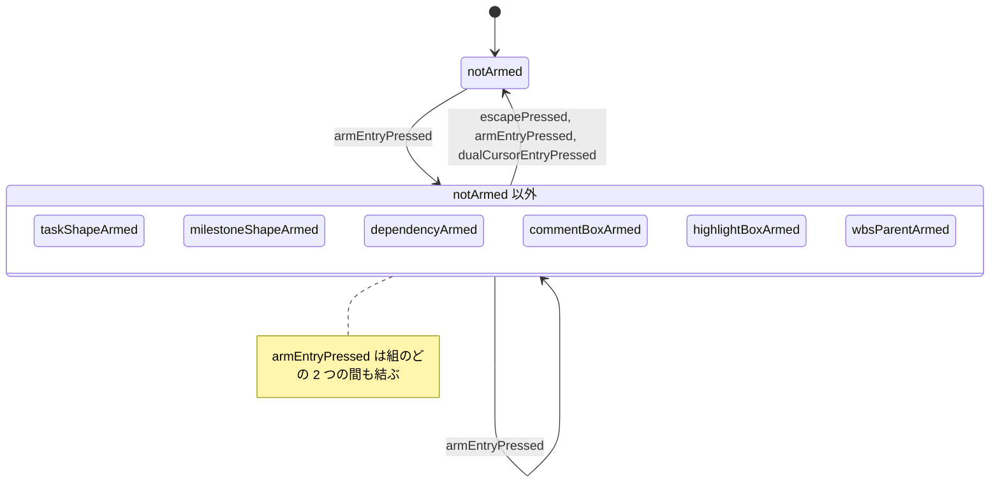
```mermaid
stateDiagram-v2
    direction TB
    [*] --> armModeStateMachine_notArmed
    armModeStateMachine_notArmed : notArmed
    state "notArmed 以外" as armModeStateMachine_group {
        armModeStateMachine_taskShapeArmed : taskShapeArmed
        armModeStateMachine_milestoneShapeArmed : milestoneShapeArmed
        armModeStateMachine_dependencyArmed : dependencyArmed
        armModeStateMachine_commentBoxArmed : commentBoxArmed
        armModeStateMachine_highlightBoxArmed : highlightBoxArmed
        armModeStateMachine_wbsParentArmed : wbsParentArmed
    }
    note right of armModeStateMachine_group : armEntryPressed は組のどの 2 つの間も結ぶ
    armModeStateMachine_group --> armModeStateMachine_notArmed : escapePressed, armEntryPressed, dualCursorEntryPressed
    armModeStateMachine_notArmed --> armModeStateMachine_group : armEntryPressed
    armModeStateMachine_group --> armModeStateMachine_group : armEntryPressed
```

| 出来事 | `notArmed` | `taskShapeArmed` | `milestoneShapeArmed` | `dependencyArmed` | `commentBoxArmed` | `highlightBoxArmed` | `wbsParentArmed` |
| --- | --- | --- | --- | --- | --- | --- | --- |
| `screen/escapePressed` | — | → `notArmed` [`isRungArmed`] それ以外 → — | → `notArmed` [`isRungArmed`] それ以外 → — | → `notArmed` [`isRungArmed`] それ以外 → — | → `notArmed` [`isRungArmed`] それ以外 → — | → `notArmed` [`isRungArmed`] それ以外 → — | → `notArmed` [`isRungArmed`] それ以外 → — |
| `screen/armEntryPressed` | → `{armKind}` | → `notArmed` [`isSameArm`] → `{armKind}` [not `isSameArm`] | → `notArmed` [`isSameArm`] → `{armKind}` [not `isSameArm`] | → `notArmed` [`isSameArm`] → `{armKind}` [not `isSameArm`] | → `notArmed` [`isSameArm`] → `{armKind}` [not `isSameArm`] | → `notArmed` [`isSameArm`] → `{armKind}` [not `isSameArm`] | → `notArmed` [`isSameArm`] → `{armKind}` [not `isSameArm`] |
| `screen/dualCursorEntryPressed` | — | → `notArmed` [`canEnterDualCursor`] それ以外 → — | → `notArmed` [`canEnterDualCursor`] それ以外 → — | → `notArmed` [`canEnterDualCursor`] それ以外 → — | → `notArmed` [`canEnterDualCursor`] それ以外 → — | → `notArmed` [`canEnterDualCursor`] それ以外 → — | → `notArmed` [`canEnterDualCursor`] それ以外 → — |

- `armModeStateMachine.notArmed` —— 初期。根拠 `AR-1`
- `armModeStateMachine.taskShapeArmed` —— 運ぶ値 `shapeKind`（`SH-1` ・ `SH-2` ・ `SH-3` ・ `SH-4`）。根拠 `AR-2` ・ `IC-23` ・ `IC-24` ・ `IC-25` ・ `IC-26`
- `armModeStateMachine.milestoneShapeArmed` —— 運ぶ値 `glyph`（`SH-5`）。根拠 `AR-3` ・ `IC-27`
- `armModeStateMachine.dependencyArmed` —— 根拠 `AR-4` ・ `IC-61`
- `armModeStateMachine.commentBoxArmed` —— 根拠 `AR-5` ・ `IC-35`
- `armModeStateMachine.highlightBoxArmed` —— 根拠 `AR-6` ・ `IC-36`
- `armModeStateMachine.wbsParentArmed` —— 根拠 `AR-7` ・ `IC-142`

表に無い出来事は `armModeStateMachine` を変えない（同じ参照）。

### 状態機械 `paletteDisplayStateMachine`

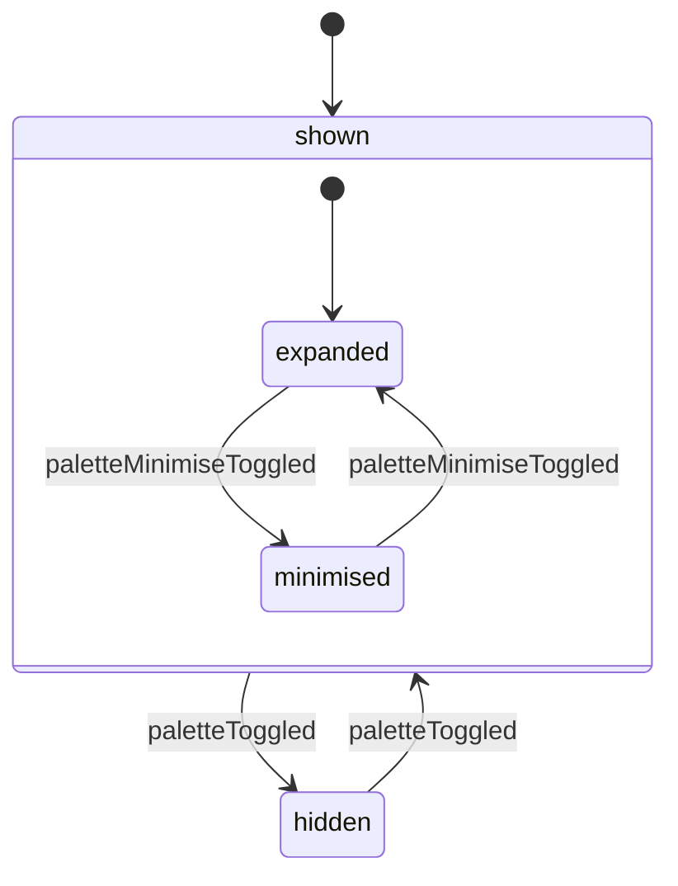
```mermaid
stateDiagram-v2
    direction TB
    [*] --> paletteDisplayStateMachine_shown
    paletteDisplayStateMachine_shown : shown
    state paletteDisplayStateMachine_shown {
        [*] --> paletteDisplayStateMachine_shown_expanded
        paletteDisplayStateMachine_shown_expanded : expanded
        paletteDisplayStateMachine_shown_minimised : minimised
        paletteDisplayStateMachine_shown_expanded --> paletteDisplayStateMachine_shown_minimised : paletteMinimiseToggled
        paletteDisplayStateMachine_shown_minimised --> paletteDisplayStateMachine_shown_expanded : paletteMinimiseToggled
    }
    paletteDisplayStateMachine_hidden : hidden
    paletteDisplayStateMachine_shown --> paletteDisplayStateMachine_hidden : paletteToggled
    paletteDisplayStateMachine_hidden --> paletteDisplayStateMachine_shown : paletteToggled
```

| 出来事 | `shown.expanded` | `shown.minimised` | `hidden` |
| --- | --- | --- | --- |
| `screen/paletteToggled` | → `hidden`（親 `shown` の升） | → `hidden`（親 `shown` の升） | → `shown` |
| `screen/paletteMinimiseToggled` | → `shown.minimised` | → `shown.expanded` | — |

- `paletteDisplayStateMachine.shown` —— 初期。根拠 `S-99e`
- `paletteDisplayStateMachine.shown.expanded` —— 初期。親 `paletteDisplayStateMachine.shown`。根拠 `S-200` ・ `FR-053`
- `paletteDisplayStateMachine.shown.minimised` —— 親 `paletteDisplayStateMachine.shown`。根拠 `S-200` ・ `IC-75`
- `paletteDisplayStateMachine.hidden` —— 根拠 `S-99e`

表に無い出来事は `paletteDisplayStateMachine` を変えない（同じ参照）。

### 状態機械 `milestoneListDisplayStateMachine`

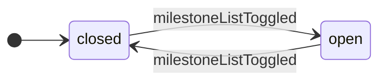
```mermaid
stateDiagram-v2
    direction LR
    [*] --> milestoneListDisplayStateMachine_closed
    milestoneListDisplayStateMachine_closed : closed
    milestoneListDisplayStateMachine_open : open
    milestoneListDisplayStateMachine_closed --> milestoneListDisplayStateMachine_open : milestoneListToggled
    milestoneListDisplayStateMachine_open --> milestoneListDisplayStateMachine_closed : milestoneListToggled
```

| 出来事 | `closed` | `open` |
| --- | --- | --- |
| `screen/milestoneListToggled` | → `open` | → `closed` |

- `milestoneListDisplayStateMachine.closed` —— 初期。根拠 `S-142` ・ `FR-053`
- `milestoneListDisplayStateMachine.open` —— 根拠 `S-142` ・ `IC-50`

表に無い出来事は `milestoneListDisplayStateMachine` を変えない（同じ参照）。

### 状態機械 `fullScreenModeStateMachine`

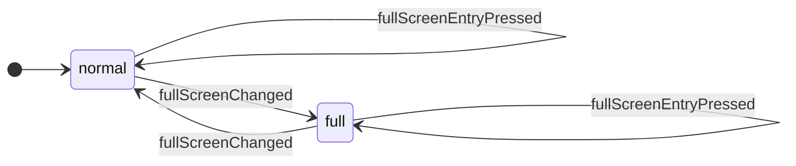
```mermaid
stateDiagram-v2
    direction LR
    [*] --> fullScreenModeStateMachine_normal
    fullScreenModeStateMachine_normal : normal
    fullScreenModeStateMachine_full : full
    fullScreenModeStateMachine_normal --> fullScreenModeStateMachine_normal : fullScreenEntryPressed
    fullScreenModeStateMachine_full --> fullScreenModeStateMachine_full : fullScreenEntryPressed
    fullScreenModeStateMachine_normal --> fullScreenModeStateMachine_full : fullScreenChanged
    fullScreenModeStateMachine_full --> fullScreenModeStateMachine_normal : fullScreenChanged
```

| 出来事 | `normal` | `full` |
| --- | --- | --- |
| `screen/fullScreenEntryPressed` | → 自己 / `askBrowserForFullScreen` | → 自己 / `askBrowserForFullScreen` |
| `screen/fullScreenChanged` | → `full` [`isFullScreen`] それ以外 → — | → `normal` [not `isFullScreen`] それ以外 → — |

- `fullScreenModeStateMachine.normal` —— 初期。根拠 `S-99f`
- `fullScreenModeStateMachine.full` —— 根拠 `S-99f` ・ `FR-071`

表に無い出来事は `fullScreenModeStateMachine` を変えない（同じ参照）。

### 状態機械 `openSurfaceStateMachine`

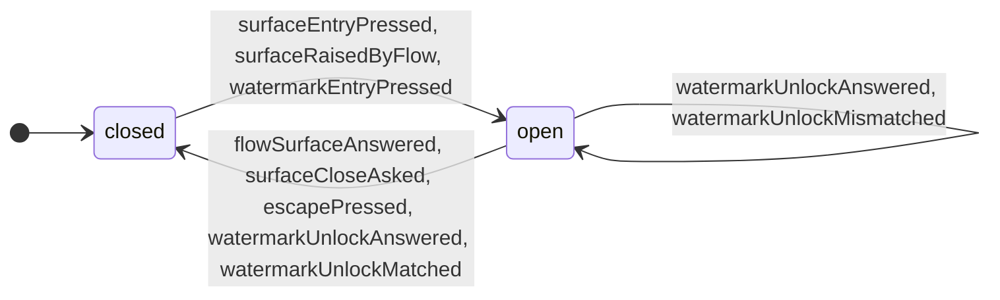
```mermaid
stateDiagram-v2
    direction LR
    [*] --> openSurfaceStateMachine_closed
    openSurfaceStateMachine_closed : closed
    openSurfaceStateMachine_open : open
    openSurfaceStateMachine_closed --> openSurfaceStateMachine_open : surfaceEntryPressed, surfaceRaisedByFlow, watermarkEntryPressed
    openSurfaceStateMachine_open --> openSurfaceStateMachine_closed : flowSurfaceAnswered, surfaceCloseAsked, escapePressed, watermarkUnlockAnswered, watermarkUnlockMatched
    openSurfaceStateMachine_open --> openSurfaceStateMachine_open : watermarkUnlockAnswered, watermarkUnlockMismatched
```

| 出来事 | `closed` | `open` |
| --- | --- | --- |
| `screen/surfaceEntryPressed` | → `open` | — |
| `screen/surfaceRaisedByFlow` | → `open` | — |
| `screen/flowSurfaceAnswered` | — | → `closed`（`tellFlowSurfaceClosed` を返さない —— 答えた後に「閉じた」が戻らない） |
| `screen/surfaceCloseAsked` | — | → `closed` [`isSurfaceTarget`] / `tellFlowSurfaceClosed` それ以外 → — |
| `screen/escapePressed` | — | → `closed` [`isRungSurface`] / `tellFlowSurfaceClosed` それ以外 → — |
| `screen/watermarkEntryPressed` | → `open` [`watermarkDisplayStateMachine.shown` にいる]（`surfaceName` は `U-60`） それ以外 → — | — |
| `screen/watermarkUnlockAnswered` | — | → 自己 [`isWatermarkUnlockSurface` & `isProceeding`] / `matchWatermarkUnlock` → `closed` [`isWatermarkUnlockSurface` & not `isProceeding`] それ以外 → — |
| `screen/watermarkUnlockMatched` | — | → `closed` [`watermarkDisplayStateMachine.shown` にいる & `isWatermarkUnlockSurface`] それ以外 → — |
| `screen/watermarkUnlockMismatched` | — | → 自己 [`isWatermarkUnlockSurface`] / `raiseNotice`（`RS-41`）（面を閉じない） それ以外 → — |

- `openSurfaceStateMachine.closed` —— 初期。根拠 `S-99g`
- `openSurfaceStateMachine.open` —— 運ぶ値 `surfaceName`（`U-49` ・ `U-54` ・ `U-56` ・ `U-60` ・ `U-61` ・ `U-62` ・ `U-65`）。根拠 `S-99g` ・ `IC-52`

表に無い出来事は `openSurfaceStateMachine` を変えない（同じ参照）。

### 状態機械 `watermarkDisplayStateMachine`

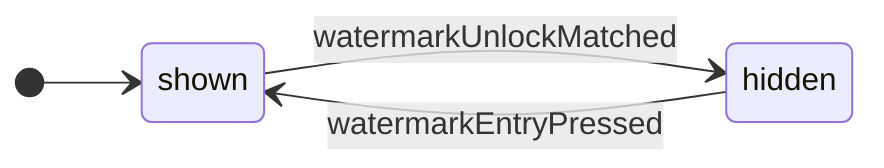
```mermaid
stateDiagram-v2
    direction LR
    [*] --> watermarkDisplayStateMachine_shown
    watermarkDisplayStateMachine_shown : shown
    watermarkDisplayStateMachine_hidden : hidden
    watermarkDisplayStateMachine_hidden --> watermarkDisplayStateMachine_shown : watermarkEntryPressed
    watermarkDisplayStateMachine_shown --> watermarkDisplayStateMachine_hidden : watermarkUnlockMatched
```

| 出来事 | `shown` | `hidden` |
| --- | --- | --- |
| `screen/watermarkEntryPressed` | — | → `shown` |
| `screen/watermarkUnlockMatched` | → `hidden` [`openSurfaceStateMachine.open` にいる & `isWatermarkUnlockSurface`] それ以外 → — | — |

- `watermarkDisplayStateMachine.shown` —— 初期。根拠 `S-144`
- `watermarkDisplayStateMachine.hidden` —— 根拠 `WM-8`

表に無い出来事は `watermarkDisplayStateMachine` を変えない（同じ参照）。

### 状態機械 `propertiesPanelContentStateMachine`

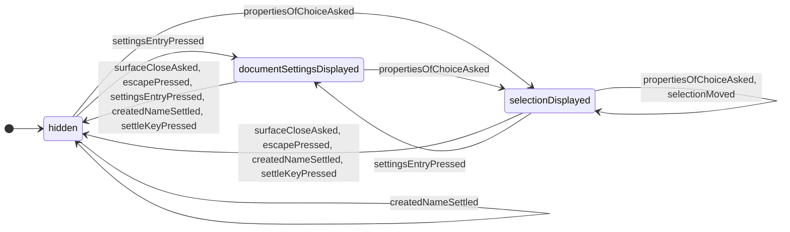
```mermaid
stateDiagram-v2
    direction LR
    [*] --> propertiesPanelContentStateMachine_hidden
    propertiesPanelContentStateMachine_hidden : hidden
    propertiesPanelContentStateMachine_selectionDisplayed : selectionDisplayed
    propertiesPanelContentStateMachine_documentSettingsDisplayed : documentSettingsDisplayed
    propertiesPanelContentStateMachine_selectionDisplayed --> propertiesPanelContentStateMachine_hidden : surfaceCloseAsked, escapePressed, createdNameSettled, settleKeyPressed
    propertiesPanelContentStateMachine_documentSettingsDisplayed --> propertiesPanelContentStateMachine_hidden : surfaceCloseAsked, escapePressed, settingsEntryPressed, createdNameSettled, settleKeyPressed
    propertiesPanelContentStateMachine_hidden --> propertiesPanelContentStateMachine_documentSettingsDisplayed : settingsEntryPressed
    propertiesPanelContentStateMachine_selectionDisplayed --> propertiesPanelContentStateMachine_documentSettingsDisplayed : settingsEntryPressed
    propertiesPanelContentStateMachine_hidden --> propertiesPanelContentStateMachine_selectionDisplayed : propertiesOfChoiceAsked
    propertiesPanelContentStateMachine_selectionDisplayed --> propertiesPanelContentStateMachine_selectionDisplayed : propertiesOfChoiceAsked, selectionMoved
    propertiesPanelContentStateMachine_documentSettingsDisplayed --> propertiesPanelContentStateMachine_selectionDisplayed : propertiesOfChoiceAsked
    propertiesPanelContentStateMachine_hidden --> propertiesPanelContentStateMachine_hidden : createdNameSettled
```

| 出来事 | `hidden` | `selectionDisplayed` | `documentSettingsDisplayed` |
| --- | --- | --- | --- |
| `screen/surfaceCloseAsked` | — | → `hidden` [`isPanelTarget`] それ以外 → — | → `hidden` [`isPanelTarget`] それ以外 → — |
| `screen/escapePressed` | — | → `hidden` [`isRungSurface` & `isPanelTopmost`] それ以外 → — | → `hidden` [`isRungSurface` & `isPanelTopmost`] それ以外 → — |
| `screen/settingsEntryPressed` | → `documentSettingsDisplayed` | → `documentSettingsDisplayed` | → `hidden`（直前の選択物の有無を問わない） |
| `screen/propertiesOfChoiceAsked` | → `selectionDisplayed` | → 自己（`subject` を書き換える） | → `selectionDisplayed` |
| `screen/selectionMoved` | — | → 自己 [`hasChoice`]（`subject` を書き換える） それ以外 → — | — |
| `screen/createdNameSettled` | → 自己 / `clearSelection` | → `hidden` / `clearSelection` | → `hidden` / `clearSelection` |
| `screen/settleKeyPressed` | — | → `hidden` [`hasNoSurfaceOrConfirmation` & `hasNoUnsettledEntry`] それ以外 → — | → `hidden` [`hasNoSurfaceOrConfirmation` & `hasNoUnsettledEntry`] それ以外 → — |

- `propertiesPanelContentStateMachine.hidden` —— 初期。根拠 `S-99h`
- `propertiesPanelContentStateMachine.selectionDisplayed` —— 運ぶ値 `subject`（選択と行の集合）。根拠 `S-99h` ・ `IR-2` ・ `FR-072`
- `propertiesPanelContentStateMachine.documentSettingsDisplayed` —— 根拠 `S-99h` ・ `FR-072` ・ `IC-17`

表に無い出来事は `propertiesPanelContentStateMachine` を変えない（同じ参照）。

### 状態機械 `dialogueFieldDisplayStateMachine`

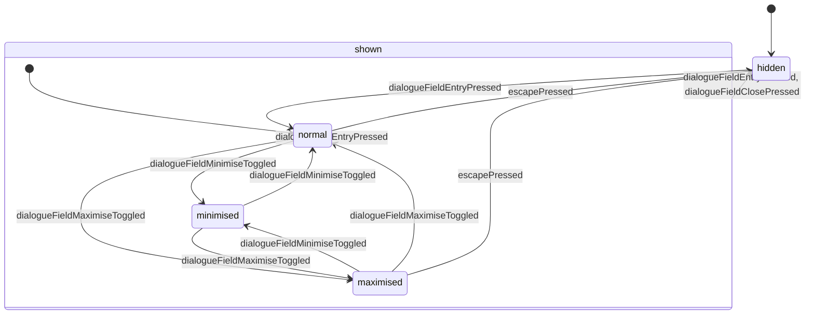
```mermaid
stateDiagram-v2
    direction TB
    [*] --> dialogueFieldDisplayStateMachine_hidden
    dialogueFieldDisplayStateMachine_hidden : hidden
    dialogueFieldDisplayStateMachine_shown : shown
    state dialogueFieldDisplayStateMachine_shown {
        [*] --> dialogueFieldDisplayStateMachine_shown_normal
        dialogueFieldDisplayStateMachine_shown_normal : normal
        dialogueFieldDisplayStateMachine_shown_minimised : minimised
        dialogueFieldDisplayStateMachine_shown_maximised : maximised
        dialogueFieldDisplayStateMachine_shown_normal --> dialogueFieldDisplayStateMachine_shown_minimised : dialogueFieldMinimiseToggled
        dialogueFieldDisplayStateMachine_shown_minimised --> dialogueFieldDisplayStateMachine_shown_normal : dialogueFieldMinimiseToggled
        dialogueFieldDisplayStateMachine_shown_maximised --> dialogueFieldDisplayStateMachine_shown_minimised : dialogueFieldMinimiseToggled
        dialogueFieldDisplayStateMachine_shown_normal --> dialogueFieldDisplayStateMachine_shown_maximised : dialogueFieldMaximiseToggled
        dialogueFieldDisplayStateMachine_shown_minimised --> dialogueFieldDisplayStateMachine_shown_maximised : dialogueFieldMaximiseToggled
        dialogueFieldDisplayStateMachine_shown_maximised --> dialogueFieldDisplayStateMachine_shown_normal : dialogueFieldMaximiseToggled
    }
    dialogueFieldDisplayStateMachine_hidden --> dialogueFieldDisplayStateMachine_shown_normal : dialogueFieldEntryPressed
    dialogueFieldDisplayStateMachine_shown --> dialogueFieldDisplayStateMachine_hidden : dialogueFieldEntryPressed, dialogueFieldClosePressed
    dialogueFieldDisplayStateMachine_shown --> dialogueFieldDisplayStateMachine_shown_normal : dialogueFieldEntryPressed
    dialogueFieldDisplayStateMachine_shown_normal --> dialogueFieldDisplayStateMachine_hidden : escapePressed
    dialogueFieldDisplayStateMachine_shown_maximised --> dialogueFieldDisplayStateMachine_hidden : escapePressed
```

| 出来事 | `hidden` | `shown.normal` | `shown.minimised` | `shown.maximised` |
| --- | --- | --- | --- | --- |
| `screen/dialogueFieldEntryPressed` | → `shown.normal`（`Agent API` が無効なら、同じ押しで有効にもなる（`agentApi/enablingAskedByDialogueField`）） | → `hidden` [`isAgentApiEnabled`] → `shown.normal` [not `isAgentApiEnabled`]（欄を通常で出し直す。同じ押しで `Agent API` が有効になるので欄が出る（`agentApi/enablingAskedByDialogueField`））（親 `shown` の升） | → `hidden` [`isAgentApiEnabled`] → `shown.normal` [not `isAgentApiEnabled`]（欄を通常で出し直す。同じ押しで `Agent API` が有効になるので欄が出る（`agentApi/enablingAskedByDialogueField`））（親 `shown` の升） | → `hidden` [`isAgentApiEnabled`] → `shown.normal` [not `isAgentApiEnabled`]（欄を通常で出し直す。同じ押しで `Agent API` が有効になるので欄が出る（`agentApi/enablingAskedByDialogueField`））（親 `shown` の升） |
| `screen/dialogueFieldMinimiseToggled` | — | → `shown.minimised` | → `shown.normal` | → `shown.minimised` |
| `screen/dialogueFieldMaximiseToggled` | — | → `shown.maximised` | → `shown.maximised` | → `shown.normal` |
| `screen/dialogueFieldClosePressed` | — | → `hidden`（親 `shown` の升） | → `hidden`（親 `shown` の升） | → `hidden`（親 `shown` の升） |
| `screen/escapePressed` | — | → `hidden` [`isRungDialogueField`]（`Agent API` は有効のまま（`FR-066`）） それ以外 → — | — | → `hidden` [`isRungDialogueField`]（`Agent API` は有効のまま（`FR-066`）） それ以外 → — |

- `dialogueFieldDisplayStateMachine.hidden` —— 初期。根拠 `S-99i` ・ `FR-066`
- `dialogueFieldDisplayStateMachine.shown` —— 根拠 `S-99i` ・ `FR-066`
- `dialogueFieldDisplayStateMachine.shown.normal` —— 初期。親 `dialogueFieldDisplayStateMachine.shown`。根拠 `S-99i` ・ `WB-1`
- `dialogueFieldDisplayStateMachine.shown.minimised` —— 親 `dialogueFieldDisplayStateMachine.shown`。根拠 `S-99i` ・ `WB-2` ・ `IC-129`
- `dialogueFieldDisplayStateMachine.shown.maximised` —— 親 `dialogueFieldDisplayStateMachine.shown`。根拠 `S-99i` ・ `WB-3` ・ `IC-130`

表に無い出来事は `dialogueFieldDisplayStateMachine` を変えない（同じ参照）。

### 状態機械 `dualCursorModeStateMachine`

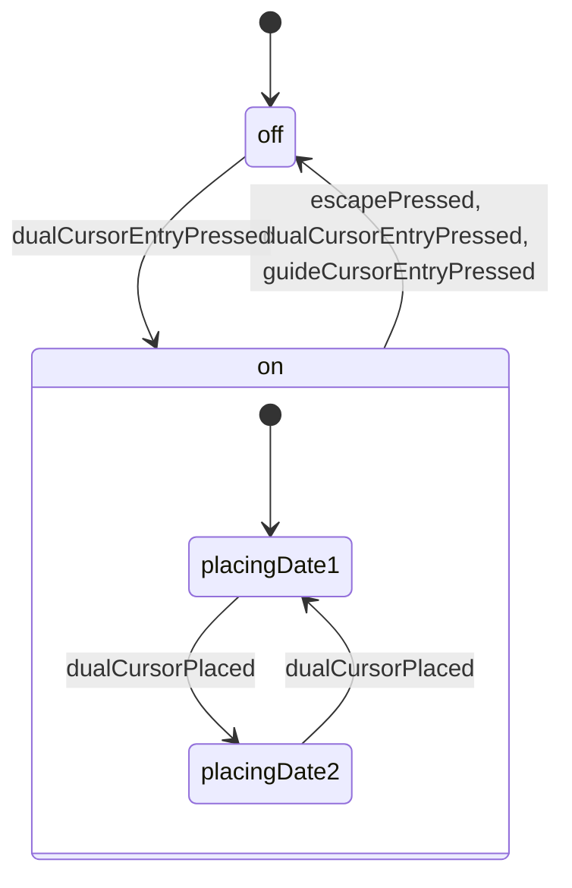
```mermaid
stateDiagram-v2
    direction TB
    [*] --> dualCursorModeStateMachine_off
    dualCursorModeStateMachine_off : off
    dualCursorModeStateMachine_on : on
    state dualCursorModeStateMachine_on {
        [*] --> dualCursorModeStateMachine_on_placingDate1
        dualCursorModeStateMachine_on_placingDate1 : placingDate1
        dualCursorModeStateMachine_on_placingDate2 : placingDate2
        dualCursorModeStateMachine_on_placingDate1 --> dualCursorModeStateMachine_on_placingDate2 : dualCursorPlaced
        dualCursorModeStateMachine_on_placingDate2 --> dualCursorModeStateMachine_on_placingDate1 : dualCursorPlaced
    }
    dualCursorModeStateMachine_on --> dualCursorModeStateMachine_off : escapePressed, dualCursorEntryPressed, guideCursorEntryPressed
    dualCursorModeStateMachine_off --> dualCursorModeStateMachine_on : dualCursorEntryPressed
```

| 出来事 | `off` | `on.placingDate1` | `on.placingDate2` |
| --- | --- | --- | --- |
| `screen/escapePressed` | — | → `off` [`isRungDualCursor`] / `storeClearedDualCursor` それ以外 → —（親 `on` の升） | → `off` [`isRungDualCursor`] / `storeClearedDualCursor` それ以外 → —（親 `on` の升） |
| `screen/dualCursorEntryPressed` | → `on` [`hasDaysToPlace`] / `storePlacedDualCursorClearingGuide` それ以外 → — | → `off` / `storeClearedDualCursor`（親 `on` の升） | → `off` / `storeClearedDualCursor`（親 `on` の升） |
| `screen/guideCursorEntryPressed` | — | → `off` / `storeClearedDualCursor`（親 `on` の升） | → `off` / `storeClearedDualCursor`（親 `on` の升） |
| `screen/dualCursorPlaced` | — | → `on.placingDate2` / `storeFixedDate1` | → `on.placingDate1` / `storeFixedDate2` |

- `dualCursorModeStateMachine.off` —— 初期。根拠 `DC-1`
- `dualCursorModeStateMachine.on` —— 根拠 `DC-1` ・ `PTD-2`
- `dualCursorModeStateMachine.on.placingDate1` —— 初期。親 `dualCursorModeStateMachine.on`。根拠 `DC-1`
- `dualCursorModeStateMachine.on.placingDate2` —— 親 `dualCursorModeStateMachine.on`。根拠 `DC-2` ・ `DC-8`

表に無い出来事は `dualCursorModeStateMachine` を変えない（同じ参照）。

### 状態機械 `scaleMessageDisplayStateMachine`

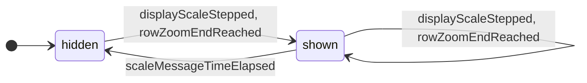
```mermaid
stateDiagram-v2
    direction LR
    [*] --> scaleMessageDisplayStateMachine_hidden
    scaleMessageDisplayStateMachine_hidden : hidden
    scaleMessageDisplayStateMachine_shown : shown
    scaleMessageDisplayStateMachine_hidden --> scaleMessageDisplayStateMachine_shown : displayScaleStepped, rowZoomEndReached
    scaleMessageDisplayStateMachine_shown --> scaleMessageDisplayStateMachine_shown : displayScaleStepped, rowZoomEndReached
    scaleMessageDisplayStateMachine_shown --> scaleMessageDisplayStateMachine_hidden : scaleMessageTimeElapsed
```

| 出来事 | `hidden` | `shown` |
| --- | --- | --- |
| `screen/displayScaleStepped` | → `shown` / `startScaleMessageTimer` | → 自己 / `restartScaleMessageTimer`（中身を書き換える） |
| `screen/rowZoomEndReached` | → `shown` / `startScaleMessageTimer` | → 自己 / `restartScaleMessageTimer`（中身を書き換える） |
| `screen/scaleMessageTimeElapsed` | — | → `hidden` |

- `scaleMessageDisplayStateMachine.hidden` —— 初期。根拠 `SE-1`
- `scaleMessageDisplayStateMachine.shown` —— 運ぶ値 `percent` ／ `end`（`max` ・ `min` ・ なし）。根拠 `SE-2` ・ `ZE-5` ・ `S-244`

表に無い出来事は `scaleMessageDisplayStateMachine` を変えない（同じ参照）。

### 状態機械 `tooltipDisplayStateMachine`

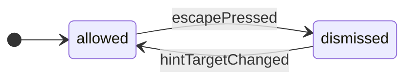
```mermaid
stateDiagram-v2
    direction LR
    [*] --> tooltipDisplayStateMachine_allowed
    tooltipDisplayStateMachine_allowed : allowed
    tooltipDisplayStateMachine_dismissed : dismissed
    tooltipDisplayStateMachine_allowed --> tooltipDisplayStateMachine_dismissed : escapePressed
    tooltipDisplayStateMachine_dismissed --> tooltipDisplayStateMachine_allowed : hintTargetChanged
```

| 出来事 | `allowed` | `dismissed` |
| --- | --- | --- |
| `screen/escapePressed` | → `dismissed` [`isRungTooltip`] それ以外 → — | — |
| `screen/hintTargetChanged` | — | → `allowed` |

- `tooltipDisplayStateMachine.allowed` —— 初期。根拠 `IN-3`
- `tooltipDisplayStateMachine.dismissed` —— 根拠 `IN-3` ・ `IN-4`

表に無い出来事は `tooltipDisplayStateMachine` を変えない（同じ参照）。

### 状態機械 `searchPanelDisplayStateMachine`

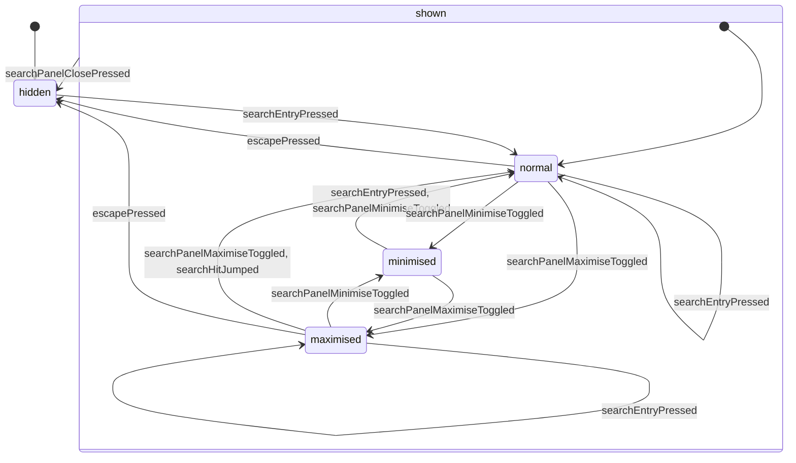
```mermaid
stateDiagram-v2
    direction TB
    [*] --> searchPanelDisplayStateMachine_hidden
    searchPanelDisplayStateMachine_hidden : hidden
    searchPanelDisplayStateMachine_shown : shown
    state searchPanelDisplayStateMachine_shown {
        [*] --> searchPanelDisplayStateMachine_shown_normal
        searchPanelDisplayStateMachine_shown_normal : normal
        searchPanelDisplayStateMachine_shown_minimised : minimised
        searchPanelDisplayStateMachine_shown_maximised : maximised
        searchPanelDisplayStateMachine_shown_normal --> searchPanelDisplayStateMachine_shown_normal : searchEntryPressed
        searchPanelDisplayStateMachine_shown_minimised --> searchPanelDisplayStateMachine_shown_normal : searchEntryPressed, searchPanelMinimiseToggled
        searchPanelDisplayStateMachine_shown_maximised --> searchPanelDisplayStateMachine_shown_maximised : searchEntryPressed
        searchPanelDisplayStateMachine_shown_normal --> searchPanelDisplayStateMachine_shown_minimised : searchPanelMinimiseToggled
        searchPanelDisplayStateMachine_shown_maximised --> searchPanelDisplayStateMachine_shown_minimised : searchPanelMinimiseToggled
        searchPanelDisplayStateMachine_shown_normal --> searchPanelDisplayStateMachine_shown_maximised : searchPanelMaximiseToggled
        searchPanelDisplayStateMachine_shown_minimised --> searchPanelDisplayStateMachine_shown_maximised : searchPanelMaximiseToggled
        searchPanelDisplayStateMachine_shown_maximised --> searchPanelDisplayStateMachine_shown_normal : searchPanelMaximiseToggled, searchHitJumped
    }
    searchPanelDisplayStateMachine_hidden --> searchPanelDisplayStateMachine_shown_normal : searchEntryPressed
    searchPanelDisplayStateMachine_shown --> searchPanelDisplayStateMachine_hidden : searchPanelClosePressed
    searchPanelDisplayStateMachine_shown_normal --> searchPanelDisplayStateMachine_hidden : escapePressed
    searchPanelDisplayStateMachine_shown_maximised --> searchPanelDisplayStateMachine_hidden : escapePressed
```

| 出来事 | `hidden` | `shown.normal` | `shown.minimised` | `shown.maximised` |
| --- | --- | --- | --- | --- |
| `screen/searchEntryPressed` | → `shown.normal` / `focusSearchWord` | → 自己 / `focusSearchWord` | → `shown.normal` / `focusSearchWord` | → 自己 / `focusSearchWord` |
| `screen/searchPanelMinimiseToggled` | — | → `shown.minimised` | → `shown.normal` | → `shown.minimised` |
| `screen/searchPanelMaximiseToggled` | — | → `shown.maximised` | → `shown.maximised` | → `shown.normal` |
| `screen/searchPanelClosePressed` | — | → `hidden`（親 `shown` の升） | → `hidden`（親 `shown` の升） | → `hidden`（親 `shown` の升） |
| `screen/escapePressed` | — | → `hidden` [`isRungSearchPanel`] それ以外 → — | — | → `hidden` [`isRungSearchPanel`] それ以外 → — |
| `screen/searchHitJumped` | — | — | — | → `shown.normal` |

- `searchPanelDisplayStateMachine.hidden` —— 初期。根拠 `S-442`
- `searchPanelDisplayStateMachine.shown` —— 根拠 `S-442` ・ `FR-151`
- `searchPanelDisplayStateMachine.shown.normal` —— 初期。親 `searchPanelDisplayStateMachine.shown`。根拠 `S-442` ・ `SV-9`
- `searchPanelDisplayStateMachine.shown.minimised` —— 親 `searchPanelDisplayStateMachine.shown`。根拠 `S-442` ・ `SV-12` ・ `IC-129`
- `searchPanelDisplayStateMachine.shown.maximised` —— 親 `searchPanelDisplayStateMachine.shown`。根拠 `S-442` ・ `SV-13` ・ `IC-130`

表に無い出来事は `searchPanelDisplayStateMachine` を変えない（同じ参照）。

### 状態機械 `helpDisplayStateMachine`

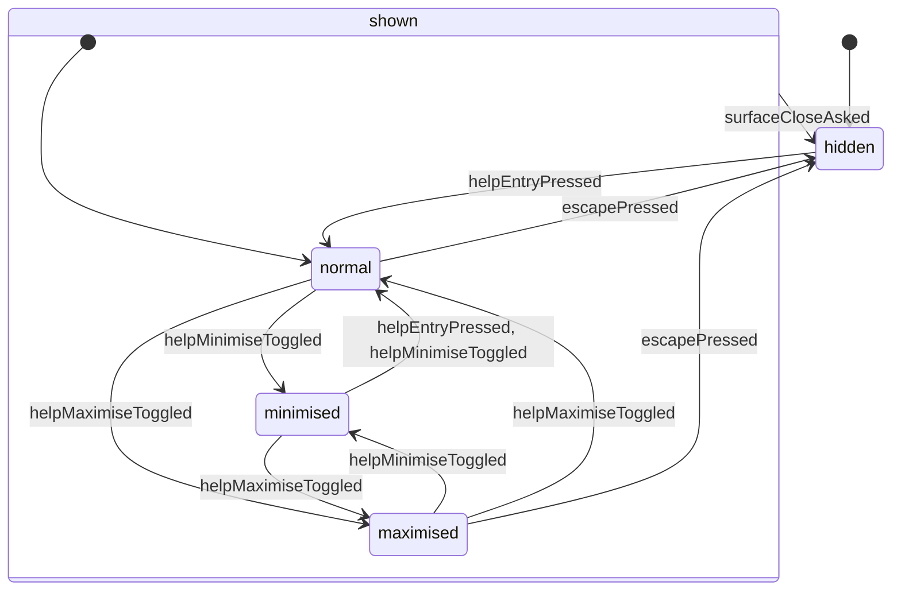
```mermaid
stateDiagram-v2
    direction TB
    [*] --> helpDisplayStateMachine_hidden
    helpDisplayStateMachine_hidden : hidden
    helpDisplayStateMachine_shown : shown
    state helpDisplayStateMachine_shown {
        [*] --> helpDisplayStateMachine_shown_normal
        helpDisplayStateMachine_shown_normal : normal
        helpDisplayStateMachine_shown_minimised : minimised
        helpDisplayStateMachine_shown_maximised : maximised
        helpDisplayStateMachine_shown_minimised --> helpDisplayStateMachine_shown_normal : helpEntryPressed, helpMinimiseToggled
        helpDisplayStateMachine_shown_normal --> helpDisplayStateMachine_shown_minimised : helpMinimiseToggled
        helpDisplayStateMachine_shown_maximised --> helpDisplayStateMachine_shown_minimised : helpMinimiseToggled
        helpDisplayStateMachine_shown_normal --> helpDisplayStateMachine_shown_maximised : helpMaximiseToggled
        helpDisplayStateMachine_shown_minimised --> helpDisplayStateMachine_shown_maximised : helpMaximiseToggled
        helpDisplayStateMachine_shown_maximised --> helpDisplayStateMachine_shown_normal : helpMaximiseToggled
    }
    helpDisplayStateMachine_hidden --> helpDisplayStateMachine_shown_normal : helpEntryPressed
    helpDisplayStateMachine_shown --> helpDisplayStateMachine_hidden : surfaceCloseAsked
    helpDisplayStateMachine_shown_normal --> helpDisplayStateMachine_hidden : escapePressed
    helpDisplayStateMachine_shown_maximised --> helpDisplayStateMachine_hidden : escapePressed
```

| 出来事 | `hidden` | `shown.normal` | `shown.minimised` | `shown.maximised` |
| --- | --- | --- | --- | --- |
| `screen/helpEntryPressed` | → `shown.normal` / `seedHelpLanguage` | — | → `shown.normal` | — |
| `screen/helpMinimiseToggled` | — | → `shown.minimised` | → `shown.normal` | → `shown.minimised` |
| `screen/helpMaximiseToggled` | — | → `shown.maximised` | → `shown.maximised` | → `shown.normal` |
| `screen/surfaceCloseAsked` | — | → `hidden` [`isHelpTarget`] それ以外 → —（親 `shown` の升） | → `hidden` [`isHelpTarget`] それ以外 → —（親 `shown` の升） | → `hidden` [`isHelpTarget`] それ以外 → —（親 `shown` の升） |
| `screen/escapePressed` | — | → `hidden` [`isRungHelp`] それ以外 → — | — | → `hidden` [`isRungHelp`] それ以外 → — |

- `helpDisplayStateMachine.hidden` —— 初期。根拠 `S-435`
- `helpDisplayStateMachine.shown` —— 根拠 `S-435` ・ `FR-036`
- `helpDisplayStateMachine.shown.normal` —— 初期。親 `helpDisplayStateMachine.shown`。根拠 `S-435` ・ `WB-1`
- `helpDisplayStateMachine.shown.minimised` —— 親 `helpDisplayStateMachine.shown`。根拠 `S-435` ・ `WB-2` ・ `IC-129`
- `helpDisplayStateMachine.shown.maximised` —— 親 `helpDisplayStateMachine.shown`。根拠 `S-435` ・ `WB-3` ・ `IC-130`

表に無い出来事は `helpDisplayStateMachine` を変えない（同じ参照）。

### 状態機械 `landingMarkDisplayStateMachine`

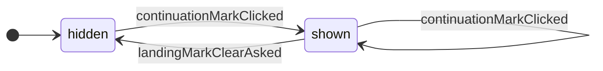
```mermaid
stateDiagram-v2
    direction LR
    [*] --> landingMarkDisplayStateMachine_hidden
    landingMarkDisplayStateMachine_hidden : hidden
    landingMarkDisplayStateMachine_shown : shown
    landingMarkDisplayStateMachine_hidden --> landingMarkDisplayStateMachine_shown : continuationMarkClicked
    landingMarkDisplayStateMachine_shown --> landingMarkDisplayStateMachine_shown : continuationMarkClicked
    landingMarkDisplayStateMachine_shown --> landingMarkDisplayStateMachine_hidden : landingMarkClearAsked
```

| 出来事 | `hidden` | `shown` |
| --- | --- | --- |
| `screen/continuationMarkClicked` | → `shown` | → 自己（中身を書き換える） |
| `screen/landingMarkClearAsked` | — | → `hidden` |

- `landingMarkDisplayStateMachine.hidden` —— 初期。根拠 `EL-17`
- `landingMarkDisplayStateMachine.shown` —— 運ぶ値 `landedLink`（印を付けた依存線の先行と後続の `UID`） ／ `landedTaskUid`（印の先の端の `Task` の `UID`）。根拠 `EL-16` ・ `EL-19`

表に無い出来事は `landingMarkDisplayStateMachine` を変えない（同じ参照）。

## 通知（`notices`）

**表 T-286 — 通知の状態機械**

本表は、出来事の定義・根の値・状態機械ごとの状態遷移表と状態の一覧からなる。  
状態遷移表の行はその状態機械を動かす出来事、列はその状態機械の葉の状態、升は「→ 次の状態 [ガード] / 副作用」である。  
升の「—」は変化なし（同じ参照）を表す。  
ガードの付いた枝がすべての場合を覆わない升には「それ以外 → —」を添え、どの場合に何が起きるかを升ごとに言い切る。  
親の状態に置いた升は、その子のすべての列に同じ升を刷り、「親 … の升」と書き添える。

### 通知の出来事

| 出来事 | どこから来るか | 運ぶ値 | 動かすもの |
| --- | --- | --- | --- |
| `notices/noticeRaised` | 副作用の結果（副作用 `raiseNotice` の実行。ほかの領域の遷移とシェルの流れが返す）: `FR-076` ・ `NT-3` | `reason`（表 T-233 の `RS-` の行、または 表 T-220 の行） ／ `affectedCount`（無いこともある） | `noticeDisplayStateMachine` |
| `notices/newestNoticeDismissAsked` | 入力（`Esc`（`IN-4` の第 1 段）／ `Enter`（`SK-19` の第 1 段）。段は呼び手が決め、同じ入力のほかの何よりも先に進める）: `NT-8` ・ `IN-4` ・ `SK-19` | — | `noticeDisplayStateMachine` |
| `notices/noticeDismissPressed` | 入力（1 つの通知の `OK` の入口を押して離した）: `NT-8` | `reason`（押された通知の理由。`NT-3` の束ねで 1 つの理由に 1 枚なので、理由が通知を 1 つに決める） | `noticeDisplayStateMachine` |
| `notices/documentReplaced` | 副作用の結果（`WS-6` の差し替えが済み、`WS-7` の配りが始まる）: `WS-6` ・ `WS-7` | — | `changeDeliveryStateMachine` |
| `notices/changeDelivered` | 副作用の結果（`WS-7` の配りが終わった）: `WS-7` ・ `AG-6` | `silentWatchers`（答えを返さなかった配り先の数） | `changeDeliveryStateMachine` |

### 根 `notices` の値

運ぶ値: —。  
根拠: `FR-076`。

根の運ぶ値だけを書き換える出来事は無い。

**図 F-029 — 通知の状態遷移**

状態機械ごとに 1 つの図に分け、その状態機械の節に置く。状態機械どうしは直交する。  
矢印のラベルは出来事のキーだけであり、ガード・副作用は同じ節の状態遷移表が持つ。  
⚠️ 図は畳んである —— 同じ出来事・ガード・先・副作用の升が 3 つ以上の兄弟の種類のどの 2 つの間も結ぶか、それらのどれからも同じ 1 つの種類へ出るか、同じ 1 つの種類から入るときは、兄弟を 1 つの箱に囲み、その遷移を箱から 1 本だけ描く（どの 2 つの間も結ぶ遷移は、箱の注に出来事のキーを書く）。  
⭐ 遷移の全数は 表 T-286 の状態遷移表が持つ。

### 状態機械 `noticeDisplayStateMachine`

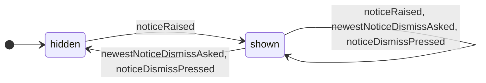
```mermaid
stateDiagram-v2
    direction LR
    [*] --> noticeDisplayStateMachine_hidden
    noticeDisplayStateMachine_hidden : hidden
    noticeDisplayStateMachine_shown : shown
    noticeDisplayStateMachine_hidden --> noticeDisplayStateMachine_shown : noticeRaised
    noticeDisplayStateMachine_shown --> noticeDisplayStateMachine_shown : noticeRaised, newestNoticeDismissAsked, noticeDismissPressed
    noticeDisplayStateMachine_shown --> noticeDisplayStateMachine_hidden : newestNoticeDismissAsked, noticeDismissPressed
```

| 出来事 | `hidden` | `shown` |
| --- | --- | --- |
| `notices/noticeRaised` | → `shown`（1 枚） | → 自己 [`isSameReasonStanding`]（その 1 枚の件数を増やし、いちばん新しい位置へ動かす） → 自己 [not `isSameReasonStanding`]（いちばん新しいものとして足す。枚数に上限を置かない） |
| `notices/newestNoticeDismissAsked` | — | → `hidden` [`isOnlyOneStanding`] → 自己 [not `isOnlyOneStanding`]（いちばん新しいものを除く） |
| `notices/noticeDismissPressed` | — | → `hidden` [`isLeavingNone`] → 自己 [`isLeavingSome`]（押されたものを除く） それ以外 → — |

- `noticeDisplayStateMachine.hidden` —— 初期。根拠 `NT-8` ・ `IN-4`
- `noticeDisplayStateMachine.shown` —— 運ぶ値 `standing`（出ている通知の列。古い順。1 つは理由と件数）。根拠 `FR-076` ・ `NT-3` ・ `NT-8` ・ `IN-4` ・ `SK-19` ・ `IR-3`

表に無い出来事は `noticeDisplayStateMachine` を変えない（同じ参照）。

### 状態機械 `changeDeliveryStateMachine`

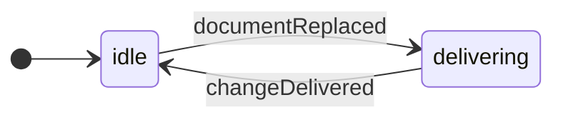
```mermaid
stateDiagram-v2
    direction LR
    [*] --> changeDeliveryStateMachine_idle
    changeDeliveryStateMachine_idle : idle
    changeDeliveryStateMachine_delivering : delivering
    changeDeliveryStateMachine_idle --> changeDeliveryStateMachine_delivering : documentReplaced
    changeDeliveryStateMachine_delivering --> changeDeliveryStateMachine_idle : changeDelivered
```

| 出来事 | `idle` | `delivering` |
| --- | --- | --- |
| `notices/documentReplaced` | → `delivering` | — |
| `notices/changeDelivered` | — | → `idle` [not `hasSilentWatcher`] → `idle` [`hasSilentWatcher`] / `raiseNotice`（`RS-23`） |

- `changeDeliveryStateMachine.idle` —— 初期。根拠 `WS-7`
- `changeDeliveryStateMachine.delivering` —— 根拠 `WS-2` ・ `RS-9` ・ `CA-3`

表に無い出来事は `changeDeliveryStateMachine` を変えない（同じ参照）。

## 身振り（`gesture`）

**表 T-289 — 身振りの状態機械**

本表は、出来事の定義・根の値・状態機械ごとの状態遷移表と状態の一覧からなる。  
状態遷移表の行はその状態機械を動かす出来事、列はその状態機械の葉の状態、升は「→ 次の状態 [ガード] / 副作用」である。  
升の「—」は変化なし（同じ参照）を表す。  
ガードの付いた枝がすべての場合を覆わない升には「それ以外 → —」を添え、どの場合に何が起きるかを升ごとに言い切る。  
親の状態に置いた升は、その子のすべての列に同じ升を刷り、「親 … の升」と書き添える。

### 身振りの出来事

| 出来事 | どこから来るか | 運ぶ値 | 動かすもの |
| --- | --- | --- | --- |
| `gesture/pointerPressed` | 入力（ポインタを押した。入力の源は、身振りを持つあいだ次の押下を報告しない）: `CS-2` ・ `IN-1` | `pressRow`（`PTD-7` ・ `PTD-1` ・ `PTD-2` ・ `PTD-3` ・ `PTD-4` ・ `PTD-4a` ・ `PTD-5`。押下の行。呼び手が構え・`Dual Cursor`・選択から詰める。`PTD-7`（選択を写す）は文書を変える押下である） ／ `pressedOn`（押したもの —— 当たった掴みか、画面の場所（入口・掴み帯・パネルの境界・行の掴み代・つまみ）。座標は運ばない） | `pointerPressStateMachine` ・ `rowGrabStateMachine` |
| `gesture/pointerReleased` | 入力（押していたボタンを離した）: `IN-1` ・ `CS-2` | — | `pointerPressStateMachine` ・ `rowGrabStateMachine` |
| `gesture/pressInterrupted` | 入力（`Esc`（`IN-4` の進行中のドラッグの段。段は呼び手が決める）／ 離す前にポインタが失われた（`IN-1a`））: `IN-1` ・ `IN-1a` ・ `IN-4` | — | `pointerPressStateMachine` ・ `rowGrabStateMachine` |
| `gesture/rowGrabAxisSettled` | 入力（行を掴んだまま、押した点から初めて閾値を超えて動いた。どちらの向きが先かは呼び手が判じる）: `HF-15` ・ `S-208` | `axis`（`HF-15`。`position`（上下）か `depth`（左右）） | `rowGrabStateMachine` |
| `gesture/entryRepeatTimeElapsed` | 時間（`startEntryRepeat` の待ち（`S-172`）か、`repeatHeldEntry` の待ち（`S-173`）が明けた）: `FR-018` ・ `S-172` ・ `S-173` | — | `pointerPressStateMachine` |

### 根 `gesture` の値

運ぶ値: —。  
根拠: `CS-2`。

根の運ぶ値だけを書き換える出来事は無い。

**図 F-035 — 身振りの状態遷移**

状態機械ごとに 1 つの図に分け、その状態機械の節に置く。状態機械どうしは直交する。  
矢印のラベルは出来事のキーだけであり、ガード・副作用は同じ節の状態遷移表が持つ。  
⚠️ 図は畳んである —— 同じ出来事・ガード・先・副作用の升が 3 つ以上の兄弟の種類のどの 2 つの間も結ぶか、それらのどれからも同じ 1 つの種類へ出るか、同じ 1 つの種類から入るときは、兄弟を 1 つの箱に囲み、その遷移を箱から 1 本だけ描く（どの 2 つの間も結ぶ遷移は、箱の注に出来事のキーを書く）。  
⭐ 遷移の全数は 表 T-289 の状態遷移表が持つ。

### 状態機械 `pointerPressStateMachine`

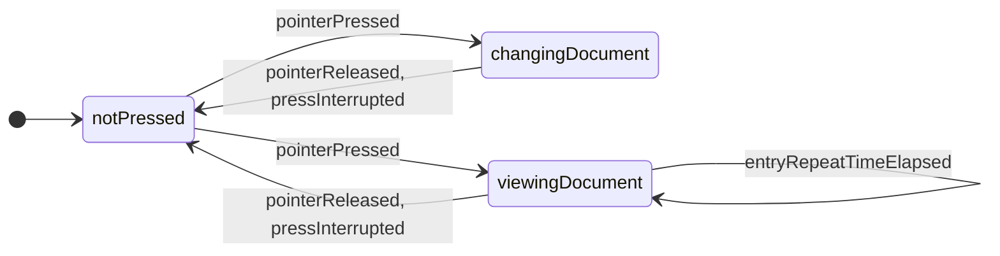
```mermaid
stateDiagram-v2
    direction LR
    [*] --> pointerPressStateMachine_notPressed
    pointerPressStateMachine_notPressed : notPressed
    pointerPressStateMachine_changingDocument : changingDocument
    pointerPressStateMachine_viewingDocument : viewingDocument
    pointerPressStateMachine_notPressed --> pointerPressStateMachine_changingDocument : pointerPressed
    pointerPressStateMachine_notPressed --> pointerPressStateMachine_viewingDocument : pointerPressed
    pointerPressStateMachine_changingDocument --> pointerPressStateMachine_notPressed : pointerReleased, pressInterrupted
    pointerPressStateMachine_viewingDocument --> pointerPressStateMachine_notPressed : pointerReleased, pressInterrupted
    pointerPressStateMachine_viewingDocument --> pointerPressStateMachine_viewingDocument : entryRepeatTimeElapsed
```

| 出来事 | `notPressed` | `changingDocument` | `viewingDocument` |
| --- | --- | --- | --- |
| `gesture/pointerPressed` | → `changingDocument` [`isDocumentChangingPress`] → `viewingDocument` [not `isDocumentChangingPress` & `isOnRepeatingEntry`] / `startEntryRepeat`（前の待ちを捨てて張り直す） → `viewingDocument` [not `isDocumentChangingPress` & not `isOnRepeatingEntry`] | — | — |
| `gesture/pointerReleased` | — | → `notPressed` | → `notPressed` |
| `gesture/pressInterrupted` | — | → `notPressed` [`isOnPaletteBand`] / `restorePaletteCorner`（パレットを押した時点の角へ戻す） → `notPressed` [not `isOnPaletteBand`] | → `notPressed` [`isOnPaletteBand`] / `restorePaletteCorner`（パレットを押した時点の角へ戻す） → `notPressed` [not `isOnPaletteBand`] |
| `gesture/entryRepeatTimeElapsed` | — | — | → 自己 [`isOnRepeatingEntry`] / `repeatHeldEntry`（入口の命令をもう 1 度実行し、`S-173` の待ちを張る） それ以外 → — |

- `pointerPressStateMachine.notPressed` —— 初期。根拠 `IN-1` ・ `AG-9`
- `pointerPressStateMachine.changingDocument` —— 運ぶ値 `pressRow`（押した時点の押下の行） ／ `pressedOn`（押したもの）。根拠 `AG-9` ・ `WS-2` ・ `CS-2` ・ `IN-4` ・ `UN-4`
- `pointerPressStateMachine.viewingDocument` —— 運ぶ値 `pressRow`（押した時点の押下の行） ／ `pressedOn`（押したもの）。根拠 `AG-9` ・ `UN-8` ・ `UN-9` ・ `IN-4` ・ `FR-018`

表に無い出来事は `pointerPressStateMachine` を変えない（同じ参照）。

### 状態機械 `rowGrabStateMachine`

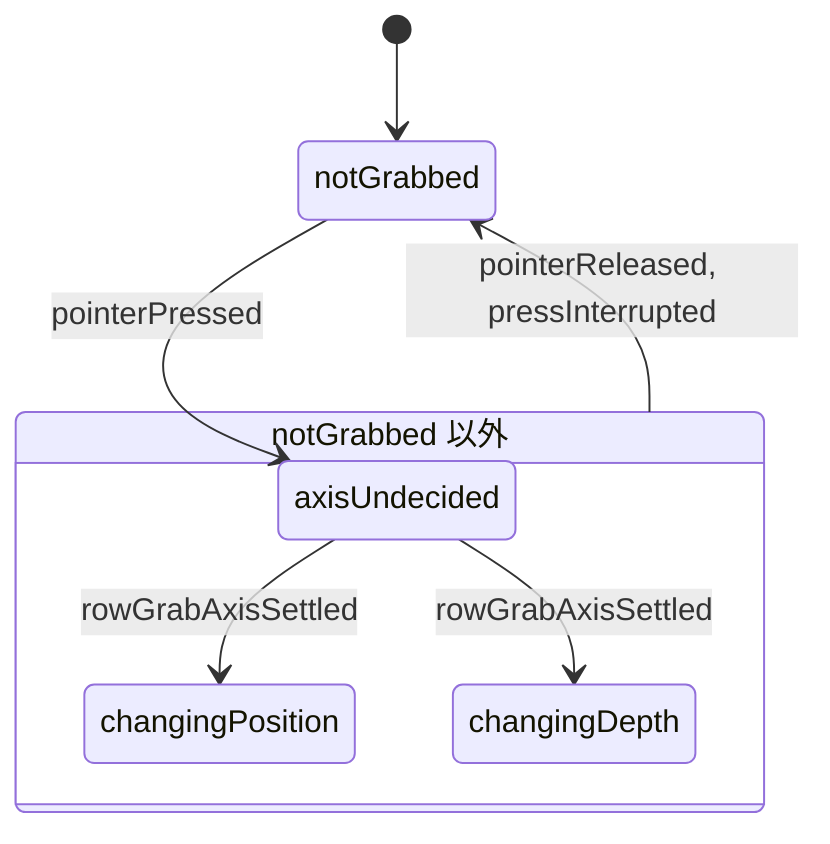
```mermaid
stateDiagram-v2
    direction TB
    [*] --> rowGrabStateMachine_notGrabbed
    rowGrabStateMachine_notGrabbed : notGrabbed
    state "notGrabbed 以外" as rowGrabStateMachine_group {
        rowGrabStateMachine_axisUndecided : axisUndecided
        rowGrabStateMachine_changingPosition : changingPosition
        rowGrabStateMachine_changingDepth : changingDepth
    }
    rowGrabStateMachine_group --> rowGrabStateMachine_notGrabbed : pointerReleased, pressInterrupted
    rowGrabStateMachine_notGrabbed --> rowGrabStateMachine_axisUndecided : pointerPressed
    rowGrabStateMachine_axisUndecided --> rowGrabStateMachine_changingPosition : rowGrabAxisSettled
    rowGrabStateMachine_axisUndecided --> rowGrabStateMachine_changingDepth : rowGrabAxisSettled
```

| 出来事 | `notGrabbed` | `axisUndecided` | `changingPosition` | `changingDepth` |
| --- | --- | --- | --- | --- |
| `gesture/pointerPressed` | → `axisUndecided` [`isRowGrabStrip`] それ以外 → — | — | — | — |
| `gesture/pointerReleased` | — | → `notGrabbed` | → `notGrabbed` | → `notGrabbed` |
| `gesture/pressInterrupted` | — | → `notGrabbed` | → `notGrabbed` | → `notGrabbed` |
| `gesture/rowGrabAxisSettled` | — | → `changingPosition` [`isPositionAxis`] → `changingDepth` [not `isPositionAxis`] | — | — |

- `rowGrabStateMachine.notGrabbed` —— 初期。根拠 `HF-15`
- `rowGrabStateMachine.axisUndecided` —— 根拠 `HF-15` ・ `GR-20` ・ `S-208`
- `rowGrabStateMachine.changingPosition` —— 根拠 `HF-15`
- `rowGrabStateMachine.changingDepth` —— 根拠 `HF-15`

表に無い出来事は `rowGrabStateMachine` を変えない（同じ参照）。

## ファイル操作と問い（`fileFlow`）

**表 T-290 — ファイル操作と問いの状態機械**

本表は、出来事の定義・根の値・状態機械ごとの状態遷移表と状態の一覧からなる。  
状態遷移表の行はその状態機械を動かす出来事、列はその状態機械の葉の状態、升は「→ 次の状態 [ガード] / 副作用」である。  
升の「—」は変化なし（同じ参照）を表す。  
ガードの付いた枝がすべての場合を覆わない升には「それ以外 → —」を添え、どの場合に何が起きるかを升ごとに言い切る。  
親の状態に置いた升は、その子のすべての列に同じ升を刷り、「親 … の升」と書き添える。

### ファイル操作と問いの出来事

| 出来事 | どこから来るか | 運ぶ値 | 動かすもの |
| --- | --- | --- | --- |
| `fileFlow/documentOpenAsked` | 入力（開く入口・`Ctrl` ＋ `O`、ファイルを落とした、`Ctrl` ＋ `R`、重ねる予定が無いときの変更前の予定の入口）: `IC-1` ・ `SK-10` ・ `OP-2` ・ `CHN-1` ・ `SK-21` ・ `OP-13` ・ `IC-4` ・ `OP-15` | `openRoute`（`OP-2` ・ `OP-13` ・ `OP-15`。`chooser`（開く入口・`Ctrl` ＋ `O`）／ `drop`（ファイルを落とした）／ `reopen`（`Ctrl` ＋ `R`）／ `baseline`（重ねる予定が無いときの変更前の予定の入口。`OP-3` を問わずに重ねる）） | `fileOperationStateMachine` |
| `fileFlow/agentDocumentHanded` | 入力（`Agent API` が文書を渡した（`openRoute` は `handed`））: `AM-8` ・ `FR-022` | — | `fileOperationStateMachine` |
| `fileFlow/documentFileWriteAsked` | 入力（`Ctrl` ＋ `S`、書き出しの形式を選んだ）: `SK-11` ・ `FR-060` ・ `SK-12` ・ `FR-096` ・ `U-54` | `writeForm`（`FR-060` ・ `FR-096`。保存（`Ctrl` ＋ `S`）か、`U-54` で選んだ書き出しの形式） | `fileOperationStateMachine` |
| `fileFlow/openChoiceAnswered` | 入力（`U-56` の 3 つの入口）: `IC-71` ・ `IC-72` ・ `IC-73` ・ `OP-3` | `openChoice`（`OP-3`。置き換え ／ 合流 ／ 重ね） ／ `question`（`QN-5`。置き換えを選んだときに立てる問い。挙げる名前は操作を始めた時点の文書（`CS-4`）。呼び手が詰める） | `fileOperationStateMachine` ・ `confirmationStateMachine` |
| `fileFlow/mergeMappingAnswered` | 入力（`U-61` の 3 つの入口）: `IC-95` ・ `IC-96` ・ `IC-97` ・ `FR-022` | `mergeMapping`（`MM-1` ・ `MM-2` ・ `MM-4`） | `fileOperationStateMachine` |
| `fileFlow/confirmationAnswered` | 入力（`Yes` / `No`、`y` / `n`、`Esc`）: `NT-7` ・ `IN-4` | `isProceeding`（`NT-7`。`Esc`（`IN-4` の段 `confirmation`）は偽。段は呼び手が決める） | `fileOperationStateMachine` ・ `confirmationStateMachine` |
| `fileFlow/changeQuestionRaised` | 入力（確認を要る書き込みの束（行の削除・WBS の子孫を持つ `Task` の削除）、担当者の削除）: `FR-032` ・ `FR-099` ・ `QN-1` ・ `QN-2` ・ `QN-3` ・ `IC-66` | `question`（`QN-1` ・ `QN-2` ・ `QN-3`） ／ `owedAction`（「続ける」で行う書き込みの束） | `confirmationStateMachine` |
| `fileFlow/newDocumentEntryPressed` | 入力（新しく始める入口・`N`）: `IC-98` ・ `SK-25` ・ `FR-095` | `question`（`QN-5`。いまの文書を捨てる問い。呼び手が詰める） | `confirmationStateMachine` |
| `fileFlow/grsResetEntryPressed` | 入力（GRS リセットの入口）: `IC-139` ・ `FR-153` | `question`（`QN-11`。GRS をリセットする問い。挙げる名前は、未保存の編集があるときだけ、いまの文書。呼び手が詰める） | `confirmationStateMachine` |
| `fileFlow/flowSurfaceClosed` | ほかの領域の結果（画面の値の副作用 `tellFlowSurfaceClosed`。人が `×` か `Esc` で面を閉じた）: `IC-52` ・ `IN-4` | `surfaceName`（`U-56` ・ `U-61` ・ `U-62`） | 根 ・ `fileOperationStateMachine` |
| `fileFlow/documentFileRead` | 副作用の結果（`readDocumentFile` が読み、形式を判じ、検証を通した）: `OP-5` ・ `OP-12` ・ `FR-023` | `question`（`QN-5`。読み直すときに立てる問い。挙げる名前は操作を始めた時点の文書（`CS-4`）。副作用の実行が詰める） ／ `incomingFile`（`OP-16`。読んだファイルの名前（ファイルを持たずに渡された文書では無い）と、読んだ中身のバイト数と、読んだ文書の文書名（`AT-3`。無いこともある）。`Open Chooser` が出す。副作用の実行が詰める） | `fileOperationStateMachine` ・ `confirmationStateMachine` |
| `fileFlow/documentOpenFailed` | 副作用の結果（読めない・選ばなかった・検証が拒んだ・読み直す相手が無い・着地を拒まれた（告げるのは副作用の中身））: `OP-5` ・ `OP-13` ・ `FR-023` | — | `fileOperationStateMachine` |
| `fileFlow/mergeMappingAsked` | 副作用の結果（`importIncomingDocument` が対応付けを問うことになった）: `FR-022` ・ `U-61` ・ `FR-073` | `mergeCandidates`（`U-61`） ／ `unreadColumns`（`FR-073`） | `fileOperationStateMachine` |
| `fileFlow/documentOpenLanded` | 副作用の結果（取り込みが着地した）: `RD-3` ・ `RD-4` ・ `FR-023` ・ `FR-101` | `droppedTaskNames`（`RS-50`） ／ `openedFileName`（`FR-101`。無いこともある） ／ `openChoice`（`OP-3` ・ `RD-3` ・ `RD-4`。置き換え（`RD-4`）か、合流・重ね（`RD-3`）か） | 根 ・ `fileOperationStateMachine` ・ `unsavedEditsStateMachine` |
| `fileFlow/overwriteQuestionRaised` | 副作用の結果（`writeDocumentFile` の途中で、同じとみなせない相手を見つけた）: `DI-4` ・ `QN-4` | `question`（`QN-4`） | `confirmationStateMachine` |
| `fileFlow/documentFileSaved` | 副作用の結果（`GRS JSON` が書けた（表 T-340 の `SX-1`。`SK-11` でも `IC-2` でも保存である））: `FR-060` ・ `FR-101` ・ `SX-1` | `openedFileName`（`FR-101`。無いこともある） | 根 ・ `fileOperationStateMachine` ・ `unsavedEditsStateMachine` |
| `fileFlow/documentFileWriteEnded` | 副作用の結果（`GRS JSON` 以外の形式の書き出しが終わった（表 T-340 の `SX-2`）、または保存・書き出しが書けなかった（告げるのは副作用の中身））: `FR-096` ・ `CS-4` ・ `SX-2` | — | `fileOperationStateMachine` |
| `fileFlow/documentEditLanded` | 副作用の結果（画面からの書き込み（表 T-067 の 1 巡）か、取り消し・やり直しの差し替えが受け入れられた。`Agent API` の書き込みと合流・重ね（`RD-3`）では送らない。受け入れられたかだけで送り、値が動いたかを問わない）: `WS-6` ・ `RD-1` ・ `RD-2` ・ `FR-100` | — | `unsavedEditsStateMachine` |
| `fileFlow/newDocumentLanded` | 副作用の結果（`carryOutOwedAction`（新しく始めること）の差し替えが受け入れられた）: `FR-095` ・ `RD-7` | — | `unsavedEditsStateMachine` |
| `fileFlow/startupDocumentHeld` | 副作用の結果（起動時の文書の差し替えが受け入れられた）: `FR-062` ・ `RD-6` | — | `unsavedEditsStateMachine` |

### 根 `fileFlow` の値

運ぶ値: `openedFileName`（`U-58` ・ `FR-101`） ／ `droppedTaskNames`（`U-62` ・ `RS-50`）。  
根拠: `OP-8` ・ `CS-4`。

| 出来事 | `fileFlow` |
| --- | --- |
| `fileFlow/documentFileSaved` | → 自己（`openedFileName` を書き換える（名が運ばれたときだけ）） |
| `fileFlow/documentOpenLanded` | → 自己 [`hasDroppedTasks`] / `raiseFlowSurface`（`U-62`）（`droppedTaskNames` と `openedFileName` を書き換える（名は運ばれたときだけ）） → 自己 [not `hasDroppedTasks`]（`openedFileName` を書き換える（名が運ばれたときだけ）） |
| `fileFlow/flowSurfaceClosed` | → 自己 [`isImportReportSurface`]（`droppedTaskNames` を空にする） それ以外 → — |

**図 F-036 — ファイル操作と問いの状態遷移**

状態機械ごとに 1 つの図に分け、その状態機械の節に置く。状態機械どうしは直交する。  
矢印のラベルは出来事のキーだけであり、ガード・副作用は同じ節の状態遷移表が持つ。  
⚠️ 図は畳んである —— 同じ出来事・ガード・先・副作用の升が 3 つ以上の兄弟の種類のどの 2 つの間も結ぶか、それらのどれからも同じ 1 つの種類へ出るか、同じ 1 つの種類から入るときは、兄弟を 1 つの箱に囲み、その遷移を箱から 1 本だけ描く（どの 2 つの間も結ぶ遷移は、箱の注に出来事のキーを書く）。  
⭐ 遷移の全数は 表 T-290 の状態遷移表が持つ。

### 状態機械 `fileOperationStateMachine`

```mermaid
stateDiagram-v2
    direction LR
    [*] --> fileOperationStateMachine_idle
    fileOperationStateMachine_idle : idle
    fileOperationStateMachine_readingDocumentFile : readingDocumentFile
    fileOperationStateMachine_awaitingOpenChoice : awaitingOpenChoice
    fileOperationStateMachine_awaitingDiscardAnswer : awaitingDiscardAnswer
    fileOperationStateMachine_importingDocument : importingDocument
    fileOperationStateMachine_awaitingMergeMapping : awaitingMergeMapping
    fileOperationStateMachine_writingDocumentFile : writingDocumentFile
    fileOperationStateMachine_idle --> fileOperationStateMachine_readingDocumentFile : documentOpenAsked, agentDocumentHanded
    fileOperationStateMachine_idle --> fileOperationStateMachine_idle : documentOpenAsked, documentFileWriteAsked
    fileOperationStateMachine_readingDocumentFile --> fileOperationStateMachine_readingDocumentFile : documentOpenAsked, documentFileWriteAsked
    fileOperationStateMachine_awaitingOpenChoice --> fileOperationStateMachine_awaitingOpenChoice : documentOpenAsked, documentFileWriteAsked
    fileOperationStateMachine_awaitingDiscardAnswer --> fileOperationStateMachine_awaitingDiscardAnswer : documentOpenAsked, documentFileWriteAsked
    fileOperationStateMachine_importingDocument --> fileOperationStateMachine_importingDocument : documentOpenAsked, documentFileWriteAsked
    fileOperationStateMachine_awaitingMergeMapping --> fileOperationStateMachine_awaitingMergeMapping : documentOpenAsked, documentFileWriteAsked
    fileOperationStateMachine_writingDocumentFile --> fileOperationStateMachine_writingDocumentFile : documentOpenAsked, documentFileWriteAsked, confirmationAnswered
    fileOperationStateMachine_idle --> fileOperationStateMachine_writingDocumentFile : documentFileWriteAsked
    fileOperationStateMachine_readingDocumentFile --> fileOperationStateMachine_awaitingDiscardAnswer : documentFileRead
    fileOperationStateMachine_readingDocumentFile --> fileOperationStateMachine_importingDocument : documentFileRead
    fileOperationStateMachine_readingDocumentFile --> fileOperationStateMachine_awaitingOpenChoice : documentFileRead
    fileOperationStateMachine_readingDocumentFile --> fileOperationStateMachine_idle : documentOpenFailed
    fileOperationStateMachine_importingDocument --> fileOperationStateMachine_idle : documentOpenFailed, documentOpenLanded
    fileOperationStateMachine_awaitingOpenChoice --> fileOperationStateMachine_awaitingDiscardAnswer : openChoiceAnswered
    fileOperationStateMachine_awaitingOpenChoice --> fileOperationStateMachine_importingDocument : openChoiceAnswered
    fileOperationStateMachine_awaitingDiscardAnswer --> fileOperationStateMachine_importingDocument : confirmationAnswered
    fileOperationStateMachine_awaitingDiscardAnswer --> fileOperationStateMachine_idle : confirmationAnswered
    fileOperationStateMachine_importingDocument --> fileOperationStateMachine_awaitingMergeMapping : mergeMappingAsked
    fileOperationStateMachine_awaitingMergeMapping --> fileOperationStateMachine_idle : mergeMappingAnswered, flowSurfaceClosed
    fileOperationStateMachine_awaitingMergeMapping --> fileOperationStateMachine_importingDocument : mergeMappingAnswered
    fileOperationStateMachine_awaitingOpenChoice --> fileOperationStateMachine_idle : flowSurfaceClosed
    fileOperationStateMachine_writingDocumentFile --> fileOperationStateMachine_idle : documentFileSaved, documentFileWriteEnded
```

| 出来事 | `idle` | `readingDocumentFile` | `awaitingOpenChoice` | `awaitingDiscardAnswer` | `importingDocument` | `awaitingMergeMapping` | `writingDocumentFile` |
| --- | --- | --- | --- | --- | --- | --- | --- |
| `fileFlow/documentOpenAsked` | → `readingDocumentFile` [`confirmationStateMachine.notAsked` にいる] / `readDocumentFile` → 自己 [`confirmationStateMachine.questionAsked` にいる] / `raiseNotice`（`RS-27`） | → 自己 / `raiseNotice`（`RS-27`） | → 自己 / `raiseNotice`（`RS-27`） | → 自己 / `raiseNotice`（`RS-27`） | → 自己 / `raiseNotice`（`RS-27`） | → 自己 / `raiseNotice`（`RS-27`） | → 自己 / `raiseNotice`（`RS-27`） |
| `fileFlow/agentDocumentHanded` | → `readingDocumentFile` [`confirmationStateMachine.notAsked` にいる] / `readDocumentFile`（`openRoute` は `handed`） それ以外 → — | — | — | — | — | — | — |
| `fileFlow/documentFileWriteAsked` | → `writingDocumentFile` [`confirmationStateMachine.notAsked` にいる] / `writeDocumentFile` → 自己 [`confirmationStateMachine.questionAsked` にいる] / `raiseNotice`（`RS-27`） | → 自己 / `raiseNotice`（`RS-27`） | → 自己 / `raiseNotice`（`RS-27`） | → 自己 / `raiseNotice`（`RS-27`） | → 自己 / `raiseNotice`（`RS-27`） | → 自己 / `raiseNotice`（`RS-27`） | → 自己 / `raiseNotice`（`RS-27`） |
| `fileFlow/documentFileRead` | — | → `awaitingDiscardAnswer` [`isReopenRoute`] → `importingDocument` [`isBaselineRoute`] / `importIncomingDocument` → `awaitingOpenChoice` [not `isReopenRoute` & not `isBaselineRoute`] / `raiseFlowSurface`（`U-56`） | — | — | — | — | — |
| `fileFlow/documentOpenFailed` | — | → `idle` | — | — | → `idle` | — | — |
| `fileFlow/openChoiceAnswered` | — | — | → `awaitingDiscardAnswer` [`isReplaceChoice`] → `importingDocument` [not `isReplaceChoice`] / `importIncomingDocument` | — | — | — | — |
| `fileFlow/confirmationAnswered` | — | — | — | → `importingDocument` [`isProceeding`] / `importIncomingDocument` → `idle` [not `isProceeding`] / `discardIncomingDocument` | — | — | → 自己 [`isOverwriteQuestion`] / `answerOverwriteQuestion` それ以外 → — |
| `fileFlow/mergeMappingAsked` | — | — | — | — | → `awaitingMergeMapping` / `raiseFlowSurface`（`U-61`） | — | — |
| `fileFlow/mergeMappingAnswered` | — | — | — | — | — | → `idle` [`isImportCancelled`] / `discardIncomingDocument` → `importingDocument` [not `isImportCancelled`] / `importIncomingDocument` | — |
| `fileFlow/flowSurfaceClosed` | — | — | → `idle` [`isOpenChooserSurface`] / `discardIncomingDocument` それ以外 → — | — | — | → `idle` [`isDifferenceReviewSurface`] / `discardIncomingDocument` それ以外 → — | — |
| `fileFlow/documentOpenLanded` | — | — | — | — | → `idle` | — | — |
| `fileFlow/documentFileSaved` | — | — | — | — | — | — | → `idle` |
| `fileFlow/documentFileWriteEnded` | — | — | — | — | — | — | → `idle` |

- `fileOperationStateMachine.idle` —— 初期。根拠 `OP-8` ・ `CS-4`
- `fileOperationStateMachine.readingDocumentFile` —— 運ぶ値 `openRoute`（`OP-2` ・ `OP-13` ・ `OP-15`）。根拠 `OP-2` ・ `OP-5` ・ `OP-8` ・ `OP-12` ・ `OP-13` ・ `CS-4`
- `fileOperationStateMachine.awaitingOpenChoice` —— 運ぶ値 `incomingFile`（`OP-16`）。根拠 `OP-3` ・ `U-56` ・ `OP-5` ・ `CS-4`
- `fileOperationStateMachine.awaitingDiscardAnswer` —— 根拠 `OP-4` ・ `QN-5` ・ `OP-13`
- `fileOperationStateMachine.importingDocument` —— 根拠 `RD-3` ・ `RD-4` ・ `OP-9` ・ `FR-022`
- `fileOperationStateMachine.awaitingMergeMapping` —— 運ぶ値 `mergeCandidates`（`U-61`） ／ `unreadColumns`（`FR-073`）。根拠 `FR-022` ・ `U-61` ・ `FR-073`
- `fileOperationStateMachine.writingDocumentFile` —— 根拠 `FR-060` ・ `FR-096` ・ `DI-4` ・ `CS-4`

表に無い出来事は `fileOperationStateMachine` を変えない（同じ参照）。

### 状態機械 `confirmationStateMachine`

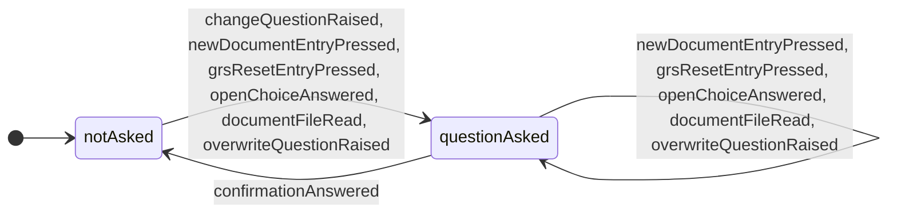
```mermaid
stateDiagram-v2
    direction LR
    [*] --> confirmationStateMachine_notAsked
    confirmationStateMachine_notAsked : notAsked
    confirmationStateMachine_questionAsked : questionAsked
    confirmationStateMachine_notAsked --> confirmationStateMachine_questionAsked : changeQuestionRaised, newDocumentEntryPressed, grsResetEntryPressed, openChoiceAnswered, documentFileRead, overwriteQuestionRaised
    confirmationStateMachine_questionAsked --> confirmationStateMachine_questionAsked : newDocumentEntryPressed, grsResetEntryPressed, openChoiceAnswered, documentFileRead, overwriteQuestionRaised
    confirmationStateMachine_questionAsked --> confirmationStateMachine_notAsked : confirmationAnswered
```

| 出来事 | `notAsked` | `questionAsked` |
| --- | --- | --- |
| `fileFlow/changeQuestionRaised` | → `questionAsked` | — |
| `fileFlow/newDocumentEntryPressed` | → `questionAsked` | → 自己 / `raiseNotice`（`RS-27`） |
| `fileFlow/grsResetEntryPressed` | → `questionAsked` | → 自己 / `raiseNotice`（`RS-27`） |
| `fileFlow/openChoiceAnswered` | → `questionAsked` [`isReplaceChoice` & `fileOperationStateMachine.awaitingOpenChoice` にいる] それ以外 → — | → 自己 [`isReplaceChoice` & `fileOperationStateMachine.awaitingOpenChoice` にいる] それ以外 → — |
| `fileFlow/documentFileRead` | → `questionAsked` [`isReopenRoute` & `fileOperationStateMachine.readingDocumentFile` にいる] それ以外 → — | → 自己 [`isReopenRoute` & `fileOperationStateMachine.readingDocumentFile` にいる] それ以外 → — |
| `fileFlow/overwriteQuestionRaised` | → `questionAsked` | → 自己 |
| `fileFlow/confirmationAnswered` | — | → `notAsked` [`isProceeding` & not `isFileOperationQuestion`] / `carryOutOwedAction` → `notAsked` [`isProceeding` & `isFileOperationQuestion`] → `notAsked` [not `isProceeding` & `hasDeclinedWrites`] / `carryOutOwedAction` → `notAsked` [not `isProceeding` & not `hasDeclinedWrites`] |

- `confirmationStateMachine.notAsked` —— 初期。根拠 `NT-7` ・ `U-55`
- `confirmationStateMachine.questionAsked` —— 運ぶ値 `question`（`QN-1` ・ `QN-2` ・ `QN-3` ・ `QN-4` ・ `QN-5` ・ `QN-11`） ／ `owedAction`（「続ける」で行う書き込みの束か、新しく始めることか、GRS リセット（`FR-153`）。ファイル操作の問いでは無い）。根拠 `NT-7` ・ `U-55` ・ `QN-1` ・ `QN-2` ・ `QN-3` ・ `QN-4` ・ `QN-5` ・ `QN-11`

表に無い出来事は `confirmationStateMachine` を変えない（同じ参照）。

### 状態機械 `unsavedEditsStateMachine`

```mermaid
stateDiagram-v2
    direction LR
    [*] --> unsavedEditsStateMachine_nothingUnsaved
    unsavedEditsStateMachine_nothingUnsaved : nothingUnsaved
    unsavedEditsStateMachine_editsUnsaved : editsUnsaved
    unsavedEditsStateMachine_nothingUnsaved --> unsavedEditsStateMachine_editsUnsaved : documentEditLanded, documentOpenLanded
    unsavedEditsStateMachine_editsUnsaved --> unsavedEditsStateMachine_nothingUnsaved : documentOpenLanded, documentFileSaved, newDocumentLanded, startupDocumentHeld
```

| 出来事 | `nothingUnsaved` | `editsUnsaved` |
| --- | --- | --- |
| `fileFlow/documentEditLanded` | → `editsUnsaved` | — |
| `fileFlow/documentOpenLanded` | → `editsUnsaved` [not `isReplaceChoice`]（合流・重ねは、ファイルに無い文書を作る） それ以外 → — | → `nothingUnsaved` [`isReplaceChoice`]（置き換えは、開いたファイルと同じ文書にする） それ以外 → — |
| `fileFlow/documentFileSaved` | — | → `nothingUnsaved` |
| `fileFlow/newDocumentLanded` | — | → `nothingUnsaved` |
| `fileFlow/startupDocumentHeld` | — | → `nothingUnsaved` |

- `unsavedEditsStateMachine.nothingUnsaved` —— 初期。根拠 `FR-100` ・ `ZE-4`
- `unsavedEditsStateMachine.editsUnsaved` —— 根拠 `FR-100` ・ `LM-11`

表に無い出来事は `unsavedEditsStateMachine` を変えない（同じ参照）。

## 名前付けと入力欄（`fieldEntry`）

**表 T-292 — 名前付けと入力欄の状態機械**

本表は、出来事の定義・根の値・状態機械ごとの状態遷移表と状態の一覧からなる。  
状態遷移表の行はその状態機械を動かす出来事、列はその状態機械の葉の状態、升は「→ 次の状態 [ガード] / 副作用」である。  
升の「—」は変化なし（同じ参照）を表す。  
ガードの付いた枝がすべての場合を覆わない升には「それ以外 → —」を添え、どの場合に何が起きるかを升ごとに言い切る。  
親の状態に置いた升は、その子のすべての列に同じ升を刷り、「親 … の升」と書き添える。

### 名前付けと入力欄の出来事

| 出来事 | どこから来るか | 運ぶ値 | 動かすもの |
| --- | --- | --- | --- |
| `fieldEntry/fieldFocusAsked` | 入力（欄に焦点を置くことを要求が名指した押下（名称・行名・担当・注記の本文・枠の色・文書名））: `MK-13` ・ `FR-035` ・ `FR-097` | `fieldRow`（`PR-1` ・ `AT-53` ・ `PR-16` ・ `PR-21` ・ `PR-22` ・ `U-27`） | `fieldEditStateMachine` |
| `fieldEntry/creationLanded` | 副作用の結果（作る書き込みが着地し、作ったものが文書に在る）: `TC-9` ・ `FR-091` ・ `HF-14` ・ `HF-17` | `created`（作ったタスクの UID か、足した行の ID） | 根 ・ `createdTaskNamingStateMachine` ・ `fieldEditStateMachine` |
| `fieldEntry/fieldFocusWithdrawn` | 入力（`Esc`、欄の外の押し、パネルを閉じたこと、人が焦点を別の所へ動かしたこと、選択が変わったこと、求めた欄がパネルに無いこと。呼び手が決める）: `IN-5a` ・ `IN-5b` ・ `IN-4` | — | `fieldEditStateMachine` |
| `fieldEntry/fieldEditBegan` | 入力（宿主が知らせる: 文字入力の欄で編集が始まった（焦点が入った）。人の押下・キーで入っても、求めた焦点が入っても同じ）: `IF-9` ・ `IN-5b` ・ `AG-9` | `fieldRow`（`IF-9` ・ `PR-1` ・ `AT-53` ・ `PR-16` ・ `PR-21` ・ `U-27` ・ `U-60`。編集が始まった欄が名乗る行 ID） | `fieldEditStateMachine` |
| `fieldEntry/fieldEditEnded` | 入力（宿主が知らせる: その欄の編集が終わった（確定・取り消し・欄が消えた —— どれでも））: `IF-9` ・ `SK-19` ・ `IN-4` ・ `IN-6` | `fieldRow`（`IF-9` ・ `PR-1` ・ `AT-53` ・ `PR-16` ・ `PR-21` ・ `U-27` ・ `U-60`。編集が終わった欄が名乗る行 ID） | `fieldEditStateMachine` |
| `fieldEntry/choiceMoved` | ほかの領域の結果（選択。作ったものを選んだ変化は `creationLanded` が運ぶので送らない）: `FR-091` ・ `FR-072` | — | `createdTaskNamingStateMachine` |

### 根 `fieldEntry` の値

運ぶ値: —。  
根拠: `FR-091` ・ `IN-5b`。

| 出来事 | `fieldEntry` |
| --- | --- |
| `fieldEntry/creationLanded` | → 自己 [not `isCreatedTask`] / `bringCreatedRowIntoSight`（足した行が描かれていないときだけ送る。描かれているかはシェルが次のレイアウトで判じる） それ以外 → — |

**図 F-038 — 名前付けと入力欄の状態遷移**

状態機械ごとに 1 つの図に分け、その状態機械の節に置く。状態機械どうしは直交する。  
矢印のラベルは出来事のキーだけであり、ガード・副作用は同じ節の状態遷移表が持つ。  
⚠️ 図は畳んである —— 同じ出来事・ガード・先・副作用の升が 3 つ以上の兄弟の種類のどの 2 つの間も結ぶか、それらのどれからも同じ 1 つの種類へ出るか、同じ 1 つの種類から入るときは、兄弟を 1 つの箱に囲み、その遷移を箱から 1 本だけ描く（どの 2 つの間も結ぶ遷移は、箱の注に出来事のキーを書く）。  
⭐ 遷移の全数は 表 T-292 の状態遷移表が持つ。

### 状態機械 `createdTaskNamingStateMachine`

```mermaid
stateDiagram-v2
    direction LR
    [*] --> createdTaskNamingStateMachine_idle
    createdTaskNamingStateMachine_idle : idle
    createdTaskNamingStateMachine_namingCreatedTask : namingCreatedTask
    createdTaskNamingStateMachine_idle --> createdTaskNamingStateMachine_namingCreatedTask : creationLanded
    createdTaskNamingStateMachine_namingCreatedTask --> createdTaskNamingStateMachine_namingCreatedTask : creationLanded
    createdTaskNamingStateMachine_namingCreatedTask --> createdTaskNamingStateMachine_idle : choiceMoved
```

| 出来事 | `idle` | `namingCreatedTask` |
| --- | --- | --- |
| `fieldEntry/creationLanded` | → `namingCreatedTask` [`isCreatedTask`] それ以外 → — | → 自己 [`isCreatedTask`]（`createdTaskUid` を書き換える） それ以外 → — |
| `fieldEntry/choiceMoved` | — | → `idle` |

- `createdTaskNamingStateMachine.idle` —— 初期。根拠 `FR-091` ・ `FR-072`
- `createdTaskNamingStateMachine.namingCreatedTask` —— 運ぶ値 `createdTaskUid`（`TC-9`）。根拠 `FR-091` ・ `TC-9` ・ `FR-001`

表に無い出来事は `createdTaskNamingStateMachine` を変えない（同じ参照）。

### 状態機械 `fieldEditStateMachine`

```mermaid
stateDiagram-v2
    direction LR
    [*] --> fieldEditStateMachine_idle
    fieldEditStateMachine_idle : idle
    fieldEditStateMachine_fieldFocusWanted : fieldFocusWanted
    fieldEditStateMachine_editingField : editingField
    fieldEditStateMachine_idle --> fieldEditStateMachine_fieldFocusWanted : fieldFocusAsked, creationLanded
    fieldEditStateMachine_fieldFocusWanted --> fieldEditStateMachine_fieldFocusWanted : fieldFocusAsked, creationLanded
    fieldEditStateMachine_editingField --> fieldEditStateMachine_fieldFocusWanted : fieldFocusAsked, creationLanded
    fieldEditStateMachine_idle --> fieldEditStateMachine_editingField : fieldEditBegan
    fieldEditStateMachine_fieldFocusWanted --> fieldEditStateMachine_editingField : fieldEditBegan
    fieldEditStateMachine_editingField --> fieldEditStateMachine_editingField : fieldEditBegan
    fieldEditStateMachine_editingField --> fieldEditStateMachine_idle : fieldEditEnded
    fieldEditStateMachine_fieldFocusWanted --> fieldEditStateMachine_idle : fieldFocusWithdrawn
```

| 出来事 | `idle` | `fieldFocusWanted` | `editingField` |
| --- | --- | --- | --- |
| `fieldEntry/fieldFocusAsked` | → `fieldFocusWanted` | → 自己（`fieldRow` を書き換える） | → `fieldFocusWanted` [not `isEditedField`]（求めた欄が編集中の欄なら求めは既に満ちている） それ以外 → — |
| `fieldEntry/creationLanded` | → `fieldFocusWanted`（`fieldRow` はタスクなら `PR-1`、行なら `AT-53`） | → 自己（`fieldRow` を書き換える） | → `fieldFocusWanted`（`fieldRow` はタスクなら `PR-1`、行なら `AT-53`） |
| `fieldEntry/fieldEditBegan` | → `editingField` | → `editingField`（求めた欄なら焦点が入った。別の欄なら人が焦点を動かした —— どちらも求めは終わる） | → 自己（`fieldRow` を書き換える（編集する欄が替わった）） |
| `fieldEntry/fieldEditEnded` | — | — | → `idle` [`isEditedField`] それ以外 → — |
| `fieldEntry/fieldFocusWithdrawn` | — | → `idle` | — |

- `fieldEditStateMachine.idle` —— 初期。根拠 `IN-5a` ・ `IN-5b` ・ `AG-9`
- `fieldEditStateMachine.fieldFocusWanted` —— 運ぶ値 `fieldRow`（`PR-1` ・ `AT-53` ・ `PR-16` ・ `PR-21` ・ `PR-22` ・ `U-27`）。根拠 `IN-5a` ・ `IN-5b` ・ `MK-13` ・ `HF-14` ・ `FR-091` ・ `FR-035`
- `fieldEditStateMachine.editingField` —— 運ぶ値 `fieldRow`（`IF-9` ・ `PR-1` ・ `AT-53` ・ `PR-16` ・ `PR-21` ・ `U-27` ・ `U-60`）。根拠 `AG-9` ・ `IN-5a` ・ `IN-4` ・ `IN-6` ・ `SK-19` ・ `IF-9`

表に無い出来事は `fieldEditStateMachine` を変えない（同じ参照）。

## 選択（`selection`）

**表 T-293 — 選択の状態機械**

本表は、出来事の定義・根の値・状態機械ごとの状態遷移表と状態の一覧からなる。  
状態遷移表の行はその状態機械を動かす出来事、列はその状態機械の葉の状態、升は「→ 次の状態 [ガード] / 副作用」である。  
升の「—」は変化なし（同じ参照）を表す。  
ガードの付いた枝がすべての場合を覆わない升には「それ以外 → —」を添え、どの場合に何が起きるかを升ごとに言い切る。  
親の状態に置いた升は、その子のすべての列に同じ升を刷り、「親 … の升」と書き添える。

### 選択の出来事

| 出来事 | どこから来るか | 運ぶ値 | 動かすもの |
| --- | --- | --- | --- |
| `selection/objectsPicked` | 入力（対象を選ぶ押下・範囲・`Shift` での増減・全選択・端のドラッグで絞ること。新しい選択は呼び手（入力の翻訳係）が組み、値が変わったときだけ送る。⭐ `Ctrl` ドラッグの写し（表 T-308 の `CY-8`）だけは、写しが着地したあとに殻が組んで送る —— 写しの `UID` は書き込みが払い出す）: `SL-2` ・ `SL-3` ・ `SL-4` ・ `SK-2` ・ `SL-7a` ・ `CY-8` | `pickedObjects`（`SL-1` ・ `SL-7b`） | `selectionStateMachine` |
| `selection/emptyAreaClicked` | 入力（何にも当たらない場所での素の左クリック（構えなし））: `MK-11` ・ `SL-6` | — | `selectionStateMachine` |
| `selection/selectionEscapePressed` | 入力（`Esc`。画面の値の `escapePressed` と同じ押下から呼び手が作る）: `IN-4` | `rung`（消費する `IN-4` の段の語。呼び手が詰める） | 根 ・ `selectionStateMachine` |
| `selection/selectionSettleKeyPressed` | 入力（`Enter`。通知も確定していないその場の編集も無く、プロパティパネルも出していないときだけ呼び手が送る）: `SK-19` | — | 根 ・ `selectionStateMachine` |
| `selection/selectionCleared` | 副作用の結果（画面の値の副作用 `clearSelection` の結果）: `FR-091` | — | `selectionStateMachine` |
| `selection/selectionPruned` | 副作用の結果（書き込みが着地し、文書に無くなった対象を刈った。または、表示の切り替え・行の畳みと隠し・行の軸の倍率で描かれなくなったタスクを刈った。⭐ 同じ着地で、文書に無くなった行も行の選択から刈る（`FR-085`））: `FR-081` ・ `UN-9` ・ `FR-049` ・ `FR-018` ・ `HR-1a` ・ `HR-6` ・ `FR-085` | `remainingObjects` ／ `chosenRows`（`FR-085`。刈ったあとに残る行。文書から消えた行を除いた行の選択） | 根 ・ `selectionStateMachine` |
| `selection/createdTaskSelected` | 副作用の結果（作る書き込みが着地し、作ったタスクが文書に在る）: `FR-001` ・ `FR-091` ・ `TC-9` | `createdTaskUid`（`TC-9`） | `selectionStateMachine` |
| `selection/rowsPicked` | 入力（行見出しパネルで行を選ぶ・増減する）: `FR-085` ・ `FR-042` | `chosenRows` | 根 |
| `selection/createdRowSelected` | 副作用の結果（行を足す書き込みが着地し、足した行が文書に在る）: `HF-14` | `createdGroupId` | 根 |
| `selection/resourcesPicked` | 入力（担当者の一覧で選ぶ・すべて選ぶ・すべて解く・増減する）: `FR-099` ・ `AS-6` | `chosenResources` | 根 |
| `selection/copyTaken` | 入力（写せる選び方のときだけ呼び手が送る。写せないときは `RS-27` で断り、出来事を作らない）: `SK-4` ・ `FR-033` | `copiedForPaste` | 根 |

### 根 `selection` の値

運ぶ値: `chosenRows`（`FR-085`） ／ `chosenResources`（`FR-099` ・ `AS-6`） ／ `copiedForPaste`（`FR-033`。無いこともある。`Task` を写したときは、選ばれていた `Task` をすべて持つ）。  
根拠: `FR-081` ・ `FR-085` ・ `FR-099` ・ `FR-033` ・ `UN-9` ・ `IN-4` ・ `SK-19`。

| 出来事 | `selection` |
| --- | --- |
| `selection/rowsPicked` | → 自己（`chosenRows` を書き換える） |
| `selection/createdRowSelected` | → 自己（`chosenRows` を作った行 1 つにする） |
| `selection/resourcesPicked` | → 自己（`chosenResources` を書き換える） |
| `selection/copyTaken` | → 自己（`copiedForPaste` を書き換える） |
| `selection/selectionEscapePressed` | → 自己 [`isRungSelection`]（`chosenRows` を空にする —— 段「選択」は対象と行の両方を解く） それ以外 → — |
| `selection/selectionSettleKeyPressed` | → 自己（`chosenRows` を空にする —— 対象と行の両方を解く） |
| `selection/selectionPruned` | → 自己（`chosenRows` を、運ぶ `chosenRows`（文書に在る行だけ）に置き換える） |

**図 F-039 — 選択の状態遷移**

状態機械ごとに 1 つの図に分け、その状態機械の節に置く。状態機械どうしは直交する。  
矢印のラベルは出来事のキーだけであり、ガード・副作用は同じ節の状態遷移表が持つ。  
⚠️ 図は畳んである —— 同じ出来事・ガード・先・副作用の升が 3 つ以上の兄弟の種類のどの 2 つの間も結ぶか、それらのどれからも同じ 1 つの種類へ出るか、同じ 1 つの種類から入るときは、兄弟を 1 つの箱に囲み、その遷移を箱から 1 本だけ描く（どの 2 つの間も結ぶ遷移は、箱の注に出来事のキーを書く）。  
⭐ 遷移の全数は 表 T-293 の状態遷移表が持つ。

### 状態機械 `selectionStateMachine`

```mermaid
stateDiagram-v2
    direction LR
    [*] --> selectionStateMachine_nothingSelected
    selectionStateMachine_nothingSelected : nothingSelected
    selectionStateMachine_objectsSelected : objectsSelected
    selectionStateMachine_nothingSelected --> selectionStateMachine_objectsSelected : objectsPicked, createdTaskSelected
    selectionStateMachine_objectsSelected --> selectionStateMachine_objectsSelected : objectsPicked, selectionPruned, createdTaskSelected
    selectionStateMachine_objectsSelected --> selectionStateMachine_nothingSelected : objectsPicked, emptyAreaClicked, selectionEscapePressed, selectionSettleKeyPressed, selectionCleared, selectionPruned
```

| 出来事 | `nothingSelected` | `objectsSelected` |
| --- | --- | --- |
| `selection/objectsPicked` | → `objectsSelected` [`hasPickedObjects`] それ以外 → — | → 自己 [`hasPickedObjects`]（`selectedObjects` を書き換える） → `nothingSelected` [not `hasPickedObjects`] |
| `selection/emptyAreaClicked` | — | → `nothingSelected` |
| `selection/selectionEscapePressed` | — | → `nothingSelected` [`isRungSelection`] それ以外 → — |
| `selection/selectionSettleKeyPressed` | — | → `nothingSelected` |
| `selection/selectionCleared` | — | → `nothingSelected` |
| `selection/selectionPruned` | — | → 自己 [`hasRemainingObjects`]（`selectedObjects` を書き換える） → `nothingSelected` [not `hasRemainingObjects`] |
| `selection/createdTaskSelected` | → `objectsSelected`（`selectedObjects` は作ったタスク 1 つ） | → 自己（`selectedObjects` を作ったタスク 1 つに置き換える） |

- `selectionStateMachine.nothingSelected` —— 初期。根拠 `SP-1` ・ `MK-11` ・ `SL-6`
- `selectionStateMachine.objectsSelected` —— 運ぶ値 `selectedObjects`（`SL-1` ・ `SL-7b`）。根拠 `SP-2` ・ `SP-3` ・ `SL-1` ・ `IN-4`

表に無い出来事は `selectionStateMachine` を変えない（同じ参照）。

## 操作の記録（`interactionRecord`）

**表 T-295 — 操作の記録の状態機械**

本表は、出来事の定義・根の値・状態機械ごとの状態遷移表と状態の一覧からなる。  
状態遷移表の行はその状態機械を動かす出来事、列はその状態機械の葉の状態、升は「→ 次の状態 [ガード] / 副作用」である。  
升の「—」は変化なし（同じ参照）を表す。  
ガードの付いた枝がすべての場合を覆わない升には「それ以外 → —」を添え、どの場合に何が起きるかを升ごとに言い切る。  
親の状態に置いた升は、その子のすべての列に同じ升を刷り、「親 … の升」と書き添える。

### 操作の記録の出来事

| 出来事 | どこから来るか | 運ぶ値 | 動かすもの |
| --- | --- | --- | --- |
| `interactionRecord/interactionRecordToggled` | 入力（`IC-76` を押して離した。記録していないときは始め、記録しているときは止める —— 開始と停止は同じ 1 つの入口である）: `IC-76` ・ `FR-102` | — | `interactionRecordingStateMachine` |

### 根 `interactionRecord` の値

運ぶ値: —。  
根拠: `FR-102` ・ `S-206`。

根の運ぶ値だけを書き換える出来事は無い。

**図 F-041 — 操作の記録の状態遷移**

状態機械ごとに 1 つの図に分け、その状態機械の節に置く。状態機械どうしは直交する。  
矢印のラベルは出来事のキーだけであり、ガード・副作用は同じ節の状態遷移表が持つ。  
⚠️ 図は畳んである —— 同じ出来事・ガード・先・副作用の升が 3 つ以上の兄弟の種類のどの 2 つの間も結ぶか、それらのどれからも同じ 1 つの種類へ出るか、同じ 1 つの種類から入るときは、兄弟を 1 つの箱に囲み、その遷移を箱から 1 本だけ描く（どの 2 つの間も結ぶ遷移は、箱の注に出来事のキーを書く）。  
⭐ 遷移の全数は 表 T-295 の状態遷移表が持つ。

### 状態機械 `interactionRecordingStateMachine`

```mermaid
stateDiagram-v2
    direction LR
    [*] --> interactionRecordingStateMachine_notRecording
    interactionRecordingStateMachine_notRecording : notRecording
    interactionRecordingStateMachine_recordingInteractions : recordingInteractions
    interactionRecordingStateMachine_notRecording --> interactionRecordingStateMachine_recordingInteractions : interactionRecordToggled
    interactionRecordingStateMachine_recordingInteractions --> interactionRecordingStateMachine_notRecording : interactionRecordToggled
```

| 出来事 | `notRecording` | `recordingInteractions` |
| --- | --- | --- |
| `interactionRecord/interactionRecordToggled` | → `recordingInteractions` / `beginInteractionRecord`（記録の溜めを空にし、始めた時刻を取り、始めたことを 1 行目に書く） | → `notRecording` / `handInteractionRecordToClipboard`（止めたことを書き、記録の文を組んでクリップボードへ渡し、溜めを空にする） |

- `interactionRecordingStateMachine.notRecording` —— 初期。根拠 `S-206` ・ `FR-102`
- `interactionRecordingStateMachine.recordingInteractions` —— 根拠 `FR-102` ・ `S-206` ・ `IC-76`

表に無い出来事は `interactionRecordingStateMachine` を変えない（同じ参照）。

## `Agent API`（`agentApi`）

**表 T-296 — `Agent API` の状態機械**

本表は、出来事の定義・根の値・状態機械ごとの状態遷移表と状態の一覧からなる。  
状態遷移表の行はその状態機械を動かす出来事、列はその状態機械の葉の状態、升は「→ 次の状態 [ガード] / 副作用」である。  
升の「—」は変化なし（同じ参照）を表す。  
ガードの付いた枝がすべての場合を覆わない升には「それ以外 → —」を添え、どの場合に何が起きるかを升ごとに言い切る。  
親の状態に置いた升は、その子のすべての列に同じ升を刷り、「親 … の升」と書き添える。

### `Agent API` の出来事

| 出来事 | どこから来るか | 運ぶ値 | 動かすもの |
| --- | --- | --- | --- |
| `agentApi/agentApiEntryPressed` | 入力（`IC-20` を押した。無効のときは有効にし、有効のときは無効にする —— 有効にするのと無効にするのは同じ 1 つの入口である）: `IC-20` ・ `FR-065` | — | 根 ・ `agentApiEnablingStateMachine` |
| `agentApi/enablingAskedByDialogueField` | 入力（`IC-18` を押した。`Agent API` が無効なら有効にする —— 対話欄の入口は `Agent API` を無効にしない）: `IC-18` ・ `FR-066` | — | `agentApiEnablingStateMachine` |
| `agentApi/rememberedEnablingLoaded` | 副作用の結果（起動のとき、シェルがブラウザ（オリジン）の記憶を読んだ結果）: `FR-065` ・ `S-99b` | `isRememberedEnabled`（`S-99b`。記憶が有効を指すか） | `agentApiEnablingStateMachine` |

### 根 `agentApi` の値

運ぶ値: —。  
根拠: `FR-065` ・ `S-99b`。

| 出来事 | `agentApi` |
| --- | --- |
| `agentApi/agentApiEntryPressed` | → 自己 / `storeAgentApiEnabling`（押した後の有効・無効をブラウザ（オリジン）の記憶に書く） |

**図 F-042 — `Agent API` の状態遷移**

状態機械ごとに 1 つの図に分け、その状態機械の節に置く。状態機械どうしは直交する。  
矢印のラベルは出来事のキーだけであり、ガード・副作用は同じ節の状態遷移表が持つ。  
⚠️ 図は畳んである —— 同じ出来事・ガード・先・副作用の升が 3 つ以上の兄弟の種類のどの 2 つの間も結ぶか、それらのどれからも同じ 1 つの種類へ出るか、同じ 1 つの種類から入るときは、兄弟を 1 つの箱に囲み、その遷移を箱から 1 本だけ描く（どの 2 つの間も結ぶ遷移は、箱の注に出来事のキーを書く）。  
⭐ 遷移の全数は 表 T-296 の状態遷移表が持つ。

### 状態機械 `agentApiEnablingStateMachine`

```mermaid
stateDiagram-v2
    direction LR
    [*] --> agentApiEnablingStateMachine_disabled
    agentApiEnablingStateMachine_disabled : disabled
    agentApiEnablingStateMachine_enabled : enabled
    agentApiEnablingStateMachine_disabled --> agentApiEnablingStateMachine_enabled : agentApiEntryPressed, enablingAskedByDialogueField, rememberedEnablingLoaded
    agentApiEnablingStateMachine_enabled --> agentApiEnablingStateMachine_disabled : agentApiEntryPressed
```

| 出来事 | `disabled` | `enabled` |
| --- | --- | --- |
| `agentApi/agentApiEntryPressed` | → `enabled` | → `disabled` / `raiseNotice`（`RS-20`） |
| `agentApi/enablingAskedByDialogueField` | → `enabled` / `storeAgentApiEnabling`（有効をブラウザ（オリジン）の記憶に書く） | — |
| `agentApi/rememberedEnablingLoaded` | → `enabled` [`isRememberedEnabled`] それ以外 → — | — |

- `agentApiEnablingStateMachine.disabled` —— 初期。根拠 `FR-065` ・ `CP-17`
- `agentApiEnablingStateMachine.enabled` —— 根拠 `FR-065` ・ `FR-066` ・ `S-99b`

表に無い出来事は `agentApiEnablingStateMachine` を変えない（同じ参照）。

## 行の木（`rowTree`）

**表 T-328 — 行の木の状態機械**

本表は、出来事の定義・根の値・状態機械ごとの状態遷移表と状態の一覧からなる。  
状態遷移表の行はその状態機械を動かす出来事、列はその状態機械の葉の状態、升は「→ 次の状態 [ガード] / 副作用」である。  
升の「—」は変化なし（同じ参照）を表す。  
ガードの付いた枝がすべての場合を覆わない升には「それ以外 → —」を添え、どの場合に何が起きるかを升ごとに言い切る。  
親の状態に置いた升は、その子のすべての列に同じ升を刷り、「親 … の升」と書き添える。

⭐ 本領域の状態は文書に保存する値である（`05-07-design.md` の 表 T-250 の `SD-5`） —— 状態の型は `_assets/fig-erd-detail.md` の `AT-153` の列挙が持ち、状態のキーはその値と同じ並びである。  
値が変われば、起こしたものによらず未保存の編集であり、取り消しの 1 段である（`01-04-requirements.md` の `FR-018`）。

### 行の木の出来事

| 出来事 | どこから来るか | 運ぶ値 | 動かすもの |
| --- | --- | --- | --- |
| `rowTree/oneLevelOpenPressed` | 入力（行の 1 階層開く操作子を押した。押しが何かを行うときだけ（`FR-029`））: `IC-90` ・ `HF-13` ・ `HR-7` | `pressedRowId`（押した行の id） | `treeStateMachine` |
| `rowTree/allBelowOpenPressed` | 入力（行の配下をすべて開く操作子を押した。押しが何かを行うときだけ）: `IC-58` ・ `HF-2` ・ `HR-3` | `pressedRowId`（押した行の id） | `treeStateMachine` |
| `rowTree/hidePressed` | 入力（行の隠す操作子を押した）: `IC-59` ・ `HF-3` ・ `HR-6` | `pressedRowId`（押した行の id） | `treeStateMachine` |
| `rowTree/allBelowFoldPressed` | 入力（行の配下をすべて畳む操作子を押した。押しが何かを行うときだけ）: `IC-77` ・ `HF-11` ・ `HR-4` | `pressedRowId`（押した行の id） | `treeStateMachine` |
| `rowTree/everyRowOpenPressed` | 入力（頭のすべて開く操作子を押した。押しが何かを行うときだけ）: `IC-74` ・ `HF-10` ・ `HR-1` | — | 根 ・ `treeStateMachine` |
| `rowTree/everyRowFoldPressed` | 入力（頭のすべて畳む操作子を押した。押しが何かを行うときだけ）: `IC-78` ・ `HF-12` ・ `HR-2` | — | 根 ・ `treeStateMachine` |
| `rowTree/topLevelOpenPressed` | 入力（頭の最も浅い段を 1 階層開く操作子を押した。押しが何かを行うときだけ）: `IC-92` ・ `HF-16` | — | 根 ・ `treeStateMachine` |
| `rowTree/childRowAddPressed` | 入力（行の配下に足す操作子か、頭の最も浅い段へ足す操作子を押した）: `IC-91` ・ `HF-14` ・ `HR-8` ・ `IC-93` ・ `HF-17` | `pressedRowId`（押した行の id。頭の操作子（`IC-93`）では段 0 を押したので、どの行でもない。値は `null` とする） | 根 ・ `treeStateMachine` |
| `rowTree/fitPressed` | 入力（全体表示を求めた）: `IC-10` ・ `SK-18` ・ `FR-055` ・ `HF-8` | — | 根 ・ `treeStateMachine` |
| `rowTree/everyRowDeletePressed` | 入力（頭のすべての行を消す操作子を押し、問い（`QN-10`）に消すと答えた）: `IC-106` ・ `HF-20` | — | 根 |
| `rowTree/rowZoomShrinkPressed` | 入力（縦（行の軸）を縮める入力。縮める側の端で倍率を書き換えないとき（`ZE-2`）も送る。拡げる入力・日付の軸のズーム・`Agent API` の `setZoom` では送らない）: `MK-2` ・ `MK-4` ・ `IC-14` ・ `SK-16c` ・ `ZE-2` | — | `treeStateMachine` |
| `rowTree/rowRevealAsked` | 入力（検索パネルの表の行を押して飛ぶ（`SJ-1`）か、`Agent API` の `focusTask`（`AM-16`）が飛ぶか、依存線の続きの印を押して畳んだ行か隠した行の配下の端へ送る（`EL-21`）か、表示の絞り込みに入る・絞り込みのあいだにチェックを足す（`FR-151` の 表 T-353 の `TV-6`））: `SJ-1` ・ `AM-16` ・ `EL-21` ・ `TV-6` | `revealedRowId`（飛ぶ先の行の id） | 根 ・ `treeStateMachine` |

### 根 `rowTree` の値

運ぶ値: —。  
根拠: `AT-153` ・ `S-418`。

| 出来事 | `rowTree` |
| --- | --- |
| `rowTree/everyRowFoldPressed` | → 自己 / `writeLevelZeroCollapsed`（段 0 を畳む（`S-418` を `'collapsed'` に）。行の値と同じ束に入れる） |
| `rowTree/everyRowOpenPressed` | → 自己 [`isLevelZeroCollapsed`] / `writeLevelZeroAuto`（段 0 を開く（`S-418` を `'auto'` に）。行の値と同じ束に入れる） それ以外 → — |
| `rowTree/topLevelOpenPressed` | → 自己 [`isLevelZeroCollapsed`] / `writeLevelZeroAuto`（同上） それ以外 → — |
| `rowTree/childRowAddPressed` | → 自己 [`isLevelZeroCollapsed`] / `writeLevelZeroAuto`（同上。1 階層だけ開き、行の値は変えない（`HF-17`）） それ以外 → — |
| `rowTree/fitPressed` | → 自己 [`isLevelZeroCollapsed`] / `writeLevelZeroAuto`（同上） それ以外 → — |
| `rowTree/everyRowDeletePressed` | → 自己 [`isLevelZeroCollapsed`] / `writeLevelZeroAuto`（同上。消す書き込みと同じ束に入れる（`HF-20`）） それ以外 → — |
| `rowTree/rowRevealAsked` | → 自己 [`isLevelZeroCollapsed`] / `writeLevelZeroAuto`（段 0 を開く（`S-418` を `'auto'` に）。行の値と同じ束に入れる） それ以外 → — |

**図 F-043 — 行の木の状態遷移**

状態機械ごとに 1 つの図に分け、その状態機械の節に置く。状態機械どうしは直交する。  
矢印のラベルは出来事のキーだけであり、ガード・副作用は同じ節の状態遷移表が持つ。  
⚠️ 図は畳んである —— 同じ出来事・ガード・先・副作用の升が 3 つ以上の兄弟の種類のどの 2 つの間も結ぶか、それらのどれからも同じ 1 つの種類へ出るか、同じ 1 つの種類から入るときは、兄弟を 1 つの箱に囲み、その遷移を箱から 1 本だけ描く（どの 2 つの間も結ぶ遷移は、箱の注に出来事のキーを書く）。  
⭐ 遷移の全数は 表 T-328 の状態遷移表が持つ。

### 状態機械 `treeStateMachine`

```mermaid
stateDiagram-v2
    direction LR
    [*] --> treeStateMachine_temporarilyExpanded
    treeStateMachine_auto : auto
    treeStateMachine_collapsed : collapsed
    treeStateMachine_expanded : expanded
    treeStateMachine_temporarilyExpanded : temporarilyExpanded
    treeStateMachine_hidden : hidden
    treeStateMachine_auto --> treeStateMachine_expanded : oneLevelOpenPressed, rowRevealAsked
    treeStateMachine_collapsed --> treeStateMachine_expanded : oneLevelOpenPressed, rowRevealAsked
    treeStateMachine_temporarilyExpanded --> treeStateMachine_expanded : oneLevelOpenPressed, rowRevealAsked
    treeStateMachine_hidden --> treeStateMachine_collapsed : oneLevelOpenPressed, topLevelOpenPressed
    treeStateMachine_auto --> treeStateMachine_temporarilyExpanded : allBelowOpenPressed, everyRowOpenPressed, childRowAddPressed
    treeStateMachine_collapsed --> treeStateMachine_temporarilyExpanded : allBelowOpenPressed, everyRowOpenPressed, childRowAddPressed
    treeStateMachine_collapsed --> treeStateMachine_auto : allBelowOpenPressed, everyRowOpenPressed, fitPressed
    treeStateMachine_hidden --> treeStateMachine_temporarilyExpanded : allBelowOpenPressed, everyRowOpenPressed
    treeStateMachine_hidden --> treeStateMachine_auto : allBelowOpenPressed, everyRowOpenPressed
    treeStateMachine_auto --> treeStateMachine_hidden : hidePressed
    treeStateMachine_auto --> treeStateMachine_collapsed : hidePressed, allBelowFoldPressed, everyRowFoldPressed
    treeStateMachine_collapsed --> treeStateMachine_hidden : hidePressed
    treeStateMachine_expanded --> treeStateMachine_hidden : hidePressed
    treeStateMachine_expanded --> treeStateMachine_collapsed : hidePressed, allBelowFoldPressed, everyRowFoldPressed
    treeStateMachine_temporarilyExpanded --> treeStateMachine_hidden : hidePressed
    treeStateMachine_temporarilyExpanded --> treeStateMachine_collapsed : hidePressed, allBelowFoldPressed, everyRowFoldPressed
    treeStateMachine_expanded --> treeStateMachine_auto : fitPressed
    treeStateMachine_temporarilyExpanded --> treeStateMachine_auto : fitPressed, rowZoomShrinkPressed
    treeStateMachine_hidden --> treeStateMachine_expanded : rowRevealAsked
```

| 出来事 | `auto` | `collapsed` | `expanded` | `temporarilyExpanded` | `hidden` |
| --- | --- | --- | --- | --- | --- |
| `rowTree/oneLevelOpenPressed` | → `expanded` [`isPressedRow`] それ以外 → — | → `expanded` [`isPressedRow`] それ以外 → — | — | → `expanded` [`isPressedRow`] それ以外 → — | → `collapsed` [`isChildOfPressedRow`] それ以外 → — |
| `rowTree/allBelowOpenPressed` | → `temporarilyExpanded` [`isPressedRow`] → `temporarilyExpanded` [`isBelowPressedRow` & not `isLeafRow`] それ以外 → — | → `temporarilyExpanded` [`isPressedRow`] → `temporarilyExpanded` [`isBelowPressedRow` & not `isLeafRow`] → `auto` [`isBelowPressedRow` & `isLeafRow`] それ以外 → — | — | — | → `temporarilyExpanded` [`isBelowPressedRow` & not `isLeafRow`] → `auto` [`isBelowPressedRow` & `isLeafRow`] それ以外 → — |
| `rowTree/hidePressed` | → `hidden` [`isPressedRow`] → `collapsed` [`isBelowPressedRow`] それ以外 → — | → `hidden` [`isPressedRow`] それ以外 → — | → `hidden` [`isPressedRow`] → `collapsed` [`isBelowPressedRow`] それ以外 → — | → `hidden` [`isPressedRow`] → `collapsed` [`isBelowPressedRow`] それ以外 → — | — |
| `rowTree/allBelowFoldPressed` | → `collapsed` [`isPressedRow`] → `collapsed` [`isBelowPressedRow`] それ以外 → — | — | → `collapsed` [`isPressedRow`] → `collapsed` [`isBelowPressedRow`] それ以外 → — | → `collapsed` [`isPressedRow`] → `collapsed` [`isBelowPressedRow`] それ以外 → — | — |
| `rowTree/everyRowOpenPressed` | → `temporarilyExpanded` [not `isLeafRow`] それ以外 → — | → `temporarilyExpanded` [not `isLeafRow`] → `auto` [`isLeafRow`] | — | — | → `temporarilyExpanded` [not `isLeafRow`] → `auto` [`isLeafRow`] |
| `rowTree/everyRowFoldPressed` | → `collapsed` | — | → `collapsed` | → `collapsed` | — |
| `rowTree/topLevelOpenPressed` | — | — | — | — | → `collapsed` [`isTopLevelRow`] それ以外 → — |
| `rowTree/childRowAddPressed` | → `temporarilyExpanded` [`isPressedRow`] それ以外 → — | → `temporarilyExpanded` [`isPressedRow`] それ以外 → — | — | — | — |
| `rowTree/fitPressed` | — | → `auto` | → `auto` | → `auto` | — |
| `rowTree/rowZoomShrinkPressed` | — | — | — | → `auto` | — |
| `rowTree/rowRevealAsked` | → `expanded` [`isRevealedRowOrAncestor`] それ以外 → — | → `expanded` [`isRevealedRowOrAncestor`] それ以外 → — | — | → `expanded` [`isRevealedRowOrAncestor`] それ以外 → — | → `expanded` [`isRevealedRowOrAncestor`] それ以外 → — |

- `treeStateMachine.auto` —— 根拠 `AT-153` ・ `FR-018`
- `treeStateMachine.collapsed` —— 根拠 `HR-4` ・ `HR-1a`
- `treeStateMachine.expanded` —— 根拠 `HR-7` ・ `FR-018`
- `treeStateMachine.temporarilyExpanded` —— 初期。根拠 `HR-3` ・ `HR-1` ・ `FR-018` ・ `AT-153` ・ `HF-14`
- `treeStateMachine.hidden` —— 根拠 `HR-6`

表に無い出来事は `treeStateMachine` を変えない（同じ参照）。
