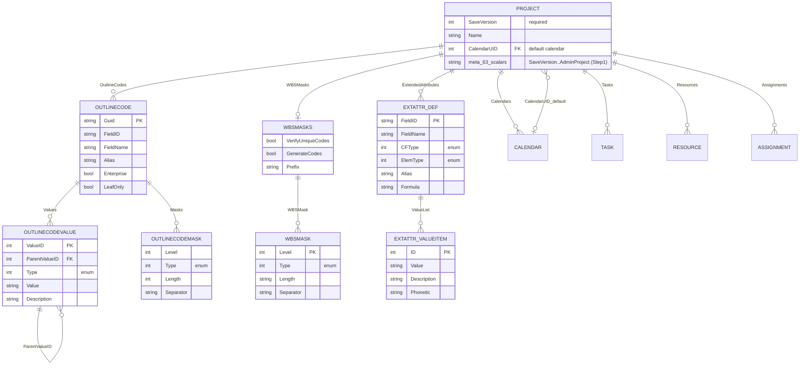
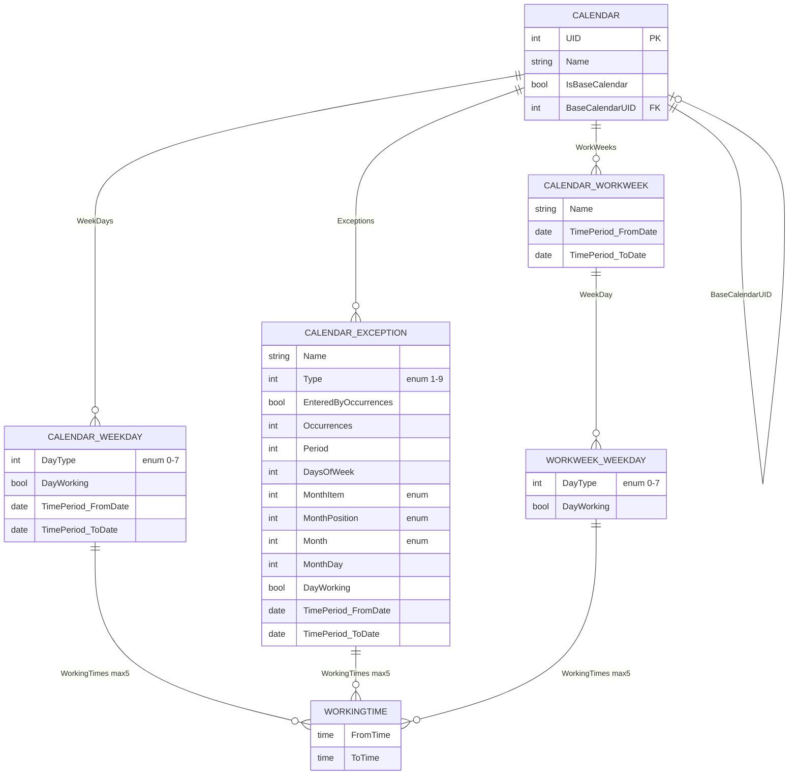
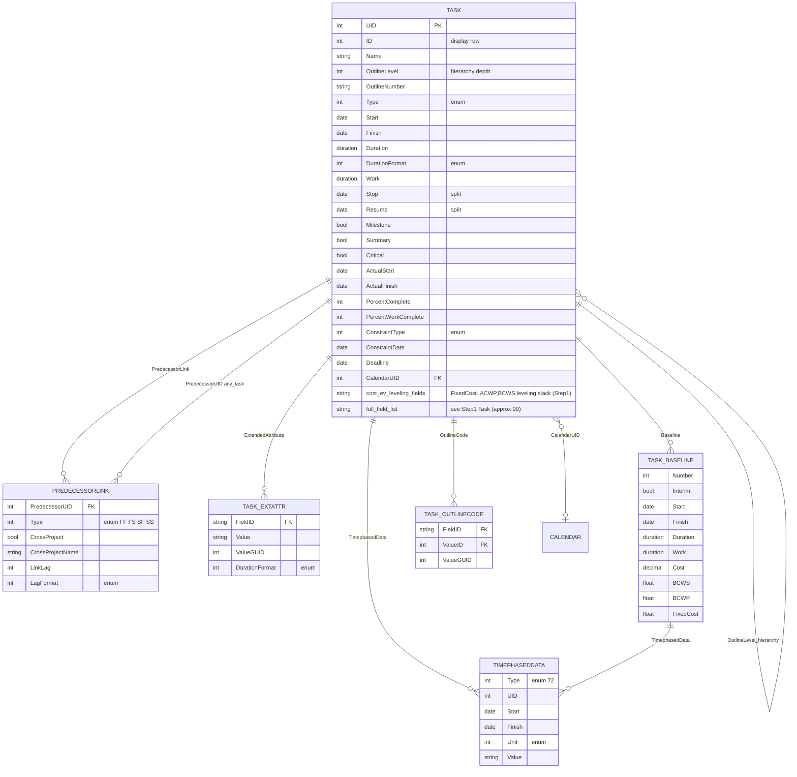
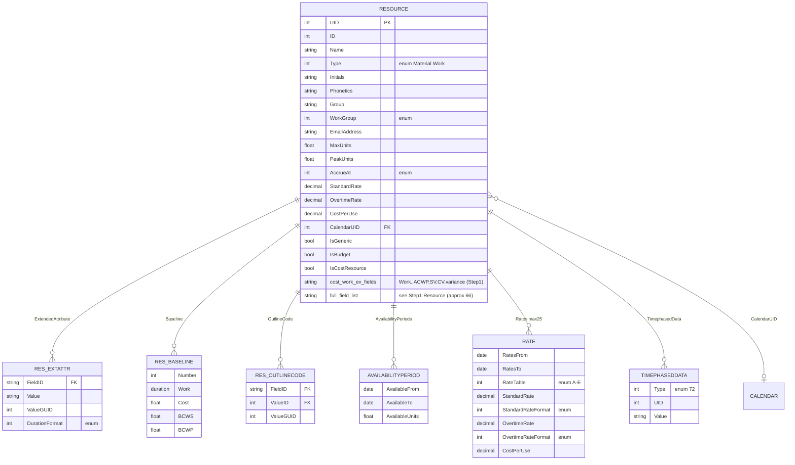
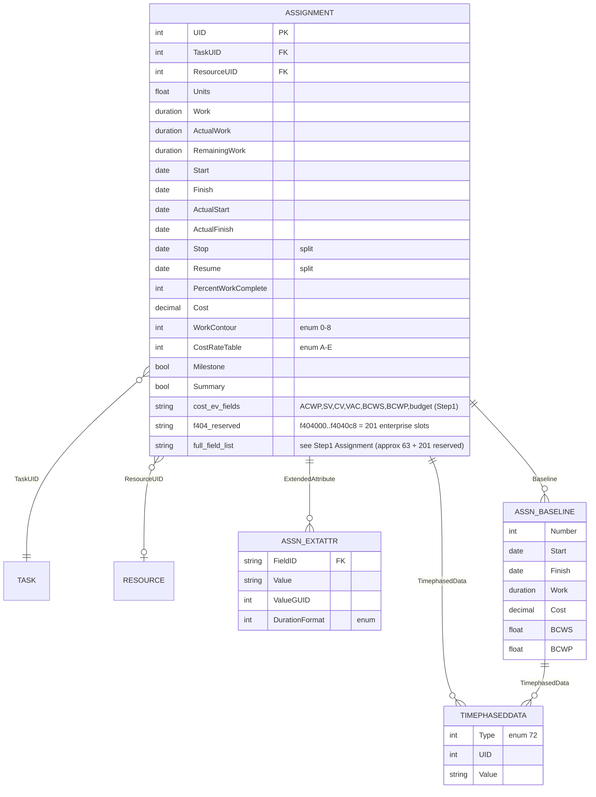
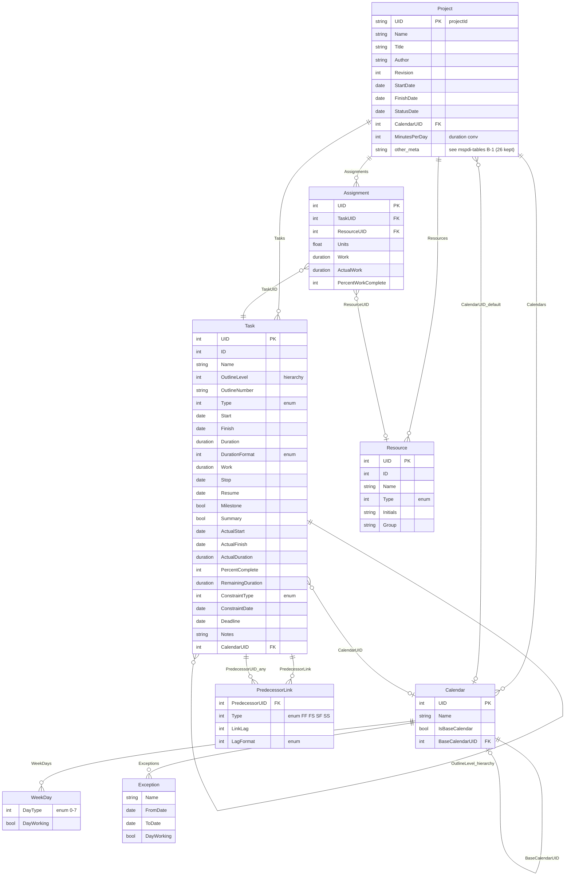
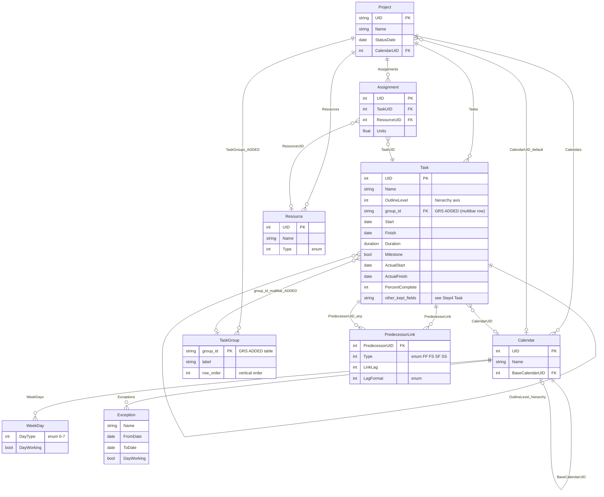

# MSPDI 断捨離 & ERD

- 日付: 2026-07-24
- 対象: `docs/spec/vendor/mspdi/mspdi_pj12.xsd`（Microsoft Office Project 2007 XML Data Interchange Schema, 全3906行）
- 方針: **MSPDI を断捨離し、マルチバー用テーブルを1つ足す。それだけ。**
- 手順: Step1 全項目精査 → Step2 MSPDI 正確 ERD → Step3 不要要素の削除＋根拠 → Step4 断捨離後 ERD → Step5 マルチバー追加 ERD → Step6 比較
- 抽出方法: XSD の全 `<xsd:element name=>`（約500件）を機械抽出し、インデント深度でネストを復元。named complexType は `TimephasedDataType` のみ、他は全て inline 型。

> ⚠️ **命名の正典**: テーブル/フィールドの**正式名は `mspdi-tables.md`（特に A-2「別名→XSD実名」対応表）を正**とする。本書は経緯記録。
> **Step2 の ERD は表示用の別名**（例 `CALENDAR_WEEKDAY`, `OUTLINECODEVALUE`）を使う — MSPDI は葉要素名（`Value`/`Baseline`/`WeekDay`/`Exception`/`OutlineCode`/`ExtendedAttribute`）が親を跨いで重複し、Mermaid は同名エンティティを許さないため。**MSPDI 出力/パーサでは XSD 実名を使うこと**（`CALENDAR_WEEKDAY` タグ等は存在しない）。Step4/5 の確定 ERD は XSD 実名（大小一致）に統一済み。
> 同期状況（2026-07-24, 敵対的レビュー反映）: Task_Baseline と WorkingTime は不採用に確定（変更前予定グレーは別ファイル baseline で代替）。断捨離後は **8 テーブル**（＋GRS 追加 `TaskGroup`）。

---

## Step 1: 全項目インベントリ（抜け漏れ無き精査）

MSPDI の実体は「Project ルート 1 個＋ UID で結合する 5 系統のコレクション」。
下に全エンティティ（テーブル）と、そこに属する**全要素**を列挙する（enum の値詳細は原 XSD 行または `mspdi-core-tree.md` 参照）。
`PK`=識別子、`FK`=他エンティティ参照、`enum`=列挙、`( )`=行番号。

### 共有子エンティティ

**TimephasedData** (type=TimephasedDataType, 27) — Task/Resource/Assignment/各 Baseline にぶら下がる時系列値:
`Type`(enum 72値,PK的), `UID`(PK), `Start`, `Finish`, `Unit`(enum m/h/d/w/mo/y), `Value`

### ルート & メタ情報

**Project** (225) — ルート。以下は**メタ情報スカラー（約63項目・抜け漏れ無く列挙）**:
`SaveVersion`(PK的,必須), `UID`, `Name`, `Title`, `Subject`, `Category`, `Company`, `Manager`, `Author`, `CreationDate`, `Revision`, `LastSaved`, `ScheduleFromStart`, `StartDate`, `FinishDate`, `FYStartDate`(enum), `CriticalSlackLimit`, `CurrencyDigits`, `CurrencySymbol`, `CurrencyCode`, `CurrencySymbolPosition`(enum), `CalendarUID`(FK→Calendar), `DefaultStartTime`, `DefaultFinishTime`, `MinutesPerDay`, `MinutesPerWeek`, `DaysPerMonth`, `DefaultTaskType`(enum), `DefaultFixedCostAccrual`(enum), `DefaultStandardRate`, `DefaultOvertimeRate`, `DurationFormat`(enum), `WorkFormat`(enum), `EditableActualCosts`, `HonorConstraints`, `EarnedValueMethod`(enum), `InsertedProjectsLikeSummary`, `MultipleCriticalPaths`, `NewTasksEffortDriven`, `NewTasksEstimated`, `SplitsInProgressTasks`, `SpreadActualCost`, `SpreadPercentComplete`, `TaskUpdatesResource`, `FiscalYearStart`, `WeekStartDay`(enum), `MoveCompletedEndsBack`, `MoveRemainingStartsBack`, `MoveRemainingStartsForward`, `MoveCompletedEndsForward`, `BaselineForEarnedValue`(enum), `AutoAddNewResourcesAndTasks`, `StatusDate`, `CurrentDate`, `MicrosoftProjectServerURL`, `Autolink`, `NewTaskStartDate`(enum), `DefaultTaskEVMethod`(enum), `ProjectExternallyEdited`, `ExtendedCreationDate`, `ActualsInSync`, `RemoveFileProperties`, `AdminProject`

Project 直下のコレクション: `OutlineCodes`, `WBSMasks`, `ExtendedAttributes`, `Calendars`, `Tasks`, `Resources`, `Assignments`

### 定義系テーブル（Project 配下）

**OutlineCode** (736) — 独自コード体系の定義:
`Guid`(PK), `FieldID`, `FieldName`, `Alias`, `PhoneticAlias`, `Enterprise`, `EnterpriseOutlineCodeAlias`, `ResourceSubstitutionEnabled`, `LeafOnly`, `AllLevelsRequired`, `OnlyTableValuesAllowed` + 子: `Values→Value`, `Masks→Mask`
- **OutlineCodeValue** (775, ルックアップ): `ValueID`(PK), `FieldGUID`, `Type`(enum), `ParentValueID`(FK自己), `Value`, `Description`
- **OutlineCodeMask** (866): `Level`, `Type`(enum), `Length`, `Separator`

**WBSMasks** (913) — WBS採番ルール（コンテナ1個）: `VerifyUniqueCodes`, `GenerateCodes`, `Prefix` + 子: `WBSMask`
- **WBSMask** (939): `Level`(PK), `Type`(enum), `Length`, `Separator`

**ExtendedAttribute（定義）** (986) — ユーザー定義フィールドの宣言:
`FieldID`(PK), `FieldName`, `CFType`(enum), `Guid`, `ElemType`(enum), `MaxMultiValues`, `UserDef`, `Alias`, `SecondaryPID`, `AutoRollDown`, `DefaultGuid`, `Ltuid`, `PhoneticAlias`, `RollupType`(enum), `CalculationType`(enum), `Formula`, `RestrictValues`, `ValuelistSortOrder`(enum), `AppendNewValues`, `Default` + 子: `ValueList→Value`
- **ExtAttrValueListItem** (1157): `ID`(PK), `Value`, `Description`, `Phonetic`

### カレンダー系

**Calendar** (1204): `UID`(PK), `Name`, `IsBaseCalendar`, `BaseCalendarUID`(FK自己) + 子: `WeekDays→WeekDay`, `Exceptions→Exception`, `WorkWeeks→WorkWeek`
- **WeekDay** (1241): `DayType`(enum 0-7), `DayWorking`, `TimePeriod`{`FromDate`,`ToDate`}, `WorkingTimes→WorkingTime`{`FromTime`,`ToTime` 最大5}
- **Exception** (1331): `EnteredByOccurrences`, `TimePeriod`{`FromDate`,`ToDate`}, `Occurrences`, `Name`, `Type`(enum 1-9), `Period`, `DaysOfWeek`, `MonthItem`(enum), `MonthPosition`(enum), `Month`(enum), `MonthDay`, `DayWorking`, `WorkingTimes→WorkingTime`
- **WorkWeek** (1514): `TimePeriod`{`FromDate`,`ToDate`}, `Name` + 子: `WeekDay`{`DayType`, `DayWorking`, `WorkingTimes→WorkingTime`}

### タスク系

**Task** (1604) — 全フィールド（抜け漏れ無く列挙）:
`UID`(PK), `ID`, `Name`, `Type`(enum), `IsNull`, `CreateDate`, `Contact`, `WBS`, `WBSLevel`, `OutlineNumber`, `OutlineLevel`, `Priority`, `Start`, `Finish`, `Duration`, `DurationFormat`(enum), `Work`, `Stop`, `Resume`, `ResumeValid`, `EffortDriven`, `Recurring`, `OverAllocated`, `Estimated`, `Milestone`, `Summary`, `Critical`, `IsSubproject`, `IsSubprojectReadOnly`, `SubprojectName`, `ExternalTask`, `ExternalTaskProject`, `EarlyStart`, `EarlyFinish`, `LateStart`, `LateFinish`, `StartVariance`, `FinishVariance`, `WorkVariance`, `FreeSlack`, `TotalSlack`, `FixedCost`, `FixedCostAccrual`(enum), `PercentComplete`, `PercentWorkComplete`, `Cost`, `OvertimeCost`, `OvertimeWork`, `ActualStart`, `ActualFinish`, `ActualDuration`, `ActualCost`, `ActualOvertimeCost`, `ActualWork`, `ActualOvertimeWork`, `RegularWork`, `RemainingDuration`, `RemainingCost`, `RemainingWork`, `RemainingOvertimeCost`, `RemainingOvertimeWork`, `ACWP`, `CV`, `ConstraintType`(enum), `CalendarUID`(FK→Calendar), `ConstraintDate`, `Deadline`, `LevelAssignments`, `LevelingCanSplit`, `LevelingDelay`, `LevelingDelayFormat`(enum), `PreLeveledStart`, `PreLeveledFinish`, `Hyperlink`, `HyperlinkAddress`, `HyperlinkSubAddress`, `IgnoreResourceCalendar`, `Notes`, `HideBar`, `Rollup`, `BCWS`, `BCWP`, `PhysicalPercentComplete`, `EarnedValueMethod`(enum), `ActualWorkProtected`, `ActualOvertimeWorkProtected`, `IsPublished`, `StatusManager`, `CommitmentStart`, `CommitmentFinish`, `CommitmentType`(enum) + 子: `PredecessorLink`, `ExtendedAttribute`, `Baseline`, `OutlineCode`, `TimephasedData`
- **PredecessorLink** (2162): `PredecessorUID`(FK→Task), `Type`(enum 0=FF/1=FS/2=SF/3=SS), `CrossProject`, `CrossProjectName`, `LinkLag`, `LagFormat`(enum)
- **TaskExtendedAttribute（値）** (2248): `FieldID`(FK→ExtAttr定義), `Value`, `ValueGUID`, `DurationFormat`(enum)
- **TaskBaseline** (2307): `Number`(PK的), `Interim`, `Start`, `Finish`, `Duration`, `DurationFormat`(enum), `EstimatedDuration`, `Work`, `Cost`, `BCWS`, `BCWP`, `FixedCost` + 子: `TimephasedData`
- **TaskOutlineCode（値）** (2413): `FieldID`(FK), `ValueID`(FK→OutlineCodeValue), `ValueGUID`

### リソース系

**Resource** (2492) — 全フィールド（抜け漏れ無く列挙）:
`UID`(PK), `ID`, `Name`, `Type`(enum 0=Material/1=Work), `IsNull`, `Initials`, `Phonetics`, `NTAccount`, `MaterialLabel`, `Code`, `Group`, `WorkGroup`(enum), `EmailAddress`, `Hyperlink`, `HyperlinkAddress`, `HyperlinkSubAddress`, `MaxUnits`, `PeakUnits`, `OverAllocated`, `AvailableFrom`, `AvailableTo`, `Start`, `Finish`, `CanLevel`, `AccrueAt`(enum), `Work`, `RegularWork`, `OvertimeWork`, `ActualWork`, `RemainingWork`, `ActualOvertimeWork`, `RemainingOvertimeWork`, `PercentWorkComplete`, `StandardRate`, `StandardRateFormat`(enum), `Cost`, `OvertimeRate`, `OvertimeRateFormat`(enum), `OvertimeCost`, `CostPerUse`, `ActualCost`, `ActualOvertimeCost`, `RemainingCost`, `RemainingOvertimeCost`, `WorkVariance`, `CostVariance`, `SV`, `CV`, `ACWP`, `CalendarUID`(FK→Calendar), `Notes`, `BCWS`, `BCWP`, `IsGeneric`, `IsInactive`, `IsEnterprise`, `BookingType`(enum), `ActualWorkProtected`, `ActualOvertimeWorkProtected`, `ActiveDirectoryGUID`, `CreationDate`, `IsCostResource`, `AssnOwner`, `AssnOwnerGuid`, `IsBudget` + 子: `ExtendedAttribute`, `Baseline`, `OutlineCode`, `AvailabilityPeriods→AvailabilityPeriod`, `Rates→Rate`, `TimephasedData`
- **ResourceExtendedAttribute（値）** (2912): `FieldID`(FK), `Value`, `ValueGUID`, `DurationFormat`(enum)
- **ResourceBaseline** (2971): `Number`(PK的), `Work`, `Cost`, `BCWS`, `BCWP`
- **ResourceOutlineCode（値）** (3005): `FieldID`(FK), `ValueID`(FK), `ValueGUID`
- **AvailabilityPeriod** (3057): `AvailableFrom`, `AvailableTo`, `AvailableUnits`
- **Rate** (3090, 最大25): `RatesFrom`, `RatesTo`, `RateTable`(enum A-E), `StandardRate`, `StandardRateFormat`(enum), `OvertimeRate`, `OvertimeRateFormat`(enum), `CostPerUse`

### 割当系

**Assignment** (3191) — 全フィールド（抜け漏れ無く列挙）:
`UID`(PK), `TaskUID`(FK→Task), `ResourceUID`(FK→Resource), `PercentWorkComplete`, `ActualCost`, `ActualFinish`, `ActualOvertimeCost`, `ActualOvertimeWork`, `ActualStart`, `ActualWork`, `ACWP`, `Confirmed`, `Cost`, `CostRateTable`(enum A-E), `CostVariance`, `CV`, `Delay`, `Finish`, `FinishVariance`, `Hyperlink`, `HyperlinkAddress`, `HyperlinkSubAddress`, `WorkVariance`, `HasFixedRateUnits`, `FixedMaterial`, `LevelingDelay`, `LevelingDelayFormat`(enum), `LinkedFields`, `Milestone`, `Notes`, `Overallocated`, `OvertimeCost`, `OvertimeWork`, `PeakUnits`, `RegularWork`, `RemainingCost`, `RemainingOvertimeCost`, `RemainingOvertimeWork`, `RemainingWork`, `ResponsePending`, `Start`, `Stop`, `Resume`, `StartVariance`, `Summary`, `SV`, `Units`, `UpdateNeeded`, `VAC`, `Work`, `WorkContour`(enum 0-8), `BCWS`, `BCWP`, `BookingType`(enum), `ActualWorkProtected`, `ActualOvertimeWorkProtected`, `CreationDate`, `AssnOwner`, `AssnOwnerGuid`, `BudgetCost`, `BudgetWork` + 子: `ExtendedAttribute`, `Baseline`, `TimephasedData`
- **【予約枠】`f404000`〜`f4040c8`** (3691-3891): **201 個の enterprise カスタムフィールド予約プレースホルダ**（全て空・`minOccurs=0`）。個別意味なし。本文書では 1 項目に折り畳む（銀の弾ではなく明示的圧縮）。
- **AssignmentExtendedAttribute（値）** (3581): `FieldID`(FK), `Value`, `ValueGUID`, `DurationFormat`(enum)
- **AssignmentBaseline** (3640): `Number`(PK的), `Start`, `Finish`, `Work`, `Cost`, `BCWS`, `BCWP` + 子: `TimephasedData`

### ID / 参照（UID 相互参照）一覧

| 参照元 | → 参照先 |
|---|---|
| `Project.CalendarUID` | `Calendar.UID` |
| `Calendar.BaseCalendarUID` | `Calendar.UID`（自己） |
| `Task.CalendarUID` | `Calendar.UID` |
| `Task.PredecessorLink.PredecessorUID` | `Task.UID`（任意タスク間・CrossProject で他PJも） |
| `Resource.CalendarUID` | `Calendar.UID` |
| `Assignment.TaskUID` | `Task.UID` |
| `Assignment.ResourceUID` | `Resource.UID`（-1=未割当） |
| `*.ExtendedAttribute.FieldID` | `Project.ExtendedAttributes.ExtendedAttribute.FieldID` |
| `*.OutlineCode.FieldID / ValueID` | `Project.OutlineCodes.OutlineCode.Guid / Value.ValueID` |
| `OutlineCodeValue.ParentValueID` | `OutlineCodeValue.ValueID`（自己） |

---

## Step 2: MSPDI 正確 ERD（完全版）

全29エンティティ（中核6＋衛星等23。詳細は `mspdi-tables.md` A 表）。可読性のため 5 クラスタに分割して描くが、**5枚の合計が MSPDI 全体**であり要素の欠落は無い（Step1 の全項目に一致）。巨大な列挙型・201予約枠は型注記に集約。

> **注（命名）**: 本 Step2 のエンティティ ID は**表示用の別名**（大文字・`親_子` 合成）。MSPDI は葉要素名（`Value`/`Baseline`/`WeekDay`/`Exception`/`OutlineCode`/`ExtendedAttribute`）が親を跨いで重複し、1 つの Mermaid 図に同名エンティティを置けないため。**XSD 実名は `mspdi-tables.md` A-2 対応表を正**とする（例: `CALENDAR_WEEKDAY`=`WeekDay`, `OUTLINECODEVALUE`=`Value`, `TASK_EXTATTR`=`ExtendedAttribute`）。Step4/5 の確定 ERD は XSD 実名（大小一致）。

**Step2-1 ERD: ルート・定義系:**

**Step2-2 ERD: カレンダー系:**

**Step2-3 ERD: タスク系:**

**Step2-4 ERD: リソース系:**

**Step2-5 ERD: 割当系:**

---

## Step 3: GRS 不要要素の削除＋根拠

GRS は「マルチバー日程表」であり、**予定・実績・依存・階層・行束ね**を扱う WYSIWYG ツール。
コスト管理・EVM・資源平準化・エンタープライズ連携は非対象（CLAUDE.md ドメイン境界・品質目標より）。
以下、削除する要素群と根拠。**削除は要素単位で網羅**し、残す要素は次節（Step4）の ERD に集約。

### エンティティ丸ごと削除

| 削除エンティティ | 根拠 |
|---|---|
| `OutlineCode` / `OutlineCodeValue` / `OutlineCodeMask` | 独自コード体系。GRS は自前の分類（大中小）を持つため MSPDI のコード表は不要。 |
| `WBSMasks` / `WBSMask` | WBS 自動採番ルール。GRS は採番エンジンを持たない（階層は OutlineLevel で十分）。 |
| `ExtendedAttribute（定義）` / `ExtAttrValueItem` | ユーザー定義カスタムフィールド。MVP に無い。将来必要なら CR。 |
| `Rate`（最大25期の単価表） | コスト計算非対象。単価テーブル不要。 |
| `AvailabilityPeriod` | 資源キャパ計画非対象。 |
| `TimephasedData`（全 4 箇所） | 作業/コストの時系列分解（S字・ヒストグラム）。MVP のイナズマ線は item の予実日付で描けるため不要。将来 CR。 |
| `Baseline`（Task/Resource/Assignment 下・**全番号 0〜10**） | **全削（確定）**。実績遅延は item の Actual＋進捗で描ける。「変更前予定（グレー）」は**別ファイル baseline**（ScheduleDocument のスナップショット・P6 式）で代替。インライン Baseline は複雑化のため不採用。 |
| `WorkingTime`（勤務時刻 FromTime/ToTime） | **全削（確定）**。GRS は日粒度描画（時刻をレンダリングしない）。WeekDay は「稼働日か否か」のみ残す。 |
| `f404000`〜`f4040c8`（201 枠） | enterprise カスタムフィールド予約。空・意味なし・サーバ連携非対象。 |

### フィールド群の削除（残すエンティティ内）

| 削除フィールド群 | 該当 | 根拠 |
|---|---|---|
| EVM 指標: `BCWS`,`BCWP`,`ACWP`,`SV`,`CV`,`VAC`,`CostVariance`,`WorkVariance`,`EarnedValueMethod`,`PhysicalPercentComplete` | Task/Resource/Assignment/Project | アーンドバリュー分析は非対象（コスト・出来高管理をしない）。 |
| コスト: `Cost`,`FixedCost`,`FixedCostAccrual`,`OvertimeCost`,`ActualCost`,`RemainingCost`,`*Rate*`,`CostPerUse`,`BudgetCost`,`BudgetWork`,通貨系(`Currency*`) | Task/Resource/Assignment/Project | コスト管理非対象。金額列を持たない。 |
| 平準化: `LevelAssignments`,`LevelingCanSplit`,`LevelingDelay`,`LevelingDelayFormat`,`PreLeveledStart/Finish`,`CanLevel` | Task/Assignment/Resource | 資源平準化エンジン非搭載。 |
| CPM 派生値: `FreeSlack`,`TotalSlack`,`EarlyStart/Finish`,`LateStart/Finish`,`StartVariance`,`FinishVariance`,`Critical` | Task | スケジューラ算出の派生量。必要なら実行時に計算。永続不要。 |
| エンタープライズ（項目レベル）: `IsEnterprise`,`IsPublished`,`StatusManager`,`ActiveDirectoryGUID`,`AssnOwner*`,`Enterprise*` | Task/Resource/Assignment | サーバ/AD 連携非対象。**※ Project 直下のサーバ管理4項目（`AdminProject`,`MicrosoftProjectServerURL`,`ProjectExternallyEdited`,`ActualsInSync`）は将来サーバ連携のため残す**（`mspdi-tables.md` B-1 と一致）。 |
| サブプロジェクト: `IsSubproject`,`IsSubprojectReadOnly`,`SubprojectName`,`ExternalTask`,`ExternalTaskProject`,`CrossProject`,`CrossProjectName` | Task/PredecessorLink | 単一プロジェクト前提（MVP）。 |
| 稼働換算既定・move/spread 系ほか Project スカラー約55項目 | Project | ソルバ挙動の既定値。GRS の計算モデルに無関係。残すのは識別/期間/基準日/既定暦のみ。 |
| 補助: `Hyperlink*`,`Contact`,`WorkGroup`,`Recurring`,`BookingType`,`CommitmentType`,`WorkContour`,`Confirmed`,`ResponsePending`,`UpdateNeeded`,`LinkedFields`,`HasFixedRateUnits`,`FixedMaterial`,`Delay`,`OverAllocated`,`IgnoreResourceCalendar`,`Rollup`,`HideBar` | Task/Resource/Assignment | 描画・配信・ソルバ補助で GRS 非使用。 |

### 残す要素（要旨）

- **Task（断捨離版・XSD 実名は `Task`）**: `UID, ID, Name, OutlineLevel, OutlineNumber, Type, Start, Finish, Duration, DurationFormat, Work, Stop, Resume, Milestone, Summary, ActualStart, ActualFinish, ActualDuration, PercentComplete, RemainingDuration, ConstraintType, ConstraintDate, Deadline, Notes, CalendarUID`
- **PredecessorLink**: `PredecessorUID, Type, LinkLag, LagFormat`（依存線。任意タスク間）
- **Baseline**: インラインは持たない（**別ファイル baseline** で代替 = 変更前予定グレー）
- **Calendar**: `UID, Name, IsBaseCalendar, BaseCalendarUID` + `WeekDay{DayType, DayWorking}` + `Exception{Name, FromDate, ToDate, DayWorking}`（稼働日・祝日のみ。WorkingTime[時刻]・繰り返し詳細・WorkWeeks は削除）
- **Resource（軽量）**: `UID, ID, Name, Type, Initials, Group`
- **Assignment（軽量）**: `UID, TaskUID, ResourceUID, Units, Work, ActualWork, PercentWorkComplete`
- **Project（メタ）**: `mspdi-tables.md` B-1 の ○26 項目（識別/文書・期間・換算・サーバ管理）

---

## Step 4: 断捨離後 MSPDI の ERD

29 → **8** エンティティ。**XSD 実名（大小一致）**で統一。不要列を落としただけ。階層は MSPDI ネイティブの `OutlineLevel` を維持。Baseline はインラインに持たず別ファイル、WorkingTime（時刻）削除。

**Step4 ERD: 断捨離後 MSPDI（8テーブル）:**

---

## Step 5: マルチバー用テーブルを追加した ERD

Step4 に **`TaskGroup` テーブル 1 枚**（GRS 追加）と **`Task.group_id` FK** を足すだけ（変化点②）。
MSPDI に対応概念が無い唯一の追加。`group_id` は単一 FK で「1 アイテム=1 行」を構造強制。
**階層（`OutlineLevel`）とマルチバー行（`group_id`）は独立した 2 軸**。

**Step5 ERD: 断捨離 MSPDI（8）+ マルチバー（TaskGroup）= 9:**

---

## Step 6: Step2 / Step4 / Step5 の ERD 比較

| 観点 | Step2 完全 MSPDI | Step4 断捨離後 | Step5 +マルチバー |
|---|---|---|---|
| エンティティ数 | 29 | **8** | **9**（+TaskGroup） |
| 要素（フィールド）概数 | 約500（+201予約枠） | 約55 | 約56（+group_id） |
| 削除エンティティ | — | OutlineCode系/WBSMask/ExtAttr/Rate/AvailabilityPeriod/TimephasedData/Baseline全部/WorkingTime/f404枠 | 同左 |
| 追加 | — | — | **TaskGroup テーブル + Task.group_id** |
| コスト/EVM 列 | 有（多数） | 無 | 無 |
| 平準化/CPM派生/enterprise | 有 | 無 | 無 |
| 依存（PredecessorLink） | 有（+CrossProject） | 有（CrossProject 削除） | 有 |
| Baseline（変更前予定） | インライン 0-10 | 無（別ファイルで代替） | 無（別ファイル） |
| 階層 | OutlineLevel | OutlineLevel（維持） | OutlineLevel（維持） |
| マルチバー（1行複数バー） | **不可**（概念なし） | 不可 | **可**（group_id で行束ね） |
| MSPDI 写像 | 原本そのもの | 部分集合＝写像自明・無損失 export | 部分集合 + 1テーブル（export 時 TaskGroup を落とせば妥当 MSPDI） |

### 差分の要約

- **変化点は宣言どおり 2 つだけ**: ①断捨離（29→8、約500→約55）、②マルチバーテーブル追加（+TaskGroup、+group_id）。
- Step4 は MSPDI の純粋な部分集合なので、export は無損失で妥当。Step5 は追加分（TaskGroup/group_id）を落とせば妥当 MSPDI に戻る（iQUAVIS 連携を壊さない）。
- 階層は MSPDI ネイティブの `OutlineLevel` を維持（再発明しない）。マルチバー行 `group_id` と独立の 2 軸。
- Baseline はインラインに持たず**別ファイル baseline**（P6 式）で「変更前予定グレー」を代替。

---

## 前セッション成果物の棚卸し（破棄対象）

命名の正典は `mspdi-tables.md`（A-2 実名対応表）。本書 Step1-6 は経緯記録として整合済み。以下は MSPDI 正本を突き合わせずに再発明した誤成果物で、破棄または格下げ対象:

- `docs/analysis/grs-table-erd-comparison-ja.md` — 独自 ITEM/TASK_GROUP を正本無視で設計。本書 Step5 / `mspdi-tables.md` に置換。
- `project-records/decisions/DEC-006-mspdi-multibar-grouping.md` — ExtendedAttribute 前提の議論。本書の「TaskGroup 追加・export 時に落とす」方針に合わせ、change-manager 経由で再評価。

