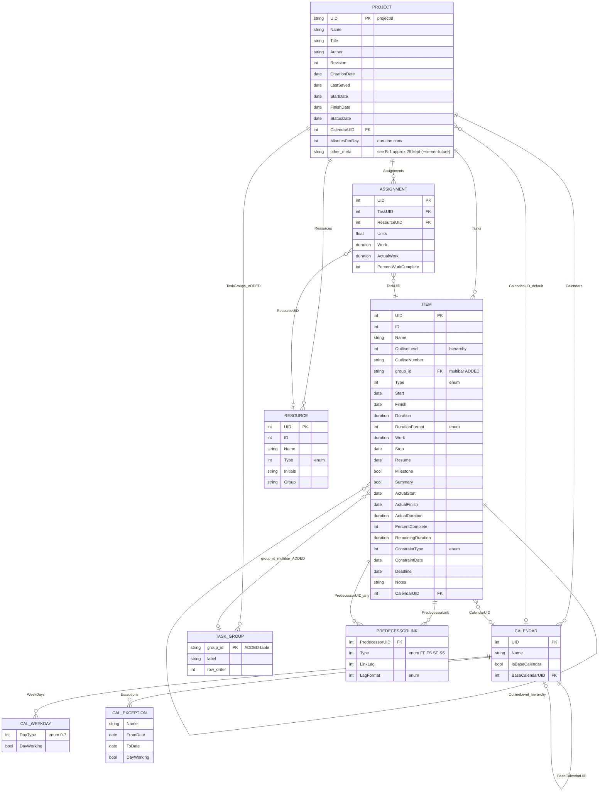

# MSPDI テーブル責務一覧 & 非テーブル要素

- 日付: 2026-07-24
- 対象: `mspdi/mspdi_pj12.xsd`（Microsoft Office Project 2007 XML Data Interchange Schema）
- 目的: MSPDI の全エンティティ（テーブル）の責務を一覧化し、ERD に「行」として現れない要素（スカラー/コンテナ/value-object）も棚卸しして、断捨離の判断材料にする。
- 関連: `mspdi-core-tree.md`（MSPDI 解説）, `mspdi-declutter-erd-ja.md`（Step1-6 断捨離・ERD）

---

## A. テーブル（エンティティ）責務一覧 — 全 29

種別: **◎=中核 / ○=定義系 / △=衛星（小・従属） / □=コンテナ寄り**。
「断捨離」列は GRS（マルチバー日程表）での要否（`mspdi-declutter-erd-ja.md` Step3 の判断）。
「採否」列（最右）: **○=採用 / △=採用（畳込・条件付） / ×=不採用**。採用は **8**（中核6 ＋ Calendar_WeekDay ＋ Calendar_Exception）。
※ WorkingTime（勤務時刻）と Task_Baseline は不採用に確定（日粒度描画で時刻不要 / 変更前予定グレーは**別ファイル baseline** で代替 = P6 式・既存 `40-data-format.sdoc` と一致）。

| # | テーブル | 種 | 責務（一言） | カード | 断捨離 | 採否 |
|---|---|:--:|---|---|:--:|:--:|
| 1 | **Project** | ◎ | ルート。1ファイル=1PJ。全体設定＋全コレクション保持 | 1 | 残（軽量化） | ○ |
| 2 | **Task** | ◎ | 作業項目（バー）。予定/実績/階層/属性の本体 | 0..* | 残 | ○ |
| 3 | **PredecessorLink** | ◎ | タスク間依存（先行UID＋種別＋ラグ）＝依存線 | 0..* | 残 | ○ |
| 4 | **Calendar** | ◎ | 稼働/非稼働時間の定義 | 1..* | 残（軽量） | ○ |
| 5 | **Resource** | ◎ | 人/設備/材料/コスト資源 | 0..* | 残（軽量） | ○ |
| 6 | **Assignment** | ◎ | タスク×資源の割当（交差表） | 0..* | 残（軽量） | ○ |
| 7 | TimephasedData | ◎ | 作業/コストを時間軸に分解した時系列値（共有子） | 0..* | **削**（MVP） | × |
| 8 | Calendar_WeekDay | △ | 曜日ごとの稼働可否（稼働日か否か） | 0..* | 残 | ○ |
| 9 | Calendar_Exception | △ | 祝日・特別日（繰り返しルール付） | 0..* | 残（簡略） | ○ |
| 10 | Calendar_WorkWeek | △ | 期間限定の週稼働パターン上書き | 0..* | **削** | × |
| 11 | WorkWeek_WeekDay | △ | WorkWeek 内の曜日定義 | 0..* | **削** | × |
| 12 | WorkingTime | △ | 勤務時刻（09:00-18:00 等、最大5） | 0..5 | **削**（日粒度描画で時刻不要） | × |
| 13 | Task_Baseline | △ | タスクの計画スナップショット（基準0〜10） | 0..* | **削**（→ 別ファイル baseline で代替） | × |
| 14 | Resource_Baseline | △ | 資源の計画スナップショット | 0..* | **削** | × |
| 15 | Assignment_Baseline | △ | 割当の計画スナップショット | 0..* | **削** | × |
| 16 | OutlineCode | ○ | 独自コード体系の定義（分類マスク） | 0..* | **削** | × |
| 17 | OutlineCodeValue | ○ | OutlineCode のルックアップ値（階層） | 0..* | **削** | × |
| 18 | OutlineCodeMask | ○ | OutlineCode の桁マスク定義 | 0..* | **削** | × |
| 19 | Task_OutlineCode | △ | タスクの分類コード割当値 | 0..* | **削** | × |
| 20 | Resource_OutlineCode | △ | 資源の分類コード割当値 | 0..* | **削** | × |
| 21 | WBSMasks | □ | WBS自動採番の設定（コンテナ兼設定3項目） | 0..1 | **削** | × |
| 22 | WBSMask | ○ | WBS各レベルの採番マスク | 0..* | **削** | × |
| 23 | ExtAttr_Def | ○ | ユーザー定義カスタムフィールドの宣言 | 0..* | **削** | × |
| 24 | ExtAttr_ValueItem | △ | カスタムフィールドの選択肢値 | 0..* | **削** | × |
| 25 | Task_ExtendedAttribute | △ | タスクのカスタムフィールド値 | 0..* | **削** | × |
| 26 | Resource_ExtendedAttribute | △ | 資源のカスタム値 | 0..* | **削** | × |
| 27 | Assignment_ExtendedAttribute | △ | 割当のカスタム値 | 0..* | **削** | × |
| 28 | AvailabilityPeriod | △ | 資源の期間別稼働可能率 | 0..* | **削** | × |
| 29 | Rate | △ | 資源の期間別単価表（最大25） | 0..* | **削** | × |

### 構成の要点

中核はわずか **6**（Project / Task / PredecessorLink / Calendar / Resource / Assignment）。
残り 23 は下記の系統で、**大半が断捨離対象**。だから断捨離後は 29 → **8** に落ちる。

| 系統 | テーブル | 断捨離 |
|---|---|---|
| 分類コード系 | OutlineCode, OutlineCodeValue, OutlineCodeMask, Task_OutlineCode, Resource_OutlineCode, WBSMasks, WBSMask | 全削 |
| カスタムフィールド系 | ExtAttr_Def, ExtAttr_ValueItem, Task/Resource/Assignment_ExtendedAttribute | 全削 |
| Baseline 系 | Task_Baseline, Resource_Baseline, Assignment_Baseline | **全削**（→ 別ファイル baseline で代替） |
| カレンダー詳細 | Calendar_WeekDay（残）, Calendar_Exception（残） / WorkingTime, Calendar_WorkWeek, WorkWeek_WeekDay（削） | 一部 |
| 時系列 | TimephasedData | 削 |
| 単価/稼働 | Rate, AvailabilityPeriod | 全削 |

**採用 8 テーブル**: Project / Task / PredecessorLink / Calendar / Calendar_WeekDay / Calendar_Exception / Resource / Assignment（＋ GRS 追加の TASK_GROUP）

---

## 残ったテーブルの ERD（断捨離後 8 ＋ マルチバー）

採用 8 テーブルに、マルチバー用 `TASK_GROUP` を 1 枚追加した最終形。
WorkingTime 削除により WeekDay は「稼働日か否か」のみ。Baseline は持たず別ファイルで代替。
階層（OutlineLevel）とマルチバー行（group_id）は独立 2 軸。

**残存テーブル ERD:**



---

## B. テーブルに無い要素 — 全項目 要否判定（1行1項目）

凡例: **○=残す / ×=削除**（△は解消し全項目を確定）。
集計（B-1）: **○26 / ×37**（63項目）。カテゴリ単位の確定方針:
識別/文書・期間/基準日・既定暦は「×以外採用」、通貨・タスク書式・計算・Move・EV は「全削」、**サーバ/管理は将来のサーバ連携予定のため全採用**。

### B-1. Project 直下スカラー（63）

**識別/文書（14）→ ○12 / ×2**

| 要素 | 要否 | 理由 |
|---|:--:|---|
| SaveVersion | ○ | MSPDI export 書出し時のバージョンメタ |
| UID | ○ | プロジェクト GUID（= projectId、識別） |
| Name | ○ | プロジェクト名 |
| Title | ○ | 文書タイトル（ヘッダ表示） |
| Subject | ○ | 主題（メタ） |
| Category | ○ | 分類（メタ） |
| Company | ○ | 会社名（透かし） |
| Manager | ○ | 管理者名（メタ） |
| Author | ○ | 作成者（来歴・透かし） |
| CreationDate | ○ | 作成日時（来歴） |
| Revision | ○ | 改訂番号（版管理・必須） |
| LastSaved | ○ | 最終保存日時（来歴） |
| ExtendedCreationDate | × | CreationDate と重複（MS 内部用） |
| RemoveFileProperties | × | MS ファイルプロパティ削除フラグ（無関係） |

**期間/基準日（8）→ ○5 / ×3**

| 要素 | 要否 | 理由 |
|---|:--:|---|
| ScheduleFromStart | ○ | 前方/後方計算の向き |
| StartDate | ○ | プロジェクト開始 |
| FinishDate | ○ | プロジェクト完了 |
| StatusDate | ○ | イナズマ線の基準日（コア） |
| CurrentDate | ○ | 「現在日」参照 |
| FYStartDate | × | 会計年度開始（会計用途・非対象） |
| FiscalYearStart | × | 会計年度フラグ（非対象） |
| CriticalSlackLimit | × | CPM スラック閾値（非対象） |

**既定暦/時刻/換算（8）→ ○5 / ×3**

| 要素 | 要否 | 理由 |
|---|:--:|---|
| CalendarUID | ○ | 既定カレンダー参照 |
| DefaultStartTime | × | 新規タスク既定開始時刻（日粒度で不要） |
| DefaultFinishTime | × | 同上（不要） |
| MinutesPerDay | ○ | 期間換算（1日=分）。MSPDI Duration 解釈に必須 |
| MinutesPerWeek | ○ | 期間換算（1週=分） |
| DaysPerMonth | ○ | 期間換算（1月=日） |
| WeekStartDay | ○ | 週の開始曜日（カレンダー表示） |
| NewTaskStartDate | × | 新規タスク既定開始（編集プリファレンス） |

**通貨（4）→ 全 ×**（コスト非対象）

| 要素 | 要否 | 理由 |
|---|:--:|---|
| CurrencyDigits | × | コスト非対象 |
| CurrencySymbol | × | コスト非対象 |
| CurrencyCode | × | コスト非対象 |
| CurrencySymbolPosition | × | コスト非対象 |

**既定タスク/レート/書式（9）→ 全 ×**

| 要素 | 要否 | 理由 |
|---|:--:|---|
| DefaultTaskType | × | 新規タスク既定タイプ（編集既定・不要） |
| DefaultFixedCostAccrual | × | コスト計上（非対象） |
| DefaultStandardRate | × | 単価（非対象） |
| DefaultOvertimeRate | × | 単価（非対象） |
| NewTasksEffortDriven | × | ソルバ既定（非対象） |
| NewTasksEstimated | × | 見積フラグ既定（非対象） |
| DefaultTaskEVMethod | × | EV（非対象） |
| DurationFormat | × | 既定期間表示単位（不要） |
| WorkFormat | × | 作業表示単位（作業非重視） |

**計算オプション（10）→ 全 ×**

| 要素 | 要否 | 理由 |
|---|:--:|---|
| EditableActualCosts | × | コスト（非対象） |
| HonorConstraints | × | 制約遵守挙動（既定で足りる） |
| InsertedProjectsLikeSummary | × | サブプロジェクト（非対象） |
| MultipleCriticalPaths | × | CPM（非対象） |
| SplitsInProgressTasks | × | 分割許可挙動フラグ（不要） |
| SpreadActualCost | × | コスト（非対象） |
| SpreadPercentComplete | × | ソルバ（非対象） |
| TaskUpdatesResource | × | 資源計算（非対象） |
| Autolink | × | 自動リンク挙動（編集） |
| AutoAddNewResourcesAndTasks | × | 編集挙動 |

**Move 系（4）→ 全 ×** — 実績の再スケジュール挙動

| 要素 | 要否 | 理由 |
|---|:--:|---|
| MoveCompletedEndsBack | × | ソルバ再配置挙動（非対象） |
| MoveRemainingStartsBack | × | 同上 |
| MoveRemainingStartsForward | × | 同上 |
| MoveCompletedEndsForward | × | 同上 |

**EV（2）→ 全 ×**

| 要素 | 要否 | 理由 |
|---|:--:|---|
| EarnedValueMethod | × | アーンドバリュー（非対象） |
| BaselineForEarnedValue | × | EV 用基準選択（非対象） |

**サーバ/管理（4）→ 全 ○**（将来サーバ連携予定）

| 要素 | 要否 | 理由 |
|---|:--:|---|
| MicrosoftProjectServerURL | ○ | 将来サーバ連携で使用予定 |
| ProjectExternallyEdited | ○ | 将来サーバ連携（外部編集フラグ） |
| ActualsInSync | ○ | 将来サーバ連携（実績同期フラグ） |
| AdminProject | ○ | 将来サーバ連携（管理プロジェクト） |

### B-2. コンテナ（wrapper）— データを持たない入れ物（15）

**「吸収」とは**: `<Tasks>` のように **中身を囲むだけでデータを持たない要素**は、JSON では配列 `items: [ … ]` の**角括弧 `[ ]` になるだけ**でテーブルにしない。これを吸収と呼ぶ（情報損失ゼロ）。

```
XML:   <Tasks><Task>…</Task><Task>…</Task></Tasks>
JSON:  "items": [ {…}, {…} ]      ← <Tasks> は [ ] に化けた = 吸収
```

| 要素 | 要否 | 理由 |
|---|:--:|---|
| Tasks | 吸収 | items[] の配列構造に吸収 |
| Resources | 吸収 | resources[] に吸収 |
| Assignments | 吸収 | assignments[] に吸収 |
| Calendars | 吸収 | calendars[] に吸収 |
| WeekDays | 吸収 | Calendar の weekDays[] に吸収 |
| Exceptions | 吸収 | Calendar の exceptions[] に吸収 |
| OutlineCodes | × | 分類コード系ごと削除 |
| ExtendedAttributes | × | カスタムフィールド系ごと削除 |
| WorkWeeks | × | WorkWeek 系ごと削除 |
| WorkingTimes | × | 勤務時刻ごと削除 |
| Values | × | OutlineCode 値ごと削除 |
| Masks | × | OutlineCode マスクごと削除 |
| ValueList | × | ExtAttr 値リストごと削除 |
| Rates | × | 単価表ごと削除 |
| AvailabilityPeriods | × | 稼働可能率ごと削除 |

### B-3. value-object 小要素（親に 0..1 で畳込、2）

**「畳み込み（fold）」とは**: 親に1個だけ入る小さな塊を、別構造にせず**フィールドを親に直接平らに展開**すること。TimePeriod は採用だが独立させず、Exception の列にする。

```
XML:    <Exception><Name>…</Name>
          <TimePeriod><FromDate>…</FromDate><ToDate>…</ToDate></TimePeriod></Exception>
畳込む:  Exception { name, from_date, to_date }        ← 情報は完全に残る（ネストを1段減らすだけ）
```

| 要素 | 要否 | 理由 |
|---|:--:|---|
| `TimePeriod` { FromDate, ToDate } | ○ | Calendar_Exception の from_date / to_date として親に畳込 |
| `WorkingTime` { FromTime, ToTime } | × | 勤務時刻・日粒度描画で不要 |

---

## まとめ

- MSPDI 全 **29 テーブル**。ただし中核は **6** のみで、残り 23 は分類コード/カスタムフィールド/Baseline/カレンダー詳細/時系列/単価の従属テーブル。
- ERD 非表示要素は「Project スカラー 63（**○26 / ×37**）」「コンテナ 15（吸収6 / 削9）」「value-object 2（TimePeriod ○ / WorkingTime ×）」。文書メタ・期間換算・**サーバ管理4（将来連携）**は残す。
- GRS は **採用 8 テーブル**（中核 6 ＋ Calendar_WeekDay ＋ Calendar_Exception）＋ マルチバー用 `TASK_GROUP` の計 **9**。Baseline はテーブルに持たず**別ファイル baseline**（P6 式）で代替。WorkingTime（勤務時刻）不採用。詳細は `mspdi-declutter-erd-ja.md`。
