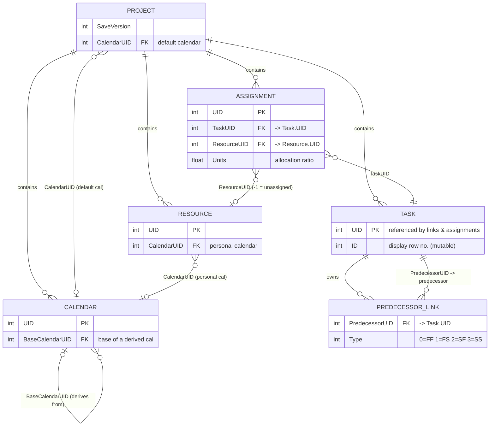
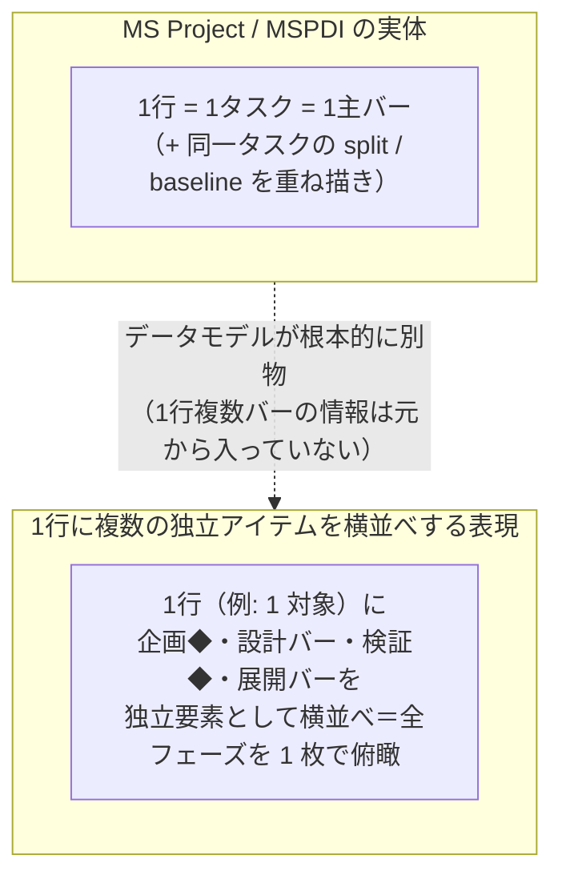

# MSPDI コアツリー

`mspdi/mspdi_pj12.xsd`（全3906行）の**本質だけ**を抜き出したツリー。
XSD を一枚絵で理解するためのビューであり、正本ではない。
バリデーション・パースの正は原 `.xsd` を参照すること。

---

## そもそも MSPDI とは / DI は何の略か

- **MSPDI** = **M**icro**s**oft **P**roject **D**ata **I**nterchange
- **DI** = **Data Interchange**（データ交換）。「相互運用のための受け渡し形式」という意味。
  「Import/Export」の *change* ではなく、*interchange*（＝異なるソフト間でやり取りする共通形式）。
- 正式名称は "Microsoft Office Project 2007 XML Data Interchange Schema"。
- 実体は **1つの XML スキーマ（XSD）**。MS Project が「ファイル→エクスポート→XML」で吐き、
  「開く→XML」で読む、その XML の構造を定義している。`.mpp`（バイナリ独自形式）に対する
  **公開テキスト形式**という位置づけ。
- 名前空間: `http://schemas.microsoft.com/project/2007`
- このスキーマは 2007 年版だが、以降の MS Project でも後方互換で読み書きできる事実上の標準。

### 3行で言うと

1. プロジェクト1件 = XML 1ファイル = ルート要素 `<Project>` 1個。
2. `<Project>` の中身は「**設定値の羅列**」＋「**5つの大きなリスト**」（カレンダー / タスク / リソース / 割当 / 拡張属性）。
3. リストの各要素は **UID（整数の一意ID）**を持ち、要素同士は UID で参照し合う（＝リレーショナルDBをXMLにしたもの）。

---

## 30,000ft メンタルモデル

```text
Project（プロジェクト＝ファイル1個）
  │
  ├─ 【設定】  通貨・既定時刻・スケジュール方針… スカラー値が約90個ベタ並び
  │
  └─ 【データ】 相互に UID で参照し合う5つのテーブル
       │
       Calendars ──────< 稼働日・稼働時間の定義（祝日/休日/勤務時間帯）
          ▲                              ▲
          │ CalendarUID                  │ CalendarUID
       Tasks ─────────< 作業項目（ガントの「バー」）。親子で階層、PredecessorLink で依存
          ▲                              
          │ TaskUID                      
       Assignments ───< 「どのタスクに・どのリソースを・何%割り当てるか」の交差テーブル
          │ ResourceUID                  
          ▼                              
       Resources ─────< 人・設備・材料・コスト（誰が/何が作業するか）
```

- **Task × Resource は多対多** → その交点が `Assignment`（中間テーブル）。
  これは DB の設計とまったく同じ。「田中さんが設計タスクに50%」= 1 Assignment。
- **時系列の実績値**（週ごとの作業量など）は `TimephasedData` という共通ブロックで、
  Task / Resource / Assignment のどれにもぶら下がりうる。

---

## コアツリー

> ⚠️ **このツリーは意味で分類してある。XSD の文書順ではない。**
> 【メタ情報】【スケジュール方針】【通貨・表示】という括りは**読んで理解するための並べ替え**であり、
> 実際の並びとは違う（例: `StatusDate` は実際には **53 番目**、`CurrencyCode` は **20 番目**で
> `CalendarUID`（22 番目）より**前**にある）。
> **このツリーの順に書き出すと XSD 非妥当な XML になる。**
> **書き出す順は「XSD の要素順と最小妥当文書」節が正**（本書の下の方）。

凡例:
```text
?          省略可（minOccurs=0）
(a..b)     繰り返し回数（* = 無制限）
: 型       xsd の型（int / str / dateTime / duration / bool / decimal / float）
enum{...}  取りうる値と意味
→ …        本ツリーでは展開省略（枝が深いだけで本質は上に集約済み）
★          UID による相互参照の要（リレーションのキー）
```

```text
Project                                    # ルート。1ファイル=1プロジェクト
│
├─【メタ情報】
│  ├─ SaveVersion : int                    # 必須。書き出した Project のバージョン
│  ├─ Name? / Title? / Subject? : str
│  ├─ Author? / Manager? / Company? : str
│  ├─ CreationDate? / LastSaved? : dateTime
│  └─ Revision? : int
│
├─【スケジュール方針】
│  ├─ ScheduleFromStart? : bool            # true=開始日基準で前方計算 / false=完了日基準で後方計算
│  ├─ StartDate? / FinishDate? : dateTime  # プロジェクト全体の開始/完了
│  ├─ StatusDate? : dateTime               # 予実の基準日（イナズマ線の縦位置）
│  ├─ CalendarUID? : int  ★                # 既定カレンダーへの参照
│  ├─ DefaultStartTime? / DefaultFinishTime? : time
│  ├─ MinutesPerDay? / MinutesPerWeek? / DaysPerMonth? : int  # 「1日」等の換算定義
│  ├─ DefaultTaskType? : enum{0=FixedUnits,1=FixedDuration,2=FixedWork}
│  └─ HonorConstraints? / MultipleCriticalPaths? … : bool     # 計算オプション多数
│
├─【通貨・表示】
│  ├─ CurrencyCode : str                   # 例 "JPY"
│  ├─ CurrencySymbol? : str
│  ├─ CurrencyDigits? : int
│  └─ CurrencySymbolPosition? : enum{0=前,1=後,2=前+空白,3=後+空白}
│
├─ OutlineCodes?      → OutlineCode (0..*)  # 独自コード体系（分類マスク定義）
├─ WBSMasks?          → …                   # WBS 採番ルール（Level ごとの桁/区切り）
├─ ExtendedAttributes?→ ExtendedAttribute (0..*)  # ユーザー定義フィールドの「定義」
│     ├─ FieldID : str                      # Text1, Number3 等の内部ID
│     ├─ FieldName? : str                    # 表示名
│     └─ Alias? / ValueList? : …             # 実際の値は各 Task/Resource 側に格納
│
├─ Calendars?
│  └─ Calendar (1..*)   ★                   # 稼働カレンダー
│     ├─ UID : int  ★                       # 参照キー
│     ├─ Name? : str
│     ├─ IsBaseCalendar? : bool             # true=基準暦 / false=派生暦
│     ├─ BaseCalendarUID? : int  ★          # 派生元カレンダー
│     ├─ WeekDays? → WeekDay (0..*)          # 曜日ごとの稼働定義
│     │   ├─ DayType : enum{0=例外日,1=日,2=月,3=火,4=水,5=木,6=金,7=土}
│     │   ├─ DayWorking? : bool             # その日/曜日が稼働か
│     │   └─ WorkingTimes? → WorkingTime (0..5)  # 1日最大5つの勤務時間帯
│     │        └─ FromTime? / ToTime? : time
│     ├─ Exceptions? → Exception (0..*)      # 祝日・特別休など（繰り返しルール付き）
│     │   ├─ Name? : str
│     │   ├─ TimePeriod? { FromDate, ToDate : dateTime }
│     │   └─ Type? : enum{1=毎日,2=毎年(日付),3=毎年(位置),4=毎月(日付),
│     │                   5=毎月(位置),6=毎週,7=日数,8=曜日数,9=なし}
│     └─ WorkWeeks? → …                      # 週単位の稼働パターン上書き
│
├─ Tasks?
│  └─ Task (0..*)   ★                       # ← ガントの「バー」に相当する中核
│     ├─ UID : int  ★                       # 不変の一意ID（PredecessorLink 等の参照先）
│     ├─ ID? : int                          # 表示上の行番号（並べ替えで変わりうる）
│     ├─ Name? : str(≤512)
│     ├─ IsNull? : bool                     # 欠番行のプレースホルダ
│     │
│     ├─【階層】
│     │  ├─ OutlineLevel? : int             # 階層の深さ（1=最上位）。親子＝サマリ/子
│     │  ├─ OutlineNumber? : str            # "1.2.3" 形式
│     │  ├─ WBS? / WBSLevel? : str
│     │  └─ Summary? : bool                 # true=サマリタスク（子を束ねる）
│     │
│     ├─【予定（スケジュール）】
│     │  ├─ Start? / Finish? : dateTime
│     │  ├─ Duration? : duration            # 例 "PT8H0M0S"（ISO8601 duration）
│     │  ├─ DurationFormat? : enum{7=d,9=w,11=mo,5=h,3=m,19=%,…(約30種),末尾?=推定}
│     │  ├─ Work? : duration                # 総工数
│     │  ├─ Type? : enum{0=FixedUnits,1=FixedDuration,2=FixedWork}
│     │  ├─ Milestone? : bool               # true=マイルストーン（期間0の点）
│     │  ├─ Critical? : bool                # クリティカルパス上か
│     │  ├─ Priority? : int (0..1000)
│     │  └─ ConstraintType? / ConstraintDate? : …   # 制約（例: この日以降開始）
│     │
│     ├─【実績（予実）】
│     │  ├─ ActualStart? / ActualFinish? : dateTime
│     │  ├─ ActualDuration? / ActualWork? : duration
│     │  ├─ PercentComplete? : int          # 進捗率(%)。バーの塗り
│     │  ├─ PercentWorkComplete? : int
│     │  ├─ RemainingDuration? / RemainingWork? : duration
│     │  ├─ Stop? / Resume? : dateTime       # 中断/再開（スプリット）
│     │  └─ EarlyStart/EarlyFinish/LateStart/LateFinish? : dateTime  # CPM計算結果
│     │
│     ├─【コスト】
│     │  ├─ Cost? / FixedCost? / ActualCost? / RemainingCost? : decimal
│     │  └─ BCWS? / BCWP? / ACWP? / SV? / CV? : float   # アーンドバリュー指標
│     │
│     ├─ PredecessorLink (0..*)  ★          # ← 依存関係（依存線そのもの）
│     │  ├─ PredecessorUID : int  ★         # 先行タスクの UID
│     │  ├─ Type? : enum{0=FF,1=FS,2=SF,3=SS}  # FS=完了→開始（最頻）
│     │  ├─ LinkLag? : int                  # リード/ラグ（1/10分単位、負でリード）
│     │  └─ LagFormat? : enum{7=d,9=w,19=%,…}
│     │
│     ├─ ExtendedAttribute (0..*)           # ユーザー定義フィールドの「値」
│     │  ├─ FieldID : str  ★                # ↑ Project.ExtendedAttributes の定義を参照
│     │  └─ Value? : str
│     ├─ Baseline (0..*)                     # 計画スナップショット（当初計画の凍結）
│     │  └─ Number, Start, Finish, Work, Cost, …
│     ├─ OutlineCode (0..*)                  # 分類コードの割当値
│     └─ TimephasedData (0..*)               # 時系列に分解した値（下記共通ブロック）
│
├─ Resources?
│  └─ Resource (0..*)   ★                   # 人・設備・材料・コスト
│     ├─ UID : int  ★                       # 参照キー
│     ├─ ID? : int
│     ├─ Name? : str
│     ├─ Type? : enum{0=Material,1=Work}    # Work=人/設備, Material=消費財
│     ├─ Initials? / Group? / Code? : str
│     ├─ EmailAddress? / NTAccount? : str
│     ├─ Phonetics? : str                   # ふりがな（日本語専用フィールド）
│     ├─ MaxUnits? : float (既定1.0)         # 最大稼働率（1.0=100%）
│     ├─ MaterialLabel? : str               # 材料の単位（"個"等）
│     ├─ AccrueAt? : enum{1=Start,2=End,3=Prorated}   # コスト計上タイミング
│     ├─ StandardRate? / OvertimeRate? / CostPerUse? : decimal
│     ├─ Cost? / ActualCost? / Work? / ActualWork? : …
│     ├─ CalendarUID? : int  ★              # 個人カレンダーへの参照
│     ├─ Rates? → Rate (0..25)              # 期間ごとの単価テーブル
│     │   ├─ RatesFrom / RatesTo : dateTime
│     │   ├─ RateTable? : enum{0=A,1=B,2=C,3=D,4=E}
│     │   └─ StandardRate? / OvertimeRate? / CostPerUse? : decimal
│     ├─ ExtendedAttribute (0..*) / Baseline (0..*) / OutlineCode (0..*)
│     └─ TimephasedData (0..*)
│
└─ Assignments?
   └─ Assignment (0..*)   ★                 # Task × Resource の割当（交差テーブル）
      ├─ UID : int  ★
      ├─ TaskUID? : int  ★                  # → どの Task か
      ├─ ResourceUID? : int  ★              # → どの Resource か（-1 で未割当）
      ├─ Units? : float                     # 割当率（0.5=50%）
      ├─ Work? / ActualWork? / RemainingWork? : duration
      ├─ Start? / Finish? : dateTime
      ├─ ActualStart? / ActualFinish? : dateTime
      ├─ PercentWorkComplete? : int
      ├─ Cost? / ActualCost? / RemainingCost? : decimal
      ├─ WorkContour? : enum{0=Flat,1=BackLoaded,2=FrontLoaded,3=DoublePeak,…}  # 工数の時間配分曲線
      ├─ CostRateTable? : enum{0=A,…,4=E}   # 使用する単価テーブル
      ├─ ExtendedAttribute (0..*) / Baseline (0..*)
      └─ TimephasedData (0..*)
```

---

## 主要概念のデータ定義（開始/停止・依存線・マイルストーン）

MSPDI は「バー」という描画オブジェクトを持たない。**Task の日付フィールド群から Gantt ビューがバーを描く**。
以下は日程表の中核概念が、実際どのフィールドで表現されるか。

### タスクの開始 / 停止（＝期間）

1タスクの時間軸は「**予定・実績・中断**」の3系統で表す。

```xml
<Task>
  <UID>12</UID>
  <Name>詳細設計</Name>
  <!-- 予定（スケジューラが計算 or 制約で固定） -->
  <Start>2026-07-01T09:00:00</Start>
  <Finish>2026-07-10T17:00:00</Finish>
  <Duration>PT72H0M0S</Duration>       <!-- ISO8601: 72稼働時間 -->
  <!-- 実績（予実の右側・イナズマ線の元） -->
  <ActualStart>2026-07-01T09:00:00</ActualStart>
  <ActualFinish>2026-07-12T17:00:00</ActualFinish>  <!-- 遅延して着地 -->
  <PercentComplete>100</PercentComplete>
  <!-- 中断（スプリット） -->
  <Stop>2026-07-05T17:00:00</Stop>     <!-- ここで止まった -->
  <Resume>2026-07-08T09:00:00</Resume> <!-- ここで再開 -->
  <ResumeValid>1</ResumeValid>
</Task>
```

- **予定**: `Start` / `Finish` / `Duration`。三者は連動し、`Type`（FixedUnits/Duration/Work）が
  「どれを固定して残りを再計算するか」を決める。
- **実績**: `ActualStart` / `ActualFinish` / `PercentComplete` / `ActualDuration` / `RemainingDuration`。
- **中断（split）**: `Stop` / `Resume`。ただしこの1組は**1回の中断点**しか表さない。
  連続した複数スプリットの正確な形は `TimephasedData`（作業量の時系列配分で**作業ゼロの区間＝ギャップ**）が保持する。
- ⚠️ `Start`（タスクの開始日時）と `Stop`（進行中タスクが止まった日時）は**別物**。
  `Stop`/`Resume` は「開始/終了」ではなく「中断/再開」。

### 依存線（＝タスク間リンク）

依存は「線」オブジェクトではなく、**後続タスクの中**に先行への参照として持つ（0..*）。
線の描画は後続側がこの参照を辿って引く。

```xml
<Task>
  <UID>20</UID>
  <Name>製造</Name>
  <PredecessorLink>
    <PredecessorUID>12</PredecessorUID>  <!-- ★ 先行タスク(詳細設計)の UID -->
    <Type>1</Type>                        <!-- 1 = FS（完了→開始）most common -->
    <LinkLag>4800</LinkLag>               <!-- +480分=8時間のラグ。単位=1/10分 -->
    <LagFormat>7</LagFormat>              <!-- 7 = 日 -->
  </PredecessorLink>
</Task>
```

- **Type**: `0=FF`（完了→完了）, `1=FS`（完了→開始・最頻）, `2=SF`（開始→完了）, `3=SS`（開始→開始）。
- **LinkLag**: リード/ラグ。**1/10分単位の整数**（`4800` = 480分 = 8時間）。負値でリード（前倒し）。
- 参照の向きは必ず**後続 → 先行**。1タスクに複数の `PredecessorLink` を並べて多先行を表す。

### マイルストーン（＝期間ゼロの点）

専用要素はない。**通常の Task に `Milestone=1` フラグを立てる**だけ。慣習で `Duration=0`（開始＝完了）。

```xml
<Task>
  <UID>30</UID>
  <Name>設計審査（DR）</Name>
  <Start>2026-07-10T17:00:00</Start>
  <Finish>2026-07-10T17:00:00</Finish>  <!-- 開始=完了 -->
  <Duration>PT0H0M0S</Duration>          <!-- 期間0 -->
  <Milestone>1</Milestone>               <!-- ★ これで◆表示になる -->
</Task>
```

- `Milestone=1` は**表示上の意味**（Gantt が棒でなく◆で描く）。計算上は期間0のタスク。
- `Duration=0` でも `Milestone=0` なら通常タスク扱い。逆に `Duration>0` でも `Milestone=1` にできる（フラグ優先）。

---

## 共通ブロック: TimephasedData（時系列データ）

Task / Resource / Assignment のどれにも `(0..*)` でぶら下がる。
「作業量・コストを日/週などの粒度で時間軸に沿って分解した値」を表す。
イナズマ線・S字カーブ・工数ヒストグラムの元データ。

```text
TimephasedData
  ├─ Type? : enum(72種)   # 何の値か。最大コードは 76 だが 12〜15 は欠番。例: 1=割当の残作業, 2=割当の実績作業,
  │                       #   11=タスク進捗率, 9=タスクベースライン作業, 76=物理進捗率 …
  ├─ UID : int
  ├─ Start? / Finish? : dateTime   # この一区間の期間
  ├─ Unit? : enum{0=m,1=h,2=d,3=w,5=mo,8=y}   # 時間粒度。4・6・7 は欠番
  └─ Value? : str                  # その区間の値（作業量やコスト）
```

### TimephasedData.Type 全対応表（原 XSD 35〜107 行 / enum 112〜183 行）

- 有効なコードは **1〜11 と 16〜76 の計72個**。**12〜15 は欠番（予約・未使用）**。
- 名称の "Baseline"（番号なし）= **ベースライン0（既定の基準計画）**。"Baseline 1〜10" は追加の保存枠。
- **16〜75 は 6 個周期の規則的パターン**: 各ベースライン N について
  `[Assignment Work, Assignment Cost, Task Work, Task Cost, Resource Work, Resource Cost]` の順。
- 大別すると3系統:
  - **実績・残・進捗**（1,2,3,6,11,76）: 予実可視化の主データ
  - **ベースライン0**（4,5,7,8,9,10）: 既定の基準計画
  - **ベースライン1〜10**（16〜75）: 追加の基準計画スナップショット

| コード | 英語名（原文） | 対象 | 指標 | 基準番号 | 和訳 |
|---:|---|---|---|:--:|---|
| 1 | Assignment Remaining Work | 割当 | 残作業 | — | 割当: 残作業 |
| 2 | Assignment Actual Work | 割当 | 実績作業 | — | 割当: 実績作業 |
| 3 | Assignment Actual Overtime Work | 割当 | 実績残業 | — | 割当: 実績残業作業 |
| 4 | Assignment Baseline Work | 割当 | 作業 | 0 | 割当: ベースライン作業 |
| 5 | Assignment Baseline Cost | 割当 | コスト | 0 | 割当: ベースラインコスト |
| 6 | Assignment Actual Cost | 割当 | 実績コスト | — | 割当: 実績コスト |
| 7 | Resource Baseline Work | リソース | 作業 | 0 | リソース: ベースライン作業 |
| 8 | Resource Baseline Cost | リソース | コスト | 0 | リソース: ベースラインコスト |
| 9 | Task Baseline Work | タスク | 作業 | 0 | タスク: ベースライン作業 |
| 10 | Task Baseline Cost | タスク | コスト | 0 | タスク: ベースラインコスト |
| 11 | Task Percent Complete | タスク | 進捗率 | — | タスク: 進捗率(%) |
| *12–15* | *（欠番・予約）* | — | — | — | *未使用* |
| 16 | Assignment Baseline 1 Work | 割当 | 作業 | 1 | 割当: ベースライン1 作業 |
| 17 | Assignment Baseline 1 Cost | 割当 | コスト | 1 | 割当: ベースライン1 コスト |
| 18 | Task Baseline 1 Work | タスク | 作業 | 1 | タスク: ベースライン1 作業 |
| 19 | Task Baseline 1 Cost | タスク | コスト | 1 | タスク: ベースライン1 コスト |
| 20 | Resource Baseline 1 Work | リソース | 作業 | 1 | リソース: ベースライン1 作業 |
| 21 | Resource Baseline 1 Cost | リソース | コスト | 1 | リソース: ベースライン1 コスト |
| 22 | Assignment Baseline 2 Work | 割当 | 作業 | 2 | 割当: ベースライン2 作業 |
| 23 | Assignment Baseline 2 Cost | 割当 | コスト | 2 | 割当: ベースライン2 コスト |
| 24 | Task Baseline 2 Work | タスク | 作業 | 2 | タスク: ベースライン2 作業 |
| 25 | Task Baseline 2 Cost | タスク | コスト | 2 | タスク: ベースライン2 コスト |
| 26 | Resource Baseline 2 Work | リソース | 作業 | 2 | リソース: ベースライン2 作業 |
| 27 | Resource Baseline 2 Cost | リソース | コスト | 2 | リソース: ベースライン2 コスト |
| 28 | Assignment Baseline 3 Work | 割当 | 作業 | 3 | 割当: ベースライン3 作業 |
| 29 | Assignment Baseline 3 Cost | 割当 | コスト | 3 | 割当: ベースライン3 コスト |
| 30 | Task Baseline 3 Work | タスク | 作業 | 3 | タスク: ベースライン3 作業 |
| 31 | Task Baseline 3 Cost | タスク | コスト | 3 | タスク: ベースライン3 コスト |
| 32 | Resource Baseline 3 Work | リソース | 作業 | 3 | リソース: ベースライン3 作業 |
| 33 | Resource Baseline 3 Cost | リソース | コスト | 3 | リソース: ベースライン3 コスト |
| 34 | Assignment Baseline 4 Work | 割当 | 作業 | 4 | 割当: ベースライン4 作業 |
| 35 | Assignment Baseline 4 Cost | 割当 | コスト | 4 | 割当: ベースライン4 コスト |
| 36 | Task Baseline 4 Work | タスク | 作業 | 4 | タスク: ベースライン4 作業 |
| 37 | Task Baseline 4 Cost | タスク | コスト | 4 | タスク: ベースライン4 コスト |
| 38 | Resource Baseline 4 Work | リソース | 作業 | 4 | リソース: ベースライン4 作業 |
| 39 | Resource Baseline 4 Cost | リソース | コスト | 4 | リソース: ベースライン4 コスト |
| 40 | Assignment Baseline 5 Work | 割当 | 作業 | 5 | 割当: ベースライン5 作業 |
| 41 | Assignment Baseline 5 Cost | 割当 | コスト | 5 | 割当: ベースライン5 コスト |
| 42 | Task Baseline 5 Work | タスク | 作業 | 5 | タスク: ベースライン5 作業 |
| 43 | Task Baseline 5 Cost | タスク | コスト | 5 | タスク: ベースライン5 コスト |
| 44 | Resource Baseline 5 Work | リソース | 作業 | 5 | リソース: ベースライン5 作業 |
| 45 | Resource Baseline 5 Cost | リソース | コスト | 5 | リソース: ベースライン5 コスト |
| 46 | Assignment Baseline 6 Work | 割当 | 作業 | 6 | 割当: ベースライン6 作業 |
| 47 | Assignment Baseline 6 Cost | 割当 | コスト | 6 | 割当: ベースライン6 コスト |
| 48 | Task Baseline 6 Work | タスク | 作業 | 6 | タスク: ベースライン6 作業 |
| 49 | Task Baseline 6 Cost | タスク | コスト | 6 | タスク: ベースライン6 コスト |
| 50 | Resource Baseline 6 Work | リソース | 作業 | 6 | リソース: ベースライン6 作業 |
| 51 | Resource Baseline 6 Cost | リソース | コスト | 6 | リソース: ベースライン6 コスト |
| 52 | Assignment Baseline 7 Work | 割当 | 作業 | 7 | 割当: ベースライン7 作業 |
| 53 | Assignment Baseline 7 Cost | 割当 | コスト | 7 | 割当: ベースライン7 コスト |
| 54 | Task Baseline 7 Work | タスク | 作業 | 7 | タスク: ベースライン7 作業 |
| 55 | Task Baseline 7 Cost | タスク | コスト | 7 | タスク: ベースライン7 コスト |
| 56 | Resource Baseline 7 Work | リソース | 作業 | 7 | リソース: ベースライン7 作業 |
| 57 | Resource Baseline 7 Cost | リソース | コスト | 7 | リソース: ベースライン7 コスト |
| 58 | Assignment Baseline 8 Work | 割当 | 作業 | 8 | 割当: ベースライン8 作業 |
| 59 | Assignment Baseline 8 Cost | 割当 | コスト | 8 | 割当: ベースライン8 コスト |
| 60 | Task Baseline 8 Work | タスク | 作業 | 8 | タスク: ベースライン8 作業 |
| 61 | Task Baseline 8 Cost | タスク | コスト | 8 | タスク: ベースライン8 コスト |
| 62 | Resource Baseline 8 Work | リソース | 作業 | 8 | リソース: ベースライン8 作業 |
| 63 | Resource Baseline 8 Cost | リソース | コスト | 8 | リソース: ベースライン8 コスト |
| 64 | Assignment Baseline 9 Work | 割当 | 作業 | 9 | 割当: ベースライン9 作業 |
| 65 | Assignment Baseline 9 Cost | 割当 | コスト | 9 | 割当: ベースライン9 コスト |
| 66 | Task Baseline 9 Work | タスク | 作業 | 9 | タスク: ベースライン9 作業 |
| 67 | Task Baseline 9 Cost | タスク | コスト | 9 | タスク: ベースライン9 コスト |
| 68 | Resource Baseline 9 Work | リソース | 作業 | 9 | リソース: ベースライン9 作業 |
| 69 | Resource Baseline 9 Cost | リソース | コスト | 9 | リソース: ベースライン9 コスト |
| 70 | Assignment Baseline 10 Work | 割当 | 作業 | 10 | 割当: ベースライン10 作業 |
| 71 | Assignment Baseline 10 Cost | 割当 | コスト | 10 | 割当: ベースライン10 コスト |
| 72 | Task Baseline 10 Work | タスク | 作業 | 10 | タスク: ベースライン10 作業 |
| 73 | Task Baseline 10 Cost | タスク | コスト | 10 | タスク: ベースライン10 コスト |
| 74 | Resource Baseline 10 Work | リソース | 作業 | 10 | リソース: ベースライン10 作業 |
| 75 | Resource Baseline 10 Cost | リソース | コスト | 10 | リソース: ベースライン10 コスト |
| 76 | Physical Percent Complete | タスク | 物理進捗率 | — | タスク: 物理進捗率(%) |

---

## 相互参照（UID リレーション）まとめ

MSPDI を読むコツは「**UID をキーにした参照を追う**」こと。ネストの深さより参照の向きが本質。

### ERD（UID による参照関係）

`PK` = 主キー（その要素の UID）、`FK` = 他要素の UID を指す外部キー。
記法: `||`=1、`o{`=0以上多、`o|`=0または1。



`TASK ↔ RESOURCE` は `ASSIGNMENT` を介した多対多。`CALENDAR` は自己参照（派生暦→基準暦）を持つ。

### 参照フィールド一覧

| 参照元フィールド | 参照先 | 意味 |
|---|---|---|
| `Project.CalendarUID` | `Calendar.UID` | プロジェクト既定カレンダー |
| `Calendar.BaseCalendarUID` | `Calendar.UID` | 派生カレンダーの基準暦 |
| `Task.PredecessorLink.PredecessorUID` | `Task.UID` | タスク間の依存 |
| `Resource.CalendarUID` | `Calendar.UID` | リソース個人暦 |
| `Assignment.TaskUID` | `Task.UID` | 割当先タスク |
| `Assignment.ResourceUID` | `Resource.UID` | 割当リソース（-1=未割当） |
| `*.ExtendedAttribute.FieldID` | `Project.ExtendedAttributes.ExtendedAttribute.FieldID` | ユーザー定義フィールドの定義 |

---

## XSD の要素順と最小妥当文書（**XSD 実測 2026-08-02**）

**本節が書き出し順の正である。** 上の「コアツリー」は意味で分類した並びなので、そちらに従ってはならない。

出典: `https://schemas.microsoft.com/project/2007/mspdi_pj12.xsd`（ローカル複製の入手手順は `mspdi/README.md`）。
**下の一覧はすべて XSD から機械抽出した**（目視で書き写していない）。

### スキーマ見出しの事実

| 事項 | 値 |
|---|---|
| `targetNamespace` | `http://schemas.microsoft.com/project/2007` |
| **`elementFormDefault`** | **`qualified`** |
| `attributeFormDefault` | **属性が無い**（既定の `unqualified`） |
| トップレベル要素 | **`Project` の 1 つだけ** |

`elementFormDefault="qualified"` なので、**ルートに既定の名前空間を 1 つ宣言すれば全子孫がそれで満たされる**。
接頭辞を付けて回る必要はない。

### 順序の規則 — **1 文で足りる**

> **持っている要素だけを、下の一覧の順に出す。**

- 4 つの容れ物（`Project` / `Task` / `Resource` / `Assignment`）は**すべて `xsd:sequence`** である。
  **省略はできるが、並べ替えはできない。**
- **必須は全体で 3 つだけ** — `Project/SaveVersion`・`Project/CurrencyCode`・各要素の `UID`。
  それ以外は全部 `minOccurs=0` なので、**全数を出す必要はない。**
- したがって「全項目を埋める」実装は要らない。**部分集合を順序どおりに並べれば妥当になる。**

### Project — 70 要素 ／ 必須: `SaveVersion`(1) `CurrencyCode`(20)

```text
1 SaveVersion / 2 UID / 3 Name / 4 Title / 5 Subject / 6 Category / 7 Company / 8 Manager /
9 Author / 10 CreationDate / 11 Revision / 12 LastSaved / 13 ScheduleFromStart / 14 StartDate /
15 FinishDate / 16 FYStartDate / 17 CriticalSlackLimit / 18 CurrencyDigits / 19 CurrencySymbol /
20 CurrencyCode / 21 CurrencySymbolPosition / 22 CalendarUID / 23 DefaultStartTime /
24 DefaultFinishTime / 25 MinutesPerDay / 26 MinutesPerWeek / 27 DaysPerMonth /
28 DefaultTaskType / 29 DefaultFixedCostAccrual / 30 DefaultStandardRate /
31 DefaultOvertimeRate / 32 DurationFormat / 33 WorkFormat / 34 EditableActualCosts /
35 HonorConstraints / 36 EarnedValueMethod / 37 InsertedProjectsLikeSummary /
38 MultipleCriticalPaths / 39 NewTasksEffortDriven / 40 NewTasksEstimated /
41 SplitsInProgressTasks / 42 SpreadActualCost / 43 SpreadPercentComplete /
44 TaskUpdatesResource / 45 FiscalYearStart / 46 WeekStartDay / 47 MoveCompletedEndsBack /
48 MoveRemainingStartsBack / 49 MoveRemainingStartsForward / 50 MoveCompletedEndsForward /
51 BaselineForEarnedValue / 52 AutoAddNewResourcesAndTasks / 53 StatusDate / 54 CurrentDate /
55 MicrosoftProjectServerURL / 56 Autolink / 57 NewTaskStartDate / 58 DefaultTaskEVMethod /
59 ProjectExternallyEdited / 60 ExtendedCreationDate / 61 ActualsInSync /
62 RemoveFileProperties / 63 AdminProject / 64 OutlineCodes / 65 WBSMasks /
66 ExtendedAttributes / 67 Calendars / 68 Tasks / 69 Resources / 70 Assignments
```

> **容れ物は全部いちばん後ろにある**（64〜70）。スカラーを 1 つでも容れ物の後に置くと非妥当になる。
> **`Calendars` を出すなら `Calendar` を 1 つ以上入れること**（`Calendar` は `minOccurs=1`）。
> 空の `<Calendars/>` は不正である（`mspdi-pitfalls-ja.md` B-6）。

### Task — 96 要素 ／ 必須: `UID`(1)

```text
1 UID / 2 ID / 3 Name / 4 Type / 5 IsNull / 6 CreateDate / 7 Contact / 8 WBS / 9 WBSLevel /
10 OutlineNumber / 11 OutlineLevel / 12 Priority / 13 Start / 14 Finish / 15 Duration /
16 DurationFormat / 17 Work / 18 Stop / 19 Resume / 20 ResumeValid / 21 EffortDriven /
22 Recurring / 23 OverAllocated / 24 Estimated / 25 Milestone / 26 Summary / 27 Critical /
28 IsSubproject / 29 IsSubprojectReadOnly / 30 SubprojectName / 31 ExternalTask /
32 ExternalTaskProject / 33 EarlyStart / 34 EarlyFinish / 35 LateStart / 36 LateFinish /
37 StartVariance / 38 FinishVariance / 39 WorkVariance / 40 FreeSlack / 41 TotalSlack /
42 FixedCost / 43 FixedCostAccrual / 44 PercentComplete / 45 PercentWorkComplete / 46 Cost /
47 OvertimeCost / 48 OvertimeWork / 49 ActualStart / 50 ActualFinish / 51 ActualDuration /
52 ActualCost / 53 ActualOvertimeCost / 54 ActualWork / 55 ActualOvertimeWork / 56 RegularWork /
57 RemainingDuration / 58 RemainingCost / 59 RemainingWork / 60 RemainingOvertimeCost /
61 RemainingOvertimeWork / 62 ACWP / 63 CV / 64 ConstraintType / 65 CalendarUID /
66 ConstraintDate / 67 Deadline / 68 LevelAssignments / 69 LevelingCanSplit / 70 LevelingDelay /
71 LevelingDelayFormat / 72 PreLeveledStart / 73 PreLeveledFinish / 74 Hyperlink /
75 HyperlinkAddress / 76 HyperlinkSubAddress / 77 IgnoreResourceCalendar / 78 Notes / 79 HideBar /
80 Rollup / 81 BCWS / 82 BCWP / 83 PhysicalPercentComplete / 84 EarnedValueMethod /
85 PredecessorLink / 86 ActualWorkProtected / 87 ActualOvertimeWorkProtected /
88 ExtendedAttribute / 89 Baseline / 90 OutlineCode / 91 IsPublished / 92 StatusManager /
93 CommitmentStart / 94 CommitmentFinish / 95 CommitmentType / 96 TimephasedData
```

> **`PredecessorLink` は 85 番目**である。依存を持つ `Task` を書くとき、`Baseline`(89) や
> `TimephasedData`(96) より**前**に置かなければならない。
> **`Stop`(18) / `Resume`(19) / `ResumeValid`(20)** は予実モデルが使う 3 つ
> （`../07-plan-actual/handover-plan-actual-decisions-ja.md`）。**`Start`/`Finish` の直後**にある。

### Resource — 71 要素 ／ 必須: `UID`(1)

```text
1 UID / 2 ID / 3 Name / 4 Type / 5 IsNull / 6 Initials / 7 Phonetics / 8 NTAccount /
9 MaterialLabel / 10 Code / 11 Group / 12 WorkGroup / 13 EmailAddress / 14 Hyperlink /
15 HyperlinkAddress / 16 HyperlinkSubAddress / 17 MaxUnits / 18 PeakUnits / 19 OverAllocated /
20 AvailableFrom / 21 AvailableTo / 22 Start / 23 Finish / 24 CanLevel / 25 AccrueAt / 26 Work /
27 RegularWork / 28 OvertimeWork / 29 ActualWork / 30 RemainingWork / 31 ActualOvertimeWork /
32 RemainingOvertimeWork / 33 PercentWorkComplete / 34 StandardRate / 35 StandardRateFormat /
36 Cost / 37 OvertimeRate / 38 OvertimeRateFormat / 39 OvertimeCost / 40 CostPerUse /
41 ActualCost / 42 ActualOvertimeCost / 43 RemainingCost / 44 RemainingOvertimeCost /
45 WorkVariance / 46 CostVariance / 47 SV / 48 CV / 49 ACWP / 50 CalendarUID / 51 Notes /
52 BCWS / 53 BCWP / 54 IsGeneric / 55 IsInactive / 56 IsEnterprise / 57 BookingType /
58 ActualWorkProtected / 59 ActualOvertimeWorkProtected / 60 ActiveDirectoryGUID /
61 CreationDate / 62 ExtendedAttribute / 63 Baseline / 64 OutlineCode / 65 IsCostResource /
66 AssnOwner / 67 AssnOwnerGuid / 68 IsBudget / 69 AvailabilityPeriods / 70 Rates /
71 TimephasedData
```

### Assignment — 265 要素 ／ 必須: `UID`(1)

```text
1 UID / 2 TaskUID / 3 ResourceUID / 4 PercentWorkComplete / 5 ActualCost / 6 ActualFinish /
7 ActualOvertimeCost / 8 ActualOvertimeWork / 9 ActualStart / 10 ActualWork / 11 ACWP /
12 Confirmed / 13 Cost / 14 CostRateTable / 15 CostVariance / 16 CV / 17 Delay / 18 Finish /
19 FinishVariance / 20 Hyperlink / 21 HyperlinkAddress / 22 HyperlinkSubAddress /
23 WorkVariance / 24 HasFixedRateUnits / 25 FixedMaterial / 26 LevelingDelay /
27 LevelingDelayFormat / 28 LinkedFields / 29 Milestone / 30 Notes / 31 Overallocated /
32 OvertimeCost / 33 OvertimeWork / 34 PeakUnits / 35 RegularWork / 36 RemainingCost /
37 RemainingOvertimeCost / 38 RemainingOvertimeWork / 39 RemainingWork / 40 ResponsePending /
41 Start / 42 Stop / 43 Resume / 44 StartVariance / 45 Summary / 46 SV / 47 Units /
48 UpdateNeeded / 49 VAC / 50 Work / 51 WorkContour / 52 BCWS / 53 BCWP / 54 BookingType /
55 ActualWorkProtected / 56 ActualOvertimeWorkProtected / 57 CreationDate / 58 AssnOwner /
59 AssnOwnerGuid / 60 BudgetCost / 61 BudgetWork / 62 ExtendedAttribute / 63 Baseline
64-264  f404000 ... f4040c8   <- 不透明な 201 要素・連番
265 TimephasedData
```

> ⚠️ **64〜264 の 201 要素の説明は `mspdi-pitfalls-ja.md` D-6 が正。ここには複製しない。**
> 本節が持つのは**位置**だけである — **`TimephasedData`(265) はこの 201 個より後ろに置く。**

### 最小妥当文書

必須の 2 要素だけを順序どおりに並べたもの。**これが XSD を満たす最小の `Project` 文書である。**

```xml
<?xml version="1.0" encoding="UTF-8"?>
<Project xmlns="http://schemas.microsoft.com/project/2007">
  <SaveVersion>12</SaveVersion>
  <CurrencyCode>JPY</CurrencyCode>
</Project>
```

- **BOM は付けない**（`../user-order.md`）。
- `SaveVersion` は `xsd:integer`。**12 = Project 2007**（XSD の説明文）。
- `CurrencyCode` は `xsd:string` の **`maxLength=3`**。**GRS は通貨の値を使わない**が
  必須要素なので出す（`mspdi-tables.md`）。⚠️ **XSD は ISO 4217 かどうかを検査しない。**
  MS Project 実機が任意の 3 文字を受けるかは**未検証**。
- **順序が逆（`CurrencyCode` を先）だと非妥当になる。** `SaveVersion` は 1 番目、`CurrencyCode` は 20 番目である。

## 読む/書くときの最小知識

- **要素の順序は `xsd:sequence` で強制される。** 省略はできるが並べ替えはできない
  （順序の全数は「XSD の要素順と最小妥当文書」節）。
- **date/time は ISO8601**。`dateTime`=`2026-07-24T09:00:00`、`duration`=`PT8H0M0S`（8時間）。
- **多くのフィールドが `minOccurs=0`（省略可）**。実ファイルは大半が省略され、必要な列だけ出力される。
  → パーサは「無い＝既定値」を前提に堅牢に書く。
- **`ID` と `UID` は別物**。`ID`=表示行番号（可変）、`UID`=不変の参照キー。**参照は必ず UID**。
- **enum は整数コード**。文字列ではなく数値で入る（例: 依存タイプ FS は `<Type>1</Type>`）。
- **セキュリティ**: 外部から受け取る MSPDI XML は信頼しない。XXE 対策で外部エンティティを無効化し、
  DTD 解決を切ってからパースする。

---

## 「マルチバー」の正体と MSPDI にできないこと

**MS Project のデータモデルは「1タスク = 1行 = 1本の主バー」が大原則**。
MSPDI スキーマのどこにも「タスクAとタスクBを同じ視覚行に横並べする」定義は**存在しない**。
MSP で見える「1行に複数バー」は、独立した複数アイテムを1行に置いているのではなく、以下のいずれか。

| 見た目 | 実体 | データ上の定義 | 独立バー? |
|---|---|---|:--:|
| 1本が途中で割れる | **スプリット**（同一タスクの中断） | `Stop`/`Resume` + `TimephasedData` のゼロ区間 | ✗（同一タスク） |
| 細い基準線が下に重なる | **ベースライン**バー | `Task.Baseline`（当初計画の凍結値）を重ね描き | ✗（同一タスクの別断面） |
| 進捗の塗り／実績バー | 予実オーバーレイ | `PercentComplete` / `ActualStart` 等の重ね描き | ✗（同一タスク） |
| 棒の色・形・重なり方 | **Bar Styles**（表示書式） | **MSPDI に含まれない**（ビュー定義でファイル外） | ✗（描画設定） |

つまり MSP の「マルチバー」は **①同一タスクの断面（split / baseline / actual）の重ね描き**、
または **②ビュー側の描画書式**であって、
**「1行に意味の異なる独立アイテムを複数、横に並べる」ものではない**。

### 「重ね描き」の正体（テキストアート）

いずれも **同じ1タスクを複数の棒で多重表示している**だけ。別アイテムではない。

```text
① split（スプリット）— 1本が割れる
   時間軸:  7/1    7/5      7/8    7/12
             |      |        |       |
   バー:     ┃██████┃╌╌╌╌╌╌╌╌┃██████┃
             └ 作業 ┘  中断  └ 再開 ┘
   ★ 実体は 同じ1タスク(UID=12)。<Stop>7/5</Stop> <Resume>7/8</Resume>
     ギャップの正確な形は TimephasedData の「作業ゼロ区間」

② baseline（基準線）の重ね描き — 上下2段
              7/1          7/10   7/12
               |            |      |
   予定(現在)  ┃████████████████████┃   ← Start / Finish
   基準(当初)  ┃▒▒▒▒▒▒▒▒▒▒▒▒┃          ← Task.Baseline（凍結した当初計画）
               └────────────┘  ↑ 2日ずれた＝遅延が一目で分かる
   ★ 上下2本は 同じタスクの「今 vs 当初」

③ actual / 進捗 の重ね描き — 塗り分け
   ┃████████████░░░░░░░░┃
   └── 実績60% ──┘└ 残40% ┘
   ★ 1本のバーの中を PercentComplete=60 で塗り分けているだけ

④ bar styles（ビュー書式）— 見せ方だけ
   同じデータ →  ┃██████┃   （青い棒に見せる）
                 ◆──────◆   （枠だけに見せる）
                 ┣━━━━━━┫   （サマリ記号に見せる）
   ★ 描画設定。MSPDI ファイルには入らない（ビュー定義＝ファイル外）


対比: 本物のマルチバー（1行に独立アイテム横並べ）
        4月    5月     6月     7月      8月
         |      |       |       |        |
製品A  ◆企画  ┃██設計██┃  ◆検証  ┃██展開██┃    ← 1行(=1対象)
       (UID:1)  (UID:2)  (UID:3)   (UID:4)
       └── 別々の独立アイテムが4つ、横に並んでいる ──┘
   ★ ①〜④は「1タスクを多重に見せる」。こちらは「複数の別タスクを1行に載せる」
     ← MSPDI には定義が無い
```

| | 何を重ねている? | 別アイテム? |
|---|---|:--:|
| ① split | 同じタスクの中断前後 | ✗ |
| ② baseline | 同じタスクの 今 vs 当初 | ✗ |
| ③ actual | 同じタスクの 実績 vs 残 | ✗ |
| ④ bar styles | 同じデータの 見た目違い | ✗ |
| **本物のマルチバー** | **複数の別タスク** | **✓** |

### できないこと（明示）

- **1行に複数の独立タスク/マイルストーンを横並べする**こと。MSP では各アイテムが別タスク＝別行になる。
- **ビューの描画書式（Bar Styles・色・段組み）を MSPDI で受け渡す**こと。書式はファイル外で、
  インポートしても復元されない。
- 依存を「線オブジェクト」として持つこと（あくまで後続→先行の UID 参照）。

### インポート設計への含意



MSPDI を取り込むと **1タスク→1バー** で入り、**「どの行にどのバーを束ねるか」の情報は MSPDI に存在しない**。
1行複数バー表現を持つツールへ取り込む場合、**行への束ね方は取り込み側で新規に定義する**必要がある。

---

*出典: `mspdi/mspdi_pj12.xsd`（Microsoft Office Project 2007 XML Data Interchange Schema, © 2007 Microsoft Corp.）を要約。本ファイルは非公式の理解補助であり、スキーマの正本ではない。*
