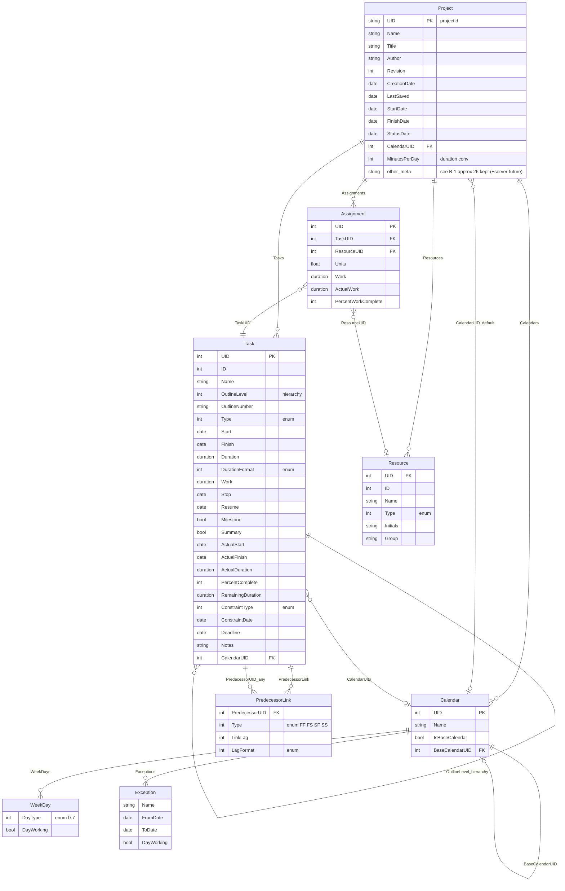

# MSPDI テーブル責務一覧 & 非テーブル要素

- 日付: 2026-07-24
- 対象: `mspdi/mspdi_pj12.xsd`（Microsoft Office Project 2007 XML Data Interchange Schema）
- 目的: MSPDI の全エンティティ（テーブル）の責務を一覧化し、ERD に「行」として現れない要素（スカラー/コンテナ/value-object）も棚卸しして、断捨離の判断材料にする。
- 関連: `mspdi-core-tree.md`（MSPDI 解説）, `mspdi-declutter-erd-ja.md`（Step1-6 断捨離・ERD）。GRS 側の扱い（Own/Consume/Reconstruct/Carry/Drop 仕分け）は `../02-data-model/grs-mspdi-field-ledger-ja.md`。
- 位置づけ: **純 MSPDI のリファレンス**（GRS 固有情報は持たない）。正本は `mspdi/mspdi_pj12.xsd`。本書は参考。

---

## A. テーブル（エンティティ）責務一覧 — 全 29

種別: **◎=中核 / ○=定義系 / △=衛星（小・従属） / □=コンテナ寄り**。
「断捨離」列は日程表用途でのスリム化における要否（`mspdi-declutter-erd-ja.md` Step3 の判断）。
「採否」列（最右）: **○=採用 / △=採用（畳込・条件付） / ×=不採用**。採用は **8**（中核6 ＋ Calendar_WeekDay ＋ Calendar_Exception）。
※ WorkingTime（勤務時刻）と Task_Baseline は不採用に確定（日粒度描画で時刻不要 / インラインの計画スナップショットは日程表コア外）。

| # | テーブル | 種 | 責務（一言） | カード | 断捨離 | 採否 |
|---|---|:--:|---|---|:--:|:--:|
| 1 | **Project** | ◎ | ルート。1ファイル=1PJ。全体設定＋全コレクション保持 | 1 | 残（軽量化） | ○ |
| 2 | **Task** | ◎ | 作業項目（バー）。予定/実績/階層/属性の本体 | 0..* | 残 | ○ |
| 3 | **PredecessorLink** | ◎ | タスク間依存（先行UID＋種別＋ラグ）＝依存線 | 0..* | 残 | ○ |
| 4 | **Calendar** | ◎ | 稼働/非稼働時間の定義 | 1..* | 残（軽量） | ○ |
| 5 | **Resource** | ◎ | 人/設備/材料/コスト資源 | 0..* | 残（軽量） | ○ |
| 6 | **Assignment** | ◎ | タスク×資源の割当（交差表） | 0..* | 残（軽量） | ○ |
| 7 | TimephasedData | ◎ | 作業/コストを時間軸に分解した時系列値（共有子） | 0..* | **削**（MVP） | × |
| 8 | Calendar_WeekDay | △ | 曜日ごとの稼働可否（稼働日か否か） | 0..* | 残 | ○ |
| 9 | Calendar_Exception | △ | 祝日・特別日（繰り返しルール付） | 0..* | 残（簡略） | ○ |
| 10 | Calendar_WorkWeek | △ | 期間限定の週稼働パターン上書き | 0..* | **削** | × |
| 11 | WorkWeek_WeekDay | △ | WorkWeek 内の曜日定義 | 0..* | **削** | × |
| 12 | WorkingTime | △ | 勤務時刻（09:00-18:00 等、最大5） | 0..5 | **削**（日粒度描画で時刻不要） | × |
| 13 | Task_Baseline | △ | タスクの計画スナップショット（基準0〜10） | 0..* | **削**（インライン計画は日程表コア外） | × |
| 14 | Resource_Baseline | △ | 資源の計画スナップショット | 0..* | **削** | × |
| 15 | Assignment_Baseline | △ | 割当の計画スナップショット | 0..* | **削** | × |
| 16 | OutlineCode | ○ | 独自コード体系の定義（分類マスク） | 0..* | **削** | × |
| 17 | OutlineCodeValue | ○ | OutlineCode のルックアップ値（階層） | 0..* | **削** | × |
| 18 | OutlineCodeMask | ○ | OutlineCode の桁マスク定義 | 0..* | **削** | × |
| 19 | Task_OutlineCode | △ | タスクの分類コード割当値 | 0..* | **削** | × |
| 20 | Resource_OutlineCode | △ | 資源の分類コード割当値 | 0..* | **削** | × |
| 21 | WBSMasks | □ | WBS自動採番の設定（コンテナ兼設定3項目） | 0..1 | **削** | × |
| 22 | WBSMask | ○ | WBS各レベルの採番マスク | 0..* | **削** | × |
| 23 | ExtAttr_Def | ○ | ユーザー定義カスタムフィールドの宣言 | 0..* | **削** | × |
| 24 | ExtAttr_ValueItem | △ | カスタムフィールドの選択肢値 | 0..* | **削** | × |
| 25 | Task_ExtendedAttribute | △ | タスクのカスタムフィールド値 | 0..* | **削** | × |
| 26 | Resource_ExtendedAttribute | △ | 資源のカスタム値 | 0..* | **削** | × |
| 27 | Assignment_ExtendedAttribute | △ | 割当のカスタム値 | 0..* | **削** | × |
| 28 | AvailabilityPeriod | △ | 資源の期間別稼働可能率 | 0..* | **削** | × |
| 29 | Rate | △ | 資源の期間別単価表（最大25） | 0..* | **削** | × |

### A-2. 本書別名 → MSPDI 実名（合成した 16 件・正はこちら）

`親_子` 別名は本書内の便宜。MSPDI 出力/パーサでは必ず「XSD 実名」を使う。葉要素名は親を跨いで重複するため親パスで区別する。

| 本書別名 | **XSD 実名** | 親パス（Project/…） | 行 |
|---|---|---|---|
| Calendar_WeekDay | `WeekDay` | Calendars/Calendar/WeekDays/WeekDay | 1241 |
| Calendar_Exception | `Exception` | Calendars/Calendar/Exceptions/Exception | 1331 |
| Calendar_WorkWeek | `WorkWeek` | Calendars/Calendar/WorkWeeks/WorkWeek | 1514 |
| WorkWeek_WeekDay | `WeekDay` | …/WorkWeek/WeekDay（WeekDays 無し） | 1553 |
| Task_Baseline | `Baseline` | Tasks/Task/Baseline | 2307 |
| Resource_Baseline | `Baseline` | Resources/Resource/Baseline | 2971 |
| Assignment_Baseline | `Baseline` | Assignments/Assignment/Baseline | 3640 |
| OutlineCodeValue | `Value` | OutlineCodes/OutlineCode/Values/Value | 775 |
| OutlineCodeMask | `Mask` | OutlineCodes/OutlineCode/Masks/Mask | 866 |
| Task_OutlineCode | `OutlineCode` | Tasks/Task/OutlineCode | 2413 |
| Resource_OutlineCode | `OutlineCode` | Resources/Resource/OutlineCode | 3005 |
| ExtAttr_Def | `ExtendedAttribute` | Project/ExtendedAttributes/ExtendedAttribute | 986 |
| ExtAttr_ValueItem | `Value` | …/ExtendedAttribute/ValueList/Value | 1157 |
| Task_ExtendedAttribute | `ExtendedAttribute` | Tasks/Task/ExtendedAttribute | 2248 |
| Resource_ExtendedAttribute | `ExtendedAttribute` | Resources/Resource/ExtendedAttribute | 2912 |
| Assignment_ExtendedAttribute | `ExtendedAttribute` | Assignments/Assignment/ExtendedAttribute | 3581 |

残り 13 件（Project / Task / PredecessorLink / Calendar / Resource / Assignment / TimephasedData / WorkingTime / OutlineCode / WBSMasks / WBSMask / AvailabilityPeriod / Rate）は XSD 実名そのもの（大小一致・検証済み）。

### 構成の要点

中核はわずか **6**（Project / Task / PredecessorLink / Calendar / Resource / Assignment）。
残り 23 は下記の系統で、**大半が断捨離対象**。だから断捨離後は 29 → **8** に落ちる。

| 系統 | テーブル | 断捨離 |
|---|---|---|
| 分類コード系 | OutlineCode, OutlineCodeValue, OutlineCodeMask, Task_OutlineCode, Resource_OutlineCode, WBSMasks, WBSMask | 全削 |
| カスタムフィールド系 | ExtAttr_Def, ExtAttr_ValueItem, Task/Resource/Assignment_ExtendedAttribute | 全削 |
| Baseline 系 | Task_Baseline, Resource_Baseline, Assignment_Baseline | **全削**（インライン計画スナップショットは不要） |
| カレンダー詳細 | Calendar_WeekDay（残）, Calendar_Exception（残） / WorkingTime, Calendar_WorkWeek, WorkWeek_WeekDay（削） | 一部 |
| 時系列 | TimephasedData | 削 |
| 単価/稼働 | Rate, AvailabilityPeriod | 全削 |

**断捨離後 8 テーブル**: Project / Task / PredecessorLink / Calendar / Calendar_WeekDay / Calendar_Exception / Resource / Assignment

---

## 断捨離後 MSPDI サブセット ERD（8 テーブル）

MSPDI から不要要素を落とした残り 8 テーブル。**すべて XSD 実名（大小一致）の MSPDI 要素**であり、GRS 独自の追加は含めない（マルチバー行等の GRS 拡張は `../_assets` の GRS 仕様で扱う）。
WorkingTime 削除により WeekDay は「稼働日か否か」のみ。Baseline はインラインに持たない。`WeekDay`/`Exception` は Calendar 下の要素（A-2 参照）。

> **注（キーの無いテーブル）**: `WeekDay` / `Exception` に PK 列が無いのは正しい。両者は **弱エンティティ**（weak entity）— どこからも UID 参照されず、親 `Calendar` に順序付きで内包されるだけ。識別は「**親 Calendar ＋ 位置（配列 index）**」で成立する（WeekDay は `DayType` が弁別子）。実装では `calendar.weekDays[]` / `calendar.exceptions[]` の配列要素になり、独立 PK は不要（MSPDI も UID を付けていない）。UID を持つのは**他から参照される中核** `Project` / `Task` / `Calendar` / `Resource` / `Assignment` のみ。

---

## B. テーブルに無い要素 — 全項目 要否判定（1行1項目）

凡例: **○=残す / ×=削除**（△は解消し全項目を確定）。集計（B-1）: **○26 / ×37**（63項目）。

### B-1. Project 直下スカラー（63）

**識別/文書（14）→ ○12 / ×2**

| 要素 | 要否 | 理由 |
|---|:--:|---|
| SaveVersion | ○ | MSPDI export 書出し時のバージョンメタ |
| UID | ○ | プロジェクト GUID（= projectId、識別） |
| Name | ○ | プロジェクト名 |
| Title | ○ | 文書タイトル（ヘッダ表示） |
| Subject | ○ | 主題（メタ） |
| Category | ○ | 分類（メタ） |
| Company | ○ | 会社名（透かし） |
| Manager | ○ | 管理者名（メタ） |
| Author | ○ | 作成者（来歴・透かし） |
| CreationDate | ○ | 作成日時（来歴） |
| Revision | ○ | 改訂番号（版管理・必須） |
| LastSaved | ○ | 最終保存日時（来歴） |
| ExtendedCreationDate | × | CreationDate と重複（MS 内部用） |
| RemoveFileProperties | × | MS ファイルプロパティ削除フラグ（無関係） |

**期間/基準日（8）→ ○5 / ×3**

| 要素 | 要否 | 理由 |
|---|:--:|---|
| ScheduleFromStart | ○ | 前方/後方計算の向き |
| StartDate | ○ | プロジェクト開始 |
| FinishDate | ○ | プロジェクト完了 |
| StatusDate | ○ | イナズマ線の基準日（コア） |
| CurrentDate | ○ | 「現在日」参照 |
| FYStartDate | × | 会計年度開始（会計用途・非対象） |
| FiscalYearStart | × | 会計年度フラグ（非対象） |
| CriticalSlackLimit | × | CPM スラック閾値（非対象） |

**既定暦/時刻/換算（8）→ ○5 / ×3**

| 要素 | 要否 | 理由 |
|---|:--:|---|
| CalendarUID | ○ | 既定カレンダー参照 |
| DefaultStartTime | × | 新規タスク既定開始時刻（日粒度で不要） |
| DefaultFinishTime | × | 同上（不要） |
| MinutesPerDay | ○ | 期間換算（1日=分）。MSPDI Duration 解釈に必須 |
| MinutesPerWeek | ○ | 期間換算（1週=分） |
| DaysPerMonth | ○ | 期間換算（1月=日） |
| WeekStartDay | ○ | 週の開始曜日（カレンダー表示） |
| NewTaskStartDate | × | 新規タスク既定開始（編集プリファレンス） |

**通貨（4）→ 全 ×**（コスト非対象）: CurrencyDigits, CurrencySymbol, CurrencyCode, CurrencySymbolPosition

**既定タスク/レート/書式（9）→ 全 ×**: DefaultTaskType, DefaultFixedCostAccrual, DefaultStandardRate, DefaultOvertimeRate, NewTasksEffortDriven, NewTasksEstimated, DefaultTaskEVMethod, DurationFormat, WorkFormat

**計算オプション（10）→ 全 ×**: EditableActualCosts, HonorConstraints, InsertedProjectsLikeSummary, MultipleCriticalPaths, SplitsInProgressTasks, SpreadActualCost, SpreadPercentComplete, TaskUpdatesResource, Autolink, AutoAddNewResourcesAndTasks

**Move 系（4）→ 全 ×**: MoveCompletedEndsBack, MoveRemainingStartsBack, MoveRemainingStartsForward, MoveCompletedEndsForward

**EV（2）→ 全 ×**: EarnedValueMethod, BaselineForEarnedValue

**サーバ/管理（4）→ 全 ○**（将来サーバ連携予定）: MicrosoftProjectServerURL（boolean・URL ではない）, ProjectExternallyEdited, ActualsInSync, AdminProject

### B-2. コンテナ（wrapper）— データを持たない入れ物（15）

「吸収」: `<Tasks>` のように中身を囲むだけでデータを持たない要素は、JSON では配列 `items: [ … ]` の角括弧 `[ ]` になるだけでテーブルにしない（情報損失ゼロ）。

| 要素 | 要否 | 理由 |
|---|:--:|---|
| Tasks / Resources / Assignments / Calendars / WeekDays / Exceptions | 吸収 | それぞれ配列構造に吸収 |
| OutlineCodes / ExtendedAttributes / WorkWeeks / WorkingTimes / Values / Masks / ValueList / Rates / AvailabilityPeriods | × | 系統ごと削除 |

### B-3. value-object 小要素（親に 0..1 で畳込、2）

「畳み込み」: 親に1個だけ入る小さな塊を、別構造にせずフィールドを親に直接展開すること。

| 要素 | 要否 | 理由 |
|---|:--:|---|
| `TimePeriod` { FromDate, ToDate } | ○ | Calendar_Exception の from_date / to_date として親に畳込 |
| `WorkingTime` { FromTime, ToTime } | × | 勤務時刻・日粒度描画で不要 |

---

## まとめ

- MSPDI 全 **29 テーブル**。ただし中核は **6** のみで、残り 23 は分類コード/カスタムフィールド/Baseline/カレンダー詳細/時系列/単価の従属テーブル。
- ERD 非表示要素は「Project スカラー 63（**○26 / ×37**）」「コンテナ 15（吸収6 / 削9）」「value-object 2（TimePeriod ○ / WorkingTime ×）」。
- 断捨離後は **8 テーブル**（中核 6 ＋ Calendar_WeekDay ＋ Calendar_Exception）。GRS 側の扱い（Own/Consume/Reconstruct/Carry/Drop 仕分け・マルチバー拡張）は `../02-data-model/grs-mspdi-field-ledger-ja.md` / `grs-data-model-ja.md`。
