# GRS × MSPDI フィールド仕分け台帳

- 日付: 2026-07-25
- 正: **公式 XSD** <https://schemas.microsoft.com/project/2007/mspdi_pj12.xsd>（Microsoft Office Project 2007 XML Data Interchange Schema・全 3906 行・ユニーク要素 499・named type は `TimephasedDataType` のみ他は inline）。
  ローカル複製は `../01-mspdi/mspdi/mspdi_pj12.xsd`。**同梱していない** — 取得は `../01-mspdi/mspdi/README.md`。
- 構成: §1 本書の説明 → §2 GRS 概要 → §3 MSPDI 概要 → §4 分類の意図と基準 → §5 完全準拠 ERD → §6 全要素の説明 → §7 取捨選択・理由の表 → §8 Appendix

> ⚠️ **要素名・型・カードは必ず XSD で検証**すること。`../01-mspdi/mspdi-*.md` の要約は参考であって正ではない（過去に命名ズレ発生）。表示用別名の実名対応は §8 Appendix A。

---

> 🔴 **実績・進捗の仕分けは `../07-plan-actual/handover-plan-actual-decisions-ja.md` が上書きする。**
>
> | 要素 | 本書の仕分け | 確定 |
> |---|---|---|
> | `ActualDuration` | Carry | **Own**。実績バーの長さそのものとして GRS が持つ |
> | `Stop` / `Resume` | Own（拡張領域へ回す） | **Own（ネイティブ）**。`Stop` は**中断のときだけ**書く（算出値） |
> | `ResumeValid` | Carry | **Own**。`false` = 再開日未定の中断（＝中止） |
> | `PercentComplete` → `progressRatio`（÷100） | Own（単位変換） | **`percentComplete`（整数のまま）**。`actualDuration` から算出して格納 |
> | `OutlineLevel` は 6 段以上を 5 段へクランプし Drop | — | **クランプしない。** 階層は `wbs_parent_uid` が持ち、export で深さから算出する。**LOD の判定でだけ 5 で頭打ち**にする |
> | 拡張領域（GRS 枠） | fade ほか 6 属性 | **`fadeInDays` / `fadeOutDays` の 2 つだけ**（`Number1` / `Number2`） |
>
> **Drop = 0 は維持される（`OutlineLevel` の Drop が消えるのでむしろ改善する）。**


## 1. 本書の説明 — MSPDI を GRS のインポート材料とする

GRS は日程表を **JSON**（主データ）で保持し、外部との交換に **MSPDI XML** を双方向で用いる。主要往復は次の一本道:

```
外部 WBS マスタ（構造マスタ） → MSPDI export → GRS で編集 → MSPDI import → 外部マスタ
```

> **用語**: **外部 WBS マスタ**（以後「外部マスタ」）= **GRS の外側で WBS 構造を保持し、MSPDI を生成・再取込する対向ツール**。特定の製品を指す語ではない。

この往復で情報を落とさないため、**MSPDI の全要素を「GRS がどう扱うか」で仕分ける**のが本書の目的。判定は 5 分類（**Own / Consume / Reconstruct / Carry / Drop**・§4）で行い、**未分類ゼロ・Drop ゼロ**を厳格チェックする。

本書は「MSPDI を**読む材料**として棚卸し → GRS の内部モデル（`grs-native-erd-ja.md`）へどう写すか」を定める、Adapter 設計の一次資料である。

---

## 2. GRS の概要

- **GRS（gr-scheduler）**: 単一 `.html` でブラウザだけで動く WYSIWYG 日程表ツール。パワポで日程表を書く操作感で、成果物は画像でなく構造化データ（JSON / MSPDI XML / SVG）。
- **コア価値**: **マルチバー**（1 行に複数タスク/マイルストーンを横並べ）＋上下左右整列＋ズーム連動 LOD＋依存線自動配線。
- **ネイティブモデルは 2 軸**（`grs-native-erd-ja.md` §5.1）:
  - **WBS** = `Task.wbs_parent_uid`（MSPDI `OutlineLevel` 対応・**export する**）。
  - **マルチバー** = `TaskGroup`（行の器・入れ子 ≤Lv5）＋ `TaskGroupMember`（**GRS 専用・非 export**）。
- **対象外ドメイン**（＝ MSPDI の該当フィールドは GRS が解釈しない → Carry）: コスト管理・EVM（出来高）・資源平準化・**資源/割当の管理**（工数・割当率・単価）・エンタープライズ/サーバ連携・カスタムフィールド・独自コード体系。

→ **GRS がドメインとして持つのは「予定・実績・中断の日付／マイルストーン／階層／依存／稼働カレンダー／担当者名」だけ**。これが Own/Consume の範囲を規定し、それ以外は Carry になる（§4）。

> **担当者名の例外**: 資源管理は非対象だが、**担当者名をバーに表示する**ため `Resource`（`UID`/`Name`/`Type`/`IsCostResource`/`CalendarUID`）と `Assignment`（`UID`/`TaskUID`/`ResourceUID`）の**計 8 列だけ**を軽量ネイティブ化する（§7.5/§7.6・`grs-native-erd-ja.md` §5.5）。この格上げにより **MSPDI の UID 参照 7 つが全て Consume** となり、**Carry に UID 参照が残らない**（＝マージ時の UID 振り直しに構造的に追従する）。

---

## 3. MSPDI の概要

- **MSPDI** = Microsoft Project **D**ata **I**nterchange。`.mpp`（独自バイナリ）に対する**公開 XML 形式**。1 プロジェクト = XML 1 ファイル = ルート `<Project>` 1 個。
- 構造: `<Project>` = 「**設定スカラー 63 個**」＋「**UID で相互参照する 5 コレクション**（Calendars / Tasks / Resources / Assignments / ExtendedAttributes 定義）」。実体はリレーショナル DB を XML 化したもの。
- 中核概念のデータ表現:
  - **階層**: Task 上の `OutlineLevel`＋document order で暗黙表現（親ポインタは無い）。`Summary` は子を持つ印。
  - **依存**: 線オブジェクトではなく、後続 Task 内に先行 UID 参照 `PredecessorLink`（`Type` 0=FF/1=FS/2=SF/3=SS、`LinkLag` 1/10分）。
  - **予定/実績**: `Start`/`Finish`（予定）、`ActualStart`/`ActualFinish`/`PercentComplete`（実績）。※**中断は `Stop`/`Resume`/`ResumeValid` へ写す**（意味が一致することを解説書で確認した）。
  - **マイルストーン**: 専用要素なし。`Milestone=1` フラグ（慣習で `Duration=0`）。
  - **時系列**: `TimephasedData`（作業/コストの時間軸分解・S字/ヒストグラム/多重split の素）。
- **MSPDI にできないこと**: **1 行に複数の独立タスクを横並べ**（マルチバー）。ビュー描画書式（Bar Styles・色）はファイル外。→ マルチバーは GRS が新規に定義する（§2）。
- 規模: 全 **29 テーブル**（中核 6＋衛星 23）、Task 約 91 列・Resource 約 65 列・Assignment 約 61 列＋201 予約枠（XSD 機械実測で確定: Task 91＋子5 / Resource 65＋子6 / Assignment 61＋201枠＋子3）。date/time は ISO8601、enum は整数コード、多くが `minOccurs=0`（省略可）。

---

## 4. 取捨選択の分類（Own / Consume / Reconstruct / Carry / Drop）— 意図と基準

**意図**: 双方向 MSPDI 連携で**情報欠落を最小化**する。全フィールドを「GRS がどう扱うか」で 5 分類し、**未分類ゼロ**にする。

**分類の軸は 2 つの ×**: 「**理解する（意味を解釈する）か**」×「**保持するか**」。

| 分類 | 理解 | 保持 | import で読む? | export | 損失 | 判定基準（この分類にする条件） |
|---|:--:|:--:|:--:|---|:--:|---|
| **Own** | ○ | ○（同形） | 読む | 保存値を書く | なし | GRS がドメインとして**編集・描画に使う原本**。日付/名前/フラグ等。 |
| **Consume** | ○ | ○（別形） | **読む（必須）** | 構造から再生成 | なし | 意味を理解するが**GRS では別構造で持つ**（例: `OutlineLevel`→WBS木、`PredecessorLink`→依存エッジ）。読み飛ばすと階層/依存が失われる。 |
| **Reconstruct** | ○ | ✗ | **読まない** | 他 Own から算出 | なし | 他フィールドから**一意に導ける冗長値**（例: `OutlineNumber`＝WBS 木のパス、`ID`＝深さ優先順、`Summary`＝子の有無）。保存するとドリフトするので持たない。 |
| **Carry** | ✗ | ○（不透明） | 読む | そのまま書き戻す | なし※ | GRS が**意味を使わないが往復のため温存**（passthrough）。コスト/EVM/平準化/enterprise 等。 |
| **Drop** | ✗ | ✗ | — | 書かない | **あり** | 理解も保持もしない＝**捨てる**。**原則ゼロ**（明示許容時のみ）。 |

- **リトマス試験**: 「その列を**読み飛ばしたら GRS は復元不能な情報を失うか?**」→ 失う＆使う=Own/Consume、失わない(冗長)=Reconstruct、失うが意味は使わない=**Carry**（温存で回避）、失って良い=Drop。
- **※ Carry の損失は「passthrough を実装しない場合のみ」発生**。Carry=実際に温存し export で書き戻すため、**未編集往復は無損失**。
- **断捨離（29→8 テーブル）と分類は別概念**: 断捨離＝「GRS が**ネイティブに構造化する**テーブルを 8 に絞る」。構造化しない要素も **Carry で温存**するので**捨てていない**。「削除した＝Drop」ではない。
- **正規形と発行**: 正規 JSON（編集・autosave）= Own/Consume/Carry のみ（Reconstruct は持たない＝ドリフト防止）。MSPDI export = Reconstruct 値をその場で計算して焼き込む（MSPDI は自己完結スナップショットの思想）。両立する（別成果物）。

---

## 5. MSPDI 完全準拠 ERD（全 29 テーブル・1 枚）

XSD 全体の写像。**葉要素名が親を跨いで重複する**ため表示は親付き別名を用いる（実名対応は §8 Appendix A）。カード記法: `||`=1 / `o{`=0以上 / `o|`=0または1。UID を持つ中核（Project/Task/Calendar/Resource/Assignment）以外は**弱エンティティ**（親＋位置で識別）。

```mermaid
erDiagram
    Project ||--o{ Calendar : "Calendars"
    Project ||--o{ Task : "Tasks"
    Project ||--o{ Resource : "Resources"
    Project ||--o{ Assignment : "Assignments"
    Project ||--o{ OutlineCode : "OutlineCodes"
    Project ||--o| WBSMasks : "WBSMasks"
    Project ||--o{ ExtAttr_Def : "ExtendedAttributes(定義)"
    Project }o--o| Calendar : "CalendarUID(既定暦)"

    OutlineCode ||--o{ OutlineCode_Value : "Values"
    OutlineCode ||--o{ OutlineCode_Mask : "Masks"
    OutlineCode_Value ||--o{ OutlineCode_Value : "ParentValueID(自己)"
    WBSMasks ||--o{ WBSMask : "WBSMask"
    ExtAttr_Def ||--o{ ExtAttr_ValueItem : "ValueList"

    Calendar ||--o| Calendar : "BaseCalendarUID(派生元)"
    Calendar ||--o{ Calendar_WeekDay : "WeekDays"
    Calendar ||--o{ Calendar_Exception : "Exceptions"
    Calendar ||--o{ Calendar_WorkWeek : "WorkWeeks"
    Calendar_WeekDay ||--o{ WorkingTime : "WorkingTimes(≤5)"
    Calendar_Exception ||--o{ WorkingTime : "WorkingTimes(≤5)"
    Calendar_WorkWeek ||--o{ WorkWeek_WeekDay : "WeekDay"

    Task ||--o{ Task : "OutlineLevel+順序(階層)"
    Task }o--o| Calendar : "CalendarUID(タスク暦)"
    Task ||--o{ PredecessorLink : "PredecessorLink"
    PredecessorLink }o--o| Task : "PredecessorUID→先行(minOccurs=0)"
    Task ||--o{ Task_ExtAttr : "ExtendedAttribute(値)"
    Task ||--o{ Task_Baseline : "Baseline(0..10)"
    Task ||--o{ Task_OutlineCode : "OutlineCode(値)"
    Task ||--o{ TimephasedData : "TimephasedData"
    Task_Baseline ||--o{ TimephasedData : "TimephasedData"
    Task_ExtAttr }o--|| ExtAttr_Def : "FieldID→定義"
    Task_OutlineCode }o--|| OutlineCode : "FieldID→定義"

    Resource }o--o| Calendar : "CalendarUID(個人暦)"
    Resource ||--o{ Res_ExtAttr : "ExtendedAttribute(値)"
    Resource ||--o{ Res_Baseline : "Baseline"
    Resource ||--o{ Res_OutlineCode : "OutlineCode(値)"
    Resource ||--o{ AvailabilityPeriod : "AvailabilityPeriods"
    Resource ||--o{ Rate : "Rates(≤25)"
    Resource ||--o{ TimephasedData : "TimephasedData"
    Res_ExtAttr }o--|| ExtAttr_Def : "FieldID→定義"

    Assignment }o--o| Task : "TaskUID(minOccurs=0)"
    Assignment }o--o| Resource : "ResourceUID(minOccurs=0)"
    Assignment ||--o{ Assn_ExtAttr : "ExtendedAttribute(値)"
    Assignment ||--o{ Assn_Baseline : "Baseline"
    Assignment ||--o{ TimephasedData : "TimephasedData"
    Assn_Baseline ||--o{ TimephasedData : "TimephasedData"

    Project {
        string UID PK "projectId(string≤16・省略可)"
        int SaveVersion "必須"
        int CalendarUID FK "既定暦"
        string scalars "63個: SaveVersion..AdminProject(§6.2)"
    }
    Task {
        int UID PK "不変・参照先"
        int ID "表示行(可変)"
        int OutlineLevel "階層深さ"
        int CalendarUID FK
        string fields "予定/実績/中断/コスト/EVM/…(§7.1)"
    }
    PredecessorLink {
        int PredecessorUID FK "先行Task"
        int Type "0FF/1FS/2SF/3SS"
        int LinkLag "1/10分"
        int LagFormat "enum"
    }
    Calendar {
        int UID PK
        string Name
        bool IsBaseCalendar
        int BaseCalendarUID FK
    }
    Calendar_WeekDay {
        int DayType "0例外,1日..7土"
        bool DayWorking
    }
    Calendar_Exception {
        string Name
        date FromDate
        date ToDate
        bool DayWorking
        int Type "繰返し1-9"
    }
    Calendar_WorkWeek {
        string Name
        date FromDate
        date ToDate
    }
    WorkWeek_WeekDay {
        int DayType
        bool DayWorking
    }
    WorkingTime {
        time FromTime
        time ToTime
    }
    Resource {
        int UID PK
        int ID
        string Name
        int Type "0材料/1作業"
        string fields "工数/コスト/EVM/enterprise(§7.5)"
    }
    Assignment {
        int UID PK
        int TaskUID FK
        int ResourceUID FK
        float Units
        string fields "工数/コスト+201予約枠(§7.6)"
    }
    OutlineCode {
        string Guid PK
        string FieldID
        string FieldName
    }
    OutlineCode_Value {
        int ValueID PK
        int ParentValueID FK
        string Value
    }
    OutlineCode_Mask {
        int Level
        int Length
        string Separator
    }
    WBSMasks {
        bool VerifyUniqueCodes
        bool GenerateCodes
        string Prefix
    }
    WBSMask {
        int Level PK
        int Length
        string Separator
    }
    ExtAttr_Def {
        string FieldID PK
        string FieldName
        int CFType "enum"
        string Formula
    }
    ExtAttr_ValueItem {
        int ID PK
        string Value
        string Description
    }
    Task_ExtAttr {
        string FieldID FK
        string Value
    }
    Task_Baseline {
        int Number "0..10"
        date Start
        date Finish
        duration Work
    }
    Task_OutlineCode {
        string FieldID FK
        int ValueID FK
    }
    Res_ExtAttr {
        string FieldID FK
        string Value
    }
    Res_Baseline {
        int Number
        duration Work
        decimal Cost
    }
    Res_OutlineCode {
        string FieldID FK
        int ValueID FK
    }
    AvailabilityPeriod {
        date AvailableFrom
        date AvailableTo
        float AvailableUnits
    }
    Rate {
        date RatesFrom
        date RatesTo
        int RateTable "A-E"
        decimal StandardRate
    }
    Assn_ExtAttr {
        string FieldID FK
        string Value
    }
    Assn_Baseline {
        int Number
        date Start
        date Finish
        duration Work
    }
    TimephasedData {
        int Type "enum72"
        int UID
        date Start
        date Finish
        string Value
    }
```



> **エンティティ数 = 29**（Project / Task / PredecessorLink / Calendar / Calendar_WeekDay / Calendar_Exception / Calendar_WorkWeek / WorkWeek_WeekDay / WorkingTime / Resource / Assignment / OutlineCode / OutlineCode_Value / OutlineCode_Mask / WBSMasks / WBSMask / ExtAttr_Def / ExtAttr_ValueItem / Task_ExtAttr / Task_Baseline / Task_OutlineCode / Res_ExtAttr / Res_Baseline / Res_OutlineCode / AvailabilityPeriod / Rate / Assn_ExtAttr / Assn_Baseline / TimephasedData）。別名→XSD 実名は §8 A。

---

## 6. MSPDI の全テーブルと全テーブル外要素の説明（純 MSPDI・GRS 判断なし）

### 6.1 全 29 テーブルの説明

種別: **◎中核 / ○定義系 / △衛星 / □コンテナ**。

| # | テーブル（XSD実名） | 種 | 説明（責務） | カード |
|---|---|:--:|---|---|
| 1 | `Project` | ◎ | ルート。1ファイル=1PJ。全体設定＋全コレクション保持 | 1 |
| 2 | `Task` | ◎ | 作業項目（バー）。予定/実績/階層/属性の本体 | 0..* |
| 3 | `PredecessorLink` | ◎ | タスク間依存（先行UID＋種別＋ラグ）＝依存線 | 0..* |
| 4 | `Calendar` | ◎ | 稼働/非稼働時間の定義 | 1..* |
| 5 | `WeekDay`(Calendar下) | △ | 曜日ごとの稼働可否 | 0..* |
| 6 | `Exception`(Calendar下) | △ | 祝日・特別日（繰返しルール付） | 0..* |
| 7 | `WorkWeek`(Calendar下) | △ | 期間限定の週稼働パターン上書き | 0..* |
| 8 | `WeekDay`(WorkWeek下) | △ | WorkWeek 内の曜日定義 | 0..* |
| 9 | `WorkingTime` | △ | 勤務時刻（09:00-18:00 等・最大5） | 0..5 |
| 10 | `Resource` | ◎ | 人/設備/材料/コスト資源 | 0..* |
| 11 | `Assignment` | ◎ | タスク×資源の割当（交差表） | 0..* |
| 12 | `TimephasedData` | △ | 作業/コストを時間軸に分解した時系列値（共有子・中核ではない） | 0..* |
| 13 | `OutlineCode`(定義) | ○ | 独自コード体系の定義（分類マスク） | 0..* |
| 14 | `Value`(OutlineCode下) | ○ | OutlineCode のルックアップ値（階層） | 0..* |
| 15 | `Mask`(OutlineCode下) | ○ | OutlineCode の桁マスク定義 | 0..* |
| 16 | `OutlineCode`(Task下) | △ | タスクの分類コード割当値 | 0..* |
| 17 | `OutlineCode`(Resource下) | △ | 資源の分類コード割当値 | 0..* |
| 18 | `WBSMasks` | □ | WBS自動採番の設定（コンテナ兼設定3項目） | 0..1 |
| 19 | `WBSMask` | ○ | WBS各レベルの採番マスク | 0..* |
| 20 | `ExtendedAttribute`(定義) | ○ | ユーザー定義カスタムフィールドの宣言 | 0..* |
| 21 | `Value`(ExtAttr下) | △ | カスタムフィールドの選択肢値 | 0..* |
| 22 | `ExtendedAttribute`(Task下) | △ | タスクのカスタムフィールド値 | 0..* |
| 23 | `ExtendedAttribute`(Resource下) | △ | 資源のカスタム値 | 0..* |
| 24 | `ExtendedAttribute`(Assignment下) | △ | 割当のカスタム値 | 0..* |
| 25 | `Baseline`(Task下) | △ | タスクの計画スナップショット（基準0〜10） | 0..* |
| 26 | `Baseline`(Resource下) | △ | 資源の計画スナップショット | 0..* |
| 27 | `Baseline`(Assignment下) | △ | 割当の計画スナップショット | 0..* |
| 28 | `AvailabilityPeriod` | △ | 資源の期間別稼働可能率 | 0..* |
| 29 | `Rate` | △ | 資源の期間別単価表（最大25） | 0..25 |

### 6.2 テーブル外要素の説明（ERD に「行」として現れない要素）

**(a) Project 直下スカラー 63 個**（カテゴリ別・XSD 実名で全数）:

| カテゴリ | 個数 | 要素 |
|---|:--:|---|
| 識別/文書 | 14 | `SaveVersion` `UID` `Name` `Title` `Subject` `Category` `Company` `Manager` `Author` `CreationDate` `Revision` `LastSaved` `ExtendedCreationDate` `RemoveFileProperties` |
| 期間/基準日 | 8 | `ScheduleFromStart` `StartDate` `FinishDate` `StatusDate` `CurrentDate` `FYStartDate` `FiscalYearStart` `CriticalSlackLimit` |
| 既定暦/時刻/換算 | 8 | `CalendarUID` `DefaultStartTime` `DefaultFinishTime` `MinutesPerDay` `MinutesPerWeek` `DaysPerMonth` `WeekStartDay` `NewTaskStartDate` |
| 通貨 | 4 | `CurrencyDigits` `CurrencySymbol` `CurrencyCode` `CurrencySymbolPosition` |
| 既定タスク/レート/書式 | 9 | `DefaultTaskType` `DefaultFixedCostAccrual` `DefaultStandardRate` `DefaultOvertimeRate` `NewTasksEffortDriven` `NewTasksEstimated` `DefaultTaskEVMethod` `DurationFormat` `WorkFormat` |
| 計算オプション | 10 | `EditableActualCosts` `HonorConstraints` `InsertedProjectsLikeSummary` `MultipleCriticalPaths` `SplitsInProgressTasks` `SpreadActualCost` `SpreadPercentComplete` `TaskUpdatesResource` `Autolink` `AutoAddNewResourcesAndTasks` |
| Move 系 | 4 | `MoveCompletedEndsBack` `MoveRemainingStartsBack` `MoveRemainingStartsForward` `MoveCompletedEndsForward` |
| EV | 2 | `EarnedValueMethod` `BaselineForEarnedValue` |
| サーバ/管理 | 4 | `MicrosoftProjectServerURL` `ProjectExternallyEdited` `ActualsInSync` `AdminProject` |

**(b) コンテナ（wrapper・データを持たない入れ物）15 個**: `Tasks` `Resources` `Assignments` `Calendars` `WeekDays` `Exceptions` `OutlineCodes` `ExtendedAttributes` `WorkWeeks` `WorkingTimes` `Values` `Masks` `ValueList` `Rates` `AvailabilityPeriods`
→ JSON では配列 `[ … ]` に吸収され、テーブルにしない（情報損失ゼロ）。

**(c) value-object（親に 0..1 で畳込）**: `TimePeriod`{`FromDate`,`ToDate`}（WeekDay/Exception/WorkWeek に**各1個**＝畳込）。
> **モデリング基準**: カード（多重度）で区別する。`TimePeriod` は親に**0..1**なので value-object として親フィールドに畳込。`WorkingTime`{`FromTime`,`ToTime`} は親（WeekDay/Exception）に**0..5 の繰返し**なので §6.1 の**エンティティ #9**として扱う（配列 `[…]` になる）。両者は「同じ小塊」ではなく多重度が異なる。

**(d) 予約枠 201 個**: `f404000`〜`f4040c8`（Assignment 下・enterprise カスタムフィールド予約プレースホルダ・全て空・個別意味なし）。

---

## 7. 各テーブル/要素の説明と取捨選択・理由の表

**列**: `採否`（残=採用8テーブルにネイティブ保持／削=ネイティブに持たない）＋ `GRS扱い`（Own/Consume/Reconstruct/Carry/Drop）。2軸の対応: 残→Own/Consume/Reconstruct、削→Carry(温存) or Drop(ゼロ)。

### 7.0 テーブル単位の取捨選択（29→8）

採用 = **8**（中核6＋`WeekDay`＋`Exception`）。**削のテーブルは全て Carry で温存**（Drop ゼロ）。

| テーブル | 採否 | GRS扱い | 根拠 |
|---|:--:|---|---|
| `Project` `Task` `PredecessorLink` `Calendar` `WeekDay` `Exception` | **残** | Own/Consume/Reconstruct 混在 | 日程表の本体・階層・依存・稼働日描画に必須 |
| `Resource` `Assignment` | **残** | **軽量ネイティブ（計8列）＋残り Carry** | **担当者名をバーに表示**するため 8 列のみ Own/Consume 化。工数・コスト・割当率は非対象で Carry（§7.5/§7.6） |
| `TimephasedData` `WorkingTime` `WorkWeek` 系 | **削** | Carry | S字/多重split/勤務時刻/週上書きは非対象・温存 |
| `Baseline`(Task/Res/Assn) | **削** | Carry | 変更前予定グレーは別ファイルで代替・温存 |
| `OutlineCode` 系 `WBSMask` 系 | **削** | Carry | 独自コード/採番非対象・温存 |
| `ExtendedAttribute` 系 | **一部残** | **GRS 枠のみ Consume / 他は Carry** | **GRS がフェード（`fadeInDays`/`fadeOutDays`）の往復に拡張領域を使う**。GRS が予約した `FieldID` だけ Consume し、他ツール由来は従来どおり Carry（`grs-native-erd-ja.md` §5.5f） |
| `AvailabilityPeriod` `Rate` | **削** | Carry | 資源キャパ/単価非対象・温存 |

### 7.1 Task（約 91 スカラー＋5 子要素）

日程表の本体。予定/実績/中断の日付だけ Own、階層/依存は Consume、冗長派生は Reconstruct、他は Carry。

**識別・名称**

| フィールド | 型 | 説明 | 採否 | 根拠 | GRS扱い |
|---|---|---|:--:|---|---|
| `UID` | int | 不変の一意ID（参照先） | 残 | 往復識別キー | **Own** |
| `ID` | int | 表示行番号（可変） | 削 | 並び順から導出 | Reconstruct |
| `Name` | str | タスク名 | 残 | バーのラベル | **Own** |
| `IsNull` | bool | **欠番行（MS Project のタスク一覧に挿入された空行）** | 削 | **`IsNull=1` の Task は要素まるごと Carry へ退避**（ネイティブ行を作らない）。空行は「行」ではあっても「タスク」ではなく、日付も階層も持たないため WBS 木に入れると木の意味が壊れる。原位置・原形のまま往復する（`grs-native-erd-ja.md` §5.5d） | **Carry**（要素まるごと） |
| `CreateDate` | dateTime | 作成日時 | 削 | 来歴・非使用 | Carry |
| `Contact` | str | 担当連絡先 | 削 | 資源管理非対象 | Carry |

**階層（WBS）**

| フィールド | 型 | 説明 | 採否 | 根拠 | GRS扱い |
|---|---|---|:--:|---|---|
| `OutlineLevel` | int | 階層の深さ（親子） | 残→構造化 | `Task.wbs_parent_uid` へ消費（WBS）。**欠落・レベル飛び・先頭≠1 は正規化**、**クランプしない**。深さは `wbs_parent_uid` が持ち、export で算出して書き戻す。**LOD の判定でだけ 5 で頭打ち**にする | **Consume** |
| `OutlineNumber` | str | "1.2.3" 形式コード | 削 | 階層＋順序から算出 | Reconstruct |
| `Summary` | bool | サマリタスクか | 削 | 子の有無から算出 | Reconstruct |
| `WBS` `WBSLevel` | str | WBSコード/レベル | 削 | 独自採番・非使用 | Carry |
| `Priority` | int | 優先度(0-1000) | 削 | 平準化用・非対象 | Carry |

**予定**

| フィールド | 型 | 説明 | 採否 | 根拠 | GRS扱い |
|---|---|---|:--:|---|---|
| `Start` | dateTime | 予定開始 | 残 | バー左端 | **Own** |
| `Finish` | dateTime | 予定完了 | 残 | バー右端 | **Own** |
| `Duration` | duration | 期間(ISO8601) | **残** | **未編集タスクは受け取った値をそのまま返す**（暦の解釈差で往復差分が出るのを防ぐ）。**編集済タスクだけ** `Finish−Start` で算出 | **Carry（未編集）/ Reconstruct（編集済）** |
| `DurationFormat` | enum | 期間の表示単位 | 削 | 書式・非保持 | Carry |
| `Work` | duration | 総工数 | 削 | 工数管理非対象 | Carry |
| `Type` | enum | FixedUnits/Duration/Work | 削 | ソルバ挙動・非対象 | Carry |
| `Milestone` | bool | マイルストーン(◆) | 残 | ◆表示 | **Own** |
| `Critical` | bool | クリティカルパス上か | 削 | CPM算出・永続不要 | Carry |
| `ConstraintType` `ConstraintDate` | enum/dateTime | 制約種別/日 | 削 | 明示日付で位置決め・ヒント非使用 | Carry |
| `Deadline` | dateTime | 期限マーカー | 残 | 目標マーカー描画 | **Own** |
| `CalendarUID` | int | タスク暦参照 | 残→参照 | 稼働日粒度描画 | **Consume** |

**中断（split）**

| フィールド | 型 | 説明 | 採否 | 根拠 | GRS扱い |
|---|---|---|:--:|---|---|
| `Stop` | dateTime | 実績部分の終わり | 残 | **中断のときだけ書く**（`actualStart + actualDuration` から算出） | **Own** |
| `Resume` | dateTime | 残りが再開する予定日 | 残 | 中断のときだけ | **Own** |
| `ResumeValid` | bool | 再開できるか | 残 | **`false` = 再開日未定の中断（＝中止）** | **Own** |

**実績（予実）**

| フィールド | 型 | 説明 | 採否 | 根拠 | GRS扱い |
|---|---|---|:--:|---|---|
| `ActualStart` | dateTime | 実績開始 | 残 | 実績バー左端 | **Own** |
| `ActualFinish` | dateTime | 実績終了日 | 残 | 実績バー右端 | **Own** |
| `PercentComplete` | int | 完了率(%)・塗り | **残** | **進捗の唯一の入力源**。読まないと復元不能（`ActualStart/Finish` からは進行中の到達率を導けない）→ `percentComplete`（**整数のまま**）。`actualDuration` から算出して格納する | **Own** |
| `ActualDuration` | duration | 実績期間 | **残** | **進行中は `ActualFinish` が空**で `ActualFinish−ActualStart` から復元不能（StatusДまでの実経過は独立情報）。**GRS が実績バーの長さとして一級で持つ**ようになったため Carry から昇格 | **Own** |
| `RemainingDuration` | duration | 残期間 | 削 | 同上（進行中は `Duration−進捗` が破綻）。温存。**ただし完了時だけ GRS が `0` を書く**（Own 扱い・唯一の例外。`../07-plan-actual/handover-plan-actual-decisions-ja.md` §10-1） | **Carry**（完了時のみ Own） |
| `PercentWorkComplete` | int | 作業進捗率 | 削 | 工数管理非対象 | Carry |
| `ActualWork` `ActualOvertimeWork` `RegularWork` `OvertimeWork` `RemainingWork` `RemainingOvertimeWork` `ActualWorkProtected` `ActualOvertimeWorkProtected` | duration | 実績・残・残業の工数各種 | 削 | 工数管理非対象 | Carry |

**コスト・EVM（全削・Carry）**

| フィールド | 説明 | 採否 | 根拠 | GRS扱い |
|---|---|:--:|---|---|
| `Cost` `FixedCost` `FixedCostAccrual` `OvertimeCost` `ActualCost` `ActualOvertimeCost` `RemainingCost` `RemainingOvertimeCost` | コスト各種 | 削 | コスト管理非対象 | Carry |
| `BCWS` `BCWP` `ACWP` `CV` `PhysicalPercentComplete` `EarnedValueMethod` | アーンドバリュー | 削 | EVM 非対象 | Carry |

**CPM派生・平準化（全削・Carry）**

| フィールド | 説明 | 採否 | 根拠 | GRS扱い |
|---|---|:--:|---|---|
| `EarlyStart` `EarlyFinish` `LateStart` `LateFinish` `StartVariance` `FinishVariance` `WorkVariance` `FreeSlack` `TotalSlack` | CPM算出値・差異 | 削 | スケジューラ派生・実行時計算で足りる | Carry |
| `LevelAssignments` `LevelingCanSplit` `LevelingDelay` `LevelingDelayFormat` `PreLeveledStart` `PreLeveledFinish` `IgnoreResourceCalendar` | 資源平準化 | 削 | 平準化エンジン非搭載 | Carry |

**サブPJ・enterprise・補助（全削・Carry）**

| フィールド | 説明 | 採否 | 根拠 | GRS扱い |
|---|---|:--:|---|---|
| `IsSubproject` `IsSubprojectReadOnly` `SubprojectName` `ExternalTask` `ExternalTaskProject` | 外部/サブPJ | 削 | 単一PJ前提 | Carry |
| `IsPublished` `StatusManager` `CommitmentStart` `CommitmentFinish` `CommitmentType` | 発行・コミット | 削 | サーバ連携非対象 | Carry |
| `EffortDriven` `Recurring` `OverAllocated` `Estimated` | ソルバ/配信フラグ | 削 | GRS 非使用 | Carry |
| `Hyperlink` `HyperlinkAddress` `HyperlinkSubAddress` | ハイパーリンク | 削 | GRS 非使用 | Carry |
| `HideBar` `Rollup` | 表示制御（ビュー書式） | 削 | 自前描画 | Carry |
| `Notes` | メモ | 残 | 注記表示 | **Own** |

**子要素**

| 子要素 | 説明 | 採否 | 根拠 | GRS扱い |
|---|---|:--:|---|---|
| `PredecessorLink` | 依存（後続→先行） | 残→構造化 | 依存エッジへ（§7.2） | **Consume** |
| `ExtendedAttribute` | カスタム値 | **一部残** | **GRS が予約した `FieldID`（フェード用）のみ Consume** → `Task.fadeInDays` / `fadeOutDays`。**他ツール由来の `FieldID` は Carry**。取込時に枠の衝突を検出して空き枠へ退避（`grs-native-erd-ja.md` §5.5f） | **Consume（GRS 枠）/ Carry（他）** |
| `Baseline` | 計画スナップショット(0-10) | 削 | 別ファイルで代替 | Carry |
| `OutlineCode` | 分類コード割当値 | 削 | 独自コード非対象 | Carry |
| `TimephasedData` | 時系列値（多重split/S字） | 削 | 非対象 | Carry |

### 7.2 PredecessorLink（Task 下）

依存線そのもの。**Consume → 依存エッジ `Dependency`**（`grs-data-model` §7.4）。

| フィールド | 型 | 説明 | 採否 | 根拠 | GRS扱い |
|---|---|---|:--:|---|---|
| `PredecessorUID` | int | 先行タスクの UID | 残→構造化 | 依存の先行端点 | **Consume** |
| `Type` | enum | 0=FF/1=FS/2=SF/3=SS | 残→構造化 | linkType | **Consume** |
| `LinkLag` | int | リード/ラグ(1/10分) | 残→構造化 | lag | **Consume** |
| `LagFormat` | enum | ラグの表示単位 | 残→構造化 | lag 表示 | **Consume** |
| `CrossProject` `CrossProjectName` | bool/str | 別PJ依存 | 削 | 単一PJ前提 | Carry |

### 7.3 Project（63 スカラー）

文書メタ・期間・換算は Own、既定暦は Consume、`FinishDate` と **XSD 必須の 2 つ**（`SaveVersion` / `CurrencyCode`）は Reconstruct、残り 42 は Carry。

**残（21: Own 17 / Consume 1 / Reconstruct 3）**

| フィールド | 説明 | 採否 | 根拠 | GRS扱い |
|---|---|:--:|---|---|
| `UID` `Name` `Title` `Subject` `Category` `Company` `Manager` `Author` `CreationDate` `Revision` `LastSaved` | 文書メタ（識別/名称/会社/来歴） | 残 | ヘッダ表示・透かし・版管理 | **Own** |
| `SaveVersion` | MSPDI の版メタ | 残 | **XSD 必須**（`minOccurs=1`）。**固定値 12** を焼き込む。**Carry があれば優先**（`grs-native-erd-ja.md` §8A） | **Reconstruct** |
| `CurrencyCode` | 通貨コード | 残 | **XSD 必須**（`minOccurs=1`）。既定 `"JPY"` を焼き込む。**Carry があれば優先**（同上） | **Reconstruct** |
| `StartDate` `StatusDate` | 全体開始・予実基準日 | 残 | 全体期間／イナズマ線の基準 | **Own** |
| `ScheduleFromStart` | 前方/後方計算の向き | 削 | **GRS はスケジューラを持たない**＝意味を使わない（§5.6 監査で Own→Carry 降格） | Carry |
| `CurrentDate` | 「現在日」参照 | 削 | **今日線は実行時のシステム日付で描く**。保存すると保存時点で凍結（§5.6 監査で降格） | Carry |
| `MinutesPerDay` `MinutesPerWeek` `DaysPerMonth` `WeekStartDay` | 期間換算・週開始 | 残 | Duration 解釈・暦表示に必須 | **Own** |
| `MicrosoftProjectServerURL` `ProjectExternallyEdited` `ActualsInSync` `AdminProject` | サーバ/管理 | 削 | **MVP にサーバ連携が無く GRS は解釈しない**。往復のため温存（§5.6 監査で Own(暫定)→Carry 降格。将来必要時に格上げ） | Carry |
| `CalendarUID` | 既定カレンダー参照 | 残→参照 | ネイティブ暦参照 | **Consume** |
| `FinishDate` | プロジェクト完了 | 削 | 全Task最遅からロールアップ | Reconstruct |

**削（42・全 Carry）** ※ §5.6 監査で `ScheduleFromStart`/`CurrentDate`/サーバ管理4 を Own から降格（37+6=43）。
2026-08-04 に **`CurrencyCode` を残側へ移した**（XSD 必須のため出さないと非妥当）ので **43−1=42**。

| フィールド群 | 説明 | 採否 | 根拠 | GRS扱い |
|---|---|:--:|---|---|
| `ExtendedCreationDate` `RemoveFileProperties` | MS 内部用 | 削 | 重複・無関係 | Carry |
| `FYStartDate` `FiscalYearStart` `CriticalSlackLimit` | 会計年度・CPM閾値 | 削 | 会計/CPM 非対象 | Carry |
| `DefaultStartTime` `DefaultFinishTime` `NewTaskStartDate` | 新規既定時刻/開始 | 削 | 日粒度・編集プリファレンス | Carry |
| 通貨3 `CurrencyDigits` `CurrencySymbol` `CurrencySymbolPosition` | 通貨表示 | 削 | コスト非対象。**`CurrencyCode` は XSD 必須なので残側**（上表） | Carry |
| 既定タスク/レート/書式9 `DefaultTaskType`… | 新規既定値 | 削 | ソルバ/コスト既定 | Carry |
| 計算オプション10 `HonorConstraints`… | 計算挙動 | 削 | ソルバ挙動・無関係 | Carry |
| Move系4 `MoveCompletedEndsBack`… | 進捗移動規則 | 削 | ソルバ挙動 | Carry |
| EV2 `EarnedValueMethod` `BaselineForEarnedValue` | アーンドバリュー | 削 | EVM 非対象 | Carry |

### 7.4 Calendar / WeekDay / Exception（ネイティブ軽量）

稼働日・祝日は Own、時刻・繰返し詳細は Carry。

| フィールド | 型 | 説明 | 採否 | 根拠 | GRS扱い |
|---|---|---|:--:|---|---|
| `Calendar.UID` | int | カレンダー識別 | 残 | 往復識別・参照先 | **Own** |
| `Calendar.Name` | str | カレンダー名 | 残 | 表示 | **Own** |
| `Calendar.IsBaseCalendar` | bool | 基準暦か | 残 | 基準/派生の区別 | **Own** |
| `Calendar.BaseCalendarUID` | int | 派生元カレンダー | 残→参照 | 派生関係 | **Consume** |
| `WeekDay.DayType` | enum | 曜日(0例外,1日..7土) | 残 | 曜日識別 | **Own** |
| `WeekDay.DayWorking` | bool | その曜日が稼働か | 残 | 週末グレー表示 | **Own** |
| `WeekDay.TimePeriod`(FromDate/ToDate) | dateTime | **旧形式(Project 2003)の例外日レンジ**。`DayType=0`(例外日)と対で使う | **削** | **不採用（確定）**: 例外日は新形式 `Exception`（§下記②）に一本化する。2003 形式は解釈しない。ただし**往復のため Carry で温存**（Drop にしない） | **Carry** |
| `Exception.Name` | str | 祝日名 | 残 | 祝日ラベル | **Own** |
| `Exception.TimePeriod`(FromDate/ToDate) | dateTime | 例外日の期間 | 残 | 親に畳込 | **Own** |
| `Exception.DayWorking` | bool | 例外日が稼働か | 残 | 祝日グレー表示 | **Own** |
| `WorkingTime`(FromTime/ToTime) | time | 勤務時刻(最大5) | 削 | 日粒度で不使用・温存 | Carry |
| `Exception.Type` | enum(1-9) | **繰返し種別**。`TimePeriod` の意味を決める（欠落/9=実日付、1-8=繰返し範囲） | **残→参照** | **読まないと祝日1日を数年の非稼働と誤解釈する**（`grs-native-erd-ja.md` §5.5b） | **Consume** |
| `Exception` 繰返し詳細（全8: `EnteredByOccurrences` `Occurrences` `Period` `DaysOfWeek` `MonthItem` `MonthPosition` `Month` `MonthDay`。※`Type` は Consume に格上げ済みのため本群から除外）＋ `WorkWeek` 系（`WorkWeek.Name`/`TimePeriod`, WorkWeek下 `WeekDay.DayType`/`DayWorking`） | enum/int | 期間限定パターン・繰返しルール | 削 | 常用せず・温存 | Carry |

### 7.5 Resource（約 65 スカラー＋子要素）＝ 軽量ネイティブ（5列）＋ 残り Carry

**資源管理（工数/コスト/平準化）は非対象。ただし「担当者名をバーに表示する」ため 5 列だけ軽量ネイティブ化**（`grs-native-erd-ja.md` §5.5）。残りは全て Carry。

| フィールド | 説明 | 採否 | 根拠 | GRS扱い |
|---|---|:--:|---|---|
| `UID` | 資源識別 | 残 | 往復識別・割当の参照先 | **Own** |
| `Name` | 資源名 | **残** | **担当者名としてバーに表示**（§5.5） | **Own** |
| `Type` | 0=材料/1=作業 | **残** | 担当者表示は作業資源のみ（材料を除外）。**欠落時は 1 とみなす** | **Own** |
| `IsCostResource` | 費用項目か | **残** | **費用（旅費・予備費）を担当者表示から除外**。`Type` は 2 値しかなく費用を判別できないため必要（`grs-native-erd-ja.md` §5.5a） | **Own** |
| `CalendarUID` | 個人暦参照 | **残→参照** | **Carry に UID 参照を残さない**ため構造化（§5.5 不変条件） | **Consume** |
| `ID` | 表示行番号 | 削 | 順序から導出 | Reconstruct |
| `IsNull` | 欠番行 | 削 | **`IsNull=1` の Resource は要素まるごと Carry へ退避**（Task と同じ扱い） | **Carry**（要素まるごと） |
| 識別/属性: `Initials` `Phonetics` `NTAccount` `MaterialLabel` `Code` `Group` `WorkGroup` `EmailAddress` `Hyperlink*` | 人/設備/材料の付随属性 | 削 | 表示に不要（担当者名は `Name` で足りる） | Carry |
| 稼働: `MaxUnits` `PeakUnits` `OverAllocated` `AvailableFrom` `AvailableTo` `Start` `Finish` `CanLevel` `AccrueAt` | 稼働率・可用期間 | 削 | キャパ計画非対象 | Carry |
| 工数: `Work` `RegularWork` `OvertimeWork` `ActualWork` `RemainingWork` `ActualOvertimeWork` `RemainingOvertimeWork` `PercentWorkComplete` | 工数各種 | 削 | 工数管理非対象 | Carry |
| コスト/レート: `StandardRate*` `Cost` `OvertimeRate*` `OvertimeCost` `CostPerUse` `ActualCost` `ActualOvertimeCost` `RemainingCost` `RemainingOvertimeCost` | 単価・コスト | 削 | コスト非対象 | Carry |
| EVM/差異: `WorkVariance` `CostVariance` `SV` `CV` `ACWP` `BCWS` `BCWP` | 出来高指標 | 削 | EVM 非対象 | Carry |
| メモ: `Notes` | 資源メモ | 削 | GRS 非使用 | Carry |
| enterprise/管理: `IsGeneric` `IsInactive` `IsEnterprise` `BookingType` `ActualWorkProtected` `ActualOvertimeWorkProtected` `ActiveDirectoryGUID` `CreationDate` `AssnOwner` `AssnOwnerGuid` `IsBudget` | サーバ/AD/予算 | 削 | サーバ連携非対象 | Carry |
| 子要素: `ExtendedAttribute` `Baseline` `OutlineCode` `AvailabilityPeriod` `Rate` `TimephasedData` | カスタム/基準/単価表/時系列 | 削 | いずれも非対象 | Carry |

### 7.6 Assignment（約 61 スカラー＋201 予約枠＋子要素）＝ 軽量ネイティブ（3列）＋ 残り Carry

**割当管理（工数/コスト/割当率）は非対象。ただし「どのバーに誰が付くか」を示す 3 列だけ軽量ネイティブ化**（`grs-native-erd-ja.md` §5.5）。残りは全て Carry。

| フィールド | 説明 | 採否 | 根拠 | GRS扱い |
|---|---|:--:|---|---|
| `UID` | 割当識別 | 残 | 往復識別 | **Own** |
| `TaskUID` | どのタスクへの割当か（**`minOccurs=0`＝省略可**。欠落時は Assignment を要素まるごと Carry へ） | **残→参照** | **担当者表示の経路**（Task→Assignment→Resource）＋Carry に UID 参照を残さない（§5.5） | **Consume** |
| `ResourceUID` | 誰の割当か（省略可） | **残→参照** | 同上。**未割当は `null` に正規化**（MS Project 慣行の `-1` は XSD 非規定のため Adapter 境界に閉じ込める） | **Consume** |
| 工数/日程: `Units` `Work` `ActualWork` `RegularWork` `OvertimeWork` `RemainingWork` `RemainingOvertimeWork` `ActualOvertimeWork` `PercentWorkComplete` `Start` `Finish` `ActualStart` `ActualFinish` `Stop` `Resume` `Delay` `PeakUnits` | 割当工数・日程 | 削 | 一級化しない | Carry |
| コスト/EVM: `Cost` `ActualCost` `RemainingCost` `OvertimeCost` `ActualOvertimeCost` `RemainingOvertimeCost` `CostRateTable` `CostVariance` `CV` `SV` `ACWP` `BCWS` `BCWP` `VAC` `BudgetCost` `BudgetWork` `WorkVariance` `StartVariance` `FinishVariance` | コスト・出来高 | 削 | コスト/EVM 非対象 | Carry |
| フラグ/補助: `Confirmed` `HasFixedRateUnits` `FixedMaterial` `LevelingDelay` `LevelingDelayFormat` `LinkedFields` `Milestone` `Summary` `Notes` `Overallocated` `ResponsePending` `UpdateNeeded` `WorkContour` `BookingType` `ActualWorkProtected` `ActualOvertimeWorkProtected` `CreationDate` `AssnOwner` `AssnOwnerGuid` `Hyperlink*` | 各種フラグ/属性 | 削 | GRS 非使用 | Carry |
| `f404000`〜`f4040c8`（201枠） | enterprise 予約（空） | 削 | 意味なし・非対象（1項目に折畳） | Carry |
| 子要素: `ExtendedAttribute` `Baseline` `TimephasedData` | カスタム/基準/時系列 | 削 | 非対象 | Carry |

---

## 8. Appendix

### A. 表示別名 → XSD 実名 対応（ERD 用）

MSPDI は葉要素名が親を跨いで重複するため、§5 ERD は親付き別名を使う。MSPDI 出力/パーサでは**必ず XSD 実名**を使うこと。

> **この対応表の正は `../01-mspdi/mspdi-tables.md` §A-2 である**（同じ別名体系・同じ 16 件）。
> 別名は MSPDI 側の事実なので、純 MSPDI のリファレンスが持つ。以下は読みやすさのための再掲であり、
> **食い違ったら `mspdi-tables.md` §A-2 が正**。

| §5 表示別名 | **XSD 実名** | 親パス | XSD行 |
|---|---|---|---|
| `Calendar_WeekDay` | `WeekDay` | Calendars/Calendar/WeekDays/WeekDay | 1241 |
| `Calendar_Exception` | `Exception` | Calendars/Calendar/Exceptions/Exception | 1331 |
| `Calendar_WorkWeek` | `WorkWeek` | Calendars/Calendar/WorkWeeks/WorkWeek | 1514 |
| `WorkWeek_WeekDay` | `WeekDay` | …/WorkWeek/WeekDay | 1553 |
| `OutlineCode_Value` | `Value` | OutlineCodes/OutlineCode/Values/Value | 775 |
| `OutlineCode_Mask` | `Mask` | OutlineCodes/OutlineCode/Masks/Mask | 866 |
| `Task_OutlineCode` | `OutlineCode` | Tasks/Task/OutlineCode | 2413 |
| `Res_OutlineCode` | `OutlineCode` | Resources/Resource/OutlineCode | 3005 |
| `ExtAttr_Def` | `ExtendedAttribute` | Project/ExtendedAttributes/ExtendedAttribute | 986 |
| `ExtAttr_ValueItem` | `Value` | …/ExtendedAttribute/ValueList/Value | 1157 |
| `Task_ExtAttr` | `ExtendedAttribute` | Tasks/Task/ExtendedAttribute | 2248 |
| `Res_ExtAttr` | `ExtendedAttribute` | Resources/Resource/ExtendedAttribute | 2912 |
| `Assn_ExtAttr` | `ExtendedAttribute` | Assignments/Assignment/ExtendedAttribute | 3581 |
| `Task_Baseline` | `Baseline` | Tasks/Task/Baseline | 2307 |
| `Res_Baseline` | `Baseline` | Resources/Resource/Baseline | 2971 |
| `Assn_Baseline` | `Baseline` | Assignments/Assignment/Baseline | 3640 |

その他（`Project`/`Task`/`PredecessorLink`/`Calendar`/`Resource`/`Assignment`/`TimephasedData`/`WorkingTime`/`OutlineCode`/`WBSMasks`/`WBSMask`/`AvailabilityPeriod`/`Rate`）は XSD 実名そのもの。

### B. Drop=0 検証（8 テーブル横断）

| テーブル | Own | Consume | Reconstruct | Carry | **Drop** |
|---|---|---|---|---|:--:|
| Task | UID/Name/Start/Finish/Milestone/Deadline/Stop/Resume/ResumeValid/ActualStart/**ActualDuration**/ActualFinish/Notes/**PercentComplete** | OutlineLevel/CalendarUID/PredecessorLink/**ExtendedAttribute(GRS枠=fade)** | ID/OutlineNumber/Summary/**Duration(編集済のみ)** | **Duration(未編集)**/RemainingDuration(進行中復元不能・H-2)/制約/工数/コスト/EVM/CPM派生/平準化/サブPJ/enterprise/補助/子要素 | **0** |
| PredecessorLink | — | PredecessorUID/Type/LinkLag/LagFormat | — | CrossProject/CrossProjectName | **0** |
| Project | 識別/文書/期間/換算(**17**) | CalendarUID(1) | FinishDate/SaveVersion/CurrencyCode(**3**) | 通貨3/既定/計算/Move/EV/会計/時刻＋ScheduleFromStart/CurrentDate/サーバ管理4(**42**) | **0** |
| Calendar/WeekDay/Exception | UID/Name/IsBaseCalendar/DayType(1-7)/DayWorking/例外日/名称 | BaseCalendarUID/(Task・Project).CalendarUID/**Exception.Type** | — | WorkingTime/WorkWeek/繰返し詳細/**WeekDay.DayType=0＋TimePeriod(2003形式)** | **0** |
| Resource | UID/Name/Type/IsCostResource | CalendarUID | ID | 他スカラー全て＋子要素 | **0** |
| Assignment | UID | TaskUID/ResourceUID | — | 他全スカラー＋201枠＋子要素 | **0** |

> **検算**: Own 18 ＋ Consume 1 ＋ Reconstruct 1 ＋ Carry 43 = **63**（XSD 実測の Project 直下スカラー数と一致）。

→ **8 ネイティブテーブルで「未分類ゼロ」**（全スカラー名を XSD 突合で確認済み）。
→ **明示許容の Drop は 1 件のみ**: マージ時の取込側 Carry の欠落（`grs-native-erd-ja.md` §5.4）。**WBS の深さによる Drop は無い**（同 §5.5e・クランプしない）。
→ さらに **Carry ストア設計が確定した**（`grs-native-erd-ja.md` §5.5d）ことで、**Drop=0 は機械検証の結果**になった: **入口**で「ネイティブ列＋carry」の再合成が元要素と一致するか検証し（不一致なら要素まるごと退避＝**漏れても失われない**）、**出口**で未編集往復の差分ゼロを CI 検証する。前提は **Own/Consume 列が nullable**（`null`＝元ファイルに要素なし）であること。**残り 21 テーブルの Drop=0 は §7.0「丸ごと Carry」に依拠**（フィールド単位ではなく opaque passthrough で温存）。損失は「Carry を実装しない」場合のみ発生 → **Carry passthrough の実装が Drop=0 の前提**。
> ⚠️ **H-2（要注意）**: `ActualDuration`/`RemainingDuration` は当初 Reconstruct としたが、**進行中タスク（`ActualFinish` 空）では単純再計算が破綻**するため Carry へ格下げ済み。
> なお `ActualDuration` はその後 **Own** に上がり（実績の長さを GRS が決める）、`RemainingDuration` は **完了時だけ `0` を書く**例外を持つ（`../07-plan-actual/handover-plan-actual-decisions-ja.md` §10-1）。§8D の round-trip 同一性テストに**進行中タスクのケースを必須追加**する（完了タスクだけの検証では欠落を見逃す）。

### C. enum（Adapter 実装用）

**全数リファレンスは `../01-mspdi/mspdi-enums-ja.md`**（XSD 機械抽出・**enum を持つ要素 53 個 / 値 535 個**を全数列挙）。ここでは GRS が Consume する中核だけ再掲する。

| フィールド | 値 |
|---|---|
| `PredecessorLink.Type` | 0=FF, 1=FS, 2=SF, 3=SS |
| `WeekDay.DayType` | 0=例外日, 1=日, 2=月, 3=火, 4=水, 5=木, 6=金, 7=土 |
| `Exception.Type` | 1=毎日, 2=毎年(日付), 3=毎年(位置), 4=毎月(日付), 5=毎月(位置), 6=毎週, 7=日数, 8=曜日数, **9=なし** |
| `Task.Type` | 0=FixedUnits, 1=FixedDuration, 2=FixedWork |
| `Resource.Type` | 0=Material, 1=Work（**コスト資源は `IsCostResource` で別表現**） |
| `TimephasedData.Type` | 1-11・16-76（72個・12-15 欠番） |

> ⚠️ **同名 enum でも場所によって値集合が違う**: `LagFormat`(25) は `DurationFormat`(26) から `21=null` を除いたもの。`Resource/StandardRateFormat`(7) だけが `8=material rate` を持ち、`Rate/StandardRateFormat`(6) は持たない。**流用しないこと**。

### D. 残アクション

- **Carry passthrough の実装**と **round-trip 同一性テスト**を CI に（未編集 import→export の差分ゼロを機械検証）。
- **enum 全数化**（Appendix C の未完分）。
- 敵対的レビュー（本書 × XSD）で命名ズレ・分類漏れ・完全性を最終確認。

### E. 参照

- 往復規約・設計判断の変遷: `grs-native-erd-ja.md` §8H / §8I
- MSPDI 事実（責務・全要素）: `../01-mspdi/mspdi-tables.md`, `../01-mspdi/mspdi-core-tree.md`（断捨離の経緯 ERD は **`handover/` に無い**。`../DISCARDED-ja.md`）
- 正: 公式 XSD <https://schemas.microsoft.com/project/2007/mspdi_pj12.xsd>（ローカル複製 `../01-mspdi/mspdi/mspdi_pj12.xsd` は同梱していない）
