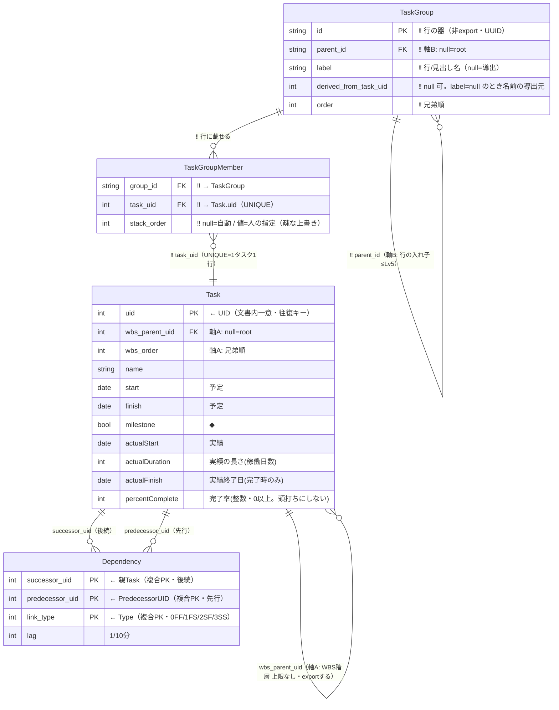

# GRS ネイティブ構成 ERD ＋ 責務

- 日付: 2026-07-25
- 位置づけ: **GRS としての構成**を示す文書。`grs-mspdi-field-ledger-ja.md`（＝MSPDI 全要素の**取捨選択**）の結果を受け、**Carry / Drop を除外**し、**Own / Consume / Reconstruct** と **GRS 追加要素**だけで GRS のネイティブ・データ構造を ERD＋責務で確定する。
- 対の文書:
  - `grs-mspdi-field-ledger-ja.md` = **取捨選択**（MSPDI をどう仕分けるか）
  - **本書** = **GRS 構成**（仕分けの結果、GRS が実際に持つ構造）
- 設計判断・根拠: **本書 §8I**（設計判断の変遷 18 件）。旧「設計判断」文書は 2026-08-04 に破棄した（`../DISCARDED-ja.md`）。
- 主言語 ja。識別子・列名は英語 ASCII。

> ⚠️ **Carry / Drop は本 ERD に出さない**（意図的除外）。ただし Carry は「捨てた」のではなく、往復のため**別途 passthrough ストアで温存**する（詳細は `grs-mspdi-field-ledger-ja.md` §7・§8B）。Drop=0。

> 🔴 **予実・進捗まわりは `../07-plan-actual/handover-plan-actual-decisions-ja.md` が上書きする。**
> 本書の該当箇所（`Task` の実績属性・`TaskVisual` の一部）は**旧版**である。差分は次のとおり。
>
> | 本書の記述 | 確定 |
> |---|---|
> | `progressRatio`（0..1） | **`percentComplete`**（整数・0 以上）。**`actualDuration` から算出して格納** |
> | `actualFinish` を実績バーの右端とする | **右端は `actualStart + actualDuration`**。`actualFinish` は**完了時だけ**入る |
> | （無し） | **`actualDuration`** を追加（稼働日数。実績バーの長さそのもの） |
> | （無し） | **`resumeValid`** を追加（`false` = 再開日未定の中断＝中止） |
> | `stop` / `resume` は**拡張領域** | **`Stop`/`Resume`/`ResumeValid` は Own（MSPDI ネイティブ）**。§3-4 #8 の判断を撤回 |
> | `stop` を保存する | **保存しない**。中断時の右端と同じ値なので export で算出する |
> | `importance`（LOD の選別） | **廃止**。LOD は **WBS の階層の深さ**（`wbs_parent_uid` から導出）で判定 |
> | `progressStatus`（自由文字列） | **廃止**。状態が `actualFinish`/`resume`/`resumeValid` で構造化された |
> | `iconShapeKind` | **`shapeKind`** へ改名（タスク形状） |
>
> **拡張領域を使うのは `fadeInDays` / `fadeOutDays` の 2 つだけ**になった（旧 6 枠 → 2 枠）。

## 引継ぎ: 4 文書の役割と読む順

> **本プロジェクトは反省・引継モード**（コード/仕様書はフリーズ）。以下は次のプロジェクトへ渡す資産。

| 読む順 | 文書 | 何が書いてあるか | 次プロジェクトでの使い道 |
|:--:|---|---|---|
| **1** | **`../01-mspdi/mspdi-pitfalls-ja.md`** | **MSPDI 実装の落とし穴**（XSD 実測ベース） | **どんなツールを作っても効く**。設計方針に依存しない。**最優先で読む** |
| **1b** | **`../01-mspdi/mspdi-enums-ja.md`** | **enum 全数リファレンス**（53 要素 / 535 値） | Adapter 実装時に必携。要約からの推測を防ぐ |
| 2 | `../01-mspdi/mspdi-core-tree.md` / `mspdi-tables.md` | MSPDI の構造・全 29 テーブルの責務 | MSPDI 自体の理解 |
| 3 | `grs-mspdi-field-ledger-ja.md` | **全要素の取捨選択**（Own/Consume/Reconstruct/Carry/Drop） | 「ある製品ではこう仕分けた」という実例。分類の枠組み自体が再利用できる |
| 4 | **本書** | **GRS の構成**（ERD・責務・識別子・マージ規約） | 採用した構造。**§8F に検討の履歴**（#1〜#7 はすべて解決済み） |
| 5 | **本書 §8I** | **設計判断の変遷**（何を試し、なぜ変えたか） | **却下案とその理由**。同じ検討を繰り返さないため |

## 構成

§1 本書の説明 → §2 GRS 概要 → §3 MSPDI から受け継ぐ範囲 → §4 GRS 構成の原則 → §5 GRS ネイティブ ERD（**5.0 何が本質か / 5.1 コア ERD〈4〉/ 5.2 全体 ERD〈12〉/ 5.3 識別子 / 5.4 マージ規約 / 5.5 資源の軽量ネイティブ化**）→ §6 ERD 要素の責務 → §7 要素別フィールド詳細 → §8 Appendix

---

## 1. 本書の説明

`grs-mspdi-field-ledger-ja.md` は MSPDI の全要素を **Own / Consume / Reconstruct / Carry / Drop** に仕分けた（取捨選択）。本書はその**入力**を受け:

```
ledger の Own/Consume/Reconstruct  ─┐
                                    ├─▶ 本書 = GRS ネイティブ構成（ERD＋責務）
GRS 追加要素（マルチバー等）        ─┘

（Carry / Drop は除外 … Carry は別 passthrough ストアへ・Drop=0）
```

- **Own** → GRS が同形で持つ**列**（ERD 本体）。
- **Consume** → GRS が**別構造**で持つ（`OutlineLevel`→WBS 木、`PredecessorLink`→`Dependency` 等・ERD 本体）。
- **Reconstruct** → **保存しない**。export で他 Own から算出（§8A 一覧）。
- **GRS 追加** → MSPDI に対応が無い GRS 固有（マルチバー行・視覚属性）。

本書は Adapter の「GRS 側の受け皿」を確定する設計資料である。

---

## 2. GRS 概要

- **GRS（gr-scheduler）**: 単一 `.html` の WYSIWYG 日程表ツール。成果物は JSON（主）/ MSPDI XML / SVG。
- **コア価値**: マルチバー（1 行に複数タスク横並べ）＋整列＋ズーム連動 LOD＋**依存線の全自動配線**（手動調整なし・§5.6）。
- **ネイティブモデルは 2 軸**:
  - **軸A: WBS 構造ツリー** = `Task.wbs_parent_uid`（MSPDI `OutlineLevel` 対応・**export する**）。
  - **軸B: マルチバー視覚層** = `TaskGroup`（行の器・≤Lv5）＋ `TaskGroupMember`（**GRS 専用・非 export**）。
- **JSON = GRS メモリの無変換直列化**（正規形）。MSPDI 交換は Adapter が担う。

---

## 3. MSPDI から受け継ぐ範囲（Carry/Drop 除外後）

ledger の 8 ネイティブテーブルから、**Own/Consume/Reconstruct のみ**を抽出:

| MSPDI 由来                 | 受け継ぐ要素（Own/Consume/Reconstruct）                                                                                                                                                                           | 除外（Carry・別ストア）                                                                             |
| -------------------------- | ----------------------------------------------------------------------------------------------------------------------------------------------------------------------------------------------------------------- | --------------------------------------------------------------------------------------------------- |
| Task                       | UID/Name/Start/Finish/Milestone/ActualStart/ActualFinish/Deadline/Notes/**PercentComplete**/**ActualDuration**/**Stop**/**Resume**/**ResumeValid**（すべて Own・§3-4 #8 は撤回）、OutlineLevel/CalendarUID/PredecessorLink（Consume）、ID/OutlineNumber/Summary（Reconstruct）、**Duration は未編集=Carry / 編集済=Reconstruct** | 制約/工数/コスト/EVM/CPM派生/平準化/サブPJ/enterprise/補助/子要素、RemainingDuration（**完了時だけ GRS が 0 を書く** — §10-1・唯一の Carry 例外） |
| PredecessorLink            | PredecessorUID/Type/LinkLag/LagFormat（Consume）                                                                                                                                                                  | CrossProject/CrossProjectName                                                                       |
| Project                    | 識別/文書/期間/換算（Own）、CalendarUID（Consume）、FinishDate（Reconstruct）                                                                                                                                     | 通貨/既定/計算/Move/EV/会計/時刻（37）＋**ScheduleFromStart/CurrentDate/サーバ管理4**（§5.6 で降格） |
| Calendar/WeekDay/Exception | UID/Name/IsBaseCalendar/BaseCalendarUID/DayType(1-7)/DayWorking/例外日（Own/Consume）                                                                                                                                  | WorkingTime/WorkWeek/繰返し詳細/**DayType=0＋TimePeriod(2003形式)**                                  |
| Resource                   | `UID`/`Name`/`Type`/`IsCostResource`（Own）、`CalendarUID`（Consume）                                                                                                                                                              | 他全列（工数/コスト/EVM/enterprise/子要素）                                                         |
| Assignment                 | `UID`（Own）、`TaskUID`/`ResourceUID`（Consume）                                                                                                                                                                  | 他全列（`Units`/工数/コスト/EVM/201予約枠/子要素）                                                  |

- **Resource / Assignment は「軽量ネイティブ」**（§5.5）。**担当者名をバーに表示する**ため、`Resource.Name`/`Type` と `Assignment` の 2 参照だけを理解し、**残りは全て Carry** で温存する。資源管理（工数・コスト・平準化）は引き続き非対象。

---

## 4. GRS 構成の原則

1. **Own は列**: 同形で GRS の列に持つ（`Task.UID`→`Task.uid` 等、名は GRS 側規約）。**MSPDI 由来テーブルに GRS 代理キーを足さない**（§5.3）。
2. **Consume は構造**: 意味を解釈して GRS 構造へ写す。
   - `OutlineLevel`＋順序 → `Task.wbs_parent_uid` / `wbs_order`（**軸A・唯一の真実**）。
   - `PredecessorLink` → `Dependency`（task↔task エッジ）。
   - `CalendarUID` → `Task.calendar_id` / `Project.calendar_id`（ネイティブ暦参照）。
3. **Reconstruct は非保存**: 正規 JSON に持たない（ドリフト防止）。export でその場算出（§8A）。
4. **GRS 追加はマルチバーと視覚**: MSPDI に対応が無い軸B・視覚属性。**すべて非 export**。
5. **Carry は本 ERD 外**: passthrough ストアで温存（往復専用・GRS は解釈しない）。
6. **依存の向き**: GRS 追加（TaskGroup/TaskVisual）→ Task。逆流させない（Task 無汚染）。
7. **自動算出できるものは保存しない**（§5.6）: 自動配線の経路・LOD の見え方など、エンジンが毎回決めるものはデータに持たない。
8. **見た目に影響するものは全て保存・共有する**（§5.7）: GRS の JSON を渡せば GRS 同士で同じ見た目が再現されること。保存する項目と保存しない項目は **§5.7-1 で確定**。

---

## 5. GRS ネイティブ ERD

全 14 エンティティを一度に見ると読み取りづらいため、**§5.1 コア（4）**と**§5.2 全体（12）**の 2 段で示し、注記の 2 つ（`Comment` / `HighlightBox`）は **§5.8** で別に示す。§5.1 がモデルの本質、§5.2 が実装の全体像。

### 5.0 何が本質か（レイヤ分け）

判定基準: **それが無いと GRS のデータモデルが成立しないか**。

| 層             | エンティティ                                        | 本質? | 理由                                                                                                            |
| -------------- | --------------------------------------------------- | :---: | --------------------------------------------------------------------------------------------------------------- |
| **コア**       | `Task`                                              | **◎** | 日程要素の本体。**軸A（WBS）は `wbs_parent_uid` の自己参照で Task 内に閉じる**ため、階層に別テーブルは要らない。 |
| **コア**       | `TaskGroup` / `TaskGroupMember`                     | **◎** | **軸B（マルチバー）＝製品最大の差別化**。この 2 つが無いと「1 行に複数タスク」が表現できない。                  |
| **コア**       | `Dependency`                                        | **◎** | 依存線＝コアドメイン（自動配線）。Task 間の関係で、軸A/軸B のどちらとも独立。                                   |
| ルートメタ     | `Project`                                           |   ○   | 1 個の器（文書メタ・期間・換算）。構造の理解には寄与しない。                                                    |
| 暦クラスタ     | `Calendar` / `WeekDay` / `Exception`                |   ○   | 稼働日・祝日のグレー表示と期間換算。**外しても日程の構造は成立**（描画が退化するだけ）。                        |
| 資源（軽量）   | `Resource` / `Assignment`                           |   ○   | **担当者名の表示**のみを担う軽量層（§5.5）。外すと担当者が出ないだけで日程の構造は成立。                        |
| 視覚           | `TaskVisual`                                        |   △   | MSPDI 由来の `Task` を汚さないために分離した**非 export の視覚列**。Task に 0..1 でぶら下がるだけ。              |
| 出自（マージ用） | `TaskOrigin`                                      |   △   | **同じ理由で Task から分離**した非 export の出自メモ。マージの既定判定にのみ使う（§5.4）。                       |

→ **コア 4 つ（Task / TaskGroup / TaskGroupMember / Dependency）が本質**。残り 8 は「器・暦・資源・見た目」で、**外してもモデルは壊れない**。

### 5.1 コア ERD（本質 4 エンティティ）

2 軸とコアドメインだけを描いた最小形。**このデータ構造が GRS の本質**。

> **凡例**: **‼️ = MSPDI に対応が無い GRS 新設**（テーブル/カラム）。`Consume`（`OutlineLevel`→`wbs_parent_uid` 等、MSPDI を構造化しただけ）は元要素があるので ‼️ を付けない。
> **‼️ テーブル**: `TaskGroup` / `TaskGroupMember`（Mermaid はエンティティ名に絵文字を置けないため、**全カラムとリレーション線ラベルに ‼️** を付して表す）。



**この 4 つで表現できること**:

- **識別** = `Task.uid`（= MSPDI UID）**一本**。代理キーを持たない（§5.3）
- **軸A: WBS 階層** = `Task.wbs_parent_uid` の自己参照（外部マスタへ export・明示編集でのみ伝播）

> **用語**: **外部 WBS マスタ**（以後「外部マスタ」）= **GRS の外側で WBS 構造を保持し、MSPDI を生成・再取込する対向ツール**。特定の製品を指す語ではない。往復規約は **本書 §8H** が正で、そこに**どの挙動を実機で検証したか**も記してある。
- **軸B: マルチバー** = `TaskGroup` に `TaskGroupMember` で複数 Task を載せる（GRS 専用・非 export・WBS 不変）
- **依存** = `Dependency`（先行/後続・種別・ラグ）
- **予定/実績/マイルストーン** = Task の日付列

### 5.2 全体 ERD（コア＋ルートメタ＋暦＋視覚）

MSPDI 由来（Own/Consume）に GRS 追加（マルチバー・視覚・依存線経路）を重ねた **GRS の実構造**。各列に MSPDI 由来を注記（`← 元要素`）。GRS 追加は「GRS新設」。

> **凡例**: **‼️ = MSPDI に対応が無い GRS 新設**（テーブル/カラム）。`← 元要素` = MSPDI 由来（Own/Consume）。
> **‼️ テーブル（4）**: `TaskGroup` / `TaskGroupMember` / `TaskVisual` / `TaskOrigin`（Mermaid の制約上、**全カラムとリレーション線ラベルに ‼️**）。

```mermaid
erDiagram
    Project ||--o{ Task : "tasks"
    Project ||--o{ Calendar : "calendars"
    Project ||--o{ Resource : "resources"
    Project ||--o{ Assignment : "assignments"
    Project ||--o{ TaskGroup : "‼️ taskGroups"
    Project }o--o| Calendar : "calendar_id(既定暦)"

    Assignment }o--o| Task : "task_uid(minOccurs=0)"
    Assignment }o--o| Resource : "resource_uid(未割当あり)"
    Resource }o--o| Calendar : "calendar_id"

    Task ||--o{ Task : "wbs_parent_uid(軸A 上限なし)"
    Task }o--o| Calendar : "calendar_id"
    Task ||--o{ Dependency : "successor_uid"
    Task ||--o{ Dependency : "predecessor_uid"
    Task ||--o| TaskVisual : "‼️ task_uid"
    Task ||--o| TaskOrigin : "‼️ task_uid(出自)"
    Task ||--o| TaskGroupMember : "‼️ task_uid(0..1)"

    TaskGroup ||--o{ TaskGroup : "‼️ parent_id(軸B ≤Lv5)"
    TaskGroup ||--o{ TaskGroupMember : "‼️ members"

    Calendar ||--o| Calendar : "base_calendar_id"
    Calendar ||--o{ WeekDay : "weekDays"
    Calendar ||--o{ Exception : "exceptions"

    Project {
        string id PK "← Project.UID(Own・≤16文字・省略可)"
        string schema_version "‼️ GRS スキーマ版（移行判別）"
        int uid_high_water_mark "‼️ 削除済み含む最大UID（単調増加採番）"
        string name "← Name(Own)"
        string title "← Title(Own)"
        int revision "← Revision(Own)"
        date start_date "← StartDate(Own)"
        date status_date "← StatusDate(Own・イナズマ線)"
        int minutes_per_day "← MinutesPerDay(Own・換算)"
        int week_start_day "← WeekStartDay(Own)"
        int calendar_id FK "← CalendarUID(Consume)"
        string meta_own "他 Own メタ: Subject/Category/Company/Manager/Author/CreationDate/LastSaved/MinutesPerWeek/DaysPerMonth(§7.3)"
    }
    Task {
        int uid PK "← UID(Own・文書内一意・往復キー)"
        int wbs_parent_uid FK "← OutlineLevel(Consume・軸A・null=root)"
        int wbs_order "軸A: 兄弟順"
        string name "← Name(Own)"
        date start "← Start(Own・バー左)"
        date finish "← Finish(Own・バー右)"
        bool milestone "← Milestone(Own・◆)"
        date actualStart "← ActualStart(Own・実績左)"
        int actualDuration "← ActualDuration(Own・実績の長さ=稼働日数・XSDはxsd:duration。§7.1a参照)"
        date actualFinish "← ActualFinish(Own・完了時のみ)"
        int percentComplete "← PercentComplete(Own・整数0以上・actualDurationから算出して格納)"
        date deadline "← Deadline(Own・目標)"
        date resume "← Resume(Own・再開予定日・中断時のみ)"
        bool resumeValid "← ResumeValid(Own・false=再開日未定の中断)"
        string notes "← Notes(Own)"
        int fadeInDays "← ExtendedAttribute(Consume・拡張領域・§5.5f)"
        int fadeOutDays "← ExtendedAttribute(Consume・拡張領域・§5.5f)"
        int calendar_id FK "← CalendarUID(Consume)"
    }
    Dependency {
        int successor_uid PK "← 親Task(複合PK・後続)"
        int predecessor_uid PK "← PredecessorUID(複合PK・先行)"
        int link_type PK "← Type(複合PK・0FF/1FS/2SF/3SS)"
        int lag "← LinkLag(1/10分)"
        int lag_format "← LagFormat"
    }
    Calendar {
        int id PK "← Calendar.UID(Own)"
        string name "← Name(Own)"
        bool is_base "← IsBaseCalendar(Own)"
        int base_calendar_id FK "← BaseCalendarUID(Consume)"
    }
    Resource {
        int uid PK "← Resource.UID(Own)"
        string name "← Name(Own・担当者名の表示元)"
        int type "← Type(Own・0材料/1作業。欠落は1とみなす)"
        bool is_cost_resource "← IsCostResource(Own・費用項目の除外用)"
        int calendar_id FK "← CalendarUID(Consume)"
    }
    Assignment {
        int uid PK "← Assignment.UID(Own)"
        int task_uid FK "← TaskUID(Consume)"
        int resource_uid FK "← ResourceUID(Consume・null=未割当)"
    }
    WeekDay {
        int ordinal "‼️ 親内の出現序数（Carry の付着キー・§5.5d）"
        int day_type "← DayType(Own・1日..7土。0=例外は不採用)"
        bool day_working "← DayWorking(Own)"
    }
    Exception {
        int ordinal "‼️ 親内の出現序数（Carry の付着キー・§5.5d）"
        string name "← Name(Own)"
        date from_date "← TimePeriod.FromDate(Own)"
        date to_date "← TimePeriod.ToDate(Own)"
        bool day_working "← DayWorking(Own)"
    }
    TaskGroup {
        string id PK "‼️ UUID(行の器)"
        string parent_id FK "‼️ 軸B: null=root(≤Lv5)"
        string label "‼️ 行/見出し名"
        int order "‼️ 兄弟内の並び順"
        bool collapsed "‼️ 折り畳み(見た目の一部→保存)"
        string color "‼️ 行色"
        int height "‼️ null=自動 / 論理高さ(zoom=1基準)"
    }
    TaskGroupMember {
        string group_id FK "‼️ → TaskGroup"
        int task_uid FK "‼️ → Task.uid(UNIQUE=1タスク1行)"
        int stack_order "‼️ null=自動 / 値=人の指定(疎な上書き)"
    }
    TaskOrigin {
        int task_uid PK "‼️ → Task.uid"
        string source_project_uid "‼️ 取込元マスタのProject.UID"
        int source_uid "‼️ 取込元での元UID（再取込の突合用）"
        int last_seen_import_seq "‼️ 最後に届いた取込の通し番号（§5.4C）"
        string import_session_id "‼️ Project.UID 省略時の代替出自"
    }
    TaskVisual {
        int task_uid PK "‼️ → Task.uid"
        int nameAnchor "‼️ null=自動 / 0-8(9点アンカー)"
        string nameAlign "‼️ null=自動 / left|center|right"
        string shapeKind "‼️ タスク形状（rectangle/chevron/arrow/endpointSpan/milestone の 5 値）"
        string milestoneGlyph "‼️ マイルストーン形状（shapeKind='milestone' のときだけ見る）"
        string fillColor "‼️ 塗り色"
        string strokeColor "‼️ 線色"
        string lineWeight "‼️ 線の太さ（thin/medium/thick・a11y の非色符号）"
    }
```



> `← 元要素` = MSPDI 由来（Own/Consume）。**‼️** = GRS 新設（MSPDI に対応なし）。文書全体の設定（`stack_direction` / `zoom`）は単一オブジェクト `documentSettings` のため本 ERD では省略（§5.6/§5.7）。行ごとの書式は `TaskGroup` が直接持つ。

### 5.3 識別子の方針（代理キーを持たない）

**原則: MSPDI の UID をそのまま GRS の PK に使う。GRS 独自の代理キー（UUID 等）を追加しない。**

| エンティティ | PK | 代理キー |
|---|---|:--:|
| `Task` | `uid`（= MSPDI `Task.UID`・**高水位で単調増加採番**） | 無し（**出自は `TaskOrigin` に分離**・§5.3） |
| `TaskOrigin` ‼️ | `task_uid`（→ Task.uid） | — GRS 新設（出自メモ） |
| `Project` | `id`（= `Project.UID`） | 無し |
| `Calendar` | `id`（= `Calendar.UID`） | 無し |
| `Resource` | `uid`（= `Resource.UID`） | 無し |
| `Assignment` | `uid`（= `Assignment.UID`） | 無し |
| `Dependency` | **複合** (`successor_uid`, `predecessor_uid`, **`link_type`**) | 無し（**MSPDI は依存線に ID を振らない**＝自然キー。XSD 実測: `PredecessorLink` の子は `PredecessorUID`/`Type`/`CrossProject`/`CrossProjectName`/`LinkLag`/`LagFormat` のみ） |
| `WeekDay` / `Exception` | 親＋位置（弱エンティティ） | 無し |
| `TaskGroup` ‼️ | `id`（UUID） | — GRS 新設テーブルのため独自 ID が必要 |

**なぜ代理キーが不要か**: マージ時の UID 衝突は**取込時の 3 択（§5.4）で解消**されるため、文書内で UID は常に一意。したがって複合キー（`source_id`+`uid`）も UUID も要らない。

**大原則: UID の値から意味を読み取らない（確定）**

**UID は「文書内で一意な不透明な整数」としてのみ扱う**。値の範囲・大小・連続性に意味を持たせない。したがって:

- **番号空間の分割（予約帯）は採用しない**。「1,000,000 以上は GRS 専用」のような設計は、**同じ規則を使う別の GRS 文書とは結局ぶつかる**うえ、値に意味を持たせるぶん脆い。
- **「GRS 生まれか」は `TaskOrigin` の行の有無で判定**する（値では判定しない）。
- → **UID がランダムに振られていても設計が成立する**。

**新規作成タスクの UID**: 文書内で未使用の値であれば何でもよい。実装上は `uid_high_water_mark + 1`（削除済みを含む最大値からの単調増加）を推奨する。

> ⚠️ **高水位は「正しさの前提」ではなく実装上の配慮**。UID の再利用（`uid=100` を削除 → 新規作成で 100 が再採番 → 同一マスタ再取込で衝突）は、**§5.4 の照合規則（GRS 生まれは照合対象にしない）が本質的に防ぐ**。高水位は**無駄な再採番を減らす**ためのもので、これが無くても壊れない。Undo でも巻き戻さない。

**出自の保持（確定・案A ＋ B-1）**: **`TaskOrigin{ task_uid, source_project_uid, source_uid, import_session_id }`** に保持する（**`Task` には置かない**）。

> **なぜ別テーブルか（B-1）**: §4 原則 6「GRS 由来を Task に逆流させない（Task 無汚染）」に従う。`TaskVisual` を分離したのと同じ基準。これにより **`Task` = MSPDI Own のみ**という不変条件が保たれ、export は「Task の全列をそのまま書く」で済む（除外リストが不要＝除外漏れバグが構造的に起きない）。
>
> **3 状態を表す**: ①**マスタ由来**＝該当行あり・`source_project_uid` に値 ②**GRS 生まれ**＝**行なし**（＝§5.4 の照合対象外） ③**出自不明**（MSPDI が `Project.UID` を省略した場合。XSD 上 `minOccurs=0`）＝行あり・`source_project_uid` は null で `import_session_id` に取込セッション ID。③は**既定を「別 UID」（安全側）にフォールバック**する。
>
> **`source_uid`（取込元での元 UID）**: 「別 UID」で振り直した後も **(`source_project_uid`, `source_uid`) で再取込を突合**できるようにするための列。**マージの突合専用**であり、**export で元 UID を復元するものではない**（C-3「振り直したタスクは元ソースへの往復を諦める」は維持）。これが無いと、別 UID で取り込んだマスタを再取込するたびに**まるごと複製**する。

> ⚠️ **なぜ必要か**: マージの既定判定（§5.4 C-1）は「取込側 `Project.UID` と**既存の出自**の比較」で決まるが、`Project` は文書に 1 個しか無いため、**2 つ目以降のマスタの出自が失われる**。出自が無いと「マスタB を再取込」した時に毎回「別マスタ」と誤判定し、**取り込むたびにタスクが無限に複製**される。また「別マスタ×上書き」の警告も計算できない。**この列は代理キーではなく出自メモ**（PK は `uid` のまま）。

### 5.4 マージ規約（複数 MSPDI の取込）

MVP スコープ。2 つ目以降の MSPDI を取り込む際、衝突時にユーザーへ選択させる。

**衝突の判定（C-1 確定）**: 取込側 `Project.UID` と既存の出自を比較する。

| 出自 | 意味 | UID 一致の解釈 | **既定の選択** |
|---|---|---|---|
| **同一マスタ**（`Project.UID` 一致） | 同じ外部マスタの再取込 | 本当に同一タスク | **1. 上書き** |
| **別マスタ**（`Project.UID` 不一致） | 無関係な別日程 | たまたま番号が同じ**別タスク** | **2. 別 UID** |

> 別マスタで「上書き」を選ぶと**無関係なタスクを破壊**するため、その組合せは警告を出す。

**照合規則（確定）— 何と何を「同じタスク」とみなすか**

| 既存タスク | 照合の可否 | 理由 |
|---|---|---|
| **GRS 生まれ**（`TaskOrigin` 行が無い） | **照合対象にしない**（UID が一致しても常に衝突として扱う） | GRS で手作りしたタスクが、外部ファイルのタスクと「同じもの」であるはずがない |
| マスタ由来（`TaskOrigin` 行あり） | **(`source_project_uid`, `source_uid`) で照合**。一致すれば同一タスク | 「別 UID」で振り直した後でも突合できる（→ 再取込の複製を防ぐ） |

**衝突時にどちらの UID を動かすか（確定）**: **外部識別を持たない側を動かす**。

- 既存が **GRS 生まれ** → **既存側を再採番**する（外部識別が無いので動かしても失うものが無い）
- 双方がマスタ由来で `source` が異なる → **取込側**を再採番（§5.4 の 3 択に従う）

> **マスタ由来のタスクは UID を保持する**のが原則。これにより元マスタへの往復が守られる。

**責任範囲（確定）**: **GRS は「自分が受け取った文書の中」の一意性だけを保証する**。

- **文書外との衝突は GRS の責任範囲外**。具体的には「GRS が export した UID が、その後外部マスタ側で採番された別タスクとぶつかる」ケース。**別ツールでの ID 衝突検査**を前提とする。
- GRS 側で番号空間を予約したり外部の採番を予測したりはしない（上記の大原則）。

**選択の粒度（C-2 確定）**: **取込 1 回につき 1 度だけ**問い、その選択を**衝突全件へ一括適用**する（数百件を個別に問わない）。衝突一覧の提示と個別上書きは任意機能。

**タスク衝突時（同一タスクが来た場合）**

| 選択 | 動作 | UID | 元ソースへの往復 |
|---|---|---|---|
| 1. 上書き | 既存タスクを取込側の内容で置換 | 既存 UID を維持 | ○ 保たれる |
| 2. 別 UID でインポート | 別タスクとして追加 | **新規採番**（`uid_high_water_mark + 1`） | **✗ 諦める（C-3 確定）** |
| 3. キャンセル | MSPDI 読込を中止（何も変更しない） | — | — |

> **C-3 確定**: 選択 2 で UID を振り直したタスクは、**元ソース（外部マスタ等）への往復を諦める**。振り直し後の export は「新しいタスク」として出る。
> `TaskOrigin.source_uid` は**再取込の突合専用**であり、**export で元 UID を復元するものではない**（§5.3）。UI で**この旨を明示して選択させる**こと。

**プロジェクト基本情報の衝突時**

| 選択 | 動作 |
|---|---|
| 1. 上書き | 取込側の Project メタで置換 |
| 2. 既存を保持 | 既存 Project メタを維持（タスクのみ取込） |
| 3. キャンセル | MSPDI 読込を中止 |

**「上書き」の同期意味論（③ 確定）** — 「置換」が何を意味するかを 3 つに分けて確定する。

#### A. 置換の対象範囲 — **MSPDI 由来の層だけを置換し、GRS 固有の層は保持する**

| 層 | 上書き時 | 理由 |
|---|---|---|
| `Task` の Own / Consume 列、`carry`、`Dependency` | **置換** | マスタの更新を取り込むのが目的 |
| **`TaskVisual`**（色/アイコン/名称ラベル位置） | **保持** | MSPDI に出ない情報。置換すると**再取込のたびに見た目が壊れる** |
| **`TaskGroupMember`**（どの行に載るか） | **保持** | 同上。**マルチバー配置が毎回リセットされるのは致命的**（製品最大の差別化機能が運用に耐えなくなる） |
| `TaskOrigin` | 更新（`source_uid` は維持、`last_seen_import_seq` を今回値に） | 突合と未着検出のため |

> ⚠️ これを明記しないと「上書き＝行まるごと差し替え」と実装される。

#### B. 取込側にあって既存に無いタスク → **追加する**

- 追加しないとマスタの更新が取り込めない
- **どの行（`TaskGroup`）に入れるか**は import の器の初期化ポリシー（§5.5g「サマリ配下の葉をそのサマリの器へ」）を再取込にも適用する
- 器が特定できない場合の落とし先は **§5.5g で確定**（子を持たない Lv1 タスクは自分の器を持つ。ルート器は作らない）

#### C. 既存にあって取込側に無いタスク → **削除しない。印をつけて通知する**

**出自で 3 つに分かれ、論点は 1 つだけ**:

| 既存タスク | 扱い |
|---|---|
| **同じマスタ由来** | **← 唯一の論点**。削除された可能性もあるが、単に今回の出力に含まれなかっただけかもしれない |
| 別マスタ由来 | 触らない |
| GRS 生まれ（`TaskOrigin` 行なし） | 触らない（§5.4 照合規則で対象外） |

**確定: 削除しない。** 決め手は **MSPDI ファイルからは「マスタの全体」か「一部」かを判別できない**こと（そのようなフラグは XSD に存在しない）。フィルタ出力・サブセット出力は実務で普通に起きるため、「来なかった＝削除された」と推論すると**部分エクスポートの取込で大量削除**が走る。しかも被害が非対称で、**消す＝復元不能**（GRS 固有の配置・視覚も道連れ）／**残す＝気づけば消せる**。安全側に倒す。

**印の付け方: フラグを立てず、最終目撃記録から導出する。**

```
記録するもの（取込時に GRS が書く・MSPDI には返さない）
    documentSettings.import_seq             取込のたびに +1 する文書内の連番（整数 1 個）
    TaskOrigin.last_seen_import_seq         そのタスクが最後に届いた取込の番号

導出（保存しない）
    そのマスタの最新取込番号 = max( last_seen_import_seq WHERE source_project_uid = X )
    「消えた候補」          = ( そのタスクの last_seen_import_seq < 最新取込番号 )
                              ＝「同じマスタの他のタスクは届いたのに、こいつだけ届かなかった」
```

- **フラグの立て消しが存在しない** → 次回届けば `last_seen` が更新されて自動的に候補から外れる＝**消し忘れバグが構造的に起きない**
- **何回連続で届いていないか**まで分かる（1 回なら部分エクスポートの可能性、連続なら本当に削除された可能性が高い）
- §5.6 の原則「自動算出できるものは保存しない」と整合（**保存するのは観測記録だけ、判定は導出**）

**通知**: 取込完了時にトーストで「マスタから **N 件が今回届きませんでした**」と出し、一覧から**ユーザーが選んで一括削除**できるようにする（GRS が勝手に消さない）。

> **通知が必須な理由**: 消さない方針なので、放置すると export 時に外部マスタ側で「存在しない UID」として**新規作成＝削除したはずのタスクが復活**する（ゾンビ）。通知がこれを防ぐ唯一の手段。

> **却下: 取込ログ表（`ImportLog{seq, 日時, ファイル名}`）**。通知を「2026-07-20 の〈…xml〉では届いていました」と具体化できるが、**GRS の出力を絞る方針**により不採用。連番だけで機能は成立する。

**暦・資源・割当の重複（C-5 確定＋衝突規則）**: ダイアログは上記 2 つのみ（増やさない）。取込側の重複・衝突は自動処理する。

| 対象 | 重複・衝突時の扱い |
|---|---|
| `Calendar` | **内容一致（名前＋稼働曜日＋祝日が同じ）なら自動統合**。不一致で UID 衝突なら**再採番**＋名前に接尾辞。 |
| `Resource` | **`Name` が非空かつ完全一致（NFKC 正規化＋trim 後）なら自動統合**。名前なし・不一致で UID 衝突なら**再採番**。 |
| `Assignment` | 自然キー (`task_uid`, `resource_uid`) が一致すれば同一とみなし統合。UID 衝突は**再採番**。 |
| `Task` 以外の全 UID | **衝突したら必ず再採番**（`uid_high_water_mark` 方式で単調増加）。無規則の衝突を残さない。 |

> ⚠️ **なぜ必要か**: ダイアログは Task と Project メタしか扱わない。`Assignment` の UID は MSPDI が 1 から採番するのが普通なので**2 ファイル目で必ず衝突**する。`Resource` も「同名でない」ケース（A の 1=佐藤 / B の 1=田中）は統合ルールに該当せず未定義だった。規則が無いと **PK 重複**が起き、代理キー廃止の前提が崩れる。

**取込のアトミック性（確定）**: **取込は全か無かのトランザクション**とする。衝突検出・自動統合の判定は**全てドライラン**で行い、ユーザーが決定した後に一括適用する。

> ⚠️ **なぜ必要か**: 素直に「Calendar 統合 → Resource 統合 → Task 衝突検出 → ダイアログ」の順で実装すると、**キャンセル時点で暦と資源は既に統合・再採番済み**になり「3. キャンセル＝何も変更しない」が嘘になる。Undo の 1 単位も**取込全体**とする。`uid_high_water_mark` は Undo でも巻き戻さない（巻き戻すと **Undo 後に新規作成した Task の UID が、Redo で戻る UID と衝突する**ため）。localStorage 自動保存は**取込トランザクション完了後にのみ**発火させる。

**マージ時の Carry 欠落（明示許容）**: Project メタ「既存を保持」や Calendar/Resource の自動統合を選ぶと、**取込側の Carry（通貨・計算オプション・単価表・勤務時刻等）は破棄される**。

> ⚠️ **Drop=0 の適用範囲**: 「Drop=0・往復無損失」は **単一 MSPDI の未編集往復に限る**。**マージを行った時点で取込側 Carry の欠落が発生しうる**（明示的に許容する）。→ §8D にも記載。

**UID 参照は自動追従（C-4 確定）**: §5.5 の不変条件により、UID を振り直しても全参照が構造的に追従する。**UID 再マップ表は不要**（当初案を廃止）。

### 5.5 資源の軽量ネイティブ化と「Carry に参照を残さない」不変条件

**目的**: **担当者名をバーに表示する**。そのために `Resource` / `Assignment` を**軽量ネイティブ**として持つ（資源管理＝工数・コスト・平準化は引き続き非対象）。

理解するのは **8 列だけ**。残りは全て Carry で温存する。

| エンティティ | 理解する列 | 分類 |
|---|---|---|
| `Resource` | `uid` / `name`（表示元）/ `type`（0材料/1作業）/ `is_cost_resource` | Own |
| `Resource` | `calendar_id` | Consume |
| `Assignment` | `uid` | Own |
| `Assignment` | `task_uid` / `resource_uid` | Consume |

**表示の経路**: `Task` →（`Assignment.task_uid`）→ `Assignment` →（`resource_uid`）→ `Resource.name` をバーに表示。`type=1`（作業）のみを担当者として扱い、材料資源は除外する。MVP は**読取専用表示**（GRS での割当編集は将来）。

**不変条件（重要）**: MSPDI の UID 参照フィールドは全 7 つ。本節の格上げにより**その全てが Consume（構造化）**になった。

| UID 参照 | 分類 |
|---|---|
| `Task.PredecessorLink.PredecessorUID` / `Task.CalendarUID` / `Project.CalendarUID` / `Calendar.BaseCalendarUID` | Consume |
| `Assignment.TaskUID` / `Assignment.ResourceUID` / `Resource.CalendarUID` | Consume（本節で格上げ） |

→ **Carry の中に UID 参照は 1 つも残らない**（Carry ＝ 参照を持たない不透明な値の塊）。
→ **UID を振り直しても全参照が自動追従**するため、C-4/C-5 で検討した「UID 再マップ表」は**不要**。passthrough の実装も単純化する。

### 5.5a 担当者名の表示規則（⑥ 確定）

**情報源は MSPDI のみ**（`Assignment` → `Resource.name`）。GRS 側に自由文字列の担当者プロパティは**持たない**（MVP は読取専用という方針と一貫。列も増えない）。

```
表示文字列 =
    対象 = その Task の Assignment のうち
             ・resource_uid が文書内で解決できる（未割当は除外）
             ・Resource.Type = 1（Work）        ← 欠落時は 1 とみなす
             ・Resource.IsCostResource ≠ 1      ← 費用項目を除外
             ・Resource.IsNull ≠ 1              ← 欠番行を除外
             ・Resource.Name が非空
    並び = Assignment.uid 昇順
    文字列 = 先頭 1 名の Name ＋（残り m ≥ 1 なら「 他m名」）
    対象 0 名 → 何も表示しない
```

#### どの資源を担当者とみなすか

MS Project の資源は概念的に 3 種類あるが、**MSPDI の `Type` は {0=Material, 1=Work} の 2 値しかなく**、費用は `IsCostResource`（bool）という**別フィールド**で表現される（`../01-mspdi/mspdi-pitfalls-ja.md` C-6）。

| 種類 | 例 | 扱い | 判定 |
|---|---|:--:|---|
| **Work: 人** | 田中、佐藤 | **表示する** | `Type=1` |
| **Work: 設備** | プレス機、会議室A | **表示する** | 同上（下記） |
| Material | 鋼材、ネジ | **表示しない** | `Type=0` |
| Cost | 旅費、予備費 | **表示しない** | `IsCostResource=1` |

> **人と設備は区別しない（確定）**: **MSPDI に「これは人だ」というフラグは存在しない**。`EmailAddress` / `Phonetics`（ふりがな）/ `NTAccount` などから推測はできるが、いずれも省略可で確実でない。→ **区別を試みず、Work をそのまま表示する**。「田中」「会議室A」という**名称を見れば人か設備かは分かる**ため、実務上の問題は生じない。

→ この判定のため **`Resource.IsCostResource` を Own に追加**（Resource の Own は 4 列 → 5 列）。

#### 欠落値の扱い（XSD 上いずれも `minOccurs=0`）

| 欠落 | 素直に実装すると起きること | 規約 |
|---|---|---|
| `Resource.Type` | 「`Type≠1` だから除外」→ **人なのに担当者が出ない** | **`1`（Work）とみなす**（資源の大半は人・設備） |
| `Resource.Name` | 空文字を表示 → 区切り記号だけ残る | その資源を**表示対象から外す** |
| `Assignment.resource_uid` | 存在しない資源を引く → **クラッシュ or 誤表示** | **未割当として除外** |
| 対象が 0 名 | 「担当者なし」等を表示 | **何も表示しない** |

#### 表示位置

承認済み `11-items-icons.sdoc` ITEM-L2-004 に従い、**アイテムの左に右詰め**。依存線の入口矢印（左辺入線）の水平部分と**重ならないように**配置する。

### 5.5b 例外日（祝日）の表現を `Exception` に一本化（確定）

MSPDI は非稼働日を **2 系統**で表現できる。GRS は**新形式に一本化**する。

| 系統 | 内容 | GRS の扱い |
|---|---|---|
| `WeekDay.DayType` **1-7**（日〜土）＋`DayWorking` | **曜日の繰り返し**（土日は非稼働 等） | **採用（Own）** |
| `WeekDay.DayType` **0**（例外日）＋`TimePeriod` | **旧形式（Project 2003）の例外日レンジ** | **不採用**。解釈しない → **Carry で温存**（往復は壊さない） |
| `Exceptions/Exception`（`Name`/`TimePeriod`/`DayWorking`） | **新形式（2007）の例外日**（祝日名つき） | **採用（Own）** |
| **`Exception.Type`**（1-9） | **繰返し種別**。`TimePeriod` の意味を決める | **Consume（必須）**。下記の判定に使う |
| `Exception` の繰返し詳細（`Period`/`DaysOfWeek`/`MonthItem`/`MonthPosition`/`Month`/`MonthDay`/`Occurrences`/`EnteredByOccurrences`） | 繰返しの詳細パラメータ | **不採用（Carry）** |

- **MSPDI に祝日マスタは無い**。祝日は `Calendar` ごとに `Exception` を並べて表現する（日本の祝日なら「元日」「成人の日」…が 1 件ずつ）。
- **export**: GRS が理解する非稼働日は **`Exception` 形式で書く**。旧形式で入ってきたものは Carry から原形を書き戻す。
**⚠️ `Type` を必ず読む理由（重大）**: `Exception/TimePeriod` は **`Type` と組で読む前提**の要素で、繰返しがある場合は「1 日」ではなく**繰返しの適用範囲**を表す。

```
XSD: TimePeriod = "Defines a contiguous set of exception days"
     Occurrences = "The number of occurrences for which the calendar exception is valid"

元日を Type=2(毎年・日付指定), From=2020-01-01, To=2030-12-31, Occurrences=11 と書いたファイル
  Type を読まない場合 → 「2020〜2030 の 11 年間が非稼働」と誤解釈 → 全期間グレー ✗
```

| `Type` | 判定 | GRS の扱い |
|---|---|---|
| 欠落 または `9`（No exception type） | 繰返しなし | **`TimePeriod` を実日付の非稼働レンジとして採用**（Own） |
| `1`〜`8`（Daily/Yearly/Monthly/Weekly/…） | 繰返しあり | **`TimePeriod` を非稼働レンジとして採用しない**。要素まるごと Carry ＋「繰返し祝日は未対応」の警告を出す |

- ⚠️ **既知の割り切り**: 繰返し祝日（`Type` 1-8）は MVP で**グレー表示されない**（警告で明示）。展開器（`Type=2/4/6` の 3 種）の実装は**次期で再評価**する。

### 5.5c 削除時の連鎖（cascade・確定）

`Task` を削除したとき、それを参照する行を残すと**存在しないタスクを指す MSPDI** を出力してしまう。

| 削除対象 | 連鎖して削除するもの | 通知 |
|---|---|---|
| `Task` | `TaskVisual` / `TaskGroupMember` / 当該 Task を端点とする `Dependency` / `task_uid` が一致する `Assignment` | 削除件数をトーストで通知 |
| `TaskGroup` | 配下の `TaskGroupMember`（Task 自体は削除しない＝器から出るだけ） | — |
| `Resource` | `resource_uid` が一致する `Assignment` | 同上 |

> ⚠️ **Carry との関係**: `Assignment` を連鎖削除すると、その Carry（`Units`・工数・コスト・201 予約枠）も消える。これは**ユーザーがタスクを削除した結果**なので「未編集往復は無損失」の前提は破らないが、**消えたことを通知する**こと。

### 5.5d Carry ストア設計（確定・案D）

**方針を一言で言うと「臭いものに蓋。ただし受ける時と出る時に検査する」。**
GRS が意味を使わない MSPDI 要素は**解釈せずそのまま保持**する（蓋）。ただし**蓋は透明**で、中身は XML 文字列ではなく **JSON の構造**として持つ（読める・差分が取れる。解釈しないだけ）。そして **import（入口）と export（出口）の両方で機械検査**し、失っていないことを証明する。

#### 採用案の選定（比較の結論）

| 案 | 概要 | 判定 |
|---|---|:--:|
| A: **影文書** | 原 XML を丸ごと保持し、編集分だけパッチ | ✗ **マージで破綻**（2 文書分の影文書を扱えない）。JSON が不透明になり「AI 向け主データ」要件に反する |
| B: **エンティティ別 carry バッグ** | 解釈しなかった分だけ保持し export で合成 | △ マージ・可読性・cascade は強いが、**「入れ忘れ」で漏れる**（実際 `WeekDay.TimePeriod` で発生） |
| C: グローバルなパス→値表 | `path → value` の単一表 | ✗ B の欠点を持ち B の利点を失う |
| **D: B ＋ 入口/出口の検査** | B に自己検証と要素まるごと退避を追加 | **採用**。B の唯一の弱点（漏れ）を機械検査で潰す |

> **A を外した決定打**: マージが MVP スコープにあること（§5.4 で 3 択まで確定済み）。影文書はどちらをベースにするか決められない。

#### 1. Carry は 2 種類

| 種類 | 対象 | 形 |
|---|---|---|
| **フィールド単位** | **ネイティブ行が存在する**要素（一部の列だけ解釈したもの）。例: Task の コスト/EVM/平準化 列 | 所有エンティティの `carry: { フィールド名: 文字列値 }` |
| **要素まるごと** | **ネイティブ行を作らない**要素。例: **`IsNull=1` の Task/Resource（欠番行）**／`DayType=0` の WeekDay／重複した依存リンク／`CrossProject` リンク／`TaskUID` 欠落 Assignment／断捨離した 21 テーブル | 親の `carry_elements: [ { name, ordinal, fields, children } ]` |

**XML 文字列としては保存しない**（要素を JSON の再帰構造で表現する）。

#### 2. キー — 弱エンティティは「親＋出現序数」

| 対象 | キー |
|---|---|
| UID を持つ中核（`Project`/`Task`/`Calendar`/`Resource`/`Assignment`） | **UID** |
| **識別子を持たない要素**（`WeekDay`/`Exception`/`WorkingTime`/`PredecessorLink`/`Baseline`/`Rate`/`AvailabilityPeriod`/`TimephasedData`/各種 `Value`） | **(親のキー, `ordinal`)** |

→ **`ordinal` 列を弱エンティティのネイティブ行にも持たせる**（§5.2 ERD 反映済み）。import 時に、そのコレクション内の出現順で 0 起点採番する。

#### 3. 順序 — 同じ番号空間の `ordinal` で原順序を復元

- 各コレクション内の**全要素**（ネイティブ行も要素まるごと Carry も）に**同一の番号空間**で `ordinal` を振る
- export は `ordinal` 順に出力する → **原順序が復元される**
- **新規追加した行**（`ordinal` が `null`）:
  - `Task` は **WBS 木の深さ優先順が支配**（`ordinal` より優先。MSPDI の階層は文書順に依存するため）
  - それ以外は「既存は `ordinal` 順、新規は末尾」

#### 4. `null` と既定値の区別 — Own/Consume 列を nullable にし、**GRS JSON では `null` を明示する**

- **`null` ＝ 元ファイルにその要素が無かった**（`0` や `false` とは異なる）
- **GRS の JSON は全 Own/Consume 列を常に出力し、値が無ければ `null` と明示する**（**キーを省略しない**）
- **MSPDI へ書き出すときだけ省略**する（`null` なら要素を書かない）。＝ **境界で変換する**
- ⚠️ **例外: XSD の必須要素は `null` でも必ず書く**（既定値を焼く）。`WeekDay/DayType`・各 `UID`・
  `SaveVersion`・`CurrencyCode` が該当する。**省略すると XSD 非妥当な XML を出力する**（§8 の検査「必須要素（下位）」）

> ⚠️ **なぜ JSON でキーを省略しないか**: 「**定義していない**」と「**`null` と定義した**」は意味が違う。キーが無いと **書き忘れ（バグ）なのか、値が無いという意図なのかを区別できない**。GRS の JSON は自分の形式なので明示できる。一方 MSPDI は「省略＝無い」という流儀のスキーマ（ほぼ全フィールドが `minOccurs=0`）なので、そちらに合わせて省略する。

```
元 MSPDI       <Task><UID>7</UID><Start>7/1</Start></Task>        ← <Finish> が無い
GRS JSON       { "uid":7, "start":"7/1", "finish":null, … }        ← null を明示（意図が残る）
export MSPDI   <Task><UID>7</UID><Start>7/1</Start></Task>         ← 再び省略（原形に戻る）
```
- **Reconstruct 列は常に書く**（MSPDI は自己完結スナップショットの思想・§4）
- GRS で新規作成した行は全列 `null` 始まり → ユーザーが値を入れた列だけ書かれる

> ⚠️ **これが無いと往復の差分ゼロは原理的に不可能**。MSPDI はほぼ全フィールドが `minOccurs=0` なので、`0` と「無い」を潰すと必ず差分が出る（→ `../01-mspdi/mspdi-pitfalls-ja.md` B-1）。

#### 5. 入口の検査（import 時の自己検証）

```
各要素について:
    再合成 = ネイティブ列(null は出力しない) + carry.フィールド + carry_elements
    if 再合成 ≠ 元要素:
        → その要素を「要素まるごと Carry」へ退避し、ネイティブ化を諦める（警告を記録）
```

**漏れがあっても失われない**。ネイティブ化を諦めるだけで、情報は必ず残る。未知要素（将来の MS 拡張・スキーマ外）も自動的にここで捕まる。

#### 6. 出口の検査（export 時の検証）

| 検査 | 内容 | 失敗時 |
|---|---|---|
| **往復同一性** | **未編集**で import→export したとき、原 XML と**差分ゼロ**か | CI で失敗させる（回帰検出） |
| **必須要素** | `SaveVersion` / `CurrencyCode` が出力されているか（**`Project` 直下**の必須はこの 2 つだけ） | 既定値を焼き込む（§8A） |
| **必須要素（下位）** | `Calendars/Calendar`・`WeekDay/DayType`・各 `UID`（`Task` / `Calendar` / `Resource` / `Assignment`）が出力されているか | 既定値を焼き込む。⚠️ **XSD 全体では必須は 2 つではない** — 明示 `minOccurs="1"` が 3 箇所、属性省略による暗黙必須が 22 箇所ある（XSD 実測） |
| **参照の解決** | ネイティブ `Dependency` / `Assignment` の UID が**文書内で解決できる**か | 該当要素を Carry へ退避（§7.2） |
| **階層の妥当性** | `OutlineLevel` が「先頭=1・増分 ≤ +1」を満たすか | 木から全体を再生成する（§5.5e）。export は常に `wbs_parent_uid` の木から算出するので、この検査が落ちるのは実装の誤りである |
| **XSD 妥当性** | 出力が XSD に対して valid か | 出力を中止して報告 |

#### 7. JSON 表現の例

```json
{
  "uid": 7,
  "name": "詳細設計",
  "start": "2026-07-01T09:00:00",
  "finish": null,
  "carry": { "Cost": "0", "FixedCost": "0", "Type": "0", "DurationFormat": "7" },
  "carry_elements": [
    { "name": "ExtendedAttribute", "ordinal": 0,
      "fields": { "FieldID": "188743731", "Value": "A" } }
  ]
}
```

`finish: null` は「元ファイルに `<Finish>` が無かった」を意味し、export では出力しない。

#### 8. これで Drop=0 が「証明可能」になる

全要素が入口の検査を通り、出口の往復同一性テストが差分ゼロなら、**定義上、失った情報は無い**。
Drop=0 は主張ではなく**機械検証の結果**になる（→ §8D）。

### 5.5e import 異常系の正規化と WBS の深さ（軸A）

MSPDI の階層は `OutlineLevel`（`xsd:integer`・**`minOccurs=0`**・値域制約なし）＋ 文書順の暗黙表現で、**XSD 上の制約が何も無い**。したがって次はすべて「スキーマ妥当」であり、**受け取り側で正規化するしかない**。

#### 正規化規則（1 本の式）

```
raw = OutlineLevel（欠落なら prev_lv ＝ 直前行と同じ深さ＝兄弟とみなす）
lv  = max( 1, min( raw, prev_lv + 1 ) )     … ①欠落 ②飛び ③先頭≠1 ④0以下 を同時に解決
```

**式は 1 行だけである。深さの上限を掛ける行は無い。**

| 異常入力 | 上式の効果 |
|---|---|
| ① `OutlineLevel` 欠落 | `prev_lv` を使う → 兄弟になる。先頭なら `prev_lv=0` → **1** |
| ② レベル飛び（前行 +2 以上） | `prev_lv + 1` で頭打ち → **親が必ず存在する** |
| ③ 先頭が 1 でない | 先頭は `prev_lv=0` なので → **1** |
| ④ 0 以下・負値 | `max(1, …)` → **1** |
| 6 段以上 | **そのまま保持する**（クランプしない・下記） |

> **ダミータスクは作らない**。「飛びの中間に親を捏造する」案は **MSPDI に存在しないタスクを生む**（往復で増殖する）ため不採用。

#### WBS の深さ — クランプしない（確定）

**GRS は深さの数値を持たない。持つのは親の UID（`wbs_parent_uid`）だけである。**
**深さは export のときに親を辿って数える。**

```
UID 6 の深さ = 6 → 3 → 2 → 1 → 根 を数えて 4
                → <OutlineLevel>4</OutlineLevel>
```

**深さが変わるのは、人が階層を動かしたときだけである。**

| 出来事 | `wbs_parent_uid` | export の `OutlineLevel` |
|---|:--:|:--:|
| MSPDI から **6 段**のタスクを取り込む | 取り込んだ親 | **6** |
| 画面の行が 5 段までしか出ない（器の上限） | **動かない** | **6** |
| LOD で深い階層を描かない | **動かない** | **6** |
| バーを別の行へドラッグする（マルチバー化） | **動かない** | **6** |
| **`Row Title Tree` で Lv4 の下へ移動する** | **新しい親に変わる** | **4** |

**規則は 1 文: 表示の都合で深さは変わらない。人の階層操作だけが深さを変える。**

**「5」が出てくる場所は 3 つ。どれもデータに触らない。**

| 場所 | 何を 5 で止めるか | `wbs_parent_uid` への影響 |
|---|---|:--:|
| 人がインデントで作れる深さ | **編集操作**（6 段目を作らせない） | 無し |
| 行の器（`TaskGroup`）の入れ子 | **画面の行**（6 段目以降は 5 段目の行に載る） | 無し |
| LOD の判定 | **描画するかどうか**（`min(深さ, 5)`） | 無し |

**取り込んだ WBS を潰す上限は存在しない。** 6 段で来たものは 6 段で保持し、6 段で返す。

#### export で作り直すもの

| 要素 | 作り方 |
|---|---|
| `OutlineLevel` | 親を辿った深さ |
| `Summary` | 子を持つなら `1`、持たないなら `0` |
| `OutlineNumber` | 木から振り直す |
| `ID` | 出力順に振り直す |
| **タスクの出力順** | **木を深さ優先で辿った順**。MSPDI の階層は `OutlineLevel` ＋ 文書順で決まるため |

`UID` は変えない。相手ツールは UID で照合して「同じタスクが親を変えた」と解釈する。
依存・担当・日付・実績はすべて UID 参照なので、階層操作で壊れない。

> **なぜクランプしないか**: `user-order.md` 項 56 は「**未編集で往復したら元のファイルと同じものが出る**」を要求する。
> 潰して返すと、利用者が WBS を 1 度も触っていなくても外部マスタの親子関係が書き換わる。
> 正本 XSD の `OutlineLevel` は `xsd:integer` で値域制約が無く、**MSPDI 側に段数の上限は存在しない**。
> `user-order.md` 項 36 も「**書き戻す値は頭打ちにしない**」と明記している。

#### 循環参照の防止（編集時）

MSPDI 由来のデータは `OutlineLevel`＋順序から組むので**構造上循環しない**。しかし **GRS 側で親変更を許す**以上、循環（あるタスクの親を、その子孫にする）は起こりうる。→ **WBS 編集時のバリデーションで禁止**する。

### 5.5f MSPDI 拡張領域（`ExtendedAttribute`）の使用（確定）

**GRS 固有だが往復させたい値は、MSPDI の拡張領域に載せる。** 第 1 号が **`fadeInDays` / `fadeOutDays`**（バー端のテーパ＝日付の曖昧さ）。

> **なぜ `Task` に置くか**: 拡張領域は **MSPDI の一部**なので、そこで往復する値は「MSPDI に存在するデータ」である。したがって「`Task` は MSPDI 由来の列のみ」という原則（§4-1）に反しない。**`TaskVisual` に置くべきは「MSPDI に写す先が無いもの」**（色・形状・名称ラベル位置）であり、fade は写し先を持つので区別される。`Task` と別管理にすると実装が複雑になる、という判断でもある。

#### MSPDI 側の構造 — 定義と値の 2 層

| 層 | 場所 | 主なフィールド |
|---|---|---|
| **定義** | `Project/ExtendedAttributes/ExtendedAttribute` | `FieldID`（custom field の PID）/ `FieldName` / `CFType` / `ElemType` / `Alias` / `UserDef` / `Guid` |
| **値** | `Task/ExtendedAttribute` | `FieldID`（定義を参照）/ `Value` / `ValueGUID` / `DurationFormat` |

**両方書かないと成立しない**（値だけ書いても定義が無ければ意味不明な数値になる）。

#### fade に使う型（XSD 実測に基づく）

| 項目 | 値 |
|---|---|
| `CFType` | **5 = Number**（日数＝整数） |
| `ElemType` | **20 = Task** |
| `UserDef` | **true** |
| `Alias` | `GRS Fade In Days` / `GRS Fade Out Days`（他ツールで開いても意味が分かる名前） |

#### 規約 3 点（確定）

**(1) `FieldID` は固定枠 ＋ 衝突検出**

`FieldID` は「custom field の PID」で、MS Project では `Number1`〜`Number20` 等の枠に固定の整数コードが対応する。**GRS が使う枠を決め打つ**が、**取込時に同じ枠が他ツールに使われていたら検出**する。

```
既定の枠を使う
  → import 時、その FieldID が取込側にも定義されていたら
     → 空き枠へ退避し、警告を出す（他ツールのデータを静かに上書きしない）
```

> 主要な入力元は外部マスタ等の**第三者生成 MSPDI** であり、同じカスタムフィールド枠を既に使っている可能性が現実にある。固定枠のみだと**他ツールのデータを黙って壊す**。

**(2) GRS が使う `FieldID` だけ Consume。他は従来どおり Carry**

`ExtendedAttribute` は全体としては **Carry**（GRS は解釈しない）のままとし、**GRS が (1) で決めた枠だけを Consume** する。export では**両方**を書き出す（Carry 分は原順序で復元・§5.5d）。

**(3) 値が無いときは要素を書かない**

`fadeInDays` が `null`（元ファイルに無い）なら `ExtendedAttribute` を**出力しない**。`0`（明示的にゼロ）とは区別する（§5.5d の 4 点目に従う）。

#### 往復の姿

```
import  <ExtendedAttribute><FieldID>（GRS の枠）</FieldID><Value>3</Value></ExtendedAttribute>
          → Task.fadeInDays = 3          （GRS の枠だけ Consume）
          → 他の FieldID は Carry へ退避

export  Task.fadeInDays = 3
          → Project 側に定義を出力（CFType=5, ElemType=20, UserDef=true, Alias="GRS Fade In Days"）
          → Task 側に値を出力（FieldID ＋ Value=3）
          → Carry の ExtendedAttribute も原順序で書き戻す
```

#### `Estimated` との違い（実装者への注意）

MSPDI にも曖昧さの表現はあるが、**fade とは対応しない**。

| | MSPDI | GRS fade |
|---|---|---|
| 粒度 | タスク全体で 1 つ（`Estimated` bool、`DurationFormat` の `?` 付き値） | **両端で独立** |
| 量 | **無い**（曖昧か否かの 2 値） | **日数で指定** |

> ⚠️ **`fadeInDays` を `Estimated` にマッピングしないこと**。両端の区別と日数が失われる。`Estimated` と `DurationFormat` は引き続き **Carry**（GRS は解釈しない）。

### 5.5g 既定行（器）の生成と寿命・二軸の追随（確定）

> **2026-08-02 に旧「設計判断」文書から移設した。**
> 同書は `type: Background`（採用しない）で README の読む順にも無いのに、
> **8 か所がそこを「正」と名指ししていた**。用語の正を 4 つに保つため、本節へ物理的に移す。
> 内容は 2026-07-26 のユーザー確定のままで、**判断は変えていない**。

#### 生成規則

```
1. 子を持つタスク S       → 器 TaskGroup(S) を作る。S の直下の葉を member に入れる。S 自身も member
2. 子を持たない Lv1 タスク L → 器 TaskGroup(L) を作る（L 単独の 1 行）
3. 子を持たない Lv2 以下    → 親サマリの器に入る（規則 1）

→ ルート器は作らない。Lv1 の葉のために架空の親サマリを作ってはならない
```

**サマリ自身のバーもその行に載る**（器はサマリタスクと 1:1 で始まる）。

#### 既定表示名

```
label = null のとき、derived_from_task_uid のタスクの name をそのまま表示する（装飾しない）
導出であることは薄字/斜体で示す（文字列に印を混ぜない）
ユーザーが改名すると label に値が入り、導出は止まる
```

**なぜ装飾しないか**: 器はサマリタスクと 1:1 で、**サマリ自身のバーもその行に載る**。
「Sub of 製品A」という行に製品A のバーがあるのは矛盾して見える。
また**生成した文字列を `label` に保存すると多国語対応（`../user-order.md` 項 21）が壊れる**
（日本語ユーザーが英語の文字列を見る）。**表示時に i18n で組むこと。**

#### 列

| 列 | 内容 |
|---|---|
| `derived_from_task_uid` | `null` 可。値があれば導出元タスク。`label = null` のとき名前をここから借りる |
| `label` | `null` 可。`null` なら上記から導出。**両方 `null` は禁止**（名前が決まらない）。ユーザーが手で作った器は `label` 必須 |

> `TaskGroup.id` は **UUID のまま**（`task_uid` にしない）。1:1 対応は**初期姿だけ**で、
> ユーザーは器を手で追加・分割・統合できる。**器は独立した実体である。**

#### 二軸の追随は**片方向**

「両軸は独立」を**双方向と読んではならない。**

| 操作 | WBS（軸A） | 器（軸B） | 外部マスタへ伝播 |
|---|---|---|---|
| **バーを別の行へドラッグ**（マルチバー化） | **変わらない** | member が変わる | ✗ 視覚のみ |
| **Row Title Tree で階層を移動**（インデント / アウトデント / 親を変える / 兄弟並べ替え） | **変わる** | **追随して動く** | **○ 伝播する** |

**ツリー上の階層移動は元データの階層を動かす。** `OutlineLevel` と親が変わり、export で外部マスタに反映される。
**ただし `UID` は保持する** — 相手ツールは UID 照合で「同じタスクが親を変えた」と解釈して再親付けするので、
新規タスクにはならない（§5.3 の識別子規約）。

**器は追随するが、作り直さない。** 更新するのは `parent_id` だけで、`id` / `label` / `color` / `height` /
`collapsed` と member の `stack_order` は**保つ**。作り直すとユーザーが作った視覚情報が WBS 操作で消えてしまう。

**ユーザーが手で作った器**（`derived_from_task_uid = null`）は WBS に対応がないので**追随しない**。
ツリー上で動かしても視覚のみ（非伝播）。

#### 遷移の扱い

```
葉 → サマリ（子ができた）  : そのタスクの器を作り、新しい子の葉を member に入れる
サマリ → 葉（子が居なくなった）: 器は残す（書式が入っている可能性がある。項 61「勝手に消さない」）
                              空の器は畳んで隠せること
インデントで 6 段目になる操作 : そもそもできないようにする（≤5 段。後から壊れるより良い）
```

> **≤5 段は「人がインデントで作るとき」だけの上限である。** import は上限なし、export でクランプしない（§5.5e）。

### 5.6 「自動算出できるものは保存しない」原則と無駄の監査

**原則**: エンジンが毎回決められるもの（自動配線の経路・派生値）は**データとして持たない**。保存すると「保存値 vs 再計算結果」のドリフトが生まれ、実装もマージも複雑になる。§4 の `Reconstruct は非保存` を視覚層にも適用する。

**依存線の経路は保存しない（確定）**: 依存線は**全て自動配線**で、**ユーザーは手操作しない**。**経路の規則は `../03-ui-naming/handover-ui-detail-spec-ja.md` §4-9 が正**（2026-07-30 確定）。**ここには幾何を書かない。** ~~9 点アンカー・折れ点 0-3・重なり最小化~~ という旧記述は**誤り**。したがって経路は毎回エンジンが算出すれば足り、**`DependencyRoute` テーブルは廃止**した（当初案を削除）。`Dependency` が持つのは論理（先行/後続・種別・ラグ）のみ。

**監査結果（全エンティティ・全列）**

| 対象 | 判定 | 措置 |
|---|:--:|---|
| `DependencyRoute` 全体 | **無駄** | **削除**（全自動配線のため保存不要） |
| `Project.ScheduleFromStart` | **無駄** | **Own → Carry**。GRS はスケジューラを持たず前方/後方計算をしない＝意味を使わない |
| `Project.CurrentDate` | **無駄** | **Own → Carry**。「今日線」は**実行時のシステム日付**で描く。保存すると保存時点で凍結する |
| サーバ管理4（`MicrosoftProjectServerURL` `ProjectExternallyEdited` `ActualsInSync` `AdminProject`） | **無駄** | **Own(暫定) → Carry**。MVP にサーバ連携が無く GRS は解釈しない。将来必要になった時に格上げ |
| `Task.calendar_id` / `Resource.calendar_id` | 構造上必要 | 保持。GRS は既定暦で描画し**個別暦は現状未使用**だが、**Carry に UID 参照を残さない**不変条件（§5.5）のため Consume で保持 |
| `Dependency.lag_format` | 構造上必要 | 保持。ラグの表示単位は GRS 非表示だが、忠実な書き戻しのため Consume で保持 |
| `TaskGroupMember.stack_order` | **保持（疎）・復活** | 当初「全自動だから削除」としたが、**ALIGN-L1-001 / L2-001（承認済み Must）が縦位置の意図を要求**するため復活。`null`=自動 / 値=人の指定。※ALIGN-L2-004 も当初の理由に挙げていたが**2026-08-02 に失効**（§5.6）。残る 2 件だけで復活の理由は足りている |
| `TaskVisual.nameAnchor` / `nameAlign` | 保持（疎） | **原則自動配置。人が動かした時だけ値を持つ**（`null`=自動）。9点アンカー＋左/中央/右詰め |
| `TaskGroup.height` | 保持（疎） | **原則自動。所定フォーマットに合わせて人が指定した時だけ値を持つ**（`null`=自動）。→ 疎な上書きパターン |
| `TaskVisual` の視覚列（色・形状・線の太さ・名称ラベル位置） | 妥当 | いずれもユーザーの意思（色・形・ラベル位置）で算出不能。保持。※`importance`（重要度）は**廃止した**ので列に無い（冒頭の上書き表・LOD は WBS の階層の深さで判定） |
| `stack_direction`（文書設定） | 妥当 | ユーザーの選択（上/下）。**文書に 1 個**で行ごとに持たない＝冗長なし |
| `TaskGroup.collapsed` / `color` | 妥当 | ユーザー操作・書式の意思。**見た目の一部なので保存し共有で再現**（§5.7）。保持 |
| `TaskGroup.order` / `Task.wbs_order` | 妥当 | 並び順はユーザーの意思。算出不能。保持 |
| `GroupViewState` 全体 | **無駄** | **削除**。`TaskGroup` は元から GRS 独自で「MSPDI 核を汚さないための分離」が不要 → 書式 3 列を `TaskGroup` に畳み込み（§5.7） |

**疎な上書きパターン（確定）**: 「原則自動・人が触る場合あり」の列は、**全件保存せず `null`=自動 / 値あり=人の上書き**とする。既定は常にエンジンが算出し、上書きは例外として少数だけ保存される。該当: `TaskVisual.nameAnchor`/`nameAlign`、`TaskGroup.height`、`TaskGroupMember.stack_order`。

> **注**: `DependencyRoute` はこのパターンにも該当しない（**人が一切触らない**ため、上書きの余地がなく全削除）。

**全体オプション（文書レベル・1 個）**: 縦積みの向き。

| 設定 | 値 | 既定 | 置き場所 | 責務 |
|---|---|---|---|---|
| `import_seq` | 整数 | `0` | **文書設定** | 取込のたびに +1 する文書内連番。「マスタから消えた候補」の導出に使う（§5.4C）。**非 export** |
| `stack_direction` | `up` / `down` | **`up`（上に積む）** | **文書設定**（保存・共有される・§5.7） | 行内で時間が重なるバーを上下どちらに積むか。**文書全体で 1 つ**（行ごと・バーごとには持たない） |

> **文書設定に置く理由**: JSON を共有した相手にも**同じ見た目が再現される**必要があるため（§5.7）。ズーム（縦/横）も同じ理由で文書設定に置く。

**WBS の深さと export（確定・2 案を撤回）**

**クランプしない**（取り込んだ深さをそのまま保持し、そのまま書き戻す）に確定した。→ §5.5e

> **撤回した 2 案**:
> ① 原 `OutlineLevel` を Carry に退避し、WBS 未編集なら export で復元する
> ② 5 段にクランプし、export でも復元しない
>
> **① の副問題は 3 つ** — 復元は「文書順に依存する」ため、別枝の兄弟並べ替えで親が変わる／
> 復元値と再生成値が隣接するとレベル飛びが生じる／「未編集」の判定単位が定義できない。
> **② はこの 3 つを消すが、代わりにデータを捨てる**（未編集でも外部マスタの親子関係が書き換わる）。
> **クランプしなければ 3 つとも発生せず、データも失われない。** 深さは `wbs_parent_uid` の木から
> 数えるだけなので、退避も復元も「未編集」の判定も要らない。

**縦積み順の算出規則（決定的・確定）**

```
0. stack_order（人の指定）がある member は、その値の位置に固定する ← 疎な上書き
1. start 昇順（開始が早いバーが先）
2. 同着なら finish 降順（長いバーが先）
3. なお同着なら uid 昇順（uid は必ず一意 → 完全に決定的）
```

> **この順序（ピンを先に固定）が正 — 確定 2026-08-02（ユーザー判断）。**
> **占有区間の作り方（ラベルの張り出し・接触は重なりではない＝半開区間）、
> 同じ段を指すピンが複数あるときの衝突規則、`stackDirection` による `stack_order` → y の写像**は
> **`../03-ui-naming/handover-ui-detail-spec-ja.md` §6-1 が正。ここには複製しない。**
> 本節が持つのは**並べる順序と決定性**だけである。

> ⚠️ **ALIGN-L2-004（承認済み Must）は失効した — 2026-08-02（ユーザー判断）。**
> 同要求は「サブレーン割当順を**下から上**・**最上段にマイルストーン**」と規定していた
> （**「サブレーン」は前プロジェクトの語で、確定名は「積み順（`stackOrder`）」**）。**この規則はもう持たない。**
> - **段割当はマイルストーンを特別扱いしない。** 唯一の根拠だった「下のタスク群から上のマイルストーンへ
>   依存線が立ち上る構図」は、依存線の経路が**上下対称**で**バーを横切ってよい**と確定したことで消えた
>   （`../03-ui-naming/handover-ui-detail-spec-ja.md` §4-9）。詳細は下の差分表。
> - **`stack_direction` との矛盾も同時に消えた。** 「最上段に○○」という**画面の上下で書かれた規則が無くなった**ので、
>   向きを反転しても崩れる規則が残っていない。
> - **`stack_order`（疎な上書き）が必要な理由は変わらない**: ALIGN-L1-001（同種マイルストーンを同じ高さに）/ ALIGN-L2-001（共有ベースラインへスナップ）は**ユーザーが指定した縦位置の意図**を前提とする。自動規則だけでは保存先が無く再現できない。また `uid` タイブレークはマージの再採番で**見た目が変わる**ため、人の指定を残す必要がある。
>   **マイルストーンの縦揃えは、今後この `stack_order` と「人が作る専用の行」だけが担う。**

> **決定的であることが必須**: 順序が実行ごとに変われば描画が揺れ、SVG 出力の再現性も失われる。`uid` 昇順の最終タイブレークで**必ず一意に定まる**。

**承認済み要求 ALIGN-L2-004 との差分（⑧ 記録・CR は起こさない）**

本プロジェクトは反省・引継モードのため **change-manager 起票は行わない**（§8F）。以下は**差分の記録**であり、次のプロジェクトで判断するための材料。

| # | 承認済み要求 | 本設計 | 差分の性質 |
|---|---|---|---|
| 1 | **ALIGN-L2-004（Must）**: サブレーン割当順は「**下から上**」に**固定**。最上段にマイルストーンが置かれる | **持たない**（2026-08-02 に失効） | **要求の失効**。下記 |
| 2 | 同上「**最上段＝マイルストーン**」 | **持たない**。マイルストーンを 1 か所へ集めたい人は、**専用の行を作るか `stack_order` を指定する** | 同上 |

**ALIGN-L2-004 を失効させた理由（記録・2026-08-02 ユーザー判断）**

1. **要求そのものが自己矛盾していた。** 「割当順は下から上」と「最上段にマイルストーン」が同時に成り立つのは、
   マイルストーンを**最後に**割り当てるときだけである。ところが本設計はこれを「`milestone` 優先」＝
   **最初に**割り当てる規則として実装しており、**意図と正反対の側（最も浅い段）に着地していた**。
2. **唯一の根拠が消えた。** 特別扱いの理由は `user-order.md` 項 30-4 の括弧書き
   「下のタスク群から上のマイルストーンへ依存線が立ち上る構図」1 つだけで、他の記述は本要求を引くだけだった。
   依存線の経路は**上下対称**（②↔③ / ④↔⑤ / ⑥↔⑦ は互いに鏡像）で**バーを横切ってよい**と確定したので
   （`../03-ui-naming/handover-ui-detail-spec-ja.md` §4-9）、**マイルストーンが上でも下でも配線は同じ形になる**。
3. **そもそも何も保証していなかった。** マイルストーンのグリフには幅があるので低ズームで日付が近い 2 つは
   別の段へ落ちるし、行を広く占めるピンが 1 つあれば全マイルストーンが押し上がる。
   **「たいてい揃うが、いつ崩れるか予測できない」規則は、無い規則より悪い。**

**代わりに何が担うか**: **人が作る専用の行**と **`stack_order`（疎な上書き）**。
どちらも**意図がデータとして残り往復する**。自動規則は保存されないので、
「揃えたい」という意図の置き場所にはならない（ALIGN-L1-001 について本節が既に出している結論と同じ）。

> **積み順規則における優先順位**（§5.6 の再掲）:
> `stack_order`（人の指定）> `start` 昇順 > `finish` 降順 > `uid` 昇順

**疎な上書きの表現（確定）**

| 列 | 値 | 意味 |
|---|---|---|
| `TaskVisual.nameAnchor` | `null` / `0-8` | ラベルの**9 点アンカー**（バー上の 3×3）。`null`=自動配置 |
| `TaskVisual.nameAlign` | `null` / `left`・`center`・`right` | ラベルの**左詰め/中央ぞろえ/右詰め**。`null`=自動 |
| `TaskGroup.height` | `null` / 論理高さ | `null`=自動。値は**ズーム=1 基準の論理高さ**で保存し、**ズームに比例**して伸縮する（相対関係が保たれる） |

> **ピクセル座標で保存しない理由**: GRS は**縦横独立ズーム**のため、絶対座標だとズームで位置がずれる。ラベルは離散アンカー＋整列、行高は論理値（ズーム比例）とすることでズームに追従する。

### 5.7 JSON = 見た目の再現

**目標: GRS の JSON を渡せば、GRS 同士なら完全に同じ見た目が再現されること。**

> **2026-07-26 時点で必要な取り込みは完了した。** 内訳は下表。
>
> **取り込み状況（2026-07-26 更新）**
>
> | 対象 | 状況 |
> |---|---|
> | item 側の視覚列（`strokeColor`/`fillColor`/`lineWeight`/`shapeKind`/`nameAnchor`/`nameAlign`） | **取込済み** → `TaskVisual`（§5.2）。※`labelOffset` は px なので**不採用**、`milestoneShape`/`taskShape` は `shapeKind` に統合。※`importance`/`progressStatus` は**廃止**（冒頭の上書き表） |
> | `annotations[]`（コメント・角丸枠） | **取込済み** → **§5.8**（`Comment` / `HighlightBox`） |
> | `sections[]` | **不要**（セクション概念は廃止。`TaskGroup` の階層が兼ねる） |
> | `classificationNodeStates[]` | **不要**（`TaskGroup.collapsed` に吸収済み） |
> | `viewState` の残り（予実表示 / カーソル / グリッド / イナズマ線 / `fontScale` / 出力サイズ ほか） | **取込済み** → **§5.7-1**（`documentSettings`）。**全項目の台帳は `grs-document-settings-ja.md`** |
>
> **⚠️ 2026-07-31 に「保存しない」の範囲を狭めた。** テーマ / ペイン幅 / ズーム / スクロールは
> **`documentSettings` へ移した**（「人に見せたい場所」を文書が持てないと WYSIWYG が成立しないため）。
> 保存しないのは **言語 / 透かし** と、画面にも出力にも出ない 9 項目だけになった。
> → `grs-document-settings-ja.md` §4-2 / §5
>
> **残る限界は 1 つだけになった**: **フォントが入っていない環境では字形が変わる**。
> ただし**レイアウトは概算式で決まる**（§6-2「テキストの実測をしない」）ので、
> バーの位置も段数も変わらない。変わるのは字の見た目だけである。
>
> | かつて挙げていた限界 | 現状 |
> |---|---|
> | 今日線が実行時のシステム日付 | **解消**。本日線を `documentSettings` から外した（`grs-document-settings-ja.md` §7）。日付に線を引きたいときはカーソルを使う |
> | LOD がビューポート寸法に依存 | **解消**。ズームを保存するので `px/day` が JSON から決まる |
> | ラベル衝突回避がフォント計測に依存 | **解消済みだった**。§6-2 が「実測しない・概算する」と確定しており、概算式は環境に依存しない |
>
> したがって主張は「**同一ビューポート寸法において、描画は JSON のみから決定的に定まる**」となる。

したがって「**見た目に影響するものは全て文書データとして保存・共有する**」。一時的な UI 状態として切り離してよいのは、見た目を構成しない操作中の状態（選択・ホバー・Undo 履歴）だけ。

| 種別 | 例 | 保存 | 共有で再現 |
|---|---|:--:|:--:|
| **文書データ（見た目を決める）** | `TaskVisual`（色/タスク形状/名称ラベル位置）、`TaskGroup`（**折畳/色/行高**含む）、`TaskGroupMember` | ○ | ○ |
| **文書設定（全体書式）** | `stack_direction`、`zoom`（縦/横） | ○ | ○ |
| **一時 UI 状態（見た目ではない）** | 選択・ホバー・Undo/Redo 履歴 | ✗ | — |

> MSPDI は**描画データを一切持たない**（Bar Styles・色・行高・折畳・ズームは全てファイル外）。したがって上記は**全て GRS 独自**で、**export では落ちる**。「同じ見た目の再現」は **GRS の JSON でのみ**成立する。

**`GroupViewState` を廃止し `TaskGroup` に畳み込み（確定）**

当初は「表示状態をデータから分離」（旧 §4.3）していたが、本原則により行の書式（折畳/色/行高）は**共有される文書データ**になった。かつ `TaskGroup` は**元から GRS 独自**で、`TaskVisual` のような「MSPDI 核を汚さないための分離」が**不要**。よって別テーブルにする理由が消え、**3 列を `TaskGroup` に畳み込んだ**（`GroupViewState` を廃止）。

**マージ時の扱い**: 取り込む側（既存文書）の書式・設定を**維持**する（取込ファイルの見た目設定は無視）。→ §5.4 の「プロジェクト基本情報＝既存を保持」と同じ考え方。

---

#### 5.7-1 何を保存し何を保存しないか — **確定 2026-07-26**

**原則（この 1 行で全項目が決まる）**

> **文書に保存するのは「作者がこの文書について決めたこと」。**
> **保存しないのは「読む人の身体・環境・視点に属すること」。**

**保存する（`documentSettings`）**

```
描画の設定        58 項目のうち保存対象 54     → grs-document-settings-ja.md §3
                  （⛔ 3 項目は保存しない / 🅿 1 項目は PoC 専用。件数は同書が正）
表示の切り替え     14 項目                      → 同 §4-1
                  （2026-08-02 に progressLineColor を廃止して 15 → 14）
画面の状態         9 項目（テーマ/ズーム/スクロール/ペイン幅）  → 同 §4-2
出力               2 項目                       → 同 §4-3
LOD のしきい値      7 項目                       → 同 §4-4
```

> **全項目の台帳は `grs-document-settings-ja.md` §4 が持つ。本節は原則だけを定める。**
> **キーを 2 か所に並べない** — 並べた側は必ず古くなる（実際にこの節がそうなっていた）。
> 項目を足すときは台帳に追記する。**名前の正は `../03-ui-naming/handover-ui-parts-ja.md` §2-1-6。**

> **`todayLineVisible` は廃止した（2026-07-31）。** 本日線の位置は実行時のシステム日付なので、
> 保存すると「同じ JSON → 同じ表示」が明日には破れる。**日付に線を引きたいときはカーソルを使う。**
> → `grs-document-settings-ja.md` §7

**保存しない**

| 項目 | 置き場所 | 保存しない理由 |
|---|---|---|
| **`language`**（`ja` / `en`。旧 `activeLocale`） | `localStorage` | 読む人の言語。日本語を強制されるのは「同じ見た目」より悪い |
| `watermark`（有効 / ユーザー名 / 日時） | どこにも保存しない | **開いた人の名前と日時で描く**（下記） |
| 画面にも出力にも出ない **9 項目**（掴み代 4 / Undo 2 / ズームの刻みと範囲 3） | 製品の定数 | → `grs-document-settings-ja.md` §5 |

> ⚠️ **`themePreference` はここに載っていた（読む人の好み、という理由で）が、2026-07-31 に
> `documentSettings` へ移した。** `rowTitlePanelWidth` / `propertyPanelWidth` / ズーム / スクロールも同様。
> **理由**: 文書が「人に見せたい場所・色」を持てないと WYSIWYG が成立しない。
> ただし**保存値は初期値であって読む人は変更できる**（WCAG 1.4.3 / 1.4.4）。→ 同 §4-2

#### なぜズーム / スクロールを**保存する**か — 2026-07-31 に判断を覆した

**旧: 保存しない（開いたら Fit）。新: 保存する。**

**理由: 「人に重要なところを見せたい」場面があるから**（ユーザー判断）。
文書が「どこを見せたいか」を持てないと、渡した相手に同じ絵が出ない。
**全体を見たい人は `Fit` ボタンを押せばよい** — 押せば済むことのために、
見せたい場所を捨てる理由がない。

**旧の理由をどう処理したか**

| 旧の理由 | 今どう見るか |
|---|---|
| 項 3「1 画面でスクロールなしに見られる」が最優先 | **`Fit` ボタンで満たす**。既定の見え方ではなく、押せば得られる状態でよい |
| ビューポート依存のものは環境側と認めている | ビューポート寸法の依存は残る。しかし**保存しなければ「見せたい場所」は原理的に伝わらない**。伝わらないより、寸法差で多少ずれるほうがよい |
| 「ここを見てほしい」は `HighlightBox` で表現する | **併用する。** ハイライトボックスは「何が重要か」、ズーム / スクロールは「最初にどこが見えるか」。**別の役割**である |

> **スクロール位置は px で持たない。** ズームや画面幅が変わった瞬間に別の場所を指すため、
> **日付 ＋ 行の識別子**で持つ（`scrollDate` / `scrollGroupId`）。
> `Comment` の位置が同じ規則を採っている（`user-order.md` 項 44）。

#### なぜ透かしを保存しないか

透かしは「**Web 会議で秘密の日程を撮影されたときの証跡**」（項 55）である。証跡として意味があるのは
**「誰がいつ画面に出していたか」**なので、**開いた人の名前と日時で描かれるのが正しい**。
作者の名前が焼き付いて他人の画面にも出るのは、証跡としては**誤り**である。

```
ユーザー名   localStorage（その人の環境設定）
日時         実行時に生成（RFC 3339 UTC・項 55-1）
hideHash     .html に埋め込み（項 55-3）。文書には持たない
```

#### `fontScale` を保存する理由と、a11y の両立

**SVG / PNG 出力の再現性**のため保存する。文字サイズが変わると**ラベルの打ち切り（§4-2）と LOD が変わる**ので、
出力が一致しない。**`exportCanvas` と 2 つで出力が決定する。**

> ⚠️ **保存値は「初期値」であり、読む人は変更できること。** WCAG 1.4.4 は文字サイズの変更可能性を要求している。
> **強制すると違反になる。**

#### `planActualDisplay` は UI と表現が違う（意図的）

UI は **`[予定]` `[実績]` の 2 トグル**だが、データは **3 値の列挙**（`both` / `plan-only` / `actual-only`）で持つ。

**理由: 「両方 OFF」を構造的に表現できなくする。** 2 つの真偽値で持つと `false, false` が作れてしまい、
不変条件を実行時チェックで守ることになる。**3 値の列挙なら、そもそも不正な状態が存在しない。**

> これは「UI 名とデータ名の食い違い」（項 66）ではない。**名前は同じで、表現の粒度が違うだけ**である。
> UI は操作面、データは状態。**不正状態を表現できない形を選ぶ**のが正しい。

#### `progressMarkerVisible` は文書に保存する — **確定 2026-07-30**

Progress Marker（進捗マーカー）は**全体を非表示にするトグル**を持つ
（`../07-plan-actual/handover-plan-actual-decisions-ja.md` §2-4。記号が増えて見にくいときのため）。
その状態を**どこに置くか**が定義されていなかったので、ここで `documentSettings` と定める。

**理由**: 同書 §5-4 が「ユーザーが明示的に切り替える表示 / 非表示は **GRS の JSON だけで持ち、MSPDI へ渡さない**」
と定めている。`assigneeVisible` / `percentCompleteVisible` / `progressLineVisible` と**同じ扱い**であり、
本節の原則「文書に保存するのは作者がこの文書について決めたこと」にも合う。**MSPDI へは書かない。**

> 既定は**表示**（`true`）。マーカーは**完了・中断・遅れを形で示す唯一の手段**であり
> （色に依存しない・WCAG 1.4.11）、既定で隠すと状態が読めなくなる。

#### 出力サイズ（`exportCanvas`）

```
既定       1600 × 900（16:9）
プリセット  A3 横 2480 × 1754 ／ A4 横 1754 × 1240（150dpi）／ 現在の画面
PNG のみ    倍率 1x / 2x

収まらない場合は縮小して収める。文字が下限 12px を割るときは警告する（§4-2）
```

> ⚠️ **16:9 は、スライドにタイトルを残して貼ると左右に余白が出る**（本文領域は約 2.3:1）。
> 横長の文書では A3 横やプリセット外の指定を選ぶほうが収まりがよい場合がある。

#### 改名（前プロジェクトの旧名から）

| 旧名 | 確定名 | 理由 |
|---|---|---|
| `activeLocale` | **`language`** | 「ロケール」は位置を連想させる。値は `ja`/`en` の**言語**（項 66 言霊）。※曜日名（`Mon`/`月`）と日付の並びもこれに従う。将来「英語 UI で日本式の日付表記」の分離が必要になったら、そのとき別項目を足す |
| `gridCategoryLinesVisible` | **`groupGridLinesVisible`** | `category` は廃止語。示す対象は `TaskGroup` の境界（UI パーツ名 `Group Grid Lines`） |
| `cursorGuideMode` | **`guideCursorMode`** | UI パーツ名の改名（`Cursor Guide` → **`Guide Cursor`**）を**データ項目にも及ぼす**。UI 名とデータ名を食い違わせない（項 66）。改名の理由は `../03-ui-naming/handover-ui-parts-ja.md` §2-1-3 |

#### 廃止した項目 — **確定 2026-07-30**

| 廃止した項目 | 理由 |
|---|---|
| `planActualStyle`（`'overlap'` \| `'separate'`） | **上下分離表示そのものを廃止した**（`user-order.md` 項 52 は欠番）。予定バーの高さ > 実績バーの高さ で幾何的に解き、**幅がない 2 タスク形状（`arrow` / `endpointSpan`）だけ実績を下にずらす**。**マイルストーンは実績日の位置へ横にずらす**（確定 2026-08-01）。切替の設定は要らない。詳細は `../07-plan-actual/handover-plan-actual-decisions-ja.md` §2-3 |

---

### 5.8 注記（`Comment` / `HighlightBox`）— **確定 2026-07-26**

`user-order.md` 項 44 / 45 の要求。**見た目を構成するので文書データとして保存する**（項 57）。**MSPDI へは書かない**（対応概念が無い）。

#### 2 つに分ける（1 つの型に統合しない）

**必要な幾何が違う。** コメントは「**点を指す**」、ハイライトボックスは「**範囲を囲む**」。

```
Comment        引出し四角 / 折れ線つきの注記
  id                    PK・UUID（TaskGroup と揃える）
  leaderShapeKind       'callout-box' | 'polyline'（引出し線の形。項 44 の 2 種）
  text                  本文
  anchorDate            指す位置の日付          ← world（ズーム・スクロールに追従）
  anchorGroupId    FK   指す位置の行 = TaskGroup.id
  anchorTaskUid?   FK   指す Task（任意）。指定時は 9 点アンカーから引き出す
  anchorPoint?          9 点アンカー（任意・0-8）
  bodyOffsetPx          吹き出しの位置 { dx, dy }  ← screen（見た目の距離が一定）

HighlightBox   ハイライトボックス
  id                    PK・UUID
  startDate / endDate   日付の範囲              ← world
  topGroupId    FK      範囲の上端 = TaskGroup.id
  bottomGroupId FK      範囲の下端 = TaskGroup.id
  strokeColor           枠線の色
  cornerRadiusPx        角丸の R                ← screen（項 45「ズームで同じ大きさに見える」）
```

#### 行は**インデックスではなく `TaskGroup.id`** で参照する

前プロジェクトは `anchorRowIndex` / `topRowIndex` / `bottomRowIndex`（**行の順番**）で持っていた。
**行を並べ替えると別の行を指す。** 畳み・非表示でも同じ事故が起きる。

**`TaskGroup.id` 参照にする。** 器は WBS を動かしても作り直さない（§5.5g）ので、
**id で紐づけば行が動いても関係が壊れない**。

#### world と screen の使い分け（ここを間違えない）

| 値 | 空間 | 理由 |
|---|---|---|
| `anchorDate` / `startDate` / `endDate` | **world** | 日付に紐づくのでズーム・スクロールに追従しなければならない |
| `anchorGroupId` / `topGroupId` / `bottomGroupId` | **id 参照** | 行の順序に依存させない |
| `bodyOffsetPx` | **screen（px）** | 吹き出しは文字を含む独立した装飾で、**文字サイズがズーム不変**。px なら**アンカーからの見た目の距離が一定**になる |
| `cornerRadiusPx` | **screen（px）** | 項 45 の要求そのもの |

> ⚠️ **略称の位置で「ピクセル座標は却下」と決めたのと矛盾しない。** 理由が違う。
> 略称は**バーの内部/近傍に収まる**必要があり、バーの大きさがズームで変わるので px だと崩れた。
> コメントの吹き出しは**バーに収まる必要のない独立した装飾**なので、px が望ましい。

#### 畳み・非表示のときの振る舞い（確定）

```
Comment       指している行が畳まれた / 非表示になった → コメントも一緒に隠す
              （指す先が見えないのに引出し線だけ浮くのは意味不明。行を戻せば戻るので情報は失わない）

HighlightBox  範囲内の行が非表示になった → 見えている行だけを囲う（枠が縮む）
              上端・下端が非表示なら、表示中の最も外側の行に寄せる
```

#### マージ・往復

| 項目 | 扱い |
|---|---|
| MSPDI export | **書かない**（対応概念が無い） |
| MSPDI import | 取込側に注記は存在しない。**既存の注記はそのまま保つ**（消さない・項 61） |
| 識別子の衝突 | `id` は UUID なので**衝突しない**（UID 再採番の影響を受けない） |
| 参照先が消えたとき | 指していた `TaskGroup` / `Task` が削除されたら、注記も**連鎖削除**する（§5.5c と同じ規則） |

---

## 6. ERD 要素の責務

| エンティティ           |     層     | 由来                             | 責務（一言）                                                                                                               |
| ---------------------- | :--------: | -------------------------------- | -------------------------------------------------------------------------------------------------------------------------- |
| **Task**               |  **コア**  | MSPDI-Own 継承                   | 日程要素（スパン/◆マイルストーン）の本体。予定・実績・中断の日付、WBS 親（軸A）、暦参照を持つ。MSPDI Task を無汚染で継承。 |
| **TaskGroup** ‼️       |  **コア**  | GRS 新設                         | **マルチバー行の器**＋見出し階層（≤Lv5）＋**行の書式**（折畳/色/行高）。GRS 専用・**非 export**・保存され共有で再現。       |
| **TaskGroupMember** ‼️ |  **コア**  | GRS 新設                         | どの Task がどの行に載るか＋**縦積み順 `stack_order`（null=自動 / 値=人の指定）**。**1 タスクは高々 1 行**（task_uid UNIQUE）。 |
| **Dependency**         |  **コア**  | MSPDI-Consume（PredecessorLink） | タスク間依存エッジ（先行/後続/種別 FF-SS/ラグ）。**線の幾何は保存しない**（毎回自動配線で算出・§5.6）。          |
| **Project**            | ルートメタ | MSPDI-Own                        | ルート。文書メタ＋期間/換算＋全コレクション＋既定暦参照を保持する 1 個の器。                                               |
| **Calendar**           |     暦     | MSPDI-Own                        | 稼働/非稼働暦。稼働日粒度の描画・期間換算の基盤。派生暦を自己参照。                                                        |
| **WeekDay**            |     暦     | MSPDI-Own                        | 曜日ごとの稼働可否（週末グレー表示の元）。弱エンティティ（親＋位置で識別）。                                               |
| **Exception**          |     暦     | MSPDI-Own                        | 祝日・特別日（祝日グレー表示の元）。弱エンティティ。                                                                       |
| **Resource**           | 資源(軽量) | MSPDI-Own（5列のみ）             | 人/設備等。**担当者名の表示元**（`name`）。工数・コスト・平準化は持たない（Carry）。→ §5.5                                 |
| **Assignment**         | 資源(軽量) | MSPDI-Consume（3列のみ）         | Task×Resource の割当リンク。**どのバーに誰が付くか**だけを表す。割当率・工数・コストは持たない（Carry）。→ §5.5            |
| **TaskVisual** ‼️      |    視覚    | GRS 新設                         | GRS 固有の視覚属性（タスク形状/色/線幅/名称ラベル位置）。Task 汚染を避けて分離。非 export。※`importance` は廃止。          |
| **TaskOrigin** ‼️      |    出自    | GRS 新設                         | そのタスクがどのマスタ由来かを保持（マージの既定判定・§5.4）。**同じく Task 汚染を避けて分離**。非 export。                |

> **層**: コア（4）＝これが無いとモデルが成立しない（§5.0）。ルートメタ／暦／資源／視覚／出自（8）＝外しても構造は壊れない付随層。
> **‼️**（4 テーブル）= MSPDI に対応が無い GRS 新設。**すべて非 export**（export 時に落とす）。MSPDI 由来テーブルには **GRS 独自の代理キーを一切追加しない**（UID をそのまま PK に使う・§5.3）。

---

## 7. 要素別フィールド詳細（由来と責務）

**由来**: `Own`（MSPDI 同形）/ `Consume`（MSPDI を構造化）/ `GRS`（新設）。

### 7.1 Task

| 列                             | 由来                           | 責務                                                               |
| ------------------------------ | ------------------------------ | ------------------------------------------------------------------ |
| `uid` **PK**                   | Own(←UID)                      | **識別子**。代理キーを持たない（§5.3）。往復キーとして不変保持し外部マスタの UID 照合に使う。文書内一意（衝突は取込時に解消・§5.4）。新規作成時は **`uid_high_water_mark + 1`**（`max(uid)+1` は UID 再利用が起きるため使わない・§5.3）。 |
| `wbs_parent_uid`               | Consume(←OutlineLevel＋順序)   | WBS 親（軸A・null=root・**深さの上限なし**）。明示的 WBS 編集で伝播。 |
| `wbs_order`                    | Consume                        | 兄弟内の順序（OutlineNumber の順序成分）。                         |
| `name`                         | Own(←Name)                     | タスク名（バーのラベル）。                                         |
| `start` / `finish`             | Own(←Start/Finish)             | 予定開始/完了（バーの左右端）。                                    |
| `milestone`                    | Own(←Milestone)                | ◆マイルストーン表示フラグ。                                        |
| `actualStart`                  | Own(←ActualStart)              | 実績開始（実績バーの左端）。                                        |
| `actualDuration`               | Own(←ActualDuration)           | **実績の期間（稼働日数）。実績バーの右端は `actualStart` ＋ これ。** ⚠️ **MSPDI 側は `xsd:duration`**（§7.1a） |
| `actualFinish`                 | Own(←ActualFinish)             | **完了したときだけ**入る。完了時は右端の日付がそのまま入る。        |
| `percentComplete`              | Own(←PercentComplete)          | **完了率（整数・0 以上。通常 0〜100）。`actualDuration ÷ 予定期間` から算出して格納。** |
| `deadline`                     | Own(←Deadline)                 | 期限マーカー。                                                     |
| `resume` / `resumeValid`       | Own(←Resume/ResumeValid)       | **再開予定日 / 再開可否**（中断時のみ）。`resumeValid = false` は「再開日未定の中断」＝中止。⚠️ **`Stop`/`Resume` を拡張領域へ回す旧判断（§3-4 #8）は撤回した** — 解説書で `Stop` = "the end of the actual portion of a task" と確定し、GRS の実績部分の終わりと意味が一致したため。**MSPDI ネイティブで往復する**。 |
| （`stop` は保存しない）         | export で算出                  | 中断時の実績バーの右端（`actualStart + actualDuration`）と同じ値。**中断のときだけ** `Task/Stop` へ書く。中断していないタスクに書くと相手が「分割されている」と誤解する恐れがあるため。 |
| `notes`                        | Own(←Notes)                    | 注記。                                                             |
| `calendar_id`                  | Consume(←CalendarUID)          | タスク暦参照（稼働日粒度描画）。                                   |

### 7.1a 期間の型変換 — **GRS は稼働日数の整数、MSPDI は `xsd:duration`**

**XSD 実測**: `ActualDuration` / `Duration` / `RemainingDuration` はいずれも `type="xsd:duration"`
（例 `PT40H0M0S`）である。**実体は「時間」**で、それを何日と読むかは暦が決める。
GRS は `int`（稼働日数）で持つので、**境界で必ず変換する**。

```
MSPDI → GRS   時間 ÷ Project.minutes_per_day = 稼働日数
GRS → MSPDI   稼働日数 x Project.minutes_per_day = 時間 → xsd:duration へ整形
```

- **`minutes_per_day` は Own** なので取込元の値をそのまま使う（§7.3）。既定を仮定しない。
- **表示の単位は `Task/DurationFormat` が決める**（分/時/日/週/月）。同要素は **Carry**（GRS は解釈しない）だが、
  **export で `xsd:duration` を整形するときだけ読む**。⚠️ **Carry は「書き戻すだけ」であって「読まない」ではない。**
- **端数は丸めない。** 割り切れない値は往復差分になるので、**`carry` に原文字列を保持して未編集なら原値を書き戻す**
  （§5.5d のフィールド単位 Carry と同じ扱い）。編集されたタスクだけ再計算する。

> ⚠️ **この変換を省くと `Drop = 0`（往復無損失）が静かに壊れる。** 数値としては近い値が出るので
> テストが通ってしまう。**往復同一性の検査（§8）に期間の文字列一致を含めること。**

### 7.2 Dependency（← PredecessorLink）

| 列                    | 由来                     | 責務                                                   |
| --------------------- | ------------------------ | ------------------------------------------------------ |
| `successor_uid` **PK** | Consume(←親 Task)       | 後続タスク端点（MSPDI では後続 Task が Link を内包）。**複合 PK の一部**（代理キーなし・§5.3）。 |
| `predecessor_uid` **PK** | Consume(←PredecessorUID) | 先行タスク端点。**複合 PK の一部**。                 |
| `link_type` **PK**    | Consume(←Type)           | 依存種別 0=FF/1=FS/2=SF/3=SS。**複合 PK の一部**（同一ペアに種別違いの依存を 2 本張れるため。同一ペア・同一種別の重複は意味を持たないので序数は不要）。 |
| `lag`                 | Consume(←LinkLag)        | リード/ラグ（1/10 分・負=リード）。                    |
| `lag_format`          | Consume(←LagFormat)      | ラグの表示単位。                                       |

**依存の異常系（確定・Drop を出さないための規約）**

| ケース | XSD 上の妥当性 | GRS の扱い |
|---|---|---|
| **同一ペア・同一 `Type` の重複リンク** | **妥当**（`xsd:unique`/`key`/`keyref` は XSD 全体で **0 件**、`PredecessorLink` は `maxOccurs="unbounded"`） | 1 本目を `Dependency` 化し、**2 本目以降は要素まるごと Carry へ退避**（警告）。複合 PK を保ったまま損失ゼロにする |
| **`Type` 欠落**（`minOccurs=0`） | 妥当 | **FS(=1) に正規化**して PK を成立させ、**「欠落」だった事実は Carry に原形保持**（export で復元） |
| **`PredecessorUID` 欠落**（`minOccurs=0`） | 妥当 | `Dependency` 化せず**要素まるごと Carry** |
| **`CrossProject=1` / 文書内に存在しない `PredecessorUID`** | 妥当 | `Dependency` 化せず**要素まるごと Carry**。ネイティブに入れると、マージの再採番で**無関係な Task へ張り替わる**（外部 UID がローカル UID と偶然一致する） |

> **不変条件（追加）**: **ネイティブの `Dependency` が持つ UID は、必ず文書内の `Task.uid` で解決できる**こと。import バリデータで強制する。

### 7.3 Project

| 列                                                                                 | 由来                  | 責務                                          |
| ---------------------------------------------------------------------------------- | --------------------- | --------------------------------------------- |
| `id`                                                                               | Own(←UID)             | プロジェクト識別。**GUID ではない**（XSD: `xsd:string` maxLength=**16**・`minOccurs=0`＝**省略可**）。省略時は GRS が取込セッション ID を発番して出自に充てる（外部 UID ではないので export しない）。 |
| `name` `title` `subject` `category` `company` `manager` `author`                   | Own                   | 文書メタ（ヘッダ表示・透かし）。              |
| `revision` `created` `last_saved`                                                  | Own                   | 版・来歴。                                    |
| `start_date` `status_date`                                                         | Own                   | 全体開始 / 予実基準日（イナズマ線）。         |
| `minutes_per_day` `minutes_per_week` `days_per_month` `week_start_day`             | Own                   | 期間換算・週開始（Duration 解釈に必須）。     |
| `calendar_id`                                                                      | Consume(←CalendarUID) | 既定カレンダー参照。                          |
| `schema_version` ‼️                                                                | GRS 新設              | GRS スキーマの版。**新旧 JSON の判別と移行に必須**（無いと localStorage の既存データを読めない）。 |
| `uid_high_water_mark` ‼️                                                           | GRS 新設              | **削除済みを含む最大 UID**。採番は常に `+1`（§5.3）。ロード時に `max(HWM, 実在 UID の最大)` へ引き上げる。 |

> `finish_date` は保存しない（全 Task 最遅から Reconstruct・§8A）。
> **§5.6 で Carry へ降格**: `ScheduleFromStart`（GRS はスケジューラを持たない）、`CurrentDate`（今日線は実行時のシステム日付で描く）、サーバ管理4（MVP に連携なし）。

### 7.4 Calendar / WeekDay / Exception

| 列                                | 由来                      | 責務                             |
| --------------------------------- | ------------------------- | -------------------------------- |
| `Calendar.id`                     | Own(←UID)                 | 暦識別（参照先）。               |
| `Calendar.name`                   | Own                       | 暦名。                           |
| `Calendar.is_base`                | Own(←IsBaseCalendar)      | 基準暦か。                       |
| `Calendar.base_calendar_id`       | Consume(←BaseCalendarUID) | 派生元参照（自己）。             |
| `WeekDay.day_type`                | Own(←DayType)             | 曜日（0=例外,1=日..7=土）。      |
| `WeekDay.day_working`             | Own(←DayWorking)          | その曜日が稼働か（週末グレー）。 |
| `Exception.name`                  | Own                       | 祝日名。                         |
| `Exception.from_date` / `to_date` | Own(←TimePeriod)          | 例外日の期間。                   |
| `Exception.day_working`           | Own                       | 例外日が稼働か（祝日グレー）。   |

### 7.5 Resource / Assignment（軽量ネイティブ・→ §5.5）

理解するのは 8 列のみ。**他は全て Carry**（工数/コスト/EVM/割当率/201予約枠/子要素）。

| 列 | 由来 | 責務 |
|---|---|---|
| `Resource.uid` **PK** | Own(←UID) | 資源識別（割当の参照先）。 |
| `Resource.name` | Own(←Name) | **担当者名**。バーへの表示元。 |
| `Resource.type` | Own(←Type) | 0=材料 / 1=作業。**表示するのは 1 のみ**（材料を除外）。**欠落時は 1 とみなす**。 |
| `Resource.is_cost_resource` | Own(←IsCostResource) | 費用項目（旅費・予備費等）の除外に使う。`Type` だけでは判別できないため必要。 |
| `Resource.calendar_id` | Consume(←CalendarUID) | 個人暦参照（Carry に参照を残さないため構造化・§5.5）。 |
| `Assignment.uid` **PK** | Own(←UID) | 割当識別。 |
| `Assignment.task_uid` | Consume(←TaskUID) | どのタスクへの割当か。 |
| `Assignment.resource_uid` | Consume(←ResourceUID) | 誰の割当か。**未割当は `null` に正規化**（MSPDI 慣行の `-1` は Adapter 境界に閉じ込める。`-1` は XSD 非規定）。 |

> MVP は**読取専用表示**（GRS 側での割当の追加・変更は将来）。割当率 `Units` は Carry のため表示しない。

### 7.6 GRS 追加（マルチバー・視覚・経路）

| 列                                                                         | エンティティ    | 責務                                                  |
| -------------------------------------------------------------------------- | --------------- | ----------------------------------------------------- |
| `group_id` `task_uid` `stack_order`                                        | TaskGroupMember | 行への所属（1タスク1行）＋縦積み順（`null`=自動 / 値=人の指定・§5.6） |
| `task_uid` `nameAnchor` `nameAlign` `shapeKind` `milestoneGlyph` `fillColor` `strokeColor` `lineWeight` | TaskVisual | Task ごとの視覚属性（Task 本体を汚さず分離・非 export）。名称ラベル位置は `null`=自動の疎な上書き。`lineWeight` は色以外の冗長符号（a11y）。`shapeKind` は 5 値で、`'milestone'` のときだけ `milestoneGlyph`（〇 六角形 五角形 ◇ □ ☆ △ ▽）を見る。**`shapeKind='milestone'` ⇔ `Task.milestone=true`**（権威は `Task.milestone`）。 |
| `task_uid` `source_project_uid` `source_uid` `last_seen_import_seq` `import_session_id` | TaskOrigin | 出自（マージの照合・§5.3/§5.4）。**行が無い＝GRS 生まれ**。`source_uid` は再取込の突合専用、`last_seen_import_seq` は「マスタから消えた候補」の導出用（§5.4C）。 |
| `id` `parent_id` `label` `derived_from_task_uid` `order` `collapsed` `color` `height` | TaskGroup       | 行の器・階層・並び＋**行の書式**（`height` は `null`=自動の疎な上書き・論理高さ）。`label`=`null` のとき `derived_from_task_uid` のタスク名を表示（§5.5g）。**両方 `null` は禁止**。 |

---

## 8. Appendix

### A. Reconstruct（保存しない・export で算出）

正規 JSON に持たず、MSPDI export 時に他 Own/構造から焼き込む（自己完結スナップショットの思想）。

| MSPDI 出力             | 算出元                     | タイミング |
| ---------------------- | -------------------------- | ---------- |
| `Task.ID`              | `wbs_order`＋深さ優先順    | export     |
| `Task.OutlineLevel`    | `wbs_parent` 木の深さ      | export     |
| `Task.OutlineNumber`   | `wbs_parent` 木のパス      | export     |
| `Task.Summary`         | 子の有無                   | export     |
| `Task.Duration`        | `finish − start`＋暦       | export     |
| `Project.FinishDate`   | 全 Task 最遅のロールアップ | export     |
| `Resource.ID`          | resources 配列の 0 起点連番 | export     |
| `Project.SaveVersion`  | **固定値 12**（XSD 必須・`minOccurs=1`）。Carry があれば優先 | export |
| `Project.CurrencyCode` | **既定 `"JPY"`**（XSD 必須・`minOccurs=1`）。Carry があれば優先 | export |

> **必須要素の既定値**: `SaveVersion` と `CurrencyCode` は XSD で `minOccurs=1`（Project 直下で必須なのはこの 2 つだけ）。**MSPDI import を経ていない GRS 生まれの文書**は Carry を持たないため、上表の既定値を焼き込まないと **XSD 非妥当な XML** を出力してしまう。
> `Task.PercentComplete` も **Reconstruct にしない**（読まないと外部マスタの進捗を消す）。**Own（整数のまま `percentComplete`）** とする。編集したタスクだけ `actualDuration` から再算出し、未編集は受け取った値をそのまま返す。
> `RemainingDuration` は **Reconstruct にしない**（進行中タスクで `ActualFinish` 空のため単純再計算が破綻）。ledger H-2 により **Carry**（本 ERD 外）。
>
> ⚠️ **`ActualDuration` は Carry ではない。Own である**（2026-07-30 是正）。**実績バーの長さそのもの**であり
> GRS の一級の列（§5.2 の `Task.actualDuration`・§7）。ここを Carry にすると**実績バーの右端の出所が 2 つになる**。
> 根拠は `../07-plan-actual/handover-plan-actual-decisions-ja.md` §1-1。

### B. MSPDI → GRS 写像（要約）

| MSPDI                                                                             | GRS                                                                                   | 種別                         |
| --------------------------------------------------------------------------------- | ------------------------------------------------------------------------------------- | ---------------------------- |
| `Task.UID`                                                                        | `Task.uid`（**PK・代理キーなし**）                                                    | Own                          |
| `Task.Start/Finish/Milestone/ActualStart/ActualFinish/Deadline/Notes` | 同名 GRS 列 | Own |
| `Task.Stop` / `Task.Resume` / `Task.ResumeValid` | **中断のときだけ書く**（`Stop` は算出値） | **Own（ネイティブ）**。§3-4 #8 を撤回 |
| `Task.PercentComplete`                                                            | `Task.percentComplete`（整数・0 以上・そのまま）                                       | Own |
| `Task.OutlineLevel`＋順序                                                         | `Task.wbs_parent_uid` / `wbs_order`                                                   | Consume（軸A）               |
| `Task.CalendarUID`                                                                | `Task.calendar_id`                                                                    | Consume                      |
| `PredecessorLink`                                                                 | `Dependency`                                                                          | Consume                      |
| `Project.CalendarUID`                                                             | `Project.calendar_id`                                                                 | Consume                      |
| `Calendar/WeekDay/Exception`                                                      | 同名 GRS 暦                                                                           | Own/Consume                  |
| `Resource.UID/Name/Type`                                                          | `Resource.uid/name/type`（担当者表示）                                                | Own                          |
| `Resource.CalendarUID`                                                            | `Resource.calendar_id`                                                                | Consume                      |
| `Assignment.UID`                                                                  | `Assignment.uid`                                                                      | Own                          |
| `Assignment.TaskUID/ResourceUID`                                                  | `Assignment.task_uid/resource_uid`                                                    | Consume                      |
| （MSPDI に無し）                                                                  | `TaskGroup`（行の書式含む）/ `TaskGroupMember` / `TaskVisual` / `TaskOrigin` / `documentSettings` | GRS 新設・非 export          |

### C. マージの詳細判断（§5.4 の根拠）

| # | 論点 | 決定 | 内容 |
|---|---|:--:|---|
| C-1 | 「同一タスク」の判定 | **確定** | 取込側 `Project.UID` で既定を変える（同一マスタ→「上書き」／別マスタ→「別UID」）。別マスタ×上書きは警告。→ §5.4 |
| C-2 | 選択の粒度 | **確定** | 取込 1 回につき 1 度問い、衝突全件へ一括適用。→ §5.4 |
| C-3 | 選択2（別UID）の往復 | **確定** | **元ソースへの往復を諦める**（`TaskOrigin.source_uid` は突合専用で、元 UID を復元しない・§5.3）。UI で明示。→ §5.4 |
| C-4 | Carry 側参照の波及 | **確定** | **「担当者名をバーに表示する」要求を採用**したため `Assignment.TaskUID`/`ResourceUID`（＋`Resource.CalendarUID`）を **Consume へ格上げ**。結果、**UID 参照が全て Consume** になり **UID 再マップ表は不要**（当初の案A を廃止）。→ §5.5 |
| C-5 | Calendar/Resource の UID 衝突 | **確定** | `Calendar` は**内容一致なら自動統合**（不一致は再採番＋接尾辞）、`Resource` は**同名なら自動統合**。ダイアログは増やさない。→ §5.4 |

#### マージの同一性 — 残っていた 3 つの穴の決着（②）

| # | 穴 | 決着 |
|---|---|---|
| C-2 | **同一マスタ由来の 2 文書**をマージ → 双方の新規タスクが同 UID → 既定「上書き」で片方が消える | **GRS 生まれは照合対象にしない**（§5.4）。UID が一致しても常に衝突扱い＝上書きされない |
| C-02 | UID の**再利用**（削除 → 新規作成 → 再取込で別物を上書き） | 同上の規則が本質的に防ぐ。**高水位は正しさの前提ではなくなった**（§5.3） |
| H-5 | 「別 UID」取込後の**再取込で複製** | **`TaskOrigin.source_uid`** を追加し (`source_project_uid`, `source_uid`) で突合 |
| H-6 | **外部マスタ側の並行採番**との衝突 | **GRS の責任範囲外**（文書外の一意性は担保しない）。**別ツールで ID 衝突を検査**する前提とする |

> **却下: 番号空間の分割（予約帯）**。「1,000,000 以上は GRS 専用」とする案は H-6 を機械的に防げるが、①**同じ規則を使う別の GRS 文書とは結局ぶつかる**（C-2 は解けない）②**UID の値に意味を持たせる**ため脆く、ランダム ID で壊れる。→ **UID は不透明な整数として扱う**大原則を採用した（§5.3）。

#### 経緯: なぜ「UID 再マップ表」を廃止したか

当初、Carry 内の UID 参照（`Assignment.TaskUID` 等 3 つ）が UID 振り直しで壊れる問題に対し、「旧UID→新UID の再マップ表で該当フィールドを書き換える」案A を検討した。

しかし**担当者名の表示**という機能要求により `Assignment` の 2 参照を Consume 化する必要が生じ、ついでに `Resource.CalendarUID` も格上げした結果、**MSPDI の UID 参照 7 つが全て Consume** になった。

→ **Carry に参照が 1 つも残らない**ため、参照は構造的に自動追従し、**再マップという仕組み自体が不要**になった（テーブルは 2 つ増えるが、機構は 1 つ減る）。

### D. 本 ERD から除外したもの（Carry / Drop）

- **Carry**: GRS が解釈しない MSPDI 要素（Task の制約/工数/コスト/EVM/CPM派生/平準化/enterprise/子要素、**Resource/Assignment の §5.5 の 7 列を除く全て**、Calendar の勤務時刻/繰返し詳細、Project の 37 メタ、`RemainingDuration` 等。**`ActualDuration` は含まない — Own である**）。**別 passthrough ストアで温存**し export で書き戻す（往復無損失）。本 ERD には構造として出さない。詳細は `grs-mspdi-field-ledger-ja.md` §7。
- **Carry の不変条件（限定版）**: **8 ネイティブテーブルの整数 UID 空間（Task/Resource/Calendar/Assignment）を指す参照は Carry に含まれない**（全 7 参照は Consume・§5.5）。したがって UID 振り直し時も Carry を書き換える必要がない。
  > ⚠️ **一般化しないこと**: 「Carry に参照が一切無い」とは言えない。`TimephasedData/UID`（必須 int・Carry 内に 5 経路）、`ExtendedAttribute.FieldID`/`OutlineCode.ValueID`/`ValueGUID`/`Ltuid` 等の**定義への参照**は Carry 内に残る。これらは**参照元・参照先とも Carry** なので一緒に運ばれる限り整合するが、**マージで片側だけ破棄すると dangling になる**（→ 上記「マージ時の Carry 欠落」の明示許容に含む）。`TimephasedData/UID` は **XSD documentation で「The unique identifier of the timephased data record」＝自己識別と確定**（親 UID の写しではない）。したがって UID 振り直しで壊れることはない。ただし **2 文書の Carry を併合すると番号が衝突**しうるため、Carry ストアは**所有エンティティの下にぶら下げて保持**する（グローバル索引を持たない）こと。
- **Drop=0 の位置づけ（更新）**: **「未分類ゼロ」は達成済み**（8 テーブルの全スカラー名を XSD 突合）。加えて **Carry ストア設計が確定した**（§5.5d）ことで、Drop=0 は**主張ではなく機械検証の結果**になった:
  - **入口**（import）: 「ネイティブ列 ＋ carry」の再合成が元要素と一致するか検証。不一致なら**要素まるごと Carry へ退避**するので、**漏れても失われない**
  - **出口**（export）: 未編集の往復で**原 XML と差分ゼロ**を CI で検証（＋必須要素・参照解決・階層妥当性・XSD 妥当性）
  - **前提**: Own/Consume 列が **nullable**（`null`＝元ファイルに要素なし）であること。これが無いと差分ゼロは原理的に不可能
- **適用範囲**: **単一 MSPDI の未編集往復**。**WBS の深さに条件は無い**（§5.5e・クランプしない）。
- **明示的に許容する損失（Drop）は 1 つだけ**:
  1. **マージ時の取込側 Carry の欠落**（§5.4）。Project メタ「既存を保持」や Calendar/Resource の自動統合で発生する。
- 上記 1 件以外に Drop は無い（入口の自己検証と出口の往復同一性で機械検証・§5.5d）。
  **WBS の深さによる損失は無い**（§5.5e）。
- **Drop**: なし（Drop=0）。

### E. ベースライン（変更前予定グレー）

インラインに持たない。**別ファイル baseline**（ScheduleDocument スナップショット・読取専用・id 突合でグレー下敷き・P6 式）。本 ERD の一級エンティティにしない（**本書 §8E**）。

### F. 検討した論点とその決着（引継ぎ用）

> **本プロジェクトは反省・引継モードに移行した**（コード/仕様書はフリーズ、CR は起こさない）。以下は**「ここまでで決まらなかったこと」の記録**であり、次のプロジェクトで同じ検討を繰り返さないために残す。

| # | 論点 | 決着 |
|---|---|---|
| ~~1~~ | ~~**Carry ストアの設計**~~ | **解決済み**（§5.5d・案D「臭いものに蓋、入口と出口で検査」）。Drop=0 は機械検証の結果になった |
| ~~2~~ | ~~`stack_direction` / `stack_order` と ALIGN-L2-004 の矛盾~~ | **解消済み**（§5.6・**ALIGN-L2-004 を 2026-08-02 に失効**させた。「最上段に○○」という画面の上下で書かれた規則が無くなったので、向きを反転しても崩れる規則が残っていない） |
| ~~3~~ | ~~import の異常系~~ | **解決済み**（§5.5e・1 本の正規化式で欠落/飛び/先頭≠1/0以下を処理。深さはクランプしない） |
| ~~4~~ | ~~担当者名の表示規則~~ | **解決済み**（§5.5a・`Assignment.uid` 昇順／先頭1名＋他m名／Work のみ・費用と材料は除外／欠落時の既定） |
| ~~5~~ | ~~`IsNull`（欠番行）の扱い~~ | **解決済み**（§5.5d・要素まるごと Carry へ退避。併せて「Carry 内の UID も使用済みとする」規約を追加） |
| ~~6~~ | ~~enum の全数化~~ | **完了**（`../01-mspdi/mspdi-enums-ja.md`・53 要素 / 535 値を XSD から機械抽出） |

| ~~7~~ | ~~**既定行** — どの `TaskGroup` にも属さない `Task` をどこに描くか~~ | **解決済み**（2026-07-26 ユーザー確定）。生成規則・既定名・寿命・二軸の片方向追随を **§5.5g** に確定。**ルート器は作らない**（Lv1 の葉は自分の器を持つ） |

> **#1〜#7 すべて解決済み**。#1 はキー（親＋`ordinal`）・粒度（フィールド単位 / 要素まるごと）・順序（`ordinal`）・`null` と既定値の区別（Own を nullable）を §5.5d で確定した。

> **追記（2026-07-26）**: 旧版はここに「未決事項は全て解消」と書きながら **#7（既定行）が未決のまま残っていた**（参照先「§8F ⑥⑦」も存在しなかった）。#7 として起票し、同日に解決した。
> 次プロジェクトで再検討すべき点は §8C（マージの詳細判断）と **§8I**（設計判断の変遷）に記録済み。

### G. 参照

- 取捨選択（MSPDI 全要素の仕分け）: `grs-mspdi-field-ledger-ja.md`
- 往復規約・設計判断の変遷: **本書 §8H / §8I**
- MSPDI 事実・ERD: `../01-mspdi/mspdi-tables.md`, `../01-mspdi/mspdi-core-tree.md`（断捨離の経緯 ERD は **`handover/` に無い**。`../DISCARDED-ja.md`）
- 正: 公式 XSD <https://schemas.microsoft.com/project/2007/mspdi_pj12.xsd>（ローカル複製 `../01-mspdi/mspdi/mspdi_pj12.xsd` は同梱していない）

### H. 外部マスタとの往復規約（明示編集の定義）

> **この節が往復規約の正である。** 2026-08-04 に旧「設計判断」文書 §6 から**内容を変えずに**移設した。移設の理由は `../DISCARDED-ja.md`。


主要ユースケース: **外部 WBS マスタ（構造マスタ） → MSPDI export → GRS で編集 → MSPDI import → 外部マスタ**。この往復で外部マスタの WBS（`OutlineLevel`/`OutlineNumber`）を壊さないための規約。

> **本節の前提の出所**: 以下の 3 原則は、**ある商用 WBS マスタツールの実挙動**（再取込を UID で照合する / `OutlineNumber` を構造から再計算する）を前提に検証したものである。**すべての対向ツールがこう振る舞う保証はない**。次期は接続する相手ごとに、この 2 点を実機で確かめてから設計を固めること。

### 往復処理の3原則

1. **突合は `UID`**: 外部マスタは再インポートを **UID で照合**する。GRS は UID（`uid`=Own）を**不変で保持**し、そのまま書き戻す。**OutlineNumber を突合キーにしない**（UID を振り直すと別タスク扱い＝DB 崩壊）。
2. **`OutlineNumber` は外部マスタが再計算**: `OutlineLevel`＋順序から導かれる**派生コード**。外部マスタは構造から計算し直すべきで、GRS の出力値を権威としない（GRS 側は Reconstruct）。「OutlineNumber の変更」は独立データではなく構造変更の結果。
3. **`OutlineLevel` は既定で保全**: GRS が**明示的に WBS を編集した節のみ**再生成して伝播。マルチバー等の**視覚操作では変えない**。

### 明示編集 vs 視覚操作（UI カタログ）

| UI 操作 | 何が変わる | WBS（OutlineLevel/順序） | 外部マスタへ伝播? |
|---|---|---|:--:|
| インデント（Tab） | 直前行の子にする | OutlineLevel +1 | ○ 明示編集 |
| アウトデント（Shift+Tab） | 親を1段上げる | OutlineLevel −1 | ○ 明示編集 |
| 行を別の親へドラッグ（ツリー上） | 親を変える | OutlineLevel＋順序 | ○ 明示編集 |
| アウトラインで行を上下（兄弟並べ替え） | 兄弟の順序 | OutlineNumber（順序） | ○ 明示編集 |
| **バーを別レーンへドラッグ（マルチバー化）** | 表示レーン | **変わらない** | ✗ 視覚のみ |
| 群の折り畳み/展開・行高・色 | 表示状態 | 変わらない | ✗ viewState |
| バーを横ドラッグ | 日付 | （Own の日付） | ○ 日付として（WBS 編集ではない） |

**判定ルール**: 「**親子関係 or 兄弟順（＝WBS 構造）を変えたか?**」→ Yes（インデント/アウトデント/親変更/兄弟並べ替え）＝明示編集＝伝播 / No（バーのレーン移動=マルチバー、折り畳み、色）＝視覚のみ＝非伝播。

### 具体シナリオ

```
外部マスタ: 製品A > 設計(L2) > 作業X(L3)

【視覚操作のみ】設計と作業X のバーを製品A行にマルチバー横並べ
  → WBS は不変。export の OutlineLevel も不変。外部マスタは構造変更を受けない。◎ 安全

【明示編集】作業X をアウトデント(L3→L2、設計の兄弟へ)
  → export で 作業X の OutlineLevel=2。外部マスタが UID 照合で設計の兄弟に再親付け。◎ 意図どおり伝播
```

### 構造上の含意（**軸A と軸B が別物である**ことの精緻化）

- **WBS 階層**（`OutlineLevel` が対応・明示編集でのみ伝播）と **マルチバー**（視覚・GRS 専用・export に出さない）は**別軸**。
- **フラット化の許容範囲**を精緻化: **フラット化は明示的 WBS 編集の時だけ**。マルチバー（バーのレーン移動）では `OutlineLevel` は不変。
- マルチバー用 `TaskGroup` は **export に出さない**（GRS 専用の視覚層）。外部マスタはマルチバーを知らない。

### I. 設計判断の変遷（何を試し、なぜ変えたか）

> 2026-08-04 に旧「設計判断」文書 §8 から**内容を変えずに**移設した。
> **却下案には却下案なりの理由がある。** 同じ検討を繰り返さないために残す。

> **引継ぎ用の要約**。旧「設計判断」文書の各節に散在していた「旧判断」「置換注記」をここに集約する。**確定版の構造は **本書 §5** を見ること。本表は「なぜその形に落ち着いたか」を残すためのもので、**却下案には却下案なりの理由がある**（同じ検討を繰り返さないために残す）。

| # | 論点 | 当初案 | 最終案 | 変えた理由 |
|---|---|---|---|---|
| 1 | マルチバーの表現 | **Rehost 案**（行＝あるタスク自身。他タスクのバーをそこへ間借りさせる） | **TaskGroup（器）案** | 「1 行に複数タスクを入れたい」という要求に対し、器モデルが直接対応する。Rehost は器を作らず遠回りで、実装が軽い以外の利点が無かった |
| 2 | 階層をどこに持つか | `TaskGroup` に**一元化**（Task は階層を持たない） | **2 軸**（WBS=`Task.wbs_parent_uid` / マルチバー=`TaskGroup`） | **H の UI カタログ**（左カラム indent＝WBS 編集＝伝播 / バー移動＝視覚のみ＝非伝播）と突き合わせると、**WBS は Task 側に無いと矛盾**する。`OutlineLevel` を TaskGroup から算出しないので 2 木でもドリフトしない |
| 3 | Task の識別子 | `id`(UUID) ＋ `mspdi_uid` の**2 本立て** | **`uid` 一本**（= MSPDI UID） | MSPDI の UID で足り、二重識別は不要。マージの UID 衝突は取込時の 3 択で解消される。**ただし** `max+1` 採番では UID が再利用されるため**高水位採番**が、出自判定のため **`TaskOrigin`** が別途必要と判明 |
| 4 | 依存の識別子 | 代理キー `Dependency.id` → (successor, predecessor) | **(successor, predecessor, `link_type`)** | **MSPDI は依存線に ID を振らない**（`PredecessorLink` に識別子なし）ので自然キーが素直。ただし **XSD に一意制約が 0 件**で種別違いの重複が妥当なため `link_type` が必要。同一ペア・同一種別の重複は意味を持たないので序数は不採用 |
| 5 | 行の表示状態 | `viewState` に**分離**（マージで UI 状態を引きずらないため） | **`TaskGroup` に畳み込み**（`GroupViewState` 廃止） | 「JSON＝見た目の再現」を要件化したので、書式は**共有される文書データ**になった。かつ `TaskGroup` は元から GRS 独自で、`TaskVisual` のような「MSPDI 核を汚さないための分離」が**不要** |
| 6 | 依存線の経路 | `DependencyRoute` に保存（自動＋手動上書き） | **廃止（保存しない）** | 依存線は**全自動配線で人が触らない**ため、毎回算出すれば足りる。保存すると再計算結果との二重管理＝ドリフト。経路の規則は `../03-ui-naming/handover-ui-detail-spec-ja.md` §4-9 |
| 7 | 行内の縦積み順 | `stack_order` 列 → **一旦廃止**（全自動と判断） | **疎な上書きで復活**（`null`=自動 / 値=人の指定） | 承認済み Must（ALIGN-L2-004 の「最上段＝マイルストーン」、ALIGN-L1-001 の「同種を同じ高さに」）が**縦位置の意図**を前提としており、自動規則だけでは保存先が無い。積み順規則にも `milestone` 優先項を追加 |
| 8 | Resource / Assignment | **丸ごと Carry**（資源管理は非対象） | **軽量ネイティブ 7 列**＋残り Carry | 「**担当者名をバーに表示**」の要求。副産物として **MSPDI の UID 参照 7 つが全て Consume** になった |
| 9 | UID 再マップ表 | 導入を検討（Carry 内の UID 参照が振り直しで壊れるため） | **不要**（ただし主張を限定） | #8 の格上げで整数 UID 参照が全て Consume になり、機構が 1 つ減った。**ただし**「Carry に参照が一切無い」への一般化は誤り（`TimephasedData/UID`・`FieldID`/`ValueID` 等は残る）ため、主張は「8 テーブルの整数 UID 空間を指す参照」に限定した |
| 10 | タスクの出自 | `source_id` 構想→ **一旦廃止**（代理キーゼロを優先） | **`TaskOrigin{task_uid, source_project_uid, source_uid, import_session_id}`** として復活（別テーブル） | 出自が無いとマージの既定判定が計算できず、**再取込のたびにタスクが無限複製**する。`Task` に置くと「Task 無汚染」原則に反するため、`TaskVisual` と同じ基準で分離。`source_uid`（元 UID）は**別 UID で振り直した後の再取込を突合**するために必要（export での復元用ではない） |
| 11 | 例外日（祝日） | `Exception`(2007) に一本化・`Type` は Carry | **`Type` を Consume に格上げ** | `TimePeriod` は `Type` と組で読む要素で、繰返し時は「適用範囲」を表す。`Type` を読まないと**祝日 1 日が数年間の非稼働に化ける** |
| 12 | `PercentComplete` | **Reconstruct**（progressRatio×100 で算出できると判断） | **Own**（÷100 して保持） | 逆だった。`progressRatio` の**唯一の入力源**であり、読まなければ進捗が復元不能＝**export で外部マスタの進捗を全消去**する |
| 13 | `ActualDuration` / `RemainingDuration` | Reconstruct | **Carry** | **進行中タスクは `ActualFinish` が空**なので単純な引き算で復元できない |
| 18 | **深い WBS（6 段以上）の扱い** | ①5 段にクランプ＋警告 → ②原レベルを退避して export で復元 → ③クランプしたまま export する | **クランプしない**（取り込んだ深さをそのまま保持し、そのまま書き戻す） | ② の副問題は 3 つ（復元は文書順に依存するため兄弟並べ替えで親が変わる／レベル飛びが生じる／「未編集」の判定単位が定義できない）。③ はこの 3 つを消すが**代わりにデータを捨てる**。**クランプしなければ 3 つとも発生せず、データも失われない**。深さは `wbs_parent_uid` の木から数えるだけなので、退避も復元も判定も要らない。5 段の根拠だった「推奨 3 段に対するマージン」は `user-order.md` 項 27 ＝ **軸B（`TaskGroup`）の要求**であり、軸A へ流用していた（`../07-plan-actual/handover-plan-actual-decisions-ja.md` §5-3「軸A と軸B は別物」）。項 36 は「**書き戻す値は頭打ちにしない**」と明記している |
| 17 | **「上書き」で取込側に無いタスクをどうするか** | 未定義（「置換」としか書いていなかった） | **削除しない。最終目撃記録から「消えた候補」を導出して通知** | **MSPDI からは「全体か部分か」を判別できない**（そのフラグが XSD に無い）ため「来なかった＝削除された」と推論できない。部分エクスポートを取り込むと大量削除が走る。被害も非対称（消す＝復元不能／残す＝気づけば消せる）。印は**フラグを立てず `last_seen_import_seq` から導出**＝消し忘れバグが構造的に起きない。取込ログ表は**出力を絞る方針**で不採用 |
| 16 | **UID の一意性をどう担保するか** | 高水位採番＋（検討）**番号空間の分割**（GRS 生まれを予約帯に隔離） | **UID は不透明な整数**として扱い、**GRS 生まれは照合対象にしない**。責任範囲は**受け取った文書の中**に限る | 予約帯は **UID の値に意味を持たせる**ため脆く（ランダム ID で壊れる）、しかも**同じ規則を使う別 GRS 文書とは結局ぶつかる**。「GRS 生まれ＝`TaskOrigin` 行なし＝照合対象外」という規則にすると、**予約帯なしで UID 再利用・同一マスタ由来 2 文書の両方が解ける**。文書外（外部マスタ側の並行採番）との衝突は**別ツールで検査**する前提とし、GRS は担保しない |
| 15 | **Carry の格納方法** | 「不透明に温存する」とだけ宣言（**格納設計なし**） | **案D＝エンティティ別バッグ ＋ 入口/出口の検査** | 影文書案（原 XML 丸ごと保持）は往復に最強だが**マージで破綻**し JSON が不透明になる。バッグ案は**入れ忘れで漏れる**（実際 `WeekDay.TimePeriod` で発生）。→ バッグに**自己検証と要素まるごと退避**を足して漏れを構造的に潰した。「**臭いものに蓋。ただし受ける時と出る時に検査する**」 |
| 14 | 「JSON＝見た目の完全再現」 | **確定要件** | **同一ビューポート条件下の主張に限定** | 現状は承認済み `viewState` 15 項目のうち 2 項目しか取り込んでいない。加えて今日線（実行時日付）・LOD（ビューポート依存）・ラベル衝突回避（フォント計測依存）は**原理的に再現不能**。主張は「同一ビューポート・同一フォント・同一基準日で決定的」に留める |

### 教訓（プロセス面）

- **正本（XSD）を機械パースして初めて分かる事実が多かった**。要約文書の記述を前提に設計すると、後段の敵対的レビューで覆る。→ `../01-mspdi/mspdi-pitfalls-ja.md`
- **「無駄を削る」監査は、承認済み要求と突き合わせないと削りすぎる**（#7 の `stack_order` は削ってから要求違反と判明して復活した）。
- **修正の当て方**: 新しい記述を追加しても、**要約表・対文書の古い記述を消さないと矛盾が残る**。レビューで「文言だけ足して実質が変わっていない」と複数指摘された。禁止フレーズの grep による機械検査が有効だった。
