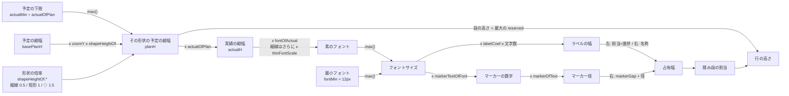
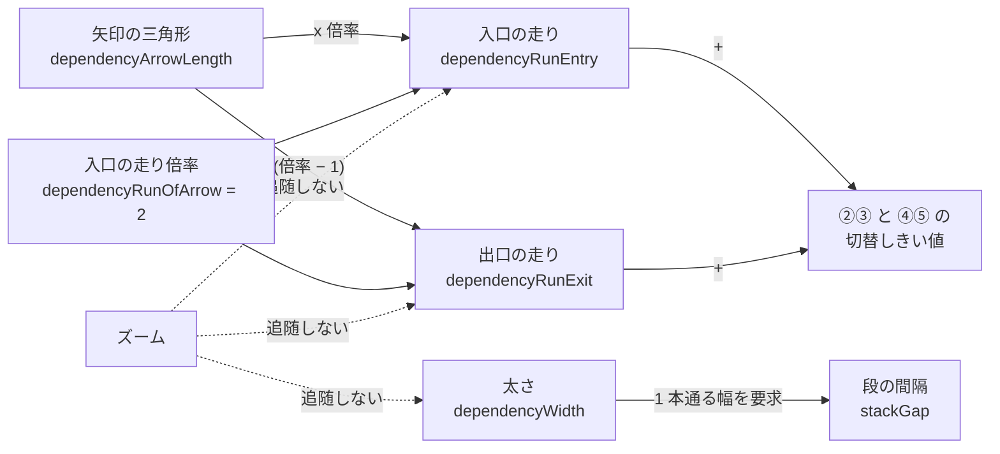
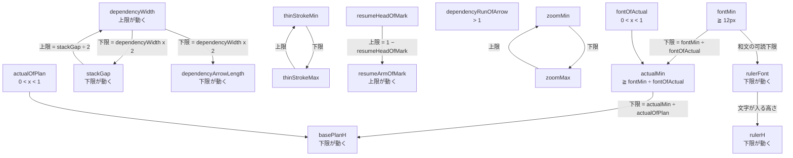

# UI 詳細仕様（画面構成・操作割当・予実の編集モデル）

- 日付: 2026-07-26
- 目的: `user-order.md` が「何が欲しいか」だけを書くため、**そこに書けない詳細**を引き受ける。
  レビューで指示された「画面構成・上部ボタンレイアウト・パレット構成・予実の編集モデル・操作割当」をここに置く。
- 位置づけ: **UI パーツ名の正は `handover-ui-parts-ja.md`**、データ構造の正は `../02-data-model/grs-native-erd-ja.md`。
  本書はその 2 つの上で**振る舞い**を決める。
- 出所の区別: 「**現行**」= 前プロジェクトの実装で実在したもの（コードで確認）。「**次期で決める**」= 未確定。

> **コピペ禁止**（`../README.md` §0-1）。本書は判断を渡すもので、実装を渡すものではない。

---

## 1. 画面構成の内訳（4 部 ＋ 浮遊 2）

```
App Shell
├─ App Header                   上部。文書名と全体操作
│   ├─ Branding                 製品名と著作権表示
│   ├─ Schedule Title           文書の名前。クリック / F2 で編集
│   ├─ Header Commands          下記 §2
│   └─ Autosave Status          localStorage 保存の成否表示
│
├─ Row Title Panel              左。TaskGroup の見出しを階層表示
│   ├─ Row Title Tree           TaskGroup 木。畳み・並べ替え・表示切替の操作点
│   └─ Panel Divider            幅を変えるドラッグ境界
│
├─ Schedule Canvas              中央。描画領域
│   ├─ Time Ruler               上端の年・月・日・曜の目盛り（縦スクロールで動かない）
│   ├─ Grid Lines
│   │   ├─ Date Grid Lines      日付の縦罫線（表示切替あり）
│   │   └─ Group Grid Lines     TaskGroup 境界の横罫線（表示切替あり）
│   ├─ Rows                     TaskGroup 1 つ分の横帯
│   │   └─ Task Bars            Task の描画（milestone は ◆、それ以外はスパン）
│   ├─ Dependency Lines         全自動配線・経路は保存しない
│   └─ Canvas Overlays          重ね描き層（スクリーン空間固定）
│       ├─ Progress Line        イナズマ線
│       ├─ Comment Boxes        引き出し線付きコメント
│       ├─ Highlight Boxes      角丸の囲み枠
│       ├─ Cursors              Today Line / Dual Cursor / Guide Cursor
│       └─ Watermark            斜めタイルの識別表示
│
├─ Properties Panel             右。属性編集
│
├─ Command Palette              浮遊。ドラッグで移動
│   └─ Palette Groups → Palette Commands
│
└─ Modals                       Help / AI Export / Hidden Group Tab
```

**なぜ Canvas Overlays を分けるか**: 角丸の R・透かし・ルーラー・カーソルは**ズームで大きさが変わってはいけない**。
world 空間ではなく**スクリーン空間の別レイヤ**に置くことで、倍率を打ち消す計算が不要になる
（`../04-performance/handover-performance-notes-ja.md` E-11）。

---

## 2. App Header のボタンレイアウト（Header Commands）

**現行**の並び（左→右）と役割:

| ボタン | 役割 |
|---|---|
| `Fit` | 全体が収まるようにズームとスクロールを合わせる |
| `Cmd` | Command Palette の表示/非表示 |
| `SS` | 画面のコピー（スクリーンショット相当） |
| `Load` / `Save` | ファイル読込 / 保存 |
| `Theme` | 明暗テーマの切替 |
| `Base` | 変更前の予定（ベースライン）を別ファイルとして読み込む/外す |
| `Undo` / `Redo` | 元に戻す / やり直す |
| `AI` | AI へ渡す JSON を表示するモーダル |
| `?` | Help モーダル |

**確定（2026-07-26）— 高さを増やさずにボタンを増やす方法**

```
1. 全ボタンをアイコン化する（テキストラベルをやめる）
     → 幅が半分以下になる。`SS` のような略語は項 6-6（言葉ではなくアイコンで伝える）に反する
2. 責務で置き場所を分ける
     App Header       … 文書に対する操作（Fit / Load / Save / Base / Undo / Redo / AI / ?）
     Command Palette  … 描画に対する操作（図形・注記・カーソル・グリッド・予実の表示切替）
3. ドロップダウンにまとめない
     1 クリック増えるのでぬるサク（最優先事項 1）に反する
```

**`[予定] [実績]` の 2 トグル（§4-4）は Command Palette 側**に置く（描画に対する操作だから）。※`[分離]` は廃止した。
App Header にも現在の状態が見えるとよいが、**同じ機能を 2 箇所に置くと DEF-013（重複コントロール）を再発させる**ので、
置くなら**表示のみ（操作不可）**にすること。

---

## 3. Command Palette の構成

**現行**の内訳:

| グループ | 中身 |
|---|---|
| 図形（タスク） | 矩形 `===` / 矢羽根 `>===>` / 矢印 `--->` / 端点スパン `*----*` ※両端が縦棒の細線は廃止 |
| 図形（マイルストーン） | 〇 △ ▽ □ ☆ 五角形 六角形 ※畳んで隠れており、展開して選ぶ。タスク形状（`shapeKind`）はタスクと同じ 1 列 |
| 選択中の図形 | いま「構え」ている図形の表示（Enter で配置） |
| 機能コマンド | `progress-line`（イナズマ線）/ `progress-marker`（進捗マーカーの表示切替）/ `comment` / `add-box`（角丸枠）/ `watermark` / `grid-date` / `grid-group` |
| カーソル | `guide-cursor-none` / `-crosshair` / `-single-vertical` / `-double-vertical`（**4 モード排他**） |

**アイコンは全て線画**（20×20 のデザイングリッドで作画し、太さを揃える）。CR-014 の判断。
`progress-line` は稲妻の絵文字ではなく**ジグザグの線画**である、といった具体は
前プロジェクトのアイコン定義が参考になる（形状の意図だけ引き継ぐ）。

**確定（2026-07-26）— グループ構成**

```
カーソル系は 1 グループに集約する（現行はトグルが分散していて探せない）
    [本日線]      独立トグル
    [デュアル]    独立トグル
    [ガイド]      4 モード排他（なし / 十字 / 縦1本 / 縦2本）

予実の表示切替も 1 グループに集約する
    [予定] [実績]             §4-4  ※[分離] は廃止
```

- パレットは浮遊するので、**選択していないときは薄く透明**（項 7）。ただし**文字は不透明を保つ**（コントラスト確保）。

---

## 4. 予実の編集モデル（ユーザー確定仕様）

> 🔴 **この節の正は `../07-plan-actual/handover-plan-actual-decisions-ja.md`。**
> 本節はその要約であり、食い違ったら向こうが勝つ。

### 4-0. 実績の入力規則（4 状態）

**データ側の正は `../07-plan-actual/handover-plan-actual-decisions-ja.md` §1。** ここは UI としての要件。

| 状態 | `actualStart` | `actualDuration` | `actualFinish` | `resume` | `resumeValid` |
|---|---|---|---|---|---|
| 未着手 | 空 | 空 | 空 | 空 | — |
| 進行中 | あり | あり | 空 | 空 | true |
| **中断・再開予定あり** | あり | あり | 空 | **日付** | true |
| **中断・再開日未定** | あり | あり | 空 | 空 | **false** |
| 完了 | あり | あり | **あり** | 空 | false |

**UI が守ること**

- **実績バーの両端は人が置いた日付。** 左端 = `actualStart`、右端 = `actualStart + actualDuration`（稼働日）。
- **完了にしても右端は 1 日も動かない。** `actualFinish` に右端の日付がそのまま入る。
- **`percentComplete`（完了率）は人が直接入力しない。** 日付から算出して格納する導出値である。
- **基準日を動かしても、バー・日付・完了率のどれも動かない。** 基準日で動くのはイナズマ線と遅れ判定だけ。
- 「中止」（もう再開しない）は**中断・再開日未定と同じもの**。専用の概念を作らない。
- 上の 4 状態から外れる入力を**そもそもできないようにする**（矛盾を作らせない）。

**運用（週次更新）**

```
着手時   ダミーの実績線を掴む     → actualStart が入る
以後     実績バーの右端をドラッグ → actualDuration が変わる（完了率は自動で追随）
完了時   進捗マーカーをクリック   → actualFinish に右端の日付が入る
```

**日常的に触るのは実績バーの右端 1 つだけ。**

### 4-1. 掴み領域と掴み点

**用語を 2 つに分ける。**

```
掴み領域（hit region）  ポインタが当たったときに操作が始まる範囲
掴み点（handle）        そのうち、ドラッグの起点になる小さな領域
```

**ジェスチャは 4 種**

| ジェスチャ | 何をするか |
|---|---|
| **平行移動** | 掴んだ対象を丸ごとずらす |
| **リサイズ** | 端を掴んで日付または期間を変える |
| **ラベル移動** | 名称ラベルだけをずらす |
| **アンカー移動** | コメントの引出し先をずらす |

#### 対象別の掴み領域

**予定バー**

| 掴み領域 | 場所 | 操作 |
|---|---|---|
| **開始点** | バー左端 | `start` を変える |
| **終了点** | バー右端 | `finish` を変える |
| **フェードイン** | バー**左上の角** | `fadeInDays`（**矩形と矢羽根のみ**） |
| **フェードアウト** | バー**右下の角** | `fadeOutDays`（**矩形と矢羽根のみ**） |
| **バー本体** | 端点を除いた中間 | 平行移動（長さを保つ） |

**実績バー**

| 掴み領域 | 場所 | 操作 |
|---|---|---|
| **開始点** | バー左端 | `actualStart` を変える |
| **終了点** | バー右端 | **`actualDuration`** を変える（置いた日付から稼働日数を算出） |

**マイルストーン**

| 掴み領域 | 操作 |
|---|---|
| **マイルストーン点**（点そのもの） | 平行移動のみ |

> **マイルストーンは開始点・終了点・フェード掴み点を持たない。** 点であって幅がないため。

**Resume アイコン**

| 掴み領域 | 操作 |
|---|---|
| **L 字の折れ矢印** | `resume` を変える。**中断のときだけ出る** |

**ラベル**

| 掴み領域 | 場所 | 操作 |
|---|---|---|
| **名称ラベル** | ラベル本体 | ラベルだけを平行移動（編集も可） |
| **担当ラベル** | ラベル本体 | 編集のみ（**サイズ変更しない**ので中心 1 点で足りる） |

**注記**

| 掴み領域 | 場所 | 操作 |
|---|---|---|
| **枠本体** | 角丸囲みの内部 | 平行移動 |
| **枠の角** | 角丸囲みの **4 隅** | リサイズ（範囲を変える） |
| **コメント本体** | 吹き出しの本体 | 平行移動（吹き出しのズレを変える） |
| **引出しアンカー** | 引出し線の先端 | **指す先を変える**（アンカー移動） |

**依存線**

| 掴み領域 | 内容 |
|---|---|
| **依存アンカー** | 引出し口。外接矩形の **9 点**（0 = 左上 〜 8 = 右下）。⚠️ これはアンカーの**表現力**であって経路の規則ではない。**FS の自動配線が使うのは右辺中央と左辺中央の 2 点だけ**（§4-9） |
| **折れ点** | 経路の折れ曲がり点。**表示のみ。人は動かさない**（経路は全自動・`user-order.md` 項 48） |

#### 掴み代は見た目より大きくとる

```
予定の端点      予定バーの上下に 6px ずつはみ出させる
実績の端点      実績バーの帯だけ（予定より狭い）
フェード        15 x 15px の角
ダミーの実績線  見た目 11px に対し 30 x 20px の当たり判定
```

**予定バーの高さ > 実績バーの高さ**なので、**上下の縁を狙えば予定、真ん中を狙えば実績**が掴める。
モードで切り替える必要がない。

> **ダミーの実績線の掴み代が小さすぎると着手できない。** モックで実際に起きた不具合である
> （11 x 10px では的が小さく、クリックできているのに気づけない）。

#### 掴みの優先順位（重なったときの解決）

```
端点 > 名称ラベル > バー本体
```

**理由**: 端点は範囲が小さいので、大きい領域に負けると永久に掴めない。**小さいものを優先する**のが原則。

### 4-2. 担当・完了率・タスク名のラベル

**書式**: `{担当} : {完了率 %} [タスク名]`

**配置**:

```
        田中 : 40% |███████ 詳細設計 ███████|
        └──────────┘└─ タスク名は下記の規則で配置
         予定タスクの左端を基準に
         外側左へ右揃えで連結
```

- **担当と完了率は「予定タスクの左端」を基準に、バーの外側左へ右揃えで連結**する。
- **依存線 / 担当 / 完了率 の 3 つは、それぞれ独立に表示/非表示を切り替えられること**（**確定 2026-07-30**）。
  1 つのトグルでまとめない。3 つ別々のトグルにする。
  **同じ高さに並ぶタスクに依存線と担当/完了率の両方を出すと、依存線が複雑になりすぎる。**
  実務では「依存線を見る」ときと「担当と進捗を見る」ときが別なので、**片方を消せることが要件**である。
  この独立性から、**依存線の経路は担当/完了率のラベルを避けない**（§4-9）。
- **フォントサイズはタスク高の 80%。ただし下限 12px でクランプする。**（和文がこれを割ると読めない。基準は 1920x1080 / 全画面 / 拡大率 100%）
  **下限を割る文字が必要になったら、文字を縮めるのではなく描画する Outline のレベルを 1 つ減らす**（`../07-plan-actual/handover-plan-actual-decisions-ja.md` §2-4-1）

#### 名称ラベルの配置（確定）

**考え方**: **ラベルを表示しても形状が見える / 触れること。**

```
1. タスクの幅に収まる            → 中に書く
2. 収まらない                    → まず 全角12 / 半角24 で打ち切る
3. 打ち切っても収まらない        → 右に出す
4. 右に出すと他と干渉する        → タスクを上下にずらす（積み順は必要なだけ広げる）
```

- 打ち切ったときは**ツールチップで全文**を出す。
- **データは切らない。** `Task.name` は元の長さのまま保持する（切ると往復無損失＝項 56 が壊れる）。
- 略称を廃止したため `name` がそのまま描かれる。**この規則が無いとラベルが破綻する**（`user-order.md` 項 17）。

#### ラベル幅は概算する。キャッシュしない

```
ラベル幅 ≒ (全角の数 x 2 + 半角の数 x 1) x フォントサイズ x 係数
```

- **テキストの実測をしない。** ブラウザのテキスト計測は重く、1000 アイテムで毎フレーム呼ぶと 60fps が出ない。
- **キャッシュを持たない。** 掛け算 1 回なので毎フレーム計算しても安く、古い値が残る事故を原理的に起こさない。

> ⚠️ **必ず占有幅に含めること。** 担当＋完了率をバーの**外側左**に出すと、**左隣のタスクと重なる**。
> **進捗マーカーも同じ扱い**にする（右端の外側に出るため、右隣と重なる）。

### 4-3. 重ね表示の重ね順

**背面 → 前面: 予定 → 実績 → 進捗マーカー → 名称ラベル。**

前プロジェクトでは実績バーが名称ラベルを覆う不具合が実際に起きた（DEF-009）。
**テキストは必ず最前面**になる構造にすること（ラベル専用の層を作り、バーはその手前に挿入しない）。

### 4-4. 予実が重なって編集できない場合 — 高さの差で解く

**`[分離]` トグルは廃止した**（`user-order.md` 項 52 は欠番）。

**予定バーの高さを実績バーより大きく描き、上下に露出した帯で予定を掴む。**
モードで切り替える必要がない。

**実績は予定と同じ形状で描く**（2026-07-30 追加。予定が矢羽根なら実績も矢羽根。実績だけ四角にしない）。

**例外**: 幅がないタスク形状（**矢印 / 端点スパン / マイルストーン**）は内側に収められないので、
**そのタスク形状だけ実績を下にずらす**（局所的な分離）。文書全体のモードではなく、タスク形状ごとの描き方である。

- **幅がないタスク形状でも実績ぶんの高さを常に確保する**（表示を切り替えても行の高さが動かない）。
- 掴めない端点は**薄く描き、理由をツールチップで示す**。無反応だと故障に見える。

#### 表示の切り替え — **2 トグル**（確定）

| ボタン | 種別 | 効果 |
|---|---|---|
| **`[予定]`** | トグル | 予定側のバーを出す / 出さない |
| **`[実績]`** | トグル | 実績側のバーを出す / 出さない |

```
[予定] [実績]  の 4 通り
  ON   ON   → 両方表示
  ON   OFF  → 予定のみ
  OFF  ON   → 実績のみ
  OFF  OFF  → 作らせない（下記）
```

**規則**

- **両方 OFF は作らせない。** 最後に残った 1 つを OFF にしようとしたら、**他方を自動で ON にする**。
- **状態は色だけで示してはならない**（WCAG 1.4.1）。**押下状態 ＋ アイコン形状**の二重符号にする。
  - `[予定]` のアイコン = 破線 1 本 / `[実績]` = 実線 1 本

**なぜ循環ボタンにしないか**: 循環だと「今どの状態か」と「次に何になるか」の両方を覚える必要がある。
独立トグルなら**押下状態を見れば現在が分かる**。項 6-5（アフォーダンスにこだわる）に沿う。

### 4-5. Progress Marker（進捗マーカー）と Resume アイコン

実績バーの右端の**外側**に、**固定ピクセルサイズ**で描く。

| 状態 | 記号 | 表示条件 |
|---|---|---|
| 完了 | **`(✓)`** | 常時 |
| 中断 | **`( \ )`** | 常時。斜線は**左上から右下** |
| 期限超過 | **`(!)`** | 常時。未完了かつ 基準日 > `finish` |
| 未完了 | **`( )`** | **選択したときだけ薄く**表示 |

- **クリックで 3 状態を巡る**: 未完了 → 完了 → 中断 → 未完了。
- **記号は SVG で描く**（フォントの字形に依存しない）。
- **全体を非表示にするトグル**を用意する。
- **不透明な下地を持つ**。予定バーに重なっても読める。**形が意味を担う**（WCAG 1.4.11 / 項 25）。
- 実績バーの右端から**固定 4px** 離す。端点の掴み代と重ならない最小距離であり、それ以上離さない。
- **占有幅に含める**（§4-2 の注意と同じ）。

**Resume アイコン**は**中断のときだけ**、進捗マーカーの右に出る。

- 形は **L 字の折れ矢印（角の丸い）**。下へ降りて右へ曲がり、矢じりが付く。
- `resume` が空のときは**薄い〇**として出る。クリックすると日付が入る。
- 日付が入ったら `resume` の位置へ移り、**実績バーの右端から破線で繋がる**。以後はドラッグで動かせる。

### 4-6. 進捗の編集入口

| 入口 | 採否 |
|---|---|
| **実績バーの右端をドラッグ**（1 日刻み） | **採用** |
| **進捗マーカーのクリック**（3 状態を巡る） | **採用** |
| **Resume アイコンのクリック / ドラッグ** | **採用** |
| Properties Panel での日付入力 | 採用（従来どおり） |
| 右クリックのクイック設定 | **不採用** |
| キーボードでの進捗増減 | **不採用** |

> **WCAG 2.1 の 2.1.1（キーボード操作可能）** はドラッグ操作にキーボード等価物を要求する。
> **Properties Panel で日付を入力できればこれを満たす**（ドラッグは代替手段であって唯一の手段ではない）。
> Properties Panel がキーボードで到達・編集できることを実装時に確認すること。

### 4-7. レイアウトの計算順序

依存線・ラベル・積み順は互いに影響するので、**循環を切る順序**を定める。

```
1. 依存関係から「最小間隔の制約」を作る    経路は引かない
2. ラベルの占有幅を概算する                §4-2
3. 積み順の割当                            1 と 2 を占有幅の入力にする → 位置が確定
4. 依存線の経路を引く                      位置が確定済みなので 1 回で決まる（§4-9）
```

**「依存線が必要とする余地」と「依存線の経路そのもの」を分ける**のが要点。
**依存線とラベルの干渉は計算しない**（やりすぎでバグの元）。重なることは許容する。

### 4-8. PoC を先に回す

**上記の UI は実装前に PoC を回し、ユーザーと認識合わせを行う。**
PoC 項目の全数は `../07-plan-actual/handover-plan-actual-decisions-ja.md` §13。

---

### 4-9. 依存線の経路 — 5 パターンと 1 本の規則（**確定 2026-07-30**）

**この節が依存線の経路の正である。** 他の文書は経路の幾何を書かず、ここを参照すること。

#### アンカーは 2 点だけ

```
出口 = 先行タスクの 右辺の中央
入口 = 後続タスクの 左辺の中央
```

`Finish-to-Start`（MSPDI `PredecessorLink/Type` = 1）ではこの 2 点しか使わない。
掴み領域の定義（§3）にある「依存アンカー＝外接矩形の 9 点」は**アンカーの表現力**の話であって、
FS の自動配線が実際に使うのは上の 2 点である。

#### 走りの長さ — 出口は入口より三角形ぶん短い（**確定 2026-07-31**）

```
矢印の三角形の長さ を 1 とするとき

  入口の走り = 2 = 三角形 1 ＋ 直線 1
  出口の走り = 1 = 入口の走り − 三角形 1
```

**入口には矢印があるので、三角形の先に直線が残る長さが要る。**
入口の走りが三角形より短いと、垂直線の先端に三角形が直接乗る形になり矢印に見えない。
**出口には矢印が無いので、三角形ぶんの長さが要らない。**

出口と入口を**別々の定数にしてはならない**。別々だと必ず食い違う。**倍率 1 つから両方を導く**。

```
dependencyArrowLength      矢印の三角形の長さ                    既定 10px
dependencyRunOfArrow    入口の走り ÷ 三角形                   既定 2

入口の走り = dependencyArrowLength x dependencyRunOfArrow           = 20px
出口の走り = dependencyArrowLength x (dependencyRunOfArrow − 1)     = 10px
```

制約 `dependencyRunOfArrow > 1`（§4-10-2）が**両方を同時に担保する**。
1 を超えていれば入口に直線が残り、同時に出口の走りが正になる。

#### 5 パターン

`x1 = 先行の右端 + 出口の走り` / `x2 = 後続の左端 − 入口の走り` と置くと、分岐は 1 つで足りる。

```
x2 ≧ x1 → 中点で折る（同じ段なら折らない）    ① ② ③
x2 <  x1 → 右へ出て段間の通路を左へ戻る        ④ ⑤
```

| # | PoC の名前 | 状況 | 折れ点 | 経路 |
|:--:|---|---|:--:|---|
| **①** | `FS-1` | 同じ段・間隔あり | **0** | 右辺 → 左辺（水平 1 本） |
| **②** | `FS-2` | 下の段・間隔あり | **2** | 右辺 → 中点 → 下降 → 左辺 |
| **③** | `FS-3` | 上の段・間隔あり | **2** | 右辺 → 中点 → 上昇 → 左辺 |
| **④** | `FS-4` | 下の段・**日程が重なる** | **4** | 右辺 → 右へ走り → 通路へ下降 → **左へ戻る** → 下降 → 左辺 |
| **⑤** | `FS-5` | 上の段・**日程が重なる** | **4** | 右辺 → 右へ走り → 通路へ上昇 → **左へ戻る** → 上昇 → 左辺 |

`FS-n` は PoC の標本データに付けた名前である（`../08-poc/poc-multibar-patterns.html` の `P00`）。
**丸囲み数字は画面に出さない**（要求されていない記号なので、仕様の番号と混同されないようにする）。

**日程がぴったり接している場合、および走りが確保できない場合は ④ / ⑤ になる**
（`x2 < x1` がそのままこの条件になる）。**②③ の中点は `[x1, x2]` でクランプする** —
間隔が狭いときに中点が後続へ寄りすぎると、入口の走りが確保できなくなるため。

**しきい値は「出口の走り ＋ 入口の走り」である**。既定値では **30px**（10 ＋ 20）。
先行の右端と後続の左端の間隔がこれを下回ると ④ / ⑤ に落ちる。
※出口を半分にする前は 40px（20 ＋ 20）だった。**この変更でしきい値が 10px 縮み、
②③ に収まる場面が増える**（同じデータでも一部の依存線が 4 折れから 2 折れに変わる）。

#### 段間の通路

④ ⑤ の水平部分が通る高さ。

```
通路の y = 先行のバーの端 と 後続のバーの端 の 中点
```

下へ向かうときは「先行の下端と後続の上端の中点」、上へ向かうときは「後続の下端と先行の上端の中点」。
同じ段どうしを結ぶときは、その段の下端 ＋ 段の間隔の半分。

#### 折れ点の上限は **0〜4**。「0〜3」と書いてはならない

前進（後続が右）は 0〜2 で収まるが、**日程が重なる ④ ⑤ は幾何学的に 4 折れが必要**である。
前プロジェクトも同じ結論に達している（DEF-005 / CR-008、
`../04-performance/handover-performance-notes-ja.md` §4-1 の 4）。
**「0〜3」と書くと必ず破れる。**

#### 太さと走りは**固定の定数**。ズームにもフォントにも追随しない

**確定 2026-07-30。** 依存線は担当/完了率と同時に出さない（§4-2）ので、
**ラベルの寸法系（予定の縦幅 → 実績の縦幅 → フォントサイズ）とは依存関係を持たない**。
したがって次の 2 つは**画面の絶対値で固定してよい**。

| 量 | 扱い |
|---|---|
| 依存線の**太さ** | 固定の定数 |
| 矢印の三角形の長さ | 固定の定数 |
| 入口の走り（＝三角形 × 倍率） / 出口の走り（＝三角形 ×（倍率 − 1）） | 固定の定数から導く |

**追随させてはならない。** ズームで太さが変わると、低ズームで線が潰れるか、
高ズームで線が帯になる。走りを追随させると、②③ と ④⑤ の切替しきい値がズームで動き、
**同じデータなのに経路の形が変わる**。固定なら経路の形はズームに対して安定する。

⚠️ ただし**日単位の x 座標はズームに追随する**ので、`x2 < x1` の判定結果は変わる。
変わるのは「どのパターンになるか」であって、**選ばれたパターンの形は不変**である。

#### 経路探索をしない

上の規則は**分岐 2 つの直接計算**で、候補列挙も採点も探索も要らない。
前プロジェクトは候補列挙＋辞書式採点だったが、5 パターンに整理した結果それも不要になった。
**経路は保存しない**（`user-order.md` 48）。毎回算出する。

#### まだ決めていないこと

以下は本規則の対象外で、決めるまで実装しない。

| 論点 | 状況 |
|---|---|
| 同じ段で後続が先行より**前に**始まる（完全な逆行） | 未定。現在は ④ ⑤ に落ちる |
| 段が **2 つ以上離れている** | 未定。通路を通る垂直線が途中の段のタスクを貫く |
| **行をまたぐ** | 未解決。縦の通り道の予約が要る（`../04-performance/handover-performance-notes-ja.md` §4-1 と PoC 案 C の結論） |
| **マイルストーン**が先行 / 後続（幅 0 で右端＝左端） | 未定 |
| **FS 以外**（`Type` 0=FF / 2=SF / 3=SS） | 未定。アンカーが右辺・左辺でなくなる |
| ~~走りの確保をラベル・マーカーを含めて測るか~~ | **決着（2026-07-30）**: 測らない。依存線と担当/完了率は同時に出さないため（§4-2） |

#### 検証

`../08-poc/poc-multibar-patterns.html` の `P00 依存線の 5 パターン` が 5 例を 1 枚で描く。
実測は `../08-poc/POC-RESULTS-ja.md` の「依存線の経路」節。

---


### 4-10. 寸法と判定の依存関係（**確定 2026-07-30**）

**何が何から決まるかを 1 枚にする。** これを外れた実装は、どこかで二重管理になっている。

```
 ── 縦の寸法（1 本の鎖。上流を変えれば下流が全部動く）────────────────

    予定の縦幅  ──▶  実績の縦幅  ──▶  フォントサイズ

    最小フォントサイズ  ──▶  予定の縦幅の下限
        下限を割る縦幅が必要になったら、文字を縮めるのではなく
        描画する Outline のレベルを 1 つ減らす（§4-2 / 07 §2-4-1）

 ── 配置の判定 ────────────────────────────────────────────

    タスク時間の重複の有無  ──▶  タスクを上下に分ける判定（積み段）

    タスク名の長さ          ──▶  タスク名を書く場所の判定
                                 （中 → 打ち切って中 → 右出し → 段を落とす）

 ── 独立（依存関係を持たない）──────────────────────────────

    担当 / 完了率   ──╳──   依存線

        同じ高さに並ぶタスクに両方を出すと依存線が複雑になりすぎるので、
        両方を同時に出すことを前提にしない。3 つは個別に表示切替する（§4-2）。
        ゆえに依存線の太さと走りは固定の定数でよい（§4-9）。
```

**読み方**: `A ──▶ B` は「**A が B を決める**」。`A ──╳── B` は「**依存関係が無い**」。

#### 4-10-1. 値の依存関係 — 何から何が計算されるか

**根は 4 つだけ**（`basePlanH` / `actualMin` / `fontMin` / `pxPerDayAt1x`）。残りは全部そこから落ちてくる。



**依存線はこの図に入らない。** 担当/進捗と同時に出さないので、
太さも走りも上のどれとも繋がらない（§4-9）。だから固定の定数でよい。



#### 4-10-2. 範囲の依存関係 — ある値の上下限が別の値で動く

**設定できる範囲は固定ではない。** 下の矢印は「**この値が動くと、あの値の上下限が動く**」を表す。



**相互に縛り合う対が 3 組ある**（`dependencyWidth` ↔ `stackGap` / `thinStrokeMin` ↔ `thinStrokeMax` /
`zoomMin` ↔ `zoomMax`）。片方を動かすともう片方の範囲が動くので、
**UI では両方の範囲を毎回引き直すこと**。片方だけ検証する実装は必ず矛盾した組を通す。

| 制約 | 式 | 破ると何が起きるか |
|---|---|---|
| 実績 < 予定 | `actualOfPlan < 1` | 実績が予定からはみ出す |
| フォント < 実績 | `fontOfActual < 1` | 文字がバーより高くなる |
| 実績の下限に文字が収まる | `actualMin ≧ fontMin ÷ fontOfActual` | 実績が下限まで縮んだとき文字が下限を割る |
| 縦に縮める余地がある | `basePlanH > actualMin ÷ actualOfPlan` | 等倍が既に下限。縦ズームを縮めても何も起きなくなる |

#### 4-10-3. 縦の下限は **1 か所だけに置く** — 確定 2026-07-31

```
予定の下限   = actualMin ÷ actualOfPlan        実績がちょうど下限に届く予定の高さ
予定の縦幅   = max( 予定の下限, basePlanH x zoomY )
実績の縦幅   = 予定の縦幅 x actualOfPlan        ← クランプを掛けない
```

**クランプは予定側の 1 か所だけに置く。** 実績は比率だけで追随し、予定に下限がある以上
`actualMin`（§2-4-1 の 16px）を必ず上回る。

**予定と実績の両方をクランプしてはならない。** 両方に `max()` を掛けると、下限に当たった側だけが
止まって**比率が仕様から外れる**。前プロジェクトの PoC が実際にこれで割れており、
基準ページは 22 : 16（比 0.73）、他のページは 28 : 15.4（比 0.55）を描いていた。
同じ「実績 ÷ 予定」という 1 つの設定値から、2 つの違う絵が出ていたことになる。

**下限に当たったらどうするかは §2-4-1 のとおり** — さらに縮めるのではなく、
描画する Outline のレベルを 1 つ減らす。下限は**引き金**であって、そこで固まる値ではない。
| 入口の走りが三角形より長い | `dependencyRunOfArrow > 1` | **1 以下**: 垂直線の先端に三角形が直接乗り、矢印に見えない。同時に**出口の走りが 0 以下**になり、先行の右辺から線が出ない |
| 依存線が段の間を通る | `stackGap ≧ dependencyWidth × 2` | 線が上下のバーに接する |
| 細線が矩形より薄い | `shapeHeightOf.arrow < 1` | 「縦に薄い」という取り柄が消える |
| ◇ が矩形より大きい | `shapeHeightOf.milestone > 1` | 目立たなくなる |
| 矢羽根の先端が反転しない | `chevronNotchOfW ≦ 0.5` | 切り欠きが交差して形が壊れる |
| 3 桁がマーカーに収まる | `markerOfText ≧ 1.6` | 数字が円からはみ出す |

**実際に触れる**: `../08-poc/poc-schedule-zoom.html` の「設定…」ボタン。
**59 個すべて**を個別に変えられ、**範囲は他の設定に追随して引き直される**。
値は全 PoC が共有する `../08-poc/poc-ui.js` の 1 か所にあり、ここで変えると全ページが追随する。
範囲外の値も入力できる（何が壊れるかを見るため）が、赤で示す。


| 決まる側 | 決める側 | 効いてくる場所 |
|---|---|---|
| 実績の縦幅 | 予定の縦幅 | §4-4 の比率。**フォント < 実績 < 予定** の順序を崩さないこと |
| フォントサイズ | 実績の縦幅 | 同上 |
| 予定の縦幅の下限 | 最小フォントサイズ | 下限を割ったらレベルを 1 つ減らす |
| 積み段の割当 | タスク時間の重複 | §4-7 の計算順序 3 |
| タスク名の位置 | タスク名の長さ | §4-2 の 4 段階 |
| **なし** | **依存線 ↔ 担当/完了率** | 依存線の寸法を固定定数にできる根拠（§4-9） |

---

## 5. 操作割当（キーボード / マウス）

**現行**の Help モーダルに載っていたもの（実在するものだけ。架空のショートカットは無い）。

### 5-1. 編集

| 操作 | 割当 |
|---|---|
| 構えている図形をキャレット位置に配置 | `Enter` |
| すべてのアイテムを選択 | `Ctrl+A` |
| 選択（アイテム / 依存線 / 注釈）を削除 | `Delete` / `Backspace` |
| コピー | `Ctrl+C` |
| 貼り付け | `Ctrl+V` |
| 元に戻す | `Ctrl+Z` |
| やり直す | `Ctrl+Y` / `Ctrl+Shift+Z` |
| 操作の取り消し / パネル・ダイアログを閉じる | `Esc` |
| 文書名の編集 | `F2`（または Schedule Title をクリック） |

### 5-2. 表示（ズーム・スクロール・パン）

| 操作 | 割当 |
|---|---|
| 縦スクロール | **ホイール（修飾なし）** |
| 横スクロール | `Ctrl+Shift` ＋ ホイール |
| **両軸ズーム**（ポインタ中心） | `Ctrl`（Cmd）＋ ホイール |
| 時間軸（横）のみズーム | `Shift` ＋ ホイール |
| 行軸（縦）のみズーム | `Alt` ＋ ホイール |
| パン | `Ctrl` ＋ ドラッグ、または**中ボタンドラッグ** |
| 全体を収める | `Fit` ボタン / `F` |

**ポインタを使わないズーム（確定 2026-07-30）** — ホイールの修飾キーと同じ体系にする。

| 操作 | 割当 |
|---|---|
| 両軸ズーム | `Ctrl` ＋ `+` / `-` |
| 時間軸（横）のみズーム | `Shift` ＋ `+` / `-` |
| 行軸（縦）のみズーム | `Alt` ＋ `+` / `-` |
| 等倍に戻す | `Ctrl+0` |

**修飾キーの意味をホイールと揃える**（`Ctrl`=両軸 / `Shift`=横 / `Alt`=縦）。
別体系にすると覚えられない。1 打鍵あたりの倍率とクランプはホイールと同じ（×1.1 / 0.02〜64 倍）。

> **ズームにスライダーを置かない。** ホイールとキーだけで操作する。
> スライダーはキャンバスから離れた場所に置くことになり、**見ている場所を見ながら拡縮できない**。

> **素の左ドラッグでパンしてはならない。** ドラッグ中に日程表が滑って逃げる。
> **素のホイールはスクロール**（`user-order.md` 項 37 の根拠）。前プロジェクトで
> 「素のホイール＝ズームは違和感がある」と判断して変更した結果である。
> ズーム倍率は 1 ノッチあたり **×1.1**、範囲は **0.02〜64 倍**でクランプ（現行値）。

### 5-3. キーボード操作（ポインタなし）

| 操作 | 割当 |
|---|---|
| アイテム間でフォーカス移動 | `Tab` |
| フォーカス中のアイテムを 1 日 / 1 行ずらす | 矢印キー |
| フォーカス中のタスクをリサイズ | `Shift` ＋ `←` / `→` |

### 5-4. Row Title Tree

| 操作 | 割当 |
|---|---|
| ノードの部分木をコピー / 貼り付け | `Ctrl+C` / `Ctrl+V` |
| ノードを削除（確認ダイアログ） | ダイアログ内で `D`=実行 / `C`=取消 |
| 畳み / 展開 | **全展開 / 全畳み / 子を全展開 / 子を全畳み / 自分を畳む**（エディタのツリーと同じ体系。`user-order.md` 項 28） |

**畳み / 展開の割当（確定 2026-07-26）**

| 操作 | 割当 |
|---|---|
| 自分を畳む / 展開 | `←` / `→` |
| 子を全部畳む / 全部展開 | `Shift` ＋ `←` / `→` |
| 全部畳む / 全部展開 | `Ctrl+Shift` ＋ `←` / `→` |

**フォーカスがある場所で意味を切り替える。** 矢印キーは Schedule Canvas ではアイテムの移動に使う（§5-3）ので、
**Row Title Tree にフォーカスがあるときだけ**上記のツリー操作になる。エディタのツリーと同じ慣習であり、
フォーカスによる切り分けは標準的な解。

---

## 6. 自動レイアウトの規則

### 6-1. 1 行の中の縦積み（`stackOrder` の自動割当）

**別の実装者が読んで同じ結果を出せるように書く。**

**入力**: ある `TaskGroup` に載る `Task` の集合、各 `Task` の予定期間（および実績期間）、ラベルの張り出し幅。
**出力**: 各 `Task` の段番号（`stackOrder`）と、その行の帯高。

1. **占有区間を求める。** 各 `Task` の描画上の左端〜右端。**はみ出すラベルの幅を右または左に加算する**
   （§4-2。加算しないと重なる）。
2. **並べる順序を決める**（決定的でなければならない）:
   **`milestone` を優先 → `start` 昇順 → `finish` 降順 → `uid` 昇順**。
   ※順序が非決定的だと**再描画のたびに段が入れ替わる**。
3. **段を割り当てる。** 各 `Task` を順に見て、**その段に既に置かれた `Task` と占有区間が重ならない、最も浅い段**へ置く（貪欲割当）。
4. **`stackOrder` が指定されていれば、それを優先**する（`null` = 自動）。
5. **マイルストーンは最上段**に来る（下のタスク群から上のマイルストーンへ依存線が立ち上る構図）。
6. **積む向き**（上/下）は**文書全体**の設定。既定は上。
7. **積み順（`stackOrder`）に機能上の上限は設けない。** 必要なだけ広げる。
   暴走を止める**安全弁**として十分に大きい上限だけを持ち、**到達したら人に知らせる**（黙って捨てない）。
   ※ 2026-07-26 版の「上限を超えた `Task` は**最終段を再利用**する」は**廃止した**。
   重なりを許して同じ段に押し込む挙動であり、マルチバー（本ツール最大の差別化）を壊す。
   根拠は `../07-plan-actual/handover-plan-actual-decisions-ja.md` §6-3、`user-order.md` 項 30-7。
8. **行の帯高は段数で決まる。** 段が増えた行は**下の行を押し下げる**。**行高固定を前提にしてはならない。**

### 6-1-1. Row Title Tree の操作が何を動かすか（**確定**）

**片方向の非対称であることに注意。**「両軸は独立」を双方向と読んではならない。

| 操作 | WBS（軸A） | 器（軸B） | MSPDI へ伝播 |
|---|---|---|---|
| **バーを別の行へドラッグ**（マルチバー化） | 変わらない | member が変わる | ✗ 視覚のみ |
| **Row Title Tree で階層を移動**（インデント / アウトデント / 親を変える / 兄弟並べ替え） | **変わる** | **追随して動く** | **○ 伝播する** |

- ツリー上の階層移動は**元データの階層を動かす**。`OutlineLevel` と親が変わり、export で外部マスタに反映される。
- **`UID` は保持する。** 相手ツールは UID 照合で「同じタスクが親を変えた」と解釈し再親付けするので、新規タスクにならない。
- **器は追随するが作り直さない。** 更新するのは親だけで、名前・色・高さ・畳み状態・`stackOrder` は保つ
  （作り直すとユーザーの視覚情報が WBS 操作で消える）。
- **ユーザーが手で作った器は追随しない**（WBS に対応がない）。ツリー上で動かしても視覚のみ。
- **インデントで 6 段目になる操作はできないようにする**（≤5 段）。

> ⚠️ **上限は「人が作るとき」だけに掛かる — 確定 2026-07-30**
>
> | 場面 | 上限 |
> |---|---|
> | **人がインデントで作る** | **5 段で止める**。器（`TaskGroup`）の入れ子 ≤Lv5 が追随できなくなるため |
> | **import で受ける** | **上限なし**。7 段来れば 7 段で保持する |
> | **export で返す** | **クランプしない**。持っている深さをそのまま返す |
>
> **非対称であることを承知の上で採る。** 外部マスタの階層を勝手に浅くして返すのは、
> GRS が負っている「WBS を壊さずに返す責任」に正面から反するので、export でのクランプはしない。
> 深さを 5 で頭打ちにするのは **LOD の判定のときだけ**である
> （`../07-plan-actual/handover-plan-actual-decisions-ja.md` §5-2 / §5-3）。

> 既定行の生成規則と既定表示名は `../02-data-model/grs-data-model-ja.md` §7.1-1 が正。

### 6-1-2. 色の既定 — **確定 2026-07-30**

**正は `../07-plan-actual/handover-plan-actual-decisions-ja.md` §2-6。** ここは描画側の要件だけ書く。

```
予定と実績は 同一の色相
予定  中彩度・やや薄い
実績  高彩度・濃い（原色は使わない）

依存線  橙で固定。ライト／ダークのどちらでも判別できる彩度・明度にする
```

- **青い予定に緑の実績、のような色相違いは禁止する。**
- **依存線の色はユーザーに選ばせない**（橙で固定）。予定・実績と色相が衝突しないための固定である。
- 重なる相手とのコントラストは **3:1 以上**（WCAG 1.4.11）。特に**実績 ÷ 予定**。
  ダークモードは明度を反転するだけでは足りない。**予定をより暗く、実績をより明るく**する。
- **色は形と位置の冗長符号**であって、色だけに意味を持たせない（WCAG 1.4.1 / `user-order.md` 項 25）。

実測した値は `../07-plan-actual/handover-plan-actual-decisions-ja.md` §2-6 の表にある。

### 6-1-3. 文字の色と縁取り — **確定 2026-07-31**

**正は `../07-plan-actual/handover-plan-actual-decisions-ja.md` §2-7。** ここは描画側の要件だけ書く。

```
文字色      テーマの前景色 1 つ（ライト = 黒 / ダーク = 白）
縁取り      バーの上に載る文字に、背景色の縁を付ける
            太さ = フォントサイズ x 0.17、描き順は 縁 → 文字
```

- **文字色をバーの色ごとに切り替えない。** 名称ラベルは**予定バーと実績バーの両方にまたがる**ので、
  どちらに合わせても他方で落ちる。
- **縁取りは描画要素を増やさない。** 同じ文字要素の属性だけで済むので、下地の矩形を敷く案より軽く、
  **バーの形が文字の隙間から見える**（§4-2 の「ラベルを表示しても形状が見える」を壊さない）。
- **バーの外に出る文字（担当 / 完了率 / 右出しの名称）にも同じ色を使う。** 背景の上なので縁取りは要らないが、
  **色は同じ 1 つ**にする。
- 縁の太さは `documentSettings` に持つ（§4-10 の一覧。PoC では `labelHaloOfFont`）。**0 にすれば縁取りは消える。**

> **なぜ色を選び直す道を採らなかったか**: 文字色を固定したまま §2-6 の色を使うと
> 既定色相の青ですら **文字 ÷ 実績 = 2.58:1**（要 4.5:1）で落ちる。
> 色を選び直せば成立はするが、**10 色相すべてで解が制約の角に張り付き**（実績÷予定 = 3.00:1、
> 文字÷実績 = 4.50:1）、あとから明度を 1 ポイント動かすと必ず破れる。
> **`fillColor` は人が選べる**（`user-order.md` 項 12）ので、そもそも固定色では保証できない。
> 詳細と性能の実測は §2-7。

### 6-2. 横方向の整列

**縦は自動（6-1 の結果）、横は人が実行する。** Command Palette の整列コマンドで、選択した `Task` の
開始日または終了日を揃える。**自動で横に動かしてはならない**（日付は人が決める＝`user-order.md`「やらないこと」）。

### 6-3. 時間軸 LOD（`Time Ruler` の粒度切替）

**閾値は 1 日あたりの表示幅（px/day）で決める。** 現行値: `px/day = 6 × zoomX`。

| px/day | 粒度 | 段数 |
|---|---|---|
| 1 未満 | 年のみ | 1 |
| 1 以上 8 未満 | 年 ＋ 月 | 2 |
| 8 以上 | 年月 ＋ 日 ＋ 曜日 | 3 |

- **単調であること**（拡大で細かくなる一方。粗くなる逆転を起こさない）。
- 日・曜日の段はラベルが衝突するため **N 日ごとに間引く**（N は幅から決める）。

### 6-4. アイテム LOD（縮小で何を残すか）

**判定は WBS の階層の深さ**（`wbs_parent_uid` から導出。MSPDI の `OutlineLevel` に対応）。
**縮小すると深い階層のタスクから順に消える。**

- 閾値はズームに対し**厳密に単調**にすること。「**縮小したのに表示が増える**」逆転が原理的に起きない式にする。
  経験則の羅列（「年表示なら深さ 2 まで、月表示なら深さ 4 まで、ただし…」等）にすると必ずこの逆転が混入する。
- **判定では深さを 5 で頭打ち**にしてよい（6 段以上は実務でほぼ無い）。
  ただし**書き戻す値は頭打ちにしない**（階層が壊れる。`../07-plan-actual/handover-plan-actual-decisions-ja.md` §5-2）。
- **小さい文書では全部描く**（現行は 200 アイテム以下）。ただしこれは**閾値ハックであって根治ではない**
  （`../04-performance/handover-performance-notes-ja.md` N-4 / T-12）。次期は起動シーケンスで根治する。

> ⚠️ **`importance`（重要度）という専用の属性は廃止した。** 人が値を付ける必要がなくなり、
> 拡張領域の枠も 1 本浮いた。
>
> ⚠️ **低ズームではラベルが相対的に大きくなる**（フォントに下限 12px のクランプがあるため）。
> §4-2 の配置規則と組み合わせると、右出しと上下ずらしが増えて行が高くなる。
> **LOD で深い階層を間引かないと収束しない**恐れがある。PoC で実測すること。

### 6-5. 行階層 LOD（縦ズームで畳む）

縦ズームを縮めると**深い段から順に親へ集約**する。

**閾値の一般化（確定 2026-07-26）** — 現行値（`0.32` / `0.6`）を通る等比数列に一般化する。

```
深さ d（2〜5）を表示する条件:  zoomY ≧ threshold(d)
threshold(d) = 0.32 × 1.875^(d−2)
深さ 1 は常に表示（threshold = 0）
```

| zoomY | 表示する最大深さ |
|---|:--:|
| < 0.32 | 1 |
| 0.32 〜 0.60 | 2 |
| 0.60 〜 1.125 | 3 |
| 1.125 〜 2.11 | 4 |
| ≧ 2.11 | 5 |

**単調であること**が要件（時間軸 LOD と同じ思想）。縮小で表示が増える逆転を起こしてはならない。
現行の 2 点を通る等比にしたので、既存の見え方と連続する。

### 6-6. イナズマ線（Progress Line）の頂点

**規則は 1 文**: **動いているべき日を過ぎているものだけ、その日に頂点を打つ。**

| 状態 | 頂点 |
|---|---|
| 完了 | **打たない** |
| 中断・再開日未定 | **打たない**（止めると決めたものを遅れとして数えない） |
| 中断・再開予定あり | `resume` < 基準日 なら **`resume`**。まだ来ていなければ打たない |
| 未着手 | `start` < 基準日 なら **`start`**。まだ来ていなければ打たない |
| 進行中 | **実績バーの右端**（`actualStart + actualDuration`） |

**頂点は【段ごと】に計算する — 確定 2026-07-30**

```
同一行で【同じ段】に複数の Task がある   →  最も遅れた頂点（最も左）が勝つ。1 段につき 1 頂点
同一行で【段が違う】                     →  段ごとに頂点を分けて計算する
```

段が違うタスクは**画面上の高さが違う**。高さの違うものを 1 つの頂点に丸めると、
イナズマ線が**どの高さのどのタスクを指しているか読めなくなる**。
結果としてイナズマ線は**段の数だけ折れ点を持つ**（3 段ある行ではその行で 3 回折れる）。

> ⚠️ 旧規則は「最も進んだ頂点が勝つ」だったが、それでは**行内に致命的に遅れたタスクがあっても隠れて**しまい、
> 「どこがボトルネックか可視化」という目的と矛盾する。マルチバーは本ツール最大の差別化なので、
> 1 行に複数タスクが載るのが標準である。

> ⚠️ **完了したタスクを尖らせない**のは意図的な判断である。日本のイナズマ線の作図慣行は
> 「完了なら右端に点を打つ」だが、そのまま実装すると**完了タスクが左へ尖って「遅れている」ように見える**。

**基準日の縦線は常時表示にしない**（`user-order.md` 項 43 のまま）。
遅れは進捗マーカーの `(!)` と遅れの日数が示す。

詳細は `../07-plan-actual/handover-plan-actual-decisions-ja.md` §4。

> ⚠️ **性能上の注意**: 現行実装はこの頂点計算で**毎フレーム全アイテムを走査**していた（可視集合に絞っていない）。
> レビューで指摘され、**未解消のまま終わった**（`../04-performance/handover-performance-notes-ja.md` T-1）。
> 次期は**可視集合に絞る**こと。

---

## 7. 未確定リスト

**2026-07-30 に §1〜§6 の未確定はすべて解消した。残りは無い。**

| # | 論点 | 扱い |
|:--:|---|---|
| ~~1~~ | ~~`CursorMode` と `CursorGuideMode` が前プロジェクトで**型が 2 つに分かれていた**~~（`handover-ui-parts-ja.md` §5-3） | **確定**（2026-07-30）。型は 1 つ、名前は **`GuideCursorMode`**。`documentSettings` の項目は **`guideCursorMode`** |

**解決済み（参照先）**

| 論点 | どこに書いたか |
|---|---|
| 予実の表示切替（`[予定]` `[実績]` の 2 トグルだけ。**`[分離]` トグルは廃止**） | §4-4 |
| 名称ラベルの表示上限（全角 12 / 半角 24 で打ち切り） | §4-2 |
| ラベル下限フォントサイズ（**12px**） | §4-2 |
| `App Header` のボタンをアイコン化し責務で分割 | §2 |
| カーソル系・予実切替をパレットで 1 グループに集約 | §3 |
| Row Title Tree の畳み/展開ショートカット | §5-4 |
| Row Title Tree の階層移動が何を動かすか | §6-1-1 |
| 行階層 LOD の閾値の一般化式 | §6-5 |
