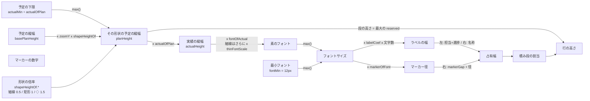
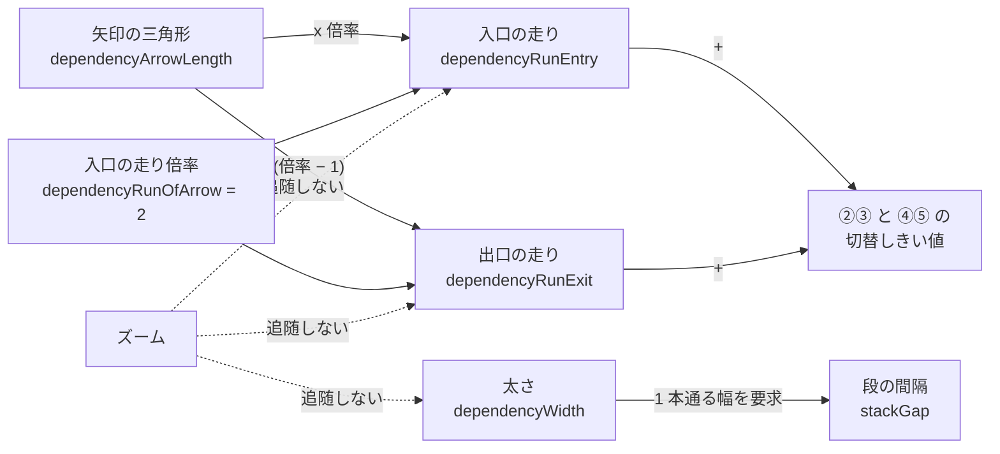
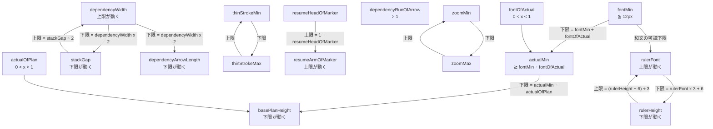

# UI 詳細仕様（画面構成・操作割当・予実の編集モデル）

- 日付: 2026-07-26
- 目的: `user-order.md` が「何が欲しいか」だけを書くため、**そこに書けない詳細**を引き受ける。
  レビューで指示された「画面構成・上部ボタンレイアウト・パレット構成・予実の編集モデル・操作割当」をここに置く。
- 位置づけ: **UI パーツ名の正は `handover-ui-parts-ja.md`**、データ構造の正は `../02-data-model/grs-native-erd-ja.md`。
  本書はその 2 つの上で**振る舞い**を決める。
- 出所の区別: 「**現行**」= 前プロジェクトの実装で実在したもの（コードで確認）。「**次期で決める**」= 未確定。

> **コピペ禁止**（`../README.md` §0-1）。本書は判断を渡すもので、実装を渡すものではない。

---

## 1. 画面構成の内訳（4 部 ＋ 浮遊 2）

**UI パーツ木の正は `handover-ui-parts-ja.md` §3 である。ここには複製しない。**
（同書の木は本節・`../07-plan-actual/handover-plan-actual-decisions-ja.md` §9-6 の両方を含む上位集合であることを確認済み。
本節の木は `Progress Marker` / `Resume Icon` を欠き、`Task Bars` の説明が `shapeKind` 確定前のままだった。）

**本節が持つのは、4 部構成の意味と「何がスクロールするか」だけである**（下記）。

**なぜ Canvas Overlays を分けるか**: 角丸の R・透かし・ルーラー・カーソルは**ズームで大きさが変わってはいけない**。
world 空間ではなく**スクリーン空間の別レイヤ**に置くことで、倍率を打ち消す計算が不要になる
（`../04-performance/handover-performance-notes-ja.md` E-11）。

**何がスクロールし、何がしないか** — **確定 2026-08-01**

| 部位 | 横スクロール | 縦スクロール |
|---|:--:|:--:|
| `Row Title Panel`（行見出しパネル） | **しない** | する（`Rows` と揃う） |
| `Time Ruler`（タイムルーラー） | する（`Rows` と揃う） | **しない** |
| `Rows` / `Task Bars` / `Dependency Lines` | する | する |

**行見出しは横に流れてはならない。** どの行を見ているか分からなくなる。
**目盛は縦に流れてはならない。** どの日付を見ているか分からなくなる。
2 つが交わる左上の隅は、どちらにも動かない。

**`Row Title Panel` の幅は可変**（`Panel Divider` をドラッグする）。
固定にすると、深い階層の見出しが入らないか、浅い文書で無駄に広いかのどちらかになる。

**`Grid Lines` の表示切替** — **確定 2026-08-01**

`Date Grid Lines`（日付罫線）と `Group Grid Lines`（グループ罫線）を
**独立したトグル 2 つ**にする。組み合わせで 4 通りになる。

```
日付方向  タスク方向
  ON        ON     → 格子
  ON        OFF    → 日付方向のみ
  OFF       ON     → タスク方向のみ
  OFF       OFF    → なし
```

**4 択の循環ボタンにしない。** 理由は §4-4 の `[予定] [実績]` と同じで、
**循環だと「今どれか」と「次に何になるか」の両方を覚える必要がある**。
独立トグルなら押下状態を見れば現在が分かる。置き場所は Command Palette（§3 の `grid-date` / `grid-group`）。

---

## 2. App Header のボタンレイアウト（Header Commands）

**現行**の並び（左→右）と役割:

| ボタン | 役割 |
|---|---|
| `Fit` | **縦横とも**全体が収まるようにズームとスクロールを合わせる（§5-2）。**算出規則は §6-7 が正** |
| `Cmd` | Command Palette の表示/非表示 |
| `SS` | 画面のコピー（スクリーンショット相当） |
| `Load` / `Save` | ファイル読込 / 保存 |
| `Theme` | 明暗テーマの切替 |
| `Base` | 変更前の予定（ベースライン）を別ファイルとして読み込む/外す |
| `Undo` / `Redo` | 元に戻す / やり直す |
| `AI` | AI へ渡す JSON を表示するモーダル |
| `?` | Help モーダル |

**確定（2026-07-26）— 高さを増やさずにボタンを増やす方法**

```
1. 全ボタンをアイコン化する（テキストラベルをやめる）
     → 幅が半分以下になる。`SS` のような略語は項 6-6（言葉ではなくアイコンで伝える）に反する
2. 責務で置き場所を分ける
     App Header       … 文書に対する操作（Fit / Load / Save / Base / Undo / Redo / AI / ?）
     Command Palette  … 描画に対する操作（図形・注記・カーソル・グリッド・予実の表示切替）
3. ドロップダウンにまとめない
     1 クリック増えるのでぬるサク（最優先事項 1）に反する
```

**`[予定] [実績]` の 2 トグル（§4-4）は Command Palette 側**に置く（描画に対する操作だから）。※`[分離]` は廃止した。
App Header にも現在の状態が見えるとよいが、**同じ機能を 2 箇所に置くと DEF-013（重複コントロール）を再発させる**ので、
置くなら**表示のみ（操作不可）**にすること。

---

## 3. Command Palette の構成

**現行**の内訳:

| グループ | 中身 |
|---|---|
| 図形（タスク） | 矩形 `===` / 矢羽根 `>===>` / 矢印 `--->` / 端点スパン `*----*` ※両端が縦棒の細線は廃止 |
| 図形（マイルストーン） | 〇 六角形 五角形 ◇ □ ☆ △ ▽ ※畳んで隠れており、展開して選ぶ。タスク形状（`shapeKind`）はタスクと同じ 1 列 |
| 選択中の図形 | いま「構え」ている図形の表示（Enter で配置） |
| 機能コマンド | `progress-line`（イナズマ線）/ `progress-marker`（進捗マーカーの表示切替）/ `comment` / `highlight-box`（ハイライトボックス）/ `watermark` / `grid-date` / `grid-group` |
| カーソル | `guide-cursor-none` / `-crosshair` / `-single-vertical` / `-double-vertical`（**4 モード排他**） |

**アイコンは全て線画**（20×20 のデザイングリッドで作画し、太さを揃える）。CR-014 の判断。
`progress-line` は稲妻の絵文字ではなく**ジグザグの線画**である、といった具体は
前プロジェクトのアイコン定義が参考になる（形状の意図だけ引き継ぐ）。

**確定（2026-07-26）— グループ構成**

```
カーソル系は 1 グループに集約する（現行はトグルが分散していて探せない）
    [本日線]      独立トグル
    [デュアル]    独立トグル
    [ガイド]      4 モード排他（なし / 十字 / 縦1本 / 縦2本）

予実の表示切替も 1 グループに集約する
    [予定] [実績]             §4-4  ※[分離] は廃止
```

- パレットは浮遊するので、**選択していないときは薄く透明**（項 7）。ただし**文字は不透明を保つ**（コントラスト確保）。

---

## 4. 予実の編集モデル（ユーザー確定仕様）

> 🔴 **この節の正は `../07-plan-actual/handover-plan-actual-decisions-ja.md`。**
> 本節はその要約であり、食い違ったら向こうが勝つ。

### 4-0. 実績の入力規則（5 状態）

**状態と各列の値は `../07-plan-actual/handover-plan-actual-decisions-ja.md` §1-3 の表に従う。ここには複製しない。**
（同じ表を 2 か所に置くと、片方だけ直されて食い違う。）ここは **UI としての要件**だけを書く。

**UI が守ること**

- **実績バーの両端は人が置いた日付。** 左端 = `actualStart`、右端 = `actualStart + actualDuration`（稼働日）。
- **完了にしても右端は 1 日も動かない。** `actualFinish` に右端の日付がそのまま入る。
- **`percentComplete`（完了率）は人が直接入力しない。** 日付から算出して格納する導出値である。
- **基準日を動かしても、バー・日付・完了率のどれも動かない。** 基準日で動くのはイナズマ線と遅れ判定だけ。
- 「中止」（もう再開しない）は**中断・再開日未定と同じもの**。専用の概念を作らない。
- 上の 5 状態から外れる入力を**そもそもできないようにする**（矛盾を作らせない）。

**運用（週次更新）**

```
着手時   ダミーの実績線を掴む     → actualStart が入る
以後     実績バーの右端をドラッグ → actualDuration が変わる（完了率は自動で追随）
完了時   進捗マーカーをクリック   → actualFinish に右端の日付が入る
```

**日常的に触るのは実績バーの右端 1 つだけ。**

### 4-1. 掴み領域と掴み点

**用語を 2 つに分ける。**

```
掴み領域（hit region）  ポインタが当たったときに操作が始まる範囲
掴み点（handle）        そのうち、ドラッグの起点になる小さな領域
```

**ジェスチャは 4 種**

| ジェスチャ | 何をするか |
|---|---|
| **平行移動** | 掴んだ対象を丸ごとずらす |
| **リサイズ** | 端を掴んで日付または期間を変える |
| **ラベル移動** | 名称ラベルだけをずらす |
| **アンカー移動** | コメントの引出し先をずらす |

#### 対象別の掴み領域

**予定バー**

| 掴み領域 | 場所 | 操作 |
|---|---|---|
| **開始点** | バー左端 | `start` を変える |
| **終了点** | バー右端 | `finish` を変える |
| **フェードイン** | バー**左上の角** | `fadeInDays`（**矩形と矢羽根のみ**） |
| **フェードアウト** | バー**右下の角** | `fadeOutDays`（**矩形と矢羽根のみ**） |
| **バー本体** | 端点を除いた中間 | 平行移動（長さを保つ） |

**実績バー**

| 掴み領域 | 場所 | 操作 |
|---|---|---|
| **開始点** | バー左端 | `actualStart` を変える |
| **終了点** | バー右端 | **`actualDuration`** を変える（置いた日付から稼働日数を算出） |

**マイルストーン**

| 掴み領域 | 操作 |
|---|---|
| **マイルストーン点**（点そのもの） | 平行移動のみ |

> **マイルストーンは開始点・終了点・フェード掴み点を持たない。** 点であって幅がないため。

**Resume アイコン**

| 掴み領域 | 操作 |
|---|---|
| **L 字の折れ矢印** | `resume` を変える。**中断のときだけ出る** |

**ラベル**

| 掴み領域 | 場所 | 操作 |
|---|---|---|
| **名称ラベル** | ラベル本体 | ラベルだけを平行移動（編集も可） |
| **担当ラベル** | ラベル本体 | 編集のみ（**サイズ変更しない**ので中心 1 点で足りる） |

**注記**

| 掴み領域 | 場所 | 操作 |
|---|---|---|
| **枠本体** | 角丸囲みの内部 | 平行移動 |
| **枠の角** | 角丸囲みの **4 隅** | リサイズ（範囲を変える） |
| **コメント本体** | 吹き出しの本体 | 平行移動（吹き出しのズレを変える） |
| **引出しアンカー** | 引出し線の先端 | **指す先を変える**（アンカー移動） |

**依存線**

| 掴み領域 | 内容 |
|---|---|
| **依存アンカー** | 引出し口。外接矩形の **9 点**（0 = 左上 〜 8 = 右下）。⚠️ これはアンカーの**表現力**であって経路の規則ではない。**FS の自動配線が使うのは右辺中央と左辺中央の 2 点だけ**（§4-9） |
| **折れ点** | 経路の折れ曲がり点。**表示のみ。人は動かさない**（経路は全自動・`user-order.md` 項 48） |

#### 掴み代は見た目より大きくとる

**寸法は `../07-plan-actual/handover-plan-actual-decisions-ja.md` §3-2 に従う。ここには複製しない。**
（**文書に保存しない**理由と分類は `../02-data-model/grs-document-settings-ja.md` §5-1。）

**予定バーの高さ > 実績バーの高さ**なので、**上下の縁を狙えば予定、真ん中を狙えば実績**が掴める。
モードで切り替える必要がない。

> **ダミーの実績線の掴み代が小さすぎると着手できない。** モックで実際に起きた不具合である
> （11 x 10px では的が小さく、クリックできているのに気づけない）。

#### 掴みの優先順位（重なったときの解決）

**`../07-plan-actual/handover-plan-actual-decisions-ja.md` §3-3 に従う。ここには複製しない。**
要点だけ: **端点 > 名称ラベル > バー本体**。端点は範囲が小さいので、大きい領域に負けると永久に掴めない。

### 4-2. 担当・完了率・タスク名のラベル

**書式**: `{担当} : {完了率 %} [タスク名]`

**配置**:

```
        田中 : 40% |███████ 詳細設計 ███████|
        └──────────┘└─ タスク名は下記の規則で配置
         予定タスクの左端を基準に
         外側左へ右揃えで連結
```

- **担当と完了率は「予定タスクの左端」を基準に、バーの外側左へ右揃えで連結**する。
- **依存線 / 担当 / 完了率 の 3 つは、それぞれ独立に表示/非表示を切り替えられること**（**確定 2026-07-30**）。
  1 つのトグルでまとめない。3 つ別々のトグルにする。
  **同じ高さに並ぶタスクに依存線と担当/完了率の両方を出すと、依存線が複雑になりすぎる。**
  実務では「依存線を見る」ときと「担当と進捗を見る」ときが別なので、**片方を消せることが要件**である。
  この独立性から、**依存線の経路は担当/完了率のラベルを避けない**（§4-9）。
- **フォントサイズはタスク高の 80%。ただし下限 12px でクランプする。**（和文がこれを割ると読めない。基準は 1920x1080 / 全画面 / 拡大率 100%）
  **下限を割る文字が必要になったら、文字を縮めるのではなくグループ LOD（`TaskGroup`）の深さを 1 つ減らす**（`../07-plan-actual/handover-plan-actual-decisions-ja.md` §2-4-1。**WBS ではない**）

#### 名称ラベルの配置

**`../07-plan-actual/handover-plan-actual-decisions-ja.md` §6-1 の 4 段階に従う。ここには複製しない。**

本節が独自に持つのは次の 1 点だけ:
**略称を廃止したため `name` がそのまま描かれる。この規則が無いとラベルが破綻する**（`user-order.md` 項 17）。

#### ラベル幅は概算する。キャッシュしない

**同書 §6-2 に従う。ここには複製しない。** 係数は `../02-data-model/grs-document-settings-ja.md` の `labelCoef`。

> ⚠️ **必ず占有幅に含めること。** 担当＋完了率をバーの**外側左**に出すと、**左隣のタスクと重なる**。
> **進捗マーカーも同じ扱い**にする（右端の外側に出るため、右隣と重なる）。

### 4-3. 重ね表示の重ね順

**背面 → 前面: 予定 → 実績 → 進捗マーカー → 依存線 → 名称ラベル。** — **依存線の位置を確定 2026-08-02（ユーザー判断）**

#### なぜ依存線がバーより前面なのか

**依存線はタスクを横切る。** タスクの x は日付で決まるので動かせず、**長いタスクが横に広く占めていれば
避ける場所が無い**。確定した経路自身が `x2 < x1` のとき「右へ出て段間の通路を左へ戻る」＝
**横切りを織り込んだ設計**である（§4-9）。

**横切ること自体は問題ではない。バーの背面に回すと問題になる。**
背面だと交差した部分が消え、**線が途切れているのか続いているのか区別できない**。
前プロジェクトは実績バーが名称ラベルを覆う不具合（DEF-009）を起こしており、**同じ種類の失敗**である。

```
長いタスクの上下に短いタスクがあり、その 2 つを依存線で結ぶ場合

  長いタスクを飛び越えることはできない（x は動かせない）
  → 上を通るか下を通るかしかない
  → 下（背面）だと線が消えて判別できない
  → 上（前面）を通す
```

#### なぜ名称ラベルより背面なのか

**「切れて見える」原因はバーに隠れることであって、文字に隠れることではない。**
バーは幅の広い塗りなので線を長く飲み込むが、**文字が線の上に乗っても線の連続性は読み取れる**。
文字には背景色の縁取りがある（`labelHaloOfFont`）ので、線が下を通っても文字は読める。

これにより **§4-3 の「テキストは必ず最前面」（DEF-009 の再発防止）を覆さずに済む。**

> **依存線とラベルが重なることは許容する**（§4-7 / `../07-plan-actual/handover-plan-actual-decisions-ja.md` §6-5）。
> 干渉は計算しない。**線が読めれば足りる**うえ、`dependencyVisible` で消せる。

前プロジェクトでは実績バーが名称ラベルを覆う不具合が実際に起きた（DEF-009）。
**テキストは必ず最前面**になる構造にすること（ラベル専用の層を作り、バーはその手前に挿入しない）。

### 4-4. 予実が重なって編集できない場合 — 高さの差で解く

**`[分離]` トグルは廃止した**（`user-order.md` 項 52 は欠番）。

**予定バーの高さを実績バーより大きく描き、上下に露出した帯で予定を掴む。**
モードで切り替える必要がない。

**実績は予定と同じ形状で描く**（2026-07-30 追加。予定が矢羽根なら実績も矢羽根。実績だけ四角にしない）。

**例外**: 幅がないタスク形状（**矢印 / 端点スパン**）は内側に収められないので、
**そのタスク形状だけ実績を下にずらす**（局所的な分離）。文書全体のモードではなく、タスク形状ごとの描き方である。

**マイルストーンは下ではなく、実績日の位置へ横にずらす**
（`../07-plan-actual/handover-plan-actual-decisions-ja.md` §2-2。確定 2026-08-01）。
上下の中心は予定と同じで、占有する縦幅は ◇ 1 つぶん。

- **実績を下にずらす矢印 / 端点スパンは、実績ぶんの高さを常に確保する**（表示を切り替えても行の高さが動かない）。
  **マイルストーンは確保しない**（横にずらすため）。
- 掴めない端点は**薄く描き、理由をツールチップで示す**。無反応だと故障に見える。

#### 表示の切り替え — **2 トグル**（確定）

| ボタン | 種別 | 効果 |
|---|---|---|
| **`[予定]`** | トグル | 予定側のバーを出す / 出さない |
| **`[実績]`** | トグル | 実績側のバーを出す / 出さない |

```
[予定] [実績]  の 4 通り
  ON   ON   → 両方表示
  ON   OFF  → 予定のみ
  OFF  ON   → 実績のみ
  OFF  OFF  → 作らせない（下記）
```

**規則**

- **両方 OFF は作らせない。** 最後に残った 1 つを OFF にしようとしたら、**他方を自動で ON にする**。
- **状態は色だけで示してはならない**（WCAG 1.4.1）。**押下状態 ＋ アイコン形状**の二重符号にする。
  - `[予定]` のアイコン = 破線 1 本 / `[実績]` = 実線 1 本

**なぜ循環ボタンにしないか**: 循環だと「今どの状態か」と「次に何になるか」の両方を覚える必要がある。
独立トグルなら**押下状態を見れば現在が分かる**。項 6-5（アフォーダンスにこだわる）に沿う。

### 4-5. Progress Marker（進捗マーカー）と Resume アイコン

**正は `../07-plan-actual/handover-plan-actual-decisions-ja.md` §2-4 / §2-4-1 / §2-5 である。**
記号の種類・表示条件・大きさ・Resume アイコンの幾何は**そちらだけ**に書く。

> ⚠️ **本節はかつて状態表を全文で持っており、07 側の 2 度の改訂に追随できなかった。**
> 「**固定ピクセルサイズ**で描く」と書いたまま残り、07 §2-4-1 が
> 「**文字サイズから導く**」に変えた事実と食い違っていた（2026-08-01 に本節を参照へ置き換えて解消）。
> 同じ表を 2 箇所に置かない。

本節が持つのは、**画面構成の側から見た所属だけ**である。

| 事項 | 内容 |
|---|---|
| 所属 | `Rows` → `Task Bars` の子。実績バーの右端の**外側** |
| 占有幅 | **含める**（§4-2 の注意と同じ）。含めないとマルチバー行で右隣と重なる |
| 掴み | クリックで状態を巡る。入口の一覧は §4-6 |

### 4-6. 進捗の編集入口

| 入口 | 採否 |
|---|---|
| **実績バーの右端をドラッグ**（1 日刻み） | **採用** |
| **進捗マーカーのクリック**（3 状態を巡る） | **採用** |
| **Resume アイコンのクリック / ドラッグ** | **採用** |
| Properties Panel での日付入力 | 採用（従来どおり） |
| 右クリックのクイック設定 | **不採用** |
| キーボードでの進捗増減 | **不採用** |

> **WCAG 2.1 の 2.1.1（キーボード操作可能）** はドラッグ操作にキーボード等価物を要求する。
> **Properties Panel で日付を入力できればこれを満たす**（ドラッグは代替手段であって唯一の手段ではない）。
> Properties Panel がキーボードで到達・編集できることを実装時に確認すること。

### 4-7. レイアウトの計算順序

依存線・ラベル・積み順は互いに影響するので、**循環を切る順序**を定める。

**4 段階の順序は `../07-plan-actual/handover-plan-actual-decisions-ja.md` §6-4 に従う。ここには複製しない。**

要点だけ: **「依存線が必要とする余地」と「依存線の経路そのもの」を分ける**。
**依存線とラベルの干渉は計算しない**（やりすぎでバグの元）。重なることは許容する。

### 4-8. PoC を先に回す

**上記の UI は実装前に PoC を回し、ユーザーと認識合わせを行う。**
PoC 項目の全数は `../07-plan-actual/handover-plan-actual-decisions-ja.md` §13。

---

### 4-9. 依存線の経路 — 8 パターンと 2 つの分岐（**確定 2026-07-30 / 種別 4 種へ拡張 2026-08-02**）

**この節が依存線の経路の正である。** 他の文書は経路の幾何を書かず、ここを参照すること。

#### アンカーは 2 種類だけ。どちらを使うかは種別が決める（**確定 2026-08-02**）

アンカーは **右辺の中央** と **左辺の中央** の 2 種類しかない。
**依存の種別**（`link_type` ＝ MSPDI `PredecessorLink/Type`）が、出口と入口にどちらを使うかを選ぶ。

| `link_type` | 名 | 出口 ＝ 先行の | 入口 ＝ 後続の | 族 |
|:--:|---|---|---|---|
| **1** | FS（完了 → 開始） | **右辺の中央** | **左辺の中央** | **対向** |
| **2** | SF（開始 → 完了） | **左辺の中央** | **右辺の中央** | **対向** |
| **0** | FF（完了 → 完了） | **右辺の中央** | **右辺の中央** | **同側** |
| **3** | SS（開始 → 開始） | **左辺の中央** | **左辺の中央** | **同側** |

値の対応は正本 XSD の `PredecessorLink/Type` で確認した
（出典 `https://schemas.microsoft.com/project/2007/mspdi_pj12.xsd`。
ローカル複製の照合手順は `../01-mspdi/mspdi/README.md`）。
**アンカーが右辺・左辺でなくなることはない。変わるのは組合せだけである。**

**走りは常にバーの外へ向かう。** 右辺なら右へ、左辺なら左へ。
内へ向けると走りが自分のバーの上に乗り、**どちらの端に付いた依存なのかが読めなくなる**
（FS と FF、SS と SF が絵で区別できなくなる）。

**出口が左辺のとき（SF / SS）は x の符号を反転して考える。**
以下の規則はすべて**「出口が右辺」の向き**で書いてある。反転は座標の符号だけの話であり、
規則を 2 組持つ必要はない。

掴み領域の定義（§4-1）にある「依存アンカー＝外接矩形の 9 点」は**アンカーの表現力**の話であって、
自動配線が実際に使うのは上の 2 種類である。

#### 族が経路を分ける

| 族 | 種別 | 2 本の走りの向き | パターン | 折れ点 |
|---|---|---|---|:--:|
| **対向** | FS / SF | **向かい合う** | ① 〜 ⑤ | 0 / 2 / 4 |
| **同側** | FF / SS | **同じ向きを向く** | ⑥ 〜 ⑧ | 2 / 4 |

**SF は FS の鏡像、SS は FF の鏡像**である。反転したうえで同じ族の規則を当てる。

#### 走りの長さ — 出口は入口より三角形ぶん短い（**確定 2026-07-31**）

```
矢印の三角形の長さ を 1 とするとき

  入口の走り = 2 = 三角形 1 ＋ 直線 1
  出口の走り = 1 = 入口の走り − 三角形 1
```

**入口には矢印があるので、三角形の先に直線が残る長さが要る。**
入口の走りが三角形より短いと、垂直線の先端に三角形が直接乗る形になり矢印に見えない。
**出口には矢印が無いので、三角形ぶんの長さが要らない。**

出口と入口を**別々の定数にしてはならない**。別々だと必ず食い違う。**倍率 1 つから両方を導く**。

```
dependencyArrowLength      矢印の三角形の長さ                    既定 10px
dependencyRunOfArrow    入口の走り ÷ 三角形                   既定 2

入口の走り = dependencyArrowLength x dependencyRunOfArrow           = 20px
出口の走り = dependencyArrowLength x (dependencyRunOfArrow − 1)     = 10px
```

制約 `dependencyRunOfArrow > 1`（§4-10-2）が**両方を同時に担保する**。
1 を超えていれば入口に直線が残り、同時に出口の走りが正になる。

#### 対向族の 5 パターン（FS / SF）

出口が右辺の向きで `x1 = 出口辺 + 出口の走り` / `x2 = 入口辺 − 入口の走り` と置く。
**分岐は 2 つである。**

```
同じ段   間隔 ≧ 入口の走り  → ①（0 折れ。垂直線を持たない）
         それ以外            → ④
別の段   x2 ≧ x1            → ② ③（中点で折る）
         x2 <  x1            → ④ ⑤（右へ出て段間の通路を左へ戻る）

  間隔 = 入口辺 − 出口辺
```

| # | PoC の名前 | 状況 | 折れ点 | 経路 |
|:--:|---|---|:--:|---|
| **①** | `FS-1` | 同じ段・間隔あり | **0** | 出口辺 → 入口辺（水平 1 本） |
| **②** | `FS-2` | 下の段・間隔あり | **2** | 出口辺 → 中点 → 下降 → 入口辺 |
| **③** | `FS-3` | 上の段・間隔あり | **2** | 出口辺 → 中点 → 上昇 → 入口辺 |
| **④** | `FS-4` | 下の段・**日程が重なる** ／ **同じ段・逆行** | **4** | 出口辺 → 走り → 通路へ下降 → **戻る** → 下降 → 入口辺 |
| **⑤** | `FS-5` | 上の段・**日程が重なる** | **4** | 出口辺 → 走り → 通路へ上昇 → **戻る** → 上昇 → 入口辺 |

`FS-n` は PoC の標本データに付けた名前である（`../08-poc/poc-integrated.html` の「マルチバー」タブの `P00`。
**FS のみ**で、SF・FF・SS の標本は無い）。
**丸囲み数字は画面に出さない**（要求されていない記号なので、仕様の番号と混同されないようにする）。

**②③ の中点は `[x1, x2]` でクランプする** —
間隔が狭いときに中点が後続へ寄りすぎると、入口の走りが確保できなくなるため。

**しきい値は 2 つあり、値が違う。**

| どこで使うか | しきい値 | 既定値 |
|---|---|--:|
| **①**（同じ段・0 折れ） | **入口の走り**だけ | **20px** |
| **②③ と ④⑤ の切替**（別の段） | 出口の走り ＋ 入口の走り | **30px** |

**① に出口の走りが要らないのは、垂直線を持たないからである。**
出口の走りは「垂直線を出口辺から離す」ためにあり、水平 1 本の経路には離すべき垂直線が無い。
矢印の手前に直線が残る長さ（＝入口の走り）だけが要る。
※出口を半分にする前は ②③ のしきい値が 40px（20 ＋ 20）だった。**この変更でしきい値が 10px 縮み、
②③ に収まる場面が増える**（同じデータでも一部の依存線が 4 折れから 2 折れに変わる）。

**同じ段で後続が先行より前に始まる（完全な逆行）は ④ である** — **確定 2026-08-02**。
間隔が入口の走りを下回るので ① から落ち、通路は下の「段間の通路」の規則がそのまま定める。
**新しい規則は要らない。**

#### 同側族の 3 パターン（FF / SS）— **確定 2026-08-02**

2 本の走りが同じ向きを向くので、**水平 1 本にはならない。0 折れは存在しない。**
出口が右辺の向きで `x1 = 出口辺 + 出口の走り` / `x2 = 入口辺 + 入口の走り` と置く
（**入口の走りが入口辺の外側＝同じ側にある**のが対向族との違い）。

```
別の段   → ⑥ ⑦   折返しの x = max(x1, x2) の 1 本で足りる
同じ段   → ⑧      垂直線が 2 本要る（1 本だと線が自分の上を往復する）
```

| # | 状況 | 折れ点 | 経路 |
|:--:|---|:--:|---|
| **⑥** | 下の段 | **2** | 出口辺 → 折返しの x → 下降 → 入口辺 |
| **⑦** | 上の段 | **2** | 出口辺 → 折返しの x → 上昇 → 入口辺 |
| **⑧** | 同じ段 | **4** | 出口辺 → 出口側の垂直 → 通路 → 入口側の垂直 → 入口辺 |

**⑥⑦ に分岐もクランプも要らない。** `max(x1, x2)` を採るだけで、出口の走りと入口の走りが
同時に確保される（折返しが `x1` 以上なので出口が、`x2` 以上なので入口が満たされる）。

**⑧ の垂直線 2 本の x**

```
入口側 = x2
出口側 = x1
         ただし |x1 − x2| < 出口の走り のときは  x2 + 出口の走り  へ押し出す
```

**押し出しが要る理由**: 2 本が重なると、線が同じ垂直線上を降りて戻ることになり、
**行きと帰りの区別が付かない**。押し出したあとも出口の走りは保たれる
（`|x1 − x2| < 出口の走り` なら `x2 + 出口の走り > x1` であるため）。
押し出す量に新しい設定値は要らない。**既に持っている出口の走りを流用する。**

> **同じ段の 2 つのタスクは日程が重ならない**（§6-1 手順 4 の半開区間判定）。
> それでも `|x1 − x2|` が小さくなる場面はある — 先行のバーの幅がちょうど出口の走りに近いときで、
> 低ズームでは実際に起こる。**押し出しはその 1 点のためにある。**

#### 垂直に移動する部分は横切ってよい — **確定 2026-08-02（ユーザー判断）**

**段が 2 つ以上離れていても、行をまたいでも、経路のパターンは増えない。**
垂直線が途中の段や行のタスクを横切ることは**許容する**。

**避けようとしてはならない。** タスクの x は日付で決まるので動かせず、
長いタスクが横に広く占めていれば**避ける x が存在しない**。
「縦の通り道を予約する」案は、その場面で原理的に解けないので採らない。

**読めることは重ね順で担保する** — 依存線は**バーより前面、名称ラベルより背面**（§4-3）。
背面に回すと交差部分が消えて**線が途切れているのか区別できなくなる**。

#### 段間の通路

**④ ⑤ ⑧** の水平部分が通る高さ。**3 パターンとも同じ規則を使う。**

```
通路の y = 先行のバーの端 と 後続のバーの端 の 中点
```

下へ向かうときは「先行の下端と後続の上端の中点」、上へ向かうときは「後続の下端と先行の上端の中点」。
同じ段どうしを結ぶときは、その段の下端 ＋ 段の間隔の半分（**④ の同じ段・逆行と ⑧ がこれに当たる**）。

#### 折れ点の上限は **0〜4**。「0〜3」と書いてはならない

前進（後続が右）は 0〜2 で収まるが、**日程が重なる ④ ⑤ と、同側族が同じ段を結ぶ ⑧ は
幾何学的に 4 折れが必要**である。
前プロジェクトも同じ結論に達している（DEF-005 / CR-008、
`../04-performance/handover-performance-notes-ja.md` §4-1 の 4）。
**「0〜3」と書くと必ず破れる。**

#### 太さと走りは**固定の定数**。ズームにもフォントにも追随しない

**確定 2026-07-30。** 依存線は担当/完了率と同時に出さない（§4-2）ので、
**ラベルの寸法系（予定の縦幅 → 実績の縦幅 → フォントサイズ）とは依存関係を持たない**。
したがって次の 2 つは**画面の絶対値で固定してよい**。

| 量 | 扱い |
|---|---|
| 依存線の**太さ** | 固定の定数 |
| 矢印の三角形の長さ | 固定の定数 |
| 入口の走り（＝三角形 × 倍率） / 出口の走り（＝三角形 ×（倍率 − 1）） | 固定の定数から導く |

**追随させてはならない。** ズームで太さが変わると、低ズームで線が潰れるか、
高ズームで線が帯になる。走りを追随させると、**2 つのしきい値**（① の 20px / ②③ と ④⑤ の切替の 30px）がズームで動き、
**同じデータなのに経路の形が変わる**。固定なら経路の形はズームに対して安定する。

⚠️ ただし**日単位の x 座標はズームに追随する**ので、`x2 < x1` の判定結果は変わる。
変わるのは「どのパターンになるか」であって、**選ばれたパターンの形は不変**である。

#### 経路探索をしない

上の規則は**表引き 1 回と分岐 2 つの直接計算**で、候補列挙も採点も探索も要らない。

```
1. 種別の表でアンカーの辺を引く（4 行）
2. 出口が左辺なら x の符号を反転する
3. 族で分ける — 対向なら ① 〜 ⑤、同側なら ⑥ 〜 ⑧
```

前プロジェクトは候補列挙＋辞書式採点だったが、**8 パターンに整理した結果それも不要になった**。
**形は 3 種類しかない**（水平 1 本 / 2 折れ / 通路経由の 4 折れ）。種別が 4 倍になっても増えていない。
**経路は保存しない**（`user-order.md` 48）。毎回算出する。

#### アンカーの辺は描かれる図形で決める — マイルストーンとゼロ期間（**確定 2026-08-02**）

**辺は「日付の点」ではなく「描かれる図形の外接矩形」で取る。**

```
右辺 = 図形の中心 + 図形の幅 ÷ 2
左辺 = 図形の中心 − 図形の幅 ÷ 2
y    = 図形の中心
```

- **マイルストーンは幅を持つ**（`shapeHeightOf.milestone` 倍の高さと同じ大きさのグリフ）。
  日付の点（幅 0）をアンカーにすると、走りがグリフの内側から出る。
  依存線はバーより前面に描く（§4-3）ので、**線がグリフの上に乗って形が読めなくなる**。
- **`milestoneGlyph` の 8 種のどれでも成立する。** 〇 六角形 五角形 ◇ □ ☆ △ ▽ はいずれも
  左右の極値が中心の高さに来るので、外接矩形の左右の中央が図形の輪郭に触れる。
- **ゼロ期間の通常のタスク形状も同じ扱い**でよい。幅は `minShapeWidth`
  （`../02-data-model/grs-document-settings-ja.md` §3）で確保されており、辺は必ず 2 つある。
- 論理上はマイルストーンの `start` と `finish` が同じ日でも、**辺は左右に分かれる**。
  したがって **FS は左から入り、FF は右から入る**という区別が絵に出る。
  ここを日付の点に潰すと、4 種の区別が消える。

#### 予定と実績のどちらに付くか（**確定 2026-08-02**）

**依存線は予定の幾何に付く。`[予定]` が OFF のときだけ実績の幾何に付ける。**

- 依存は**計画の構造**である（MSPDI の `PredecessorLink` は予定側の要素）。
- **実績に付けると同じ依存が実績の有無で動く。** 特にマイルストーンの実績は
  実績日の位置へ横にずれる（`../07-plan-actual/handover-plan-actual-decisions-ja.md` §2-2）ので、
  付け先を決めないと絵が定まらない。
- `[予定]` と `[実績]` は**両方 OFF にできない**（§4-4）ので、**付け先は常に決まる。**

#### ラグは幾何の規則を増やさない（**確定 2026-08-02**）

`LinkLag` は先行と後続の**日付**に効く。日付が x を決めるので、**ラグは既に x の差として現れている**。
経路の側にラグ用の規則は要らない（`user-order.md` 項 49 の「ラグ」はこれで満たされる）。

#### かつての未決 — **全 6 件が決着済み**（2026-08-02）

**この節に未決は無い。** 以下は決着の記録である。

| 論点 | 決着 |
|---|---|
| 同じ段で後続が先行より**前に**始まる（完全な逆行） | **④ である**（2026-08-02）。間隔が入口の走りを下回るので ① から落ち、通路は「段間の通路」の既存規則が定める。**新しい規則は要らなかった** |
| 段が **2 つ以上離れている** | **決着（2026-08-02・ユーザー判断）**。垂直線は途中の段のタスクを**横切ってよい**。依存線をバーより前面に描くので線は読める（§4-3）。**経路のパターンは増えない** |
| **行をまたぐ** | **決着（2026-08-02・ユーザー判断）**。段が離れている場合と**同じ扱い**。横切ってよく、前面に描く（§4-3）。**縦の通り道の予約は要らない** — タスクの x は日付で決まるので避け先が無い場面があり、予約方式は原理的に解けない（`../07-plan-actual/handover-plan-actual-decisions-ja.md` §6-4 の撤回記録） |
| **マイルストーン**が先行 / 後続（幅 0 で右端＝左端） | **決着（2026-08-02・ユーザー判断）**。辺は**描かれるグリフの外接矩形**で取る（上節） |
| **FS 以外**（`link_type` 0=FF / 2=SF / 3=SS） | **決着（2026-08-02・ユーザー判断）**。**アンカーは右辺・左辺のまま**で、種別が組合せを選ぶ。SF / SS は x を反転して同じ規則に載る。同側族に ⑥ ⑦ ⑧ を足した（上節） |
| ~~走りの確保をラベル・マーカーを含めて測るか~~ | **決着（2026-07-30）**: 測らない。依存線と担当/完了率は同時に出さないため（§4-2） |

#### 検証

`../08-poc/poc-integrated.html` の「マルチバー」タブの `P00 依存線の 5 パターン` が **FS の 5 例**を 1 枚で描く。
実測は `../08-poc/POC-RESULTS-ja.md` の「依存線の経路」節。

> ⚠️ **SF / FF / SS に PoC の標本は無い。** PoC は FS だけを描いており、`Frozen Record` なので追随させない。
> **SF（①〜⑤ の鏡像）と FF / SS（⑥ ⑦ ⑧）は絵で確かめられていない。**
> 次期の UI モック（`../NEXT-STEPS-ja.md` 2-1）で最初に描くこと。

---


### 4-10. 寸法と判定の依存関係（**確定 2026-07-30**）

**何が何から決まるかを 1 枚にする。** これを外れた実装は、どこかで二重管理になっている。

```
 ── 縦の寸法（1 本の鎖。上流を変えれば下流が全部動く）────────────────

    予定の縦幅  ──▶  実績の縦幅  ──▶  フォントサイズ

    最小フォントサイズ  ──▶  予定の縦幅の下限
        下限を割る縦幅が必要になったら、文字を縮めるのではなく
        グループ LOD（TaskGroup）の深さを 1 つ減らす（§4-2 / §6-5 / 07 §2-4-1）

 ── 配置の判定 ────────────────────────────────────────────

    タスク時間の重複の有無  ──▶  タスクを上下に分ける判定（積み段）

    タスク名の長さ          ──▶  タスク名を書く場所の判定
                                 （中 → 打ち切って中 → 右出し → 段を落とす）

 ── 独立（依存関係を持たない）──────────────────────────────

    担当 / 完了率   ──╳──   依存線

        同じ高さに並ぶタスクに両方を出すと依存線が複雑になりすぎるので、
        両方を同時に出すことを前提にしない。3 つは個別に表示切替する（§4-2）。
        ゆえに依存線の太さと走りは固定の定数でよい（§4-9）。
```

**読み方**: `A ──▶ B` は「**A が B を決める**」。`A ──╳── B` は「**依存関係が無い**」。

#### 4-10-1. 値の依存関係 — 何から何が計算されるか

**根は 4 つだけ**（`basePlanHeight` / `actualMin` / `fontMin` / `pxPerDayAt1x`）。残りは全部そこから落ちてくる。



**依存線はこの図に入らない。** 担当/進捗と同時に出さないので、
太さも走りも上のどれとも繋がらない（§4-9）。だから固定の定数でよい。



#### 4-10-2. 範囲の依存関係 — ある値の上下限が別の値で動く

**設定できる範囲は固定ではない。** 下の矢印は「**この値が動くと、あの値の上下限が動く**」を表す。



**相互に縛り合う対が 3 組ある**（`dependencyWidth` ↔ `stackGap` / `thinStrokeMin` ↔ `thinStrokeMax` /
`zoomMin` ↔ `zoomMax`）。片方を動かすともう片方の範囲が動くので、
**UI では両方の範囲を毎回引き直すこと**。片方だけ検証する実装は必ず矛盾した組を通す。

| 制約 | 式 | 破ると何が起きるか |
|---|---|---|
| 実績 < 予定 | `actualOfPlan < 1` | 実績が予定からはみ出す |
| フォント < 実績 | `fontOfActual < 1` | 文字がバーより高くなる |
| 実績の下限に文字が収まる | `actualMin ≧ fontMin ÷ fontOfActual` | 実績が下限まで縮んだとき文字が下限を割る |
| 縦に縮める余地がある | `basePlanHeight > actualMin ÷ actualOfPlan` | 等倍が既に下限。縦ズームを縮めても何も起きなくなる |
| 入口の走りが三角形より長い | `dependencyRunOfArrow > 1` | **1 以下**: 垂直線の先端に三角形が直接乗り、矢印に見えない。同時に**出口の走りが 0 以下**になり、先行の右辺から線が出ない |
| 依存線が段の間を通る | `stackGap ≧ dependencyWidth × 2` | 線が上下のバーに接する |
| 細線が矩形より薄い | `shapeHeightOf.arrow < 1` | 「縦に薄い」という取り柄が消える |
| ◇ が矩形より大きい | `shapeHeightOf.milestone > 1` | 目立たなくなる |
| 矢羽根の先端が反転しない | `chevronNotchOfWidth ≦ 0.5` | 切り欠きが交差して形が壊れる |

**実際に触れる**: `../08-poc/poc-integrated.html` の「設定・プロパティ」ボタン。
**全項目**を個別に変えられ、**範囲は他の設定に追随して引き直される**。
値は `../08-poc/poc-integrated.html` の `SPEC` 1 か所にあり、ここで変えると全タブが追随する。
範囲外の値も入力できる（何が壊れるかを見るため）が、赤で示す。

#### 4-10-3. 縦の下限は **1 か所だけに置く** — 確定 2026-07-31

```
予定の下限   = actualMin ÷ actualOfPlan        実績がちょうど下限に届く予定の高さ
予定の縦幅   = max( 予定の下限, basePlanHeight x zoomY )
実績の縦幅   = 予定の縦幅 x actualOfPlan        ← クランプを掛けない
```

**クランプは予定側の 1 か所だけに置く。** 実績は比率だけで追随し、予定に下限がある以上
`actualMin`（`../07-plan-actual/handover-plan-actual-decisions-ja.md` §2-4-1 の 16px）を必ず上回る。

**予定と実績の両方をクランプしてはならない。** 両方に `max()` を掛けると、下限に当たった側だけが
止まって**比率が仕様から外れる**。前プロジェクトの PoC が実際にこれで割れており、
基準ページは 22 : 16（比 0.73）、他のページは 28 : 15.4（比 0.55）を描いていた。
同じ「実績 ÷ 予定」という 1 つの設定値から、2 つの違う絵が出ていたことになる。

**下限に当たったらどうするかは `../07-plan-actual/handover-plan-actual-decisions-ja.md` §2-4-1 のとおり** — さらに縮めるのではなく、
グループ LOD（`TaskGroup`）の深さを 1 つ減らす（§6-5）。下限は**引き金**であって、そこで固まる値ではない。

#### 4-10-4. どこで効いてくるか

| 決まる側 | 決める側 | 効いてくる場所 |
|---|---|---|
| 実績の縦幅 | 予定の縦幅 | §4-4 の比率。**フォント < 実績 < 予定** の順序を崩さないこと |
| フォントサイズ | 実績の縦幅 | 同上 |
| 予定の縦幅の下限 | 最小フォントサイズ | 下限を割ったら**グループ LOD（`TaskGroup`）の深さ**を 1 つ減らす（§6-5） |
| 積み段の割当 | タスク時間の重複 | §4-7 の計算順序 3 |
| タスク名の位置 | タスク名の長さ | §4-2 の 4 段階 |
| **なし** | **依存線 ↔ 担当/完了率** | 依存線の寸法を固定定数にできる根拠（§4-9） |

---

## 5. 操作割当（キーボード / マウス）

**現行**の Help モーダルに載っていたもの（実在するものだけ。架空のショートカットは無い）。

### 5-1. 編集

| 操作 | 割当 |
|---|---|
| 構えている図形をキャレット位置に配置 | `Enter` |
| すべてのアイテムを選択 | `Ctrl+A` |
| 選択（アイテム / 依存線 / 注釈）を削除 | `Delete` / `Backspace` |
| コピー | `Ctrl+C` |
| 貼り付け | `Ctrl+V` |
| 元に戻す | `Ctrl+Z` |
| やり直す | `Ctrl+Y` / `Ctrl+Shift+Z` |
| 操作の取り消し / パネル・ダイアログを閉じる | `Esc`（下記の規則つき） |
| 文書名の編集 | `F2`（または Schedule Title をクリック） |

**`Esc` は閉じるものがあるときだけ受け取る** — **確定 2026-08-01**

**`Esc` を無条件に受け取ってはならない。** 取り消す対象が無いときは
**ブラウザに渡す**（`preventDefault()` を呼ばない）。

| 状況 | 動作 |
|---|---|
| 開いているもの・選択・ドラッグ中・編集中がある | **いちばん内側の 1 つだけ**を閉じる／取り消す。ここで `Esc` を消費する |
| どれも無い | **何もしない。`preventDefault()` を呼ばない** |

**理由**: 利用者は `F11` の全画面表示から `Esc` で戻ろうとする。
取り消す対象が無いのにアプリが `Esc` を消費すると、**そのキーが効かなかった**という事実だけが残る。
`F11` をもう一度押せば戻れるとしても、**利用者から見れば嘘をつかれたことになる**。
**アプリは使わない鍵を握ったままにしない。**

> **1 打鍵で 1 階層だけ閉じる。** 重なっているときにまとめて閉じてはならない。
> 何がどの順で閉じたかが分からなくなる。

> **同じ考え方はホイールと逆向きに働く**（§5-2）。ホイールは
> **修飾キーが付いたら必ず既定動作を止める**（こちらが使う）。`Esc` は
> **使わないなら止めない**（ブラウザに返す）。判断の基準は同じ —
> **その入力を自分が使うかどうか**であり、握れるかどうかではない。

### 5-2. 表示（ズーム・スクロール・パン）

| 操作 | 割当 |
|---|---|
| 縦スクロール | **ホイール（修飾なし）** |
| 横スクロール | `Ctrl+Shift` ＋ ホイール |
| **両軸ズーム**（ポインタ中心） | `Ctrl`（Cmd）＋ ホイール |
| 時間軸（横）のみズーム | `Shift` ＋ ホイール |
| 行軸（縦）のみズーム | `Alt` ＋ ホイール |
| パン | **キャンバスの背景をドラッグ**、`Ctrl` ＋ ドラッグ、または**中ボタンドラッグ** |
| 全体を収める（**縦横とも**） | `Fit` ボタン / `F`。**算出規則は §6-7**。⚠️ **収まることは保証しない**（同節） |

**修飾キーが付いたら必ずブラウザの既定動作を止める** — **確定 2026-08-01**

`Ctrl` ＋ ホイールはブラウザ自身のページ拡大縮小に割り当てられている。
**こちらが使わない組み合わせであっても、キャンバスの上では既定動作を止める。**
止め忘れると、`Ctrl+Shift` ＋ ホイール（横スクロール）のつもりで
**ブラウザ全体が拡大縮小される**。`Alt` ＋ ホイールを履歴移動に使うブラウザもある。

**パンは等倍** — **確定 2026-08-01**

ポインタが動いた距離だけ日程表が動く。**倍率を掛けない。**
掛けると「掴んだ場所が指から離れていく」ので、掴んでいる感覚が壊れる。

| ポインタの形 | いつ |
|---|---|
| 開いた手 | キャンバスの背景の上（掴めることを示す） |
| **握った手** | パンしている間 |

「ポインタ」はマウスが指す点であり、**`Cursors`（`Today Line` / `Dual Cursor` / `Guide Cursor`）とは別物**である
（`handover-ui-parts-ja.md` §2-1-5）。

**スクロールバーは横・縦とも常時表示する** — **確定 2026-08-01**

内容が収まっているときも消さない。**幅は環境の既定の半分**にする。

**なぜ常時表示か**: 出たり消えたりすると**キャンバスの幅そのものが変わる**。
幅が変わると再レイアウトが走り、積み順とラベルの配置が動く。
「スクロールできるかどうか」を確かめるために一度スクロールしてみる、という操作も要らなくなる。

**なぜ幅を半分にするか**: 常時出す以上、既定の幅では描画領域を恒常的に食う。
掴める太さは残しつつ、占める面積を減らす。

**ポインタを使わないズーム（確定 2026-07-30）** — ホイールの修飾キーと同じ体系にする。

| 操作 | 割当 |
|---|---|
| 両軸ズーム | `Ctrl` ＋ `+` / `-` |
| 時間軸（横）のみズーム | `Shift` ＋ `+` / `-` |
| 行軸（縦）のみズーム | `Alt` ＋ `+` / `-` |
| 等倍に戻す | `Ctrl+0` |

**修飾キーの意味をホイールと揃える**（`Ctrl`=両軸 / `Shift`=横 / `Alt`=縦）。
別体系にすると覚えられない。1 打鍵あたりの倍率とクランプはホイールと同じ（×1.1 / 0.02〜64 倍）。

> **ズームにスライダーを置かない。** ホイールとキーだけで操作する。
> スライダーはキャンバスから離れた場所に置くことになり、**見ている場所を見ながら拡縮できない**。

> **アイテムの上での素の左ドラッグはパンではない**（アイテムを動かす操作である）。
> **背景の上での素の左ドラッグはパン**である（2026-08-01 改訂）。
>
> 旧規則は「素の左ドラッグでパンしてはならない。ドラッグ中に日程表が滑って逃げる」だった。
> **懸念していたのはアイテムを掴んだつもりで日程表が動く事故**であり、
> **掴む対象があるかどうかで分ければ起きない**。何も無い場所を掴んだのなら、
> 動かす対象は日程表そのものしかない。**背景を掴んで動かす**のは作図ツールで広く通用する操作でもある。
>
> **素のホイールはスクロール**（`user-order.md` 項 37 の根拠）。前プロジェクトで
> 「素のホイール＝ズームは違和感がある」と判断して変更した結果である。
> ズーム倍率は 1 ノッチあたり **×1.1**、範囲は **0.02〜64 倍**でクランプ（現行値）。

### 5-3. キーボード操作（ポインタなし）

| 操作 | 割当 |
|---|---|
| アイテム間でフォーカス移動 | `Tab` |
| フォーカス中のアイテムを 1 日 / 1 行ずらす | 矢印キー |
| フォーカス中のタスクをリサイズ | `Shift` ＋ `←` / `→` |

### 5-4. Row Title Tree

| 操作 | 割当 |
|---|---|
| ノードの部分木をコピー / 貼り付け | `Ctrl+C` / `Ctrl+V` |
| ノードを削除（確認ダイアログ） | ダイアログ内で `D`=実行 / `C`=取消 |
| 畳み / 展開 | **全展開 / 全畳み / 子を全展開 / 子を全畳み / 自分を畳む**（エディタのツリーと同じ体系。`user-order.md` 項 28） |

**畳み / 展開の割当（確定 2026-07-26）**

| 操作 | 割当 |
|---|---|
| 自分を畳む / 展開 | `←` / `→` |
| 子を全部畳む / 全部展開 | `Shift` ＋ `←` / `→` |
| 全部畳む / 全部展開 | `Ctrl+Shift` ＋ `←` / `→` |

**フォーカスがある場所で意味を切り替える。** 矢印キーは Schedule Canvas ではアイテムの移動に使う（§5-3）ので、
**Row Title Tree にフォーカスがあるときだけ**上記のツリー操作になる。エディタのツリーと同じ慣習であり、
フォーカスによる切り分けは標準的な解。

### 5-5. ショートカットのヒント — **確定 2026-08-01**

**ポインタを Scrollbars の帯の上で 0.5 秒静止させたら、その場にヒントを出す。**
ポインタが動いたら消す。

| 事項 | 内容 |
|---|---|
| 出す条件 | ポインタが **`Scrollbars` の帯の上**にあり、**0.5 秒**動いていない |
| 消す条件 | ポインタが動く / キャンバスから出る / キーを押す / ホイールを回す |
| 中身 | §5-2 のホイール・ドラッグ・キーの割当 |
| 全一覧 | `?`（Help Modal）。ヒントは入口であって一覧ではない |

> **常時表示は禁止。** 覚えた人には二度と要らない情報が、
> **画面の面積を恒久的に食い続ける**。項 3（1 画面でスクロールなしに見られる）に反する。

**なぜ帯の上だけなのか** — **改訂 2026-08-01**

旧規則は「キャンバスの上で 5 秒静止」だった。**キャンバスの上は作業する場所**なので、
考えながら手を止めるたびにヒントが出て邪魔になる。

**スクロールバーへ手を伸ばした人は、遅い方法で移動しようとしている人である。**
ホイールとキーの割当はまさにその人のためにあるので、**そこが出しどころ**になる。
作業中の手には一度も出ない。

**0.5 秒**にしたのは、帯の上で 5 秒静止するのが不自然だからである
（普通は掴んですぐドラッグする）。通りすがりでは出ず、掴もうとした手には間に合う。

> ⚠️ **実装上の注意**: ネイティブのスクロールバーは DOM 要素ではないので、
> `mouseover` を直接付けられない。**位置で判定する** —
> `clientWidth` / `clientHeight` は帯を含まないので、
> ポインタがそれを超えていれば帯の上にいる。
> **ブラウザが帯の上でポインタ事象を発火しない場合、ヒントは一度も出ない**（無言で壊れる）。
> 実装したら**必ず実機で出ることを確かめる**こと。

---

## 6. 自動レイアウトの規則

### 6-1. 1 行の中の縦積み（`stackOrder` の自動割当）

**別の実装者が読んで同じ結果を出せるように書く。**

**入力**: ある `TaskGroup` に載る `Task` の集合、各 `Task` の予定期間（および実績期間）、ラベルの張り出し幅。
**出力**: 各 `Task` の段番号（`stackOrder`）と、その行の帯高。

1. **占有区間を求める。** 各 `Task` の描画上の左端〜右端。**はみ出すラベルの幅を右または左に加算する**
   （§4-2。加算しないと重なる）。
2. **`stackOrder` が指定されている `Task` を、先にその段へ固定する** — **確定 2026-08-02（ユーザー判断）**
   - `stackOrder` は**人の指定＝疎な上書き**（`null` = 自動）。**自動割当より先に置く。**
   - **後から上書きしてはならない。** 貪欲割当を済ませてから上書きすると、
     **既にその段にいる別の `Task` と重なる**。衝突解決が全 `Task` に拡がり、決定性も崩れる。
   - **同じ段を指すピンが複数あるとき**: `uid` 昇順で先着とし、**あぶれたピンは直近の空き段へ落として人に知らせる**
     （黙って重ねない。手順 6 の安全弁と同じ扱い）。
   - **なぜ先か**: ALIGN-L1-001（同種マイルストーンを同じ高さに）／ALIGN-L2-001（共有ベースラインへスナップ）は
     **ユーザーが指定した縦位置の意図**を前提とする。自動規則を先に走らせると意図が潰れる。
     また `uid` タイブレークはマージの再採番で見た目が変わるため、人の指定を残す必要がある
     （`../02-data-model/grs-native-erd-ja.md` §5.6）。
3. **残りを並べる順序を決める**（決定的でなければならない）:
   **`start` 昇順 → `finish` 降順 → `uid` 昇順**。
   ※順序が非決定的だと**再描画のたびに段が入れ替わる**。
   ※**マイルストーンを特別扱いしない** — 確定 2026-08-02（ユーザー判断）。理由は本節末尾の注記。
   ※**この順序で決定性が出ることは実測済み** — 20 パターンについて入力順を 3 通り変えて段割当を比較し、
   **不一致 0 件**（`../08-poc/POC-RESULTS-ja.md` §A-1）。
4. **残りに段を割り当てる。** 各 `Task` を順に見て、**その段に既に置かれた `Task`（手順 2 で固定したものを含む）と
   占有区間が重ならない、最も浅い段**へ置く（貪欲割当）。
   - **接触は重なりではない。** 前の `Task` の `finish` と次の `Task` の `start` が同じ日なら、**同じ段に置く**。
     占有区間は**半開区間**で判定する（終端を含めない）。
     ※ここを閉区間で判定すると、**直列につながるチェーンが常に段を落とし**、
     1 行が不必要に高くなる（`../08-poc/POC-RESULTS-ja.md` §A-4 の `P07` で確認した境界条件）。
     **はみ出すラベルの張り出し（手順 1）は別問題**であり、そちらは実際に重なるので段が落ちてよい。
5. **積む向き**（`stackDirection`）は**文書全体**の設定。既定は `'up'`。
   **`stackOrder` → 画面の y への写像だけが変わる** — **確定 2026-08-02（ユーザー判断）**

   | `stackDirection` | `stackOrder = 0` の位置 | 積む向き |
   |---|---|---|
   | **`'up'`**（既定） | 行の**下端** | 下から上へ |
   | **`'down'`** | 行の**上端** | 上から下へ |

   - **手順 2〜4 は向きに依存しない。** `stackOrder` の割当は同じで、**描くときの y だけを反転**する。
   - **画面の上下で書かれた段割当の規則は 1 つも無い。** したがって向きを反転しても崩れる規則が無い。
6. **積み順（`stackOrder`）に機能上の上限は設けない。** 必要なだけ広げる。
   暴走を止める**安全弁**として十分に大きい上限だけを持ち、**到達したら人に知らせる**（黙って捨てない）。
   ※ 2026-07-26 版の「上限を超えた `Task` は**最終段を再利用**する」は**廃止した**。
   重なりを許して同じ段に押し込む挙動であり、マルチバー（本ツール最大の差別化）を壊す。
   根拠は `../07-plan-actual/handover-plan-actual-decisions-ja.md` §6-3、`user-order.md` 項 30-7。
7. **行の帯高は段数で決まる。** 段が増えた行は**下の行を押し下げる**。**行高固定を前提にしてはならない。**

> **廃止した規則: 「マイルストーンを段割当で優先する」— 2026-08-02（ユーザー判断）**
>
> かつて手順 3 のソートに `milestone` 優先があり、「マイルストーンは `stackOrder` の小さい側に来る」という
> 手順が別に立っていた。**3 つの理由で外した。**
>
> 1. **唯一の根拠が消えた。** 特別扱いの理由は「下のタスク群から上のマイルストーンへ依存線が立ち上る構図」
>    1 つだけだった。依存線の経路は**上下対称**（②↔③ / ④↔⑤ / ⑥↔⑦ は互いに鏡像）で**バーを横切ってよい**と
>    確定したので（§4-9）、**マイルストーンが上でも下でも配線は同じ形になる。**
> 2. **そもそも何も保証していなかった。** マイルストーンのグリフには幅があるので低ズームで日付が近い 2 つは
>    別の段へ落ちるし、行を広く占めるピン（手順 2）が 1 つあれば全マイルストーンが押し上がる。
>    **「たいてい揃うが、いつ崩れるか予測できない」規則は、無い規則より悪い。**
> 3. **意図の置き場所として自動規則は不適である。** 自動規則は保存されず毎回導出される。
>    **人が作る専用の行**と **`stackOrder`（疎な上書き）**なら意図がデータとして残り往復する。
>
> **マイルストーンを 1 か所へ集めたい人は、専用の行を作るか `stackOrder` を指定する。**
> 承認済み要求 ALIGN-L2-004 の失効記録は `../02-data-model/grs-native-erd-ja.md` §5.6。
>
> ⚠️ **PoC はこの決定より前の姿である**（`milestone` 優先で `stack 0` に集まり、`stack 0` は行の上端）。
> `Frozen Record` なので追随させない。**PoC の絵で段割当を検算しないこと。**

### 6-1-1. Row Title Tree の操作が何を動かすか（**確定**）

**片方向の非対称であることに注意。**「両軸は独立」を双方向と読んではならない。

| 操作 | WBS | `TaskGroup` | MSPDI へ伝播 |
|---|---|---|---|
| **バーを別の行へドラッグ**（マルチバー化） | 変わらない | member が変わる | ✗ 視覚のみ |
| **Row Title Tree で階層を移動**（インデント / アウトデント / 親を変える / 兄弟並べ替え） | **変わる** | **追随して動く** | **○ 伝播する** |

- ツリー上の階層移動は**元データの階層を動かす**。`OutlineLevel` と親が変わり、export で外部マスタに反映される。
- **`UID` は保持する。** 相手ツールは UID 照合で「同じタスクが親を変えた」と解釈し再親付けするので、新規タスクにならない。
- **器は追随するが作り直さない。** 更新するのは親だけで、名前・色・高さ・畳み状態・`stackOrder` は保つ
  （作り直すとユーザーの視覚情報が WBS 操作で消える）。
- **ユーザーが手で作った器は追随しない**（WBS に対応がない）。ツリー上で動かしても視覚のみ。
- **インデントで 6 段目になる操作はできないようにする**（≤5 段）。

> ⚠️ **上限は「人が作るとき」だけに掛かる — 確定 2026-07-30**
>
> | 場面 | 上限 |
> |---|---|
> | **人がインデントで作る** | **5 段で止める**。器（`TaskGroup`）の入れ子 ≤Lv5 が追随できなくなるため |
> | **import で受ける** | **上限なし**。7 段来れば 7 段で保持する |
> | **export で返す** | **クランプしない**。持っている深さをそのまま返す |
>
> **非対称であることを承知の上で採る。** 外部マスタの階層を勝手に浅くして返すのは、
> GRS が負っている「WBS を壊さずに返す責任」に正面から反するので、export でのクランプはしない。
> 深さを 5 で頭打ちにするのは **LOD の判定のときだけ**である
> （`../07-plan-actual/handover-plan-actual-decisions-ja.md` §5-2 / §5-3）。

> **import で 6 段以上を受けたとき、器はどうなるか**
>
> ```
> 器の入れ子は 5 段で止める
> 6 段目以降のサマリは器を作らず、その配下のタスクは 5 段目の器の member に入る
> ```
>
> **`TaskGroup` と `TaskGroupMember` は export しない**ので、これで失われるものは無い。7 段の WBS は
> `wbs_parent_uid` にそのまま保持され、7 段で書き戻される。**浅くなるのは行の見た目だけ**である。
> 器の生成規則そのものは `../02-data-model/grs-native-erd-ja.md` §5.5g が正。

> 既定行の生成規則と既定表示名は `../02-data-model/grs-native-erd-ja.md` §5.5g が正。

### 6-1-2. 色の既定 — **確定 2026-07-30**

**正は `../07-plan-actual/handover-plan-actual-decisions-ja.md` §2-6。** ここは描画側の要件だけ書く。

```
予定と実績は 同一の色相
予定  中彩度・やや薄い
実績  高彩度・濃い（原色は使わない）

依存線  橙で固定。ライト／ダークのどちらでも判別できる彩度・明度にする
```

- **青い予定に緑の実績、のような色相違いは禁止する。**
- **依存線の色はユーザーに選ばせない**（橙で固定）。予定・実績と色相が衝突しないための固定である。
- 重なる相手とのコントラストは **3:1 以上**（WCAG 1.4.11）。特に**実績 ÷ 予定**。
  ダークモードは明度を反転するだけでは足りない。**予定をより暗く、実績をより明るく**する。
- **色は形と位置の冗長符号**であって、色だけに意味を持たせない（WCAG 1.4.1 / `user-order.md` 項 25）。

実測した値は `../07-plan-actual/handover-plan-actual-decisions-ja.md` §2-6 の表にある。

### 6-1-3. 文字の色と縁取り — **確定 2026-07-31**

**正は `../07-plan-actual/handover-plan-actual-decisions-ja.md` §2-7。** ここは描画側の要件だけ書く。

```
文字色      テーマの前景色 1 つ（ライト = 黒 / ダーク = 白）
縁取り      バーの上に載る文字に、背景色の縁を付ける
            太さ = フォントサイズ x 0.17、描き順は 縁 → 文字
```

- **文字色をバーの色ごとに切り替えない。** 名称ラベルは**予定バーと実績バーの両方にまたがる**ので、
  どちらに合わせても他方で落ちる。
- **縁取りは描画要素を増やさない。** 同じ文字要素の属性だけで済むので、下地の矩形を敷く案より軽く、
  **バーの形が文字の隙間から見える**（§4-2 の「ラベルを表示しても形状が見える」を壊さない）。
- **バーの外に出る文字（担当 / 完了率 / 右出しの名称）にも同じ色を使う。** 背景の上なので縁取りは要らないが、
  **色は同じ 1 つ**にする。
- 縁の太さは `documentSettings` に持つ（§4-10 の一覧。PoC では `labelHaloOfFont`）。**0 にすれば縁取りは消える。**

> **なぜ色を選び直す道を採らなかったか**: 文字色を固定したまま §2-6 の色を使うと
> 既定色相の青ですら **文字 ÷ 実績 = 2.58:1**（要 4.5:1）で落ちる。
> 色を選び直せば成立はするが、**10 色相すべてで解が制約の角に張り付き**（実績÷予定 = 3.00:1、
> 文字÷実績 = 4.50:1）、あとから明度を 1 ポイント動かすと必ず破れる。
> **`fillColor` は人が選べる**（`user-order.md` 項 12）ので、そもそも固定色では保証できない。
> 詳細と性能の実測は §2-7。

### 6-2. 横方向の整列

**縦は自動（6-1 の結果）、横は人が実行する。** Command Palette の整列コマンドで、選択した `Task` の
開始日または終了日を揃える。**自動で横に動かしてはならない**（日付は人が決める＝`user-order.md`「やらないこと」）。

### 6-3. 時間軸 LOD（`Time Ruler` の粒度切替）

**閾値は 1 日あたりの表示幅（px/day）で決める。** 現行値: `px/day = 6 × zoomX`。

**4 段階に分ける** — **確定 2026-08-01**

| 段階 | 目盛 | 刻む単位 | しきい値のキー |
|---|---|---|---|
| 1 | 年 | 年 | — |
| 2 | 年 ＋ 月 | 月 | `rulerTierPxPerDayMonth` |
| 3 | 年 ＋ 月 ＋ **週** | **週（月曜日の日付）** | `rulerTierPxPerDayWeek` |
| 4 | 年 ＋ 月 ＋ 日 ＋ 曜日 | 日 | `rulerTierPxPerDayDay` |

**週の段は月曜日の日付を書く。** 「第 3 週」のような通し番号は使わない。
**週の始まりは月曜**とする（`Project/WeekStartDay` が別の曜日を指していればそれに従う）。

**帯の高さは段階によらず固定する** — **確定 2026-08-02（ユーザー判断）**

段階 1（年だけを大きな文字で 1 段）から 段階 4（年 / 月 / 日＋曜日 を小さな文字で **3 段**）まで、
**外枠の高さは同じ**である。中の組み方だけが変わる。**段階が増えても目盛の帯は伸びない。**

- **なぜ固定か**: 高さが段階で変わると `zoomX` → 段階 → 帯の高さ → 使える高さ → `zoomY` の
  **循環がもう 1 本増える**。固定なら使える高さが `zoomX` と無関係な定数になり、**Fit の算出が閉じる**（§6-7）。
- 値と範囲は `../02-data-model/grs-document-settings-ja.md` §3「時間軸」の
  `rulerHeight` / `rulerFont` が正。**ここには書かない。**
- **段階 4 が最大の 3 段**なので、帯は 3 段ぶんの文字が入る高さを必ず持つ（同書が範囲で担保する）。

**しきい値は固定値である。導出しない** — **確定 2026-08-02（ユーザー判断）**

**正は `../02-data-model/grs-document-settings-ja.md` §4-4 の 3 キー**
（`rulerTierPxPerDayMonth` / `Week` / `Day`）で、**`documentSettings` に保存する**。
**同じ JSON を誰が開いても同じ絵になる**ためであり、07-31 に
「テーマ・ズーム・スクロールを文書に保存する（人に見せたい場所を文書が持つ）」と決めた思想と同じである。

> **採らなかった案**: ラベル幅から毎回導出する。`fontScale` に自動追随して「ラベルが必ず入る」が保証される反面、
> **閲覧環境で目盛が変わる**（WYSIWYG が崩れる）。加えて `documentSettings` から 3 キーが消え、
> `../02-data-model/grs-document-settings-ja.md` §8-2 の往復検査 3・4 の対象が変わる。

**以下は既定値を選ぶときの考え方**であって、実行時の判定式ではない。

```
段階 2 の目安   月 1 つの幅  = 30.4 × px/day  ≧ 「2026-01」が入る幅
段階 3 の目安   週 1 つの幅  =    7 × px/day  ≧ 「01-05」が入る幅
段階 4 の目安   日 1 つの幅  =    1 × px/day  ≧ 「05 月」が入る幅
```

> **既定値を 1.4 / 4.3 / 30 に決め直した — 確定 2026-08-02。** 旧値 1 / 4 / 14 は上の目安を
> **3 つとも割っていた**。導出（ラベル幅の概算規則 × 可読下限 12px）と検算は
> **`../02-data-model/grs-document-settings-ja.md` §4-4 が正。ここには複製しない。**
> **目安に合わせて実装が値を書き換えてはならない。** 値は `documentSettings` が持つ。
>
> ⚠️ **上の目安は「目盛のフォントが 12px のとき」に解いてある。** `fontScale` を大きくすると
> 段階 2 と 3 のラベルは入らなくなる（**間引けるのは日の段だけ**）。
> **`fontScale` の S / M / L が何 px かは未定義**であり、`../NEXT-STEPS-ja.md` **2-7** で決める。

**フォントを縮めて詰め込んではならない。** 和文の可読下限 12px
（`../07-plan-actual/handover-plan-actual-decisions-ja.md` §2-4-1）は目盛にも掛かる。
**入らないなら 1 段階粗くする**のであって、字を小さくするのではない。
タスク LOD と同じ考え方である（§6-4）。

- **単調であること**（拡大で細かくなる一方。粗くなる逆転を起こさない）。
- 段階 4 の日の段は、それでもラベルが衝突するなら **N 日ごとに間引く**（N は幅から決める）。
  **間引くのは日だけ**。年・月・週の段は間引かない。

> **なぜ週の段を足したか**: 段階 2 と 段階 4 の間が開きすぎていた。
> 月だけの目盛から一気に全日付になるため、**その間の倍率では読む手がかりが無い**。
> 週は日本の日程表で実際に使う刻みでもある。

### 6-4. タスク LOD（縮小で何を残すか）

**判定は WBS の階層の深さ**（`wbs_parent_uid` から導出。MSPDI の `OutlineLevel` に対応）。
**縮小すると深い階層のタスクから順に消える。**

- 閾値はズームに対し**厳密に単調**にすること。「**縮小したのに表示が増える**」逆転が原理的に起きない式にする。
  経験則の羅列（「年表示なら深さ 2 まで、月表示なら深さ 4 まで、ただし…」等）にすると必ずこの逆転が混入する。
- **単調性は 1 本の式で構造的に保証する。** 判定を次の形にする:

  ```
  その深さの代表期間 x px/day ≧ taskLevelOfDetailReadablePx   … 描く
  ```

  **代表期間が深さに対して単調減少なので、逆転が起こり得ない**（存在しない事故を後から潰す必要がない）。
  PoC はこの式で **2 次元 9,600 点を走査し逆転 0 件**を実測した（`../08-poc/POC-RESULTS-ja.md` §B-2）。
  定数 `taskLevelOfDetailReadablePx` の値と範囲は `../02-data-model/grs-document-settings-ja.md` が正。
- **判定では深さを 5 で頭打ち**にしてよい（6 段以上は実務でほぼ無い）。
  ただし**書き戻す値は頭打ちにしない**（階層が壊れる。`../07-plan-actual/handover-plan-actual-decisions-ja.md` §5-2）。
- **小さい文書では全部描く**（現行は 200 アイテム以下）。ただしこれは**閾値ハックであって根治ではない**
  （`../04-performance/handover-performance-notes-ja.md` N-4 / T-12）。次期は起動シーケンスで根治する。

> ⚠️ **`importance`（重要度）という専用の属性は廃止した。** 人が値を付ける必要がなくなり、
> 拡張領域の枠も 1 本浮いた。
>
> ⚠️ **低ズームではラベルが相対的に大きくなる**（フォントに下限 12px のクランプがあるため）。
> §4-2 の配置規則と組み合わせると、右出しと上下ずらしが増えて行が高くなる。
>
> **PoC で実測した（2026-07-30）。半分起きた。**
> ラベルが相対的に大きくなること自体は**実際に起きる** — 縦 0.42 / 14 px/日 でフォント下限に到達し、
> はみ出しラベルが **0 → 232 本**に跳ね上がった。
> ただし**それが段数の暴走に直結するとは限らない** — 67 タスク / 15 行の規模では、
> 1〜11 px/日 の全域で段数は **5 のまま**で止まった（安全弁 24 に未到達）。
> **「LOD で深い階層を間引かないと収束しない」は、より大きな文書で改めて確かめること。**
> 今回の規模では**否定も肯定もできていない**（`../08-poc/POC-RESULTS-ja.md` §6-4b・§B）。

### 6-5. グループ LOD（縦ズームで畳む）

縦ズームを縮めると**深い段から順に親へ集約**する。

**閾値の一般化（確定 2026-07-26）** — 現行値（`0.32` / `0.6`）を通る等比数列に一般化する。

```
深さ d（2〜5）を表示する条件:  zoomY ≧ threshold(d)
threshold(d) = 0.32 × 1.875^(d−2)
深さ 1 は常に表示（threshold = 0）
```

| zoomY | 表示する最大深さ |
|---|:--:|
| < 0.32 | 1 |
| 0.32 〜 0.60 | 2 |
| 0.60 〜 1.125 | 3 |
| 1.125 〜 2.11 | 4 |
| ≧ 2.11 | 5 |

**単調であること**が要件（時間軸 LOD と同じ思想）。縮小で表示が増える逆転を起こしてはならない。
現行の 2 点を通る等比にしたので、既存の見え方と連続する。

### 6-6. イナズマ線（Progress Line）の頂点

**規則は 1 文**: **動いているべき日を過ぎているものだけ、その日に頂点を打つ。**

**状態ごとの頂点は `../07-plan-actual/handover-plan-actual-decisions-ja.md` §4-1 の表に従う。ここには複製しない。**

**頂点は【段ごと】に計算する — 確定 2026-07-30**

```
同一行で【同じ段】に複数の Task がある   →  最も遅れた頂点（最も左）が勝つ。1 段につき 1 頂点
同一行で【段が違う】                     →  段ごとに頂点を分けて計算する
```

段が違うタスクは**画面上の高さが違う**。高さの違うものを 1 つの頂点に丸めると、
イナズマ線が**どの高さのどのタスクを指しているか読めなくなる**。
結果としてイナズマ線は**段の数だけ折れ点を持つ**（3 段ある行ではその行で 3 回折れる）。

**上端から下端まで 1 本の折れ線で描く。行ごと・段ごとに切り離さない。**
頂点のない段は基準日の位置を通す（2026-08-01 追加。理由と根拠は
`../07-plan-actual/handover-plan-actual-decisions-ja.md` §4-2）。

> ⚠️ 旧規則は「最も進んだ頂点が勝つ」だったが、それでは**行内に致命的に遅れたタスクがあっても隠れて**しまい、
> 「どこがボトルネックか可視化」という目的と矛盾する。マルチバーは本ツール最大の差別化なので、
> 1 行に複数タスクが載るのが標準である。

> ⚠️ **完了したタスクを尖らせない**のは意図的な判断である。日本のイナズマ線の作図慣行は
> 「完了なら右端に点を打つ」だが、そのまま実装すると**完了タスクが左へ尖って「遅れている」ように見える**。

**基準日の縦線は常時表示にしない**（`user-order.md` 項 43 のまま）。
遅れは進捗マーカーの `(!)` と遅れの日数が示す。

詳細は `../07-plan-actual/handover-plan-actual-decisions-ja.md` §4。

> ⚠️ **性能上の注意**: 現行実装はこの頂点計算で**毎フレーム全アイテムを走査**していた（可視集合に絞っていない）。
> レビューで指摘され、**未解消のまま終わった**（`../04-performance/handover-performance-notes-ja.md` T-1）。
> 次期は**可視集合に絞る**こと。

---

### 6-7. Fit の算出（**確定 2026-08-02**）

**`Fit` が決めるのは `zoomX` / `zoomY` / `scrollDate` / `scrollGroupId` の 4 つである。**

#### 何を測るか

**そのズームで実際に描かれるものだけを、描画される矩形で測る。**

- **描画される矩形**（オーバーハング込み）で測る。論理矩形ではない
  （`../04-performance/handover-performance-notes-ja.md` 罠 T-11）。含めるものの全数も同所 —
  実績バーの下方向 / マイルストーンの横方向 / Progress Marker の右方向 / はみ出す名称ラベル。
- **LOD で消えたタスクのために場所を空けない** — **確定 2026-08-02（ユーザー判断）**。
  **画面は資源であり、`Fit` はその資源に優先度の高い情報を詰めるための機能である。**
  LOD はわざと低優先度を落としている。落としたものの場所を空けるのは `Fit` と LOD の両方を否定する。
  含めないほうが**縦にも効く** — 描かないタスクは占有区間を作らないので、段が減り行が低くなる。

> **自己参照（ズーム → LOD → 幅 → ズーム）は振動しない。**
> §6-4 が LOD 閾値に**厳密な単調性**を要求しているため、
> **必要な幅 ＝ 描かれる集合の日数(`zoomX`) × ppd(`zoomX`) は `zoomX` に対して厳密増加**する
> （集合は増えるだけ・ppd も増えるだけ）。厳密増加なら解は一意で、振動は原理的に起こり得ない。
> PoC は同じ式で 2 次元 9,600 点を走査し**逆転 0 件**を実測している（§6-4）。
>
> ⚠️ **サマリタスクが子を包む文書では、そもそも幅が LOD で変わらない**（`Summary` は子の有無から
> 算出し、開始・完了が子を覆う ＝ `../02-data-model/grs-mspdi-field-ledger-ja.md`）。
> 自己参照が効くのは **WBS が平らな文書**と**子が親の外に出ている文書**だけである。

#### 使える領域

```
使える幅   = キャンバスの幅   − rowTitlePanelWidth − propertyPanelWidth − canvasPadding x 2
使える高さ = キャンバスの高さ − rulerHeight        − canvasPadding x 2
```

- **どちらも正でなければならない**（`../02-data-model/grs-document-settings-ja.md` §6）。
- **`rulerHeight` は目盛の段階によらず固定**（§6-3）。だから使える高さは `zoomX` と無関係な定数である。
- `svgPadding` は **SVG 出力の縁**であって、画面の `Fit` には効かない。

#### 手順

**横を先に、縦を後に解く。** フォント（＝`zoomY`）は横のオーバーハングに効くが、
**フォントは下限 12px に張り付いた時点で定数になる**ので、大きな文書では結合が消える。
小さな文書は余地があるので、初回のオーバーハングは**フォント下限**で見積もってよい。

```
1. 横を解く — WBS の深さを 1..5 で試す
     k = 1..5 について
         深さ 1..k を描くと仮定し、その集合の日数から
             zoomX = (使える幅 − 横のオーバーハング) ÷ (日数 x pxPerDayAt1x)
         その zoomX で タスク LOD が本当に 1..k を選ぶか確かめる（自己無矛盾か）
     自己無矛盾だったもののうち 最大の zoomX を採る
     zoomMin / zoomMax でクランプする

2. 縦を解く — TaskGroup の深さを 5..1 で試す（07 §2-4-1 と同じ方式）
     d = 5, 4, 3, 2, 1 の順に
         その深さで畳んだ行について、手順 1 の zoomX で段割当をして帯高の合計を出す
             zoomY = 使える高さ ÷ 帯高の合計
         フォントが下限を上回るなら採用して抜ける
     5 通りとも通らなければ d = 1 の結果を採り、zoomMin でクランプする

3. 量子化する — 両方を LOD 閾値に対して切り下げる（罠 T-14）

4. スクロールを合わせる
     scrollDate    = 描画矩形の左端の日付
     scrollGroupId = 最上行の TaskGroup.id
```

**ループを書いてはならない。試行は 5 ＋ 5 で終わる。** 理由は下の罠。

#### `Fit` が保証すること・しないこと

> **`Fit` は「全体が収まる」ことを保証しない。**
> 保証するのは「**WBS の深さと `TaskGroup` の深さを試したうえで、収まる最大のズームに着地する**」ことだけである。

**収まらないときは、その軸のスクロールを残す。** 縦は**最上行を上端に合わせて上から下へ**、
横は**描画矩形の左端に合わせて左から右へ**送る。

**中央寄せはしない。** スクロール位置は `scrollDate`（左端の日付）と `scrollGroupId`（最上行）で持つので、
**データ形式が中央寄せを表現できない**（`../02-data-model/grs-document-settings-ja.md` §4-2）。
`zoomMax` に当たって画面が埋まらないとき（文書が小さすぎるとき）も**左上に寄せる**。

#### 収まらないケースの全数

**縦と横で性質が根本的に違う。**

| | 入らないときに減らせるか |
|---|---|
| **縦** | **減らせる。** `TaskGroup` の深さを畳めば行数が減る。「入らない」は畳みきった後の話 |
| **横** | **減らせない。日付の幅は文書の事実であって、描き方の選択ではない** |

時間軸 LOD は目盛を粗くするだけで期間は縮まない。タスク LOD で深いタスクを消しても、
サマリが子を包んでいるので幅は変わらない。**横には情報を減らして詰める手が存在しない。**
だから**横は解けなければ即スクロール**で、試行も畳みもない。

**縦**（基準環境で使える高さ ≈ 962px。`zoomY` を下げても縮まない床が 3 つある —
予定の縦幅の下限 21.9px ＝ `actualMin ÷ actualOfPlan` / `stackGap` 12px / `rowGap` 8px。
**いずれも固定 px でズームに追随しない**。→ **1 行 1 段の最小占有は約 30px**）

| # | ケース | 深さを畳んで救えるか |
|:--:|---|---|
| **V-1** | 行数が多い | **救える。これが `TaskGroup` の深さ減の本来の役目** |
| **V-2** | **Lv1 まで畳んでも行が多い** | **救えない。約 32 行が上限**（962 ÷ 30） |
| **V-3** | **1 行の段数が多い**（マルチバーの本質。段数に機能上の上限は無い ＝ `../user-order.md` 項 30-7） | **救えないどころか逆効果。** 行を畳むと 1 行に集まるタスクが増え、段数が増える |
| **V-4** | 段の間隔の累積 | **部分的**（行は減るが段は減らない） |

> ⚠️ **目標規模の 50 行は、全部 1 段でも縦に入らない**（50 × 30 ＝ 約 1500px）。
> 最優先事項 3「1 画面でスクロールなしに見られる」は、**`TaskGroup` を畳んで初めて成り立つ**。
> PoC の実測（21 行が `Fit` で全部入った）とも整合する。

**横**（基準環境で使える幅 ≈ 1450px）

| # | ケース | 境界 | 判定 |
|:--:|---|---|---|
| **H-1** | **期間が長すぎる** | `zoomMin` 0.02 で ppd ＝ 0.12。1450 ÷ 0.12 ＝ **約 12,000 日 ＝ 33 年** | **33 年を超えると横スクロールが残る** |
| **H-2** | オーバーハングが幅を食う | 名称ラベルは**全角 12 で打ち切る**（`../user-order.md` 項 17）ので 144px 上限。Progress Marker は 22px | **右のオーバーハングは 166px が上限。起きない** |
| **H-3** | `zoomMax` 64 に当たる | ppd ＝ 384。1450 ÷ 384 ＝ **約 4 日** | **4 日未満は拡大しきれず余白が残る。** 入らないのではなく**埋まらない** |

> ⚠️ **実務では「入らない」より先に「読めない」が来る。**
> `taskLevelOfDetailReadablePx` は 24px なので、`zoomMin` の ppd 0.12 では
> **200 日より短いタスクが 1 本も描かれない**。33 年の文書を全部入れても、
> 画面に残るのは 200 日以上のタスクだけである。**LOD の設計どおりで不具合ではない。**

#### 罠

- **横を縮めると段が増えて縦が伸びる。** 占有区間の重なりが増えるため。
  したがって「**収まるまでズームを下げ続ける**」ループを書いてはならない。**単調でないので止まる保証がない。**
  深さ 5 通りの試行で打ち切るのは、この非単調性への答えでもある。
- **量子化は必ず LOD 閾値に対して切り下げる**（罠 T-14）。`Fit` は「収まる最大値」を返すので、
  **必ず閾値のすぐ下に着地する**。丸め上げると跨いで別の絵になる。
- **起動時は「寸法確定 → `Fit` 確定 → 初回描画」の順に固定する**（罠 T-10 / T-12）。
  0×0 の窓と `Fit` 前の初期ビューは実際に起きた。

---

## 7. 未確定リスト

**2026-07-30 に §1〜§6 の未確定はすべて解消した。残りは無い。**

| # | 論点 | 扱い |
|:--:|---|---|
| ~~1~~ | ~~`CursorMode` と `CursorGuideMode` が前プロジェクトで**型が 2 つに分かれていた**~~（`handover-ui-parts-ja.md` §5-3） | **確定**（2026-07-30）。型は 1 つ、名前は **`GuideCursorMode`**。`documentSettings` の項目は **`guideCursorMode`** |

**解決済み（参照先）**

| 論点 | どこに書いたか |
|---|---|
| 予実の表示切替（`[予定]` `[実績]` の 2 トグルだけ。**`[分離]` トグルは廃止**） | §4-4 |
| 名称ラベルの表示上限（全角 12 / 半角 24 で打ち切り） | §4-2 |
| ラベル下限フォントサイズ（**12px**） | §4-2 |
| `App Header` のボタンをアイコン化し責務で分割 | §2 |
| カーソル系・予実切替をパレットで 1 グループに集約 | §3 |
| Row Title Tree の畳み/展開ショートカット | §5-4 |
| Row Title Tree の階層移動が何を動かすか | §6-1-1 |
| グループ LOD の閾値の一般化式 | §6-5 |
