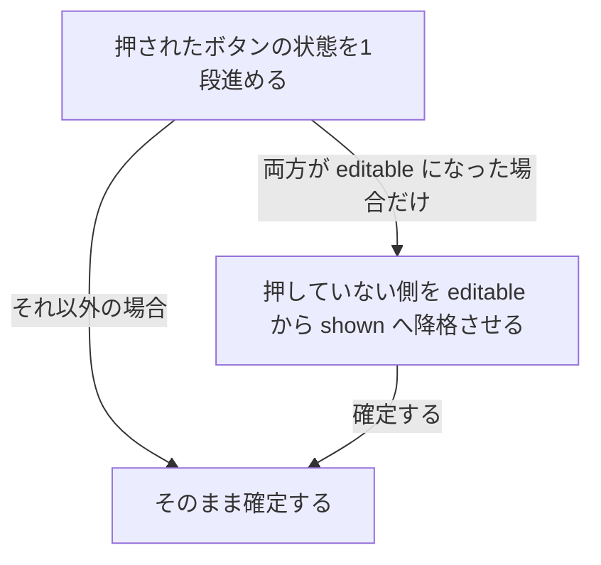
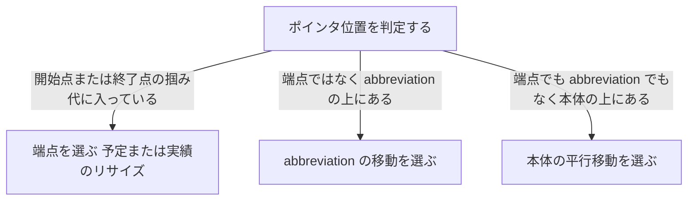

# 予実の可視性・操作可能性モデル（[P] / [A] 三状態案）の理解 — 第2版

> 🔴 **本書は旧案である。`../07-plan-actual/handover-plan-actual-decisions-ja.md` が全面的に上書きした。**
> **設計として採用しない。** 経緯として残す。
>
> | 本書の案 | 確定 |
> |---|---|
> | `[P]` / `[A]` の 3 状態（非表示 / 表示のみ / 操作可能）で解く | **採らない。** `[予定]` `[実績]` の**単純な 2 トグル**だけ |
> | 予実が重なる問題を**モード**で解く | **高さの差で解く。** 予定バーを実績バーより高く描き、上下の縁で予定を掴む |
> | 上下分離表示（separate スタイル） | **廃止**（`user-order.md` 項 52 は欠番）。ただし**矢印 / 端点スパンだけ実績を下にずらす**（局所的な分離）。**マイルストーンは実績日の位置へ横にずらす**（確定 2026-08-01） |
> | 仮実績点（ghost actual）はハンドル 2 個 | **中抜き＋破線の欠片 1 つ**。掴むと `actualStart` が入る |
> | ヒット優先順位は 端点 > abbreviation > 本体 | **端点 > 名称ラベル > バー本体**（`abbrev` は廃止済み） |
> | 用語集を `docs/glossary.md` に新設する | **作らない。** 用語の正は 2 つだけ（`handover-ui-parts-ja.md` と `grs-native-erd-ja.md`） |
>
> **生きているのは Q-C の考え方だけ**（表示を切り替えても**行の高さが動かない**よう、
> 常に両側ぶんの高さを確保する）。これは確定側にも引き継いだ。

- 作成: 2026-07-23（第1版）／ 改訂: 2026-07-23（第2版。ユーザーによる事実訂正を反映）
- 位置づけ: CR-017 起票前の理解合わせ。**仕様ではない**。決定は §7 をユーザーが確定してから
- 第1版からの差分: §1 の事実を全面訂正、§2 の状態モデルを **4 状態 → 9 マス（8 有効）** へ単純化、
  §3 のヒット優先順位を新規追加、§6 の用語集 SSOT を新規追加

---

## 1. 事実の訂正（第1版は誤っていた）

第1版はコードの現状（`drawsActualBar`）を「あるべき仕様」と取り違えていた。
ユーザーの訂正が正であり、以下を正式な前提とする。

### 1.1 予実の入力可否と、フェードの可否は別の軸

| 字形 | 予定の入力 | 実績の入力 | フェードの描画と設定 | 仮実績点の表示 |
|---|---|---|---|---|
| bar（矩形） | 可 | 可 | **可** | する |
| chevron（矢羽根） | 可 | 可 | **可** | する |
| arrow（矢印） | 可 | 可 | 不可 | する |
| span（スパン） | 可 | 可 | 不可 | する |
| milestone | 可 | 可 | 不可 | する |

**すべての字形で予定と実績を入力できる。**現在の実装は矩形タスクにしか独立した実績バーを
描かない（`src/domain/usecase/plan-actual-display.ts:159`）ので、**現状は仕様に足りていない**。
これは第1版が「制約」と誤読した箇所である。

`arrow` / `span` にフェード日数を数値として入れても絵に出ない状態が作れる点は、
**実害なしとして許容**（ユーザー確定）。フェードの角ハンドルは `arrow` / `span` では出さない。

### 1.2 仮実績点（ghost actual）

- 予定を最初に設定した時点で、**全字形において**「見かけ上の実績」の選択点が表示される。
  この時点で実績の**実データは存在しない**。
- ユーザーがその選択点を移動した瞬間に、**はじめて実績がデータになる**。
- 実績が無い状態で**終了点**を移動した場合、**実績の開始点は予定の開始点と同じ**になる。

これは確定済みの E-1（初回実績入力は `actualStart` のみを書き、`actualEnd` は未設定のまま）と
矛盾しない。E-1 は「架空の終了日を作らない」規則であり、こちらは
「終了点を先に動かしたときの開始点の決め方」を足すものだと理解している（§7 Q-3 で確認したい）。

### 1.3 予定と実績は同じ高さで描かれる

overlap では重なった領域で背後を絵として区別できない。フェードでも同じ。
この遮蔽を当たり判定の優先規則で解こうとしないこと、が本件の設計判断である。

---

## 2. 状態モデル（第1版より単純になった）

### 2.1 第1版の誤り

第1版は「操作可能な側が必ず 1 つ存在する」という補修規則（R2）を勝手に置き、
有効状態を 4 つに絞ってしまった。ユーザーの訂正
（**S5＝両方非表示を廃止しない**）により、この規則は不要と分かった。

**規則は 1 本で足りる。** しかもユーザーが示した遷移例は、その 1 本だけで完全に再現できる。

### 2.2 ボタン 1 つぶんの巡回

**ボタンの3状態巡回:**

色はユーザー確定で **灰 / 緑 / 橙**。橙のときは**アイコンの縁取りを太くする**ので、
色を知覚できなくても状態が伝わる（WCAG 2.1 の 1.4.1 と item20 を満たす）。

### 2.3 唯一の結合規則

**押した後の解決:**

これがユーザーの言う「橙は後勝ち」である。**他に規則は要らない。**

### 2.4 有効なペア状態は 9 マス中 8 つ

| `[P]` \\ `[A]` | hidden（灰） | shown（緑） | editable（橙） |
|---|---|---|---|
| **hidden（灰）** | **S5** 予実とも描かない。コメントと Add box だけを表示・選択する | 実績のみ閲覧（掴めない） | **S4** 実績のみ。実績を編集 |
| **shown（緑）** | 予定のみ閲覧（掴めない） | 両方閲覧（何も掴めない） | **S3** 両方見える。実績を編集 |
| **editable（橙）** | **S1** 予定のみ。予定を編集 | **S2** 両方見える。予定を編集 | **禁止**（規則 R1 が到達させない） |

第1版で挙げた S1〜S4 に、ユーザー指定の S5 と、副産物の「閲覧専用」3 マスが加わる。
閲覧専用マスは**誤ドラッグが原理的に起きない状態**であり、レビュー用途で有用と考える。

### 2.5 ユーザーが示した例のトレース

> `[P]` が橙、`[A]` が灰の状態で `[A]` をクリックすると
> `[P]`: 橙 → 橙 → 緑 ／ `[A]`: 灰 → 緑 → 橙

| 手順 | 操作 | `[P]` | `[A]` | マス | 画面 |
|---|---|---|---|---|---|
| 0 | 初期 | editable | hidden | S1 | 予定のみ。予定を編集 |
| 1 | `[A]` を押す | editable | shown | S2 | 実績が見えるが掴めない。予定を編集 |
| 2 | `[A]` を押す | shown | editable | S3 | 予定が見えるが掴めない。実績を編集 |

規則 R1 だけで一致する。**理解は合っていると判断する。**

---

## 3. ヒットの優先順位（ユーザーが新たに示した規則）

abbreviation（略称ラベル）が予定や実績より前面に描かれている場合でも、
**端点はラベルより強い**。

**ポインタ位置の解決順序:**

すなわち **端点 > abbreviation > 本体**。
そして abbreviation は「どちらの側が操作可能でも、アイテムが見えていれば掴める」（Q-F 確定）。

現在の実装は `fadeHandle → bar body/edge → label` の順で、
**ラベルは本体より弱い**（`src/adapters/render/hit-tester.ts:8`）。
つまりこの規則は**現状と異なる**ので、CR-017 の対象になる。

---

## 4. separate スタイルの行高（ユーザー確定）

`[P]` / `[A]` が非表示であっても、**セクションの高さは両方を表示するぶんを確保する**。
表示を切り替えても行の高さが動かないので、画面が跳ねない。
現在の実装は「両側表示かつ実績バーを描くアイテムがある行だけ伸ばす」
（`stacksActualBarBelowPlan`）なので、これも変更対象である。

また separate でも「操作可能は 1 つだけ」を適用する（Q-C 確定）。
理由はユーザーの言葉どおり「実績を入力するとき予定を編集するとミスのもと」。
第1版の「separate では排他は純粋なコスト」という私見は**取り下げる**。
遮蔽の有無ではなく**誤操作の防止**が排他の根拠である、というほうが筋が通っている。

---

## 5. 確定した設計判断（第1版からの持ち越し分を含む）

| ID | 内容 | 確定 |
|---|---|---|
| Q-A | 3 状態の符号化は 灰 / 緑 / 橙 ＋ 橙のとき縁取りを太くする | 確定 |
| Q-B | S5（両方非表示）は**廃止しない**。コメントと Add box だけを扱うときに使う | 確定 |
| Q-C | separate でも「操作可能は 1 つだけ」。行高は常に両側ぶん確保 | 確定 |
| Q-D | 仮実績点は CR-018 として分離してよい | 確定 |
| Q-E | 「overlap の同点は前面優先＝実績が勝つ」は**廃止**。実装しない | 確定 |
| Q-F | abbreviation はどちらが操作可能でも掴める | 確定 |
| Q-G | 「予定と実績が重なったときは両方動かす」案は廃棄 | 確定 |
| — | `arrow` / `span` のフェード数値は絵に出なくてよい（実害なし） | 確定 |
| — | フェードの角ハンドルは `arrow` / `span` では出さない | 確定 |

---

## 6. 用語集 SSOT の設計

### 6.1 現状

- **製品の用語集は `docs/spec/00-overview.sdoc` の §4「用語集 (Glossary)」に存在する。**
  2 列（用語 / 説明）の reStructuredText 表で、16 語ほど。
- `process-rules/glossary.md` は**別物**。full-auto-dev フレームワークの用語集であり、製品用語は入っていない。
- どちらも「ヘッダー／パレットのどのアイコンか」「実装のどの名前か」を持たない。

### 6.2 移行方針

`docs/glossary.md` を新設し、そこを**唯一の正**とする。

- 配置を `docs/spec/` の外にするのは、この用語集が仕様書だけでなく
  **実装の識別子・UI 表示文字列・マウスオーバーのヘルプまで縛る**ためである。
- `00-overview.sdoc` §4 は、CR-017 の architect 作業で**リンクだけの節へ置き換える**。
  本セッションではまだ触らない（未レビューの仕様変更を入れず、ゲートを緑に保つため）。
- 副作用: `strictdoc export` が生成する仕様 HTML から用語表が消える。公開方法は §7 Q-5 で確認したい。

### 6.3 列構成（ユーザー指定）

`英語用語 / 日本語 / ヘッダー / パレット / 説明 / 実装`

- **ヘッダー**: ヘッダーバーに出るアイコン表記（`[SS]` など）。無ければ `—`
- **パレット**: パレットに出るアイコン表記（`[P]` `[A]` `[Ao]` `[As]` `[⤢]` など）。無ければ `—`
- **実装**: **正規の英語用語を 1 つだけ**書く。表記の読み替えは次の機械的規則による

### 6.4 「実装でクラスやメソッドは適宜読み替えでいいか」への回答

**よい。ただし「適宜」ではなく機械的規則にする。**
そうしないと読み替えの揺れ自体が新しい用語の揺れになる。
現行コードの実態に合わせると次のとおり（すべて既存コードから確認した）。

| 役割 | 記法 | 実例 |
|---|---|---|
| 型・インタフェース・クラス | PascalCase | `ScheduleItem` / `PlanActualDisplay` |
| 関数・メソッド・プロパティ・変数 | camelCase | `actualStart` / `drawsActualBar` |
| 定数 | SCREAMING_SNAKE_CASE | `MIN_ACTUAL_BAR_WIDTH_PX` |
| 文字列リテラル値・DOM の `data-role`・CSS クラス | kebab-case | `'actual-only'` / `fit-to-content` |
| i18n キー・プロパティパネルの項目名 | snake_case | `fade_in_days` / `untitled_schedule` |

ユーザーの言う「`Allow` はクラス、`allow` はプロパティ」はこの表の 1 行目と 2 行目そのものである。
**不規則な既存名だけを用語集に明示**し、それ以外はこの表から導く。

### 6.5 用語集を作って最初に見つかった揺れ（要判断）

| 揺れ | 現状 | 問題 |
|---|---|---|
| 予定の日付に `plan` が付かない | 予定＝`startDate` / `endDate`、実績＝`actualStart` / `actualEnd` | 非対称。予定側だけ無印なので「どちらの日付か」が名前から読めない |
| 略称ラベルの語が割れている | 文字列＝`abbrev`、配置＝`labelPosition` / `labelOffset` | `abbreviation` と `label` の 2 語が同じものを指している |

いずれも改名は広範囲のリファクタになる。
**選択肢は「改名する」か「用語集に実装上の別名として記録して据え置く」**の 2 つ。
私の推奨は**据え置き＋記録**（CR-017 の主題ではなく、混ぜると差分が読めなくなる）。
改名するなら独立した CR に切りたい（§7 Q-6）。

---

## 7. 残る質問（これが埋まれば CR-017 を起票できる）

| ID | 質問 | オーケストラの推奨 |
|---|---|---|
| **Q-1** | 全字形で実績を入力できるなら、**実績はどの字形で描くのか**。chevron の実績は chevron 形か、それとも一律に矩形バーか。arrow / span も同様 | **予定と同じ字形**。予実の対応が絵で読め、「同じ高さで描く」規則とも合う。ただしエクスポータも同時に直す必要がある |
| **Q-2** | 仮実績点の見た目は「開始点と終了点の 2 個の小さなハンドル」でよいか。それとも薄い実績バーを丸ごと出すか。マイルストーンは点 1 個でよいか | ハンドル 2 個（マイルストーンは 1 個）。バーを丸ごと出すと「実績がもう存在する」と誤読される |
| **Q-3** | 実績が無い状態で**開始点**を先に動かした場合、`actualEnd` は未設定のままでよいか（終了点を先に動かした場合は「開始＝予定の開始」と確定済み） | 未設定のまま。確定済みの E-1（案B）と揃う |
| **Q-4** | 「見えるが何も掴めない」3 マス（閲覧専用）を許してよいか。規則 R1 だけにすると自動的に生まれる | 許す。規則が 1 本で済み、誤ドラッグの起きない閲覧モードとして有用 |
| **Q-5** | 用語集を `.md` に切り出すと仕様 HTML から用語表が消える。GitHub Pages に用語集も並べて公開するか | 公開する（`/spec-html` の隣に置く） |
| **Q-6** | `startDate`→`planStart` などの改名を行うか、用語集に別名として記録して据え置くか | 据え置き＋記録。改名するなら独立した CR |

---

## 8. 本文書で断定していないこと（未確認）

- §6.1 の「16 語ほど」は `00-overview.sdoc` §4 を目視で数えた概数である。
- 用語集の初版（`docs/glossary.md`）で 実装列を `未確認` としている語
  （ribbon / section / LOD / 異方性ズーム / デュアルカーソル / 透かし など）は、
  対応する識別子をまだコードで確認していない。埋めるのは継続作業である。
- §3 のヒット優先順位について、現在の実装が `fade handle → bar → label` であることは
  `hit-tester.ts` の JSDoc から読んだ。端点とラベルが実際にどう競合するかの実測は行っていない。
- §4 の「行高を常に両側ぶん確保する」がレイアウトの他規則（LOD・セクション折り畳み）と
  干渉しないかは未検証である。
