# 完全リファクタ: 画面 (GUI) とデータモデルの分離

- 作成: 2026-07-23
- 位置づけ: 設計方針の合意用。仕様ではない。決定は §6 をユーザーが確定してから
- 背景: 「バグが止まらない」根因は、画面領域とデータモデルが同じ語彙で混在していること。
  ユーザー提案「画面 = GUI コンポーネント木 / データ = MSP XML にほぼ準拠」の評価

---

> 🔴 **本書は【歴史文書】である。2026-07-23 時点の分析をそのまま残してある。**
> **本書の価値は「バグの根因分析」（画面とデータが同じ語彙で混ざっていたこと）にある。**
> 命名の提案部分は**その後 覆った**。**命名の正は `../03-ui-naming/handover-ui-parts-ja.md`**。
>
> | 本書の提案 | 確定 |
> |---|---|
> | 内部は対称名 `planStart` / `planEnd` / `actualStart` / `actualEnd` にする（D-9 維持） | **却下**。予定は **`start` / `finish`**、実績は **`actualStart` / `actualFinish`**。MSPDI と同名・同義にすると決めた（`../03-ui-naming/handover-ui-parts-ja.md` §5-1） |
> | `progressRatio` | **`percentComplete`**（整数 0〜100） |
> | `cursorGuideMode` | **`guideCursorMode`** |

---

## 0. 結論 (先に要点)

1. **画面とデータの分離に全面賛成。** これは CLAUDE.md が既に要求する Clean Architecture そのもので、
   本来やるべきだった分離。GUI コンポーネント木は Framework/Adapter 層、データモデルは
   Entity 層に置く。混在こそがバグ源。
2. **GUI 木はほぼ良い。** 数点の抜け (依存線・グリッド線・透かし・モーダル) と、
   1 点の構造的な問い (注記を Canvas Items に含めるか) がある。§2。
3. **「データ = MSP XML にほぼ準拠」は 2 つの硬い衝突がある。**
   - **マルチバー**: MSP は 1 タスク = 1 行。本ツールの核 (1 行に複数アイテム) を MSP は表現できない。
   - **命名**: MSP は `Start` / `Finish` + `ActualStart` / `ActualFinish`。これは非対称で、
     まさに直前 (D-9) で却下した形。MSP 準拠は D-9 を覆す。
   → 推奨は「**MSP の意味と被覆に準拠しつつ、内部の命名は対称に保ち、マルチバーと描画は拡張層に置く**」
     二層モデル。§4。

---

## 1. 分離の原則

| 層 | 何を持つ | 例 |
|---|---|---|
| GUI コンポーネント (画面) | 見せ方・操作の構造。データを持たない | Schedule Canvas, Command Palette |
| データモデル (Entity) | 保存・交換される事実。描画を知らない | 予定日, 実績日, 依存, 分類階層 |
| ビュー状態 (両者の境界) | 画面の一時状態。保存はするが交換はしない | ズーム, スクロール, 予実の可視性 |

原則: **GUI はデータを参照するが、データは GUI を知らない。**
現状はここが逆流している (データ構造に `labelPosition` や `planActualDisplay` が混ざる)。
ビュー状態は JSON に保存するが MSPDI には出さない (交換対象でない)。

---

## 2. GUI コンポーネント木 (提案の評価と補完)

ユーザー提案を、現行コードに対応づけて補完した。太字は提案に無かった追加。

```mermaid
flowchart TB
    App["GUI Components (root)"]
    App --> Header["Application Header"]
    Header --> Logo["Application Logo"]
    Header --> Title["Project Title"]
    Header --> HCmd["Header Commands"]
    App --> ATP["Activity Title Panel"]
    ATP --> AList["Activity List"]
    App --> Canvas["Schedule Canvas"]
    Canvas --> DateAxis["Date Axis"]
    Canvas --> Grid["Grid Lines (date / category)"]
    Canvas --> Rows["Activity Rows"]
    Rows --> Items["Canvas Items"]
    Items --> MS["Milestones"]
    Items --> Spans["Activity Spans (task bars)"]
    Items --> DepLines["Dependency Lines"]
    Canvas --> Overlays["Canvas Overlays"]
    Overlays --> Comment["Comment Boxes"]
    Overlays --> Highlight["Highlight Boxes"]
    Overlays --> Progress["Progress Line"]
    Overlays --> Watermark["Watermark"]
    App --> Props["Properties Panel"]
    App --> Palette["Command Palette"]
    Palette --> Groups["Command Groups"]
    Groups --> CmdItems["Command Items"]
    App --> Cursor["Cursor Overlays"]
    Cursor --> Today["Todays Line"]
    Cursor --> Single["Single Cursor"]
    Cursor --> Cross["Cross Cursor"]
    Cursor --> Dual["Dual Cursor"]
    Dual --> CSpan["Cursor Span"]
    App --> Modals["Modals"]
    Modals --> Help["Help Modal"]
    Modals --> AI["AI Export Modal"]
```

### 2.1 提案からの変更点と理由

| 変更 | 理由 |
|---|---|
| **Dependency Lines** を Canvas Items に追加 | アイテム間の依存線は核機能。現状 `dependencies` として実在 |
| **Grid Lines** を Canvas に追加 | 日付・分類の罫線 (`toggle-grid-date` / `toggle-grid-category`) |
| Comment / Highlight / Progress を **Canvas Overlays** へ移動 (Canvas Items から分離) | これらは「ユーザーの作業アイテム」ではなく注記・装飾。§2.2 |
| **Watermark** を Overlays に追加 | 画面全体の識別表示 |
| **Modals** (Help / AI Export) を追加 | ヘッダーから開く別領域 |
| Cursor を **Cursor Overlays** と明記 | 独立領域ではなくキャンバス上に重なる層 |

### 2.2 構造的な問い: 注記はアイテムか

提案は Comment Boxes / Progress Line / Highlight Boxes を Canvas Items に並べていた。
画面上は「キャンバスに描かれる物」で正しいが、**データ上は別カテゴリ**である。

- **スケジュールアイテム**: Milestone, Activity Span (task)。ユーザーの作業単位。分類に属し、依存を持つ。
- **注記・装飾**: Comment Box, Highlight Box, Progress Line, Watermark。作業単位ではない。
  分類にも依存にも属さない。現状 `annotations` として別配列。

**提案**: GUI 木では「Canvas Items (スケジュール)」と「Canvas Overlays (注記・装飾)」に分ける。
データでも `items` と `annotations` を分けたまま保つ。混ぜると「コメントに依存線を張る」ような
無効操作を型で防げなくなる。

### 2.3 語彙の含意 (D-22 への回答が見えた)

提案で task を **Activity Span** と呼んだ。これは D-22 (アイテムを activity にするか) への
実質的な回答に見える: **タスク = Activity Span、マイルストーン = Milestone**、
両者の総称が Canvas Item。この読みでよいか §6 Q-1 で確認したい。
その場合 `taskShape` は `activitySpanShape`、`itemKind` の値 `'task'` は `'activity-span'` になる。

### 2.4 カーソル系の命名 (以前の宿題に回答)

提案の Single Cursor / Cross Cursor / Dual Cursor は、現行の
`cursorGuideMode` (`single-vertical` / `crosshair` / `double-vertical`) と対応する。
用語集の暫定名 (single-vertical guide 等) を、提案の **Single Cursor / Cross Cursor / Dual Cursor**
へ寄せると UI と一致する。Dual Cursor の測る日数が Cursor Span (現 `measuredSpanDays`)。

---

## 3. データモデル: MSP XML が表現できるもの・できないもの

MSPDI (実フィールドをコードで確認) が持つ概念:

| MSP フィールド | 意味 | 本ツールの対応 |
|---|---|---|
| `Start` / `Finish` | 予定の開始・終了 | 予定日 |
| `ActualStart` / `ActualFinish` | 実績の開始・終了 | 実績日 |
| `Deadline` | 期限マーカー | deadline |
| `PercentComplete` | 進捗率 | progressRatio |
| `OutlineLevel` | 階層の深さ | 分類の深さ (大中小) |
| `Summary` | 要約タスク (子を束ねる) | 大分類・中分類の束ね |
| `Milestone` | マイルストーンか | itemKind |
| `PredecessorLink` | 依存 (型・ラグ) | dependency (linkType / lag) |
| `Name` | 名前 | fullName |

**MSP が表現できない (本ツール固有)**:

- **マルチバー**: MSP は 1 タスク = 1 行 (OutlineLevel の木 + タスク順)。
  「1 行に複数の独立バー」という概念が無い。これは本ツール最大の差別化 (CLAUDE.md)。
- 字形 (bar / chevron / arrow / span)、フェード、略称ラベルとその位置
- 注記 (コメント枠・囲み枠)、イナズマ線の描画、透かし
- ビュー状態 (ズーム・LOD・カーソルモード・予実の可視性・テーマ)
- 依存線の 9 点アンカーと折れ点 (MSP は依存の有無だけ持ち、線の描き方は持たない)
- 色・線の太さ

---

## 4. 推奨するデータモデル: 二層 + コーデック境界

「MSP に準拠」を**内部データ構造の丸写し**にすると、マルチバーを表現できず核が死ぬ。
代わりに次の二層に分ける。

### 4.1 コア・スケジュール層 (MSP の意味に準拠)

MSP が持つ概念はすべてここに、MSP と 1 対 1 で対応づく形で持つ。
不足があれば足す (ユーザー方針どおり)。MSPDI コーデックはこの層を native 要素へ写す。

### 4.2 拡張層 (本ツール固有。MSP に無い)

マルチバーの行割り当て (`rowId`)、字形、フェード、略称、注記、ビュー状態、
依存線のアンカー・折れ点、色。MSPDI へは ExtendedAttributes かサイドカーで往復
(コーデックに既存のサイドカー経路)。外部 MSP 製品へ渡すと拡張層は落ち、マルチバーは
個別タスクへ平坦化される (ロスあり・想定内)。

### 4.3 命名の衝突をどう解くか (D-9 vs MSP)

MSP は `Start` / `Finish` / `ActualStart` / `ActualFinish` で**非対称**。
D-9 で「対称にしたい (`planStart` / `planEnd`)」と決めた。両者は正面衝突する。

**解決 (推奨)**: 「MSP 準拠」は**交換 (コーデック) に適用し、内部の命名には適用しない**。

- 内部・JSON: 対称で読みやすい名 (`planStart` / `planEnd` / `actualStart` / `actualEnd`)。D-9 を維持。
- MSPDI コーデック: `planStart ↔ Start`、`planEnd ↔ Finish`、`actualEnd ↔ ActualFinish` と写す。
- 根拠: 内部モデルは MSP の名前規約に縛られる理由が無い。コーデックが境界で翻訳するのが
  Clean Architecture の DIP。これは現行アーキ (内部 ↔ JSON ↔ MSPDI) と同じ思想。

補足の小決定: MSP は「Finish」、D-9 は「End」。内部名を `planEnd` のままにするか
`planFinish` に寄せるか (§6 Q-4)。推奨は `planEnd` (平易・対称。MSP 語彙はコーデックが吸収)。

### 4.4 JSON と MSPDI のどちらが SSOT か

現状: JSON (`docs/api/gr-scheduler.schema.json`) が SSOT、MSPDI は交換形式。
「データ = MSP 準拠」を SSOT の乗り換え (MSPDI を正) と読むと、拡張層 (マルチバー等) の
置き場が MSP の隅 (ExtendedAttributes) になり、AI 連携の主形式 JSON が二級市民になる。

**推奨**: SSOT は JSON のまま。ただし JSON のコア層を MSP の意味に**被覆一致**させる
(MSP の全概念に JSON 側の住所を用意する)。MSP は交換の相手であって主ではない。
理由: CLAUDE.md は JSON を「AI 向け・主データ形式」と定めており、AI 連携が主目的。

---

## 5. これは CR-017 より大きい (プロセス)

これは三状態モデル (CR-017) を含む**再アーキテクチャ**であり、単発 CR を超える。提案:

1. 本文書をベースに **architect** が設計を起こす (GUI コンポーネント木 = 設計、
   二層データモデル = データ形式契約、命名 = 用語集)。
2. 影響が広いので **change-manager** で親 CR (例: CR-017「予実編集モデル + GUI/データ再構成」) を
   起票し、子タスクに分解する。三状態モデル・用語正規化・注記分離は子。
3. 既存の 55+ 要求と V 字トレースへの影響を **risk-manager** と評価してから着手。
4. 各節目で全ゲート (strictdoc / tsc / eslint / vitest / **playwright** / build)。

順序 (D-23 とも関連): 用語・データモデルの確定 → 実装、が二度手間を避ける。

---

## 6. 決めてほしいこと

| ID | 確認事項 | 推奨 |
|---|---|---|
| Q-1 | タスク = Activity Span、マイルストーン = Milestone、総称 = Canvas Item でよいか (D-22 の確定) | よい。`taskShape` → `activitySpanShape` 等 |
| Q-2 | 注記 (コメント枠・囲み枠・イナズマ線・透かし) を、画面では Overlays、データでは `annotations` としてアイテムと分けてよいか | 分ける |
| Q-3 | データの SSOT は JSON のまま、MSP は「意味を被覆一致させる交換相手」でよいか。それとも MSPDI を正にするか | JSON を SSOT に維持 |
| Q-4 | 内部の予定終了日名は `planEnd` か `planFinish` (MSP 語彙) か | `planEnd` (コーデックが Finish へ翻訳) |
| Q-5 | 依存線は Canvas Items の子でよいか、独立層 (Dependency Layer) にするか | Canvas の子 (アイテムに従属) |
| Q-6 | この再アーキを親 CR にして子タスクへ分解する進め方でよいか | よい |

---

## 7. 断定していないこと (未確認)

- MSPDI の ExtendedAttributes で拡張層をどこまでロスレスに往復できるかは未検証
  (現状サイドカー経路がある旨はレビュー記録による)。
- OutlineLevel / Summary でマルチバーの「行」をどう写すか (行 = Summary か、行 = 非 MSP 拡張か) は
  Q-3 の結論後に詰める。
- GUI 木の Activity List が、分類ツリー (大中小) と行 (Activity Row) をどう 1 画面に畳むかは
  レイアウト設計側の課題で本文書では未定。
