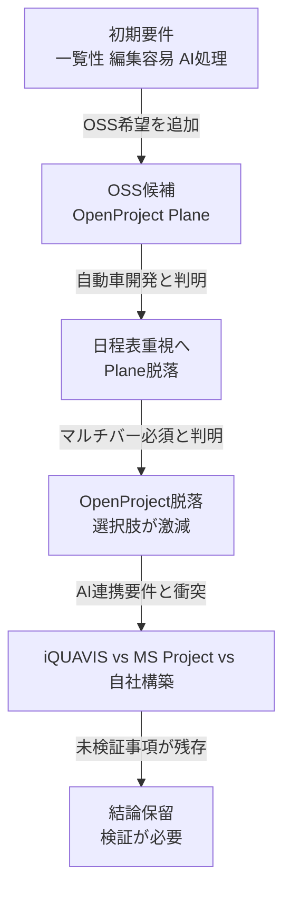
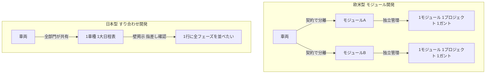
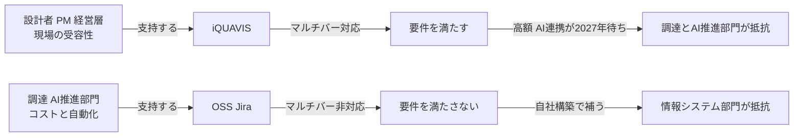
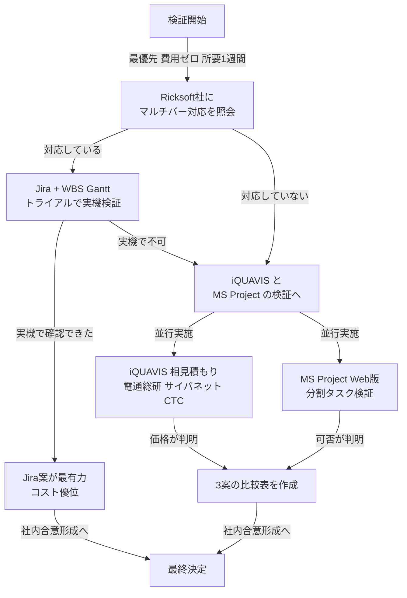

# 開発日程管理ツール 比較検討レポート

**作成日**: 2026年7月16日
**対象**: 自動車開発における日程管理ツールの選定
**目的**: 全関係者が受け入れ可能な日程管理ツールを1つ定める

---

## 0. エグゼクティブサマリ

本レポートの結論を先に示す。

**「1行マルチバー表示」を必須要件とする限り、Web型の日程管理ツールで要件を満たすものは調査範囲内に存在しない。** OSS（OpenProject、Plane）、Jira系プラグイン（WBS Gantt-Chart、BigPicture）、Polarion（Nextedy GANTT拡張）、Smartsheet のいずれも「1タスク＝1行＝1バー」構造であり、フェーズを横並べする表示形式を標準機能として持たない。

この要件を満たす選択肢は以下の3つに絞られる。

1. **iQUAVIS**（国内外220社超・57,000ユーザー、日本の自動車日程表文化に最適化、高額）
2. **MS Project デスクトップ版**（分割タスク対応、Web共有が弱い、ブランド移行期）
3. **自社構築**（Bryntum Gantt等のJSライブラリ組み込み、自由度最大、開発リソース必要）

ただし本レポートは**結論を確定していない**。理由は第7章に示す3つの未検証事項があるためである。

---

## 1. 検討の経緯と要件の変遷

### 1.1 当初要件

検討開始時の要件は以下の3点であった。

| 要件             | 内容                        |
| ---------------- | --------------------------- |
| 一覧性が良い     | 全体を俯瞰できること        |
| 容易に編集できる | Excelのような操作感         |
| AIで処理しやすい | LLM・AIエージェントとの連携 |

加えて「OSSであること」が希望条件として提示された。

### 1.2 要件の追加と絞り込み

検討の過程で、以下の要件が段階的に明確化された。

**要件の変遷:**



この図は、要件が明確化されるたびに候補が減少していった経緯を示す。特に「マルチバー必須」の判明が決定的な分岐点であった。

### 1.3 マルチバー要件の定義

本レポートで「マルチバー」とは、以下の表示形式を指す。

**マルチバー表示のイメージ:**

```text
【日本の自動車日程表・慣行の形式】
車種A | [構想]-[設計]--[試作]-[量試]-◆SOP
車種B |    [構想]-[設計]--[試作]-[量試]-◆SOP
車種C |       [構想]-[設計]--[試作]-[量試]

【一般的なガントツールの形式】
車種A 構想 | --
車種A 設計 |   -----
車種A 試作 |        --
車種A 量試 |          --
車種A SOP  |             ◆
車種B 構想 |    --
車種B 設計 |      -----
（以下、車種ごとに5行ずつ増加）
```

上段が日本の自動車OEMで慣行的に使われる形式、下段が調査したツールの標準形式である。3車種の場合、上段は3行、下段は15行となる。壁掲示や大部屋での指差し確認を前提とする運用では、この差が決定的となる。

---

## 2. 調査したツール一覧

日程管理を主機能とするツールと、他機能の一部として日程管理を持つツールの双方を、日程管理機能そのもので評価した。

| ツール                   | 本体の性格         | 日程機能の位置づけ          |
| ------------------------ | ------------------ | --------------------------- |
| OpenProject              | プロジェクト管理   | 主機能                      |
| Plane                    | プロジェクト管理   | 主機能                      |
| Redmine                  | プロジェクト管理   | 主機能                      |
| Jira + WBS Gantt-Chart   | 課題管理 + 拡張    | 拡張で追加                  |
| Jira + BigPicture        | 課題管理 + 拡張    | 拡張で追加                  |
| MS Project / Planner     | プロジェクト管理   | 主機能                      |
| ProjectLibre             | プロジェクト管理   | 主機能                      |
| GanttProject             | プロジェクト管理   | 主機能                      |
| TaskJuggler              | スケジューラ       | 主機能                      |
| Smartsheet               | 表計算型ワーク管理 | 主機能の一つ                |
| Polarion + Nextedy GANTT | ALM + 拡張         | 拡張で追加                  |
| iQUAVIS                  | MBSE / 設計支援    | 3軸の一つ（業務の見える化） |
| 自社構築（Bryntum等）    | ライブラリ         | 自由                        |

---

## 3. マルチバー要件による評価

### 3.1 評価結果

**調査で判明した事実のみを記載する。**

| ツール                     | マルチバー     | 根拠                                                                                                                                                              |
| -------------------------- | -------------- | ----------------------------------------------------------------------------------------------------------------------------------------------------------------- |
| OpenProject                | 非対応         | 1ワークパッケージ＝1行＝1バー。公式ドキュメントに分割バー機能の記載なし                                                                                           |
| Plane                      | 非対応         | 同上構造                                                                                                                                                          |
| Jira + WBS Gantt-Chart     | 未確認（後述） | MS Project互換を標榜するが、分割バーの明記なし                                                                                                                    |
| Jira + BigPicture          | 非対応         | 公式コミュニティで「タスクを途中で分割したい」という質問に対し、回答は「タスクをクローンして2つに分ける」であった                                                 |
| Polarion + Nextedy GANTT   | 非対応         | 1ワークアイテム＝1バー構造                                                                                                                                        |
| Smartsheet                 | 非対応         | 公式コミュニティに「各プロジェクトのフェーズを1行に横並べしたい（スワイムレーン形式）」という要望が投稿されている。要望として存在するということは標準機能ではない |
| MS Project デスクトップ版  | 対応           | 分割タスク（Split Task）機能を標準搭載                                                                                                                            |
| MS Project Web版 / Planner | 未確認（後述） | デスクトップ版の分割タスクがWeb版にあるかは要検証                                                                                                                 |
| ProjectLibre               | 対応           | MS Project互換を標榜、.mpp読み書き可                                                                                                                              |
| iQUAVIS                    | 対応（要検証） | 日本の自動車日程表文化に最適化された設計。ただしマルチバー表示の可否を公式資料で直接確認できていない                                                              |
| 自社構築（Bryntum等）      | 対応           | JSライブラリとして分割バーをサポート                                                                                                                              |

### 3.2 BigPictureの事例が示すもの

Atlassianコミュニティにおける「BigPicture - how to split tasks in the middle」の議論は、この問題の本質を明確に示している。

質問者は「タスクBの途中に緊急タスクDが割り込み、タスクBが分断される。これをガント上でどう表現するか」と尋ねた。回答は「タスクBをクローンして別タスクとして作り、依存関係を張り直す」というものであった。

つまり**1つの作業を1行に分割表示するのではなく、2つのタスクとして2行に分けろ**という回答である。これがJira系プラグインにおける「分割バー」の現実的な扱いである。

### 3.3 Smartsheetの事例が示すもの

Smartsheetコミュニティには、本検討と同一の要望が投稿されている。「50件超のプロジェクトを1つのガントで見たい。各プロジェクトとその全フェーズを1行に凝縮し、フェーズを同じ行に水平に積み重ねたい（スワイムレーン形式）。子行にはしたくない」という内容である。

この投稿が「要望」として存在すること自体が、標準機能では実現できないことの証左である。

---

## 4. 欧米ツールがマルチバーを持たない理由（考察）

本章は調査に基づく**考察**であり、確定した事実ではない。

### 4.1 開発文化の差

**開発モデルの構造的差異:**



欧米のモジュール開発では各モジュールが疎結合で管理され、「1タスク1行」で十分である。日本のすり合わせ開発では全部門が同一の大日程表を共有し、一枚絵での俯瞰が求められる。この差がツールの設計思想に反映されている。

### 4.2 OpenProjectの開発主体

OpenProjectはドイツのOpenProject GmbHが主導するOSSであり、主要顧客はドイツ政府機関（openDesk採用）、欧州の公共・大学・建設・ITサービス業である。日本の自動車OEM固有の表示要件が製品ロードマップの優先順位に入る可能性は低いと考えられる。

---

## 5. 主要候補の詳細

### 5.1 iQUAVIS

**基本情報（公式サイトで確認できた事実）**

| 項目       | 内容                                        |
| ---------- | ------------------------------------------- |
| 提供元     | 株式会社電通総研                            |
| 提供開始   | 2006年                                      |
| 導入実績   | 国内外220社超（2026年6月時点の公式発表）    |
| ユーザー数 | 57,000以上（Microsoft Marketplace掲載情報） |
| 最新版     | Ver10.0（2026年2月13日リリース）            |
| 対応OS     | Windows（Web版あり）                        |
| 認証       | ISO 26262 認証取得済み                      |

**Ver10.0の強化点（公式発表）**

- 日程表における拠点間・企業間連携機能
- Web版機能強化（日程表およびワークシートの編集強化）
- 明示的に記録しなかった保存時情報（履歴）が利用可能になり、データ差分をより詳細に確認可能

**重要な最新動向（2026年6月26日発表）**

電通総研は、iQUAVISに独自開発の「技術ばらしAIエージェント」を搭載し、**2027年1月**にバージョンアップ版の提供を開始すると発表した。自社の生成AIソリューション「Know Narrator」の技術・基盤を活用し、マルチモーダルRAGにより画像や図表を元にした技術ばらしを実現、マルチRAGエージェントで役割分担して複雑なタスクを処理するとされる。

**この発表は本検討にとって重要である。** 検討過程では「iQUAVISはAI連携が弱い」と評価していたが、少なくとも方向性としては覆りつつある。ただし提供は2027年1月予定であり、現時点では未提供である。

**日程管理機能（代理店CTCの公開情報より）**

- タスク同士の関連性を日程表内で表現可能
- プロジェクト横断で関連タスクへアクセス可能
- 複数プロジェクトを横断した組織／個人単位の負荷状況を確認可能
- リソース状況を見ながら負荷を考慮した計画策定
- タスク毎にINPUT/OUTPUTを定義可能

**API（公式契約書 T25-008-1 より確認）**

iQUAVIS製品固有条件には、API Runtime License/SDK（開発用ソフトウェア）の条項が存在する。API Runtime License 1ライセンスにつきAPI連携用ライセンスが1ライセンス付与される構造である。

つまりAPIの利用には**本体ライセンスとは別のライセンス購入が必要**である。またAPI/SDK情報共有サイト（ICC）へのアクセスにもAPI購入が必要であり、仕様書は購入者限定で公開されている。

**価格**

公開価格なし。ライセンス形態はNamedのみ、またはNamed＋同時アクセスの2パターン、サブスクリプション契約。サービスチケットが付帯。

> **Ballpark見積（推定・ライセンス数・契約形態・代理店により変動大／公開価格なし・要見積もり）**
>
> - 100人規模での年額: **3,000万円〜1億円**
> - API Runtime License: **本体の20〜40%相当の追加**
>
> **上記は業界相場からの推測であり、公式情報ではない。** 商用ALMの実売価格は同一製品でも構成比・代理店マージン・複数年契約・導入支援費の有無により3〜5倍動くことが一般的である。代理店が複数存在する（サイバネット、CTC等）ため、相見積もりにより2〜3割の変動が見込まれる。

### 5.2 MS Project / Planner

**2026年時点の状況（公式情報）**

Microsoftは製品をPlannerファミリーにリブランドした。現在の構成は以下である。

| プラン                                | 月額（公開価格）      | デスクトップ版 |
| ------------------------------------- | --------------------- | -------------- |
| Microsoft Planner（基本）             | M365 Enterpriseに同梱 | なし           |
| Planner Plan 1                        | 10 USD/user           | なし           |
| Planner and Project Plan 3            | 30 USD/user           | あり           |
| Planner and Project Plan 5            | 55 USD/user           | あり           |
| Project Professional 2024（買い切り） | 1,409.99 USD          | あり           |
| Project Standard 2024（買い切り）     | 719.99 USD            | あり           |

**重要な注意事項**

- **Microsoft ProjectはM365に含まれない。** 別途契約が必要である
- **Project Onlineは2026年9月30日にサービス終了。** 2026年4月1日から新規PWAサイトの作成がブロックされている
- **Planner and Project Plan 5は2026年5月1日にEnd of Sale。** 新規購入不可
- Copilot利用には別途Microsoft 365 Copilotライセンス（30 USD/user/月）が必要

> **Ballpark見積（公開価格ベース・為替と契約形態により変動）**
>
> - 100人 × Plan 3 = 3,000 USD/月 = 36,000 USD/年（**約540万円／年**、1USD=150円換算）
> - 100人 × Plan 3 + Copilot = 72,000 USD/年（**約1,080万円／年**）
> - Project Professional 買い切り × 100 = 140,999 USD（**約2,100万円／初回のみ**）
>
> 上記は米国公開価格からの単純換算である。日本国内価格、ボリュームディスカウント、既存M365契約との組み合わせにより変動する。

**マルチバー対応の状況**

デスクトップ版は分割タスク（Split Task）機能を標準搭載しており、マルチバー要件を満たす。ただしWeb版（Planner）に同機能があるかは**未確認**である。デスクトップ版とWeb版の機能差は本検討の重要な論点であり、検証が必要である。

### 5.3 Jira + ガントプラグイン

**WBS Gantt-Chart for Jira（Ricksoft社・日本）**

公式情報から確認できた事実を記す。

- MS Project ライクなインターフェースを標榜
- MS Projectファイル（.mpp）のインポート、XML形式でのエクスポートに対応（Version 9.4以降）
- 4種類の依存関係（SS、FS、SF、FF）に対応
- クリティカルパス表示、ベースライン、進捗線に対応
- 最大10,000課題まで高速動作
- 無制限の階層的親子関係を設定可能
- 日本企業製であり、日本語サポートあり

MS Project互換を強く打ち出しているため、マルチバー対応の可能性が最も高い候補である。ただし**公式資料に分割バー（1行複数バー）の明記を発見できなかった**。要検証事項である。

**BigPicture（Appfire社）**

- ポートフォリオ管理に強い
- WBSとガントを統合
- グルーピング機能でタスクを集約可能（ただし行数は減らない）
- **分割バーは非対応**（前述のコミュニティ回答による）

**Ballpark見積（Atlassian Marketplace の課金体系による・要確認）**

Jira本体 + プラグインの2重課金構造となる。ユーザー数階層による段階価格であり、100人規模では**年額数百万円規模**と推定される（推定・要見積もり）。iQUAVISの1/10以下、MS Projectと同程度かやや安いオーダーである。

### 5.4 Polarion + Nextedy GANTT

**確認できた事実**

- Polarion本体（Siemens）はALMツールであり、**ガント機能は標準搭載ではない**
- ガント表示にはNextedy社の拡張「Nextedy GANTT」が必要
- Nextedy GANTTはドラッグ＆ドロップ対応、依存関係管理、ベースライン差分表示に対応
- Schaeffler（独・自動車部品大手）の Product Owner による推薦コメントが公式サイトに掲載されている
- **ライセンス構造**: Nextedy GANTT Named Active User に加え、サーバー単位の「Nextedy GANTT Connect」ライセンスが必須。さらに Nextedy GANTT Named Active User には Polarion User License の割り当ても必要
- Polarion本体の最新版は Polarion 2606（2026年5月28日リリース）

**評価**

Polarion + Nextedy GANTT は「ALM本体 + ガント拡張 + Connectライセンス + Polarionユーザーライセンス」の4重構造であり、日程管理のみを目的とするには構成が複雑かつ高コストである。またワークアイテム単位のバー表示であり、マルチバーには非対応と判断される。

日程管理ツールとしてPolarionを選ぶ合理性は低い。ただしA-SPICE準拠のALMが別途必要な場合、その一機能として日程を扱う選択肢はあり得る。

### 5.5 OSS候補（参考）

| ツール       | ライセンス                                     | マルチバー                   | 評価                                                                                                                                  |
| ------------ | ---------------------------------------------- | ---------------------------- | ------------------------------------------------------------------------------------------------------------------------------------- |
| OpenProject  | GPLv3                                          | 非対応                       | ガント・WBS・マイルストーン・ベースラインは充実。実績として欧州自動車メーカーの40,000ユーザー規模の稼働事例あり。マルチバー要件で脱落 |
| Plane        | OSS（Community Edition無料・ユーザー数無制限） | 非対応                       | ネイティブMCPサーバー実装、Projects-as-Code思想。AI連携は最先端だが、アジャイル思想で日程表文化と不一致                               |
| Redmine      | GPLv2                                          | 非対応                       | 枯れている。ガント標準装備                                                                                                            |
| ProjectLibre | OSS                                            | 対応                         | MS Project互換、.mpp読み書き可。デスクトップ単独、Web共有・API連携が弱い                                                              |
| TaskJuggler  | GPL                                            | 対応（レンダリング設定次第） | テキストDSLでGit管理可、AI連携に最適。ただし設計者が直接触るのは非現実的                                                              |

---

## 6. 評価マトリクス

### 6.1 全候補の横並び比較

| 評価軸                 | OpenProject  | Plane        | Jira+WBS       | MS Project        | Polarion+Nextedy | iQUAVIS            | 自社構築 |
| ---------------------- | ------------ | ------------ | -------------- | ----------------- | ---------------- | ------------------ | -------- |
| マルチバー             | 非対応       | 非対応       | 要検証         | 対応（Desktop）   | 非対応           | 対応（要検証）     | 対応     |
| Web共有                | 良           | 良           | 良             | 弱（Desktop）     | 良               | 良（Ver10強化）    | 良       |
| 一覧性                 | 中           | 中           | 中             | 良                | 中               | 良                 | 設計次第 |
| 編集容易性             | 中           | 中           | 良             | 良                | 中               | 良                 | 設計次第 |
| API公開                | 全公開・無料 | 全公開・無料 | 公開           | Graph API         | 公開             | 別料金・購入者限定 | 自由     |
| AI連携（現時点）       | 自前構築で可 | MCP標準      | 自前構築で可   | Copilot（別料金） | 自前構築で可     | 2027年1月予定      | 自由     |
| 自動車開発適合         | 低           | 低           | 中             | 中                | 中               | 高                 | 設計次第 |
| 日本語サポート         | 弱           | 弱           | 強（国産）     | 中                | 中               | 強                 | 自社     |
| 導入実績（国内自動車） | 不明         | 不明         | 有（メーカー） | 有                | 有               | 220社超            | なし     |
| ライセンス費           | 無料         | 無料         | 中             | 中                | 高               | 高                 | 開発費   |

### 6.2 「みんなが受け入れる」観点での評価

本検討の目的は「全関係者が受け入れる日程管理ツールを1つ定める」ことである。関係者別に受容性を評価する。

| 関係者           | 重視する点                          | 最も受け入れやすい                      | 最も抵抗される       |
| ---------------- | ----------------------------------- | --------------------------------------- | -------------------- |
| 設計者           | Excelに近い操作感、学習コストの低さ | iQUAVIS、MS Project                     | OSS全般、TaskJuggler |
| PM・日程担当     | マルチバー、影響波及の可視化        | iQUAVIS                                 | OpenProject、Plane   |
| 経営層           | 一枚絵での俯瞰、報告のしやすさ      | iQUAVIS、MS Project                     | OSS全般              |
| 情報システム部門 | 運用負荷、セキュリティ、サポート    | iQUAVIS（ベンダー保守）                 | 自社構築             |
| サプライヤー     | 日程表の受け渡し                    | iQUAVIS（Ver10で企業間連携）、Excel出力 | 社内限定ツール全般   |
| 調達・購買       | コスト                              | OSS、Jira                               | iQUAVIS              |
| AI推進部門       | API、自動化                         | Plane、OpenProject                      | iQUAVIS（現時点）    |

**この表が示す構造的な対立:**



この図が示すとおり、**全員が受け入れる選択肢は現時点で存在しない**。どの選択肢を採っても、いずれかの関係者に妥協を求めることになる。これが本検討の核心である。

---

## 7. 未検証事項

本レポートは結論を確定しない。以下の3点が未検証であり、これらの答え次第で結論が変わるためである。

### 7.1 iQUAVISの実売価格

**確認すべきこと**: 100人規模での年額、API Runtime Licenseの価格、段階導入の可否

**確認方法**:

- 電通総研 製造エンジニアリング本部（g-iquavis-info@group.dentsusoken.com）
- サイバネット（iquavis-sales@cybernet.co.jp）
- CTC（伊藤忠テクノソリューションズ）
- 上記複数から相見積もりを取得

**この検証が結論に与える影響**: 年額が想定を大きく下回る場合、iQUAVIS採用の合理性が高まる。逆に想定を大きく上回る場合、自社構築の検討価値が上がる。

### 7.2 Jira + WBS Gantt-Chart のマルチバー対応可否

**確認すべきこと**: 1行に複数バー（分割バー）を表示できるか

**確認方法**:

- Ricksoft社に直接問い合わせ（日本企業のため日本語で確認可能）
- Atlassian Marketplace の30日間無料トライアルで実機検証
- 公式ドキュメント https://docs.ricksoft-inc.com/ の確認

**この検証が結論に与える影響**: **これが最重要である。** もし対応していれば、「マルチバー × Web共有 × API充実 × 国産サポート × 価格がiQUAVISの1/10」を満たす可能性があり、検討全体の結論が覆る。

### 7.3 MS Project Web版（Planner）の分割タスク対応可否

**確認すべきこと**: デスクトップ版の分割タスク機能がWeb版にもあるか

**確認方法**:

- Microsoft 365管理者に確認
- Planner Plan 3 の試用

**この検証が結論に与える影響**: 対応していればMS Projectが有力候補に浮上する。非対応の場合、MS Projectは「デスクトップ版のみ = Web共有不可」となり、Excelの置き換えとしては不十分となる。

### 7.4 その他の前提条件

以下は本検討で確認できていない社内側の条件である。

| 項目                                           | 影響                                          |
| ---------------------------------------------- | --------------------------------------------- |
| Python / Git を扱える人材が社内に1名以上いるか | Gitバッチ案・自社構築案の実現可能性を左右する |
| Microsoft 365 の既存契約状況                   | MS Project案のコストを左右する                |
| Jira の既存利用状況                            | Jira案の導入障壁を左右する                    |
| 年間予算の上限                                 | iQUAVIS案の可否を左右する                     |
| 対象は社内のみか、協力会社を含むか             | ライセンス数とセキュリティ要件を左右する      |

---

## 8. 推奨する次のアクション

結論を出す前に、以下の順で検証することを推奨する。

**検証の順序:**



この図の要点は、**費用がかからず最も結論を左右する検証（Ricksoft社への照会）を最初に置く**ことである。ここで対応が確認できれば、以降の高額な検討を省略できる可能性がある。

### 8.1 具体的なアクション

| 優先度 | アクション                                                | 所要     | 費用                    | 担当         |
| ------ | --------------------------------------------------------- | -------- | ----------------------- | ------------ |
| 1      | Ricksoft社にマルチバー対応可否を照会                      | 1週間    | 0円                     | 検討担当     |
| 2      | iQUAVIS 操作体験ワークショップ「開発日程管理」に参加      | 半日     | 0円                     | 検討担当＋PM |
| 3      | iQUAVIS 相見積もり取得（複数代理店）                      | 2〜4週間 | 0円                     | 調達         |
| 4      | MS Project Web版の分割タスク検証                          | 1週間    | 0円（既存M365があれば） | 情シス       |
| 5      | 現行Excel日程表の実態調査（ファイル数、メンテ人数、行数） | 1週間    | 0円                     | PM           |
| 6      | 社内のPython/Git人材の有無を確認                          | 数日     | 0円                     | 検討担当     |

### 8.2 iQUAVIS ワークショップについて

電通総研は「iQUAVIS 操作体験のワークショップ」をテーマ別に開催している。テーマは以下の4つである。

- 不具合未然防止（FMEA / DRBFM）
- **開発日程管理**
- システム設計
- 構想設計段階での性能検証（MBD）

本検討の目的からは「**開発日程管理**」に参加すべきである。資料を読むより実機を触るほうが、マルチバー対応の可否を含めた判断が早い。

申込先: https://mfg.dentsusoken.com/event/detail/iquavis-odws-schedule-manage.php

なお、既存ユーザー向けには個別ワークショップの制度もある。

---

## 9. 参考: 情報源

本レポートで参照した主な公式情報源を示す。

| ツール                       | URL                                                                                |
| ---------------------------- | ---------------------------------------------------------------------------------- |
| iQUAVIS（電通総研）          | https://mfg.dentsusoken.com/product/iquavis/                                       |
| iQUAVIS AIエージェント発表   | https://www.dentsusoken.com/news/release/2026/0626.html                            |
| iQUAVIS（サイバネット）      | https://www.cybernet.co.jp/iquavis/                                                |
| iQUAVIS（CTC）               | https://www.ctc-g.co.jp/solutions/iquavis/                                         |
| iQUAVIS 製品固有条件         | https://www.dentsusoken.com/sites/dentsusoken_default/files/2025-06/iQUAVIS_ST.pdf |
| WBS Gantt-Chart for Jira     | https://www.ricksoft-inc.com/products/wbs-gantt-chart-for-jira/                    |
| WBS Gantt-Chart ドキュメント | https://docs.ricksoft-inc.com/                                                     |
| BigPicture                   | https://bigpicture.one/                                                            |
| Nextedy GANTT for Polarion   | https://www.nextedy.com/product/nextedy-gantt/                                     |
| OpenProject                  | https://www.openproject.org/                                                       |
| Plane                        | https://plane.so/                                                                  |
| Smartsheet                   | https://www.smartsheet.com/                                                        |

---

## 10. 本レポートの限界

以下を明記する。

1. **価格情報は推定を含む。** iQUAVIS、Jira構成の価格は公開されておらず、業界相場からの推測である。実売価格は3〜5倍のレンジで変動しうる。見積取得が必須である。

2. **マルチバー対応の可否は、公式資料に明記がないものを「未確認」とした。** 「非対応」と記載したものは、公式コミュニティでの回答や要望投稿など、間接的な証拠に基づく判断である。実機検証を経ていない。

3. **iQUAVISのAI連携評価は流動的である。** 2026年6月26日の発表により、2027年1月にAIエージェントが搭載される予定である。現時点（2026年7月）では未提供であり、実機での評価はできない。

4. **社内の前提条件が未確認である。** 予算規模、既存契約、人材、対象範囲が不明なまま作成している。これらが判明すれば結論はより具体化する。

5. **本レポートは日程管理ツールに範囲を限定している。** 要件管理（StrictDoc等）、作図（Excalidraw等）、Git連携による自動化構想は対象外とした。これらは別途の検討事項である。

---

## 11. 所見

最後に、検討を通じての所見を述べる。

**マルチバーという一点が、選択肢のほぼ全てを切り捨てた。** これは技術的な優劣の問題ではなく、日本のすり合わせ開発文化と欧米のモジュール開発文化の差が、ツールの設計思想に反映された結果である。どちらが正しいという話ではない。

**その結果、二者択一の構図が生まれている。** 現場の受容性（設計者・PM・経営層）を取るならiQUAVIS、コストとAI連携（調達・AI推進部門）を取るならOSSまたはJira。前者は高額でAI連携が2027年待ち、後者はマルチバー要件を満たさない。

**この対立を解消しうる唯一の可能性が、Jira + WBS Gantt-Chart である。** 国産ベンダー製でMS Project互換を標榜し、価格はiQUAVISの一桁下、APIも公開されている。もしマルチバーに対応していれば、全ての関係者が受け入れうる解となる。**したがって、この一点の確認を最優先とすべきである。**

対応していなかった場合、選択は「iQUAVISを買う」か「自社で作る」の二択に収束する。その判断材料として、iQUAVISの実売価格が必要である。
