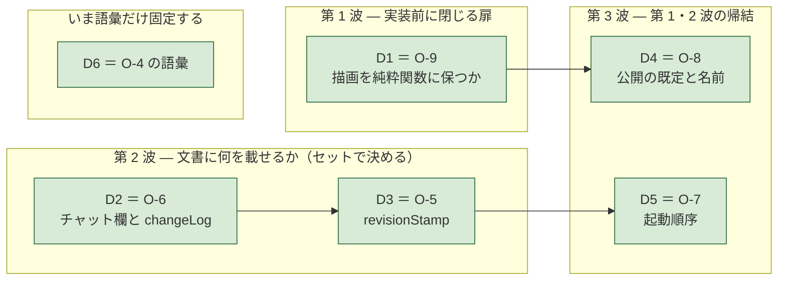

# Agent Interface の未決 2 件（＋ 実測で決着 8 件・決定 6 件）

- 日付: 2026-08-02
- **`../OPEN-ITEMS-ja.md` とは別物である。** あちらは MS Project の実機でしか
  分からない 3 件。本書は**この領域の未決**である。合流させない。
- 各件に **「決め方」** を書いた。決め方が書けないものは未決ですらない。

---

## 0. 実測で決着した 8 件（2026-08-02）

**測定環境は 3 系統ある。どの決着がどれで測られたかを混ぜないこと。**

| 系統 | 環境 | 再現方法 | 測った決着 |
|---|---|---|---|
| **人が操作** | Microsoft Edge 151（Chromium 151）/ Windows 11 / **`file://` で直接開いた本物のページ** | `ai-cowork-trial/file-protocol-probe.html` をダブルクリック | 決着-1 / 決着-2 / 決着-3 |
| **外部から自動操作** | Playwright の Chromium 1228（本リポジトリの devDependencies に既存） | `node ai-cowork-trial/file-protocol-automation-probe.mjs` | 決着-4 / 決着-5 |
| | 同上 | `node ai-cowork-trial/agent-api-exposure-probe.mjs` | 決着-6 |
| **人が起動した本物の Edge へ外部から接続** | Edge 151 を**デバッグポート付き・使い捨てプロファイル**で人間が起動し、`file://` を開いた状態へ Playwright が接続 | `msedge.exe --remote-debugging-port=9222 --user-data-dir=…` で `cowork-live-probe.html` を開き、`node ai-cowork-trial/cowork-live-attach.mjs` | 決着-7 |
| **外部から自動操作**（永続プロファイル） | Playwright の Chromium 1228 を**同じプロファイルで 2 回起動**し、`file://` の別フォルダ間で保管庫を突き合わせた | `node ai-cowork-trial/startup-storage-probe.mjs` | 決着-8 |

Edge の `navigator.userAgent` 実測値:
`Mozilla/5.0 (Windows NT 10.0; Win64; x64) AppleWebKit/537.36 (KHTML, like Gecko) Chrome/151.0.0.0 Safari/537.36 Edg/151.0.0.0`。

> ⚠️ **素の Chrome では未測定である。** Edge も Playwright の Chromium もエンジンは Chromium だが、
> **推測を断定で書かない**（`../README.md` §0-3）。
> 対応ブラウザの確定は `../NEXT-STEPS-ja.md` 1-1 の仕事である。
> **なお `fetch` の遮断（決着-2）だけは 2 系統の両方で同じ結果が出ている。**

### 決着-1. **`file://` でもファイル保存の仕組みは使える**（旧 O-1）

| 測ったこと | 実測値 |
|---|---|
| `window.isSecureContext` | **`true`** — `file://` は secure context である |
| `typeof window.showSaveFilePicker` | **`function`** |
| `typeof window.showOpenFilePicker` | **`function`** |
| `typeof window.showDirectoryPicker` | **`function`** |
| 実際に呼んだ結果（利用者がキャンセル） | **`AbortError: The user aborted a request.`** |

**`AbortError` は「ダイアログが開いて、利用者が閉じた」ことを意味する。**
オリジンで拒否されているなら `SecurityError` / `NotAllowedError` が返り、`AbortError` にはならない。
**したがって保存ダイアログは `file://` でも開く。**

**追測（2 回目）で、書き戻しまで通した。**

| 測ったこと | 実測値 |
|---|---|
| `showSaveFilePicker()` → `createWritable()` → `write()` → `close()` | **成功** |
| **同じハンドルへの 2 回目の書き込み** | **成功。ダイアログは出なかった**（利用者が画面で確認） |
| 同一セッション内の `queryPermission({mode:'readwrite'})` | **尋ねる前から `granted`** |
| ハンドルを IndexedDB に保存 → **ページをリロード** → 取り出す | **ハンドルは残っていた**（`name` も一致） |
| リロード直後の権限 | **`prompt` に戻る** |
| `requestPermission()` → 書き込み | **`granted` → 書き込み成功** |
| 復帰ダイアログの選択肢 | 「この時間を許可する」「アクセスするたびに確認する」「許可しない」。**「常に許可」は無い** |
| `showOpenFilePicker()` → 読む → 書き戻す | **129 バイト読取 → 196 バイト書戻し、成功** |
| ディスク側の確認 | **ファイルは 1 本だけ。同じパスに上書きされていた。` (1)` は作られていない** |

**何が決まったか**: 往復は **「同じファイルへ上書き保存」で実際に閉じる。**
AI がファイルを書き、人間が GRS で開いて編集し、**同じパスへ保存し直し**、AI が読み直す。
`agent-interface-spec-ja.md` §5-4。

> **同じ「ファイルを書き出す」でも、経路が違えば挙動が正反対だった。**
> ダウンロード（決着-3）は上書きされず ` (1)` が増える。
> 保存の仕組みは**同じ場所を上書きする**。**「編集中のファイル」を持つなら後者しかない。**

> **代償が 1 つある**: リロードのたびに権限が `prompt` に戻り、**利用者の 1 クリックが要る。**
> `file://` の復帰ダイアログに「常に許可」の選択肢が無いため、**この 1 クリックは省けない。**
> 起動のたびに「編集中のファイルへのアクセスを復帰しますか」を出す設計になる。

### 決着-2. **`file://` から隣のファイルは取得できない**（要求 A-13 の前提）

| 測ったこと | 実測値 |
|---|---|
| `fetch('./file-protocol-probe-data.json')` | **`BLOCKED -> TypeError: Failed to fetch`** |
| 同じファイルへの `XMLHttpRequest` | **`BLOCKED -> network error`** |
| `location.search` の読み取り | **可能**（値は空。クエリを付けずに開いたため） |

**何が決まったか**: **URL パラメータで文書を読ませる方式は `file://` では成立しない。**
パラメータ自体は読めるが、そこに書かれたファイルを取りに行けない。
**`file://` で文書を投入する経路は、文書の埋め込み（`A-13`）だけである。**

これで要求 A-13 は「文献／未実測」から **実測** に変わった。

### 決着-3. **ダウンロードの保存先は制御できない。名前は尊重される。衝突は ` (n)`**（旧 O-3）

同じ名前 `grs-file-probe.json` で 2 回書き出し、ディスクを確認した結果:

| 実測 | 値 |
|---|---|
| 保存先 | **既定のダウンロードフォルダ。保存場所は聞かれなかった** |
| 1 回目のファイル名 | `grs-file-probe.json`（**要求した名前がそのまま**） |
| 2 回目のファイル名 | **`grs-file-probe (1).json`**（**上書きされず、` (1)` が付く**） |
| 中身 | 2 つとも別の内容で正しく保存されていた |

**何が決まったか**:

1. **保存先ディレクトリはアプリから制御できない。** 「ここへ保存して」と指示する設計にしない。
2. **ファイル名は尊重される。** 決定的な名前（例: 文書 id ＋ `revision`）を付ければ、
   AI 側は**名前だけで目的のファイルを特定できる**。
3. **上書きされない。** 同名を出し続けると ` (1)` ` (2)` … と増える。
   **「最新のものを読む」処理は、名前の一致ではなく更新時刻で選ぶ必要がある。**
   これは決着-1 の「同じファイルへ上書き保存」を選ぶ理由でもある。

---

### 決着-4. **`file://` のページは外から操作できる**（旧 O-2 の主要部）

**測定方法**: Playwright（Chromium 1228。本リポジトリの devDependencies に既にあるもの）で
`file://` のページを開き、外部プロセスから中の関数を呼んだ。
再現は `node ai-cowork-trial/file-protocol-automation-probe.mjs`。

| 測ったこと | 実測値 |
|---|---|
| `file://` への遷移 | **成功** |
| ページ内から見た `location.protocol` / `origin` | **`file:` / `file://`** — スナップショットではなく**本物の file オリジン** |
| 外部から DOM を読む | **成功** |
| **外部からページ内の関数を呼ぶ** | **成功。** `applyCommands({commands:[…]})` 相当が `{accepted:true, revision:1}` を返した |
| **その呼び出しが画面を変えたか** | **変わった**（`applied 2 command(s) at revision 1`） |
| `file://` のページのスクリーンショット | **取得できた** |
| 兄弟ファイルの `fetch`（決着-2 の別エンジンでの再確認） | **`BLOCKED TypeError: Failed to fetch`** — Edge と同じ |

**何が決まったか**: **AI は `file://` のまま GRS を起動し、API を呼び、画面を確認できる。**
サーバも拡張も要らない。当初の目的「日程の確認・検討・JSON 作成・書き出し」は、
**この経路だけで全部できる**。

> ⚠️ **区別すること。** これは **AI が自分のブラウザで開いた GRS** を操作した測定である。
> **人間が開いている画面**に外から入れるかは別の測定であり、**決着-7 で成立を確認した。**

### 決着-5. **埋め込み時のエスケープ規約は、無いと本当に壊れる**（`A-13` の裏取り）

同じ payload を**エスケープ有り／無し**で埋め込み、両方を `file://` で読み込んで比較した（対照実験）。
payload には日程データに普通に現れる文字を入れてある —
タスク名の中の `</script>`、`<b>bold</b>`、`&`、そして日本語。

| | エスケープ **有り** | エスケープ **無し** |
|---|---|---|
| 起動時に読めたか | **読めた** | **読めない** |
| 往復の同一性 | **完全一致** | — |
| 非 ASCII | **そのまま生存** | — |
| 失敗の中身 | — | `Unterminated string in JSON at position 76` |
| **ページ本文への漏れ** | 無し | **`bold` が本文に出た** |

**何が決まったか**: 規約は経験則ではなく**必須**である。しかも失敗の仕方が悪い。
`</script>` が早期にタグを閉じ、**残りが HTML として解釈されて本文に出る。**

> ⚠️ **これはセキュリティの話でもある。** **埋め込みは実質 HTML のテンプレート処理なので、
> エスケープを怠れば注入が成立する。**
> **タスク名に markup を入れた文書を渡されると、生成した `.html` に混入する。**
> `user-order.md` 62（信頼できない入力・`innerHTML` 直挿し禁止）と同じ土俵に載る。
> `agent-interface-spec-ja.md` §6。

### 決着-6. **「既定で公開しない」は実際に成立する。ただし取り消しはできない**（`O-8` の裏取り）

再現は `node ai-cowork-trial/agent-api-exposure-probe.mjs`。
測定用のページは **GRS ではなく、提案どおりの構造だけを持つ最小の代役**である
（インターフェースはモジュール内、入れ口は `null`、有効化は起動側が置く）。

| # | 測ったこと | 実測値 |
|:--:|---|---|
| **M1** | 何もしないときの `typeof globalThis.grSchedulerAgentApi` | **`undefined`** |
| M1 | `agent` を含むグローバル名の**全数** | **`ondragenter` / `originAgentCluster` の 2 つだけ**（どちらもブラウザ標準。**漏れは無い**） |
| M1 | 外からの呼び出し | **`TypeError: Cannot read properties of undefined`** |
| **M2** | 起動側が起動前に `shouldExposeGrSchedulerAgentApi = true` を置いたとき | **起動時に `true` として読めた** |
| M2 | `typeof` と呼び出し | **`object`。呼び出し成功** |
| M2 | **埋込文書の入れ口** | **`null` のまま** — 有効化は文書に載っていない |
| M2 | **ディスク上のファイル** | **バイト数不変＝ 1 バイトも書き換えていない** |
| **M3** | `file://` の URL に付けたクエリ | **届く。** `location.search` = `"?agentApi=1"`、読めた値は `"1"` |
| **M4** | 名前を消したあとの、**渡し済みの参照** | **動き続けた**（`CALLED -> 7`）。名前自体は消えている |

**何が決まったか**:

1. **既定非公開は演出ではない**（M1）。モジュール内にある限り、外からは名前で辿れない。
2. **有効化はファイルを変えずにできる**（M2）。**埋込文書つき GRS は文書だけを運べばよく、
   権限を運ばない。** 転送されても、受け取った人が普通に開けば非公開のままである。
3. **取り消せない**（M4）。名前を消しても掴まれた参照は生きる。
   **「後から切れる」を安全性の根拠にしてはならない。**

> **M3 の扱い**: クエリという 2 本目の経路が実在することは分かったが、
> **ダブルクリックで開く経路では付けられない**（人間が URL を手で打つことになる）。
> **既定の有効化手段にはしない。**

### 決着-7. **人間が開いている `file://` の画面に、外から入れる**（旧 O-2 残件）

**測定方法**: 人間が Edge 151 を**デバッグポート付き・使い捨てプロファイル**で起動し、
`ai-cowork-trial/cowork-live-probe.html` を開いて **`わたしは人間だ` と入力**し、
**有効化ボタンは押していない**状態から、外部プロセス（`node cowork-live-attach.mjs`）が接続した。
測定用のページは **GRS ではなく最小の代役**（テキスト 1 面 ＋ `revision` ＋ 基準版の照合）である。

| # | 測ったこと | 実測値 |
|:--:|---|---|
| **P1** | 人間が起動したブラウザへ接続 | **成功**（タブ 3 枚を認識） |
| **P2** | 掴んだページの `location.protocol` / `origin` | **`file:` / `file://`** — 本物の file オリジン |
| P2 | 外から DOM を読む | **読めた** |
| P2 | **人間が打った文字を外から読む** | **読めた**（`"わたしは人間だ"`） |
| **P3** | **有効化の前**に API へ届くか | **届かない。** `typeof` = `undefined`、呼び出しは `TypeError` |
| **P4** | **人間が画面のボタンを押した後** | **届いた**（押下まで 115 秒。ブラウザの初回起動案内に対応していた時間） |
| **P5** | 正しい `baseRevision` での書き込み | **受理。** `revision 1 → 2`・`lastEditedBy` = `agent`・**人間の画面のテキストが実際に変わった** |
| P5 | **古い `baseRevision`** での書き込み | **拒否。** `stale-base-revision` ＋ `expectedRevision: 2` ＋ **現在の文書つき** |

**何が決まったか**:

1. **人間が開いている画面に外から入れる。** 決着-4（AI が自分で開いた画面）とは別に、
   **人間が起動し、人間が編集中のページ**で成立した。
2. **ただし前提が 1 つある** — **起動の時点でデバッグポートを開けていること。**
   これは起動時のフラグなので、**すでに普通に起動しているブラウザへ後から入ることはできない。**
3. **関門は二重である。** ① 起動時のフラグ ② 画面での有効化。
   **②が無ければ①だけでは API に届かない**（P3）。**決定-4 の有効化は実際に効く関門である。**
4. **基準版の照合はこの経路でもそのまま働く**（P5）。拒否時に現在の文書が返るので読み直しが要らない。

> ⚠️ **ブラウザ拡張の経路は未測定である**（本セッション中ずっと未接続だった）。
> ただし O-2 が問うていた「**入れるか**」は本測定で答えが出た。
> **拡張は別の入り口の話であって、未決事項ではない。**

### 決着-8. **`file://` のローカルファイルは、保管庫を 1 つしか持たない**（`O-7` の前提）

再現は `node ai-cowork-trial/startup-storage-probe.mjs`。

| # | 測ったこと | 実測値 |
|:--:|---|---|
| **S1** | `file://` のページで localStorage は使えるか | **使える。** `location.origin` は **`file://`** |
| **S2** | **同じフォルダの別ファイル**から見えるか | **見える**（`folder-a/one.html` が書いた値を `folder-a/two.html` が読めた） |
| **S3** | **別フォルダのファイル**から見えるか | **見える**（`folder-b/three.html` からも同じ値） |
| **S5** | IndexedDB も同じか | **同じ。** `folder-b` が書いた値を `folder-a` が読めた |
| **S4** | **ブラウザを完全に落として再起動**したら | **残っていた**（キー数も一致） |

**何が決まったか**:

1. **自動保存のキーは、文書の識別子で分けるしかない。** 素の GRS・埋込文書つき GRS・
   ダウンロード済みの古い複製が**同じ鍵を奪い合う**。
   **`InviteAgentToPage` と `OpenSchedulerWithEmbeddedDocument` を併用する場面は 2 窓同時**なので、
   これは想定上の話ではない。
2. **ファイルハンドルも共有される**（決着-1 で IndexedDB に保持すると決めたもの）。
   **別の複製を開くと、無関係な文書のハンドルが「編集中のファイル」として復帰しうる。**
3. **セキュリティ**: **任意のローカル HTML ページが GRS の自動保存を読める。**
   `security-design.md` §5 の「同一オリジン JS から平文で読める」は、`file://` では
   **「そのマシンの全ローカルファイル」**を意味する。
   **`http(s)` で配信すれば本物のオリジンになり、この問題は消える。**

> ⚠️ **Chromium 1228 での実測であり、他エンジンは未測定。**
> `file://` の扱いはエンジン差が出やすい箇所なので、対応ブラウザ確定時に測り直すこと
> （`../NEXT-STEPS-ja.md` 1-1）。

---

## 0-2. 決める順（**依存と不可逆性で並べた**）

**並べ方の基準は 3 つ。** ① 実装が始まると**閉じてしまう扉**か ② 波及の広さ ③ 依存の向き。
結果は次期の実開発ステップ順（`../NEXT-STEPS-ja.md`）とほぼ一致した。**逆らわない。**

| 順 | 決めること | ステップ | なぜこの順か | 決めると何が書けるようになるか |
|:--:|---|:--:|---|---|
| ~~**D1**~~ | ~~**O-9** 描画を純粋関数に保つか~~ **→ 決定-1 で決着（§0-3）** | 3 | — | **確定**: 描画は純粋関数・成果物は単一 `.html` のみ |
| ~~**D2**~~ | ~~**O-6** チャット欄を MVP に入れるか~~ **→ 決定-2 で決着（§0-3）** | 1 | — | **確定**: チャット欄は入れる・保存は `changeLog` だけ |
| ~~**D3**~~ | ~~**O-5** `revisionStamp` を保存するか~~ **→ 決定-3 で決着（§0-3）** | 5 | — | **確定**: 3 キーを保存・`agentApiVersion` は入れない |
| ~~**D4**~~ | ~~**O-8** 既定で公開するか・公開点の名前~~ **→ 決定-4 で決着（§0-3）** | 3 | — | **確定**: 既定は非公開・人間の明示有効化・公開点は `globalThis.grSchedulerAgentApi` |
| ~~**D5**~~ | ~~**O-7** 起動順序とクラッシュ復旧の衝突~~ **→ 決定-5 で決着（§0-3）** | 3 | — | **確定**: 順序は据置き・負けた自動保存は比べる・キーは文書ごと・起動時の面は 1 枚 |
| ~~**D6**~~ | ~~**O-4 の語彙だけ** — 「競合の解消」と「取込マージ」を別語にする~~ **→ 決定-6 で決着（§0-3）** | 1 | — | **確定**: `ConcurrentUpdate` / `BaseRevisionCheck` / `AutomaticReconciliation` / `ImportMerge` の 4 語 |

### 延期してよい（2 件）

| 項目 | いつ決めるか | 延期してよい理由 |
|---|---|---|
| **O-4 本体**（**自動調停**を持つか） | 多人数編集を実装するとき | **2 者なら「拒否して読み直させる」で足りることを実測済み**（6 回発火・壊れた状態 0 件） |
| **O-10**（エージェントの寿命と追いつき） | サーバを立てるとき | サーバが無ければ保持すべきキューも無い |

### 決定ではなく測定（**0 件 — 決着-7 で解消**）

| 項目 | 結果 |
|---|---|
| ~~**O-2 残件**（人間が開いている画面に外から入れるか）~~ | **決着-7 で成立を確認。** 人間が起動した Edge の `file://` ページへ外部から接続し、**読み・書き・基準版の照合による拒否まで通した**。拡張の経路は未測定だが、問うていた「入れるか」の答えは出ている |

> **D1 だけ性質が違う。** 他の 7 件は「決め直せる」が、D1 は**決めそこねると選択肢が消える**。
> 逆に言えば **D1 以外は、迷ったら先に進んでよい。**

---

## 0-3. 決定した項目

### 決定-1（旧 O-9 ＝ D1）. **描画は純粋関数に保つ。成果物は当面 単一 `.html` だけ**

- **決定日**: 2026-08-02 ／ **決めた人**: ユーザー

| 決めたこと | 内容 |
|---|---|
| **描画** | **DOM 非依存の純粋関数に保つ。** `document` に触らず、SVG 文字列を返す |
| **成果物** | **当面は単一 `.html` だけ。** ライブラリ／CLI は出さない |
| **将来** | 必要になった日に足す。**純粋性さえ保てば後から足せる** |

**理由（ユーザー判断）**: **純粋関数のほうが作りやすい。意図しない競合が起こらないから。**

補強となる材料が 3 つある。

1. **決着-4 で CLI の必要性が下がった。** AI は `file://` のまま GRS を起動し、API を呼び、
   画面を確認できることを実測した。「ブラウザ抜きで」の動機がかなり消えている。
2. **既存の決定と同じ方向を向いている。** Undo は**不変更新スナップショット**が前提
   （`../07-plan-actual/handover-plan-actual-decisions-ja.md` §8）であり、純粋な描画と整合する。
   **CLI を作らなくても元が取れる。**
3. **成果物は後から増やせるが、純粋性は後から取り戻せない。**
   閉じる扉だけ開けておいて、荷物は増やさない。

> **この決定が縛るもの**: `../NEXT-STEPS-ja.md` **3-3 モジュール構成** と **3-4 技術スタック**。
> 描画層が `document` に触れない構成にすること。**レビューの観点として残す。**

### 決定-2（旧 O-6 ＝ D2）. **画面上で AI と会話する。保存するのは「変更の理由」だけ**

- **決定日**: 2026-08-02 ／ **決めた人**: ユーザー

| 決めたこと | 内容 |
|---|---|
| **チャット欄** | **MVP に入れる。** 日程表を見ながら AI に言葉で指示する |
| **保存対象** | **会話は保存しない。**「どの `revision` で・誰が・なぜ変えたか」＝ `changeLog` だけ保存する |
| **上限** | **設けない。** 変更 1 回につき 1 件なので**変更回数で自然に有界** |
| **同梱の承諾** | **`changeLog` は文書に保存され、日程表を渡すと一緒に渡る。** ユーザーが明示的に承諾済み |

**狙い（ユーザー提示のユースケース）**: 日付をドラッグする代わりに**言葉で日程を動かす**。

> 「もっと検証の期間を長くして」
> 「設計と検証は途中から並行にできるでしょ？」

**保存対象を絞った理由（ユーザー判断）**: **トライアルの将棋の会話は要らない。**
実際に 42 通を見返すと、残す価値があったのは「**なぜその手を指したか**」と
「**前の発言は間違いだった**」の 2 種類だけで、感想と雑談には無かった。

**この絞り込みで 3 つ同時に片づいた。**

1. **プライバシーの懸念がほぼ消えた。** 残るのは日程についての記述だけで、
   雑談や人物評が同梱されない。`CLAUDE.md` の条件付きプロセス（法規調査の無効理由が
   「サーバー送信なしのローカルツール」であること）を揺らさずに済む見込み。
2. **文書が肥大しない。** 上限の設計そのものが不要になった。
3. **価値の中心は残る。** 「なぜこの日程になったか」と「前の判断は間違いだった」は
   どちらも変更に紐づくので保存される。

**失うもの**: **何も変更しなかったときの発言は残らない**（「この日程は間に合いません」とだけ言って
何も動かさなかった場合など）。**日程表に残す価値が薄いと判断して受け入れた。**

> **この決定が縛るもの**: `../NEXT-STEPS-ja.md` **2-1 視覚モック**（チャット面が乗る）／
> **2-5 通知**（`Toast` との住み分け）／**5-1 JSON Schema**（`changeLog` を含める）。
> 命名は `note` / `notes` を避けること（`Task.notes` と衝突するため）。
### 決定-3（旧 O-5 ＝ D3）. **`revisionStamp` は保存する。`agentApiVersion` は入れない**

- **決定日**: 2026-08-02 ／ **決めた人**: ユーザー

| 決めたこと | 内容 |
|---|---|
| **保存する** | `revision` / `lastEditedBy` / `updatedAt` の **3 つ** |
| **保存しない** | **`agentApiVersion`**。書いた側の都合であって日程表の情報ではない |

**決定-2 で半分決まっていた。** `changeLog` の各項目が `revision` を持つので、
**版番号が文書に保存されること自体は確定済み**だった。残っていたのは「いまの版はいくつか」だけである。

**保存する理由**: 決着-1 で**ファイルが往復の運び手**になった。AI が書いたファイルに人間が上書き保存し、
AI が読み直す。このとき版が乗っていないと、**AI は「自分が書いたままか、人が直した後か」を
中身の全比較でしか判定できない。**

**`agentApiVersion` を外す理由**: 入れると**版が上がるたびに全ファイルの diff が出る**。
読み込む側は自分の版で解釈すればよく、書いた側の版は要らない。

**代償（決定論性）**: 「同じ日程 → 常に同じ JSON」が崩れ、中身が同じでも版が違えば diff が出る。
ただし **`updatedAt` を入れる時点でどのみち発生する**ノイズであり、`revision` の 1 行で悪化しない。
決定論性が本当に要る往復無損失の検査（`user-order.md` 56）は MSPDI の話であり、
**`revisionStamp` は MSPDI へ書き出さない**と既に決めている。

> **この決定が縛るもの**: `../NEXT-STEPS-ja.md` **5-1 JSON Schema**（3 キーを含める）／
> **2-6 初期テンプレート**（新規文書の初期値をどうするか）。

### 決定-4（旧 O-8 ＝ D4）. **既定では公開しない。人間が有効にしたときだけ公開する**

- **決定日**: 2026-08-02 ／ **決めた人**: ユーザー

| 決めたこと | 内容 |
|---|---|
| **既定** | **公開しない。** 素の GRS を開いただけでは、公開点はどこにも存在しない（決着-6 M1） |
| **有効化（人間が起動したとき）** | **画面で「AI と一緒に編集する」を有効にしたときだけ**公開する |
| **有効化（エージェントが起動するとき）** | **ブラウザを動かしている側が起動時に立てる**（`shouldExposeGrSchedulerAgentApi`）。**ファイルにも文書にも載せない**（決着-6 M2） |
| **公開点の名前** | **`globalThis.grSchedulerAgentApi`**。フラットに 1 名。契約の型は `GrSchedulerAgentApi` |
| **無効化** | **「これ以降、名前で探す者」を止めるだけ。渡し済みの参照は取り返せない**（決着-6 M4） |

**理由（ユーザー判断）**:

1. **`OpenSchedulerWithEmbeddedDocument` と `ExchangeDocumentFile` は、既定公開を必要としない。**
   エージェントが起動する場合はエージェント自身が有効化でき（M2。**ファイルは 1 バイトも変わらない**）、
   ファイル交換では API を使わない（決着-1）。**必要としていないものを既定にする理由がない。**
2. **Web サービス化したときに説明責任が要る**（ユーザー指摘）。**危険度が同じでも導入審査は通す必要がある。**
   さらに URL で開く形になると**埋め込みの経路そのものが消える**ので、
   **どのみち明示的な有効化の仕組みが要る。**
3. **可逆性が非対称である。** オフ→オンは非破壊、オン→オフは破壊的変更。**D1 と同じ基準。**
4. **関門が実際に効くことを実測した**（決着-7 P3 → P4）。

> **API は信頼境界ではない。** ページ内でスクリプトを実行できる主体は、API の有無に関わらず
> 内部状態へ到達できる。**したがって既定オフは「攻撃を防ぐ」ためではなく、
> 「断りなく口を開けない」ためである。** 防御は取込検証（`security-design.md` §3）と
> CSP（同 §4）に置いたまま動かさない（`A-7`）。

> **この決定が縛るもの**: `../NEXT-STEPS-ja.md` **3-3 モジュール構成**（公開点は 1 か所だけ）／
> **2-1 視覚モック**（有効化の面が乗る）／
> `../05-security-a11y/security-design.md` の脅威モデルに 1 行。
>
> **D5（O-7）へ送ったもの**（**→ 決定-5 で決着**）: 人間が起動したときの有効化を**毎回聞くか記憶するか**。
> 決着-1 の「編集中のファイルへのアクセス復帰」で**どのみち 1 クリックが要る**ので、
> **同じ起動時の 1 枚にまとめるか**を D5 で決める。
>
> **併記して残す指摘**: クエリによる有効化（決着-6 M3）は成立するが、
> **ダブルクリックで開く経路では付けられないため、既定の手段にはしない。**

### 決定-5（旧 O-7 ＝ D5）. **起動は捨てずに比べる。自動保存は文書ごとに持つ**

- **決定日**: 2026-08-02 ／ **決めた人**: ユーザー

| 決めたこと | 内容 |
|---|---|
| **優先順位** | **埋込文書 → URL パラメータ → 自動保存 → 初期テンプレート**（ドラフトのまま変えない） |
| **負けた自動保存** | **捨てるのではなく比べる**（下の 4 分岐） |
| **自動保存のキー** | **`grsched.autosave.<documentId>`** — 文書ごとに分ける（決着-8） |
| **起動時の面** | 保留中の用件を **1 枚に集約**する |
| **AI 有効化の記憶** | **文書ごとに記憶する。ただし有効な間は画面に常時表示を出す** |

**起動時の 4 分岐**（決定-3 で `revision` / `updatedAt` が文書に載るので、比較で判定できる）:

| 自動保存 と これから表示する文書 | 挙動 | 根拠 |
|---|---|---|
| **同じ文書・自動保存のほうが新しい** | **確認を出す** — これが本当のクラッシュ復旧である | `user-order.md` 60 |
| **同じ文書・自動保存が古いか同じ** | **黙って捨てる** — 既に含まれており失うものが無い | §5 の「サイレント破棄禁止」は**破損**の規定であって**追い越された**場合の規定ではない |
| **別の文書の自動保存** | **確認を出さない。消しもしない** | 保管庫が共有である副作用（決着-8）。他人の文書の話を持ち出さない |
| **壊れている** | **必ず通知し、退避して残す** | `../05-security-a11y/security-design.md` §5 |

**理由（ユーザー判断）**:

1. **埋込文書は誰かの明示的な行為、自動保存は前回セッションの事故である。** 表示は前者が勝つ。
   **ただし「勝つ」と「捨てる」は別**で、後者は比較の対象として残す。
2. **キー設計に選択の余地は無い**（決着-8）。**2 窓同時は現実に起きる**構成である。
3. **どのみち 1 クリックは省けない**（決着-1。`file://` の権限復帰に「常に許可」が無い）。
   **だから枚数を増やさず 1 枚に集約する。**
4. **毎回聞くのは煩わしいが、断りなく開けてもいけない。** 記憶しつつ**常時表示**で両立させる。

> **`documentId` について**: 文書の識別子は現在のデータ構造に無い。
> **これは `../02-data-model/grs-native-erd-ja.md`（データ構造の正）の管轄である。**
> **本ドラフトは「要る理由と最小の形」だけを書き、正への追加は組込み時に change-manager を通す。**
> **ドラフトの側から正へ書き足さない**（`../README.md` §`authority`）。

> **ブラウザの権限ダイアログは 1 枚に統合できない。** クリックを起点にしてしか出せないため、
> 「復帰」を押した**後に**ブラウザのダイアログが出る順になる。

> **この決定が縛るもの**: `../NEXT-STEPS-ja.md` **3-5 localStorage のキー設計**（文書ごと）／
> **2-1 視覚モック**（起動時の 1 枚）／**2-5 通知**（復旧確認と `Toast` の住み分け）／
> `security-design.md` **§5**（`file://` の保管庫は全ローカルファイルで共有される、を 1 行）。

### 決定-6（`O-4` の語彙 ＝ D6）. **同時更新と取込マージを、別の 4 語に分ける**

- **決定日**: 2026-08-02 ／ **決めた人**: ユーザー
- **本体（自動調停を持つか）は延期のまま。** 決めたのは**語だけ**である。

| 英語 | 日本語 | 中身 |
|---|---|---|
| **`ConcurrentUpdate`** | **同時更新** | 2 者以上が同じ文書をほぼ同時に変えようとする現象 |
| **`BaseRevisionCheck`** | **基準版の照合** | 書き込み時に「読んだ版から動いていないか」を確かめ、動いていれば拒否する。**現行の方針** |
| **`AutomaticReconciliation`** | **自動調停** | 拒否せず両方を取り込む将来の選択肢（`O-4` 本体） |
| **`ImportMerge`** | **取込マージ** | 取り込んだファイルを日程表へ合流させる（`user-order.md` 61 の 3 択）。**取込専用** |

**なぜ語だけ先に分けるか**: **前プロジェクトのバグ根因が語彙の重複だった**
（`../06-background/refactor-gui-data-separation-ja.md`）。**機能を作る前に語を分けるのは安い。**

**調べたら、重なりは想定より広かった。** 正の側が 2 語とも使っていた。

| 語 | 正での用法 |
|---|---|
| **マージ** | 取込の合流（`grs-native-erd-ja.md` §5.4 **マージ規約**／`TaskOrigin` は「マージの既定判定にのみ使う」） |
| **衝突** | **取込時の UID 衝突**（同 §5.3「3 択で解消される」） |

**したがって `O-4` を「競合の解消（自動マージ）」と呼び続けると、取込の語と二重に重なる。**

**`BaseRevisionCheck` の名を選んだ理由**: 業界では **optimistic locking（楽観ロック）** と呼ぶが、
① **何もロックしていない**（名が体を表さない） ② 「楽観」は**衝突がめったに起きない見込み**を指すのに、
**実測では 1 セッションに 6 回発火した**（`A-3`）。
**既存の識別子と語幹も一致する**（`baseRevision` / `stale-base-revision` / `expectedRevision`）。
**散文には「業界では optimistic locking と呼ばれる」と 1 行添える**（既知の概念と繋げられるように）。

**使わないと決めた語**: `Conflict`（直訳が「競合」「衝突」）／`Collision`（ERD の UID 衝突）／
`Resolution`（解像度）／**裸の `Merge`**／**裸の `Lock`**。

> **識別子は 1 つも増えない。** `AutomaticReconciliation` は延期中の機能なので散文の語に留め、
> 既存の `baseRevision` / `stale-base-revision` / `expectedRevision` は**変えない**。
> 将来コード化するときは **コマンドは動詞＋目的語**（レビュー観点規約 R2）——
> `reconcileConcurrentUpdates()` / 型は `ConcurrentUpdatePolicy`。

> **意図的に直さなかった 2 箇所**: 決定-1 の理由「**純粋関数のほうが作りやすい。意図しない競合が
> 起こらないから**」（本書 §0-3 と要求 `A-15`）。**ユーザーの判断の引用であり、語義も別**
> （コード同士の干渉であって同時更新ではない）。**記録された理由を後から書き換えない。**

> **この決定が縛るもの**: **`ImportMerge` は正（`grs-native-erd-ja.md` §5.4）の語を*狭める*提案**である。
> 構造も挙動も変えないが、**命名の正（`../03-ui-naming/handover-ui-parts-ja.md`）へ通す**必要がある。
> その作業は**残作業として立ててある**（`../NEXT-STEPS-ja.md` **2-8**）。**この文書の側から正を書き換えない。**

---

## A. まだ実測できていない（**0 件**）

**本節に残る項目は無い。** 唯一残っていた O-2 残件（人間が開いている `file://` の画面に
外から入れるか）は、**決着-7 で成立を確認した。**

> **測り残しが 1 つあるが、未決ではない**: **ブラウザ拡張を使う経路は未測定**である。
> O-2 が問うていた「入れるか」の答えは決着-7 で出ており、
> **拡張は別の入り口の話**なので、決定や開発をゲートしない。

---

## B. 設計で決めること（2 件）

### O-4. 同時更新の方針

| | |
|---|---|
| **今どこまで** | **基準版の照合**（`BaseRevisionCheck`）だけ実装・実測。後勝ちを禁止し、拒否して読み直させる（**6 回発火**） |
| **決めること** | **自動調停**（`AutomaticReconciliation`）を持つか。持つなら**どの粒度で**（タスク単位 / フィールド単位） |
| **語彙** | **決定-6 で分離済み。** **取込マージ**（`ImportMerge` ＝ `user-order.md` 61 の 3 択）とは**別物**であり、**「マージ」を同時更新の側で使わない** |
| **どこで** | 多人数編集を実装するとき（`user-order.md` 65-1）。**2 者なら現状で足りる** |

### O-10. エージェント側の寿命と追いつき

| | |
|---|---|
| **今どこまで** | トライアルの待機プロセスは**セッションが終わると一緒に死んだ**（実際に 1 回失われた） |
| **争点** | AI が落ちて復帰したとき、取りこぼしなく追いつけるか。**`sinceRevision` の設計上そうなるはずだが未検証** |
| **決めること** | 変更の履歴をどこまで保持するか（サーバ側キューの深さ）。`revision` だけで足りるか、変更の内容も要るか |
| **どこで** | サーバを立てるとき（`user-order.md` 65-1） |

---

## 数

| 区分 | 件数 |
|---|:--:|
| **実測で決着** | **8** |
| **決定済み** | **6**（D1〜D6） |
| A まだ実測できていない | **0** |
| B 設計で決める | 2 |
| **未決の合計** | **2** |
