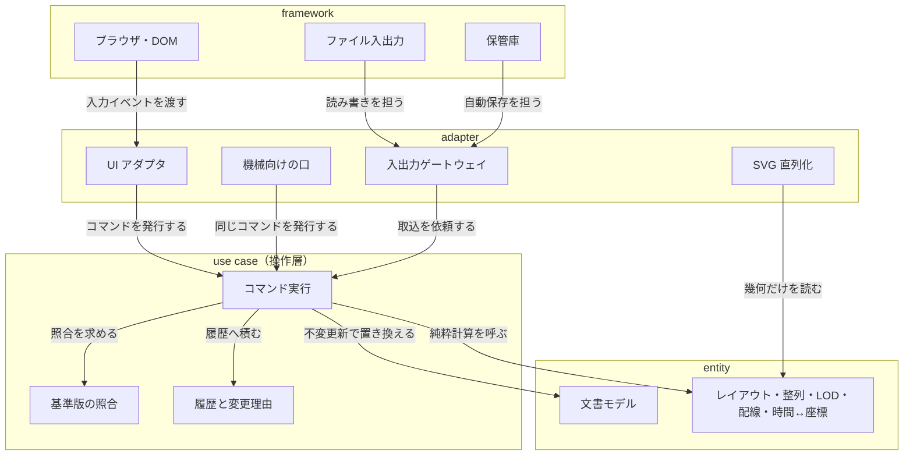

# アーキテクチャ — 層仕訳の推奨案（ドラフト）

- 日付: 2026-08-04
- ⚠️ **これは推奨案であって決定ではない**（ユーザー判断 2026-08-04）。
  **正式版は次期プロジェクトに入ってから詳細を検討して決める。**
- したがって `../NEXT-STEPS-ja.md` の **3-1 / 3-2 / 3-3 / 3-4 は未決のまま**である。
  本書は形を提示するだけで、件数を減らさない。
- **決めていないもの**: モジュール／ディレクトリ構成・技術スタック。
  `architecture-entry-ja.md` §4 の「**意図的な空白**」は動かさない。

---

## 1. 論点

通常、UI は Clean Architecture の外側に置く。本件で問うたのは次の 1 点である。

> **マルチバーのレイアウト・上下左右整列・LOD・依存線の配線・時間↔座標変換は、
> 「画面の都合」なのか、それとも中心に置くべき価値なのか。**

この問いは、実は**もう 1 つの問いと同じものである** — **操作層をどこに置くか。**
中核計算を中心に置くなら、その上に生える操作層も中心側になり、**UI も機械向けの口も等しく外側**から呼ぶ形になる。
UI を外側に置いたまま操作層を UI 側に作ると、**機械向けの口が UI に生える。そこが破綻点である。**

---

## 2. 推奨する層仕訳

| 層 | 置くもの | 純粋性 |
|---|---|---|
| **entity** | 文書モデル（保存される事実）／時間↔座標マッピング／マルチバーのレイアウト（段割当・行高）／整列ソルバ／LOD セレクタ／依存線ルータ／予実差分・イナズマ線の頂点／`Fit` の算出 | すべて `pure` または `semi-pure-a` |
| **use case（操作層）** | コマンド実行（原子的・1 呼び出し = Undo 1 段）／基準版の照合／revision の更新／Undo・Redo 履歴／取込検証／変更理由の追記／変更の通知 | 履歴と revision は `non-pure`。照合と検証は `pure` |
| **adapter** | UI アダプタ（入力 → コマンド、幾何 → 画面）／機械向けの口（既定は非公開）／SVG 直列化／JSON・MSPDI コーデック／ファイル入出力ゲートウェイ／自動保存ゲートウェイ | SVG 直列化とコーデックは `pure`。ゲートウェイと 2 つの口は `non-pure` |
| **framework** | ブラウザ・DOM／File System Access API／localStorage・IndexedDB／単一 `.html` のシェル | すべて `non-pure` |

**依存の向きはすべて内向き。**

**`SVG 直列化` から `geom` への線が操作層を通っていないことが、この図の要点である。**
描画は**読み取りの経路**であって書き込みの経路ではない。決定-1（描画は DOM 非依存の純粋関数）が要求する形そのものである。

---

## 3. 中核計算を entity に置く根拠

**3 つの独立な根拠が同じ答えを指している。**

> ⚠️ **`previous-project-result/` の中で完結しているのは根拠 2 だけである。** 根拠 1（`CLAUDE.md`）と根拠 3
> （レビュー観点規約）は**フレームワーク側の文書**で、引継ぎ資産には入らない（`../DISCARDED-ja.md` 方針 7）。
> **結論は根拠 2 だけでも立つ**が、次期が同じ 3 点を確かめたいなら**フレームワーク側を自分で用意する**必要がある。

| # | 根拠 | 所在 |
|:--:|---|---|
| 1 | ドメイン（レイアウトエンジン・整列・LOD・依存線ルーティング・日付モデル）を entity / use case に置き、SVG 描画・File I/O・localStorage を adapter / framework に分離する | ⚠️ **`CLAUDE.md`「Clean Architecture / DIP 遵守」— この出典は引き継がれない**（`../DISCARDED-ja.md` 方針 7）。**次期は自分の設定で立て直すこと** |
| 2 | 描画は DOM 非依存の純粋関数に保つ（`document` に触らず SVG 文字列を返す） | 決定-1（`../10-agent-interface/agent-interface-open-items-ja.md`） |
| 3 | **ドメインの計算ロジック（業務規則・判断・変換）は `pure` または `semi-pure-a`**（MUST） | レビュー観点規約 **R7.2** |

---

## 4. 唯一の反対論と、その処理

> **反対論**: レイアウトはズーム倍率とビューポート寸法に依存する。それは画面の都合ではないか。

**ズームとスクロールは文書の事実である。** どちらも文書に保存される
（`../02-data-model/grs-document-settings-ja.md`）。したがって entity が読んでよい。

**保存されないのは「ブラウザに訊く寸法」だけ**である。これは **R7.3 のとおり関数の先頭で 1 回読み、引数として注入する。**

**この形は、性能とバグの側から独立に要求されている。**

| 実測された罠 | 何を要求しているか | 所在 |
|---|---|---|
| **T-13** | フレーム内で DOM に寸法を訊かない。寸法はフレームの先頭で 1 回読んでキャッシュし、以後は自前の座標で計算する（キャッシュしただけで 20fps → 176fps） | `../04-performance/performance-notes-ja.md` §3-2 |
| **T-10** | 「0 幅の 1 フレーム」は必ず存在すると仮定する。寸法確定の順序を設計する | 同 |

**つまり「寸法を引数で受ける」は、層の理屈の前に、実測された要求である。**

---

## 5. この案が閉じる破綻点

**`UI アダプタ` と `機械向けの口` が、同じ `コマンド実行` に入る。**
UI 側に特権的な経路が存在しないので、**「機械向けの口が UI に生える」が構造的に起こりえない。**

**この 1 点は、機械連携のために新たに要求されたものではない。**

| 既存の要求 | 何を要求しているか | 所在 |
|---|---|---|
| Undo の方式 | 不変更新スナップショット。**すべての変更が定義された操作を通る**ことが前提 | `../07-plan-actual/plan-actual-decisions-ja.md` §8 |
| 項 62 | **すべての変更が同じ検証を通る**。取込は信頼できない入力として扱う | `../user-order.md` |

**したがって操作層は、機械連携が無くても必須である。** 機械連携が追加で要求するのは
「その操作層を外からも呼べること」だけである。

---

## 6. 純粋性の軸は、層の軸と直交する

上表で **`adapter` に純粋なもの（SVG 直列化・コーデック）があり、`use case` にも純粋なもの（基準版の照合）がある。**
これは誤りではない。**R7 冒頭が「本節は純粋性軸の規約であり、レイヤー軸とは直交する。
一方の軸の違反をもう一方の軸の違反として起票しないこと」と明記している。**

この仕訳を採ると、次が**ディレクトリ単位で機械検査できる**ようになる。

- **R7.2**（計算ロジックは `pure` / `semi-pure-a`）— entity 配下に `non-pure` があれば違反
- **R7.6**（`@purity` タグ付与率 100%）— タグの grep で数えられる

---

## 7. この案が縛らないもの

| 縛らないもの | 理由 |
|---|---|
| **モジュール／ディレクトリ構成** | 層と依存の向きは境界の形であって、ファイルの並べ方ではない。`architecture-entry-ja.md` §4 の空白は残る |
| **技術スタック** | 同上。制約として効くのは単一 `.html`・CSP ハッシュがビルドに結びつくこと・描画層が `document` に触れないことだけ |
| **層の数** | **R2.16 は「層の数は問わない」**と明記している。異なる層構成でも、依存の向きと層の定義が書かれていれば準拠である |

---

## 8. 次期が最初に書くもの

**レビュー観点規約 R2.18（MUST）** は、アーキテクチャ文書に **ADR-000「最小構成との比較」**が
**存在すること**を要求する。**存在しなければ、内容の巧拙以前に違反**である。

書くべきことは 3 つ。

1. **要求を満たす最小の構成**（要求を落とした案は最小構成ではない）
2. 採用案が最小構成に対して**増やした要素の列挙**
3. 各々を**増やした理由**（「規約に従ったため」だけでは足りない。**どの規約がどの要求のために働いたか**まで書く）

**本書はその材料であって、ADR-000 そのものではない。**
