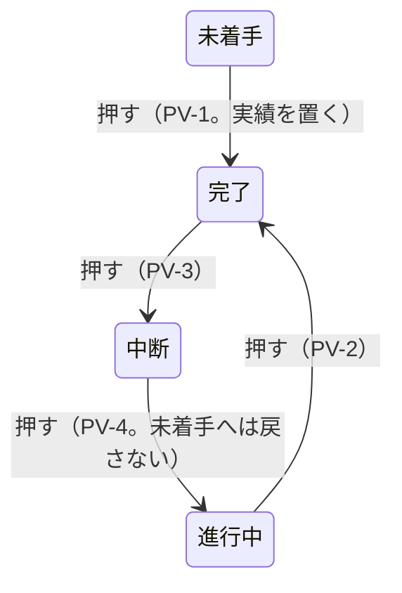

# 掴み代・ポインタ・札・操作 —— 触って決めた実物の見本

- 作った日: 2026-09-18 ／ 決め切った日: 2026-09-19
- 見本: [`grab-area-sizing-sample.html`](grab-area-sizing-sample.html)
  （**1 ファイルで完結する。ダブルクリックすれば開く。** サーバーも通信も外部の書体も要らない）
- 裁定: [`rulings.md`](../../docs/development-records/rulings.md) の `JDG-180`〜`JDG-193`
- 次の段取り: [`handoff.md`](../../docs/development-records/handoff.md) の §1.2（Step 1a〜5）

## 位置づけ

この見本には、利用者が触って決めた規則が**すべて実装されている**。対象は、掴み代・ポインタの形・札の置き方・押したり引いたりしたときの効果である。

- **仕様に着地するまで**は、この見本と `rulings.md` だけが拠り所になる。
- **着地した後**は、仕様の 6 つの表（表 GA・HT・RF・LP・PE・XS）が正本になる。見本は、その表を目で確かめるための実物になる。見本と仕様が食い違ったときは仕様が勝つ（見本の方を直す）。
- 仕様の図は、この見本を固定の設定で描いて SVG に書き出して作る。手では描かない。

⛔ **これ自体は仕様ではない。** 下の「決めた規則」は、仕様に着地したら表を指す 1 行に縮める（二重表現を残さないため）。

[`13-grab-areas`](../13-grab-areas/) は**どこを**掴めるかを決めた見本である。本書は、**どれだけの広さで掴めるか、重なったらどれが応えるか、掴むと何が起きるか**を決めた。

## 開き方と触り方

| したいこと | すること | 画面に出るもの |
|---|---|---|
| 形を動かす | バーの本体・端・マーカー・ダミー・フェードの □・マイルストーンを引く | 図の下に「引いている: `task-plan-end`（+3 日）」 |
| 状態を変える | 進捗マーカーを押す（動かさずに離す） | 「押して状態を巡らせた: 進行中 → 完了（PV-2。絵は変えない）」 |
| どれが応えるかを見る | ポインタを置く | 「掴み代: `task-actual-start`（横 7.0px / 縦 10.3px）」と、その掴み代に割り当てたポインタの形 |
| 掴み代を変える | 右のペインの「掴み代」の表のつまみ（行 ＝ 掴む対象、列 ＝ 外側・内側・上下・幅） | 左のペインの絵と当たり判定が、見えたままその場で変わる。**1 本のつまみは 1 つの対象の 1 つの向きだけ**を動かす |
| 絵の大きさを変える | 右のペインの「絵の大きさ」のつまみ | ズーム・1 日の幅・バーの高さ・マーカーの描く径。掴み代の値は変わらない |
| 右のペインの幅を変える | 2 つのペインのあいだの棒を左右に引く。ダブルクリックで畳む ／ 戻す | 幅はこのブラウザが覚える（開き直しても同じ幅）。2 つのペインはそれぞれ縦にも横にも別々にスクロールする。ペインが中身より狭くなると横のスクロールが出る |
| 段を入れ替える | ⑤の段で本体を上下に引く | 予定と実績が一緒に移る。日付は変わらない（`JDG-188`） |
| 依存線を選ぶ ／ 消す | 線を押す ／ Delete か「選んだ線を消す」 | 「選んだ: 依存線 FS（準備 → 作業）」。選んだ線は赤く太くなる |
| 依存線を引く | 「依存線を構える」を押し、結ぶ元のタスクの左半分か右半分を押して、結ぶ先の左半分か右半分で離す | 種類は半分の組合せで決まる（右 → 左 ＝ FS、左 → 右 ＝ SF、右 → 右 ＝ FF、左 → 左 ＝ SS。表 T-018）。Esc で構えを解く |
| 描く順を変える | 右のペインの「描く順」で、層を「奥へ」「手前へ」 | どれが手前に見えるかだけが変わる。どの掴み代が応えるか（「応える順」）は変わらない |
| 表示を切り替える | 右のペインの一番上の「表示」 | 掴み代の面・予定・実績・進捗マーカー・タスク名・進捗 ％・担当者・マイルストーンの実績・依存線。依存線を隠すと、線も線の掴み代も消え、「依存線を構える」「選んだ線を消す」も押せなくなる |
| 値を伝える | 最後の灰色の塊をそのまま貼る | 「この値にしろ」と伝えられる |
| やり直す | 「形を元に戻す」 | 形だけ初期に戻る（つまみはそのまま） |

**色の面が掴み代そのものである。** 横と縦の広がりが、そのまま面の形になっている。面には縁取りを付けない（利用者の指示、2026-09-19「縁取りの点線が見にくい」）。掴む物とは**別の色相**で薄く塗り、描いた形の**上に**重ねる。形の中にある掴み代（実績の端の内側など）は、その形の色が少し変わって見える。

| 掴み代の色 | 掴み代 | 掴む物の色 |
|---|---|---|
| 赤紫 | 予定の端、マイルストーンの予定 | 淡い青のバー、金の菱形 |
| 橙 | 実績の端、ダミー | 青のバー、紫のダミー |
| 青 | マイルストーンの実績・ダミー | 茶・淡い茶の菱形 |
| 黄緑 | 進捗マーカー | 緑の輪 |
| 青緑 | フェードの掴み点 | 赤い □ |
| 青紫 | 依存線（描いた線の縁から左右 2px） | 灰の線 |
| （塗らない） | 本体（予定を動かす） | 掴み代が描いた形そのものなので塗らない。塗るとバーが灰色にくすむだけである |

## 5 つの行（①②⑤は同じ 1 つの描き方で描く）

| 行 | 載っているもの | 確かめること |
|---|---|---|
| ① 予実のあるタスク（`===`） | 予定（フェードの台形）・実績・進捗マーカー・名前・担当と進捗 | 端・マーカー・フェードが同じ行に並んだときの掴み代の分け方。マーカーが実績の中にいるときと外にいるときの違い |
| ② 未着手（`===`、ダミー） | 予定・実績のダミー | ダミーを引くと、そのまま実績になること |
| 3 マイルストーン | 予定の菱形・実績の菱形（またはダミー）・マーカー・名前、**隣のマイルストーン**（予定だけ） | 縮小して予実と隣が重なっても、どれも指せること |
| 4 矢印（`--->`） | 名前の段・予定の矢・実績の矢 | 段で分けた形では、札が動かず、予実の掴み代が中線で分かれること |
| ⑤ 縦に積んだ 3 本 | 予定・実績（またはダミー）・マーカー・フェード・札を持つタスク 3 本を、`JDG-148` の隙間（1px ＋ 依存線 1.5px ＋ 1px ＝ 3.5px）で 1 行に積んだ段。本体を上下に引くと段が入れ替わる。「作業」のバーの高さはつまみで変わる | 積むと、予定の端の縦の張り出しやフェードの掴み代が隣のタスクへ届く。そのときどれが応えるか（7 問の ⑤ ⑦ と GS-1）。隙間を通る依存線を掴めるか |

依存線は、①→②（FS）、準備 → 作業（FS。上の 2 本の隙間を通る）、作業 → 確認（SS）の 3 本を最初に引いてある。

札に出る名前（要件定義レビュー など）は、見本のための仮の文字である。

## つまみ（＝仕様の定数になる値）

利用者の裁定（`JDG-180`）で、**つまみの値はすべて定数として持つ**。コードは生成した定数を読むので、値は 1 セルで変わる。**当面の値は下の既定値**である。

### 掴み代は操作対象ごとに独立した値にする

利用者の指示（2026-09-19）: 掴み代は**操作対象ごと**に持つ。ある対象の値がほかの対象の掴み代を動かすのは密結合であり、悪手である。そこで、掴み代の値を「掴む対象 × 向き」の表にした。**表の 1 つのセルは、1 つの対象の掴み代の 1 つの向きだけを動かす。** 対象に無い向きのセルは持たない（—）。

| 向き | 意味 |
|---|---|
| 外側 | 描いた端から外へ |
| 内側 | 描いた端から内へ |
| 上下 | 描いた帯から上と下へ（同じ値を両方へ） |
| 幅 | 中心に置く掴み代の幅。フェードは正方形の一辺、マイルストーンの予定は菱形の幅に対する ％ |

| 対象 | 外側 | 内側 | 上下 | 幅 | 元の仕様の行 |
|---|---|---|---|---|---|
| `===` 予定の開始 | 12 | 0 | 0 | — | `S-90`（外側）。上下は 7 問の ④（利用者の裁定で 0） |
| `===` 予定の終了 | 12 | 0 | 0 | — | `S-90`（同上） |
| `===` 実績の開始 | 0 | 12 | 0 | — | `S-91`。マーカーが実績の開始に立つときは、内側をマーカーの中心で止める |
| `===` 実績の終了 | 0 | 12 | 0 | — | `S-91` |
| `===` ダミーの開始 | 0 | — | 0 | — | 新しい行。外側は 7 問の ①。印の左半分は常に含む |
| `===` ダミーの終了 | 12 | — | 0 | — | 新しい行。印の右半分は常に含む |
| 進捗マーカー | 0 | — | — | — | 新しい行（描いたマーカーの外へ。タスク・マイルストーン・矢印で共通） |
| フェード入 | — | — | — | 8 | `S-92` |
| フェード出 | — | — | — | 8 | `S-92` |
| ◆ 予定 | — | — | 0 | 115% | 新しい行（`JDG-189`） |
| ◆ 実績 | 0 | — | 0 | — | 新しい行（`JDG-189`: 実績の菱形そのもの） |
| ◆ ダミー | 0 | — | 0 | — | 新しい行 |
| `--->` 予定の開始 | — | — | 0 | 12 | `S-90`。左端を中心に（`JDG-185`）。上下は 7 問の ④（裁定で 0） |
| `--->` 予定の終了 | — | — | 0 | 12 | `S-90`。`>` の中心を中心に。上下は 7 問の ④（裁定で 0） |
| `--->` 実績の開始 | — | — | 0 | 12 | `S-91` |
| `--->` 実績の終了 | — | — | 0 | 12 | `S-91` |
| 依存線 | 2 | — | — | — | `S-137`（仕様は線の中心から左右 6px）。外側は**描いた線の縁から**左右それぞれ 2px ＝ 線幅 1.5px ＋ 2px × 2 ＝ 5.5px（利用者の裁定 2026-09-19「線幅に対して +2px」） |

単位は px（◆ 予定の幅だけ ％）。見本の表のつまみは 34 本ある。

**今までの見本から外した結合**:

| 今までの形 | 何が何に効いていたか | いま |
|---|---|---|
| 「予定の端 横」1 本（`S-90`） | `===` の予定の両端の外側、`--->` の予定の両端の幅、④ がオンのときはその 4 つの上下も | 8 つのセルに分けた |
| 「予定の端 縦」1 本（④ がオフのとき） | `===` と `--->` の予定の両端の上下 | 上の 8 つのうち、上下の 4 つのセルに入った |
| 「実績の端 横」1 本（`S-91`） | `===` の実績の両端の内側、ダミーの開始（① がオフのとき）と終了の外側、`--->` の実績の両端の幅 | 6 つのセルに分けた |
| 「実績の端 縦」1 本 | `===` の実績の両端、ダミーの両端、◆ の実績とダミー、`--->` の実績の両端の上下 | 8 つのセルに分けた |
| 「マーカー 一辺」1 本 | マーカーの掴み代、描くマーカーの径、ダミーの幅、実績の開始の止め位置、「入る」の判定 | 描く径は「絵の大きさ」のつまみにし、掴み代は「進捗マーカー 外側」にした |
| 「縦の下限」1 本 | すべての掴み代の縦 | なくした |
| 7 問の ① ④ のオン ／ オフ | ④ がオンのあいだ「予定の端 縦」のつまみが効かなかった | ① ④ は値の組を入れるボタン（推奨 ／ 今まで）にした |
| `--->` の予定の本体 | ④ の縦の張り出しを借りていた（高さ 10.26px） | 描いた矢の高さだけ（7.31px）。`===` の本体と同じく値を持たない |

**残した依存**（掴み代どうしではなく、札や描く大きさとのあいだ）:

- 「入る」の判定（7 問の ⑥）は、札を端の掴み代の上に置かないために、実績の終了の内側（「FR-002 のまま」では開始の内側も）を読む。
- 実績の開始の内側は、マーカーが実績の開始に立つとき、**描いた**マーカーの中心で止まる（`JDG-187`）。
- ダミーの幅は、**描いた**マーカーの径 × 0.5 である（`S-247`）。

### 絵・札・ポインタ

| つまみ | 既定値 | 範囲 | 仕様の行 |
|---|---|---|---|
| マーカーの描く径 | 14px | 6〜32 | `S-22`（仕様は 16px。`JDG-180` により当面は見本の 14px） |
| タスク名 開始 → 名前 | 6px | 0〜24 | `S-31`（`labelPad`、6px）。マーカーを出さないとき、基準の開始から名前の書き出しまで。名前が入らずに外へ出るときは、基準の終了から名前まで |
| タスク名 マーカー → 名前 | 6px | 0〜24 | 仕様は `S-32`（札とマーカー、8px）に、札の箱の内側の `S-31` を足した形。Step 1a で照合する |
| マイルストーン名 マーカー → 名前 | 6px | 0〜24 | 同上。タスク名とは別の値にした（対象ごとに独立） |
| 担当・進捗 → 開始 | 4px | 0〜24 | 札の右端から、描いた予定と実績の早い方の開始まで（マイルストーンは菱形の 25% の位置まで）。Step 1a で既存の行と照合する |
| 札の字の大きさ | 実績の高さ × 0.90 | 0.50〜1.30 | Step 1a で既存の行と照合する |
| ポインタの矢印 一辺 | 16px | 8〜32 | `S-249`（24 → 16、`JDG-181`） |
| 依存線の引き出し | 6px | 0〜20 | 先行の端から横へまっすぐ出る長さ。前の版は仕様の 14px（`dependencyRunOfArrow` 2 × `S-19`）。利用者の指示（2026-09-19「今の30%ぐらいにしろ」）でいったん 4px にし、利用者がつまみで決めた 6px を既定にした |
| 依存線の引き入れ | 10px | 0〜20 | 後続の端へまっすぐ入る長さ（矢じりを含む）。同上で、利用者が決めた 10px。引き出しとは別の値にした（対象ごとに独立） |
| 依存線の矢じりの長さ | 6px | 2〜14 | 仕様は `S-19` の 7px。利用者が決めた 6px |
| 依存線の矢じりの幅 | 5px | 1〜12 | 線に直角の幅。前の版は長さ × 1.2 ＝ 8.4px。利用者の指示（「今の半分にしろ」）でいったん 4.2px にし、利用者が決めた 5px を既定にした |

つまみを持たない固定の値:

| 値 | 大きさ |
|---|---|
| フェードのポインタ | 10 × 10px（`JDG-191`） |
| フェードの描く □ | 5 × 5px（`S-109`） |
| 実績のダミーの幅 | マーカー径 × 0.5（`S-247`） |
| マーカーが実績の開始に立つときの、実績の開始の掴み代の上限 | マーカー径 × 0.5（＝マーカーの中心まで） |
| マイルストーンの実績の菱形 | 予定の菱形 × 0.7 |
| マイルストーンの実績の掴み代 | 実績の菱形そのもの |
| マーカーを消したときのマイルストーン名の書き出し | 基準の菱形の幅を 0〜100% として 25% の位置（0% ＝ 左の頂点。`JDG-183`） |
| 依存線の太さ | 1.5px（`dependencyWidth`） |
| 積んだタスクの縦の隙間 | 1px ＋ 依存線 1.5px ＋ 1px ＝ 3.5px（`JDG-148`、`S-11`） |

「全体のズーム」「1 日の幅」「予定バーの高さ」は、見本を見るためのつまみであり、定数ではない。

## 7 問を比べる切り替え（Step 1b の前に決める）

見本と既存の裁定・仕様が食い違う点が 7 つ見つかった（`handoff.md` の §1.2。⑦は依存線を入れて見つかった）。利用者の指示（2026-09-19「先ずはサンプルに反映しろ。触ってみてから決める。」）で、右のペインの「7 問」から**推奨と今までの形を切り替えて比べられる**ようにした。① と ④ は掴み代の値そのものなので、表のセルに値の組を入れるボタン（推奨 ／ 今まで）にした。ほかはチェックか選択である。

| 問 | 推奨 | 今までの形 | 実測（既定の大きさ） |
|---|---|---|---|
| ① ダミーの開始の掴み代 | 外側 0px。予定開始日から右へだけ（印の左半分）。`JDG-04` ／ `JDG-19` | 外側 12px（予定開始日の左へ 12px まで） | 推奨: 156〜167.5 は予定の開始、168〜171.5 はダミーの開始。今まで: 156〜171 がすべてダミーの開始 |
| ② マーカーの押下 | 表 T-021a の順。絵が変わるのは `PV-1`（未着手 → 完了で、予定の開始に 1 日の実績を置く）だけ。マーカーに表 T-021 の記号が出る | 見本の仮の巡り（未着手 → 50% → 100% → 未着手） | オン: 進行中 → 完了 → 中断 → 進行中 → 完了、実績は 2 日目から 12 日のまま。未着手の行は押すと 4 日目から 1 日の実績が立つ |
| ③ `JDG-27` の扱い | —（記録だけの問い。挙動は変わらない） | — | — |
| ④ 予定の端の縦の張り出し | **決まった: 上下 0px**（利用者の裁定 2026-09-19「予定の開始、終了に対する上下の触れシロのデフォルト値は0にしろ」）。`===` と `--->` の予定の開始・終了の 4 つのセル | 比べるボタン「GS-3 の 12」: 上下 12px（隣が無い向きに `S-90` を当てる仕様の形） | 予定の開始の掴み代の高さ: 0px で 18px、12px で 42px（18 ＋ 12 × 2） |
| ⑤ 同じ種類の掴み代が重なったとき | 中心が近い方（直線距離） | 横の中心だけ | ⑤の段で、終わりの揃った上の 2 本の予定の終了点の列を縦になぞった境目（「作業」を 60% にし、④ を 12 にして）: 中心 410、形の縁（GS-2）411、横だけ 401.5（上のバーの帯の中から下が取ってしまう）。④ が 0 では予定の端どうしが縦に重ならないので、この場面では ⑤ は効かない |
| ⑥ 「入る」の判定 | 終了側だけ `S-91` を取る | マーカー ＋ 間隔 ＋ 名前 | ①行の名前が実績の中に入る最小の 1 日の幅: 終了側だけ 8px、FR-002 のまま 10px、今までの形 7px |
| ⑦ 形の外で依存線とフェードが重なったとき | 線が先（GS-4 ／ `JDG-150`） | 表 T-023d の並びのまま（フェードが先） | ⑤の隙間で中段の予定の開始の 4px 左（488, 411.75）: オンでは依存線が、オフでは中段のフェードの掴み点が応える |

⑤の選び方は 3 通りある（中心・形の縁・横だけ）。「形の縁（GS-2）」は仕様がいま定めている測り方である。中心と形の縁が違う答えを出すのは、上下のバーの高さが違うときだけである。そのため「作業」のバーの高さのつまみ（既定 100%）を付けた。

⑦は仕様の中の食い違いである（`DFC-657`）。GS-4 の定め（形の外では、依存線を GS-2 ／ GS-3 より先にする。GS-3 はフェードの `S-92` も含む）は線を先にしている。利用者の `JDG-150` の読み（「隙間に依存線があれば線が先」）も同じである。ところが GS-4 の理由の文は「表 T-023d で `GR-13` が `GR-1` 〜 `GR-4` より上に在る順と同じ」と書く。表 T-023d（掴み領域と優先順位）では、フェード（`GR-1` ／ `GR-2`）は依存線（`GR-13`）より上にあるので、この文は誤りである。推奨は、定めと `JDG-150` のとおり線を先にし、理由の文を直すことである。フェードの掴み点は、自分のバーに載る 4 分の 1 の部分では GS-1 によって残るので、線のそばでも掴める。

⑥の推奨は、前回の提案（FR-002 のまま）から変えた。実装していて気づいたことによる。マーカーを実績の開始に置き、開始の掴み代をマーカーの中心で止める設計（`JDG-187`）は、**マーカーを開始の掴み代の上にわざと置く**。すると、開始側に `S-91` を取る FR-002 の理由（端の掴み代の上に何も置かない）とは両立しない。終了側の `S-91` は、名前を終了の掴み代の上に置かないために意味が残る。

**GS-1（描いた形の上は、その形のタスクだけが応える）**は、問いではなく仕様どおりの規則である。これも切り替えられるようにした。⑤の段では、中段のフェードの掴み点（8 × 8、角が中心）が 3.5px の隙間を越えて上のバーの下の縁に届く。上のバーの下の縁（490, 409.5）を指すと、オンでは上のバーの本体が、オフでは中段のフェードが応える（実測）。

## 決めた規則（見本に実装済み）

⚠️ 仕様に着地したら、この節は表を指す 1 行に縮める。

### 1. 掴み代の形と大きさ（→ 表 GA）

| 形 | 掴む所 | 横 | 縦 | ポインタ |
|---|---|---|---|---|
| `===` 予定 | 開始 ／ 終了 | 端から外側へ 12px | 予定バーの帯（上下 0px。7 問の ④ の裁定） | ← ／ → 白抜き |
| `===` 予定 | 本体 | バー全体 | 予定バーの帯 | てのひら |
| `===` 実績 | 開始 | 端から内側へ 12px。**マーカーが実績の開始に立つときは、マーカーの中心で止める**（既定で 7px） | 実績の帯 | ← 塗り |
| `===` 実績 | 終了 | 端から内側へ 12px | 実績の帯 | → 塗り |
| `===` ダミー | 印の左半分 ／ 右半分 | 印の中心で割れる。開始は印の左半分だけ（外側 0px、7 問の ① の推奨）。終了は印の右半分 ＋ 外側 12px。⚠️ 下の注 | マーカーの帯 | ← ／ → 塗り |
| 進捗マーカー | 全体 | 描いたマーカー（径 14px）＋ 外側 0px | 同左 | 指 |
| フェード | 入 ／ 出の掴み点 | 8 × 8px | — | **三角 10px、黒の枠・白の塗り。直角がポインタの位置。入は左上へ、出は右下へ広がる** |
| ◆ 予定 | 全体 | 予定の菱形の幅の 115% | 予定の菱形の高さ | てのひら |
| ◆ 実績 ／ ダミー | 全体 | 実績の菱形そのもの | 実績の菱形の高さ | てのひら |
| `--->` 予定 | 開始 ／ 終了 | **軸の左端 ／ `>` の中心に中央合わせ**で 12px | 矢尻の高さ（上下 0px。7 問の ④ の裁定）。中線より上だけ | ← ／ → 白抜き |
| `--->` 予定 | 本体 | 矢全体 | 矢尻の高さ（張り出しは持たない） | てのひら |
| `--->` 実績 | 開始 ／ 終了 | 軸の左端 ／ 実績の `>` の中心に中央合わせで 12px | 実績の矢の高さ。中線より下だけ | ← ／ → 塗り |

⚠️ **ダミーの開始の掴み代は未決である（7 問の ①）。** 既定（① の推奨、外側 0px）では、予定開始日から右へだけ伸ばす（印の左半分）。①の「今まで 12」を押すと前の形に戻る。前の形では、ダミーの開始の掴み代を予定の開始日の**左へ** 12px 伸ばしていた。ダミーは種別の順位で予定の端より上なので、行の中央の帯では予定の開始の掴み代（156〜168）がすべてダミーに取られ、予定の開始を掴めるのは上下の 2px の帯だけだった（実測）。
一方、`JDG-04` と `JDG-19` は「予定開始日の左は予定、右は実績」と 2 度決めている。実績の開始の掴み代は内側（右）へ伸びるので、「実績と同じつかみシロ」（`JDG-186`）は「予定開始日の右にだけ伸ばす」とも読める。見本の形は、前に立つ者が外側へ対称に伸ばして実装した読み違いの可能性が高い。Step 1b の前に利用者に問う。7 問の ① で比べられる。

### 2. どれが応えるか（→ 表 HT）

0. **描いた形の上では、その形のタスクの掴み代だけを見る**（GS-1。マーカーも描いた形に数える）。
1. **種別の順位で決める**: フェード → 進捗マーカー → ダミー → 実績の端 → 依存線 → 予定の端 → 実績の中に立つマーカー → マイルストーン → 本体。依存線の位置は表 T-023d の `GR-13` の位置である。ただし形の外では、7 問の ⑦ がオン（既定）なら依存線がフェードより先になる（GS-4）。
2. **同じ種別の掴み代が重なったら、中心が近い方が応える**（`JDG-190`）。距離が同じなら、後に描いた方が応える。距離の測り方（直線・形の縁・横だけ）は 7 問の ⑤ で切り替える。既定は直線距離。

実績の中に立つマーカーを実績の端より下の順位に置き、実績の開始の掴み代をマーカーの中心で止める。こうすると、マーカーの左半分は実績の開始を、右半分はマーカーを掴む。

### 3. 札の基準（→ 表 RF）

| 実績を表示している | 実績がある | 札の基準 |
|---|---|---|
| する | ある | 実績 |
| する | ない | ダミー（幅 ＝ マーカー径 × 0.5） |
| しない | — | 予定 |

**ダミーは「まだ始まっていない実績」である**（`JDG-186`）。ダミーを特別扱いせず、実績と同じ規則で置く。

### 4. 札の置き方（→ 表 LP）

「入る」の判定は 7 問の ⑥ で切り替える。既定は、マーカー径 ＋「マーカー → 名前」＋ 名前の幅 ＋ `S-91`（終了側だけ）≦ 基準の幅 である。マーカーを出さないときは、マーカー径と「マーカー → 名前」の代わりに「開始 → 名前」を数える。

| 形 | マーカー | 入る | マーカーの位置 | 名前の位置 |
|---|---|---|---|---|
| `===` | 出す | 入る | 基準の開始 | マーカーの右 |
| `===` | 出す | 入らない | 基準の終了のすぐ右 | マーカーの右 |
| `===` | 出さない | 入る | — | 基準の開始 ＋「開始 → 名前」 |
| `===` | 出さない | 入らない | — | 基準の終了 ＋「開始 → 名前」から外へ |
| `--->` | 出す | （問わない） | 基準の開始。名前の段に置く | マーカーの右 |
| `--->` | 出さない | （問わない） | — | 基準の開始 ＋「開始 → 名前」。名前の段に置く |
| ◆ | 出す | （問わない） | 基準の菱形の右端 | マーカーの右 |
| ◆ | 出さない | （問わない） | — | 基準の菱形の幅を 0〜100% として 25% の位置から左詰め |

「マーカーの右」は、マーカーの右端から「マーカー → 名前」（タスク名とマイルストーン名で別の値）だけ離れた所である。

◆ の 25% は、利用者の指示（`JDG-183`）で決めた。短い名前が菱形の中に収まる場面を増やすためである。2026-09-19 に利用者が「マイルストーンの横幅を 0〜100% としたとき、25% の位置から」と言い直した。前の版は「中心から右に 25%」を菱形の中心 ＋ 幅 × 0.25（75% の位置）と読んでいたので、直した。

**担当と進捗**は 1 枚の札にまとめ、右寄せで置く。置き場所は、描かれている予定と実績のうち**早い方の開始の左**である（`JDG-182`）。離す幅は「担当・進捗 → 開始」である。マイルストーンは、札の右端を、基準の菱形の 25% の位置からその幅だけ左に置く。

`===` と `--->` の規則を分ける理由: `===` は予定・実績・札が同じ中心線に並ぶので、入らないときは横へ逃がすしかない。`--->` は名前・予定・実績が縦に積まれて段が分かれているので、札は何とも重ならず、動かす必要がない（`JDG-183`）。

### 5. 押す・引くの効果（→ 表 PE）

| 掴んだ所 | 押して離す（動かさない） | 横に引く |
|---|---|---|
| 予定の本体 | — | **予定だけ**を動かす（開始と終了を同じ日数だけ）。実績は動かない |
| 予定の端 | — | その端だけ |
| 実績の端 | — | その端だけ |
| ダミー（タスク） | 何も起きない | 引いた所から**実績になる** |
| ダミー（マイルストーン） | 何も起きない | 引いた所で**実績になる** |
| マイルストーンの予定 ／ 実績 | — | その日付だけ |
| 進捗マーカー（実績の右に立つとき） | 状態を 1 つ進める | 実績の終了を動かす |
| 進捗マーカー（それ以外。実績の中、`--->`、実績を表示していないとき） | 状態を 1 つ進める | 何もしない |
| フェードの掴み点 | — | 入 ／ 出の日数 |

- **縦に引く（行を移る）と、予定と実績が一緒に移る。日付は変わらない**（`JDG-188`）。見本では⑤の段の中で試せる。本体を上下に引くと、そのタスクが段を移る。
- **実績を消す**のは、取り消し（Ctrl ＋ Z）かプロパティパネルで行う。

**進捗マーカーを押したとき**（`JDG-187`）: 押しても**描いた実績は変えない**。未着手になったときだけダミーを立て、次に押したら覚えておいた**元の実績そのもの**を戻す。

⚠️ **見本の状態の巡り（未着手 → 50% → 100% → 未着手）は、前に立つ者がデモのために置いた仮のものである。利用者が決めたものではない。** 仕様の順は表 T-021a である（未着手 → 完了 → 中断 → 進行中 → 完了。`PV-4` が「未着手へ戻してはならない（MUST NOT）」と定める）。

表 T-021a の順では、押して未着手へ戻ることがない。そのため「未着手になったらダミー、次の押下で元の実績」という経路は、見本の仮の巡りでしか通らない。また `PV-1`（未着手 → 完了）は押下で実績を置く。これは「押下で絵を変えない」と食い違う。この 2 点は Step 1b の前に利用者に問う（`handoff.md` の §1.2）。7 問の ② で、表 T-021a の順と見本の仮の巡りを比べられる。

### 6. 縦の断面（→ 表 XS）

| 形 | 帯（バーの高さに対する位置） | 予実の掴み代の分け方 |
|---|---|---|
| `===` | 予定の帯の中に、同じ中心の実績の帯。札とマーカーも同じ中心 | 分けない（順位で分ける） |
| `--->` | 名前の段（上から 10%）／ 予定の矢（42%）／ 実績の矢（72%） | 予定の矢と実績の矢のあいだの中線（57%）で分ける |
| ◆ | 予定の菱形（高さいっぱい）の中に、実績の菱形（× 0.7） | 縮小して重なると、予定は実績の帯の上と下の帯で応える |

### 7. 表示の切り替え

- **予定と実績は別々に消せる**（`JDG-184`）。消した側は、形と一緒に掴み代も消える。
- 実績を消すと、札の基準は予定になる（上の 3）。実績を消しているあいだは、マーカーを引いても何も動かない。
- ほかに、掴み代の面・進捗マーカー・タスク名・進捗 ％・担当者・マイルストーンの実績・依存線を、それぞれ出し入れできる。
- 依存線の表示の切り替えは、製品の仕様がすでに持っている（表 T-109 の `IC-81`、文書の `showDependencies`）。見本では、切り替えを右のペインの一番上の「表示」に置いた。

### 8. 依存線（→ 表 T-018 ／ T-018a、`GR-13`）

| 事柄 | 見本の形 |
|---|---|
| 種類とアンカー | FS ／ SF ／ FF ／ SS。辺の中央から出て、辺の中央へ入る（表 T-018） |
| 付く先 | **予定だけ**。予定が無いとき、予定を表示していないときは線を描かない（利用者の裁定 2026-09-19。理由: 依存線は予定に対して設定する情報だから）。実績やダミーには付けない |
| 経路 | 直角に 0 ／ 2 ／ 4 回折れる。バーから外へ出る（`RT-2`）。同じ端点なら同じ経路（`RT-3`）。回り込むときは、出る側のバーのすぐ下（または上）の隙間を通る |
| 走りと矢じり | 引き出し 6px・引き入れ 10px（前の版はどちらも 14px）、矢じり 長さ 6px × 幅 5px（前の版は 7 × 8.4px）、線の太さ 1.5px。値は利用者がつまみで決めた（2026-09-19）。どれもつまみ。引き入れ 10px は矢じりの長さ 6px より長いので、矢じりは入口の直線の中に収まる（直線が 4px 残る）。引き入れを矢じりより短くすると、矢じりの付け根が手前の曲がり角より外へ出る |
| 掴み代 | 描いた線の縁から左右 2px（線幅と合わせて 5.5px。仕様の `S-137` は線の中心から左右 6px）。**描いた形の上では、描いた線の上だけ**で応える（実績より細い。`JDG-38`）。**形の外では予定の端より先**（`GS-4`） |
| ポインタ | **線の矢印**（→ の形。細い軸と細い三角の矢じり）。白の中に黒の縁。タスクの端の、幅の広い箱型の矢印と形で区別する。一辺は矢印のポインタと同じ 16px（利用者の指示 2026-09-19）。2 回目の指示（「予定と見間違えそうだ」）で、矢じりの幅を最初の半分（ポインタの 24 マスの箱で 12 → 6）、黒の縁を半分（片側 1.4 → 0.7。16px のポインタで約 0.47px）にし、縁の端と角を丸めず角張らせた |
| 押したとき | 選ぶ（`GR-13`）。引いても動かない。Delete で消す |
| 引き方 | 構えてから、タスクの**予定の**左半分（開始）か右半分（終了）で結ぶ。端の掴み代では判じない（表 T-018 の注）。予定を表示していないときは引けない |

**依存線を予定に付ける理由**: 利用者の問い（2026-09-19「依存線って実績に対して描画するものか？ 予定に対して依存線を引くものだと思っていた」）を受けて、エージェントに調べさせた。結果は次のとおりで、どれも予定を指す。前の版は「実績を描いていれば実績」に付けていたが、これは前に立つ者の思い込みで、仕様と逆だった。

| 出典 | 言っていること |
|---|---|
| GRS の仕様 `FR-009` | 「依存線は予定の幾何に付くこと（MUST）。予定を表示していないときに限り、実績の幾何に付ける」。実装済みのアプリ（`attachedBar`）も同じ |
| MSPDI | `PredecessorLink` は「このタスクが開始日か終了日を頼る先行タスク」を定める。`Start` ／ `Finish` は予定日（scheduled）、`ActualStart` は事実の記録である。リンクが実績を動かすことはない |
| MS Project | 標準の Gantt は「予定のバー ＋ 中の細い進捗バー」で、GRS の `===` と同じ構造である。リンク線は、予定のバーの開始 ／ 終了の端に付く |
| 一般的な工程表ツール | リンク線は、リンクが縛る現行の予定のバーに付く。凍結した基準の予定（ベースライン）にも実績にも付けない。ツールによっては現行のバーを「実績」、ベースラインを「予定」と呼ぶので、呼び名で読み違えないこと |

実績に付けると、実績を入れるたびに線が動く。マイルストーンの実績は横にずれ、`--->` は上下の段で線が跳ぶ。予定に付ければ、線はリンクが縛る日付と一致して動かない。

**予定が無いとき・予定を隠したとき**: 利用者の裁定（2026-09-19「予定そのものが無いときは依存線を描かない。予定を表示してないときは依存線を描かない。理由: 依存線は予定に対して設定する情報のため。」）で、どちらも線を描かない。`FR-009` の「予定を表示していないときに限り、実績の幾何に付ける」は、この裁定で覆る（Step 1b までに仕様を直す。実装済みのアプリの `attachedBar` も、予定を隠すと実績に付けるので直す）。これで「`--->` を実績に付けたときの線の高さ」の問いも消える。

**依存線が入る端での予定の開始**（②行、①から FS で入る線）: 線の入口の高さ ±2.75px（線幅 1.5px の半分 ＋ 2px）は線が応える。いまの既定（引き入れ 10px）では、線の縦の脚が予定の開始から 10px 左（158）を通る。予定の開始の掴み代（外側 12px）のうち、バーに近い列（162〜166）ではそれ以外の高さ **13px** で予定の開始が応える（④ を 12px にすると 37px）。脚が通る列（156〜160）は脚にも取られて 6.5px（④ が 12px なら 18.5px）。線の掴み代が線の中心から左右 6px だったときは、同じ列で 6px（④ が 12px なら 30px）しか残らなかった。見本の走りを仕様の 14px にしたのも、この測定のためである（8px の走りでは、予定の開始の掴み代の全部の列が上半分を取られていた）。

**依存線が付く予定の端の掴みやすさ。** 依存線を予定に付けたので、線は予定の端から出入りする。④ の裁定で上下の張り出しが 0 になり、予定の端の掴み代は外側の 12px の帯（バーの高さ 18px）だけである。その帯の中ほどを線の掴み代が取る。

| 線の掴み代 ／ 予定の端の内側 | ⑤の「準備」の予定の終了（線が出る） | ②の予定の開始（線が入る） |
|---|---|---|
| 線の中心から左右 6px ／ 0px（前の版） | 外側の帯で、高さ 3px だけ応える | 外側の帯で 3〜6px |
| **線の縁から左右 2px ／ 0px（いまの既定）** | 外側の帯で 8.5〜11.5px | 外側の帯で 13px（最も遠い列は 6.5px） |
| 線の縁から左右 2px ／ 6px | 外側は同じ。加えてバーの上の 6px の列で 14〜18px | 外側は同じ。バーの上ではダミーが先に応え、4px |
| 線の縁から左右 2px ／ 0px、引き出し・引き入れ 4px | 外側の帯のうち、線の縦の脚が通る列（602〜606）で 6.5px、その外の列（608〜612）で 18.5px（帯の高さいっぱい） | 線の縦の脚が通る列（162〜166）で 6.5px、その外の列（156〜160）で 18.5px |
| **線の縁から左右 2px ／ 0px、引き出し 6px・引き入れ 10px（いまの既定）** | 線の縦の脚が通る列（604〜608）で 6.5px、バーに近い列（602）で 8.5px、脚の外の列（610〜612）で 18.5px | 線の横の入口が中ほどを取る列（162〜166）で 13px、脚が通る列（156〜160）で 6.5px |

引き出しや引き入れが 12px（予定の端の外側の帯の幅）より短いと、線の縦の脚がその帯の中を通る。脚の掴み代（5.5px 幅）の列では予定の端が 6.5px しか応えないが、脚の外の列では帯の高さいっぱい応える。

測り方: 列ごとにポインタを 0.5px 刻みで縦に動かし、予定の端が応えた高さを足した。線の掴み代を線幅 ＋ 2px にしたので、線が付く端でも予定の端は外側の帯で掴める。さらに掴みやすくしたければ、予定の端に**内側**の掴み代を持たせる。バーの上では GS-1 によってそのタスクだけが応え、依存線は描いた線そのもの（1.75px）でしか応えない。表の「予定の開始 ／ 予定の終了」の「内側」で試せる。

### 9. 描く順（前面・背面）と応える順は別に管理する（→ 表 T-020、`MK-9a`）

利用者の指示（2026-09-19「依存線の裏側に、担当、進捗％、進捗マーカー、タスク名を描いてないか？ 依存線にかかるタスク名が見にくい。触れシロと描画の優先順位(前面背面)は分けて管理しろ。」）で、見本の描く順を**層の表**にした。右のペインの「描く順」で層を「奥へ」「手前へ」動かせる。どの掴み代が応えるか（「応える順」、表 T-023d）はこれとは別の表で決まる。描く順を入れ替えても、図の上の 6205 点で応える掴み代は 1 つも変わらなかった（実測）。

前の版は依存線を全部の後に描いていたので、線が名前・担当と進捗・マーカーの上に乗っていた。利用者の見立てどおりであり、仕様（`ZO-5`: 名称ラベルは依存線より手前）とも食い違っていた。

| 奥から | 見本の層（既定） | 仕様の 表 T-020 |
|---|---|---|
| 1 | 目盛・行の見出し | 行が無い |
| 2 | 予定・実績・ダミー・菱形・矢・フェードの □ | `ZO-1` 予定 → `ZO-1a` 予実の補助線 → `ZO-2` 実績。ダミー（`PND-209`）・菱形・フェードの掴み点は行が無い |
| 3 | 依存線 | `ZO-4` |
| 4 | 進捗マーカー | ⚠️ `ZO-3`（**依存線より奥**） |
| 5 | タスク名・担当・進捗 ％ | `ZO-5` 名称ラベル（依存線より手前）。担当と進捗の札は行が無い |
| 6 | 掴み代の面（見本だけ） | — |

- **仕様は、応える順を描く順から既に切り離している。** `MK-9a` が「掴みの優先順は重ね順（表 T-020 の `ZO-4`）と一致しない。これは意図した設計である」と書き、表 T-023d は重ね順と関係なく並ぶ。
- ⚠️ **要判断: 進捗マーカーを依存線より手前にするか。** 見本は手前に置いた（利用者の指摘と、マーカーは状態を読ませる記号で押す入口でもあるため）。仕様の `ZO-3` は依存線より奥である。
- **表 T-020 に行が無いもの**（担当と進捗の札、ダミー、マイルストーンの図形、フェードの掴み点、選択の枠、基準日線など）は、Step 1b で表に加える。
- 名前を依存線より手前にしても、縁取り（`S-34`、字の大きさ × 0.10）が細いので、字と字のすき間から線が見える。縁取りの太さは描く順とは別の判断である。

**依存線の走りと矢じり —— 仕様との違い**:

| 事柄 | 仕様 | 前の版の見本 | いまの見本 |
|---|---|---|---|
| 入口の走り | `S-19` × `S-20` ＝ 7 × 2 ＝ 14px（`LF-4`。矢じりを含む） | 14px | 引き入れ 10px（矢じりを含む） |
| 出口の走り | 入口の走り − `S-19` ＝ 7px（`LF-4`。「出口と入口に別々の設定値を持たない」） | 14px（仕様と違った） | 引き出し 6px |
| 矢じり | 長さ ＝ 底辺 ＝ `S-19` 7px（二等辺） | 長さ 7px × 幅 8.4px（仕様と違った） | 長さ 6px × 幅 5px |
| 描く比 | `S-18` ／ `S-19` の px には描く比（表示の倍率 100 で 0.625）が掛かる（`DS-1`）。アプリは入口 8.75px・出口 4.375px・矢じり 4.375 × 4.375px で描く（コードからの計算） | 掛けていない（見本の px は描いた px） | 同じ |

利用者の指示（引き出し・引き入れを今の 30% ほど、矢じりの幅を今の半分）は、仕様の今の作りには入らない。`S-20` の下限（1 超）を割り、`S-19` は長さ・底辺・走りの 3 つを兼ねていて、`LF-4` は出口と入口を別の値にしないと定めているからである。Step 1b で、引き出し・引き入れ・矢じりの長さ・矢じりの幅を別々の値にする。そのときの 2 点は利用者に問う。1 点目は、引き入れが矢じりの長さより短いときにどうするか（いまの見本では、矢じりの付け根が手前の曲がり角より外へ出る）。2 点目は、見本の px（描いた px）を仕様の値に直すとき、描く比で割るかどうか。

## 実測（Microsoft Edge ＋ Playwright）

**測り方**: 見本を Edge で開き、Playwright でポインタを行に沿って 0.5〜1px 刻みで動かす。そのたびに図の下に出る掴み代の名前を拾う。探り針は一時ファイルで書いたので、リポジトリには置いていない。

| 確かめたこと | 結果 |
|---|---|
| 実績の開始とマーカーが重なる所 | 実績の開始の掴み代 168〜175、マーカー 168〜182（中心 175）。**左半分は実績の開始、中心から右はマーカー**が応える |
| マーカーを 4 回押す | 60% → 100%（2 日目から 12 日のまま）→ 未着手（実績を覚える）→ 50%（2 日目から 12 日に戻る）→ 100% |
| 本体を 4 日ぶん引く | 予定は 2 日目 → 6 日目。**実績は 2 日目から 12 日のまま** |
| 実績を予定より 3 日早く始める | 担当と進捗の札の右端 140.4 → 104.4。名前との間は 21.6px（直す前は 14.4px 重なっていた） |
| マイルストーン、1 日 2px | 予定の掴み代は中心 ±10.35、実績は ±6.3。行の中心では実績とマーカーが応え、上と下の帯（各 2.7px）では予定が応える |
| 隣のマイルストーン 2 つ（中心 172 と 184） | 境目は 178。**ちょうど中点**で分かれる |
| `--->` の端の掴み代 | 4 か所とも、掴み代の中心と形の基準点（軸の左端・`>` の中心）の差が 0 |
| 予定だけを表示する | マーカーは予定の開始（144）、マイルストーンのマーカーは予定の菱形の右端（441）に移る |
| フェードのポインタ | 10 × 10px、白の塗り・黒の枠。ホットスポットは 入 (9, 9) ／ 出 (0, 0) |
| つまみの効き（対象ごとの独立） | 掴み代の表のつまみ 34 本を 1 本ずつ動かし、動いた掴み代を数えた。**34 本すべてが自分の対象の掴み代を動かし、ほかの対象の掴み代は 1 つも動かさない**（はみ出し 0） |
| 表に分ける前との一致 | 既定の値で、掴み代 61 のうち 60 が前の版と同じ位置と大きさ。違うのは `--->` の本体だけ（高さ 10.26 → 7.31px。前の版は ④ の縦の張り出しを借りていた） |
| ペインのあいだの棒（画面 1500 × 640） | 棒を引いて右のペインを 480 → 397 → 197 → 1197px。197px では右のペインが、1197px では左のペインが、縦にも横にもスクロールする（どちらも 120px 横、150px 縦に動いた）。ページ自体はどの幅でもスクロールしない。ダブルクリックで 0px、もう一度で 1197px に戻る。開き直すと、最後に引いた幅（477px）で開く |
| 名前の位置（マーカーを出す ／ 出さない） | ①行のタスク名: 実績の開始 144 から、マーカーありで 164（144 ＋ 径 14 ＋ 6）、なしで 150（144 ＋ 6）。マイルストーン名（マーカーなし）: 基準の菱形の幅に対して 0.25 の位置。基準が実績・ダミー・予定のどれでも 0.25 |
| 余白のつまみの効き | 「開始 → 名前」はマーカーを出さないときのタスク名 6 つだけ、「マーカー → 名前」はマーカーを出すときのタスク名 6 つだけ、「マイルストーン名 マーカー → 名前」はマイルストーン名だけ、「担当・進捗 → 開始」は担当と進捗の札 7 つだけを動かす。掴み代は 1 つも動かない |
| 図の上で引いても文字を選ばない | 図の空いた所から右下へ引いたとき、選ばれた文字は 0 字（直す前は、行の見出しや札の 355 字が選ばれた）。本体を引けば予定は動き、マーカーを押せば状態が巡る。説明と「今の値」の塊は、これまでどおり選んで写せる |
| 狭めたペインでの当たり判定 | 右のペインを 197px ／ 1197px にしても、左のペインを横に 200px スクロールしても、実物のポインタを置いた所で `hitAt` の答えと図の下の表示が一致する |
| ⑤の本体を 1 段ぶん下へ引く | 段が 準備・作業・確認 → 作業・準備・確認 に入れ替わる。準備の日付（予定 28 日目、実績 28 日目から 6 日）は変わらない |
| 隙間の依存線を押して Delete | 「選んだ: 依存線 FS（準備 → 作業）」と出て、Delete で 3 本 → 2 本 |
| 構えて 確認 の右半分 → 準備 の左半分 | FS（確認 → 準備）が 1 本増え、選んだ状態で描かれる |
| 依存線の掴み代とポインタ | 横に走る線の掴み代の高さは 5.5px（線幅 1.5 ＋ 2 × 2）。⑤の隙間（x 540）を縦になぞると、準備の本体（〜410）→ 依存線（410〜413.75）→ 作業の本体。実物のマウスを線に置くと、ポインタが線の矢印になる。タスクの端のポインタは箱型の矢印のまま |
| 隙間（500, 412.5）／ 中段のバーの上（500, 414） | 隙間では依存線が、バーの上では中段の本体が応える（線から 2.25px 離れているので） |

## 仕様へ（次の段取り）

`handoff.md` の §1.2 が段取りを持つ。要点だけ書く。

1. 新しい表が置き換える既存の行と要件を、先に全部洗い出す。旧 → 新の対応表を作る（Step 1a）。
2. 1 枚の CR で、削除と、6 つの表・定数・図・上位要求（`FR-104`〜`FR-109`、`FR-043` の書き直し）を同時に当てる（Step 1b）。
3. 実装と、仕様だけを読んで書く試験を並べる。表の 1 行が試験 1 件になる（Step 3 ‖ 4）。

## 経緯

| commit | 日付 | 何を変えたか |
|---|---|---|
| `e1d29dfb` | 09-18 | 掴み代を面で描き、つまみで数を変えられる見本を作った |
| `3c2132af` | 09-18 | マイルストーンの札を実績に付けた。`--->` の実績も矢の形にした |
| `0cdf58c1` | 09-18 | マーカーを押すと状態が巡り、引くと実績の終了が動くようにした |
| `7521f3f4` | 09-18 | マーカーを実績の終了に固定した。ダミーの掴み代を実績と同じにした |
| `a75ab2dc` | 09-18 | `--->` の実績も予定と同じく外側で掴むようにした（のちに中央合わせへ） |
| `a6d5aed3` | 09-18 | マーカーを出すときは名前をその右に置くようにした。フェードのポインタを三角にした |
| `8bb9d774` | 09-18 | 札の規則を `===` と `--->` で分けた。`--->` の掴み代を中央合わせにした。ダミーを実績として扱うようにした |
| `94522c9b` | 09-18 | マーカーで実績が動くのを、実績の右にいるときだけにした。マイルストーンのダミーを実績と同じ形にした。フェードのポインタを 10px にした |
| `f2830864` | 09-18 | 予定と実績を別々に消せるようにした |
| `ee993826` | 09-18 | マーカーの押下は状態だけにした。実績の開始の掴み代をマーカーの中心で止めた |
| `b3fd75c9` | 09-18 | 本体を引いても予定だけが動くようにした |
| `62cee63e` | 09-18 | 担当と進捗を、早い方の開始の左に置くようにした |
| `94e33c4b` | 09-19 | マイルストーンの掴み代を、実績は菱形そのもの、予定は幅の 115% にした |
| `3f714c6e` | 09-19 | 重なったら中心の近い方が応えるようにした。隣のマイルストーンを足した |
| `fa5ecefc` | 09-19 | 6 問を切り替えで比べられるようにした。⑤行（縦に積んだ 2 本）、GS-1、表 T-021a の巡りとマーカーの記号を足した |
| `abdc94a2` | 09-19 | 表示と設定を左右のペインに分け、つまみごとに効いている所を出した。①②⑤を 1 つの描き方にまとめ、⑤を予実のある 3 本の段にした（本体を上下に引くと段が入れ替わる）。依存線（選ぶ・消す・引く）と ⑦ を足した |
| `6b2ef557` | 09-19 | 掴み代を操作対象ごとの独立した値にし、「対象 × 向き」の表のつまみ 34 本にした。対象をまたいで効いていた値（予定の端・実績の端の横と縦、マーカーの一辺、縦の下限）をなくした。① と ④ は値の組を入れるボタンにした |
| `be9fcadc` | 09-19 | 右のペインの幅を、あいだの棒で変えられるようにした（ダブルクリックで畳む）。2 つのペインを縦横それぞれ別々にスクロールできるようにした。掴み代の面から破線の縁取りを外し、掴む物と別の色相で薄く塗って形の上に重ねた |
| `bdf49b6b` | 09-19 | マーカーを出さないときのマイルストーン名を、菱形の幅の 25% の位置からにした（前の版は 75% の位置）。札の余白を 1 つの間隔から 4 つのつまみ（タスク名 開始 → 名前 ／ マーカー → 名前、マイルストーン名 マーカー → 名前、担当・進捗 → 開始）に分けた |
| `ab9be4d6` | 09-19 | 依存線を予定だけに付けた。予定が無いとき・予定を隠したときは描かず、構えても引けない（利用者の裁定。`FR-009` の実績への付け替えを覆す）。予定の開始・終了の上下の既定を 0 にした（7 問の ④、利用者の裁定）。依存線の表示の切り替えを、右のペインの一番上の「表示」に移した（隠すと構える・消すも押せない）。依存線の掴み代を線の縁から左右 2px にし、依存線のポインタを線の矢印（黒の縁・白の中）にした |
| `f15ea18e` | 09-19 | 描く順を層の表にし、応える順と別に管理した（名前・担当と進捗・マーカーを依存線より手前に）。依存線の引き出し・引き入れを 4px（前の版の 30% ほど）、矢じりの幅を 4.2px（前の版の半分）にし、4 つともつまみにした。図の上で引いても説明の文字が選ばれないようにした |
| `8f6b165c` | 09-19 | 依存線の既定を利用者の指定にした: 引き出し 6px・引き入れ 10px・矢じり 長さ 6px × 幅 5px |
| （この版） | 09-19 | 依存線のポインタの矢じりの幅と黒の縁を半分にし、縁を角張らせた（利用者の指示「予定と見間違えそうだ」） |
