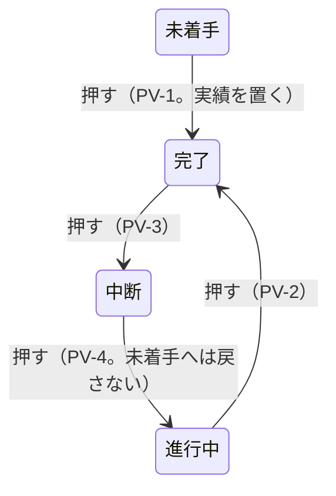

# 掴み代・ポインタ・札・操作 —— 触って決めた実物の見本

- 作った日: 2026-09-18 ／ 決め切った日: 2026-09-19
- 見本: [`grab-area-sizing-sample.html`](grab-area-sizing-sample.html)（**1 ファイルで完結する。ダブルクリックすれば開く。** サーバーも通信も外部の書体も要らない）
- 規則の整理（仕様案）: [`spec-draft-ja.md`](spec-draft-ja.md)
- 今の仕様のうち置き換えるもの（旧 → 新の対応表）: [`old-to-new-map-ja.md`](old-to-new-map-ja.md)
- 裁定: [`rulings.md`](../../docs/development-records/rulings.md) の `JDG-180`〜`JDG-208`
- 次の段取り: [`handoff.md`](../../docs/development-records/handoff.md) の §1.2（Step 1a〜5）

## 位置づけ

| 文書 | 持つもの |
|---|---|
| 見本（HTML） | 決めた規則の**実物**。すべて実装して、ブラウザで測ってある |
| 仕様案（`spec-draft-ja.md`） | 規則を上位要求 → 表 → 定数の順に整理したもの。変更要求（CR）はここから起こす |
| 旧 → 新の対応表（`old-to-new-map-ja.md`） | 今の仕様の行・要求のうち、新しい表が置き換えるもの |
| `rulings.md` | 利用者の言葉（逐語）と、覆した古い裁定 |
| 本書 | 見本の使い方、調べたこと・測ったことの控え、経緯 |

- **仕様に着地するまで**は、見本と `rulings.md` が拠り所になる。**着地した後**は仕様の表が正本になり、見本はその表を目で確かめる実物になる。食い違ったら仕様が勝つ（見本を直す）。
- 仕様の図は、見本を固定の設定で描いて SVG に書き出して作る。手では描かない。
- ⛔ 本書は規則を表で持たない（仕様案と二重にしない）。

[`13-grab-areas`](../13-grab-areas/) は**どこを**掴めるかを決めた見本である。本書の見本は、**どれだけの広さで掴めるか、重なったらどれが応えるか、掴むと何が起きるか、どう見せるか**を決めた。

## 開き方と触り方

| したいこと | すること | 画面に出るもの |
|---|---|---|
| 形を動かす | バーの本体・端・マーカー・ダミー・フェードの □・マイルストーンを引く | 図の下に「引いている: `task-plan-end`（+3 日）」 |
| 状態を変える | 進捗マーカーを押す（動かさずに離す） | 「押して状態を巡らせた: 進行中 → 完了（PV-2。絵は変えない）」 |
| どれが応えるかを見る | ポインタを置く | 「掴み代: `task-actual-start`（横 7.0px / 縦 10.3px）」と、その掴み代のポインタの形 |
| 段を入れ替える | ⑤ の段で本体を上下に引く | 予定と実績が一緒に移る。日付は変わらない |
| 依存線を選ぶ ／ 消す | 線を押す ／ Delete か「選んだ線を消す」 | 「選んだ: 依存線 FS（準備 → 作業）」。選んだ線は赤く太くなる |
| 依存線を引く | 「依存線を構える」を押し、結ぶ元の**予定**の左半分（開始）か右半分（終了）を押して、結ぶ先の予定の左半分か右半分で離す | 種類は半分の組合せで決まる（右 → 左 ＝ FS、左 → 右 ＝ SF、右 → 右 ＝ FF、左 → 左 ＝ SS）。Esc で構えを解く。予定を表示していないときは引けない |
| 値を変える | 右のペインの各節のつまみ | 左の絵と当たり判定が、見えたままその場で変わる |
| 右のペインの幅を変える | 2 つのペインのあいだの棒を左右に引く。ダブルクリックで畳む ／ 戻す | 幅はこのブラウザが覚える。2 つのペインはそれぞれ縦にも横にも別々にスクロールする |
| 値を伝える | 図の下の灰色の塊（今の値）をそのまま貼る | 「この値にしろ」と伝えられる。この塊は選んで写せる（図の上で引いても字は選ばれない） |
| やり直す | 「形を元に戻す」 | 形だけ初期に戻る（つまみはそのまま） |

## 画面の作り

### 左のペイン —— 5 つの行

| 行 | 載っているもの | 確かめること |
|---|---|---|
| ① 予実のあるタスク（`===`） | 予定（フェードの台形）・実績・進捗マーカー・名前・担当と進捗 | 端・マーカー・フェードが同じ行に並んだときの掴み代の分け方。マーカーが実績の中にいるときと外にいるときの違い |
| ② 未着手（`===`、ダミー） | 予定・実績のダミー | ダミーを引くと、そのまま実績になること |
| 3 マイルストーン | 予定の菱形・実績の菱形（またはダミー）・マーカー・名前、**隣のマイルストーン**（予定だけ） | 縮小して予実と隣が重なっても、どれも指せること |
| 4 矢印（`--->`） | 名前の段・予定の矢・実績の矢 | 段で分けた形では、札が動かず、予実の掴み代が中線で分かれること |
| ⑤ 縦に積んだ 3 本 | 全部入りのタスク 3 本を、`JDG-148` の隙間（1px ＋ 依存線 1.5px ＋ 1px ＝ 3.5px）で 1 行に積んだ段 | 積んだとき、どれが応えるか（7 問の ⑤ ⑦ と `GS-1`）。隙間を通る依存線を掴めるか |

依存線は、①→②（FS）、準備 → 作業（FS。上の 2 本の隙間を通る）、作業 → 確認（SS）の 3 本を最初に引いてある。札に出る名前（要件定義レビュー など）は、見本のための仮の文字である。

### 右のペイン —— 対象ごとの節

利用者の指示（2026-09-19）で、設定を対象ごとの節に分けた。つまみ・チェックの数は分ける前と同じである。

| 節 | 中身 | 仕様案の表 |
|---|---|---|
| 全体 | 表示の切り替え（掴み代の面・予定・実績・進捗マーカー・タスク名・進捗 ％・担当者・マイルストーンの実績・依存線）、全体のズーム・1 日の幅・バーの高さ、進捗マーカー（3 種に共通: 描く径と掴み代）、担当・進捗の札（共通）、描く順（層を「奥へ」「手前へ」）、応える順（見るだけ） | XS ・ ZO ・ HT |
| === タスク | 掴み代（予定・実績・ダミー・フェード）、タスク名の余白（`--->` も同じ値）、ポインタ（端の矢印の一辺、見本） | GA ・ LP ・ PT |
| ---> タスク | 掴み代、ポインタの見本 | GA ・ PT |
| ◆ マイルストーン | 掴み代、名前の余白、ポインタ（予定 ○ ・ 実績 ● の径） | GA ・ LP ・ PT |
| 依存線 | 掴み代、形（引き出し・引き入れ・矢じりの長さと幅）、引く・消す、ポインタの見本 | GA ・ 依存線の定数 ・ PT |
| 7 問 | 推奨と今までの形を比べる切り替え（下の節） | — |

「全体のズーム」「1 日の幅」「バーの高さ」は、見本を見るためのつまみであり、仕様の定数ではない。

### 掴み代の面の色

**色の面が掴み代そのものである。** 横と縦の広がりが、そのまま面の形になっている。面には縁取りを付けず（利用者の指示「縁取りの点線が見にくい」）、掴む物とは**別の色相**で薄く塗り、描いた形の**上に**重ねる。形の中にある掴み代（実績の端の内側など）は、その形の色が少し変わって見える。

| 掴み代の色 | 掴み代 | 掴む物の色 |
|---|---|---|
| 赤紫 | 予定の端、マイルストーンの予定 | 淡い青のバー、金の菱形 |
| 橙 | 実績の端、ダミー | 青のバー、紫のダミー |
| 青 | マイルストーンの実績・ダミー | 茶・淡い茶の菱形 |
| 黄緑 | 進捗マーカー | 緑の輪 |
| 青緑 | フェードの掴み点 | 赤い □ |
| 青紫 | 依存線（描いた線の縁から左右 2px） | 灰の線 |
| （塗らない） | 本体 | 掴み代が描いた形そのものなので塗らない。塗るとバーが灰色にくすむだけである |

## 7 問と、問い 8・9（Step 1b の前に決める）

見本と既存の裁定・仕様が食い違う点が見つかった（`handoff.md` §1.2）。利用者の指示（「先ずはサンプルに反映しろ。触ってみてから決める。」）で、右のペインの「7 問」から推奨と今までの形を切り替えて比べられるようにした。① と ④ は掴み代の値そのものなので、値の組を入れるボタンである。

| 問 | 状態 | 見本の既定 | 比べる形 | 実測（既定の大きさ） |
|---|---|---|---|---|
| ① ダミーの開始の掴み代 | 未決 | 外側 0px（予定開始日から右へだけ。`JDG-04` ／ `JDG-19`） | 外側 12px | 既定: 156〜167.5 は予定の開始、168〜171.5 はダミーの開始。12px: 156〜171 がすべてダミーの開始 |
| ② マーカーの押下 | 未決 | 表 T-021a の順（絵が変わるのは `PV-1` だけ） | 見本の仮の巡り（未着手 → 50% → 100% → 未着手） | 既定: 進行中 → 完了 → 中断 → 進行中 → 完了、実績は 2 日目から 12 日のまま。未着手の行は押すと 4 日目から 1 日の実績が立つ |
| ③ `JDG-27` の扱い | 未決（記録だけ） | — | — | — |
| ④ 予定の端の上下 | **決まった: 0px**（`JDG-197`） | 0px（`===` と `--->` の 4 つの値） | 「GS-3 の 12」 | 予定の開始の掴み代の高さ: 0px で 18px、12px で 42px |
| ④a 予定の端の内側 | 未決 | 0px | 表の「内側」で試す | 下の「依存線が付く予定の端」 |
| ⑤ 同じ種類の掴み代が重なったとき | 未決 | 中心が近い方（直線距離） | 形の縁（`GS-2`）／ 横の中心だけ | 「作業」を 60% にし、④ を 12 にして、上の 2 本の予定の終了点の列を縦になぞった境目: 中心 410、形の縁 411、横だけ 401.5。④ が 0 では予定の端どうしが縦に重ならず、この場面では ⑤ は効かない |
| ⑥ 「入る」の判定 | 未決 | 終了側だけ `S-91` を取る | `FR-002` のまま ／ マーカー ＋ 間隔 ＋ 名前 | ①行の名前が実績の中に入る最小の 1 日の幅: 終了側だけ 8px、`FR-002` のまま 10px、今までの形 7px |
| ⑦ 形の外で依存線とフェードが重なったとき | 未決 | 線が先（`GS-4` ／ `JDG-150`） | 表 T-023d の並び（フェードが先） | ⑤ の隙間の中段の予定の開始の 4px 左（488, 411.75）: 既定では依存線、比べる形ではフェードの掴み点が応える |
| 8 進捗マーカーを依存線より手前に描くか | 未決 | 手前（「描く順」で入れ替えられる） | 仕様の `ZO-3`（線より奥） | — |
| 9 依存線の値の 2 点 | 未決 | 引き入れ 10px ＞ 矢じり 6px | つまみで短くして試す | 下の「依存線の走りと矢じり」 |

- ⑤: 「形の縁（`GS-2`）」は仕様がいま定めている測り方である。中心と形の縁が違う答えを出すのは上下のバーの高さが違うときだけなので、「作業」のバーの高さのつまみ（既定 100%）を付けた。
- ⑥: マーカーを実績の開始に置き、開始の掴み代をマーカーの中心で止める設計（`JDG-187`）は、マーカーを開始の掴み代の上にわざと置く。開始側に `S-91` を取る `FR-002` の理由（端の掴み代の上に何も置かない）とは両立しないので、推奨を終了側だけにした。
- ⑦: 仕様の中の食い違いである（`DFC-657`）。`GS-4` の定めは形の外で線を先にするが、その理由の文は表 T-023d の並びを誤って引いている（表ではフェードが線より上）。推奨は、定めと `JDG-150` のとおり線を先にし、理由の文を直すことである。フェードの掴み点は、自分のバーに載る 4 分の 1 では `GS-1` によって残るので、線のそばでも掴める。
- **`GS-1`**（描いた形の上は、その形のタスクだけが応える）は仕様どおりの規則で、比べるために切り替えられる。上のバーの下の縁（490, 409.5）を指すと、オンでは上のバーの本体が、オフでは中段のフェードが応える（実測）。

## 調べたこと・測ったことの控え

### 掴み代を操作対象ごとに独立させた（`JDG-194`）

1 つの値がほかの対象の掴み代を動かさないように、掴み代を「対象 × 向き」の値に分けた（値そのものは仕様案の表 GA）。分ける前の見本では、次の値が対象をまたいで効いていた。

| 分ける前 | 何に効いていたか | 今 |
|---|---|---|
| 予定の端 横（`S-90`） | `===` の予定の両端の外側、`--->` の予定の両端の幅、④ がオンのときはその上下も | 8 つの値に分けた |
| 実績の端 横（`S-91`） | `===` の実績の両端の内側、ダミーの開始と終了の外側、`--->` の実績の両端の幅 | 6 つの値に分けた |
| 実績の端 縦 | 実績・ダミー・◆ の実績とダミー・`--->` の実績の上下 | 8 つの値に分けた |
| マーカー 一辺 | マーカーの掴み代、描く径、ダミーの幅、実績の開始の止め位置、「入る」の判定 | 描く径と掴み代を別の値にした |
| 縦の下限 | すべての掴み代の縦 | なくした |
| `--->` の予定の本体 | ④ の縦の張り出しを借りていた（高さ 10.26px） | 描いた矢の高さだけ（7.31px） |

掴み代どうしではない依存（札や描く大きさとのあいだ）は残した。その辺は仕様案 §3 の表にある。

### ダミーの開始（問い ①）

前の形では、ダミーの開始の掴み代を予定の開始日の**左へ** 12px 伸ばしていた。ダミーは応える順で予定の端より上なので、行の中央の帯では予定の開始の掴み代（156〜168）がすべてダミーに取られ、予定の開始を掴めるのは上下の 2px の帯だけだった（実測）。`JDG-04` と `JDG-19` は「予定開始日の左は予定、右は実績」と 2 度決めており、実績の開始の掴み代は内側（右）へ伸びる。したがって「実績と同じつかみシロ」（`JDG-186`）は「予定開始日の右にだけ伸ばす」と読める。見本の前の形は、外側へ対称に伸ばした読み違いの可能性が高い。

### マイルストーン名の 25%（`JDG-183`）

利用者は、短い名前が菱形の中に収まる場面を増やすために、マーカーを出さないときの名前を 25% の位置から書くと決めた。2026-09-19 に「マイルストーンの横幅を 0〜100% としたとき、25% の位置から」と言い直した。前の版は「中心から右に 25%」を 75% の位置と読んでいたので、直した。

### 依存線は予定に付ける（`JDG-196`）

利用者の問い（「依存線って実績に対して描画するものか？」）を受けて、エージェントに調べさせた。どれも予定を指す。見本の前の版が「実績を描いていれば実績」に付けていたのは、前に立つ者の思い込みで、仕様と逆だった。

| 出典 | 言っていること |
|---|---|
| GRS の仕様 `FR-009` | 「依存線は予定の幾何に付くこと（MUST）。予定を表示していないときに限り、実績の幾何に付ける」。実装済みのアプリ（`attachedBar`）も同じ |
| MSPDI | `PredecessorLink` は「このタスクが開始日か終了日を頼る先行タスク」を定める。`Start` ／ `Finish` は予定日、`ActualStart` は事実の記録である。リンクが実績を動かすことはない |
| MS Project | 標準の Gantt は「予定のバー ＋ 中の細い進捗バー」で、GRS の `===` と同じ構造である。リンク線は予定のバーの端に付く |
| 一般的な工程表ツール | リンク線は、リンクが縛る現行の予定のバーに付く。基準の予定（ベースライン）にも実績にも付けない。現行のバーを「実績」、ベースラインを「予定」と呼ぶツールもあるので、呼び名で読み違えないこと |

そのうえで利用者は、予定が無いとき・予定を表示していないときは線を描かないと決めた（理由: 依存線は予定に対して設定する情報だから）。`FR-009` の「予定を表示していないときに限り、実績の幾何に付ける」はこれで覆る（`DFC-658`。アプリの `attachedBar` も直す）。

### 依存線が付く予定の端の掴みやすさ（問い ④a）

依存線は予定の端から出入りする。④ で上下の張り出しが 0 になったので、予定の端の掴み代は外側 12px の帯（バーの高さ 18px）だけであり、その中を線の掴み代が取る。

| 線の掴み代 ／ 予定の端の内側 ／ 走り | ⑤ の「準備」の予定の終了（線が出る） | ② の予定の開始（線が入る） |
|---|---|---|
| 線の中心から左右 6px ／ 0 ／ 14px（前の版） | 外側の帯で 3px | 外側の帯で 3〜6px |
| 線の縁から左右 2px ／ 0 ／ 14px | 外側の帯で 8.5〜11.5px | 外側の帯で 13px（最も遠い列は 6.5px） |
| 線の縁から左右 2px ／ 6px ／ 14px | 外側は同じ。加えてバーの上の 6px の列で 14〜18px | 外側は同じ。バーの上ではダミーが先に応え、4px |
| **線の縁から左右 2px ／ 0 ／ 引き出し 6px・引き入れ 10px（今の既定）** | 線の縦の脚が通る列（604〜608）で 6.5px、バーに近い列（602）で 8.5px、脚の外の列（610〜612）で 18.5px | 線の横の入口が中ほどを取る列（162〜166）で 13px、脚が通る列（156〜160）で 6.5px。④ を 12 にすると 37px ／ 18.5px |

測り方: 列ごとにポインタを 0.5px 刻みで縦に動かし、予定の端が応えた高さを足した。引き出しや引き入れが 12px より短いと、線の縦の脚が予定の端の外側の帯の中を通る。さらに掴みやすくしたければ、予定の端に内側の掴み代を持たせる（バーの上では `GS-1` によってそのタスクだけが応え、依存線は描いた線そのものでしか応えない）。

### 描く順と応える順（`JDG-203`・`MK-9a`）

利用者の指摘（「依存線の裏側に … タスク名を描いてないか？」）のとおり、前の版は依存線を全部の後に描いていたので、線が名前・担当と進捗・マーカーの上に乗っていた。仕様（`ZO-5`: 名称ラベルは依存線より手前）とも食い違っていた。見本は描く順を層の表にし、応える順とは別に管理した。描く順を入れ替えても、図の上の 6205 点で応える掴み代は 1 つも変わらなかった（実測）。仕様は既に、応える順を描く順から切り離している（`MK-9a`「掴みの優先順は重ね順と一致しない。これは意図した設計である」）。

| 奥から | 見本の層 | 仕様の 表 T-020 |
|---|---|---|
| 1 | 目盛・行の見出し | 行が無い |
| 2 | 予定・実績・ダミー・菱形・矢・フェードの □ | `ZO-1` → `ZO-1a` → `ZO-2`。ダミー・菱形・フェードの掴み点は行が無い（`DFC-662`） |
| 3 | 依存線 | `ZO-4` |
| 4 | 進捗マーカー | ⚠️ `ZO-3`（依存線より奥。問い 8） |
| 5 | タスク名・担当・進捗 ％ | `ZO-5`（担当と進捗の札は行が無い） |
| 6 | 掴み代の面（見本だけ） | — |

名前を線より手前にしても、縁取り（`S-34`、字の大きさ × 0.10）が細いので、字と字のすき間から線が見える。縁取りの太さは描く順とは別の判断である。

### 依存線の走りと矢じり —— 仕様との違い（`JDG-201`・`JDG-202`・`JDG-205`）

| 事柄 | 仕様 | 前の版の見本 | 今の見本 |
|---|---|---|---|
| 入口の走り | `S-19` × `S-20` ＝ 14px（`LF-4`。矢じりを含む） | 14px | 引き入れ 10px（矢じりを含む） |
| 出口の走り | 入口の走り − `S-19` ＝ 7px（`LF-4`「出口と入口に別々の設定値を持たない」） | 14px（仕様と違った） | 引き出し 6px |
| 矢じり | 長さ ＝ 底辺 ＝ `S-19` 7px | 7 × 8.4px（仕様と違った） | 6 × 5px |
| 描く比 | `S-18` ／ `S-19` の px には描く比（表示の倍率 100 で 0.625）が掛かる。アプリは入口 8.75px・出口 4.375px・矢じり 4.375 × 4.375px で描く（コードからの計算） | 掛けていない（見本の px は描いた px） | 同じ |

利用者の指示（引き出し・引き入れを今の 30% ほど、矢じりの幅を今の半分）は、仕様の今の作り（`S-20` の下限 1 超、`S-19` の 3 役、`LF-4` の 1 つの値）には入らない。仕様案では 4 つを別々の値にする。値は利用者がつまみで決めた 6 ／ 10 ／ 6 × 5px（`JDG-205`）。引き入れを矢じりより短くすると、矢じりの付け根が手前の曲がり角より外へ出る（問い 9）。

### ポインタ（`JDG-181`・`JDG-191`・`JDG-200`・`JDG-206`〜`JDG-208`）

- タスクの端は幅の広い箱型の矢印（予定は白抜き、実績とダミーは塗り）、一辺 16px（`S-249` を 24 → 16）。
- 依存線は線の矢印（細い軸と細い三角の矢じり）。最初の版は予定の端の矢印と見間違えそうだったので、矢じりの幅と黒の縁を半分にし、縁を角張らせた。
- フェードは直角三角形（10px。直角がポインタの位置）。縦を横の 75% にした。
- マイルストーンは手のひらをやめ、予定 ○（12px）、実績とダミー ●（8px）にした。
- 縁の太さは、依存線・フェード・○ ● で共通の 1 つの値（画面で約 0.47px）である。実寸では細く見えるが、利用者は今のままとした。

### マーカーの押下の巡り（問い ②）

見本の仮の巡り（未着手 → 50% → 100% → 未着手）は、前に立つ者がデモのために置いたもので、利用者が決めたものではない。仕様の順は表 T-021a である。

表 T-021a の順では、押して未着手へ戻ることがない。そのため「未着手になったらダミー、次の押下で元の実績」（`JDG-187`）の経路は、仮の巡りでしか通らない。また `PV-1` は押下で実績を置き、「押下で絵を変えない」と食い違う。

## 実測（Microsoft Edge ＋ Playwright）

**測り方**: 見本を Edge で開き、Playwright でポインタを行に沿って 0.5〜1px 刻みで動かす。そのたびに図の下に出る掴み代の名前を拾う。探り針は一時ファイルで書いたので、リポジトリには置いていない。

| 確かめたこと | 結果 |
|---|---|
| 実績の開始とマーカーが重なる所 | 実績の開始の掴み代 168〜175、マーカー 168〜182（中心 175）。左半分は実績の開始、中心から右はマーカーが応える |
| マーカーを 4 回押す（② を仮の巡りにして） | 60% → 100%（2 日目から 12 日のまま）→ 未着手（実績を覚える）→ 50%（2 日目から 12 日に戻る）→ 100% |
| 本体を 4 日ぶん引く | 予定は 2 日目 → 6 日目。実績は 2 日目から 12 日のまま |
| 実績を予定より 3 日早く始める | 担当と進捗の札の右端 140.4 → 104.4。名前との間は 21.6px（直す前は 14.4px 重なっていた） |
| マイルストーン、1 日 2px | 予定の掴み代は中心 ±10.35、実績は ±6.3。行の中心では実績とマーカーが応え、上と下の帯（各 2.7px）では予定が応える |
| 隣のマイルストーン 2 つ（中心 172 と 184） | 境目は 178。ちょうど中点で分かれる |
| `--->` の端の掴み代 | 4 か所とも、掴み代の中心と形の基準点（軸の左端・`>` の中心）の差が 0 |
| 予定だけを表示する | マーカーは予定の開始（144）、マイルストーンのマーカーは予定の菱形の右端（441）に移る |
| つまみの効き（対象ごとの独立） | 掴み代のつまみ 34 本を 1 本ずつ動かし、動いた掴み代を数えた。34 本すべてが自分の対象だけを動かし、ほかの対象の掴み代は 1 つも動かない |
| 対象ごとに分ける前との一致 | 既定の値で、掴み代 61 のうち 60 が前の版と同じ位置と大きさ。違うのは `--->` の本体だけ |
| 名前の位置 | ①行のタスク名: 実績の開始 144 から、マーカーありで 164（144 ＋ 径 14 ＋ 6）、なしで 150（144 ＋ 6）。マイルストーン名（マーカーなし）は、基準が実績・ダミー・予定のどれでも菱形の幅の 0.25 の位置 |
| 札の余白のつまみの効き | どのつまみも自分の札だけを動かし、掴み代は 1 つも動かない |
| 依存線の付け先 | 予定を表示すると、3 本とも予定の端から出る（① の予定の終了 384 → ② の予定の開始 168 など）。予定を隠すと 0 本。構えても引けない |
| 依存線の掴み代とポインタ | 横に走る線の掴み代の高さは 5.5px。⑤ の隙間（x 540）を縦になぞると、準備の本体（〜410）→ 依存線（410〜413.75）→ 作業の本体。線の上ではポインタが線の矢印になる |
| 隙間（500, 412.5）／ 中段のバーの上（500, 414） | 隙間では依存線が、バーの上では中段の本体が応える |
| 依存線の選択・削除・作成 | 隙間の線を押して Delete で 3 本 → 2 本。構えて 確認 の右半分 → 準備 の左半分で FS が 1 本増える。矢印のタスクの予定 → マイルストーンの予定で FS を引ける |
| 依存線を隠す | 線 0 本・線の掴み代 0。「依存線を構える」「選んだ線を消す」が押せなくなり、構えていれば解ける |
| 描く順と応える順 | 描く順を入れ替えても、図の上の 6205 点で応える掴み代は 1 つも変わらない |
| ⑤ の本体を 1 段ぶん下へ引く | 段が 準備・作業・確認 → 作業・準備・確認 に入れ替わる。準備の日付は変わらない |
| 図の上で引いても字を選ばない | 図の空いた所から引いたとき、選ばれた字は 0 字（直す前は 355 字）。本体を引けば予定は動き、マーカーを押せば状態が巡る。今の値の塊は選んで写せる |
| ペインのあいだの棒（画面 1500 × 640） | 右のペインを 480 → 397 → 197 → 1197px。狭い方のペインが縦にも横にもスクロールする。ページ自体はどの幅でもスクロールしない。ダブルクリックで 0px、もう一度で戻る |
| 狭めたペインでの当たり判定 | ペインの幅を変えても、左のペインを横にスクロールしても、実物のポインタを置いた所で答えと図の下の表示が一致する |
| 設定のペインの節分け | つまみ 51 本がどれも今の値の塊を変える（効かないつまみ 0）。掴み代のつまみは節ごとの表に分かれて 34 本のまま |

## 仕様へ（次の段取り）

`handoff.md` §1.2 が段取りを持つ。

1. 旧 → 新の対応表（Step 1a）: [`old-to-new-map-ja.md`](old-to-new-map-ja.md)。
2. 1 本の CR で、削除と、仕様案の表・定数・図・上位要求を同時に当てる（Step 1b）。問い ①〜⑦・8・9 の答えを待つ。
3. 実装と、仕様だけを読んで書く試験を並べる。表の 1 行が試験 1 件になる（Step 3 ‖ 4）。

## 経緯

| commit | 日付 | 何を変えたか |
|---|---|---|
| `e1d29dfb` | 09-18 | 掴み代を面で描き、つまみで数を変えられる見本を作った |
| `3c2132af` | 09-18 | マイルストーンの札を実績に付けた。`--->` の実績も矢の形にした |
| `0cdf58c1` | 09-18 | マーカーを押すと状態が巡り、引くと実績の終了が動くようにした |
| `7521f3f4` | 09-18 | マーカーを実績の終了に固定した。ダミーの掴み代を実績と同じにした |
| `a75ab2dc` | 09-18 | `--->` の実績も予定と同じく外側で掴むようにした（のちに中央合わせへ） |
| `a6d5aed3` | 09-18 | マーカーを出すときは名前をその右に置くようにした。フェードのポインタを三角にした |
| `8bb9d774` | 09-18 | 札の規則を `===` と `--->` で分けた。`--->` の掴み代を中央合わせにした。ダミーを実績として扱うようにした |
| `94522c9b` | 09-18 | マーカーで実績が動くのを、実績の右にいるときだけにした。マイルストーンのダミーを実績と同じ形にした。フェードのポインタを 10px にした |
| `f2830864` | 09-18 | 予定と実績を別々に消せるようにした |
| `ee993826` | 09-18 | マーカーの押下は状態だけにした。実績の開始の掴み代をマーカーの中心で止めた |
| `b3fd75c9` | 09-18 | 本体を引いても予定だけが動くようにした |
| `62cee63e` | 09-18 | 担当と進捗を、早い方の開始の左に置くようにした |
| `94e33c4b` | 09-19 | マイルストーンの掴み代を、実績は菱形そのもの、予定は幅の 115% にした |
| `3f714c6e` | 09-19 | 重なったら中心の近い方が応えるようにした。隣のマイルストーンを足した |
| `fa5ecefc` | 09-19 | 6 問を切り替えで比べられるようにした。⑤行、GS-1、表 T-021a の巡りとマーカーの記号を足した |
| `abdc94a2` | 09-19 | 表示と設定を左右のペインに分けた。⑤を予実のある 3 本の段にした。依存線（選ぶ・消す・引く）と ⑦ を足した |
| `6b2ef557` | 09-19 | 掴み代を操作対象ごとの独立した値（つまみ 34 本）にした |
| `be9fcadc` | 09-19 | 右のペインの幅を変えられるようにした。掴み代の面を、縁取りなしの薄い別の色相にした |
| `bdf49b6b` | 09-19 | マイルストーン名を菱形の幅の 25% の位置からにした。札の余白を 4 つのつまみに分けた |
| `ab9be4d6` | 09-19 | 依存線を予定だけに付けた。予定の端の上下の既定を 0 にした。依存線の表示の切り替えを上へ移した。依存線の掴み代を線の縁から 2px にし、ポインタを線の矢印にした |
| `f15ea18e` | 09-19 | 描く順を層の表にし、応える順と別に管理した。依存線の引き出し・引き入れ・矢じりをつまみにした。図の上で字を選ばないようにした |
| `8f6b165c` | 09-19 | 依存線の既定を利用者の指定（6 ／ 10 ／ 6 × 5px）にした |
| `f4146ca8` | 09-19 | 依存線のポインタの矢じりの幅と黒の縁を半分にし、縁を角張らせた |
| `46353cbe` | 09-19 | フェードのポインタを 75% の高さにし、縁を共通にした。マイルストーンのポインタを ○ ● にした。設定のペインを対象ごとの節に分けた |
| （この版） | 09-19 | README を整理し、規則を仕様案（`spec-draft-ja.md`）へ移した。旧 → 新の対応表（`old-to-new-map-ja.md`）を足した |
