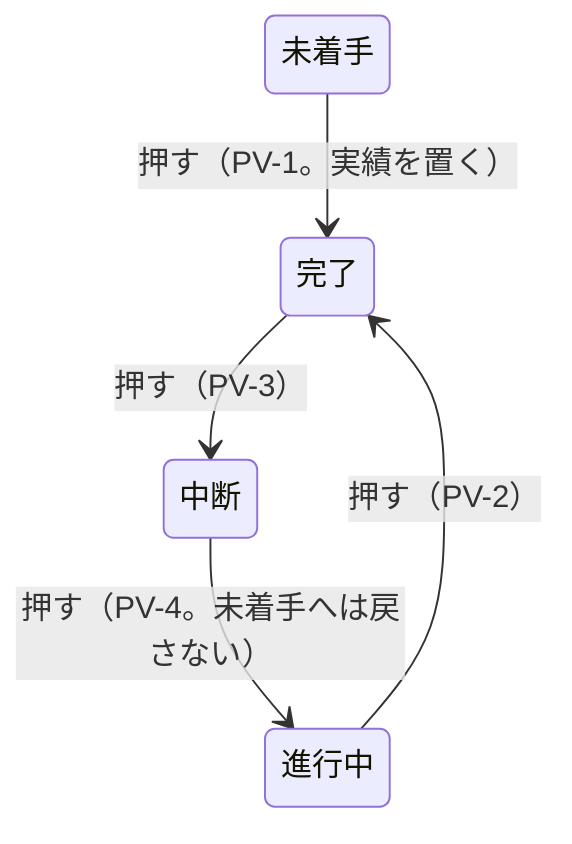

# 掴み代・ポインタ・札・操作 —— 触って決めた実物の見本

- 作った日: 2026-09-18 ／ 決め切った日: 2026-09-19
- 見本: [`grab-area-sizing-sample.html`](grab-area-sizing-sample.html)
  （**1 ファイルで完結する。ダブルクリックすれば開く。** サーバーも通信も外部の書体も要らない）
- 裁定: [`rulings.md`](../../docs/development-records/rulings.md) の `JDG-180`〜`JDG-193`
- 次の段取り: [`handoff.md`](../../docs/development-records/handoff.md) の §1.2（Step 1a〜5）

## 位置づけ

この見本には、利用者が触って決めた規則が**すべて実装されている**。対象は、掴み代・ポインタの形・札の置き方・押したり引いたりしたときの効果である。

- **仕様に着地するまで**は、この見本と `rulings.md` だけが拠り所になる。
- **着地した後**は、仕様の 6 つの表（表 GA・HT・RF・LP・PE・XS）が正本になる。見本は、その表を目で確かめるための実物になる。見本と仕様が食い違ったときは仕様が勝つ（見本の方を直す）。
- 仕様の図は、この見本を固定の設定で描いて SVG に書き出して作る。手では描かない。

⛔ **これ自体は仕様ではない。** 下の「決めた規則」は、仕様に着地したら表を指す 1 行に縮める（二重表現を残さないため）。

[`13-grab-areas`](../13-grab-areas/) は**どこを**掴めるかを決めた見本である。本書は、**どれだけの広さで掴めるか、重なったらどれが応えるか、掴むと何が起きるか**を決めた。

## 開き方と触り方

| したいこと | すること | 画面に出るもの |
|---|---|---|
| 形を動かす | バーの本体・端・マーカー・ダミー・フェードの □・マイルストーンを引く | 図の下に「引いている: `task-plan-end`（+3 日）」 |
| 状態を変える | 進捗マーカーを押す（動かさずに離す） | 「押して状態を巡らせた: 100%」 |
| どれが応えるかを見る | ポインタを置く | 「掴み代: `task-actual-start`（横 7.0px / 縦 10.3px）」と、その掴み代に割り当てたポインタの形 |
| 大きさを変える | 左のつまみ | 絵と当たり判定が、その場で変わる |
| 値を伝える | 最後の灰色の塊をそのまま貼る | 「この値にしろ」と伝えられる |
| やり直す | 「形を元に戻す」 | 形だけ初期に戻る（つまみはそのまま） |

**色の面が掴み代そのものである。** 横と縦の広がりが、そのまま面の形になっている。

| 色 | 掴み代 |
|---|---|
| 青 | 予定の端（マイルストーンの予定は淡い青） |
| 橙 | 実績の端・ダミー・マイルストーンの実績 |
| 緑 | 進捗マーカー |
| 桃 | フェードの掴み点 |
| 灰 | 本体（予定を動かす） |

## 4 つの行

| 行 | 載っているもの | 確かめること |
|---|---|---|
| ① 予実のあるタスク（`===`） | 予定（フェードの台形）・実績・進捗マーカー・名前・担当と進捗 | 端・マーカー・フェードが同じ行に並んだときの掴み代の分け方。マーカーが実績の中にいるときと外にいるときの違い |
| ② 未着手（`===`、ダミー） | 予定・実績のダミー | ダミーを引くと、そのまま実績になること |
| 3 マイルストーン | 予定の菱形・実績の菱形（またはダミー）・マーカー・名前、**隣のマイルストーン**（予定だけ） | 縮小して予実と隣が重なっても、どれも指せること |
| 4 矢印（`--->`） | 名前の段・予定の矢・実績の矢 | 段で分けた形では、札が動かず、予実の掴み代が中線で分かれること |

札に出る名前（要件定義レビュー など）は、見本のための仮の文字である。

## つまみ（＝仕様の定数になる値）

利用者の裁定（`JDG-180`）で、**つまみの値はすべて設定の表 T-206 の行として持つ**。コードは生成した定数を読むので、値は 1 セルで変わる。**当面の値は下の既定値**である。

| つまみ | 既定値 | 範囲 | 仕様の行 |
|---|---|---|---|
| 予定の端 横（外側） | 12px | 0〜24 | `S-90`（同じ値） |
| 予定の端 縦（帯の外へ上下） | 0px | 0〜20 | 新しく足す |
| 実績の端 横（内側） | 12px | 0〜24 | `S-91`（同じ値） |
| 実績の端 縦（帯の外へ上下） | 0px | 0〜20 | 新しく足す |
| マーカー 一辺（掴み代の正方形。円はその内側に描く） | 14px | 6〜32 | Step 1a で既存の行と照合する |
| フェード 一辺（掴み代） | 8px | 4〜20 | `S-92`（同じ値） |
| マイルストーン 予定の幅 | 予定の菱形の幅の 115% | 100〜200% | 新しく足す |
| 縦の下限（共通） | 0px | 0〜40 | 新しく足す |
| 実績と札の間隔 | 4px | 0〜24 | Step 1a で既存の行と照合する |
| 札の字の大きさ | 実績の高さ × 0.90 | 0.50〜1.30 | Step 1a で既存の行と照合する |
| ポインタの矢印 一辺 | 16px | 8〜32 | `S-249`（24 → 16、`JDG-181`） |

つまみを持たない固定の値:

| 値 | 大きさ |
|---|---|
| フェードのポインタ | 10 × 10px（`JDG-191`） |
| フェードの描く □ | 5 × 5px（`S-109`） |
| 実績のダミーの幅 | マーカー径 × 0.5（`S-247`） |
| マーカーが実績の開始に立つときの、実績の開始の掴み代の上限 | マーカー径 × 0.5（＝マーカーの中心まで） |
| マイルストーンの実績の菱形 | 予定の菱形 × 0.7 |
| マイルストーンの実績の掴み代 | 実績の菱形そのもの |
| マーカーを消したときのマイルストーン名の書き出し | 基準の菱形の中心 ＋ 菱形 × 0.25 |

「全体のズーム」「1 日の幅」「予定バーの高さ」は、見本を見るためのつまみであり、定数ではない。

## 決めた規則（見本に実装済み）

⚠️ 仕様に着地したら、この節は表を指す 1 行に縮める。

### 1. 掴み代の形と大きさ（→ 表 GA）

| 形 | 掴む所 | 横 | 縦 | ポインタ |
|---|---|---|---|---|
| `===` 予定 | 開始 ／ 終了 | 端から外側へ 12px | 予定バーの帯 | ← ／ → 白抜き |
| `===` 予定 | 本体 | バー全体 | 予定バーの帯 | てのひら |
| `===` 実績 | 開始 | 端から内側へ 12px。**マーカーが実績の開始に立つときは、マーカーの中心で止める**（既定で 7px） | 実績の帯 | ← 塗り |
| `===` 実績 | 終了 | 端から内側へ 12px | 実績の帯 | → 塗り |
| `===` ダミー | 印の左半分 ／ 右半分 | 印の中心で割れ、それぞれ印の端から外へ 12px（＝実績の端と同じ 12px）。⚠️ 下の注 | マーカーの帯 | ← ／ → 塗り |
| 進捗マーカー | 全体 | 一辺 14px の正方形 | 同左 | 指 |
| フェード | 入 ／ 出の掴み点 | 8 × 8px | — | **三角 10px、黒の枠・白の塗り。直角がポインタの位置。入は左上へ、出は右下へ広がる** |
| ◆ 予定 | 全体 | 予定の菱形の幅の 115% | 予定の菱形の高さ | てのひら |
| ◆ 実績 ／ ダミー | 全体 | 実績の菱形そのもの | 実績の菱形の高さ | てのひら |
| `--->` 予定 | 開始 ／ 終了 | **軸の左端 ／ `>` の中心に中央合わせ**で 12px | 矢尻の高さ。中線より上だけ | ← ／ → 白抜き |
| `--->` 予定 | 本体 | 矢全体 | 同上 | てのひら |
| `--->` 実績 | 開始 ／ 終了 | 軸の左端 ／ 実績の `>` の中心に中央合わせで 12px | 実績の矢の高さ。中線より下だけ | ← ／ → 塗り |

⚠️ **ダミーの開始の掴み代は、既存の裁定と食い違う（未決）。** 見本は、ダミーの開始の掴み代を予定の開始日の**左へ** 12px 伸ばしている。ダミーは種別の順位で予定の端より上なので、行の中央の帯では予定の開始の掴み代（156〜168）がすべてダミーに取られる。予定の開始を掴めるのは、上下の 2px の帯だけである（実測）。
一方、`JDG-04` と `JDG-19` は「予定開始日の左は予定、右は実績」と 2 度決めている。実績の開始の掴み代は内側（右）へ伸びるので、「実績と同じつかみシロ」（`JDG-186`）は「予定開始日の右にだけ伸ばす」とも読める。見本の形は、前に立つ者が外側へ対称に伸ばして実装した読み違いの可能性が高い。Step 1b の前に利用者に問う。

### 2. どれが応えるか（→ 表 HT）

1. **種別の順位で決める**: フェード → 進捗マーカー → ダミー → 実績の端 → 予定の端 → 実績の中に立つマーカー → マイルストーン → 本体。
2. **同じ種別の掴み代が重なったら、中心が近い方が応える**（`JDG-190`）。距離が同じなら、後に描いた方が応える。

実績の中に立つマーカーを実績の端より下の順位に置き、実績の開始の掴み代をマーカーの中心で止める。こうすると、マーカーの左半分は実績の開始を、右半分はマーカーを掴む。

### 3. 札の基準（→ 表 RF）

| 実績を表示している | 実績がある | 札の基準 |
|---|---|---|
| する | ある | 実績 |
| する | ない | ダミー（幅 ＝ マーカー径 × 0.5） |
| しない | — | 予定 |

**ダミーは「まだ始まっていない実績」である**（`JDG-186`）。ダミーを特別扱いせず、実績と同じ規則で置く。

### 4. 札の置き方（→ 表 LP）

「入る」とは、マーカー径 ＋ 間隔 ＋ 名前の幅 ≦ 基準の幅 のことである。マーカーを出さないときは、名前の幅だけで判じる。

| 形 | マーカー | 入る | マーカーの位置 | 名前の位置 |
|---|---|---|---|---|
| `===` | 出す | 入る | 基準の開始 | マーカーの右 |
| `===` | 出す | 入らない | 基準の終了のすぐ右 | マーカーの右 |
| `===` | 出さない | 入る | — | 基準の開始 |
| `===` | 出さない | 入らない | — | 基準の終了から外へ |
| `--->` | 出す | （問わない） | 基準の開始。名前の段に置く | マーカーの右 |
| `--->` | 出さない | （問わない） | — | 基準の開始。名前の段に置く |
| ◆ | 出す | （問わない） | 基準の菱形の右端 | マーカーの右 |
| ◆ | 出さない | （問わない） | — | 基準の菱形の中心 ＋ 菱形 × 0.25 |

**担当と進捗**は 1 枚の札にまとめ、右寄せで置く。置き場所は、描かれている予定と実績のうち**早い方の開始の左**である（`JDG-182`）。マイルストーンは、札の右端を、基準の菱形の中心から（菱形 × 0.25 ＋ 間隔）だけ左に置く。

`===` と `--->` の規則を分ける理由: `===` は予定・実績・札が同じ中心線に並ぶので、入らないときは横へ逃がすしかない。`--->` は名前・予定・実績が縦に積まれて段が分かれているので、札は何とも重ならず、動かす必要がない（`JDG-183`）。

### 5. 押す・引くの効果（→ 表 PE）

| 掴んだ所 | 押して離す（動かさない） | 横に引く |
|---|---|---|
| 予定の本体 | — | **予定だけ**を動かす（開始と終了を同じ日数だけ）。実績は動かない |
| 予定の端 | — | その端だけ |
| 実績の端 | — | その端だけ |
| ダミー（タスク） | 何も起きない | 引いた所から**実績になる** |
| ダミー（マイルストーン） | 何も起きない | 引いた所で**実績になる** |
| マイルストーンの予定 ／ 実績 | — | その日付だけ |
| 進捗マーカー（実績の右に立つとき） | 状態を 1 つ進める | 実績の終了を動かす |
| 進捗マーカー（それ以外。実績の中、`--->`、実績を表示していないとき） | 状態を 1 つ進める | 何もしない |
| フェードの掴み点 | — | 入 ／ 出の日数 |

- **縦に引く（行を移る）と、予定と実績が一緒に移る。日付は変わらない**（`JDG-188`）。見本には行の移動が無いので、ここには実装していない。
- **実績を消す**のは、取り消し（Ctrl ＋ Z）かプロパティパネルで行う。

**進捗マーカーを押したとき**（`JDG-187`）: 押しても**描いた実績は変えない**。未着手になったときだけダミーを立て、次に押したら覚えておいた**元の実績そのもの**を戻す。

⚠️ **見本の状態の巡り（未着手 → 50% → 100% → 未着手）は、前に立つ者がデモのために置いた仮のものである。利用者が決めたものではない。** 仕様の順は表 T-021a である（未着手 → 完了 → 中断 → 進行中 → 完了。`PV-4` が「未着手へ戻してはならない（MUST NOT）」と定める）。

表 T-021a の順では、押して未着手へ戻ることがない。そのため「未着手になったらダミー、次の押下で元の実績」という経路は、見本の仮の巡りでしか通らない。また `PV-1`（未着手 → 完了）は押下で実績を置く。これは「押下で絵を変えない」と食い違う。この 2 点は Step 1b の前に利用者に問う（`handoff.md` の §1.2）。

### 6. 縦の断面（→ 表 XS）

| 形 | 帯（バーの高さに対する位置） | 予実の掴み代の分け方 |
|---|---|---|
| `===` | 予定の帯の中に、同じ中心の実績の帯。札とマーカーも同じ中心 | 分けない（順位で分ける） |
| `--->` | 名前の段（上から 10%）／ 予定の矢（42%）／ 実績の矢（72%） | 予定の矢と実績の矢のあいだの中線（57%）で分ける |
| ◆ | 予定の菱形（高さいっぱい）の中に、実績の菱形（× 0.7） | 縮小して重なると、予定は実績の帯の上と下の帯で応える |

### 7. 表示の切り替え

- **予定と実績は別々に消せる**（`JDG-184`）。消した側は、形と一緒に掴み代も消える。
- 実績を消すと、札の基準は予定になる（上の 3）。実績を消しているあいだは、マーカーを引いても何も動かない。
- ほかに、掴み代の面・進捗マーカー・タスク名・進捗 ％・担当者・マイルストーンの実績を、それぞれ出し入れできる。

## 実測（Microsoft Edge ＋ Playwright）

**測り方**: 見本を Edge で開き、Playwright でポインタを行に沿って 0.5〜1px 刻みで動かす。そのたびに図の下に出る掴み代の名前を拾う。探り針は一時ファイルで書いたので、リポジトリには置いていない。

| 確かめたこと | 結果 |
|---|---|
| 実績の開始とマーカーが重なる所 | 実績の開始の掴み代 168〜175、マーカー 168〜182（中心 175）。**左半分は実績の開始、中心から右はマーカー**が応える |
| マーカーを 4 回押す | 60% → 100%（2 日目から 12 日のまま）→ 未着手（実績を覚える）→ 50%（2 日目から 12 日に戻る）→ 100% |
| 本体を 4 日ぶん引く | 予定は 2 日目 → 6 日目。**実績は 2 日目から 12 日のまま** |
| 実績を予定より 3 日早く始める | 担当と進捗の札の右端 140.4 → 104.4。名前との間は 21.6px（直す前は 14.4px 重なっていた） |
| マイルストーン、1 日 2px | 予定の掴み代は中心 ±10.35、実績は ±6.3。行の中心では実績とマーカーが応え、上と下の帯（各 2.7px）では予定が応える |
| 隣のマイルストーン 2 つ（中心 172 と 184） | 境目は 178。**ちょうど中点**で分かれる |
| `--->` の端の掴み代 | 4 か所とも、掴み代の中心と形の基準点（軸の左端・`>` の中心）の差が 0 |
| 予定だけを表示する | マーカーは予定の開始（144）、マイルストーンのマーカーは予定の菱形の右端（441）に移る |
| フェードのポインタ | 10 × 10px、白の塗り・黒の枠。ホットスポットは 入 (9, 9) ／ 出 (0, 0) |

## 仕様へ（次の段取り）

`handoff.md` の §1.2 が段取りを持つ。要点だけ書く。

1. 新しい表が置き換える既存の行と要件を、先に全部洗い出す。旧 → 新の対応表を作る（Step 1a）。
2. 1 枚の CR で、削除と、6 つの表・定数・図・上位要求（`FR-104`〜`FR-109`、`FR-043` の書き直し）を同時に当てる（Step 1b）。
3. 実装と、仕様だけを読んで書く試験を並べる。表の 1 行が試験 1 件になる（Step 3 ‖ 4）。

## 経緯

| commit | 日付 | 何を変えたか |
|---|---|---|
| `e1d29dfb` | 09-18 | 掴み代を面で描き、つまみで数を変えられる見本を作った |
| `3c2132af` | 09-18 | マイルストーンの札を実績に付けた。`--->` の実績も矢の形にした |
| `0cdf58c1` | 09-18 | マーカーを押すと状態が巡り、引くと実績の終了が動くようにした |
| `7521f3f4` | 09-18 | マーカーを実績の終了に固定した。ダミーの掴み代を実績と同じにした |
| `a75ab2dc` | 09-18 | `--->` の実績も予定と同じく外側で掴むようにした（のちに中央合わせへ） |
| `a6d5aed3` | 09-18 | マーカーを出すときは名前をその右に置くようにした。フェードのポインタを三角にした |
| `8bb9d774` | 09-18 | 札の規則を `===` と `--->` で分けた。`--->` の掴み代を中央合わせにした。ダミーを実績として扱うようにした |
| `94522c9b` | 09-18 | マーカーで実績が動くのを、実績の右にいるときだけにした。マイルストーンのダミーを実績と同じ形にした。フェードのポインタを 10px にした |
| `f2830864` | 09-18 | 予定と実績を別々に消せるようにした |
| `ee993826` | 09-18 | マーカーの押下は状態だけにした。実績の開始の掴み代をマーカーの中心で止めた |
| `b3fd75c9` | 09-18 | 本体を引いても予定だけが動くようにした |
| `62cee63e` | 09-18 | 担当と進捗を、早い方の開始の左に置くようにした |
| `94e33c4b` | 09-19 | マイルストーンの掴み代を、実績は菱形そのもの、予定は幅の 115% にした |
| `3f714c6e` | 09-19 | 重なったら中心の近い方が応えるようにした。隣のマイルストーンを足した |
