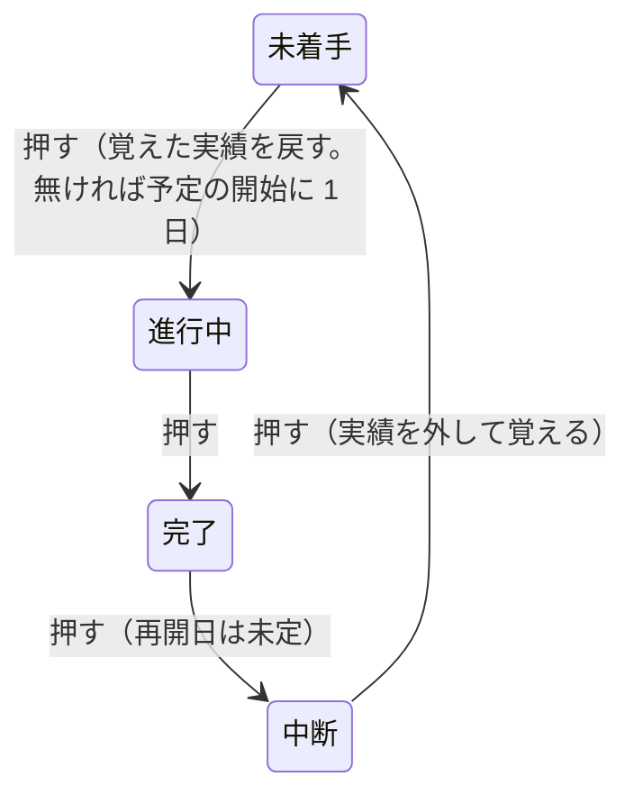

# 掴み代・ポインタ・札・操作 —— 触って決めた実物の見本

- 作った日: 2026-09-18 ／ 決め切った日: 2026-09-19
- 見本: [`grab-area-sizing-sample.html`](grab-area-sizing-sample.html)（**1 ファイルで完結する。ダブルクリックすれば開く。** サーバーも通信も外部の書体も要らない）
- 規則の整理（仕様案）: [`spec-draft-ja.md`](spec-draft-ja.md)
- 今の仕様のうち置き換えるもの（旧 → 新の対応表）: [`old-to-new-map-ja.md`](old-to-new-map-ja.md)
- 同じ CR に入れる要素の洗い出し（23 件）: [`cr-inventory-ja.md`](cr-inventory-ja.md)
- 裁定: [`rulings.md`](../../docs/development-records/rulings.md) の `JDG-180`〜`JDG-221`
- 次の段取り: [`handoff.md`](../../docs/development-records/handoff.md) の §1.2（Step 1a〜5）

## 位置づけ

| 文書 | 持つもの |
|---|---|
| 見本（HTML） | 決めた規則の**実物**。すべて実装して、ブラウザで測ってある |
| 仕様案（`spec-draft-ja.md`） | 規則を上位要求 → 表 → 定数の順に整理したもの。変更要求（CR）はここから起こす |
| 旧 → 新の対応表（`old-to-new-map-ja.md`） | 今の仕様の行・要求のうち、新しい表が置き換えるもの |
| 同梱の洗い出し（`cr-inventory-ja.md`） | 仕様案の表がまだ覆っていないのに、同じ CR へ入れる要素 |
| `rulings.md` | 利用者の言葉（逐語）と、覆した古い裁定 |
| 本書 | 見本の使い方、調べたこと・測ったことの控え、経緯 |

- **仕様に着地するまで**は、見本と `rulings.md` が拠り所になる。**着地した後**は仕様の表が正本になり、見本はその表を目で確かめる実物になる。食い違ったら仕様が勝つ（見本を直す）。
- 仕様の図は、見本を固定の設定で描いて SVG に書き出して作る。手では描かない。
- ⛔ 本書は規則を表で持たない（仕様案と二重にしない）。

[`13-grab-areas`](../13-grab-areas/) は**どこを**掴めるかを決めた見本である。本書の見本は、**どれだけの広さで掴めるか、重なったらどれが応えるか、掴むと何が起きるか、どう見せるか**を決めた。

## 開き方と触り方

| したいこと | すること | 画面に出るもの |
|---|---|---|
| 形を動かす | バーの本体・端・マーカー・ダミー・フェードの □・マイルストーンを引く | 図の下に「引いている: `task-plan-end`（+3 日）」 |
| 状態を変える | 進捗マーカーを押す（動かさずに離す） | 「押して状態を巡らせた: 進行中 → 完了（PV-2。絵は変えない）」 |
| どれが応えるかを見る | ポインタを置く | 「掴み代: `task-actual-start`（横 7.0px / 縦 10.3px）」と、その掴み代のポインタの形 |
| 段を入れ替える | ⑤ の段で本体を上下に引く | 予定と実績が一緒に移る。日付は変わらない |
| 依存線を選ぶ ／ 消す | 線を押す ／ Delete か「選んだ線を消す」 | 「選んだ: 依存線 FS（準備 → 作業）」。選んだ線は赤く太くなる |
| 依存線を引く | 「依存線を構える」を押し、結ぶ元の**予定**の左半分（開始）か右半分（終了）を押して、結ぶ先の予定の左半分か右半分で離す | 種類は半分の組合せで決まる（右 → 左 ＝ FS、左 → 右 ＝ SF、右 → 右 ＝ FF、左 → 左 ＝ SS）。Esc で構えを解く。予定を表示していないときは引けない |
| 値を変える | 右のペインの各節のつまみ | 左の絵と当たり判定が、見えたままその場で変わる |
| 右のペインの幅を変える | 2 つのペインのあいだの棒を左右に引く。ダブルクリックで畳む ／ 戻す | 幅はこのブラウザが覚える。2 つのペインはそれぞれ縦にも横にも別々にスクロールする |
| 値を伝える | 図の下の灰色の塊（今の値）をそのまま貼る | 「この値にしろ」と伝えられる。この塊は選んで写せる（図の上で引いても字は選ばれない） |
| やり直す | 「形を元に戻す」 | 形だけ初期に戻る（つまみはそのまま） |

## 画面の作り

### 左のペイン —— 5 つの行

| 行 | 載っているもの | 確かめること |
|---|---|---|
| ① 予実のあるタスク（`===`） | 予定（フェードの台形）・実績・進捗マーカー・名前・担当と進捗 | 端・マーカー・フェードが同じ行に並んだときの掴み代の分け方。マーカーが実績の中にいるときと外にいるときの違い |
| ② 未着手（`===`、ダミー） | 予定・実績のダミー（実績の帯に描く） | ダミーを引くと、そのまま実績になること |
| 3 マイルストーン | 予定の菱形・実績の菱形（またはダミー）・マーカー・名前、**隣のマイルストーン**（予定だけ） | 縮小して予実と隣が重なっても、どれも指せること |
| 4 矢印（`--->`、再開日のある中断） | 3 段: 担当 : 進捗・マーカー・名前 ／ 予定の矢 ／ 実績の矢（`JDG-212`）。見出しに 3 段の縦幅と `===` のバーの高さを出す | 3 段が `===` のバーより低く収まること。札が動かず、予実の掴み代が中線で分かれること。「線だけの形」を端点スパンに切り替えると、両端に点が付く（㉕）。マーカーを 1 回押すと未着手になり、3 段目の予定の開始に 1 日の印（ダミー）が出る（㉘） |
| ⑤ 縦に積んだ 3 本（「準備」は再開日のある中断） | 全部入りのタスク 3 本を、`JDG-148` の隙間（1px ＋ 依存線 1.5px ＋ 1px ＝ 3.5px）で 1 行に積んだ段 | 積んだとき、どれが応えるか（7 問の ⑤ ⑦ と `GS-1`）。隙間を通る依存線を掴めるか。行ごとハイライトボックスで囲んである —— 枠と四隅だけが枠を掴み、中のタスクは普段どおり掴める（㉗） |

依存線は、①→②（FS）、準備 → 作業（FS。上の 2 本の隙間を通る）、作業 → 確認（SS）の 3 本を最初に引いてある。札に出る名前（要件定義レビュー など）は、見本のための仮の文字である。

### 右のペイン —— 対象ごとの節

利用者の指示（2026-09-19）で、設定を対象ごとの節に分けた。つまみ・チェックの数は分ける前と同じである。

| 節 | 中身 | 仕様案の表 |
|---|---|---|
| 全体 | 表示の切り替え（掴み代の面・予定・実績・進捗マーカー・タスク名・進捗 ％・担当者・マイルストーンの実績・依存線）、全体のズーム（表示の倍率）・1 日の幅・バーの高さ（`S-4`）、進捗マーカー（3 種に共通: 描く径と掴み代）、担当・進捗の札（共通）、描く順（層を「奥へ」「手前へ」）、応える順（見るだけ） | XS ・ ZO ・ HT |
| === タスク | 掴み代（予定・実績・ダミー・フェード）、タスク名の余白（`--->` も同じ値）、ポインタ（端の矢印の一辺、見本） | GA ・ LP ・ PK |
| ---> タスク | 縦の 3 段（名前の段 → 予定の線 `S-196`、予定の線 → 実績の線 `S-10`、線の太さ、矢じりの横幅、矢じりの縦幅）、線だけの形（矢印 ／ 端点スパン）と点の径、掴み代（ダミーを含む）、ポインタの見本 | XS ・ GA ・ PK |
| ◆ マイルストーン | 掴み代、名前の余白、ポインタ（予定 ○ ・ 実績 ● の径） | GA ・ LP ・ PK |
| 依存線 | 掴み代、形（引き出し・引き入れ・矢じりの長さと幅）、引く・消す、ポインタの見本 | GA ・ 依存線の定数 ・ PK |
| ハイライトボックス | 掴み代（枠・四隅） | GA ・ HT |
| 7 問 | 推奨と今までの形を比べる切り替え（下の節）。㉔〜㉟ の見どころの一覧 | — |

**描く寸法のつまみは仕様の単位で持つ**（`JDG-219`）: バーの高さ・マーカーの径・札の余白・依存線の形・`--->` の段の間は、文書に保存する値（仕様の単位）で動かし、表示の倍率 100 で × 0.625 して描く（`DS-1`）。つまみの横に、描いた px を出す。既定は、それまで画面で見て決めた大きさを 0.625 で割った値なので、見た目は変わらない（バーの高さだけは仕様の 28 にしたので、描いて 18 → 17.5px）。掴み代とポインタの大きさには描く比を掛けない（`DS-7`・表 T-264）ので、画面の px のままである。「全体のズーム」は表示の倍率、「1 日の幅」は見るためのつまみ（描いた px）である。

### 掴み代の面の色

**色の面が掴み代そのものである。** 横と縦の広がりが、そのまま面の形になっている。面には縁取りを付けず（利用者の指示「縁取りの点線が見にくい」）、掴む物とは**別の色相**で薄く塗り、描いた形の**上に**重ねる。形の中にある掴み代（実績の端の内側など）は、その形の色が少し変わって見える。

| 掴み代の色 | 掴み代 | 掴む物の色 |
|---|---|---|
| 赤紫 | 予定の端、マイルストーンの予定 | 淡い青のバー、金の菱形 |
| 橙 | 実績の端、ダミー | 青のバー、紫のダミー |
| 青 | マイルストーンの実績・ダミー | 茶・淡い茶の菱形 |
| 黄緑 | 進捗マーカー | 緑の輪 |
| 青緑 | フェードの掴み点 | 赤い □ |
| 青紫 | 依存線（描いた線の縁から左右 2px） | 灰の線 |
| （塗らない） | 本体 | 掴み代が描いた形そのものなので塗らない。塗るとバーが灰色にくすむだけである |

## 7 問と、問い 8・9、仕様案 §8 の群 A〜E と ㉔〜㉟（2026-09-19 に全部決まった）

見本と既存の裁定・仕様が食い違う点が見つかった（`handoff.md` §1.2）。利用者の指示（「先ずはサンプルに反映しろ。触ってみてから決める。」）で、右のペインの「7 問」から推奨と今までの形を切り替えて比べられるようにした。① と ④ は掴み代の値そのものなので、値の組を入れるボタンである。

| 問 | 状態 | 見本の既定 | 比べる形 | 実測（既定の大きさ） |
|---|---|---|---|---|
| ① ダミーの掴み代 | **決まった: 実績と別の定数、既定は実績と同じ**（`JDG-213`） | 外側 0 ／ 内側 12（印の半分まで） | 前の形（開始の外側 12） | 既定: 156〜167.5 は予定の開始、168〜171.5 はダミーの開始。12px: 156〜171 がすべてダミーの開始 |
| ② マーカーの押下 | **決まった: 進み順の輪**（`JDG-214` の表 T-021a を `JDG-239` で覆した。㉟） | 進み順の輪（未着手 → 進行中 → 完了 → 中断 → 未着手） | 表 T-021a（・ には戻らない） | 既定: 「要件定義レビュー」は 進行中 → 完了 → 中断 → 未着手（実績を覚える）→ 進行中（2 日目から 12 日に戻る）。表 T-021a では 8 回押しても未着手に来ない |
| ③ `JDG-27` の扱い | **決まった: 覆された（一部）**（`JDG-215`） | マーカーが実績の開始の掴み代と重なるときだけ中心で割り、重ならなければマーカー全体 | — | ① の行: 144 実績の開始 → 151.5 マーカー → 158.5 本体。② の行（マーカーはダミーの右）と `--->`（1 段目）は、マーカーの 14 × 14 ／ 7.5 × 7.5 全体がマーカー |
| ④ 予定の端の上下 | **決まった: 0px**（`JDG-197`） | 0px（`===` と `--->` の 4 つの値） | 「GS-3 の 12」 | 予定の開始の掴み代の高さ: 0px で 18px、12px で 42px |
| ④a 予定の端の内側 | **決まった: 値を持ち、既定 0**（`JDG-216`） | 0px | 表の「内側」で試す | 下の「依存線が付く予定の端」 |
| ⑤ 同じ種類の掴み代が重なったとき | **決まった: 中心までの直線距離**（`JDG-217`） | 中心が近い方（直線距離） | 形の縁（`GS-2`）／ 横の中心だけ | ⑪ を入れる前は、「作業」を 60% にし ④ を 12 にして上の 2 本の予定の終了点の列（x 606）を縦になぞった境目が 中心 410、形の縁 411、横だけ 401.5 だった。⑪ を入れた後は 3 つとも 412 で、⑤ の行（x 440〜620、y 380〜450）で答えの違う点が 188 → 0（依存線を出すと 88 → 0） |
| ⑥ 「入る」の判定 | **決まった: 終了側だけ**（`JDG-224`） | 終了側だけ `S-91` を取る | `FR-002` のまま ／ マーカー ＋ 間隔 ＋ 名前 | ①行の名前が実績の中に入る最小の 1 日の幅: マーカーを出すと 終了側だけ 8px、`FR-002` のまま 10px、今までの形 7px。マーカーを隠すと 7 ／ 9 ／ 6px |
| ⑦ 形の外で依存線とフェードが重なったとき | **決まった: フェードが先、次に線**（`JDG-218`） | フェードが先、次に線 | 線が先（`GS-4` のまま）／ 表 T-023d の並び | ⑤ の隙間の中段の予定の開始の 4px 左（488, 411.75）: 既定では依存線、比べる形ではフェードの掴み点が応える。「作業」のフェード入の 8 × 8 の掴み代（64px²）の中では、線が先なら フェード入 28・線 32・上のバー 4px²、フェードが先なら フェード入 60・上のバー 4px² |
| 8 進捗マーカーを依存線より手前に描くか | **決まった: 手前**（`JDG-210`） | 手前（「描く順」で入れ替えられる） | 仕様の `ZO-3`（線より奥） | — |
| 9 依存線の値の 2 点 | ② は**決まった: 見本を仕様の単位で書き直す**（`JDG-219`）。① も**決まった: 引き入れのつまみの下限を矢じりの長さに結ぶ**（`JDG-225`） | 引き入れ 16 ＞ 矢じり 9.6（画面で 10 ＞ 6px） | 矢じりを 20 にすると引き入れも 20 になり、それより短くできない | 下の「依存線の走りと矢じり」 |

- ⑤: 「形の縁（`GS-2`）」は仕様がいま定めている測り方である。中心と形の縁が違う答えを出すのは上下のバーの高さが違うときだけなので、「作業」のバーの高さのつまみ（既定 100%）を付けた。
- ⑥: マーカーを実績の開始に置き、開始の掴み代をマーカーの中心で止める設計（`JDG-187`）は、マーカーを開始の掴み代の上にわざと置く。開始側に `S-91` を取る `FR-002` の理由（端の掴み代の上に何も置かない）とは両立しないので、推奨を終了側だけにした。
- ⑦: 仕様の中の食い違いである（`DFC-657`）。`GS-4` の定めは形の外で線を先にするが、その理由の文は表 T-023d の並びを誤って引いている（表ではフェードが線より上）。推奨は、定めと `JDG-150` のとおり線を先にし、理由の文を直すことである。フェードの掴み点は、自分のバーに載る 4 分の 1 では `GS-1` によって残るので、線のそばでも掴める。
- **`GS-1`**（描いた形の上は、その形のタスクだけが応える）は仕様どおりの規則で、比べるために切り替えられる。上のバーの下の縁（490, 409.5）を指すと、オンでは上のバーの本体が、オフでは中段のフェードが応える（実測）。

### 群 A・B（2026-09-19 に決まった。`JDG-209` ／ `JDG-210`）

仕様案 §8 の群 A は「仕様へ戻す」、群 B は「推奨どおりで見本を満たすなら OK」と決まった。見本を次のとおり直して測った（前の版と今の版を同じ点で比べた）。群 D（CR の組み方）は推奨どおりで、見本は変わらない（`JDG-211`）。

| 問い | 見本で変えたこと | 実測（前 → 今） |
|---|---|---|
| ⑬ ◆ の実績・ダミー | 予定の 0.7 → 0.5715（`actualOfPlan`） | 実績の菱形の半径 ÷ 予定の半径 0.7 → 0.57。実績の掴み代 12.6 → 10.29px 角 |
| ⑭ 形の上の依存線 | 線の中心から 線の太さ ÷ 2 ＋ 1px → 線の太さ ÷ 2 | 「作業」の予定の上を縦に通る線（x 426）で、線が応える幅 1.75 → 0.75px（片側） |
| ⑯ `--->` の断面 | 段の比 0.10 ／ 0.42 ／ 0.72 をやめ、今の仕様の式（表 XS） | 予定の線 2.88 → 1.8px、矢じり 長さ 14.4 × 高さ 9.22 → 5.76 × 5.76px。実績の線 2.3 → 1.8px。名前の箱の下端と予定の形の上端のあいだ 2.17px |
| ⑰ `--->` のマーカーの高さ | 名前の段 → 実績の矢の中心（`FR-002`）。⚠️ その後 `JDG-212` で 1 段目（名前の左）に置き換わった | マーカーの中心 237.8 → 261.32（実績の矢の中心） |
| ⑱ `--->` のマーカーの径 | 14px → 名前の字の大きさ | 14 → 7.5px（字は `S-8` の床 12 × 0.625 で決まる） |
| ⑲ 区切りと大きさ | 空白 1 つ → 「 : 」。`--->` の札は 0.85 倍 | 「設計担当 40%」 → 「設計担当 : 40%」、字 9.26 → 7.5px |
| ①b ダミーの終了 | 外側 12 → 0 | 掴み代の幅 15.5 → 3.5px（印の右半分） |
| ①c ダミーの帯 | マーカーの帯（14px）→ 実績の帯（10.29px）。描く帯も同じ | 描いた印 7 × 14 → 7 × 10.29px |
| ⑩ マーカーとフェード | マーカーの描いた形の上では、フェードを「進捗マーカー（実績の中）」の後へ回す | ① の行（予定の開始 ＋ 2、上端 ＋ 3）: フェード入 → マーカー。⑤ の「作業」のフェード入を 1 日入れた点: フェード入 → マーカー |
| ⑪ 上下のタスク | 形の外では、描いた形が上下に近いタスクの掴み代だけを残してから種別の順 | ④ を 12 にし依存線を隠した ⑤ の隙間 2,884 点のうち 19 点で「準備」のフェード出 → 「作業」の予定の終了 |
| ⑳ `--->` の予定の塗り | #7aa9de → #5390d4 | 地に対して 2.41 → 3.27 : 1、実績 ÷ 予定 4.86 → 3.58 : 1（`CT-3` の 3 : 1 を保つ） |
| ㉑ フェードの掴み点 | バーの層 → 札より手前の層（表 ZO の 10） | 層 7 つ。描く順を入れ替えても 6,205 点で応える掴み代は変わらない |

- 8（マーカーを線より手前）は前から満たしていた。⑫（注記）と ⑮（行の帯の高さ）は、見本に注記も行の組み立ても無いので、見本では確かめられない。
- 掴み代のつまみ 34 本は、どれも自分の対象だけを動かす（はみ出し 0）。既定の大きさで掴み代は 61 個のまま。
- ⑰ は今の仕様の中で食い違う（`FR-002` は線だけの形について「実績の高さ」、`LF-11` は形を分けずに「予定バーの中心」。アプリは `LF-11`）。線だけの形について書いた `FR-002` を採った（`DFC-663`）。`--->` のマーカーは実績の開始の掴み代の上に立つが、実績の開始の掴み代は軸の左端に中央合わせなので、左の半分が残る。
- ⑯〜⑱ で `--->` の名前とマーカーは小さくなった（字 7.5px、マーカー 7.5px）。名前はマーカーの右に続くが、マーカーは実績の高さ、名前は予定の上の段に立つ。

### 再開アイコン（㉖ で決まった。`FR-044`・`JDG-230`）

利用者の指摘で、新方式に再開アイコンの定義が抜けていたので、案を立てて見本に入れた（仕様案の表 XS 10〜13・LP・GA 20・HT・PE 11・PK 9・ZO 4 と 7、§8 の ㉖）。中断のあいだだけ描き、マイルストーンには描かない（今の MUST NOT のまま）。見本では「準備」（`===`）と「設計レビュー」（`--->`）を、再開日のある中断にしてある。「確認」のマーカーを押して 完了 → 中断 にすると、再開日が未定のアイコンが出る。

⭐ 利用者の裁定（2026-09-19、`JDG-226`）: 再開アイコンは**いつも実績の右**に立つ —— すでに実績のある期間に再開することは無いからである。再開日の既定（未定のとき立つ日）は停止日の翌日。名前とマーカーが実績に入らないときは 実績 → アイコン → マーカー → 名前 と並び、入るときはマーカーと名前が実績の中、アイコンは実績の右に立つ。前の案（未定はマーカーのすぐ右、`--->` は 1 段目）は退いた。

| 場面 | 置き場 | 実測（既定） |
|---|---|---|
| 再開日あり（`===`） | 実績の帯の中心線の再開日。縦棒を再開日の左の境目に、腕を右へ。停止日から縦棒まで破線 | 「準備」: 停止日 528 → アイコン 564（37 日目）、掴み代 14 × 14 |
| 同上、名前が実績に入らない | マーカーと名前は、破線とアイコンの右に立つ（札の基準の終了をアイコンの右端まで延ばす） | 1 日 4px: アイコン 268〜282、マーカー 282、名前 302 |
| 再開日が未定（`===`） | 停止日の翌日（実績のすぐ右）に 0.7 倍で薄く。札の並びには入らない | 「準備」を未定にして: 停止日 528、アイコン 528〜537.8（9.8 × 9.8）、マーカー 456 と名前 476 は実績の中。1 日 4px: アイコン 256〜265.8、マーカー 265.8、名前 285.8 |
| 再開日あり（`--->`） | 3 段目。腕を実績の線に、縦棒は下へ。実績の線は停止日で矢じり無しに止まる。掴み代は中線より下だけ | 「設計レビュー」: 停止日 288 → アイコン 324（17 日目）、掴み代 7.5 × 5.25 |
| 再開日が未定（`--->`） | 3 段目の実績の線の右端（停止日の翌日）。1 段目の札とは重ならない | 停止日 288、アイコン 288〜293.25（5.25）。1 段目はマーカー 192、名前 205.5 のまま |

- 引けば再開日が離した日になる（「準備」を +2 日で 39 日目）。停止日の翌日より前には置けない（左へ大きく引いても 34 日目で止まる）。未定のアイコンは停止日の翌日から数えて再開日を置く（未定の「準備」を +3 日で 37 日目）。押すだけでは何も起きない。中断のあいだ、マーカーを引いても実績は動かない（28 日目から 6 日のまま）。
- 6 通りの 1 日の幅（4〜30px）× 再開日あり ／ 未定で、アイコンの左端が停止日より左に来たことは 0 回、「入らない」ときに マーカーがアイコンの右端より左に来たことも 0 回。
- 応える順は、実績の外に立つマーカーと同じ（予定の本体より先。今の `GR-8` の MUST）。ポインタは再開アイコンと同じ折れ矢印（利用者の指定。小さめの 12px。黒の中・白の縁。押さえる点は折れ目 ＝ 再開日の左の境目）。
- マーカーを隠すか実績を隠すと、描かず掴めない（掴み代 2 → 0）。
- ⚠️ 今の仕様との違い: ① 今の仕様は、再開日のアイコンが名前と重なりうるのに何も決めていない —— 案は、名前が入らないとき札をアイコンの右へ出す ② 今のアプリは破線の刻み（`S-28` ／ `S-29`）でアイコンの腕を描いている —— 案は、停止日からアイコンまでを破線で繋ぎ、アイコンは実線 ③ 未定のアイコンの薄さと色は仕様に無い（アプリは仮置き `PND-476`）—— 案はマーカーと同じ緑で、薄さ 0.55。

### ㉔〜㉟ の答え（2026-09-19、`JDG-228`〜`JDG-239`）

利用者は、2 件の読みの確かめ（「⑨-2」は問い 9 の ① の 2 番目の案、再開アイコンの 5 行目は書き間違い）を「両方あってる」とし、12 の問いを推奨どおりに決めた。見本に入れて測った。

| 問い | 答え | 見本で確かめる所 | 実測（既定） |
|---|---|---|---|
| ㉔ 進捗マーカーの大きさ | 上限を予定バーの高さにし、既定は 14px（仕様の単位で 22.4）のまま | 「全体」の「マーカーの描く径」 | 上限は予定バーの床（actualMin ÷ actualOfPlan ≒ 28。読み 1）と予定バーの高さの低い方で、つまみの刻みでは 27.2 まで（予定バーを 40 にしても 27.2）。予定バーを 20 にすると、マーカーも 20（描いて 12.5px ＝ バーと同じ）で止まる |
| ㉕ 端点スパンの点 | 点の径を独立の設定値にする。既定は今の見た目 | 「---> タスク」の「線だけの形」を端点スパンに | 点 4px（6.4）。掴み代は点の中心に中央合わせ（予定の終了 360 ＝ 終了の点の中心 360）。中断中の実績は終わりの点を付けない |
| ㉖ 再開アイコン | 案のとおり（破線・未定は 0.7 倍で薄く・折れ矢印のポインタ 12px・隠すと掴めない・中断中の矢印は矢じり無し） | 「準備」「設計レビュー」 | 上の「再開アイコン」の節 |
| ㉗ ハイライトボックス | 枠線の近くと四隅だけが枠を掴む。中は素通し | ⑤ の行を囲む枠。「全体」で表示を切り替える | 枠の中の 5,712 点のうち、枠が応えたのは 0 点。枠を引くと 2 日動き（24〜42 → 26〜44）、右下の隅を引くと右端だけ動く |
| ㉘ `--->` の未着手の印 | 実績の端と同じ値（端ごとに中央合わせ 12）。重なる所は印の真ん中で分ける | 「設計レビュー」のマーカーを 1 回押す | 印は幅 3.75px。開始の掴み代 186〜194、終了 194〜201.75（印の真ん中 193.9 で分かれる）。終了を +3 日引くと 6 日目から 4 日の実績、開始を −2 日引くと 4 日目から 3 日 |
| ㉙ 複数を選んで縦に引く | 選んだ全部が同じ行数だけ移り、選んだまま | 見本に複数の選択と行の移動が無いので、示さない | — |
| ㉚ マーカーを引いて実績を動かす | `===` で実績の右のマーカーに加え、未着手のマーカー（ダミーの右）も。◆ のマーカーは引いても動かさない | 「結合試験」のマーカー、◆ のマーカー | 「結合試験」のマーカーを +3 日引くと 4 日目から 3 日の実績。◆ のマーカーを引いても実績は 24 日目のまま |
| ㉛ マイルストーンを縦に引く | 予定の菱形を縦に引けば、予定と実績が一緒に行を移る（日付は変わらない） | ◆ の予定を上下に引く | 見本には移る先の行が無いので、引いているあいだ移る先の行に点線の菱形を出し、離すと「2 行移す操作」と出して元の行に戻す |
| ㉜ `--->` の「形の上」 | 線ごとの帯（見本のまま） | — | 見本は前からこの形 |
| ㉝ 依存線を結ぶ所 | タスクのどこでも（予定・実績・マーカー・名前・担当の札）。開始か終了かは予定の中点の左か右か | 「依存線を構える」 | 「設計レビュー」の名前から「結合試験」の担当の札へ引くと SS（名前も札も予定の中点より左）。3 段目の実績の上でも「設計レビュー」と読む |
| ㉞ 矢印だけの行の高さ | このまま（低くなる効き目は段を積んだ行だけ） | 見本の `--->` は 1 段なので示さない | — |
| ㉟ マーカーの押下の巡り | 進み順の輪 | 「7 問」の ② の既定 | 下の「マーカーの押下の巡り」の節 |

### 群 F —— 今の仕様と突き合わせて出た問い（㊱〜㊳。2026-09-19 に答えが出た。`JDG-240`〜`JDG-242`）

㉔〜㉟ の答えを今の仕様と突き合わせた（仕様案 §9）。答えから決まらないものが 3 つ出たので、見本で比べられるようにした（右のペインの「7 問」）。利用者は 3 つとも推奨どおりに決め、読み 4 つも「全部あってる」と確かめた（仕様案 §8 の群 F）。

| 問い | 中身 | 見本で比べる所 | 実測 |
|---|---|---|---|
| ㊱ 再開日が先のときの札 | **決まった: B**: 札は実績のすぐ右、アイコンと重なるときだけアイコンの右（未定のアイコンでは今までどおり） ／ A: いつもアイコンの右 | 「準備」の再開アイコンを 50 日目へ引き、1 日の幅を 6px に | B: 停止日 324 のすぐ右にマーカー 324・名前 344、アイコン 420。A: マーカー 434・名前 454（アイコンの右）。再開日が 36 日目か未定なら、どちらもアイコンの右 |
| ㊲ 引ける進捗マーカーのポインタ | **決まった: A**: 指のまま ／ B: 実績の終了の矢印 → 黒 | 「結合試験」のマーカー（ダミーの右） | B にすると、引けるマーカー（実績かダミーの右に立ち、中断でないもの）だけが矢印になる。実績の中のマーカーと ◆ のマーカーは指のまま |
| ㊳ 端点スパンの点の重なり | **決まった: A**: 許す（既定で 1px） ／ B: 間を点の径に合わせて広げる | 「線だけの形」を端点スパンに（「設計レビュー」の開始は予実とも 6 日目） | 予定の開始の点と実績の開始の点の中心は 3px 離れ、半径 2px ずつなので 1px 重なる |

あわせて、前の裁定から決まる 2 つを見本に入れた: 未定の再開アイコンは小さく描くが、掴み代はマーカーの大きさのまま（`JDG-39`。「準備」を未定にして 14 × 14、描いたのは 9.8）。ハイライトボックスの枠がバーを横切る所では、枠は描いた線そのものでだけ応える（依存線と同じ。枠を 30 日目へ動かすと「確認」のバーの上で、枠線から ±0.5px は枠、±2px はバー）。

### 読み直し（仕様案を CR に起こせるか。38 件）

別の体に、仕様案・対応表・台帳を突き合わせて「このままでは CR を書き違える所」を探させた（38 件）。前の裁定と今の仕様から答えが決まるものは、仕様案・対応表・見本を直した。見本で直したのは 3 つ:

| 直したこと | 根拠 | 実測 |
|---|---|---|
| マーカーの描いた箱の上では、実績の端の次にマーカーが応え、予定の端・本体・依存線・フェードはその後 | 今の仕様の C8（マーカーの上では予定の端点より先）、`JDG-178`・`JDG-187` | 実績が予定より 1 日早く始まる「要件定義レビュー」: 直す前はマーカーの右半分 7px のうち 5px（139.5〜144.5）で予定の開始が応えた。直して 0px |
| 同じ種別で距離が同じなら、日付の遅い方（終了の側）が応える | 今の `TE-1`・`TE-4`、`FR-110`（描いた前後で決めない） | 見本の中で答えが変わったのは、同じ依存線の 2 本の線分が接する角だけ |
| `--->` の未着手の印を、1 日の実績と同じ形（短い矢じり付きの矢、端点スパンなら両端の点）で描く | 今の `DM-4` | 矢じりは矢の長さの 0.4 倍で頭打ち（1.5px） |

利用者の答えが要った 3 つは、2026-09-20 にどれも推奨どおりに決まった（仕様案 §8 の群 G、`JDG-245`〜`JDG-247`）: ㊴ 依存線を隠しているあいだは選ぶ・直す・消すことができない（表示に戻してから）／ ㊵ 名前の字は 1 色（濃い字に地の色の縁）で、濃い実績の中でも変えない ／ ㊶ 画像のポインタを描けない環境では、動く向きを示す環境の形に替える（見本もそう替える: 端・フェード・◆ の実績とダミー・再開アイコンは ew-resize、◆ の予定は move、依存線は pointer）。これで仕様案に決めていないことは無い。

### `--->` の 3 段（`JDG-212`・`JDG-221`）

利用者の指示で、`--->` を 3 段にした —— 1 段目に 担当 : 進捗・進捗マーカー・タスク名（左から）、2 段目に予定の矢、3 段目に実績の矢。字が `===` より一回り小さく（`S-9`）、予定と実績の矢の間が狭いが区別できることで、3 段の縦幅が `===` のバーより低くなることを狙う。

値の持ち方（`JDG-221`）: 線の太さ・矢じりの横幅（長さ）・矢じりの縦幅（高さ）は、それぞれ独立のつまみである。2 つの間（名前の段 → 予定の線、予定の線 → 実績の線）は、描いた線どうしのあいだで測るので、0 で接する。矢じりが線より高いと、その差の半分ずつが間へはみ出す。

| 設定（仕様の単位） | 名前 → 予定の線 | 予定の線 → 実績の線 | 3 段の縦幅 | `===` のバー |
|---|--:|--:|--:|--:|
| **既定**（間 2 ／ 2、線 2.8、矢じり 5.6 × 5.6） | 1.25 | 1.25 | **14.375** | 17.5 |
| 間 0 ／ 0 | 0 | 0 | 11.875 | 17.5 |
| 間 0 ／ 0、線 4 | 0 | 0 | 13.0 | 17.5 |

（px は描いた大きさ。見本の探り針で、描いた線と矢じりの縁から測った）

- 前の持ち方では、線 ＝ 予定の帯 × 0.20、矢じり ＝ 線 × 倍率、間は「矢じりの高さで取った段」どうしのあいだだった。線は段の中央にあるので上下に 0.875px ずつ空き、間を 0 にしても 2 本の線のあいだに 1.75px 残った。
- 1 段目の高さは字の大きさ（7.5px）で数える。描いた字の箱は 10px あり（既定の書体）、上に 1.25px はみ出す。
- マーカーは 1 段目の、基準（実績、無ければダミー、実績を隠せば予定）の開始に立つ（`JDG-183`）。その下に他の段の掴み代が無いので、掴み代はマーカー全体である（③）。
- 段の位置は、矢の横幅によらない（短い矢で矢じりが頭打ちになっても段は動かない）。実績を隠しても 3 段目は取っておく。

## 調べたこと・測ったことの控え

### 掴み代を操作対象ごとに独立させた（`JDG-194`）

1 つの値がほかの対象の掴み代を動かさないように、掴み代を「対象 × 向き」の値に分けた（値そのものは仕様案の表 GA）。分ける前の見本では、次の値が対象をまたいで効いていた。

| 分ける前 | 何に効いていたか | 今 |
|---|---|---|
| 予定の端 横（`S-90`） | `===` の予定の両端の外側、`--->` の予定の両端の幅、④ がオンのときはその上下も | 8 つの値に分けた |
| 実績の端 横（`S-91`） | `===` の実績の両端の内側、ダミーの開始と終了の外側、`--->` の実績の両端の幅 | 6 つの値に分けた |
| 実績の端 縦 | 実績・ダミー・◆ の実績とダミー・`--->` の実績の上下 | 8 つの値に分けた |
| マーカー 一辺 | マーカーの掴み代、描く径、ダミーの幅、実績の開始の止め位置、「入る」の判定 | 描く径と掴み代を別の値にした |
| 縦の下限 | すべての掴み代の縦 | なくした |
| `--->` の予定の本体 | ④ の縦の張り出しを借りていた（高さ 10.26px） | 描いた矢の高さだけ（7.31px） |

掴み代どうしではない依存（札や描く大きさとのあいだ）は残した。その辺は仕様案 §3 の表にある。

### ダミーの開始（問い ①）

前の形では、ダミーの開始の掴み代を予定の開始日の**左へ** 12px 伸ばしていた。ダミーは応える順で予定の端より上なので、行の中央の帯では予定の開始の掴み代（156〜168）がすべてダミーに取られ、予定の開始を掴めるのは上下の 2px の帯だけだった（実測。ダミーがマーカーの帯 14px だったころ）。ダミーを実績の帯（10.29px）にした今（群 B ①c）、外側 12px にすると上下 3.86px ずつになる。予定の開始の左 12px から印の右端までで、予定の開始が応える面は 外側 0 なら 120.31px²、外側 12 なら 72.19px²（残りは依存線と本体とダミー）。`JDG-04` と `JDG-19` は「予定開始日の左は予定、右は実績」と 2 度決めており、実績の開始の掴み代は内側（右）へ伸びる。したがって「実績と同じつかみシロ」（`JDG-186`）は「予定開始日の右にだけ伸ばす」と読める。見本の前の形は、外側へ対称に伸ばした読み違いの可能性が高い。

### マイルストーン名の 25%（`JDG-183`）

利用者は、短い名前が菱形の中に収まる場面を増やすために、マーカーを出さないときの名前を 25% の位置から書くと決めた。2026-09-19 に「マイルストーンの横幅を 0〜100% としたとき、25% の位置から」と言い直した。前の版は「中心から右に 25%」を 75% の位置と読んでいたので、直した。

### 依存線は予定に付ける（`JDG-196`）

利用者の問い（「依存線って実績に対して描画するものか？」）を受けて、エージェントに調べさせた。どれも予定を指す。見本の前の版が「実績を描いていれば実績」に付けていたのは、前に立つ者の思い込みで、仕様と逆だった。

| 出典 | 言っていること |
|---|---|
| GRS の仕様 `FR-009` | 「依存線は予定の幾何に付くこと（MUST）。予定を表示していないときに限り、実績の幾何に付ける」。実装済みのアプリ（`attachedBar`）も同じ |
| MSPDI | `PredecessorLink` は「このタスクが開始日か終了日を頼る先行タスク」を定める。`Start` ／ `Finish` は予定日、`ActualStart` は事実の記録である。リンクが実績を動かすことはない |
| MS Project | 標準の Gantt は「予定のバー ＋ 中の細い進捗バー」で、GRS の `===` と同じ構造である。リンク線は予定のバーの端に付く |
| 一般的な工程表ツール | リンク線は、リンクが縛る現行の予定のバーに付く。基準の予定（ベースライン）にも実績にも付けない。現行のバーを「実績」、ベースラインを「予定」と呼ぶツールもあるので、呼び名で読み違えないこと |

そのうえで利用者は、予定が無いとき・予定を表示していないときは線を描かないと決めた（理由: 依存線は予定に対して設定する情報だから）。`FR-009` の「予定を表示していないときに限り、実績の幾何に付ける」はこれで覆る（`DFC-658`。アプリの `attachedBar` も直す）。

### 依存線が付く予定の端の掴みやすさ（問い ④a）

依存線は予定の端から出入りする。④ で上下の張り出しが 0 になったので、予定の端の掴み代は外側 12px の帯（バーの高さ 18px）だけであり、その中を線の掴み代が取る。

| 線の掴み代 ／ 予定の端の内側 ／ 走り | ⑤ の「準備」の予定の終了（線が出る） | ② の予定の開始（線が入る） |
|---|---|---|
| 線の中心から左右 6px ／ 0 ／ 14px（前の版） | 外側の帯で 3px | 外側の帯で 3〜6px |
| 線の縁から左右 2px ／ 0 ／ 14px | 外側の帯で 8.5〜11.5px | 外側の帯で 13px（最も遠い列は 6.5px） |
| 線の縁から左右 2px ／ 6px ／ 14px | 外側は同じ。加えてバーの上の 6px の列で 14〜18px | 外側は同じ。バーの上ではダミーが先に応え、4px |
| **線の縁から左右 2px ／ 0 ／ 引き出し 6px・引き入れ 10px（今の既定）** | 線の縦の脚が通る列（604〜608）で 6.5px、バーに近い列（602）で 8.5px、脚の外の列（610〜612）で 18.5px | 線の横の入口が中ほどを取る列（162〜166）で 13px、脚が通る列（156〜160）で 6.5px。④ を 12 にすると 37px ／ 18.5px |

⑭（形の上の線は描いた太さだけ）のあとで ② の予定の開始を面で測り直した（予定の開始の左右 12px × 行の上下 14px）: 内側 0 で予定の開始 123.5px²、内側 6 で 171.5px²（足されるのは 48px² だけ —— バーの上ではダミーが先に応え、実績の帯を取るので）。線の掴み代は どちらも 168.5px²。

測り方: 列ごとにポインタを 0.5px 刻みで縦に動かし、予定の端が応えた高さを足した。引き出しや引き入れが 12px より短いと、線の縦の脚が予定の端の外側の帯の中を通る。さらに掴みやすくしたければ、予定の端に内側の掴み代を持たせる（バーの上では `GS-1` によってそのタスクだけが応え、依存線は描いた線そのものでしか応えない）。

### 描く順と応える順（`JDG-203`・`MK-9a`）

利用者の指摘（「依存線の裏側に … タスク名を描いてないか？」）のとおり、前の版は依存線を全部の後に描いていたので、線が名前・担当と進捗・マーカーの上に乗っていた。仕様（`ZO-5`: 名称ラベルは依存線より手前）とも食い違っていた。見本は描く順を層の表にし、応える順とは別に管理した。描く順を入れ替えても、図の上の 6205 点で応える掴み代は 1 つも変わらなかった（実測）。仕様は既に、応える順を描く順から切り離している（`MK-9a`「掴みの優先順は重ね順と一致しない。これは意図した設計である」）。

| 奥から | 見本の層 | 仕様の 表 T-020 |
|---|---|---|
| 1 | 目盛・行の見出し | 行が無い |
| 2 | 予定・実績・ダミー・菱形・矢 | `ZO-1` → `ZO-1a` → `ZO-2`。ダミー・菱形は行が無い（`DFC-662`） |
| 3 | 依存線 | `ZO-4` |
| 4 | 進捗マーカー | `ZO-3` を依存線より手前へ移す（群 B 8。今の `ZO-3` は線より奥） |
| 5 | タスク名・担当・進捗 ％ | `ZO-5`（担当と進捗の札は行が無い） |
| 6 | フェードの掴み点 □ | 行が無い。仕様案の表 ZO の 10（選択の枠の層。群 B ㉑） |
| 7 | 掴み代の面（見本だけ） | — |

名前を線より手前にしても、縁取り（`S-34`、字の大きさ × 0.10）が細いので、字と字のすき間から線が見える。縁取りの太さは描く順とは別の判断である。

### 依存線の走りと矢じり —— 仕様との違い（`JDG-201`・`JDG-202`・`JDG-205`）

| 事柄 | 仕様 | 前の版の見本 | 今の見本 |
|---|---|---|---|
| 入口の走り | `S-19` × `S-20` ＝ 14px（`LF-4`。矢じりを含む） | 14px | 引き入れ 10px（矢じりを含む） |
| 出口の走り | 入口の走り − `S-19` ＝ 7px（`LF-4`「出口と入口に別々の設定値を持たない」） | 14px（仕様と違った） | 引き出し 6px |
| 矢じり | 長さ ＝ 底辺 ＝ `S-19` 7px | 7 × 8.4px（仕様と違った） | 6 × 5px |
| 描く比 | `S-18` ／ `S-19` の px には描く比（表示の倍率 100 で 0.625）が掛かる。アプリは入口 8.75px・出口 4.375px・矢じり 4.375 × 4.375px で描く（コードからの計算） | 掛けていない（見本の px は描いた px） | 同じ |

利用者の指示（引き出し・引き入れを今の 30% ほど、矢じりの幅を今の半分）は、仕様の今の作り（`S-20` の下限 1 超、`S-19` の 3 役、`LF-4` の 1 つの値）には入らない。仕様案では 4 つを別々の値にする。値は利用者がつまみで決めた 6 ／ 10 ／ 6 × 5px（`JDG-205`）。引き入れを矢じりより短くすると、矢じりの付け根が手前の曲がり角より外へ出る（問い 9）。

### ポインタ（`JDG-181`・`JDG-191`・`JDG-200`・`JDG-206`〜`JDG-208`）

- タスクの端は幅の広い箱型の矢印（予定は白抜き、実績とダミーは塗り）、一辺 16px（`S-249` を 24 → 16）。
- 依存線は線の矢印（細い軸と細い三角の矢じり）。最初の版は予定の端の矢印と見間違えそうだったので、矢じりの幅と黒の縁を半分にし、縁を角張らせた。
- フェードは直角三角形（10px。直角がポインタの位置）。縦を横の 75% にした。
- マイルストーンは手のひらをやめ、予定 ○（12px）、実績とダミー ●（8px）にした。
- 縁の太さは、依存線・フェード・○ ● で共通の 1 つの値（画面で約 0.47px）である。実寸では細く見えるが、利用者は今のままとした。

### マーカーの押下の巡り（問い ② → ㉟、進み順の輪に決まった。`JDG-239`）

**・ に戻らなかった原因**: 群 C ② の答え（`JDG-214`）で見本の既定を表 T-021a にした。表 T-021a は 未着手 → 完了 → 中断 → 進行中 → 完了 → … と巡り、`PV-4` が「未着手へ戻してはならない」（MUST NOT）と書く。未着手は入口にしか無いので、1 度押せば二度と ・ に来ない。見本は表のとおりに動いていた。

4 つの状態を 1 本の輪にすると、完了の 1 つ前に立てる状態は 1 つだけである。「未着手 → 完了」（`FR-011` の 1 押しの完了）と「進行中 → 完了」（`PV-2`）を両方 1 押しに保ったまま ・ へ戻ることはできない。

| 案 | 巡り | 重くなる押下 |
|---|---|---|
| **A（決まった・見本の既定）** 進み順の輪 | 未着手 → 進行中 → 完了 → 中断 → 未着手 | 1 日の作業の完了が 2 押し。中断からの再開も 2 押し |
| B 表 T-021a に戻り口を足す | 未着手 → 完了 → 中断 → 進行中 → 未着手 | 進行中 → 完了 が 2 押し（最も多い押下） |
| C 表 T-021a のまま | 未着手 → 完了 → 中断 → 進行中 → 完了 | 軽いが ・ に戻れない（利用者の指示に合わない） |

- 実績は外しても消えない: 中断 → 未着手 で実績を覚え、次の押下で戻す（取り消しでも戻る）。覚えるのは開いているあいだだけ（保存しない）。
- ◆ は 未着手 ⇄ 完了 の 2 つを巡る（完了 → 未着手 で実績の日を覚えて外す）。
- 見本の ② の選択で表 T-021a に戻せる。前に置いていた見本の仮の巡り（未着手 → 50% → 100% → 未着手）は消した。

## 実測（Microsoft Edge ＋ Playwright）

**測り方**: 見本を Edge で開き、Playwright でポインタを行に沿って 0.5〜1px 刻みで動かす。そのたびに図の下に出る掴み代の名前を拾う。探り針は一時ファイルで書いたので、リポジトリには置いていない。

| 確かめたこと | 結果 |
|---|---|
| 実績の開始とマーカーが重なる所 | 実績の開始の掴み代 168〜175、マーカー 168〜182（中心 175）。左半分は実績の開始、中心から右はマーカーが応える |
| マーカーを押し続ける（② を進み順の輪にして） | 「要件定義レビュー」: 進行中 → 完了 → 中断 → 未着手（実績を覚える）→ 進行中（2 日目から 12 日に戻る）。「結合試験」（未着手）: 進行中（4 日目から 1 日）→ 完了 → 中断 → 未着手。5 つのタスクのどれも 4 回で元の状態に戻る（再開日のあった中断は、再開日が未定になって戻る）。◆: 完了（24 日目）→ 未着手 → 完了（24 日目に戻る） |
| 本体を 4 日ぶん引く | 予定は 2 日目 → 6 日目。実績は 2 日目から 12 日のまま |
| 実績を予定より 3 日早く始める | 担当と進捗の札の右端 140.4 → 104.4。名前との間は 21.6px（直す前は 14.4px 重なっていた） |
| マイルストーン、1 日 2px | 予定の掴み代は中心 ±10.35、実績は ±6.3。行の中心では実績とマーカーが応え、上と下の帯（各 2.7px）では予定が応える |
| 隣のマイルストーン 2 つ（中心 172 と 184） | 境目は 178。ちょうど中点で分かれる |
| `--->` の端の掴み代 | 4 か所とも、掴み代の中心と形の基準点（軸の左端・`>` の中心）の差が 0 |
| 予定だけを表示する | マーカーは予定の開始（144）、マイルストーンのマーカーは予定の菱形の右端（441）に移る |
| つまみの効き（対象ごとの独立） | 掴み代のつまみ 34 本を 1 本ずつ動かし、動いた掴み代を数えた。34 本すべてが自分の対象だけを動かし、ほかの対象の掴み代は 1 つも動かない |
| 対象ごとに分ける前との一致 | 既定の値で、掴み代 61 のうち 60 が前の版と同じ位置と大きさ。違うのは `--->` の本体だけ |
| 名前の位置 | ①行のタスク名: 実績の開始 144 から、マーカーありで 164（144 ＋ 径 14 ＋ 6）、なしで 150（144 ＋ 6）。マイルストーン名（マーカーなし）は、基準が実績・ダミー・予定のどれでも菱形の幅の 0.25 の位置 |
| 札の余白のつまみの効き | どのつまみも自分の札だけを動かし、掴み代は 1 つも動かない |
| 依存線の付け先 | 予定を表示すると、3 本とも予定の端から出る（① の予定の終了 384 → ② の予定の開始 168 など）。予定を隠すと 0 本。構えても引けない |
| 依存線の掴み代とポインタ | 横に走る線の掴み代の高さは 5.5px。⑤ の隙間（x 540）を縦になぞると、準備の本体（〜410）→ 依存線（410〜413.75）→ 作業の本体。線の上ではポインタが線の矢印になる |
| 隙間（500, 412.5）／ 中段のバーの上（500, 414） | 隙間では依存線が、バーの上では中段の本体が応える |
| 依存線の選択・削除・作成 | 隙間の線を押して Delete で 3 本 → 2 本。構えて 確認 の右半分 → 準備 の左半分で FS が 1 本増える。矢印のタスクの予定 → マイルストーンの予定で FS を引ける |
| 依存線を隠す | 線 0 本・線の掴み代 0。「依存線を構える」「選んだ線を消す」が押せなくなり、構えていれば解ける |
| 描く順と応える順 | 描く順を入れ替えても、図の上の 6205 点で応える掴み代は 1 つも変わらない |
| ⑤ の本体を 1 段ぶん下へ引く | 段が 準備・作業・確認 → 作業・準備・確認 に入れ替わる。準備の日付は変わらない |
| 図の上で引いても字を選ばない | 図の空いた所から引いたとき、選ばれた字は 0 字（直す前は 355 字）。本体を引けば予定は動き、マーカーを押せば状態が巡る。今の値の塊は選んで写せる |
| ペインのあいだの棒（画面 1500 × 640） | 右のペインを 480 → 397 → 197 → 1197px。狭い方のペインが縦にも横にもスクロールする。ページ自体はどの幅でもスクロールしない。ダブルクリックで 0px、もう一度で戻る |
| 狭めたペインでの当たり判定 | ペインの幅を変えても、左のペインを横にスクロールしても、実物のポインタを置いた所で答えと図の下の表示が一致する |
| 設定のペインの節分け | つまみ 51 本がどれも今の値の塊を変える（効かないつまみ 0）。掴み代のつまみは節ごとの表に分かれて 34 本のまま |

## 仕様へ（次の段取り）

`handoff.md` §1.2 が段取りを持つ。

1. 旧 → 新の対応表（Step 1a）: [`old-to-new-map-ja.md`](old-to-new-map-ja.md)。
2. 1 本の CR で、削除と、仕様案の表・定数・図・上位要求を同時に当てる（Step 1b）。仕様案 §8 の問いは 2026-09-19 に全部答えが出た（最後は `JDG-228`〜`JDG-239`）。仕様案は、今の仕様の行と突き合わせて直した（仕様案 §9）。仕様案の問いは群 F まで全部答えが出た（`JDG-209`〜`JDG-242`）。次はこの案から 1 本の CR を書いて仕様へ当てる。
3. 実装と、仕様だけを読んで書く試験を並べる。表の 1 行が試験 1 件になる（Step 3 ‖ 4）。

## 経緯

| commit | 日付 | 何を変えたか |
|---|---|---|
| `e1d29dfb` | 09-18 | 掴み代を面で描き、つまみで数を変えられる見本を作った |
| `3c2132af` | 09-18 | マイルストーンの札を実績に付けた。`--->` の実績も矢の形にした |
| `0cdf58c1` | 09-18 | マーカーを押すと状態が巡り、引くと実績の終了が動くようにした |
| `7521f3f4` | 09-18 | マーカーを実績の終了に固定した。ダミーの掴み代を実績と同じにした |
| `a75ab2dc` | 09-18 | `--->` の実績も予定と同じく外側で掴むようにした（のちに中央合わせへ） |
| `a6d5aed3` | 09-18 | マーカーを出すときは名前をその右に置くようにした。フェードのポインタを三角にした |
| `8bb9d774` | 09-18 | 札の規則を `===` と `--->` で分けた。`--->` の掴み代を中央合わせにした。ダミーを実績として扱うようにした |
| `94522c9b` | 09-18 | マーカーで実績が動くのを、実績の右にいるときだけにした。マイルストーンのダミーを実績と同じ形にした。フェードのポインタを 10px にした |
| `f2830864` | 09-18 | 予定と実績を別々に消せるようにした |
| `ee993826` | 09-18 | マーカーの押下は状態だけにした。実績の開始の掴み代をマーカーの中心で止めた |
| `b3fd75c9` | 09-18 | 本体を引いても予定だけが動くようにした |
| `62cee63e` | 09-18 | 担当と進捗を、早い方の開始の左に置くようにした |
| `94e33c4b` | 09-19 | マイルストーンの掴み代を、実績は菱形そのもの、予定は幅の 115% にした |
| `3f714c6e` | 09-19 | 重なったら中心の近い方が応えるようにした。隣のマイルストーンを足した |
| `fa5ecefc` | 09-19 | 6 問を切り替えで比べられるようにした。⑤行、GS-1、表 T-021a の巡りとマーカーの記号を足した |
| `abdc94a2` | 09-19 | 表示と設定を左右のペインに分けた。⑤を予実のある 3 本の段にした。依存線（選ぶ・消す・引く）と ⑦ を足した |
| `6b2ef557` | 09-19 | 掴み代を操作対象ごとの独立した値（つまみ 34 本）にした |
| `be9fcadc` | 09-19 | 右のペインの幅を変えられるようにした。掴み代の面を、縁取りなしの薄い別の色相にした |
| `bdf49b6b` | 09-19 | マイルストーン名を菱形の幅の 25% の位置からにした。札の余白を 4 つのつまみに分けた |
| `ab9be4d6` | 09-19 | 依存線を予定だけに付けた。予定の端の上下の既定を 0 にした。依存線の表示の切り替えを上へ移した。依存線の掴み代を線の縁から 2px にし、ポインタを線の矢印にした |
| `f15ea18e` | 09-19 | 描く順を層の表にし、応える順と別に管理した。依存線の引き出し・引き入れ・矢じりをつまみにした。図の上で字を選ばないようにした |
| `8f6b165c` | 09-19 | 依存線の既定を利用者の指定（6 ／ 10 ／ 6 × 5px）にした |
| `f4146ca8` | 09-19 | 依存線のポインタの矢じりの幅と黒の縁を半分にし、縁を角張らせた |
| `46353cbe` | 09-19 | フェードのポインタを 75% の高さにし、縁を共通にした。マイルストーンのポインタを ○ ● にした。設定のペインを対象ごとの節に分けた |
| `de5955bf` | 09-19 | README を整理し、規則を仕様案（`spec-draft-ja.md`）へ移した。旧 → 新の対応表（`old-to-new-map-ja.md`）を足した。実績の端の掴み代を実績の幅の半分で止めた |
| `5a2d67d9` | 09-19 | 群 A（仕様へ戻す）と群 B（推奨どおり）を当てた: `--->` の断面・マーカー・字、◆ の実績の大きさ、「 : 」、形の上の線の幅、ダミーの帯と終了の外側、マーカーとフェード、上下のタスクの縦の距離、`--->` の予定の塗り、フェードの掴み点の層 |
| （この版） | 09-19 | `--->` を 3 段（担当・進捗・マーカー・名前 ／ 予定 ／ 実績）にした。線の太さ・矢じりの横幅・縦幅を独立のつまみにし、2 つの間を描いた線どうしで測るようにした（既定で `===` より低い 14.4px）。描く寸法のつまみを仕様の単位にした。ダミーの掴み代を実績と同じ形の別の定数にした。⑦ の既定をフェードが先にした。行の見出しを行の上の説明の行へ移した（「 : 」で長くなった札と重なっていた） |
| （この版の続き） | 09-19 | 再開アイコンの案を入れた（中断のあいだだけ描く。再開日ありは実績の帯の再開日に立ち停止日から破線、未定はマーカーの右。`===` で名前が入らないときは札をアイコンの右へ。`--->` は 3 段目 ／ 1 段目。引けば再開日）。ポインタを再開アイコンと同じ折れ矢印（12px）にした。「準備」と「設計レビュー」を中断にした |
| （この版の続き） | 09-19 | 同じ CR に入れる要素を洗い出した（`cr-inventory-ja.md`、23 件）。見本の選んだ依存線を 2 倍の太さで描いて掴むようにした（`SL-8`・`S-178`） |
| （この版の続き） | 09-19 | 再開アイコンをいつも実績の右に立てた（未定なら停止日の翌日。札の並びに入れない）。マーカーの押下を進み順の輪にして未着手へ戻れるようにした（表 T-021a にも切り替えられる）。引き入れのつまみの下限を矢じりの長さに結んだ（9 ①）。⑥ を決まったと記した |
| （この版の続き） | 09-19 | ㉔〜㉟ の答えを見本に入れた: マーカーの径の上限を予定バーの高さに結んだ、端点スパンと点の径、`--->` の未着手の印（ダミー）と掴み代、ハイライトボックス（枠と四隅だけが掴む）、◆ のマーカーを引いても実績を動かさない、◆ を縦に引くと移る先の行を点線で示す、依存線はタスクのどこでも結べる。つまみは 43 本 |
| （この版の続き） | 09-19 | ㉔〜㉟ を今の仕様と突き合わせ、仕様案を直した（§9）。答えから決まらない ㊱〜㊳ を見本で比べられるようにし、未定の再開アイコンの掴み代をマーカーの大きさに戻し（`JDG-39`）、ハイライトボックスの枠をバーの上では線だけにした |
| （この版の続き） | 09-19 | ㊱ B・㊲ A・㊳ A と 4 つの読みが決まった。見本の ㊱ ㊲ を「決まった」にし、㊳ の説明を足した。マーカーの径の上限を、予定バーの床（actualMin ÷ actualOfPlan）と予定バーの高さの低い方に結んだ（読み 1） |
| （この版の続き） | 09-20 | 仕様案の読み直し（38 件）を当てた。見本のマーカーの上の応える順、同じ距離のときの順、`--->` の未着手の印の形を直した。答え待ちは群 G の 3 つ |
| （この版の続き） | 09-20 | 群 G（㊴ A・㊵ A・㊶）が決まった。見本の替わりのポインタを ㊶ のとおりにした（◆ の予定は move、◆ の実績とフェードは ew-resize） |
