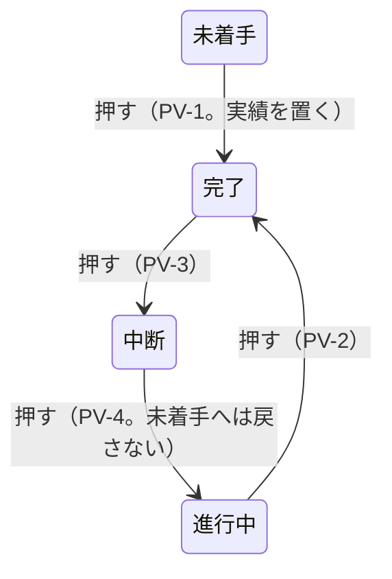

# 掴み代・ポインタ・札・操作 —— 触って決めた実物の見本

- 作った日: 2026-09-18 ／ 決め切った日: 2026-09-19
- 見本: [`grab-area-sizing-sample.html`](grab-area-sizing-sample.html)
  （**1 ファイルで完結する。ダブルクリックすれば開く。** サーバーも通信も外部の書体も要らない）
- 裁定: [`rulings.md`](../../docs/development-records/rulings.md) の `JDG-180`〜`JDG-193`
- 次の段取り: [`handoff.md`](../../docs/development-records/handoff.md) の §1.2（Step 1a〜5）

## 位置づけ

この見本には、利用者が触って決めた規則が**すべて実装されている**。対象は、掴み代・ポインタの形・札の置き方・押したり引いたりしたときの効果である。

- **仕様に着地するまで**は、この見本と `rulings.md` だけが拠り所になる。
- **着地した後**は、仕様の 6 つの表（表 GA・HT・RF・LP・PE・XS）が正本になる。見本は、その表を目で確かめるための実物になる。見本と仕様が食い違ったときは仕様が勝つ（見本の方を直す）。
- 仕様の図は、この見本を固定の設定で描いて SVG に書き出して作る。手では描かない。

⛔ **これ自体は仕様ではない。** 下の「決めた規則」は、仕様に着地したら表を指す 1 行に縮める（二重表現を残さないため）。

[`13-grab-areas`](../13-grab-areas/) は**どこを**掴めるかを決めた見本である。本書は、**どれだけの広さで掴めるか、重なったらどれが応えるか、掴むと何が起きるか**を決めた。

## 開き方と触り方

| したいこと | すること | 画面に出るもの |
|---|---|---|
| 形を動かす | バーの本体・端・マーカー・ダミー・フェードの □・マイルストーンを引く | 図の下に「引いている: `task-plan-end`（+3 日）」 |
| 状態を変える | 進捗マーカーを押す（動かさずに離す） | 「押して状態を巡らせた: 進行中 → 完了（PV-2。絵は変えない）」 |
| どれが応えるかを見る | ポインタを置く | 「掴み代: `task-actual-start`（横 7.0px / 縦 10.3px）」と、その掴み代に割り当てたポインタの形 |
| 大きさを変える | 右のペインのつまみ | 左のペインの絵と当たり判定が、見えたままその場で変わる。つまみの下に「効いている所」と値が出る |
| 段を入れ替える | ⑤の段で本体を上下に引く | 予定と実績が一緒に移る。日付は変わらない（`JDG-188`） |
| 依存線を選ぶ ／ 消す | 線を押す ／ Delete か「選んだ線を消す」 | 「選んだ: 依存線 FS（準備 → 作業）」。選んだ線は赤く太くなる |
| 依存線を引く | 「依存線を構える」を押し、結ぶ元のタスクの左半分か右半分を押して、結ぶ先の左半分か右半分で離す | 種類は半分の組合せで決まる（右 → 左 ＝ FS、左 → 右 ＝ SF、右 → 右 ＝ FF、左 → 左 ＝ SS。表 T-018）。Esc で構えを解く |
| 値を伝える | 最後の灰色の塊をそのまま貼る | 「この値にしろ」と伝えられる |
| やり直す | 「形を元に戻す」 | 形だけ初期に戻る（つまみはそのまま） |

**色の面が掴み代そのものである。** 横と縦の広がりが、そのまま面の形になっている。

| 色 | 掴み代 |
|---|---|
| 青 | 予定の端（マイルストーンの予定は淡い青） |
| 橙 | 実績の端・ダミー・マイルストーンの実績 |
| 緑 | 進捗マーカー |
| 桃 | フェードの掴み点 |
| 濃い灰 | 依存線（線の左右 6px） |
| 灰 | 本体（予定を動かす） |

## 5 つの行（①②⑤は同じ 1 つの描き方で描く）

| 行 | 載っているもの | 確かめること |
|---|---|---|
| ① 予実のあるタスク（`===`） | 予定（フェードの台形）・実績・進捗マーカー・名前・担当と進捗 | 端・マーカー・フェードが同じ行に並んだときの掴み代の分け方。マーカーが実績の中にいるときと外にいるときの違い |
| ② 未着手（`===`、ダミー） | 予定・実績のダミー | ダミーを引くと、そのまま実績になること |
| 3 マイルストーン | 予定の菱形・実績の菱形（またはダミー）・マーカー・名前、**隣のマイルストーン**（予定だけ） | 縮小して予実と隣が重なっても、どれも指せること |
| 4 矢印（`--->`） | 名前の段・予定の矢・実績の矢 | 段で分けた形では、札が動かず、予実の掴み代が中線で分かれること |
| ⑤ 縦に積んだ 3 本 | 予定・実績（またはダミー）・マーカー・フェード・札を持つタスク 3 本を、`JDG-148` の隙間（1px ＋ 依存線 1.5px ＋ 1px ＝ 3.5px）で 1 行に積んだ段。本体を上下に引くと段が入れ替わる。「作業」のバーの高さはつまみで変わる | 積むと、予定の端の縦の張り出しやフェードの掴み代が隣のタスクへ届く。そのときどれが応えるか（7 問の ⑤ ⑦ と GS-1）。隙間を通る依存線を掴めるか |

依存線は、①→②（FS）、準備 → 作業（FS。上の 2 本の隙間を通る）、作業 → 確認（SS）の 3 本を最初に引いてある。

札に出る名前（要件定義レビュー など）は、見本のための仮の文字である。

## つまみ（＝仕様の定数になる値）

利用者の裁定（`JDG-180`）で、**つまみの値はすべて設定の表 T-206 の行として持つ**。コードは生成した定数を読むので、値は 1 セルで変わる。**当面の値は下の既定値**である。

| つまみ | 既定値 | 範囲 | 仕様の行 |
|---|---|---|---|
| 予定の端 横（外側） | 12px | 0〜24 | `S-90`（同じ値） |
| 予定の端 縦（帯の外へ上下） | 7 問の ④ がオンなら `S-90` の 12px（`S-90` は「バーの上下と、端点の外側に 12px」）。オフならこのつまみ（既定 0px） | 0〜20 | ④ の答え次第 |
| 実績の端 横（内側） | 12px | 0〜24 | `S-91`（同じ値） |
| 実績の端 縦（帯の外へ上下） | 0px | 0〜20 | 新しく足す |
| マーカー 一辺（掴み代の正方形。円はその内側に描く） | 14px | 6〜32 | `S-22`（仕様は 16px。`JDG-180` により当面は見本の 14px） |
| フェード 一辺（掴み代） | 8px | 4〜20 | `S-92`（同じ値） |
| マイルストーン 予定の幅 | 予定の菱形の幅の 115% | 100〜200% | 新しく足す |
| 縦の下限（共通） | 0px | 0〜40 | 新しく足す |
| 依存線 線の左右 | 6px | 0〜16 | `S-137`（同じ値） |
| 実績と札の間隔 | 4px | 0〜24 | 見本は 1 つの間隔で表す。仕様は `S-23`（実績とマーカー、4px）と `S-32`（札とマーカー、8px）に分かれる。Step 1a で照合する |
| 札の字の大きさ | 実績の高さ × 0.90 | 0.50〜1.30 | Step 1a で既存の行と照合する |
| ポインタの矢印 一辺 | 16px | 8〜32 | `S-249`（24 → 16、`JDG-181`） |

つまみを持たない固定の値:

| 値 | 大きさ |
|---|---|
| フェードのポインタ | 10 × 10px（`JDG-191`） |
| フェードの描く □ | 5 × 5px（`S-109`） |
| 実績のダミーの幅 | マーカー径 × 0.5（`S-247`） |
| マーカーが実績の開始に立つときの、実績の開始の掴み代の上限 | マーカー径 × 0.5（＝マーカーの中心まで） |
| マイルストーンの実績の菱形 | 予定の菱形 × 0.7 |
| マイルストーンの実績の掴み代 | 実績の菱形そのもの |
| マーカーを消したときのマイルストーン名の書き出し | 基準の菱形の中心 ＋ 菱形 × 0.25 |
| 依存線の太さ | 1.5px（`dependencyWidth`） |
| 依存線の矢じり | 7px（`S-19`） |
| 依存線の入口と出口の走り | 14px（`dependencyRunOfArrow` 2 × `S-19`） |
| 積んだタスクの縦の隙間 | 1px ＋ 依存線 1.5px ＋ 1px ＝ 3.5px（`JDG-148`、`S-11`） |

「全体のズーム」「1 日の幅」「予定バーの高さ」は、見本を見るためのつまみであり、定数ではない。

右のペインでは、掴み代のつまみの下に**いま効いている所と値**が出る。別の規則に上書きされる所もそこに書く。たとえば「実績の端 横」は、マーカーが実績の中に立つときの開始ではマーカーの中心で止まり、① がオンのときのダミーの開始には使われない。④ がオンのあいだは「予定の端 縦」を無効にし、「S-90 に従う」と出す。

## 7 問を比べる切り替え（Step 1b の前に決める）

見本と既存の裁定・仕様が食い違う点が 7 つ見つかった（`handoff.md` の §1.2。⑦は依存線を入れて見つかった）。利用者の指示（2026-09-19「先ずはサンプルに反映しろ。触ってみてから決める。」）で、左のパネルの「7 問」から**推奨（オン、または既定の選択）と今までの形を切り替えて比べられる**ようにした。

| 問 | オン ＝ 推奨 | オフ ＝ 今までの形 | 実測（既定の大きさ） |
|---|---|---|---|
| ① ダミーの開始の掴み代 | 予定開始日から右へだけ（印の左半分）。`JDG-04` ／ `JDG-19` | 予定開始日の左へ 12px まで | オン: 156〜167.5 は予定の開始、168〜171.5 はダミーの開始。オフ: 156〜171 がすべてダミーの開始 |
| ② マーカーの押下 | 表 T-021a の順。絵が変わるのは `PV-1`（未着手 → 完了で、予定の開始に 1 日の実績を置く）だけ。マーカーに表 T-021 の記号が出る | 見本の仮の巡り（未着手 → 50% → 100% → 未着手） | オン: 進行中 → 完了 → 中断 → 進行中 → 完了、実績は 2 日目から 12 日のまま。未着手の行は押すと 4 日目から 1 日の実績が立つ |
| ③ `JDG-27` の扱い | —（記録だけの問い。挙動は変わらない） | — | — |
| ④ 予定の端の縦の張り出し | 上下に `S-90` の 12px（GS-3） | 「予定の端 縦」のつまみ（既定 0px） | 予定の開始の掴み代の高さ: オン 42px（18 ＋ 12 × 2）、オフ 18px |
| ⑤ 同じ種類の掴み代が重なったとき | 中心が近い方（直線距離） | 横の中心だけ | ⑤の段で、終わりの揃った上の 2 本の予定の終了点の列を縦になぞった境目（「作業」を 60% にして）: 中心 410、形の縁（GS-2）411、横だけ 401.5（上のバーの帯の中から下が取ってしまう） |
| ⑥ 「入る」の判定 | 終了側だけ `S-91` を取る | マーカー ＋ 間隔 ＋ 名前 | ①行の名前が実績の中に入る最小の 1 日の幅: 終了側だけ 8px、FR-002 のまま 10px、今までの形 7px |
| ⑦ 形の外で依存線とフェードが重なったとき | 線が先（GS-4 ／ `JDG-150`） | 表 T-023d の並びのまま（フェードが先） | ⑤の隙間で中段の予定の開始の 4px 左（488, 411.75）: オンでは依存線が、オフでは中段のフェードの掴み点が応える |

⑤の選び方は 3 通りある（中心・形の縁・横だけ）。「形の縁（GS-2）」は仕様がいま定めている測り方である。中心と形の縁が違う答えを出すのは、上下のバーの高さが違うときだけである。そのため「作業」のバーの高さのつまみ（既定 100%）を付けた。

⑦は仕様の中の食い違いである（`DFC-657`）。GS-4 の定め（形の外では、依存線を GS-2 ／ GS-3 より先にする。GS-3 はフェードの `S-92` も含む）は線を先にしている。利用者の `JDG-150` の読み（「隙間に依存線があれば線が先」）も同じである。ところが GS-4 の理由の文は「表 T-023d で `GR-13` が `GR-1` 〜 `GR-4` より上に在る順と同じ」と書く。表 T-023d（掴み領域と優先順位）では、フェード（`GR-1` ／ `GR-2`）は依存線（`GR-13`）より上にあるので、この文は誤りである。推奨は、定めと `JDG-150` のとおり線を先にし、理由の文を直すことである。フェードの掴み点は、自分のバーに載る 4 分の 1 の部分では GS-1 によって残るので、線のそばでも掴める。

⑥の推奨は、前回の提案（FR-002 のまま）から変えた。実装していて気づいたことによる。マーカーを実績の開始に置き、開始の掴み代をマーカーの中心で止める設計（`JDG-187`）は、**マーカーを開始の掴み代の上にわざと置く**。すると、開始側に `S-91` を取る FR-002 の理由（端の掴み代の上に何も置かない）とは両立しない。終了側の `S-91` は、名前を終了の掴み代の上に置かないために意味が残る。

**GS-1（描いた形の上は、その形のタスクだけが応える）**は、問いではなく仕様どおりの規則である。これも切り替えられるようにした。⑤の段では、中段のフェードの掴み点（8 × 8、角が中心）が 3.5px の隙間を越えて上のバーの下の縁に届く。上のバーの下の縁（490, 409.5）を指すと、オンでは上のバーの本体が、オフでは中段のフェードが応える（実測）。

## 決めた規則（見本に実装済み）

⚠️ 仕様に着地したら、この節は表を指す 1 行に縮める。

### 1. 掴み代の形と大きさ（→ 表 GA）

| 形 | 掴む所 | 横 | 縦 | ポインタ |
|---|---|---|---|---|
| `===` 予定 | 開始 ／ 終了 | 端から外側へ 12px | 予定バーの帯 | ← ／ → 白抜き |
| `===` 予定 | 本体 | バー全体 | 予定バーの帯 | てのひら |
| `===` 実績 | 開始 | 端から内側へ 12px。**マーカーが実績の開始に立つときは、マーカーの中心で止める**（既定で 7px） | 実績の帯 | ← 塗り |
| `===` 実績 | 終了 | 端から内側へ 12px | 実績の帯 | → 塗り |
| `===` ダミー | 印の左半分 ／ 右半分 | 印の中心で割れ、それぞれ印の端から外へ 12px（＝実績の端と同じ 12px）。⚠️ 下の注 | マーカーの帯 | ← ／ → 塗り |
| 進捗マーカー | 全体 | 一辺 14px の正方形 | 同左 | 指 |
| フェード | 入 ／ 出の掴み点 | 8 × 8px | — | **三角 10px、黒の枠・白の塗り。直角がポインタの位置。入は左上へ、出は右下へ広がる** |
| ◆ 予定 | 全体 | 予定の菱形の幅の 115% | 予定の菱形の高さ | てのひら |
| ◆ 実績 ／ ダミー | 全体 | 実績の菱形そのもの | 実績の菱形の高さ | てのひら |
| `--->` 予定 | 開始 ／ 終了 | **軸の左端 ／ `>` の中心に中央合わせ**で 12px | 矢尻の高さ。中線より上だけ | ← ／ → 白抜き |
| `--->` 予定 | 本体 | 矢全体 | 同上 | てのひら |
| `--->` 実績 | 開始 ／ 終了 | 軸の左端 ／ 実績の `>` の中心に中央合わせで 12px | 実績の矢の高さ。中線より下だけ | ← ／ → 塗り |

⚠️ **ダミーの開始の掴み代は未決である（7 問の ①）。** 既定（① オン）では、予定開始日から右へだけ伸ばす（印の左半分）。① をオフにすると前の形に戻る。前の形では、ダミーの開始の掴み代を予定の開始日の**左へ** 12px 伸ばしていた。ダミーは種別の順位で予定の端より上なので、行の中央の帯では予定の開始の掴み代（156〜168）がすべてダミーに取られ、予定の開始を掴めるのは上下の 2px の帯だけだった（実測）。
一方、`JDG-04` と `JDG-19` は「予定開始日の左は予定、右は実績」と 2 度決めている。実績の開始の掴み代は内側（右）へ伸びるので、「実績と同じつかみシロ」（`JDG-186`）は「予定開始日の右にだけ伸ばす」とも読める。見本の形は、前に立つ者が外側へ対称に伸ばして実装した読み違いの可能性が高い。Step 1b の前に利用者に問う。7 問の ① で比べられる。

### 2. どれが応えるか（→ 表 HT）

0. **描いた形の上では、その形のタスクの掴み代だけを見る**（GS-1。マーカーも描いた形に数える）。
1. **種別の順位で決める**: フェード → 進捗マーカー → ダミー → 実績の端 → 依存線 → 予定の端 → 実績の中に立つマーカー → マイルストーン → 本体。依存線の位置は表 T-023d の `GR-13` の位置である。ただし形の外では、7 問の ⑦ がオン（既定）なら依存線がフェードより先になる（GS-4）。
2. **同じ種別の掴み代が重なったら、中心が近い方が応える**（`JDG-190`）。距離が同じなら、後に描いた方が応える。距離の測り方（直線・形の縁・横だけ）は 7 問の ⑤ で切り替える。既定は直線距離。

実績の中に立つマーカーを実績の端より下の順位に置き、実績の開始の掴み代をマーカーの中心で止める。こうすると、マーカーの左半分は実績の開始を、右半分はマーカーを掴む。

### 3. 札の基準（→ 表 RF）

| 実績を表示している | 実績がある | 札の基準 |
|---|---|---|
| する | ある | 実績 |
| する | ない | ダミー（幅 ＝ マーカー径 × 0.5） |
| しない | — | 予定 |

**ダミーは「まだ始まっていない実績」である**（`JDG-186`）。ダミーを特別扱いせず、実績と同じ規則で置く。

### 4. 札の置き方（→ 表 LP）

「入る」の判定は 7 問の ⑥ で切り替える。既定は、マーカー径 ＋ 間隔 ＋ 名前の幅 ＋ `S-91`（終了側だけ）≦ 基準の幅 である。マーカーを出さないときは、マーカー径と間隔を除いて判じる。

| 形 | マーカー | 入る | マーカーの位置 | 名前の位置 |
|---|---|---|---|---|
| `===` | 出す | 入る | 基準の開始 | マーカーの右 |
| `===` | 出す | 入らない | 基準の終了のすぐ右 | マーカーの右 |
| `===` | 出さない | 入る | — | 基準の開始 |
| `===` | 出さない | 入らない | — | 基準の終了から外へ |
| `--->` | 出す | （問わない） | 基準の開始。名前の段に置く | マーカーの右 |
| `--->` | 出さない | （問わない） | — | 基準の開始。名前の段に置く |
| ◆ | 出す | （問わない） | 基準の菱形の右端 | マーカーの右 |
| ◆ | 出さない | （問わない） | — | 基準の菱形の中心 ＋ 菱形 × 0.25 |

**担当と進捗**は 1 枚の札にまとめ、右寄せで置く。置き場所は、描かれている予定と実績のうち**早い方の開始の左**である（`JDG-182`）。マイルストーンは、札の右端を、基準の菱形の中心から（菱形 × 0.25 ＋ 間隔）だけ左に置く。

`===` と `--->` の規則を分ける理由: `===` は予定・実績・札が同じ中心線に並ぶので、入らないときは横へ逃がすしかない。`--->` は名前・予定・実績が縦に積まれて段が分かれているので、札は何とも重ならず、動かす必要がない（`JDG-183`）。

### 5. 押す・引くの効果（→ 表 PE）

| 掴んだ所 | 押して離す（動かさない） | 横に引く |
|---|---|---|
| 予定の本体 | — | **予定だけ**を動かす（開始と終了を同じ日数だけ）。実績は動かない |
| 予定の端 | — | その端だけ |
| 実績の端 | — | その端だけ |
| ダミー（タスク） | 何も起きない | 引いた所から**実績になる** |
| ダミー（マイルストーン） | 何も起きない | 引いた所で**実績になる** |
| マイルストーンの予定 ／ 実績 | — | その日付だけ |
| 進捗マーカー（実績の右に立つとき） | 状態を 1 つ進める | 実績の終了を動かす |
| 進捗マーカー（それ以外。実績の中、`--->`、実績を表示していないとき） | 状態を 1 つ進める | 何もしない |
| フェードの掴み点 | — | 入 ／ 出の日数 |

- **縦に引く（行を移る）と、予定と実績が一緒に移る。日付は変わらない**（`JDG-188`）。見本では⑤の段の中で試せる。本体を上下に引くと、そのタスクが段を移る。
- **実績を消す**のは、取り消し（Ctrl ＋ Z）かプロパティパネルで行う。

**進捗マーカーを押したとき**（`JDG-187`）: 押しても**描いた実績は変えない**。未着手になったときだけダミーを立て、次に押したら覚えておいた**元の実績そのもの**を戻す。

⚠️ **見本の状態の巡り（未着手 → 50% → 100% → 未着手）は、前に立つ者がデモのために置いた仮のものである。利用者が決めたものではない。** 仕様の順は表 T-021a である（未着手 → 完了 → 中断 → 進行中 → 完了。`PV-4` が「未着手へ戻してはならない（MUST NOT）」と定める）。

表 T-021a の順では、押して未着手へ戻ることがない。そのため「未着手になったらダミー、次の押下で元の実績」という経路は、見本の仮の巡りでしか通らない。また `PV-1`（未着手 → 完了）は押下で実績を置く。これは「押下で絵を変えない」と食い違う。この 2 点は Step 1b の前に利用者に問う（`handoff.md` の §1.2）。7 問の ② で、表 T-021a の順と見本の仮の巡りを比べられる。

### 6. 縦の断面（→ 表 XS）

| 形 | 帯（バーの高さに対する位置） | 予実の掴み代の分け方 |
|---|---|---|
| `===` | 予定の帯の中に、同じ中心の実績の帯。札とマーカーも同じ中心 | 分けない（順位で分ける） |
| `--->` | 名前の段（上から 10%）／ 予定の矢（42%）／ 実績の矢（72%） | 予定の矢と実績の矢のあいだの中線（57%）で分ける |
| ◆ | 予定の菱形（高さいっぱい）の中に、実績の菱形（× 0.7） | 縮小して重なると、予定は実績の帯の上と下の帯で応える |

### 7. 表示の切り替え

- **予定と実績は別々に消せる**（`JDG-184`）。消した側は、形と一緒に掴み代も消える。
- 実績を消すと、札の基準は予定になる（上の 3）。実績を消しているあいだは、マーカーを引いても何も動かない。
- ほかに、掴み代の面・進捗マーカー・タスク名・進捗 ％・担当者・マイルストーンの実績を、それぞれ出し入れできる。

### 8. 依存線（→ 表 T-018 ／ T-018a、`GR-13`）

| 事柄 | 見本の形 |
|---|---|
| 種類とアンカー | FS ／ SF ／ FF ／ SS。辺の中央から出て、辺の中央へ入る（表 T-018） |
| 付く先 | 実績を描いているときは実績、描いていないときは予定（`FR-009` ／ `FR-013` の「同じ形」）。端のどちらかが描かれていなければ線を描かない（`RT-4a`） |
| 経路 | 直角に 0 ／ 2 ／ 4 回折れる。バーから外へ出る（`RT-2`）。同じ端点なら同じ経路（`RT-3`）。回り込むときは、出る側のバーのすぐ下（または上）の隙間を通る |
| 走りと矢じり | 入口と出口の手前の直線 14px、矢じり 7px、線の太さ 1.5px |
| 掴み代 | 線の左右 6px（`S-137`）。**描いた形の上では、描いた線の上だけ**で応える（実績より細い。`JDG-38`）。**形の外では予定の端より先**（`GS-4`） |
| 押したとき | 選ぶ（`GR-13`）。引いても動かない。Delete で消す |
| 引き方 | 構えてから、タスクの左半分（開始）か右半分（終了）で結ぶ。端の掴み代では判じない（表 T-018 の注） |

**依存線が入る端での予定の開始**（②行、①から FS で入る線）: 線の入口の高さ ±6px は線が応える。予定の開始の掴み代（外側 12px）のうち、バーに近い 8px の列はそれ以外の高さで予定の開始が応える。**④ がオンなら高さ 30px、④ がオフなら 6px** しか残らない。④（予定の端を上下に 12px 張り出す）は、依存線が付く端で効いてくる。バーから遠い 4px の列は、入口の手前で縦に折れる線の脚に取られる。見本の走りを仕様の 14px にしたのはこの測定のためである（8px の走りでは、予定の開始の掴み代の全部の列が上半分を取られていた）。

## 実測（Microsoft Edge ＋ Playwright）

**測り方**: 見本を Edge で開き、Playwright でポインタを行に沿って 0.5〜1px 刻みで動かす。そのたびに図の下に出る掴み代の名前を拾う。探り針は一時ファイルで書いたので、リポジトリには置いていない。

| 確かめたこと | 結果 |
|---|---|
| 実績の開始とマーカーが重なる所 | 実績の開始の掴み代 168〜175、マーカー 168〜182（中心 175）。**左半分は実績の開始、中心から右はマーカー**が応える |
| マーカーを 4 回押す | 60% → 100%（2 日目から 12 日のまま）→ 未着手（実績を覚える）→ 50%（2 日目から 12 日に戻る）→ 100% |
| 本体を 4 日ぶん引く | 予定は 2 日目 → 6 日目。**実績は 2 日目から 12 日のまま** |
| 実績を予定より 3 日早く始める | 担当と進捗の札の右端 140.4 → 104.4。名前との間は 21.6px（直す前は 14.4px 重なっていた） |
| マイルストーン、1 日 2px | 予定の掴み代は中心 ±10.35、実績は ±6.3。行の中心では実績とマーカーが応え、上と下の帯（各 2.7px）では予定が応える |
| 隣のマイルストーン 2 つ（中心 172 と 184） | 境目は 178。**ちょうど中点**で分かれる |
| `--->` の端の掴み代 | 4 か所とも、掴み代の中心と形の基準点（軸の左端・`>` の中心）の差が 0 |
| 予定だけを表示する | マーカーは予定の開始（144）、マイルストーンのマーカーは予定の菱形の右端（441）に移る |
| フェードのポインタ | 10 × 10px、白の塗り・黒の枠。ホットスポットは 入 (9, 9) ／ 出 (0, 0) |
| つまみの効き | 掴み代のつまみ 10 本すべてが掴み代の面を動かす（④ オンのあいだの「予定の端 縦」は無効と表示） |
| ⑤の本体を 1 段ぶん下へ引く | 段が 準備・作業・確認 → 作業・準備・確認 に入れ替わる。準備の日付（予定 28 日目、実績 28 日目から 6 日）は変わらない |
| 隙間の依存線を押して Delete | 「選んだ: 依存線 FS（準備 → 作業）」と出て、Delete で 3 本 → 2 本 |
| 構えて 確認 の右半分 → 準備 の左半分 | FS（確認 → 準備）が 1 本増え、選んだ状態で描かれる |
| 隙間（500, 412.5）／ 中段のバーの上（500, 414） | 隙間では依存線が、バーの上では中段の本体が応える（線から 2.25px 離れているので） |

## 仕様へ（次の段取り）

`handoff.md` の §1.2 が段取りを持つ。要点だけ書く。

1. 新しい表が置き換える既存の行と要件を、先に全部洗い出す。旧 → 新の対応表を作る（Step 1a）。
2. 1 枚の CR で、削除と、6 つの表・定数・図・上位要求（`FR-104`〜`FR-109`、`FR-043` の書き直し）を同時に当てる（Step 1b）。
3. 実装と、仕様だけを読んで書く試験を並べる。表の 1 行が試験 1 件になる（Step 3 ‖ 4）。

## 経緯

| commit | 日付 | 何を変えたか |
|---|---|---|
| `e1d29dfb` | 09-18 | 掴み代を面で描き、つまみで数を変えられる見本を作った |
| `3c2132af` | 09-18 | マイルストーンの札を実績に付けた。`--->` の実績も矢の形にした |
| `0cdf58c1` | 09-18 | マーカーを押すと状態が巡り、引くと実績の終了が動くようにした |
| `7521f3f4` | 09-18 | マーカーを実績の終了に固定した。ダミーの掴み代を実績と同じにした |
| `a75ab2dc` | 09-18 | `--->` の実績も予定と同じく外側で掴むようにした（のちに中央合わせへ） |
| `a6d5aed3` | 09-18 | マーカーを出すときは名前をその右に置くようにした。フェードのポインタを三角にした |
| `8bb9d774` | 09-18 | 札の規則を `===` と `--->` で分けた。`--->` の掴み代を中央合わせにした。ダミーを実績として扱うようにした |
| `94522c9b` | 09-18 | マーカーで実績が動くのを、実績の右にいるときだけにした。マイルストーンのダミーを実績と同じ形にした。フェードのポインタを 10px にした |
| `f2830864` | 09-18 | 予定と実績を別々に消せるようにした |
| `ee993826` | 09-18 | マーカーの押下は状態だけにした。実績の開始の掴み代をマーカーの中心で止めた |
| `b3fd75c9` | 09-18 | 本体を引いても予定だけが動くようにした |
| `62cee63e` | 09-18 | 担当と進捗を、早い方の開始の左に置くようにした |
| `94e33c4b` | 09-19 | マイルストーンの掴み代を、実績は菱形そのもの、予定は幅の 115% にした |
| `3f714c6e` | 09-19 | 重なったら中心の近い方が応えるようにした。隣のマイルストーンを足した |
| `fa5ecefc` | 09-19 | 6 問を切り替えで比べられるようにした。⑤行（縦に積んだ 2 本）、GS-1、表 T-021a の巡りとマーカーの記号を足した |
| （この版） | 09-19 | 表示と設定を左右のペインに分け、つまみごとに効いている所を出した。①②⑤を 1 つの描き方にまとめ、⑤を予実のある 3 本の段にした（本体を上下に引くと段が入れ替わる）。依存線（選ぶ・消す・引く）と ⑦ を足した |
