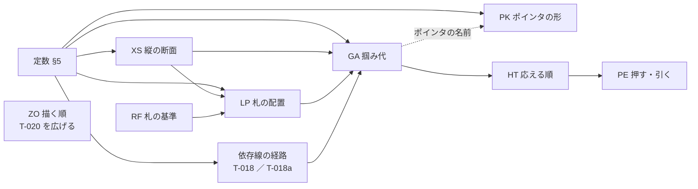

# 新方式の仕様案

- 対象: 掴み代・応える順・ポインタ・札の置き方・押す／引くの効果・描く順・依存線の付け先と形
- 拠り所: 見本 [`grab-area-sizing-sample.html`](grab-area-sizing-sample.html)（規則はすべて実装して測ってある）と、[`rulings.md`](../../docs/development-records/rulings.md) の `JDG-180`〜`JDG-208`
- 使い道: `handoff.md` §1.2 の Step 1b の変更要求（CR）は、この案から起こす。今の仕様のうち置き換える行は [`old-to-new-map-ja.md`](old-to-new-map-ja.md)（Step 1a の対応表）が持つ

⛔ **これは仕様ではない。** 仕様に着地するまでの下書きである。表の名（GA・HT・RF・LP・PE・XS・PK）と行の番号は仮のものであり、CR で登録するまで仕様にも台帳にも書かない。接頭辞は登録済みの 152 と重ならないことを確かめてある（ポインタの表は、登録済みの `PTD` と 1 字違いになる `PT` を避けて `PK` とした）。
⛔ 利用者の言葉はここに写さない（`rulings.md` が持つ）。ここに書く理由は、他人が読んで分かるように整えたものである。

## 1. 設計の方針 —— 依存を少なく、論理を単純に

### 1.1 3 つの作り方の決まり

| 決まり | 中身 | 効き目 |
|---|---|---|
| 1 表 1 問 | 1 つの表は 1 つの問いにだけ答える（「どこを掴めるか」「どれが応えるか」「札をどこに置くか」…） | 表を変えたときに、動くものが 1 つに決まる |
| 流れは一方向 | 表の入力は、上流の表の出力か定数だけである。表どうしの参照に輪を作らない（下の図 1） | どの表も、上流だけを読めば確かめられる |
| 1 値 1 役 | 1 つの定数は、1 つの対象の 1 つの向きだけを決める（`JDG-194`）。共通の値は、共通であること自体が決まりのものに限る（ポインタの縁の太さなど） | 値を変えたときに、ほかの対象が動かない |

### 1.2 5 つの原則（理由）

表の行ごとには理由を書かない。行は次のどれかの原則から来る。

| 原則 | 理由 | 束ねる裁定 |
|---|---|---|
| どれも指せる | どの形も、ズームのどの段でも、それだけが応える領域を持つ。縮めた画面こそ日程を動かす画面だからである | `JDG-187` ／ `JDG-189` ／ `JDG-190` ／ `JDG-194` |
| 実績は事実 | 実績は起きたことの記録である。軽い操作のついでに変わってはならず、変えるのは実績の端を掴む意図した操作に限る | `JDG-187` ／ `JDG-188` |
| 見えないものは掴めない | 画面に無いものが指の下で動けば、利用者は原因を知りようがない | `JDG-184` ／ `JDG-196` |
| 被らせない | 中心線を共有する形（`===`・◆）は札を横へ逃がし、段で分かれた形（`--->`）は札を動かさない。札は線より手前に描く | `JDG-182` ／ `JDG-183` ／ `JDG-185` ／ `JDG-203` |
| ダミーはまだ始まっていない実績 | ダミーに独自の規則を持たせない。規則の数が減る | `JDG-186` |

## 2. 上位要求

どの表にも親の上位要求があり、どの上位要求も表に届く（§7 の表）。本文は `handoff.md` §1.2 で利用者が了承した案に、2026-09-19 の裁定（`JDG-194`〜`JDG-208`）を足したものである。

| ID | 題 | 持つ表・定数 | ORIGIN（案） |
|---|---|---|---|
| `FR-104` | 縮小しても、どれも指せる | GA ・ XS ・ HT ・ 定数 | GL-008 ／ GL-002 |
| `FR-105` | 重なっても、狙ったものが答える | HT ・ PE の 0 行 | GL-008 ／ GL-006 |
| `FR-106` | ポインタの形で、何を掴むかが分かる | GA のポインタ欄 ・ PK | GL-006 ／ GL-008 |
| `FR-107` | 実績は事実なので、ついでには変わらない | PE | GL-008 |
| `FR-108` | 見えないものは、掴めず動かない | GA ・ RF ・ PE | GL-006 |
| `FR-109` | 札は読める所に置く | RF ・ LP ・ XS | UC-001 手順 4・拡張 4a・4b ／ UC-003 手順 4 ／ UC-005 手順 3〜4 ／ GL-001 ／ GL-002 |
| `FR-110`（新） | 描く前後は 1 つの表で決める | ZO | UC-001 手順 4 ／ UC-004 手順 4 ／ GL-001 ／ GL-002 |
| `FR-043`（書き直し） | 未着手でも、実績を直接描き始められる | GA ・ RF ・ PE | GL-008 |
| `FR-009`（書き直し） | 依存線は予定に付ける | 依存線の定数 ・ GA の依存線の行 | 今の `FR-009` の ORIGIN を引き継ぐ |

**FR-104 縮小しても、どれも指せる**
- STATEMENT: `GRS` は、表示をどこまで縮小しても、描いているタスク・マイルストーン・進捗マーカー・依存線のそれぞれを、ポインタで指して操作できるようにすること。そのために、各操作対象に、他の対象に取られない掴み代を持たせること。掴み代の形と大きさは表 GA、縦の段は表 XS、重なったときの応答は表 HT に従う。
- RATIONALE: 縮小は全体を 1 枚で見るための操作であり、縮小した画面こそ日程を動かす画面になる。縮めると形は近づいて重なるので、描いた形の大きさにだけ頼ると、小さい形や後ろの形を指せなくなる。掴み代の値を対象ごとに独立させるのは、1 つの対象の掴みやすさを直したときに、ほかの対象の掴みやすさを変えないためである。

**FR-105 重なっても、狙ったものが答える**
- STATEMENT: `GRS` は、ポインタの下で複数の掴み代が重なるとき、応答する対象を 1 つに決め、しかもその決め方を利用者が見た目から予測できるものにすること。決め方は表 HT に従う。日程表（行の領域と目盛）の上の押下と引く操作は、形への操作にだけ使い、字の選択を始めてはならない（MUST NOT）。修飾キーを付けた割当の無い引く操作も同じである（今の `MK-12` の「ブラウザの既定動作に委ねる」に、この 1 つの例外を足す）。
- RATIONALE: 同じ場所を押して毎回違うものが動くなら、利用者は操作を信用できない。押した所から字の選択が始まれば、形を掴んだつもりの操作が画面の字を選ぶだけで終わる。`FR-104` が「指せること」を、本要求が「指したものが答えること」を受け持つ。

**FR-106 ポインタの形で、何を掴むかが分かる**
- STATEMENT: `GRS` は、ポインタが掴み代に入ったとき、ポインタを、何を掴むか（予定か、実績か、マーカーか、フェードか、マイルストーンか、依存線か）と、引いたら何がどちらへ動くかが分かる形に変えること。押しているあいだは、掴んだときの形を保つこと。どの掴み代でどの形かは表 GA のポインタ欄、形そのものは表 PK に従う。
- RATIONALE: 押す前に結果が分かれば、説明を読まずに正しい所を掴める。予定と実績は同じ場所に重ねて描かれるので、見た目だけでは区別できない。ポインタの白抜き（予定）と塗り（実績）がその区別を担い、線の矢印（依存線）と箱型の矢印（タスクの端）は形で区別する。

**FR-107 実績は事実なので、ついでには変わらない**
- STATEMENT: `GRS` は、実績の日付を、利用者が実績を掴んで意図して動かしたときにだけ変えること。ほかの操作のついでに変えてはならない（MUST NOT）。どの操作が何を変えるかは表 PE に従う。
- RATIONALE: 実績は起きたことの記録であり、予定のように引き直す対象ではない。予定をずらす・状態を変える・行を移すといった軽い操作のついでに実績が動けば、利用者は気づかないまま事実を書き換えてしまう。

**FR-108 見えないものは、掴めず動かない**
- STATEMENT: `GRS` は、表示していない予定・実績・依存線を、掴めないようにし、ほかの操作で動かさないこと。表 RF と表 PE に従う。
- RATIONALE: 画面に無いものが指の下で動けば、利用者はそれに気づけず、取り消すこともできない。

**FR-109 札は読める所に置く**
- STATEMENT: `GRS` は、1 つのタスク・マイルストーンについて、名称・担当者・進捗・進捗マーカー・再開アイコンを互いに重ねず（今の `OR-1`）、どれも形に隠れて読めなくならない場所に置くこと。名称はフェードの上に重ねない（今の `FR-002` の MUST を残す）。置き方は表 RF と表 LP、縦の段は表 XS に従う。
- RATIONALE: 1 行に複数のタスクを置き、全体を縮めて見るほど、字と形は近づく。読めない俯瞰図は価値を失う。予定と実績のどちらを見せているかで札の基準を替えるのは、見えているものに札が付いていないと読み手が迷うからである。
- 対象は 1 つのタスクの中に限る。隣のタスクどうしの札のぶつかりは LOD の受け持ちである。
- ⚠️ 今の `FR-002` と二重にしない: `FR-002` は名称の字そのもの（打ち切り・予定日・9 点のアンカー）に縮め、置き場は本要求が持つ（案。CR が決める）。

**FR-110（新） 描く前後は 1 つの表で決める**
- STATEMENT: `GRS` は、日程表に描くものの前後（どれが手前に見えるか）を 1 つの表で決めること。名称・担当と進捗・進捗マーカーは、線と形より手前に描くこと。描く前後を、応える順（表 HT）の根拠にしてはならない（MUST NOT）。前後は表 ZO に従う。
- RATIONALE: 前後の決まりが各所に散ると、同じ 2 つのものの前後が場所ごとに違って決まる。字が線に隠れると、読める俯瞰が損なわれる。線は字の下を通っても途切れて見えないが、字は線に切られると読めない。見える前後と掴める順を別にするのは、細いものを手前に描いても、掴みやすさは掴み代で決めるためである（今の `MK-9a`）。
- 今の表 T-020 の宿主（`FR-011`）と、`V-5` の「`FR-011` と表 T-020」を、本要求へ指し直す。

**FR-043（書き直し） 未着手でも、実績を直接描き始められる**
- STATEMENT: `GRS` は、実績をまだ持たないタスク・マイルストーンにも、実績を描き始める掴み場所（ダミー）を示すこと。ダミーは「まだ始まっていない実績」として、実績と同じ規則で置き、掴ませること。表 RF・GA・PE に従う。
- RATIONALE: 実績の入力を、タスクを掴むのと同じ直接操作で始められるようにする。ダミーに独自の規則を持たせないことで、規則の数が減る。

**FR-009（書き直し） 依存線は予定に付ける**
- 変える所: 「予定を表示していないときに限り、実績の幾何に付ける」と「予定が無いときは実績に落ちる」を消し、次に替える —— 依存線は予定の幾何にだけ付けること。予定が無いとき、予定を表示していないときは、その依存線を描かないこと（`RT-4a` の列挙に足す）。形（引き出し・引き入れ・矢じり）は定数（§5）に従う。`FR-013` の「`FR-009` と同じ形」の文は消す（`DFC-659`）。
- RATIONALE: 依存線は予定に対して設定する情報である（`PredecessorLink` が縛るのは予定の日付であり、実績は記録された事実である）。実績に付けると、実績を入れるたびに線が動く。

## 3. 表どうしの依存

*図 1 —— 矢印は「読む」向き。輪は無い。ZO はどの表も読まず、どの表にも読まれない（`MK-9a`: 描く順と応える順は別）。*

| 辺 | 何を渡すか | この辺が要る理由 |
|---|---|---|
| XS → LP・GA | 形ごとの縦の帯の位置と高さ | 札も掴み代も、形の縦の帯に揃える |
| RF → LP | 札の基準（実績 ／ ダミー ／ 予定）とその横の範囲 | 札は基準に付く |
| LP → GA | マーカーの位置と、「入る」かどうか | マーカーの掴み代はマーカーの位置に置く。実績の開始の内側は、マーカーが実績の開始に立つときマーカーの中心で止める |
| 依存線の経路 → GA | 線の折れ点 | 線の掴み代は描いた線に沿う |
| GA → HT | 掴み代の一覧（種別・範囲・中心） | 応える順は掴み代の上で決める |
| HT → PE | 応えた掴み代の種別 | 効果は掴んだものの種別で決まる |
| 定数 → LP（1 本だけの横の辺） | 実績の終了の内側の幅 | 「入る」の判定は、名前を実績の終了の掴み代の上に置かないために、その幅を取り置く（7 問の ⑥） |

⭐ **無い辺**: 掴み代の値どうし（`JDG-194`）、描く順と応える順（`MK-9a`）、札の余白と掴み代（`JDG-195`）。

## 4. 表

⚠️ 下の既定値は、見本の px（画面に描いた大きさ）である。仕様の値にするとき描く比（表示の倍率 100 で 0.625）で割るかは、問い 9 の ② で決まる。

### 4.1 表 XS —— 縦の断面（1 行 ＝ 1 つの帯。値はバーの高さ h に対する比）

| # | 形 | 帯 | 縦の中心 | 高さ |
|---|---|---|---|---|
| 1 | `===` | 予定 | 0.5 | 1 |
| 2 | `===` | 実績 | 0.5 | 0.5715 |
| 3 | `===` | マーカー・ダミー・名前・担当と進捗 | 0.5 | マーカーの径 |
| 4 | `--->` | 名前・マーカー | 0.10 | マーカーの径 |
| 5 | `--->` | 予定の矢 | 0.42 | 軸 0.16（2px 以上）、矢じり 軸 × 3.2 |
| 6 | `--->` | 実績の矢 | 0.72 | 軸 0.16 × 0.8、矢じり 軸 × 2.6 |
| 7 | `--->` | 予実の境（掴み代を分ける中線） | 0.57 | — |
| 8 | ◆ | 予定の菱形 | 0.5 | 1（幅も 1） |
| 9 | ◆ | 実績・ダミーの菱形 | 0.5 | 0.7（幅も 0.7） |

`--->` の掴み代は、予定が中線より上だけ、実績が中線より下だけを取る（予実が重ならない）。`===` と ◆ は帯が入れ子なので、予実の掴み代は重なり、表 HT で分ける。今の「掴みシロを上下のレーンに割ってはならない」（MUST NOT）は、`===` と ◆ に限る文へ書き直す（`JDG-185`）。

⚠️ **裁定の無い見本の数**（問いの群 A）: `--->` の段の比（0.10・0.42・0.72）と、軸 × 3.2 を矢じりの**高さ**に使うこと（今の `LF-7` では 3.2 は矢じりの**長さ**）、◆ の実績とダミーの 0.7（今の `LF-10` は 0.5715）。今の仕様には `LF-7`〜`LF-9`・`S-15`・`S-10` がある。形の呼び名は、`===` が今の `SH-1`・`SH-2`、`--->` が `SH-3`・`SH-4` にあたる。

### 4.2 表 RF —— 札の基準（`JDG-184`・`JDG-186`）

| # | 実績を表示 | 実績がある | 札の基準 |
|---|---|---|---|
| 1 | する | ある | 実績 |
| 2 | する | ない | ダミー（幅 ＝ マーカーの径 × 0.5。◆ はダミーの菱形） |
| 3 | しない | — | 予定 |

素朴に数えると 形 3 × 実績を表示 × 実績がある × マーカー × 入る ＝ 48 通りである。ダミーを「まだ始まっていない実績」として基準に畳むと、本表 3 行と表 LP 8 行の 11 行で済む。

### 4.3 表 LP —— 札の配置（`JDG-182`・`JDG-183`・`JDG-185`・`JDG-195`）

| # | 形 | マーカー | 入る | マーカーの位置 | 名前の書き出し |
|---|---|---|---|---|---|
| 1 | `===` | 出す | 入る | 基準の開始 | マーカーの右端 ＋ 「タスク名 マーカー → 名前」 |
| 2 | `===` | 出す | 入らない | 基準の終了のすぐ右 | 同上 |
| 3 | `===` | 出さない | 入る | — | 基準の開始 ＋ 「タスク名 開始 → 名前」 |
| 4 | `===` | 出さない | 入らない | — | 基準の終了 ＋ 同じ値（外へ） |
| 5 | `--->` | 出す | （問わない） | 基準の開始（名前の段） | マーカーの右端 ＋ 「タスク名 マーカー → 名前」 |
| 6 | `--->` | 出さない | （問わない） | — | 基準の開始 ＋ 「タスク名 開始 → 名前」（名前の段） |
| 7 | ◆ | 出す | （問わない） | 基準の菱形の右端 | マーカーの右端 ＋ 「マイルストーン名 マーカー → 名前」 |
| 8 | ◆ | 出さない | （問わない） | — | 基準の菱形の幅を 0〜100% として 25% の位置から左詰め |

- **入る**: （マーカーを出すなら マーカーの径 ＋「マーカー → 名前」、出さないなら「開始 → 名前」）＋ 名前の幅 ＋ 実績の終了の内側の幅 ≦ 基準の幅。⚠️ 7 問の ⑥（`FR-002` の取り置きをどこまで残すか）の答えで変わる。
- **担当と進捗**: 1 枚の札にまとめ、右寄せで、描いている予定と実績のうち早い方の開始から「担当・進捗 → 開始」だけ左に置く。◆ は、基準の菱形の 25% の位置からその値だけ左。`--->` は予定の矢の高さに置く。
- マーカーを出さないときは、マーカーの幅のぶん名前を左へ寄せる（今の仕様の `S-63` の段のまま）。
- **今の MUST を残す**（一括で消すと黙って落ちる。見本はまだ持たない）:
  - 基準が予定（表 RF の 3）のときは、フェードを除いた幅で「入る」を数え、名前は `fadeIn` の終わりから書く（今の `FR-002`、名称をフェードの上に重ねない）。
  - 再開日が未定の再開アイコンは札の並びの中に立ち、名前はその右端から数える（今の表 T-243 の結び）。
  - 担当と進捗の区切りは「 : 」（半角コロンの前後に空白 1 つ。今の `FR-090`）。見本は空白 1 つで描いている。
  - 線だけの形（`--->`）の名前は 0.85 倍（今の `S-9`）。見本は同じ大きさで描いている。
- `--->` の担当と進捗を予定の矢の高さに置くのは、見本の読みである（今の仕様に文が無い）。

### 4.4 表 GA —— 掴み代の幾何（1 行 ＝ 1 つの操作対象。`JDG-194`）

横の値は、描いた端から外へ（外側）・内へ（内側）、または基準点に中央を合わせた幅。縦は、表 XS の帯から上下へ張り出す値。どの値も、ほかの行の掴み代を動かさない。

| # | 形 | 掴む所 | 基準点 | 横 | 縦（帯 ＋ 上下） | ポインタ（表 PK） |
|---|---|---|---|---|---|---|
| 1 | `===` | 予定の開始 | 予定の左端 | 外側 12 ／ 内側 0 | 予定 ＋ 0（`JDG-197`） | 箱の矢印 ← 白 |
| 2 | `===` | 予定の終了 | 予定の右端 | 外側 12 ／ 内側 0 | 予定 ＋ 0 | 箱の矢印 → 白 |
| 3 | `===` | 実績の開始 | 実績の左端 | 外側 0 ／ 内側 12。内側は実績の幅の半分まで（今の仕様の MUST を残す）。マーカーが実績の開始に立つときは、内側をマーカーの中心で止める（`JDG-187`） | 実績 ＋ 0 | 箱の矢印 ← 黒 |
| 4 | `===` | 実績の終了 | 実績の右端 | 外側 0 ／ 内側 12。内側は実績の幅の半分まで | 実績 ＋ 0 | 箱の矢印 → 黒 |
| 5 | `===` | ダミーの開始 | ダミーの左端（＝予定の開始） | 外側 0 ／ 印の左半分（`JDG-37`。⚠️ 問い ①） | マーカー ＋ 0（⚠️ 問い ①c） | 箱の矢印 ← 黒 |
| 6 | `===` | ダミーの終了 | ダミーの中心 | 印の右半分 ／ 外側 12（⚠️ 問い ①b） | マーカー ＋ 0（⚠️ 問い ①c） | 箱の矢印 → 黒 |
| 7 | `===` | フェード入 | 台形の点 4（予定の上辺） | 中央合わせの正方形 8 | 同左 | 三角 入 |
| 8 | `===` | フェード出 | 台形の点 2（予定の下辺） | 中央合わせの正方形 8 | 同左 | 三角 出 |
| 9 | `===` | 本体 | 予定の形 | 描いた形そのもの | 予定 | てのひら |
| 10 | `--->` | 予定の開始 | 予定の軸の左端 | 中央合わせ 12 | 予定の矢（中線より上）＋ 0 | 箱の矢印 ← 白 |
| 11 | `--->` | 予定の終了 | 予定の `>` の中心 | 中央合わせ 12 | 同上 | 箱の矢印 → 白 |
| 12 | `--->` | 実績の開始 | 実績の軸の左端 | 中央合わせ 12 | 実績の矢（中線より下）＋ 0 | 箱の矢印 ← 黒 |
| 13 | `--->` | 実績の終了 | 実績の `>` の中心 | 中央合わせ 12 | 同上 | 箱の矢印 → 黒 |
| 14 | `--->` | 本体 | 予定の矢 | 描いた形そのもの | 予定の矢 | てのひら |
| 15 | ◆ | 予定 | 予定の菱形の中心 | 菱形の幅の 115%（`JDG-189`） | 菱形 ＋ 0 | 円 ○ |
| 16 | ◆ | 実績 | 実績の菱形の中心 | 菱形そのもの ＋ 外側 0（`JDG-189`） | 菱形 ＋ 0 | 円 ● |
| 17 | ◆ | ダミー | ダミーの菱形の中心 | 同上 | 同上 | 円 ● |
| 18 | 共通 | 進捗マーカー | 描いたマーカー | 描いたマーカー ＋ 外側 0 | 同左 | 指 |
| 19 | 共通 | 依存線 | 描いた線 | 線の縁から左右 2（`JDG-199`） | — | 線の矢印 |

単位は px（◆ の予定の幅だけ ％）。18 の対象・34 の値（本体の 2 行は値を持たない）。表示していない予定・実績・依存線は掴み代を持たない（`FR-108`）。

- **実績の端の頭打ち**: 実績の開始・終了の内側は、実績の幅の半分を超えない（今の仕様の MUST。覆す裁定は無い）。これで短い実績でも左半分が開始、右半分が終了になり、両端が入れ替わらない。見本は当初これを落としていて、1 日 2px の倍率の 1 日の実績では左に終了・右に開始が応え、1 日 12px では 12px 全部が終了で開始を掴めなかった（測った。頭打ちを足して直した）。
- 引いているあいだの絵と、引いたときに書かない規則（今の `FR-016` の散文）は、本表の外に残す。

### 4.5 表 HT —— どれが応えるか（`JDG-150`・`JDG-190`・`MK-9a`）

本表は**日程の形の中の順**だけを持つ。今の 表 T-023d は消えず、日程の形でないもの（パレットと面の境の掴み帯、名前・担当のダブルクリック、注記、行見出し、基準日線、スクロールバー）の順を持ち、日程の形の段を「表 HT に従う」の 1 行で持つ（下の表 T-023d の新しい並び）。

3 段で決める。前の段で 1 つに決まれば、後の段は読まない。

| 段 | 規則 |
|---|---|
| 1. 形の上 | 描いた形（バー・矢・菱形・ダミー・マーカー）の上では、その形のタスクの掴み代だけが応える（`GS-1`）。依存線は、描いた線そのもの（線の中心から 線の太さ ÷ 2 ＋ 1px）でだけ応える |
| 2. 種別の順 | 下の順で、先に来る種別の掴み代が応える |
| 3. 同じ種別 | 掴み代の中心までの直線の距離が近い方が応える（`JDG-190`。⚠️ 7 問の ⑤）。距離が同じなら後に描いた方 |

| 順 | 形の上 | 形の外（隙間・外側の帯） |
|---|---|---|
| 1 | フェード | 依存線（`GS-4`。⚠️ 7 問の ⑦） |
| 2 | 進捗マーカー（実績の外に立つ） | フェード |
| 3 | ダミー | 進捗マーカー（実績の外に立つ） |
| 4 | 実績の端（◆ の実績を含む） | ダミー |
| 5 | 依存線 | 実績の端 |
| 6 | 予定の端 | 予定の端 |
| 7 | 進捗マーカー（実績の中に立つ） | 進捗マーカー（実績の中に立つ） |
| 8 | ◆ の予定 | ◆ の予定 |
| 9 | 本体 | 本体 |

2 つの列の違いは依存線の位置だけである。実績の中に立つマーカーを実績の端より後に置くので、マーカーの左半分は実績の開始、右半分はマーカーが応える。再開アイコン（今の `GR-8`）は進捗マーカーと同じ順に入れる（案。マーカーの位置に立つ印だから）。

⚠️ 本表が今の仕様とぶつかる所（問い ⑩・⑪）:
- フェードを順 1 に置くので、マーカーの描いた形の上でもフェードの掴み点が勝つ。今の仕様は、マーカーの形の上ではマーカーを予定の端（フェードを含む）より先にする（`JDG-178`、適用済み）。ただし `JDG-187` は、実績の開始に立つマーカーの左半分を実績の開始に渡しているので、`JDG-178` をそのまま戻すこともできない。
- 形の外で上下 2 つのタスクの掴み代に入ったとき、今の `GS-2` は種別によらず縦に近い形のタスクを選ぶ。本表は種別の順を先に見る。`JDG-190` が決めたのは同じ行の横の重なりだけである。

**表 T-023d の新しい並び（案）** —— 上ほど先。

| 順 | 対象 | 今の行 |
|---|---|---|
| 1 | パレットの掴み帯・面の境の掴み帯 | `GR-19` ・ `GR-22`（残す） |
| 2 | 名前・担当（ダブルクリックだけ。素の押下では成立しない） | `GR-10` ・ `GR-11`（残す） |
| 3 | 注記（コメント／ハイライトボックス） | `GR-14`（残す。⚠️ 今は依存線と予定の端のあいだ。形の上に描くものなので、日程の形より先へ移す案 —— 問い ⑫） |
| 4 | **日程の形 —— 表 HT に従う** | `GR-1`〜`GR-7`・`GR-9`・`GR-12`・`GR-13`・`GR-15`・`GR-17`・`GR-18` を消して、この 1 行にする。再開アイコン `GR-8` は HT の中へ |
| 5 | 行見出しの行 | `GR-20`（残す） |
| 6 | 基準日線 | `GR-16`（残す。掴み代は `S-137` の 6px のまま —— `JDG-199` の読み。要確認） |
| 7 | スクロールバーのつまみ | `GR-21`（残す） |

### 4.6 表 PE —— 押す・引くの効果（`JDG-186`〜`JDG-188`・`JDG-196`・`JDG-204`）

| # | 掴んだもの | 押して離す（動かさない） | 横に引く | 縦に引く（行を移る） |
|---|---|---|---|---|
| 0 | 日程表のどこでも | 字の選択を始めない | 字の選択を始めない | 字の選択を始めない |
| 1 | 予定の本体 | — | **予定だけ**を動かす（実績は動かない） | 予定と実績を一緒に移す。日付は変わらない |
| 2 | 予定の端 | — | その端だけ | — |
| 3 | 実績の端 | — | その端だけ | — |
| 4 | ダミー（タスク） | 何も起きない | 引いた所から実績になる | — |
| 5 | ダミー（◆） | 何も起きない | 引いた所で実績になる | — |
| 6 | ◆ の予定 ／ 実績 | — | その日付だけ | — |
| 7 | 進捗マーカー（実績の右に立つ） | 状態を 1 つ進める（表 T-021a） | 実績の終了を動かす | — |
| 8 | 進捗マーカー（それ以外） | 状態を 1 つ進める（表 T-021a） | 何もしない | — |
| 9 | フェードの掴み点 | — | 入 ／ 出の日数 | — |
| 10 | 依存線 | 選ぶ | 何もしない | — |

- **引いて置く値**（どの日付になるか。離した日を稼働日へ寄せない、最後の日を据え置く、片端だけを作らない、など）は本表に書かず、今の 表 T-245 に行を足して持たせる（実績の開始・ダミーの開始・ダミーの終了・◆ のダミー・マーカーを引く）。⛔ `FR-043` を「表に従う」へ縮めるのは、その行を足した後である。先に縮めると、今の `FR-043` と `GR-5` の値の MUST が行ごと落ちる。
- 実績を消すのは、取り消しか属性の欄で行う。
- 表示していない予定・実績は、どの行でも動かない（`FR-108`）。依存線を隠しているあいだは選べない（`FR-049`。⚠️ `DFC-660`）。
- 依存線を引く道具は、予定の左半分（開始）と右半分（終了）で結ぶ（表 T-018）。予定を表示していないときは引けない。
- マーカーの押下の状態の巡りは表 T-021a のままであり、図は今の 図 F-018 を指す（図を 2 枚にしない）。⚠️ 問い ② —— `PV-1` だけが実績を置く。上流の `FR-011` の「未着手を 1 押しで完了」も同じ問いの内である。
- 実績を直接動かす経路の全数は本表が持つ（今の `FR-011` の「全数は表 T-023d」「実績を動かす経路は端点だけ」を、マーカーを引く行を足して本表へ移す。`JDG-187`）。

### 4.7 表 PK —— ポインタの形（`JDG-181`・`JDG-191`・`JDG-200`・`JDG-206`〜`JDG-208`）

| # | 名前 | 形 | 中 ／ 縁 | 縁の角 | 大きさ | 押さえる点 |
|---|---|---|---|---|---|---|
| 1 | 箱の矢印 白 | 幅の広い箱型の矢印（← ／ →） | 白 ／ 黒 | 丸め | 一辺 16px（`S-249` を 24 → 16） | 中心 |
| 2 | 箱の矢印 黒 | 同上 | 黒 ／ 白 | 丸め | 同上 | 中心 |
| 3 | 三角 入 ／ 出 | 直角三角形。直角が押さえる点。入は左上へ、出は右下へ広がる。縦は横の 0.75 | 白 ／ 黒（共通の縁） | 丸め | 10px | 直角の頂点 |
| 4 | 線の矢印 | 細い軸と細い三角の矢じり（→） | 白 ／ 黒（共通の縁） | 角張り（丸めない） | 一辺 16px（表 PK の 1 と同じ値） | 中心 |
| 5 | 円 ○ | 円 | 白 ／ 黒（共通の縁） | — | 径 12px | 中心 |
| 6 | 円 ● | 円 | 黒 ／ 白（共通の縁） | — | 径 8px | 中心 |
| 7 | 指 | 環境の指 | — | — | 環境のまま | 環境のまま |
| 8 | てのひら | 環境のてのひら | — | — | 環境のまま | 環境のまま |

共通の縁は、画面の px で 1 つの値（約 0.47px）である。白 ＝ 予定、黒 ＝ 実績とダミー、の約束を、箱の矢印と円で揃える。

- 画像のポインタを描けない環境では、環境の形に替える（今の `PC-6` の `ew-resize` を残し、三角・線の矢印・円の替わりの形も決める —— CR）。
- ポインタの画像には表示の倍率を掛けない（今の 表 T-264 の結びの MUST を残す）。
- ◆ の「掴めることの合図」（今の `IN-2`）は、○ ／ ● に置き換える。

### 4.8 表 ZO —— 描く順（今の 表 T-020 を、描くものすべての行へ広げる。`FR-110`・`JDG-203`・`DFC-662`）

奥から手前へ。応える順（表 HT）とは関係しない（`MK-9a`）。描くものは 31 種あり、今の T-020 に行があるのは 7 種である（棚卸しは [`old-to-new-map-ja.md`](old-to-new-map-ja.md)）。

| 順 | 描くもの | 今の T-020 ／ 材料 |
|---|---|---|
| 1 | 行の帯・グループ罫線・日付罫線 | 行が無い（アプリも最も奥） |
| 2 | 予定（フェードの台形）・予定の菱形・予定の矢 | `ZO-1` |
| 3 | 予実の補助線 | `ZO-1a` |
| 4 | 実績・ダミー・実績の菱形・実績の矢 | `ZO-2`（ダミーは `PND-209` の推奨どおり実績と同じ層） |
| 5 | 依存線（地の色の縁を含む。線どうしの前後は `FR-009` に従い、ここに写さない） | `ZO-4` |
| 6 | イナズマ線・基準日線・2 連カーソル・ガイドカーソル・ハイライトボックスの枠 | 行が無い（`PND-312` の推奨: カーソルは基準日線の層） |
| 7 | 進捗マーカー・再開アイコン | ⚠️ `ZO-3`（線より奥）。見本は線より手前（問い 8） |
| 8 | 名称・担当と進捗の札 | `ZO-5`（担当と進捗は行が無い） |
| 9 | コメントボックス | 行が無い（`PND-238` の推奨: 名称より手前） |
| 10 | 選択の枠・フェードの掴み点（選択しているタスクにだけ出す。今の `FR-075`） | 行が無い（見本は掴み点を常に描く。見本の簡略） |
| 11 | 構えて引いている仮の依存線 | 行が無い |
| 12 | 透かし | 行が無い（今の `FR-020` は「重ねる」） |
| 13 | 範囲選択の矩形 | `ZO-6`（最前面。⚠️ アプリは透かしと目盛の後に描かない。`DFC-661`） |

- 目盛は自分の帯に描き、日程の形と重ならないので、本表に入れない。⚠️ 今の表 T-012 の注「目盛の下に隠れ」の前提と合わせて書き直す。
- 期限の印・遅れの日数・変更前の予定の重ねは、アプリがまだ描かないので、描くときに行を足す。
- 見本の層の表（目盛・行の見出し → バー → 依存線 → マーカー → 札 → 掴み代の面）は、本表の 1・2〜4・5・7・8 にあたる。

## 5. 定数

コードは生成した定数を読む（検査 30）。1 つのセルを変えれば 1 つの値が変わる。

置く表は今の行に従う。**文書に保存する表 T-201** の行（`S-18`〜`S-32` など。保存形の鍵 `K-19`〜`K-32` を持ち、描く比が掛かる）を割るときは T-201 に置き、製品の決まりである**表 T-206** の行（掴み代・ポインタ）を割るときは T-206 に置く。⚠️ T-201 の行を T-206 へ移すと、保存形の鍵が消え、描く比も外れる。

| 群 | 定数 | 既定 | 使う表 | 今の行（置く表） |
|---|---|---|---|---|
| 掴み代 | 表 GA の 34 の値（対象 × 向き） | 表 GA のとおり | GA | `S-90`（予定の端）・`S-91`（実績の端）・`S-92`（フェード）・`S-137`（依存線）を割る。ほかは新しい行。⚠️ 注記の四隅の `S-230` は既定を「`S-137`」と書いているので、自分の値を持たせる（1 値 1 役） |
| 札 | タスク名 開始 → 名前 | 6px | LP | `S-31`（T-201） |
| 札 | タスク名 マーカー → 名前 | 6px | LP | `S-32` ＋ `S-31` の形を置き換える（T-201） |
| 札 | マイルストーン名 マーカー → 名前 | 6px | LP | 新しい行（T-201） |
| 札 | 担当・進捗 → 開始 | 4px | LP | 今の `FR-090` の `S-32` の使い方を置き換える（T-201） |
| 札 | マイルストーン名の書き出し | 菱形の幅の 25% | LP | 新しい行（T-201） |
| 札 | 字の大きさ | 実績の高さ × 0.90 | LP | 今の行と照合する |
| 形 | 進捗マーカーの描く径 | 14px | XS ・ LP ・ GA | `S-22`（16px、上限 16。描く比 0.625 が掛かる群）。⚠️ 見本の 14 を描いた px と読めば `S-22` ＝ 22.4 で上限を破り、仕様の値と読めばアプリは 8.75px で描く（問い 9 の ②） |
| 形 | ダミーの幅 | マーカーの径 × 0.5 | RF ・ GA | `S-247` |
| 形 | 実績の高さ・`--->` の段・◆ の実績の比 | 表 XS のとおり | XS | 今の行と照合する |
| 依存線 | 引き出し | 6px | 経路 | `LF-4` の出口の走り（7px）を置き換える（T-201。新しい鍵） |
| 依存線 | 引き入れ（矢じりを含む） | 10px | 経路 | `LF-4` の入口の走り（`S-19` × `S-20` ＝ 14px）（T-201。新しい鍵） |
| 依存線 | 矢じりの長さ ／ 幅 | 6px ／ 5px | 経路 | `S-19`（長さ ＝ 底辺 ＝ 走りの 3 役）を長さだけにし、幅は新しい行。`S-20` と鍵 `K-20` は消す（T-201） |
| 依存線 | 線の太さ | 1.5px | 経路 | `S-18`（範囲の上限の結び先を、矢じりの長さか幅に決め直す）（T-201） |
| ポインタ | 箱の矢印・線の矢印の一辺 | 16px | PK | `S-249`（24 → 16） |
| ポインタ | フェードの三角 | 10px、縦は横の 0.75 | PK | 新しい行 |
| ポインタ | 円 ○ ／ ● の径 | 12px ／ 8px | PK | 新しい行 |
| ポインタ | 共通の縁 | 約 0.47px | PK | 新しい行 |

## 6. 図（見本から起こす）

⛔ 手で描かない。見本を固定の設定で描き、SVG を書き出して `docs/spec/_assets` に置く。

| 図 | 見本の何を描くか | 持つ表 |
|---|---|---|
| 掴み代の地図 3 枚 | ①②（`===`）、④（`--->`）、③（◆）の行を、掴み代の面を出して | GA ・ XS |
| 積んだ行の応え方 | ⑤ の行を、応えた掴み代で塗り分けて | HT |
| 札の置き方 | 表 LP の 8 行それぞれの見本 | LP ・ RF |
| ポインタの一覧 | 表 PK の形を実寸と拡大で | PK |
| マーカーの状態図 | 描かない。今の 図 F-018 を指す | PE |

## 7. 追跡 —— どの上位要求がどの表を持つか

| 上位要求 | XS | RF | LP | GA | HT | PE | PK | ZO | 依存線の定数 |
|---|:-:|:-:|:-:|:-:|:-:|:-:|:-:|:-:|:-:|
| `FR-104` どれも指せる | ● | | | ● | ● | | | | |
| `FR-105` 狙ったものが答える | | | | | ● | ● | | | |
| `FR-106` ポインタの形 | | | | ● | | | ● | | |
| `FR-107` 実績はついでに変わらない | | | | | | ● | | | |
| `FR-108` 見えないものは掴めない | | ● | | ● | | ● | | | |
| `FR-109` 札は読める所に | ● | ● | ● | | | | | | |
| `FR-110` 描く前後は 1 つの表で | | | | | | | | ● | |
| `FR-043` 未着手でも実績を描き始める | | ● | | ● | | ● | | | |
| `FR-009` 依存線は予定に付ける | | | | ● | | | | | ● |

どの列にも ● があり（どの表にも親がある）、どの行にも ● がある（どの上位要求も表に届く）。Step 4 で、この 2 つを機械の検査にする。

## 8. 決めていないこと

CR（Step 1b）は、次の答えを待つ。1〜7・8・9 の事実・推奨・代償は `handoff.md` §1.2 が持つ。残りは Step 1a の対応表（[`old-to-new-map-ja.md`](old-to-new-map-ja.md)）で見つかった。

### 群 A —— 1 つの方針で決まるもの

**方針の案: 裁定の無い見本の数と形は、今の仕様の値へ戻す（見本を直す）。** 実績の端の頭打ちは、この方針で先に直した（§4.4）。

| 問い | 見本 | 今の仕様 |
|---|---|---|
| ⑬ ◆ の実績・ダミーの大きさ | 予定の 0.7 | `actualOfPlan` 0.5715（`LF-10`） |
| ⑭ 形の上で依存線が応える幅 | 描いた線 ＋ 1px | 描いた線そのもの |
| ⑯ `--->` の段の比と矢じり | 0.10 ／ 0.42 ／ 0.72、3.2 を高さに | `LF-7`〜`LF-9`・`S-15`・`S-10`、3.2 は長さ |
| ⑰ `--->` の進捗マーカーの高さ | 名前の段 | 実績の高さ（今の `FR-002`）・予定の中心（`LF-11`） |
| ⑱ マーカーの径 | 3 つの形で同じ | 線だけの形では名前の字の大きさ（`SH-3` ／ `SH-4`） |
| ⑲ 担当と進捗の区切り・線だけの形の名前 | 空白 1 つ・同じ大きさ | 「 : 」・0.85 倍（`S-9`） |

### 群 B —— 今の仕様の MUST と、見本（裁定）がぶつかるもの

| 問い | 中身 | 見本の既定 |
|---|---|---|
| ①b | ダミーの終了の外側 12px は、`JDG-41`「ダミーの掴み代は印そのものであり、印の外へ広げない」（適用済み）を覆すか | 外側 12（既定ではほぼマーカーの下に隠れる —— 計算） |
| ①c | ダミーの掴み代の縦は、今の「実績の帯に従う」（MUST）か、見本のマーカーの帯か | マーカーの帯 |
| ⑩ | マーカーの描いた形の上で、フェードとマーカーのどちらが応えるか（`JDG-178` と表 HT） | フェード |
| ⑪ | 形の外で上下 2 つのタスクの掴み代に入ったとき、種別の順が先か、縦の距離が先か（`GS-2`） | 種別の順が先 |
| ⑫ | 注記を日程の形より先に応えさせるか | 見本に注記は無い |
| ⑮ | 実績（予定）を隠すと札が予定（実績）へ移る（`JDG-184`）とき、隠したものの占有と行の帯の高さを残すか。残さないと、表示を切り替えるたびに `OC-1`・`OC-2` の量が変わり、段が組み替わりうる（今の表 T-243 の結び・`FR-049`・表 T-038 の原則の 3 か所が同じ問いで動く） | 見本は段を組まない |
| ⑳ | `--->` の予定を縁取りなしにする（`JDG-185`）と、今の `CT-4`「形を担保するのは線である」とぶつかる。`CT-4` に例外を置き、塗りと地のコントラスト（`CT-5`）を矢には強めるか | 縁取りなし |
| 8 | 進捗マーカーを依存線より手前に描くか（今の `ZO-3` は奥） | 手前 |
| ㉑ | 表 ZO の、今の T-020 に行が無い 21 種の置き場（§4.8 の案） | — |

### 群 C —— 前からの問いの残り

| 問い | 中身 | 見本の既定 |
|---|---|---|
| ① | ダミーの開始の掴み代を予定の開始の左へ出すか | 出さない（外側 0） |
| ② | マーカーの押下は表 T-021a のままか（`PV-1` だけが実績を置く。上流の `FR-011`「未着手を 1 押しで完了」も含む） | T-021a のまま |
| ③ | `JDG-27` の状態を「覆された（一部）」にするか | — |
| ④a | 予定の端に内側の掴み代を持たせるか | 持たせない（内側 0） |
| ⑤ | 同じ種別の重なりは中心までの直線距離か | 直線距離 |
| ⑥ | 「入る」で `FR-002` の取り置きをどこまで残すか | 終了側だけ（推奨。`JDG-187` がマーカーを実績の開始の掴み代の上に置くので、開始側の取り置きはその理由を失う。終了側は、名前を終了の掴み代の上に置かないために残す） |
| ⑦ | 形の外で依存線をフェードより先にするか | 先にする |
| 9 | ① 引き入れを矢じりより短くしたときの規則 ② 見本の px を描く比（表示の倍率 100 で 0.625）で割るか —— 依存線だけでなく、マーカーの径と札の余白にも掛かる（`DS-1`） | 引き入れ 10 ＞ 矢じり 6 |
| ㉒ | 予定の無いタスクへ依存線を結べるか（`JDG-196` は描かないとだけ言う） | 見本では結べない（予定を隠すと構えられない） |

### 群 D —— CR の組み方（仕様の構造。利用者の了承を取る）

| 決めごと | 案 |
|---|---|
| 表 HT の範囲 | 日程の形の中の順だけ。表 T-023d は残し、日程の形を「表 HT に従う」の 1 行で持つ（§4.5） |
| 引いて置く値 | 表 T-245 に行を足してから `FR-043` を縮め、`GR-5` を消す（§4.6） |
| 描く順の親 | 新しい `FR-110` を立てる（§2） |
| `FR-002` と `FR-109` | `FR-002` を名称の字そのものに縮め、置き場は `FR-109` が持つ |
| 字の選択 | `FR-105` と表 PE の 0 行に置き、`MK-12` に例外を 1 文足す |
| 定数の置き場 | 今の行の表のまま（T-201 は T-201、T-206 は T-206） |
| 見えないものを掴めない、の正 | `FR-108` を正とし、今の表 T-023a の結びと `FR-049` はそれを指す |
| 接頭辞 | ポインタの表は `PK` |
