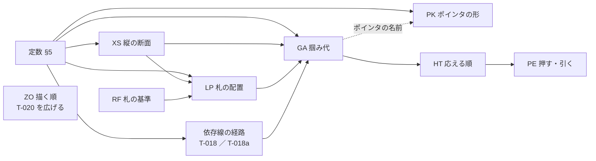

# 新方式の仕様案

- 対象: 掴み代・応える順・ポインタ・札の置き方・押す／引くの効果・描く順・依存線の付け先と形
- 拠り所: 見本 [`grab-area-sizing-sample.html`](grab-area-sizing-sample.html)（規則はすべて実装して測ってある）と、[`rulings.md`](../../docs/development-records/rulings.md) の `JDG-180`〜`JDG-239`
- 使い道: `handoff.md` §1.2 の Step 1b の変更要求（CR）は、この案から起こす。今の仕様のうち置き換える行は [`old-to-new-map-ja.md`](old-to-new-map-ja.md)（Step 1a の対応表）が持つ

⛔ **これは仕様ではない。** 仕様に着地するまでの下書きである。表の名（GA・HT・RF・LP・PE・XS・PK）と行の番号は仮のものであり、CR で登録するまで仕様にも台帳にも書かない。接頭辞は登録済みの 152 と重ならないことを確かめてある（ポインタの表は、登録済みの `PTD` と 1 字違いになる `PT` を避けて `PK` とした）。
⛔ 利用者の言葉はここに写さない（`rulings.md` が持つ）。ここに書く理由は、他人が読んで分かるように整えたものである。

## 1. 設計の方針 —— 依存を少なく、論理を単純に

### 1.1 3 つの作り方の決まり

| 決まり | 中身 | 効き目 |
|---|---|---|
| 1 表 1 問 | 1 つの表は 1 つの問いにだけ答える（「どこを掴めるか」「どれが応えるか」「札をどこに置くか」…） | 表を変えたときに、動くものが 1 つに決まる |
| 流れは一方向 | 表の入力は、上流の表の出力か定数だけである。表どうしの参照に輪を作らない（下の図 1） | どの表も、上流だけを読めば確かめられる |
| 1 値 1 役 | 1 つの定数は、1 つの対象の 1 つの向きだけを決める（`JDG-194`）。共通の値は、共通であること自体が決まりのものに限る（ポインタの縁の太さなど） | 値を変えたときに、ほかの対象が動かない |

### 1.2 5 つの原則（理由）

表の行ごとには理由を書かない。行は次のどれかの原則から来る。

| 原則 | 理由 | 束ねる裁定 |
|---|---|---|
| どれも指せる | どの形も、ズームのどの段でも、それだけが応える領域を持つ。縮めた画面こそ日程を動かす画面だからである | `JDG-187` ／ `JDG-189` ／ `JDG-190` ／ `JDG-194` |
| 実績は事実 | 実績は起きたことの記録である。軽い操作のついでに変わってはならず、変えるのは実績の端を掴む意図した操作に限る | `JDG-187` ／ `JDG-188` |
| 見えないものは掴めない | 画面に無いものが指の下で動けば、利用者は原因を知りようがない | `JDG-184` ／ `JDG-196` |
| 被らせない | 中心線を共有する形（`===`・◆）は札を横へ逃がし、段で分かれた形（`--->`）は札を動かさない。札は線より手前に描く | `JDG-182` ／ `JDG-183` ／ `JDG-185` ／ `JDG-203` |
| ダミーはまだ始まっていない実績 | ダミーに独自の規則を持たせない。規則の数が減る | `JDG-186` |

## 2. 上位要求

どの表にも親の上位要求があり、どの上位要求も表に届く（§7 の表）。本文は `handoff.md` §1.2 で利用者が了承した案に、2026-09-19 の裁定（`JDG-194`〜`JDG-208`）を足したものである。

| ID | 題 | 持つ表・定数 | ORIGIN（案） |
|---|---|---|---|
| `FR-104` | 縮小しても、どれも指せる | GA ・ XS ・ HT ・ 定数 | GL-008 ／ GL-002 |
| `FR-105` | 重なっても、狙ったものが答える | HT ・ PE の 0 行 | GL-008 ／ GL-006 |
| `FR-106` | ポインタの形で、何を掴むかが分かる | GA のポインタ欄 ・ PK | GL-006 ／ GL-008 |
| `FR-107` | 実績は事実なので、ついでには変わらない | PE | GL-008 |
| `FR-108` | 見えないものは、掴めず動かない | GA ・ RF ・ PE | GL-006 |
| `FR-109` | 札は読める所に置く | RF ・ LP ・ XS | UC-001 手順 4・拡張 4a・4b ／ UC-003 手順 4 ／ UC-005 手順 3〜4 ／ GL-001 ／ GL-002 |
| `FR-110`（新） | 描く前後は 1 つの表で決める | ZO | UC-001 手順 4 ／ UC-004 手順 4 ／ GL-001 ／ GL-002 |
| `FR-043`（書き直し） | 未着手でも、実績を直接描き始められる | GA ・ RF ・ PE | GL-008 |
| `FR-044`（今のまま。表を指す） | 再開予定日を置く（中断のあいだ再開アイコンを描き、引けば再開日が変わる） | XS ・ LP ・ GA ・ HT ・ PE ・ PK ・ ZO の再開アイコンの行 | 今の `FR-044` の ORIGIN（UC-005 拡張 3a ／ GL-008） |
| `FR-009`（書き直し） | 依存線は予定に付ける | 依存線の定数 ・ GA の依存線の行 | 今の `FR-009` の ORIGIN を引き継ぐ |

**FR-104 縮小しても、どれも指せる**
- STATEMENT: `GRS` は、表示をどこまで縮小しても、描いているタスク・マイルストーン・進捗マーカー・依存線のそれぞれを、ポインタで指して操作できるようにすること。そのために、各操作対象に、他の対象に取られない掴み代を持たせること。掴み代の形と大きさは表 GA、縦の段は表 XS、重なったときの応答は表 HT に従う。
- RATIONALE: 縮小は全体を 1 枚で見るための操作であり、縮小した画面こそ日程を動かす画面になる。縮めると形は近づいて重なるので、描いた形の大きさにだけ頼ると、小さい形や後ろの形を指せなくなる。掴み代の値を対象ごとに独立させるのは、1 つの対象の掴みやすさを直したときに、ほかの対象の掴みやすさを変えないためである。

**FR-105 重なっても、狙ったものが答える**
- STATEMENT: `GRS` は、ポインタの下で複数の掴み代が重なるとき、応答する対象を 1 つに決め、しかもその決め方を利用者が見た目から予測できるものにすること。決め方は表 HT に従う。日程表（行の領域と目盛）の上の押下と引く操作は、形への操作にだけ使い、字の選択を始めてはならない（MUST NOT）。修飾キーを付けた割当の無い引く操作も同じである（今の `MK-12` の「ブラウザの既定動作に委ねる」に、この 1 つの例外を足す）。
- RATIONALE: 同じ場所を押して毎回違うものが動くなら、利用者は操作を信用できない。押した所から字の選択が始まれば、形を掴んだつもりの操作が画面の字を選ぶだけで終わる。`FR-104` が「指せること」を、本要求が「指したものが答えること」を受け持つ。

**FR-106 ポインタの形で、何を掴むかが分かる**
- STATEMENT: `GRS` は、ポインタが掴み代に入ったとき、ポインタを、何を掴むか（予定か、実績か、マーカーか、フェードか、マイルストーンか、依存線か）と、引いたら何がどちらへ動くかが分かる形に変えること。押しているあいだは、掴んだときの形を保つこと。どの掴み代でどの形かは表 GA のポインタ欄、形そのものは表 PK に従う。
- RATIONALE: 押す前に結果が分かれば、説明を読まずに正しい所を掴める。予定と実績は同じ場所に重ねて描かれるので、見た目だけでは区別できない。ポインタの白抜き（予定）と塗り（実績）がその区別を担い、線の矢印（依存線）と箱型の矢印（タスクの端）は形で区別する。

**FR-107 実績は事実なので、ついでには変わらない**
- STATEMENT: `GRS` は、実績の日付を、利用者が実績（ダミーを含む）を掴んで意図して動かしたとき、または進捗マーカーを押す・引くとき（表 PE の 8〜10 と注「押下の巡り」）にだけ変えること。ほかの操作のついでに変えてはならない（MUST NOT）。どの操作が何を変えるかは表 PE に従う。
- RATIONALE: 実績は起きたことの記録であり、予定のように引き直す対象ではない。予定をずらす・行を移すといった軽い操作のついでに実績が動けば、利用者は気づかないまま事実を書き換えてしまう。進捗マーカーだけを例外にするのは、状態を変える操作そのものが実績の記録だからである —— 未着手を進行中にすれば作業が始まった日が要り、中断を未着手に戻せば実績を外す（外した実績は開いているあいだ覚え、次の押下か取り消しで戻る。`JDG-234`・`JDG-239`）。

**FR-108 見えないものは、掴めず動かない**
- STATEMENT: `GRS` は、表示していない予定・実績・依存線を、掴めないようにし、ほかの操作で動かさないこと。表 RF と表 PE に従う。
- RATIONALE: 画面に無いものが指の下で動けば、利用者はそれに気づけず、取り消すこともできない。

**FR-109 札は読める所に置く**
- STATEMENT: `GRS` は、1 つのタスク・マイルストーンについて、名称・担当者・進捗・進捗マーカー・再開アイコンを互いに重ねず（今の `OR-1`）、どれも形に隠れて読めなくならない場所に置くこと。名称はフェードの上に重ねない（今の `FR-002` の MUST を残す）。線だけの形（`--->`）は、札（担当 : 進捗・マーカー・名前）・予定・実績を 3 段に積み、既定の縦の倍率で 3 段の縦幅を矩形の予定の縦幅以下にすること。置き方は表 RF と表 LP、縦の段は表 XS に従う。
- RATIONALE: 1 行に複数のタスクを置き、全体を縮めて見るほど、字と形は近づく。読めない俯瞰図は価値を失う。予定と実績のどちらを見せているかで札の基準を替えるのは、見えているものに札が付いていないと読み手が迷うからである。線だけの形は、字が一回り小さく、予定と実績の矢が細いので、段に積んでも矩形より低く収まる —— 段を積んだ行で縦に詰めて並べられることが、線だけの形を選ぶ理由である（`JDG-212`）。1 段だけの行は、行の床（今の `LF-3`: 矩形の高さと行の見出しのボタンの格子）で矩形の行と同じ高さになる（`JDG-238`）。
- 対象は 1 つのタスクの中に限る。隣のタスクどうしの札のぶつかりは段割当の受け持ちである（外へ出した名前は `OC-1` で占有に入り、`ST-3` が干渉しない段を選ぶ）。
- ⚠️ 今の `FR-002` と二重にしない: `FR-002` は名称の字そのもの（打ち切り・予定日・9 点のアンカー）に縮め、置き場は本要求が持つ（案。CR が決める）。

**FR-110（新） 描く前後は 1 つの表で決める**
- STATEMENT: `GRS` は、日程表に描くものの前後（どれが手前に見えるか）を 1 つの表で決めること。名称・担当と進捗・進捗マーカーは、線と形より手前に描くこと。描く前後を、応える順（表 HT）の根拠にしてはならない（MUST NOT）。前後は表 ZO に従う。
- RATIONALE: 前後の決まりが各所に散ると、同じ 2 つのものの前後が場所ごとに違って決まる。字が線に隠れると、読める俯瞰が損なわれる。線は字の下を通っても途切れて見えないが、字は線に切られると読めない。見える前後と掴める順を別にするのは、細いものを手前に描いても、掴みやすさは掴み代で決めるためである（今の `MK-9a`）。
- 今の表 T-020 の宿主（`FR-011`）と、`V-5` の「`FR-011` と表 T-020」を、本要求へ指し直す。

**FR-043（書き直し） 未着手でも、実績を直接描き始められる**
- STATEMENT: `GRS` は、実績をまだ持たないタスク・マイルストーンにも、実績を描き始める掴み場所（ダミー）を示すこと。ダミーは「まだ始まっていない実績」として、実績と同じ規則で置き、掴ませること。表 RF・GA・PE に従う。
- RATIONALE: 実績の入力を、タスクを掴むのと同じ直接操作で始められるようにする。ダミーに独自の規則を持たせないことで、規則の数が減る。

**FR-009（書き直し） 依存線は予定に付ける**
- 変える所: 「予定を表示していないときに限り、実績の幾何に付ける」と「予定が無いときは実績に落ちる」を消し、次に替える —— 依存線は予定の幾何にだけ付けること。予定が無いとき、予定を表示していないときは、その依存線を描かないこと（`RT-4a` の列挙に足す）。形（引き出し・引き入れ・矢じり）は定数（§5）に従う。`FR-013` の「`FR-009` と同じ形」の文は消す（`DFC-659`）。
- 結ぶ道具が「当たった」と読む範囲は、そのタスクのどこでもよい —— 描いた形（予定・実績・ダミー）、進捗マーカーと再開アイコンの描いた箱、名前と担当・進捗の札の箱（`JDG-237`）。開始か終了かは、ポインタが予定の中点より左か右かで決める（今の R:2488 の「バー自身の中点」を「予定の中点」に。R:2486 の「端点の掴み代で判じない」は残す）。名前と札は素の押下では掴みとして成立しない（今の `GR-10`・`GR-11`）が、構えた道具の当たりには数える。今の `PTD-3` の文と `PI-7` の「タスク」（D:427）をこれに合わせる。
- RATIONALE: 依存線は予定に対して設定する情報である（`PredecessorLink` が縛るのは予定の日付であり、実績は記録された事実である）。実績に付けると、実績を入れるたびに線が動く。

## 3. 表どうしの依存

*図 1 —— 矢印は「読む」向き。輪は無い。ZO はどの表も読まず、どの表にも読まれない（`MK-9a`: 描く順と応える順は別）。*

| 辺 | 何を渡すか | この辺が要る理由 |
|---|---|---|
| XS → LP・GA | 形ごとの縦の帯の位置と高さ | 札も掴み代も、形の縦の帯に揃える |
| RF → LP | 札の基準（実績 ／ ダミー ／ 予定）とその横の範囲 | 札は基準に付く |
| LP → GA | マーカーの位置と、「入る」かどうか | マーカーの掴み代はマーカーの位置に置く。実績の開始の内側は、マーカーが実績の開始に立つときマーカーの中心で止める |
| 依存線の経路 → GA | 線の折れ点 | 線の掴み代は描いた線に沿う |
| GA → HT | 掴み代の一覧（種別・範囲・中心） | 応える順は掴み代の上で決める |
| HT → PE | 応えた掴み代の種別 | 効果は掴んだものの種別で決まる |
| 定数 → LP（1 本だけの横の辺） | 実績の終了の内側の幅 | 「入る」の判定は、名前を実績の終了の掴み代の上に置かないために、その幅を取り置く（7 問の ⑥、`JDG-224`） |

⭐ **無い辺**: 掴み代の値どうし（`JDG-194`）、描く順と応える順（`MK-9a`）、札の余白と掴み代（`JDG-195`）。

## 4. 表

⚠️ 表 GA とポインタの値は画面の px である（掴み代とポインタには描く比を掛けない。`DS-7`・表 T-264）。描く寸法（字・マーカー・札の余白・依存線の形・`--->` の段の間）の既定値は、§5 に仕様の単位（文書に保存する値。表示の倍率 100 で × 0.625 して描く）で書く（`JDG-219`）。

### 4.1 表 XS —— 縦の断面（1 行 ＝ 1 つの帯。h は矩形の予定の縦幅）

| # | 形 | 帯 | 縦の位置 | 高さ |
|---|---|---|---|---|
| 1 | `===` | 予定 | 行の帯の中央 | h |
| 2 | `===` | 実績・ダミー | 予定と同じ中心 | h × `actualOfPlan`（0.5715） |
| 3 | `===` | マーカー・名前・担当と進捗 | 同上 | マーカーの径（名前と札は字の大きさ） |
| 4 | `--->` | 1 段目: 担当 : 進捗・マーカー・名前 | 形の帯の上端 | 字の大きさ f（マーカーの径も f。`FR-094`）。f は 予定の帯 p（h × `S-15` 0.5）× 0.5715 × 0.90 × `S-9`（0.85）と `S-8` の大きい方 |
| 5 | `--->` | 2 段目: 予定の矢 | 線の上の縁を、1 段目の下端（字の大きさ f の箱の下端）から `S-196` 下に置く | 線の太さ（独立の設定値）。矢じりは、横幅（長さ。矢の長さの `S-46` 0.4 倍で頭打ち）と縦幅（高さ）がそれぞれ独立の設定値（`JDG-221`） |
| 6 | `--->` | 3 段目: 実績の矢 | 線の上の縁を、予定の線の下の縁から `S-10`（`actualGap`）下に置く | 予定と同じ線の太さと矢じり |
| 7 | `--->` | 予実の境（掴み代を分ける中線） | 2 本の線の中心の中点 | — |
| 8 | ◆ | 予定の菱形 | 行の帯の中央 | h（幅も h） |
| 9 | ◆ | 実績・ダミーの菱形 | 同上 | h × 0.5715（幅も同じ。`LF-10`） |
| 10 | `===` | 再開アイコン（再開日あり） | 腕を実績の帯の中心線に置く（箱の中心 ＝ 中心線。箱の下端はマーカーの下端に揃う）。縦棒は再開日の左の境目 | 箱 ＝ マーカーの径 |
| 11 | `===` | 再開アイコン（再開日が未定） | 10 と同じ中心線。縦棒は停止日の翌日の左の境目（＝ 実績の右端。`JDG-226`） | 箱 ＝ マーカーの径 × `S-25`（0.7） |
| 12 | `--->` | 再開アイコン（再開日あり） | 3 段目。腕を実績の線に置き、縦棒は線から下へ伸ばす | 箱 ＝ 名前の字の大きさ（`FR-094`） |
| 13 | `--->` | 再開アイコン（再開日が未定） | 12 と同じ 3 段目。縦棒は実績の線の右端（停止日の翌日の左の境目。`JDG-226`） | 箱 ＝ 名前の字の大きさ × `S-25` |
| 14 | `--->` | 3 段目: 未着手の印（ダミー） | 実績の線と同じ中心。予定の開始から | 線の太さ。横幅 ＝ マーカーの径（字の大きさ f）× 0.5。矢じりを付けない（`JDG-232`） |

`--->` の行（4〜7・12〜14）は、端点スパン（`SH-4`）にも当てる —— 同じ 3 段で、矢じりの代わりに両端へ点を置く（点の径は独立の設定値。`JDG-229`）。

`--->` の掴み代は、予定が中線より上だけ、実績が中線より下だけを取る（予実が重ならない）。`===` と ◆ は帯が入れ子なので、予実の掴み代は重なり、表 HT で分ける。今の「掴みシロを上下のレーンに割ってはならない」（MUST NOT）は、`===` と ◆ に限る文へ書き直す（`JDG-185`）。

- **3 段（`JDG-212`）と値の持ち方（`JDG-221`）**: 2 つの間は、描いた線どうしで測る —— 1 段目の下端（字の大きさ f の箱の下端。描いた字の箱ではない）→ 予定の線の上の縁、予定の線の下の縁 → 実績の線の上の縁。0 で接する。矢じりが線より高いと、その差の半分ずつが上下の間へはみ出す（はみ出すのは矢の終わりの 1 か所だけである）。線の太さ・矢じりの横幅・矢じりの縦幅は、それぞれ 1 つの設定値であり、ほかの値から導かない（1 値 1 役）。
  - ⚠️ 前の持ち方（線 ＝ 予定の帯 × `S-40` を `S-41`〜`S-42` に収め、矢じり ＝ 線 × `S-45`、間は矢じりの高さで取った段と段のあいだ）では、間を 0 にしても 2 本の線のあいだに 1.75px（矢じりの高さ 3.5 − 線 1.75）が残った —— 線は自分の段の中央にあり、上下に 0.875px ずつ空いていたからである。
- **縦幅** ＝ f ＋ `S-196` ＋ 線 ＋ `S-10` ＋ 線 ＋（矢じりの縦幅 − 線）÷ 2 ≦ h（`FR-109`）。既定の値（仕様の単位。描く比 0.625 を掛けた px を括弧に）: f 12（7.5）、`S-196` 2（1.25）、線 2.8（1.75）、`S-10` 2（1.25）、矢じり 横幅 5.6 × 縦幅 5.6（3.5 × 3.5）⇒ 縦幅 23.0（14.375）＜ h 28（17.5）。間を 0 にすれば 19.0（11.875）。
  - 段の位置は、矢の横幅によらず取る（短い矢で矢じりの横幅が頭打ちになっても、段は動かない）。実績を隠しても、実績が無くても、3 段目は取っておく（`FR-049`、群 B ⑮）。
  - 端点スパン（`SH-4`）: 点の径は独立の設定値（既定 6.4、描いて 4px。`JDG-229`）であり、今の `LF-7` の「点の半径 ＝ 線 × `spanDotOfStroke`」と `S-47` を退役させる。縦幅の式の「（矢じりの縦幅 − 線）÷ 2」は「（端の印の縦幅 − 線）÷ 2」と読む（端の印 ＝ 矢じりの縦幅か点の径）⇒ 既定で 23.4（14.6）＜ h 28。⚠️ 点は両端にあるので、予定と実績の開始が同じ日に立つと、`S-10`（2）の間に上下から 1.8 ずつはみ出し、既定で 1.6（描いて 1.0px）重なる —— ㊳ で決める。「はみ出すのは矢の終わりの 1 か所だけ」は `SH-3` に限る。
  - 中断のあいだの実績の線は、停止日で矢じり（端点スパンは終わりの点）を付けずに止まる —— 矢じりと終わりの点は「ここで終わった」を表すからである（`JDG-230`。`JDG-185` の「実績も矢印の形」を、中断のあいだだけ覆す）。
  - 12・13 の再開アイコンの縦棒は、実績の線から下へ伸び、3 段の下端より 2px（描いて）下の隙間へ出る。隙間（`VG-2` の 3.5px）の内で、次の段の形には届かない。`VG-5` の「描いた端」には数えない —— 数えると、中断にするたびに段が動く。隙間を通る依存線とは、アイコンが手前（表 ZO の 7）に描かれる。
  - 今の `LF-13`（下端をマーカーの下端に、矢先の高さをマーカーの中心に置いた L 字）は 10 にだけ当たる。11（未定は × 0.7 で中心線に置くので、下端はマーカーの下端に揃わない）と 12・13（`--->` は 3 段目に立ち、マーカーは 1 段目）に合わせて書き直す。
  - ⚠️ 1 段目の高さは字の大きさ f で数え、今の `OC-10` の「字 × `S-233`（1.5）」では数えない。描いた字の箱は、既定の書体で f の約 1.33 倍（見本で測った: f 7.5px の名前の箱 10px）なので、上下に約 1.25px ずつはみ出す。上は行と段の隙間（`VG-2` の 3.5px）が受ける。⇒ `OC-10` の 1 段目の数え方と `S-233` の使い道を CR で書き直す。
  - 既定の縦の倍率での狙いである。`zoomY` で h を縮めると、f は字の床（`S-8`）で止まるので、3 段は h より高くなりうる（矩形の床 `S-6` との釣り合いは Step 4 で測る）。
- **マーカーの段**: マーカーは 1 段目に立つ（`JDG-212`）。今の仕様の 2 か所 —— `FR-002` の「マーカーは実績の高さに立つ」と `LF-11` の「縦は予定バーの中心」—— は、線だけの形についてどちらも覆る（`DFC-663`）。1 段目のマーカーの下には他の段の掴み代が無いので、マーカーの掴み代はマーカー全体である（群 C ③）。
- **2 のダミー（群 B ①c、`JDG-210`）**: ダミーは 1 日の実績と同じ形で描く（`DM-4`）ので、描く帯も掴む帯も実績の帯である。

### 4.2 表 RF —— 札の基準（`JDG-184`・`JDG-186`）

| # | 実績を表示 | 実績がある | 札の基準 |
|---|---|---|---|
| 1 | する | ある | 実績 |
| 2 | する | ない | ダミー（幅 ＝ マーカーの径 × 0.5。◆ はダミーの菱形） |
| 3 | しない | — | 予定 |

素朴に数えると 形 3 × 実績を表示 × 実績がある × マーカー × 入る ＝ 48 通りである。ダミーを「まだ始まっていない実績」として基準に畳むと、本表 3 行と表 LP 8 行の 11 行で済む。

### 4.3 表 LP —— 札の配置（`JDG-182`・`JDG-183`・`JDG-185`・`JDG-195`）

| # | 形 | マーカー | 入る | マーカーの位置 | 名前の書き出し |
|---|---|---|---|---|---|
| 1 | `===` | 出す | 入る | 基準の開始 | マーカーの右端 ＋ 「タスク名 マーカー → 名前」 |
| 2 | `===` | 出す | 入らない | 基準の終了のすぐ右 | 同上 |
| 3 | `===` | 出さない | 入る | — | 基準の開始 ＋ 「タスク名 開始 → 名前」 |
| 4 | `===` | 出さない | 入らない | — | 基準の終了 ＋ 同じ値（外へ） |
| 5 | `--->` | 出す | （問わない） | 基準の開始（1 段目） | マーカーの右端 ＋ 「タスク名 マーカー → 名前」（1 段目） |
| 6 | `--->` | 出さない | （問わない） | — | 基準の開始 ＋ 「タスク名 開始 → 名前」（1 段目） |
| 7 | ◆ | 出す | （問わない） | 基準の菱形の右端 | マーカーの右端 ＋ 「マイルストーン名 マーカー → 名前」 |
| 8 | ◆ | 出さない | （問わない） | — | 基準の菱形の幅を 0〜100% として 25% の位置から左詰め |

- **入る**: （マーカーを出すなら マーカーの径 ＋「マーカー → 名前」、出さないなら「開始 → 名前」）＋ 名前の幅 ＋ 実績の終了の内側の幅 ≦ 基準の幅。7 問の ⑥ は「終了側だけ取り置く」に決まった（`JDG-224`）—— 開始側は、マーカーが実績の開始の掴み代の上に立つ設計（`JDG-215`）なので取り置かない。
- **担当と進捗**: 1 枚の札にまとめ、右寄せで、描いている予定と実績のうち早い方の開始から「担当・進捗 → 開始」だけ左に置く。◆ は、基準の菱形の 25% の位置からその値だけ左。`--->` は 1 段目で、基準の開始（マーカーの左端）からその値だけ左 —— 1 段目は左から 担当 : 進捗 → マーカー → 名前 と並ぶ（`JDG-212`）。
- マーカーを出さないときは、マーカーの幅のぶん名前を左へ寄せる（今の仕様の `S-63` の段のまま）。
- **再開アイコン（`JDG-230` で決まった）**: 中断のあいだだけ描く（`FR-044`）。マイルストーンには描かず、掴み代も持たない（今の `LF-11` ／ `GR-8` の MUST NOT のまま —— 点は期間を持たないので中断も再開も無い）。
  - ⭐ **いつも実績の右に立つ**（利用者の裁定 2026-09-19、`JDG-226`）: 再開日があれば再開日に、未定なら停止日の翌日（実績のすぐ右）に立つ。すでに実績のある期間には立たない —— 再開日は停止日の翌日より前に置けない（表 PE の 13）。再開日の既定（未定のときアイコンが立つ日）は、いつも停止日の翌日である。
  - 札の並びには、未定でも入らない（今の `OR-2` を未定にも広げる）。`--->` のアイコンは 3 段目に立つので、1 段目の札（担当 : 進捗 → マーカー → 名前）と重ならない。
  - ⭐ `===` で「入らない」とき（㊱ の案）: 札（マーカーと名前）は実績のすぐ右に置き、その並びが再開アイコンに届くときだけ、アイコンの箱の右端から並べる。未定のアイコンは実績のすぐ右に立つので、いつも 実績 → アイコン → マーカー → 名前 になる（`JDG-226`）。再開日が先のときは 実績 → マーカー → 名前 …（破線）… アイコン となり、破線は札の下を通る（札は地の色の縁で読める）。「入る」とき、マーカーと名前は実績の中、アイコンは実績の右に立つ。「入る」の判定は実績の幅のまま（アイコンの幅は足さない）。
  - ⚠️ 案は今の R:1584（アイコンのために並びの中に場所を空けない、MUST NOT）と `JDG-92`（名前を形の近くに出す）を保つ —— 札をアイコンの右へ送るのは、重なるときだけである。「いつも アイコンの右」（`JDG-226` の逐語どおり）にすると、再開日が 3 週間先なら札も 3 週間右へ離れ、R:1584 を覆す。㊱ で決める（見本は切り替えられる）。
  - 未定のアイコンは小さく描くが、掴む箱はマーカーの大きさのまま（`JDG-39`、今の R:3462 を保つ。表 GA の 20）。
  - ⚠️ 消えるもの: 今の表 T-243 の結び（R:1585。未定のアイコンは札の並びに入り、名前はその右端から数える）と、`S-23` のうち「マーカー → 未定のアイコン」の用途。前の案（`JDG-222` の ③: 未定はマーカーのすぐ右、`--->` は 1 段目）も退く。書き直す: `OC-4`（R:1535）の「場所はマーカーのさらに外側」を「実績の右」に、R:1554 の理由、R:3514 の「`LF-11` の日付位置」に「未定なら停止日の翌日」を足す。
  - 取り込んだ再開日が停止日以前のとき（交換相手は過去の再開日を残しうる。R:2600）は、値は持ったまま（往復）、アイコンは停止日の翌日に描く。「停止日の翌日より前には置けない」は、引く操作と属性の欄で置く値にだけ当て、不変条件にしない（今の `FR-103` の「新しい拒み方を立てない」を保つ）。
  - 実績を隠すと（`S-228`）、再開アイコンと破線も描かず掴めない（`FR-044` に 1 文。`DM-14` と同じ形）。
- **今の MUST を残す**（一括で消すと黙って落ちる。見本はまだ持たない）:
  - 基準が予定（表 RF の 3）のときは、フェードを除いた幅で「入る」を数え、名前は `fadeIn` の終わりから書く（今の `FR-002`、名称をフェードの上に重ねない）。
  - （今の表 T-243 の結びの「未定の再開アイコンは札の並びの中」は、`JDG-226` で消す —— 上の再開アイコンの段）
  - 担当と進捗の区切りは「 : 」（半角コロンの前後に空白 1 つ。今の `FR-090`）。見本も「 : 」で描く（群 A）。
  - 線だけの形（`--->`）の名前と札は 0.85 倍（今の `S-9`）で、字の床（`S-8`）を割らない。見本もそう描く（群 A）。

### 4.4 表 GA —— 掴み代の幾何（1 行 ＝ 1 つの操作対象。`JDG-194`）

横の値は、描いた端から外へ（外側）・内へ（内側）、または基準点に中央を合わせた幅。縦は、表 XS の帯から上下へ張り出す値。どの値も、ほかの行の掴み代を動かさない。

| # | 形 | 掴む所 | 基準点 | 横 | 縦（帯 ＋ 上下） | ポインタ（表 PK） |
|---|---|---|---|---|---|---|
| 1 | `===` | 予定の開始 | 予定の左端 | 外側 12 ／ 内側 0（内側の値は持ち、既定を 0 とする。`JDG-216`） | 予定 ＋ 0（`JDG-197`） | 箱の矢印 ← 白 |
| 2 | `===` | 予定の終了 | 予定の右端 | 外側 12 ／ 内側 0 | 予定 ＋ 0 | 箱の矢印 → 白 |
| 3 | `===` | 実績の開始 | 実績の左端 | 外側 0 ／ 内側 12。内側は実績の幅の半分まで（今の仕様の MUST を残す）。マーカーが実績の開始に立つときは、内側をマーカーの中心で止める（`JDG-187`） | 実績 ＋ 0 | 箱の矢印 ← 黒 |
| 4 | `===` | 実績の終了 | 実績の右端 | 外側 0 ／ 内側 12。内側は実績の幅の半分まで | 実績 ＋ 0 | 箱の矢印 → 黒 |
| 5 | `===` | ダミーの開始 | ダミーの左端（＝予定の開始） | 外側 0 ／ 内側 12。内側は印の幅の半分まで（実績の開始と同じ値を既定にした別の定数。`JDG-213`） | 実績 ＋ 0（群 B ①c） | 箱の矢印 ← 黒 |
| 6 | `===` | ダミーの終了 | ダミーの右端 | 外側 0 ／ 内側 12。内側は印の幅の半分まで（実績の終了と同じ値を既定にした別の定数。`JDG-213`） | 実績 ＋ 0（群 B ①c） | 箱の矢印 → 黒 |
| 7 | `===` | フェード入 | 台形の点 4（予定の上辺） | 中央合わせの正方形 8 | 同左 | 三角 入 |
| 8 | `===` | フェード出 | 台形の点 2（予定の下辺） | 中央合わせの正方形 8 | 同左 | 三角 出 |
| 9 | `===` | 本体 | 予定の形 | 描いた形そのもの | 予定 | てのひら |
| 10 | `--->` | 予定の開始 | 予定の軸の左端 | 中央合わせ 12 | 予定の矢（中線より上）＋ 0 | 箱の矢印 ← 白 |
| 11 | `--->` | 予定の終了 | 予定の `>` の中心 | 中央合わせ 12 | 同上 | 箱の矢印 → 白 |
| 12 | `--->` | 実績の開始 | 実績の軸の左端 | 中央合わせ 12 | 実績の矢（中線より下）＋ 0 | 箱の矢印 ← 黒 |
| 13 | `--->` | 実績の終了 | 実績の `>` の中心 | 中央合わせ 12 | 同上 | 箱の矢印 → 黒 |
| 14 | `--->` | 本体 | 予定の矢 | 描いた形そのもの | 予定の矢 | てのひら |
| 15 | ◆ | 予定 | 予定の菱形の中心 | 菱形の幅の 115%（`JDG-189`） | 菱形 ＋ 0 | 円 ○ |
| 16 | ◆ | 実績 | 実績の菱形の中心 | 菱形の外接正方形（一辺 ＝ 菱形の幅）＋ 外側 0（`JDG-189`、今の `GR-18` の「描いた正方形」） | 同左 ＋ 0 | 円 ● |
| 17 | ◆ | ダミー | ダミーの菱形の中心 | 同上 | 同上 | 円 ● |
| 18 | 共通 | 進捗マーカー | 描いたマーカー | 描いたマーカー ＋ 外側 0 | 同左 | 指 |
| 19 | 共通 | 依存線 | 描いた線 | 線の縁から左右 2（`JDG-199`） | — | 線の矢印 |
| 20 | `===`・`--->`（◆ には無い） | 再開アイコン | アイコンの箱（左端 ＝ 縦棒 ＝ 再開日の左の境目。未定なら停止日の翌日の左の境目） | 箱 ＋ 外側 0（独立の定数。箱はマーカーの径 ＝ 今の `GR-8` の `S-22` と同じ大きさ。未定のアイコンは小さく描くが、掴む箱はマーカーの径のまま —— `JDG-39`、今の R:3462） | 同左。`--->` の 3 段目では中線より下だけ（`JDG-185`） | 再開の折れ矢印（表 PK の 9） |
| 21 | `--->`（未着手） | ダミーの開始 | 印の左端（＝予定の開始） | 中央合わせ 12（実績の開始と同じ値を既定にした別の定数。`JDG-232`） | 実績の線（中線より下）＋ 0 | 箱の矢印 ← 黒 |
| 22 | `--->`（未着手） | ダミーの終了 | 印の右端 | 中央合わせ 12（実績の終了と同じ値を既定にした別の定数） | 同上 | 箱の矢印 → 黒 |

単位は画面の px（◆ の予定の幅だけ ％）。掴み代には描く比を掛けない（`DS-7`）。20 の対象・41 の値（本体の 2 行は値を持たない）。`--->` の 10〜13・21・22 は端点スパンにも当て、基準点は開始の点と終了の点の中心とする。表示していない予定・実績・依存線は掴み代を持たない（`FR-108`）。

- **ダミーの掴み代（`JDG-213`・`JDG-232`）**: 定数は実績と別に持ち、既定は実績と同じ値にする。`===` では、印（幅 ＝ マーカーの径 × 0.5）の左半分が開始、右半分が終了で、印の外へ出ない（`JDG-41` のまま）。予定より早く始まったタスクでも、ダミーの開始を左へ引いて実績を始める（予定の開始の左は予定の開始の掴み代である）。
- **`--->` のダミー（21・22、`JDG-232`）**: 印の幅は 3.75px（字 7.5 × 0.5）しかないので、2 つの掴み代（中央合わせ 12）は重なる。重なりは印の横幅の中央で割る（今の `TE-3` を `--->` にも当てる。基準点が印の両端なので、表 HT の段 4 でも同じ所で割れる）⇒ 開始・終了とも約 8px の的になる。印の外へ約 6px ずつ出る —— `JDG-41`（印の外へ広げない）を `--->` について覆す（利用者は代償を知って選んだ）。今の R:3372・R:3374・R:3476 の MUST NOT と `S-180`・`S-131` の「掴み代は印そのもの」を、`--->` を除く文に書き直す。中線より下なので、予定の開始（中線より上）とは取り合わない（`JDG-04`・`JDG-19` は `JDG-185` と同じ読みで保たれる）。
- ⚠️ **予定の端の内側**（`JDG-216`）: 既定 0 から上げると、短い予定では本体が消える（見本で測った: 1 日 2px・5 日の予定で内側 6 にすると本体 0px）。上げる値の上限の規則は、上げると決めたときに足す。

- **実績の端の頭打ち**: 実績の開始・終了の内側は、実績の幅の半分を超えない（今の仕様の MUST。覆す裁定は無い）。これで短い実績でも左半分が開始、右半分が終了になり、両端が入れ替わらない。見本は当初これを落としていて、1 日 2px の倍率の 1 日の実績では左に終了・右に開始が応え、1 日 12px では 12px 全部が終了で開始を掴めなかった（測った。頭打ちを足して直した）。
- 引いているあいだの絵と、引いたときに書かない規則（今の `FR-016` の散文）は、本表の外に残す。

### 4.5 表 HT —— どれが応えるか（`JDG-150`・`JDG-190`・`MK-9a`）

本表は**日程の形の中の順**だけを持つ。今の 表 T-023d は消えず、日程の形でないもの（パレットと面の境の掴み帯、名前・担当のダブルクリック、注記、行見出し、基準日線、スクロールバー）の順を持ち、日程の形の段を「表 HT に従う」の 1 行で持つ（下の表 T-023d の新しい並び）。

4 段で決める。前の段で 1 つに決まれば、後の段は読まない。

| 段 | 規則 |
|---|---|
| 1. 形の上 | 描いた形の上では、その形のタスクの掴み代だけが応える（`GS-1`）。描いた形は形ごとに読む（今の R:3408 の「予定と実績を描いた範囲の矩形」を置き換える。`JDG-236`）: `===`（と矢羽根）は描いた予定・実績・ダミーのバーそれぞれ、`--->` と端点スパンは予定の線・実績の線それぞれの帯（矢じり・点の縦幅を含む）、◆ は描いた図形、進捗マーカーと再開アイコンは描いた箱。形と形のあいだ（`--->` の 2 本の線のあいだ、短い実績の右の空き）は形の外である。依存線とハイライトボックスの枠は、形の上では描いた線そのもの（線の中心から 線の太さ ÷ 2。群 A ⑭）でだけ応える |
| 2. 形の外の縦 | 形の外で 2 つ以上のタスクの掴み代に入ったら、描いた形が上下に近いタスクの掴み代だけを残す（今の `GS-2`。群 B ⑪）。依存線はタスクではないので残る |
| 3. 種別の順 | 下の順で、先に来る種別の掴み代が応える。ただし進捗マーカーの描いた形の上では、フェードを「進捗マーカー（実績の中に立つ）」の後へ回す（群 B ⑩、`JDG-178`） |
| 4. 同じ種別 | 掴み代の中心までの直線の距離が近い方が応える（`JDG-190`・`JDG-217`）。距離が同じなら後に描いた方 |

| 順 | 形の上 | 形の外（隙間・外側の帯） |
|---|---|---|
| 1 | フェード | フェード（`JDG-218`。`GS-4` の例外） |
| 2 | 進捗マーカー（実績の外に立つ） | 依存線（`GS-4`） |
| 3 | ダミー | 進捗マーカー（実績の外に立つ） |
| 4 | 実績の端（◆ の実績を含む） | ダミー |
| 5 | 依存線 | 実績の端 |
| 6 | 予定の端 | 予定の端 |
| 7 | 進捗マーカー（実績の中に立つ） | 進捗マーカー（実績の中に立つ） |
| 8 | ◆ の予定 | ◆ の予定 |
| 9 | 本体 | 本体 |

2 つの列の違いは依存線の位置だけである。形の外でもフェードの掴み点を線より先にするのは、掴み点が選んだタスクにだけ出る（`FR-075`）小さな 1 か所の的であり、線は長くてほかのどこでも選べるからである（`JDG-218`。見本で測った: 「作業」のフェード入の 64px² のうち、線が先なら 28px²、フェードが先なら 60px² でフェードが応える）。実績の中に立つマーカーを実績の端より後に置くので、マーカーの左半分は実績の開始、右半分はマーカーが応える。再開アイコン（今の `GR-8`）は、実績の外に立つ進捗マーカーと同じ順 2 に入れる（`JDG-230`）—— 今の MUST「予定の本体（`GR-12`）に優先し、奪う量に上限を設けない」を満たす（拡大しても再開はできないので）。段 1（形の上）では、アイコンの描いた箱もマーカーと同じく「描いた形」に数え、段 3 のただし書き（フェードを後へ回す）も同じに当てる。

- **段 3 のただし書き（群 B ⑩）**: マーカーの描いた形の上では、マーカーがフェードの掴み点に勝つ（`JDG-178` のまま）。実績の開始に立つマーカーの左半分は、順 4 の実績の開始が順 7 のマーカーより先なので、実績の開始が応える（`JDG-187` のまま）。見本で測った: ① の行の点（予定の開始 ＋ 2、バーの上端 ＋ 3）は フェード入 → マーカー、⑤ の「作業」のフェード入を 1 日入れた点は フェード入 → マーカー に変わった。
- **段 2（群 B ⑪）**: 見本で測った（⑤ の行、予定の端の上下を 12px にし、依存線を隠して 2,884 点）: 19 点で「準備」のフェード出 → 「作業」の予定の終了 に変わった。どれも「作業」の方が上下に近い点である。⚠️ 依存線を出していると、隙間では `GS-4` で線が先に応えるので、段 2 は効かない。
- **マーカーの掴み代（群 C ③、`JDG-215`）**: マーカーが実績の開始の掴み代と重なるとき（`===` で「入る」とき）だけ、中心で割る（左半分は実績の開始、`JDG-187`）。重ならないとき（`===` で実績の終了の右に立つとき、`--->` の 1 段目、◆）は、マーカー全体がマーカーの掴み代である。`JDG-27` のうち「実績の端の掴み代の外に立つ」は、実績の開始の側について覆された（一部）。
- **段 1 の読み（`JDG-236`）**: `===` で実績が予定の外へ出た所の上下は、今の仕様（範囲の矩形）では形の上、本案（形ごと）では形の外になる。線だけの形の細い範囲を矩形で読まないのは、何も描いていない所で、通る依存線などを掴めるようにするためである。
- ⚠️ 段 2 を足したので、段 4 が効くのは同じ行の横の重なり（`JDG-190`）と、上下の距離が等しいときだけである。見本の ⑤ の行（中のバー 60%）では、⑤ の 3 つの選び方の答えが 1 点も違わない（x 440〜620 を 1px、y 380〜450 を 0.5px の刻みで測った）。

**表 T-023d の新しい並び（案）** —— 上ほど先。

| 順 | 対象 | 今の行 |
|---|---|---|
| 1 | パレットの掴み帯・面の境の掴み帯 | `GR-19` ・ `GR-22`（残す） |
| 2 | 名前・担当（ダブルクリックだけ。素の押下では成立しない） | `GR-10` ・ `GR-11`（残す） |
| 3 | 注記（コメント／ハイライトボックス） | `GR-14`（残す。今は依存線と予定の端のあいだ。日程の形より先へ移す —— 群 B ⑫、`JDG-210`）。ハイライトボックスの本体は枠線の近く（枠線から内と外へ 6px。新しい行）と四隅（`S-230`）だけで、囲んだ内側は下のタスクへ素通しにする（`JDG-231`。今の R:3354・R:3435〜3437 を書き直す）⇒ 先に置いても、中のタスクから押しを取らない。描いた形の上では、枠は描いた線そのものでだけ応える（依存線と同じ。群 A ⑭）。コメントボックスのアンカー（`S-230` の正方形）も、描いた形の上では描いた印そのものでだけ応える |
| 4 | **日程の形 —— 表 HT に従う** | `GR-1`〜`GR-7`・`GR-9`・`GR-12`・`GR-13`・`GR-15`・`GR-17`・`GR-18` を消して、この 1 行にする。再開アイコン `GR-8` は HT の中へ |
| 5 | 行見出しの行 | `GR-20`（残す） |
| 6 | 基準日線 | `GR-16`（残す。掴み代は `S-137` の 6px のまま —— `JDG-199` の読み。要確認） |
| 7 | スクロールバーのつまみ | `GR-21`（残す） |

### 4.6 表 PE —— 押す・引くの効果（`JDG-186`〜`JDG-188`・`JDG-196`・`JDG-204`）

- どの行も、押して離せばそのタスクを選ぶ（今の `SL-2`。それまでの選択は置き換える）。選択に含まれるものの本体を引けば、選択の全部が動く —— 横は同じ日数、縦は同じ行数（`SL-7`）。離した後も全部が選ばれたまま（`JDG-233`）。行の数は画面に描いた行で数え（今の `HB-3` と同じ）、最初の行より上か最後の行より下へ出るものがあれば、全体がそこで止まる。1 つだけ引いても同じ。選択にハイライトボックスが混ざっても全体が止まる（`HB-3` の「動かさず `RS-44` を告げる」は、ボックスだけを引いたとき）。今の `HM-10`（R:1779「移るのは掴んだ `Task` だけ」）と R:3528 を、選択の全部と ◆ の予定へ広げる。⚠️ 今のアプリは、離したときに選択を掴んだ 1 つに縮め、縦に移すのも掴んだ 1 つだけ（`DFC-664`）。

| # | 掴んだもの | 押して離す（動かさない） | 横に引く | 縦に引く（行を移る） |
|---|---|---|---|---|
| 0 | 日程表のどこでも | 字の選択を始めない | 字の選択を始めない | 字の選択を始めない |
| 1 | 予定の本体 | 選ぶ | **予定だけ**を動かす（実績は動かない） | 予定と実績を一緒に移す。日付は変わらない |
| 2 | 予定の端 | 選ぶ | その端だけ | — |
| 3 | 実績の端 | 選ぶ | その端だけ | — |
| 4 | ダミー（タスク。`===` と `--->`） | 選ぶ | 引いた所から実績になる | — |
| 5 | ダミー（◆） | 選ぶ | 引いた所で実績になる | — |
| 6 | ◆ の予定 | 選ぶ | その日付だけ | 予定と実績を一緒に移す。日付は変わらない（`JDG-235`。今の `HM-3` のまま） |
| 7 | ◆ の実績 | 選ぶ | その日付だけ | — |
| 8 | 進捗マーカー（`===` で実績の右に立つ。中断のあいだを除く） | 状態を 1 つ進める（下の注「押下の巡り」） | 実績の終了を離した日にする（`JDG-187`） | — |
| 9 | 進捗マーカー（`===` で未着手のダミーの右に立つ） | 同上 | 予定の開始から離した日までの実績を作る（`JDG-234`） | — |
| 10 | 進捗マーカー（それ以外 —— 実績の中・`--->`・◆・中断のあいだ） | 同上 | 何もしない | — |
| 11 | フェードの掴み点 | 選ぶ | 入 ／ 出の日数 | — |
| 12 | 依存線 | 選ぶ | 何もしない | — |
| 13 | 再開アイコン | 選ぶ | 再開日（`resume`）を離した日にする。停止日の翌日より前には置けない。`resumeValid` を真にする（`FR-044`）。未定のアイコンは停止日の翌日に立ち、引けばそこから数えて再開日を置く | — |

- **引いて置く値**（どの日付になるか。離した日を稼働日へ寄せない、最後の日を据え置く、片端だけを作らない、など）は本表に書かず、今の 表 T-245 に行を足して持たせる（実績の開始・ダミーの開始・ダミーの終了・◆ のダミー・マーカーを引く・再開アイコンを引く）。マーカーを引く行は 2 つの場面を持つ —— 実績の右（8）: 実績の終了を離した日に。ダミーの右（9）: `actualStart` ＝ 予定の開始、`stop` ＝ 離した日（予定の開始より左で離したときは、予定の開始に 1 日）。⛔ `FR-043` を「表に従う」へ縮めるのは、その行を足した後である。先に縮めると、今の `FR-043` と `GR-5` の値の MUST が行ごと落ちる。
- 実績を外すのは、取り消し、属性の欄、押下の 中断 → 未着手（下の「押下の巡り」。外した実績は開いているあいだ覚える）の 3 つである（今の `FR-011` R:2665 に押下の道を足す。`JDG-186` に 3 つ目の道として記した）。再開日を消すのは属性の欄（`FR-044`: 消したら `resumeValid` を偽に戻す）。
- 中断のあいだ、マーカーを引いても何もしない（行 10）—— 「入らない」ときマーカーは再開アイコンの右に立ち、「入る」ときは実績の中に立つので、どちらも実績の右端に接しない。停止日を動かすのは実績の終了の端（行 3）である（`JDG-226`）。
- マーカーの押下で 完了 → 中断 にすると、再開日は未定になり、アイコンは停止日の翌日に小さく薄く出る。中断 → 未着手（下の「押下の巡り」）で再開日を消し、アイコンは消える。
- 表示していない予定・実績は、どの行でも動かない（`FR-108`）。依存線を隠しているあいだは選べない（`FR-049`。⚠️ `DFC-660`）。
- 依存線を引く道具は、結ぶ元も先も、そのタスクのどこで当たってもよく（描いた形・マーカーとアイコンの箱・名前と札の箱。`JDG-237`）、開始か終了かはポインタが予定の中点より左か右かで決める（表 T-018）。予定を表示していないときは引けない。予定の無いタスクは、結ぶ元にも先にもならない（`JDG-220`）—— 離したら `UC-004` の拡張 2a のとおり、理由を示して引きかけの線を捨てる（`FR-009` の「全数」に 1 行足す）。取り込んだ依存（MSPDI の `PredecessorLink`）で予定の無いタスクに付くものは、消さずに持ち、描かない（`JDG-196`）。
- ⭐ **押下の巡り（`JDG-239` で決まった。利用者の指示 2026-09-19「・ に戻れるようにしろ」、`JDG-227`）**: 未着手 → 進行中 → 完了 → 中断 → 未着手 の輪（作業の進み順）。表 T-021a を 5 行にする —— 未着手 → 進行中（`PV-1` を書き直す）、進行中 → 完了（`PV-2`）、完了 → 中断（`PV-3`）、中断 → 未着手（`PV-4` を書き直す）、◆ の 未着手 ⇄ 完了（新しい行）。
  - 原因: 前の答え（群 C ②、`JDG-214`）で採った表 T-021a は 未着手 → 完了 → 中断 → 進行中 → 完了 → … であり、`PV-4` が「未着手へ戻してはならない」（MUST NOT）と書く。未着手は入口にしか無く、1 度押せば二度と戻れない。見本はこの表のとおりに動いていた（見本の誤りではない）。
  - 4 つの状態の 1 本の輪では、「未着手 → 完了」（`FR-011` の 1 押しの完了。`PV-1`）と「進行中 → 完了」（`PV-2`）を両方 1 押しに保ったまま未着手へ戻ることはできない（輪の中で完了の 1 つ前に立てる状態は 1 つだけ）。最も多い押下である「進行中 → 完了」を 1 押しに残した。
  - 未着手 → 進行中: 覚えている実績があれば戻し、無ければ予定の開始に 1 日の実績を置く（`JDG-44` の「1 押しで置く実績は 1 日」はここで生きる）。中断 → 未着手: 実績を外し、開いているあいだ覚える（保存しない。取り消しでも戻る）。◆ は 未着手 ⇄ 完了 の 2 つを巡る（完了 → 未着手 で実績の日を覚えて外す）。取り込んだ ◆ に中断の状態があれば、実績があるものを完了として巡らせる。
  - 覚えた実績は文書の外（開いているあいだの画面の状態）に持ち、原稿に入れない（図 F-018 と同じ扱い。D:642）。命令（今の `CM-15` の `cycleTaskPlanActualState`）は、覚えた実績を画面の状態から受け取る。戻した実績も「人が置いた」に数える（今の R:2981〜2982 を書き直す）。取り込んだ原値のある実績を外して同じ値で戻したときは、編集していないとみなす（今の R:2641 の原値の書き戻しを保つ）。
  - `PV-4` の MUST NOT（未着手へ戻さない）は、利用者の指示そのもので覆る（どの輪を採っても同じ）。
  - 代償（進み順の輪）: 1 日の作業の完了は 2 押し（未着手 → 進行中 → 完了）。中断からの再開も未着手を通る 2 押し。`FR-011` の「未着手を 1 押しで完了」（R:2703。後半の「選択してからマーカーを探す 2 手にしない」は残す）、`JDG-214`、`JDG-187` の「押下で絵も実績も変えるな」の一部を覆す（`DFC-449` に記した）。図 F-018 は描き直し（未着手を輪に入れる。図を 2 枚にしない）、D:655 の「辺は 4 行」と D:686〜690 の「未着手はこの巡回の外」「どの辺も未着手へは戻らない」を書き直す。見本は ② の選択で表 T-021a にも戻せる（比べるため）。
- 実績を直接動かす経路の全数は本表が持つ（今の `FR-011` の「全数は表 T-023d」、R:3516〜3519 の「実績を動かす経路は端点だけ」を、マーカーを引く 2 行を足して本表へ移す。`JDG-187`・`JDG-234`）。R:3533（引いても追従しない行の列挙に `GR-7` を数える）と `FR-013` の RATIONALE（R:2954〜2955「掴む的と押す的は分ける」）を、マーカーが引く的を兼ねる 2 つの場面に合わせて書き直す。

### 4.7 表 PK —— ポインタの形（`JDG-181`・`JDG-191`・`JDG-200`・`JDG-206`〜`JDG-208`）

| # | 名前 | 形 | 中 ／ 縁 | 縁の角 | 大きさ | 押さえる点 |
|---|---|---|---|---|---|---|
| 1 | 箱の矢印 白 | 幅の広い箱型の矢印（← ／ →） | 白 ／ 黒 | 丸め | 一辺 16px（`S-249` を 24 → 16） | 中心 |
| 2 | 箱の矢印 黒 | 同上 | 黒 ／ 白 | 丸め | 同上 | 中心 |
| 3 | 三角 入 ／ 出 | 直角三角形。直角が押さえる点。入は左上へ、出は右下へ広がる。縦は横の 0.75 | 白 ／ 黒（共通の縁） | 丸め | 10px | 直角の頂点 |
| 4 | 線の矢印 | 細い軸と細い三角の矢じり（→） | 白 ／ 黒（共通の縁） | 角張り（丸めない） | 一辺 16px（表 PK の 1 と同じ値） | 中心 |
| 5 | 円 ○ | 円 | 白 ／ 黒（共通の縁） | — | 径 12px | 中心 |
| 6 | 円 ● | 円 | 黒 ／ 白（共通の縁） | — | 径 8px | 中心 |
| 7 | 指 | 環境の指 | — | — | 環境のまま | 環境のまま |
| 8 | てのひら | 環境のてのひら | — | — | 環境のまま | 環境のまま |
| 9 | 再開の折れ矢印 | 再開アイコンと同じ折れ矢印 ↱（縦棒・腕・矢じり） | 黒 ／ 白（共通の縁。実績の側のポインタの色） | 角張り | 12px（小さめ。利用者の指定） | 折れ目（縦棒と腕の交わる点 ＝ アイコンが表す再開日の左の境目） |

共通の縁は、画面の px で 1 つの値（約 0.47px）である。白 ＝ 予定、黒 ＝ 実績とダミー、の約束を、箱の矢印と円で揃える。

- 画像のポインタを描けない環境では、環境の形に替える（今の `PC-6` の `ew-resize` を残し、三角・線の矢印・円の替わりの形も決める —— CR）。
- ポインタの画像には表示の倍率を掛けない（今の 表 T-264 の結びの MUST を残す）。
- ◆ の「掴めることの合図」（今の `IN-2`）は、○ ／ ● に置き換える。
- 引ける進捗マーカー（表 PE の 8・9）のポインタを、指のまま（押す役）にするか、実績の終了の矢印 → 黒（引く役）にするかは ㊲ で決める。指のままなら、`FR-106` に「押す役と引く役を兼ねる進捗マーカーは押す役の形」と 1 文足す。

### 4.8 表 ZO —— 描く順（今の 表 T-020 を、描くものすべての行へ広げる。`FR-110`・`JDG-203`・`DFC-662`）

奥から手前へ。応える順（表 HT）とは関係しない（`MK-9a`）。描くものは 31 種あり、今の T-020 に行があるのは 7 種である（棚卸しは [`old-to-new-map-ja.md`](old-to-new-map-ja.md)）。本表の並びは群 B の 8・⑫・㉑ で了承された（`JDG-210`）。

| 順 | 描くもの | 今の T-020 ／ 材料 |
|---|---|---|
| 1 | 行の帯・グループ罫線・日付罫線 | 行が無い（アプリも最も奥） |
| 2 | 予定（フェードの台形）・予定の菱形・予定の矢 | `ZO-1` |
| 3 | 予実の補助線 | `ZO-1a` |
| 4 | 実績・ダミー・実績の菱形・実績の矢・停止日から再開アイコンへの破線 | `ZO-2`（ダミーは `PND-209` の推奨どおり実績と同じ層。破線は行が無い） |
| 5 | 依存線（地の色の縁を含む。線どうしの前後は `FR-009` に従い、ここに写さない） | `ZO-4` |
| 6 | イナズマ線・基準日線・2 連カーソル・ガイドカーソル・ハイライトボックスの枠 | 行が無い（`PND-312` の推奨: カーソルは基準日線の層） |
| 7 | 進捗マーカー・再開アイコン | `ZO-3` を線より手前へ移す（群 B 8、`JDG-210`。今の `ZO-3` は線より奥） |
| 8 | 名称・担当と進捗の札 | `ZO-5`（担当と進捗は行が無い） |
| 9 | コメントボックス | 行が無い（`PND-238` の推奨: 名称より手前） |
| 10 | 選択の枠・フェードの掴み点（選択しているタスクにだけ出す。今の `FR-075`） | 行が無い（見本も掴み点をこの層 —— 札より手前 —— に描く。常に描くのは見本の簡略） |
| 11 | 構えて引いている仮の依存線 | 行が無い |
| 12 | 透かし | 行が無い（今の `FR-020` は「重ねる」） |
| 13 | 範囲選択の矩形 | `ZO-6`（最前面。⚠️ アプリは透かしと目盛の後に描かない。`DFC-661`） |

- 目盛は自分の帯に描き、日程の形と重ならないので、本表に入れない。⚠️ 今の表 T-012 の注「目盛の下に隠れ」の前提と合わせて書き直す。
- 期限の印・遅れの日数・変更前の予定の重ねは、アプリがまだ描かないので、描くときに行を足す。
- 見本の層の表（目盛・行の見出し → バー → 依存線 → マーカー → 札 → 掴み代の面）は、本表の 1・2〜4・5・7・8 にあたる。

## 5. 定数

コードは生成した定数を読む（検査 30）。1 つのセルを変えれば 1 つの値が変わる。

見本のつまみは、描く寸法を仕様の単位（文書に保存する値）で持ち、表示の倍率 100 で × 0.625 して描く（`JDG-219`）。既定は、それまで画面で見て決めた大きさを 0.625 で割った値である（見た目を変えない）。掴み代とポインタには描く比を掛けない（`DS-7`・表 T-264）ので、画面の px のまま。

設定の値の正は `docs/spec/_source/settings.json` であり、表 T-201・T-206、文書の型、既定の値は `npm run gen` で作り直す（検査 21〜22）。名前は用語集の表 T-104（鍵の行）と `display-words.json` が持つ。⚠️ 保存した文書は既定と同じ値でも全項目を持つ（今の R:4993）—— 既定を変えても、これまでに保存した文書は保存したときの値のまま開く（例: マーカーの既定を 22.4 にしても、保存済みの文書の `markerSize` は 16）。退役させる鍵（`spanDotOfStroke`）は、古い文書では知らない鍵として保たれる（今の `IX-3`・`OP-6`）。

置く表は今の行に従う。**文書に保存する表 T-201** の行（`S-18`〜`S-32` など。保存形の鍵 `K-19`〜`K-32` を持ち、描く比が掛かる）を割るときは T-201 に置き、製品の決まりである**表 T-206** の行（掴み代・ポインタ）を割るときは T-206 に置く。⚠️ T-201 の行を T-206 へ移すと、保存形の鍵が消え、描く比も外れる。

| 群 | 定数 | 既定 | 使う表 | 今の行（置く表） |
|---|---|---|---|---|
| 掴み代 | 表 GA の 41 の値（対象 × 向き） | 表 GA のとおり | GA | `S-90`（予定の端）・`S-91`（実績の端）・`S-92`（フェード）・`S-137`（依存線）を割る。ほかは新しい行。⚠️ 注記の四隅の `S-230` は既定を「`S-137`」と書いているので、自分の値を持たせる（1 値 1 役） |
| 掴み代 | ハイライトボックスの枠 | 枠線から内と外へ 6px | T-023d の 3 | 新しい行（T-206。今の `S-137` と同じ値を既定にした別の定数 —— 1 値 1 役。`JDG-231`） |
| 札 | タスク名 開始 → 名前 | 9.6（画面で 6px） | LP | `S-31`（T-201。今の既定 6） |
| 札 | タスク名 マーカー → 名前 | 9.6（6px） | LP | `S-32` ＋ `S-31` の形を置き換える（T-201） |
| 札 | マイルストーン名 マーカー → 名前 | 9.6（6px） | LP | 新しい行（T-201） |
| 札 | 担当・進捗 → 開始 | 6.4（4px） | LP | 今の `FR-090` の `S-32` の使い方を置き換える（T-201） |
| 札 | マイルストーン名の書き出し | 菱形の幅の 25% | LP | 新しい行（T-201） |
| 札 | 字の大きさ | 実績の高さ × 0.90、`S-8` の床。`--->` はさらに × 0.85 | LP | 今の `S-7`・`S-8`・`S-9` のまま（群 A） |
| 形 | 進捗マーカーの描く径 | 22.4（14px。`--->` は名前の字の大きさ） | XS ・ LP ・ GA | `S-22` を書き直す（T-201。`JDG-228`）: 既定 16 → 22.4、上限 `actualMin` → `actualMin ÷ actualOfPlan`（`S-4` の下限と同じ式 ＝ 予定バーが縦の倍率でどこまで縮んでも取る高さ。既定で 28）、上限の理由を「予定バーより大きくならないので、行の外へ出ない」に。下限 `fontMin` は残す。`RC-11`（R:6795 の「骨格で実物を見て選び直す」）を閉じる。`S-247` の注（S:369 の 10px ／ 5px）を 14px ／ 7px に。⚠️ 上限を `basePlanHeight` そのものにすると、それを上げてマーカーも上げたあと縦の倍率を下げたとき、予定は床で止まりマーカーだけがはみ出す（マーカーは倍率に追随しない。R:1211）ので、床の式にした（見本は縦の倍率を持たないので、予定バーの高さに結んでいる） |
| 形 | ダミーの幅 | マーカーの径 × 0.5（`--->` は名前の字 × 0.5） | RF ・ GA | `S-247` |
| 形 | 実績の高さ・◆ の実績の比・`--->` の字の元になる帯 | 表 XS のとおり | XS | 今の `S-5`・`S-15` のまま（群 A）。`--->` の線と矢じりは下の 3 行（`JDG-221`）、間は `S-196`・`S-10` |
| 依存線 | 引き出し | 9.6（6px） | 経路 | `LF-4` の出口の走り（7）を置き換える（T-201。新しい鍵） |
| 依存線 | 引き入れ（矢じりを含む） | 16（10px）。矢じりの長さより短くしない —— つまみの下限を矢じりの長さに結ぶ（9 ①、`JDG-225`） | 経路 | `LF-4` の入口の走り（`S-19` × `S-20` ＝ 14）（T-201。新しい鍵） |
| 依存線 | 矢じりの長さ ／ 幅 | 9.6 ／ 8（6px ／ 5px） | 経路 | `S-19`（長さ ＝ 底辺 ＝ 走りの 3 役）を長さだけにし、幅は新しい行。`S-20` と鍵 `K-20` は消す（T-201） |
| 依存線 | 線の太さ | 2.4（1.5px） | 経路 | `S-18`（今の既定 1.5。範囲の上限の結び先を、矢じりの長さか幅に決め直す）（T-201） |
| `--->` | 1 段目 → 予定の線 | 2（1.25px） | XS | `S-196`（T-206。意味を「1 段目の下端（字の大きさの箱の下端）→ 予定の線の上の縁」に書き直す） |
| `--->` | 予定の線 → 実績の線 | 2（1.25px） | XS | `S-10`（`actualGap`。意味を「予定の線の下の縁 → 実績の線の上の縁」に書き直す） |
| `--->` | 線の太さ | 2.8（1.75px） | XS | 新しい行（T-201）。今の `S-40`〜`S-42`（予定の帯 × 0.20 を 1.2〜4 に収める）の、線だけの形（`--->` と端点スパン）での役を置き換える（`JDG-221`・`JDG-229`。今の `LF-8` を書き直す） |
| `--->` | 矢じりの横幅（長さ） | 5.6（3.5px） | XS | 今の `S-45`（線 × 3.2）の `--->` での役を置き換える新しい行（T-201）。矢の長さの `S-46` 倍で頭打ちは残す |
| `--->` | 矢じりの縦幅（高さ） | 5.6（3.5px） | XS | 新しい行（T-201）。今の `LF-7` の「高さも同じ」を置き換える |
| 端点スパン | 点の径 | 6.4（4px。今の見た目 ＝ 線 2.8 × 2.3） | XS | 新しい行（T-201、新しい鍵。`JDG-229`）。今の `LF-7` の「点の半径 ＝ 線 × `spanDotOfStroke`」を置き換え、`S-47` と鍵 `K-47`（`display-words.json` の 2 か所を含む）を退役させる。範囲は `--->` の矢じりの縦幅と揃える |
| 再開アイコン | 箱の一辺 | マーカーの径（`--->` は名前の字の大きさ） | XS ・ GA | 新しい行は無い（`FR-094`・今の `GR-8`） |
| 再開アイコン | 腕 ／ 矢じり ／ 未定の縮め | 0.62 ／ 0.22 ／ 0.7 | XS | `S-26` ／ `S-27` ／ `S-25`（今のまま） |
| 再開アイコン | 未定の薄さ | 0.55 | XS | 新しい行（T-201。`JDG-230`）。`PND-476` のうち薄さの半分を閉じる。色はマーカーと同じ緑（表 T-236 に色の行を足す —— `PND-476` の後半） |
| 再開アイコン | 停止日からの破線の刻み ／ 太さ ／ 色 | 3 ／ 2、1.2px、実績の縁の色 | ZO | 刻みは `S-28` ／ `S-29`（今のまま。⚠️ 今のアプリはこの刻みでアイコンの腕を破線にしている —— 用語集 `K-28` の「再開アイコンへ繋ぐ破線」は停止日からアイコンまでの線と読む）。太さと色は新しい行（見本の値） |
| 再開アイコン | マーカー → 未定のアイコン | —（使わない） | LP | `S-23` のこの用途は消す（未定のアイコンも札の並びに入らない。`JDG-226`）。`S-23` にほかの用途が残るかは CR の影響調査で数える |
| 掴み代 | 再開アイコンの外側 | 0 | GA | 新しい行（T-206。今の `GR-8` は `S-22` の箱そのもの。未定のアイコンも同じ箱 —— 今の R:3462 を「描いた大きさによらず `S-22`」と書き直す） |
| ポインタ | 箱の矢印・線の矢印の一辺 | 16px | PK | `S-249`（24 → 16） |
| ポインタ | フェードの三角 | 10px、縦は横の 0.75 | PK | 新しい行 |
| ポインタ | 円 ○ ／ ● の径 | 12px ／ 8px | PK | 新しい行 |
| ポインタ | 再開の折れ矢印の一辺 | 12px | PK | 新しい行 |
| ポインタ | 共通の縁 | 約 0.47px | PK | 新しい行 |

## 6. 図（見本から起こす）

⛔ 手で描かない。見本を固定の設定で描き、SVG を書き出して `docs/spec/_assets` に置く。

| 図 | 見本の何を描くか | 持つ表 |
|---|---|---|
| 掴み代の地図 3 枚 | ①②（`===`）、④（`--->`）、③（◆）の行を、掴み代の面を出して | GA ・ XS |
| 積んだ行の応え方 | ⑤ の行を、応えた掴み代で塗り分けて | HT |
| 札の置き方 | 表 LP の 8 行それぞれの見本 | LP ・ RF |
| ポインタの一覧 | 表 PK の形を実寸と拡大で | PK |
| マーカーの状態図 | 押下の巡り（`JDG-239`）で今の 図 F-018 を描き直す（未着手を輪に入れる。図を 2 枚にしない） | PE |

## 7. 追跡 —— どの上位要求がどの表を持つか

| 上位要求 | XS | RF | LP | GA | HT | PE | PK | ZO | 依存線の定数 |
|---|:-:|:-:|:-:|:-:|:-:|:-:|:-:|:-:|:-:|
| `FR-104` どれも指せる | ● | | | ● | ● | | | | |
| `FR-105` 狙ったものが答える | | | | | ● | ● | | | |
| `FR-106` ポインタの形 | | | | ● | | | ● | | |
| `FR-107` 実績はついでに変わらない | | | | | | ● | | | |
| `FR-108` 見えないものは掴めない | | ● | | ● | | ● | | | |
| `FR-109` 札は読める所に | ● | ● | ● | | | | | | |
| `FR-110` 描く前後は 1 つの表で | | | | | | | | ● | |
| `FR-043` 未着手でも実績を描き始める | | ● | | ● | | ● | | | |
| `FR-009` 依存線は予定に付ける | | | | ● | | | | | ● |
| `FR-044` 再開予定日を置く | ● | | ● | ● | ● | ● | ● | ● | |

どの列にも ● があり（どの表にも親がある）、どの行にも ● がある（どの上位要求も表に届く）。Step 4 で、この 2 つを機械の検査にする。

## 8. 決めていないこと

仕様案の問い（群 A〜E と ㉔〜㉟）は 2026-09-19 にすべて答えが出た（`JDG-209`〜`JDG-239`）。今の仕様と突き合わせたところ（§9）、新しい問いが 3 つと、確かめたい読みが 4 つ出た（下の群 F）。CR（Step 1b）はその答えを待つ。1〜7・8・9 の事実・推奨・代償は `handoff.md` §1.2 が持つ。

### 群 F —— 今の仕様と突き合わせて出た問い（2026-09-19）

| 問い | 中身 | 案 | 見本 |
|---|---|---|---|
| ㊱ | 名前が実績に入らない `===` のタスクで、再開日が先に決まっているとき、札（マーカーと名前）をどこに置くか | **推奨 B**: 札は実績のすぐ右に置き、並びが再開アイコンに届くときだけアイコンの右へ送る（未定のアイコンでは今までどおり 実績 → アイコン → マーカー → 名前）。破線は札の下を通る。今の R:1584（アイコンのために場所を空けない、MUST NOT）と `JDG-92`（名前を形の近くに）を保つ ／ A: いつもアイコンの右（`JDG-226` の逐語どおり。再開日が 3 週間先なら札も 3 週間右へ離れ、R:1584 を覆す） | 「7 問」の ㊱ |
| ㊲ | 実績の右（未着手ならダミーの右）に立ち、引けば実績が動く `===` のマーカーのポインタ | **推奨 A**: 指のまま（押す役。押す方が多く、状態が巡ることを示す）。`FR-106` に「押す役と引く役を兼ねるマーカーは押す役の形」と 1 文足す ／ B: 実績の終了の矢印 → 黒（引く役。押せば状態が巡ることは形に出ない） | 「7 問」の ㊲ |
| ㊳ | 端点スパンの点が上下に重なる（予定と実績の開始か終了が同じ日のとき、既定で 1px） | **推奨 A**: 許す（重なるのは同じ日の端だけで、点の色で分かれる） ／ B: 端点スパンでは「予定の線 → 実績の線」の間を点の径に合わせて広げる（端点スパンの行が矢印より高くなる） | 「---> タスク」の「線だけの形」を端点スパンに（「設計レビュー」の開始は予実とも 6 日目） |

確かめたい読み（違えば直す）:

1. ㉔ の「予定バーの高さ」を、予定バーが縦の倍率で縮みきった高さ（`actualMin ÷ actualOfPlan`、既定 28）と読んだ —— 倍率を下げても、マーカーが行の外へ出ないため（§5）。
2. ㉜ の「線ごとの帯」を端点スパンにも当てた（`JDG-236`）。`===` も描いたバーごとに読むので、実績が予定の外へ出た所の上下は形の外になる（今の仕様では形の上。表 HT の段 1）。
3. ㉗ の「枠の近くだけ」を、描いた形の上では描いた枠線そのものだけ、と読んだ（依存線と同じ。群 A ⑭）。コメントボックスのアンカーも同じに読んだ（表 T-023d の新しい並びの 3）。
4. ㉖ の未定のアイコンは小さく描くが、掴む箱はマーカーの大きさのまま（`JDG-39`「進捗マーカーとサイズを合わせろ」と今の R:3462 を保つ。表 GA の 20）。

### 群 A・B・D —— 答えが出た（2026-09-19）

| 群 | 答え | 記録 | 当てた所 |
|---|---|---|---|
| A | 仕様へ戻す | `JDG-209` | 見本を今の仕様の値へ直した（⑬ ◆ の実績 0.5715、⑭ 形の上の線は描いた太さだけ、⑯ `--->` の断面、⑰ マーカーは実績の高さ、⑱ 線だけの形のマーカーは名前の字の大きさ、⑲ 「 : 」と 0.85 倍）。表 XS・LP・HT・定数を直した。⑰ は今の仕様の中で `FR-002` と `LF-11` が食い違うので `FR-002` を採った（`DFC-663`） |
| B | 推奨どおりで見本を満たすなら OK | `JDG-210` | 満たさなかった 6 つ（①b・①c・⑩・⑪・⑳・㉑）を見本に入れて測った。8 は前から満たしていた。⑫ と ⑮ は見本に注記も行の組み立ても無いので、見本では確かめられない（推奨どおり、CR で文にする）。⑳ は `--->` の予定の塗りを地に対して 2.41 → 3.27 : 1 にした（実績 ÷ 予定は 3.58 : 1。`CT-3` の 3 : 1 を保つ） |
| D | 推奨どおり | `JDG-211` | 下の表のとおり CR を組む |

群 B の推奨の中身（CR の文にするもの）:

| 問い | 答え |
|---|---|
| ①b | ダミーの終了の外側は 0（印の外へ広げない。`JDG-41`） |
| ①c | ダミーは実績の帯で描き、実績の帯で掴む |
| ⑩ | マーカーの描いた形の上では、マーカーがフェードに勝つ。実績の開始に立つマーカーの左半分は実績の開始（表 HT の段 3） |
| ⑪ | 形の外で上下のタスクの掴み代が重なったら、縦の距離が先（`GS-2`。表 HT の段 2） |
| ⑫ | 注記を日程の形より先に応えさせる（表 T-023d の新しい並びの 3） |
| ⑮ | 実績（予定）を隠して札が予定（実績）へ移っても、隠したものの占有と行の帯の高さは残す（表示を切り替えるたびに段が組み替わらないように） |
| ⑳ | `CT-4` に例外を置く: 縁取りを描かない形（`--->`）は、予定の塗り ÷ 地 ≧ 3 : 1 とする（輪郭線の代わりに塗りが形を担保する） |
| 8 | 進捗マーカーを依存線より手前に描く（表 ZO の 7） |
| ㉑ | 表 ZO の、今の T-020 に行の無い 21 種の置き場は §4.8 の案のとおり |

### 群 C —— 前からの問いの残り（2026-09-19 に全部答えが出た。② だけは後の指示で ㉟ として問い直す）

| 問い | 答え | 記録 |
|---|---|---|
| ① ダミーの開始 | ダミーの掴み代は実績と別の定数、既定は実績と同じ値（外側 0 ／ 内側 12 を印の半分まで） | `JDG-213` |
| ② マーカーの押下 | 表 T-021a のまま（A）→ 後の指示「・ に戻れるようにしろ」で、進み順の輪に決め直した（㉟） | `JDG-214` ／ `JDG-227` ／ `JDG-239` |
| ③ `JDG-27` | 覆された（一部）。重ならないときはマーカー全体が掴み代 | `JDG-215` |
| ④a 予定の端の内側 | 値は持ち、既定 0 | `JDG-216` |
| ⑤ 同じ種別 | 中心までの直線距離（A） | `JDG-217` |
| ⑥ 「入る」の判定 | 実績の終了の内側だけ取り置く（開始側は取り置かない） | `JDG-224` |
| ⑦ 形の外の線とフェード | フェードが先、次に線（B） | `JDG-218` |
| 9 ① 引き入れと矢じり | 引き入れのつまみの下限を矢じりの長さに結ぶ（矢じりを伸ばすと引き入れも伸びる） | `JDG-225` |
| 9 ② 見本の単位 | 見本を仕様の単位で書き直す | `JDG-219` |
| ㉓ `--->` の値の持ち方 | 線の太さ・矢じりの横幅・縦幅を独立の設定値にし、間は描いた線どうしで測る | `JDG-221` |
| ㉒ 予定の無いタスク | 依存線を結べない | `JDG-220` |

### ㉔〜㉟ —— 答えが出た（2026-09-19。どれも推奨どおり）

| 問い | 答え | 記録 | 当てた所 |
|---|---|---|---|
| ㉔ 進捗マーカーの大きさ | 上限を予定バーの高さにし、既定は 22.4（14px） | `JDG-228` | §5（上限の式は群 F の読み 1） |
| ㉕ 端点スパンの点 | 点の径を独立の設定値にする。既定 6.4（4px） | `JDG-229` | 表 XS の注・GA の注・§5 |
| ㉖ 再開アイコン | 案のとおり（いつも実績の右 —— `JDG-226`、破線、未定は 0.7 倍で薄く、折れ矢印のポインタ 12px、隠すと掴めない、中断中の実績は矢じり無し） | `JDG-230` | 表 XS 10〜13 と注・LP・GA 20・HT・PE 13・PK 9・ZO 4 と 7・§5 |
| ㉗ ハイライトボックス | 本体は枠線の近くと四隅だけ。内側は素通し | `JDG-231` | 表 T-023d の新しい並びの 3・§5 |
| ㉘ `--->` の未着手の印 | 実績の端と同じ値（中央合わせ 12）。重なりは印の中央で割る | `JDG-232` | 表 XS 14・GA 21・22 と注 |
| ㉙ 複数を選んで縦に引く | 全部が同じ行数だけ移り、選んだまま。端では全体が止まる | `JDG-233` | 表 PE の前文 |
| ㉚ マーカーを引いて実績を動かす | 実績の右のマーカーに加え、未着手のマーカー（ダミーの右）も。◆ と `--->` のマーカーは引いても動かさない | `JDG-234` | 表 PE 8〜10・§2 の `FR-107` |
| ㉛ マイルストーンを縦に引く | 予定の菱形を縦に引けば、予実が一緒に行を移る。日付は変わらない | `JDG-235` | 表 PE 6・7 |
| ㉜ `--->` の「形の上」 | 線ごとの帯 | `JDG-236` | 表 HT の段 1（群 F の読み 2） |
| ㉝ 依存線を結ぶ所 | タスクのどこでも。開始か終了かは予定の中点の左右 | `JDG-237` | §2 の `FR-009`・表 PE の注 |
| ㉞ 矢印だけの行の高さ | このまま（行の床は変えない） | `JDG-238`（適用済） | §2 の `FR-109` の RATIONALE |
| ㉟ マーカーの押下の巡り | 進み順の輪 | `JDG-239` | 表 PE の注「押下の巡り」・§6 |

### 群 E —— 同じ CR に入れる要素（洗い出し 2026-09-19。[`cr-inventory-ja.md`](cr-inventory-ja.md)）

利用者の指示で、仕様案の表がまだ覆っていないのに同じ CR へ入れなければならない要素を洗い出した（23 件、重い順）。利用者の答えが要った ㉗〜㉞ は、上の表のとおり答えが出た。表の見出しの語を替えるか、消す行の文を行き先へ運べば済むものは、CR を書くときに入れる —— 形の群の見出し（`SH-1`・`SH-2` ／ `SH-3`・`SH-4` ／ `SH-5` の 15 の図形）、`FR-108` を「そのフレームで描いていない編集対象」に広げる（LOD・畳んだ注記・隠した行・変更前の予定の重ねを落とさない）、形の上の依存線の矢じりと選んだ線の太さ（`S-178`）、引いているあいだの絵と「書かない」の散文の付け替え、`VG-5` の端、`EZ-6` の参照。

- ⚠️ 洗い出しの中の 1 件は誤りだった: 「依存線を構えているあいだのポインタは既定の矢印（`IN-2`）」—— `IN-2` は「構えているときは作図の合図」であり、見本の十字はそのとおり（見本を直さない）。
- 見本の簡略（仕様にしない）: ⑤ の行で本体を縦に引くと同じ行の段が入れ替わる —— 仕様は段を人が指定する手段を設けない（`ST-6`）。仕様の「行を移る」は正しい。

### 群 D —— CR の組み方（仕様の構造。了承済み、`JDG-211`）

| 決めごと | 案 |
|---|---|
| 表 HT の範囲 | 日程の形の中の順だけ。表 T-023d は残し、日程の形を「表 HT に従う」の 1 行で持つ（§4.5） |
| 引いて置く値 | 表 T-245 に行を足してから `FR-043` を縮め、`GR-5` を消す（§4.6） |
| 描く順の親 | 新しい `FR-110` を立てる（§2） |
| `FR-002` と `FR-109` | `FR-002` を名称の字そのものに縮め、置き場は `FR-109` が持つ |
| 字の選択 | `FR-105` と表 PE の 0 行に置き、`MK-12` に例外を 1 文足す |
| 定数の置き場 | 今の行の表のまま（T-201 は T-201、T-206 は T-206） |
| 見えないものを掴めない、の正 | `FR-108` を正とし、今の表 T-023a の結びと `FR-049` はそれを指す |
| 接頭辞 | ポインタの表は `PK` |

## 9. 今の仕様との突き合わせ（2026-09-19）

㉔〜㉟ の答えを当てるとき、今の仕様のどの行を書き直し・消し・残すかを、体に今の仕様を読ませて数えた（12 の答えで 119 行。行番号は HEAD `ab80a929` の R ＝ `01-04-requirements.md`、D ＝ `05-07-design.md`、S ＝ `_assets/tbl-settings.md`、G ＝ `_assets/tbl-glossary.md`）。上の §2・§4・§5 は、この表に合わせて直してある。⚠️ S と G の表は生成物であり、正は `docs/spec/_source/settings.json` と `display-words.json` である（§5 の前文）。

| 答え | 書き直す | 消す（行き先へ運ぶ） | 足す | 残す（読み直しただけ） |
|---|---|---|---|---|
| ㉔ マーカー | `S-22`（S:93）、`RC-11`（R:6795）、`S-247` の注（S:369） | `TE-1`（R:3492。対応表のとおり） | — | `DM-3`（R:2804）、`FR-094`（R:1212・1234）、S:60、`PI-5`（D:425） |
| ㉕ 端点スパンの点 | `LF-7`（D:1017）、`LF-8`（D:1018） | `S-47`（S:118）、`K-47`（G:231） | 点の径の行（T-201 と鍵） | `OC-10`（R:1541）、`SH-4`（R:1072） |
| ㉖ 再開アイコン | `FR-044`（R:2857・2861・2862 に 1 文ずつ）、R:3462、R:3514、`LF-11`（D:1021）、`LF-13`（D:1023）、`OC-4`（R:1535 の「場所」）、R:1554 | `GR-8`（R:3350。HT と GA 20 へ）、R:1585 | 薄さの行、色の行（表 T-236）、破線の太さと色、表 T-245 の再開アイコンの行、`S-228` の 1 文 | R:3508〜3513、`OR-2`（R:1562。未定にも広げる）、R:1584（㊱ の推奨 B なら）、`S-23`・`S-25`〜`S-29`、`K-28`・`K-29` |
| ㉗ ハイライトボックス | `GR-14`（R:3354）、R:3435〜3437、`S-230`（S:306）、`FR-019` の理由（R:4383） | — | 枠の掴み代の行、R:3448 に枠の帯 | `FR-019` の R:4396、`SL-3`（R:2203）、`AR-6`（R:3287）、`HB-3`（R:3503）、`UC-008` |
| ㉘ `--->` のダミー | R:3372・R:3374・R:3476、`S-180`（S:290）、`S-131`（S:129）を「`--->` を除く」文に | `DM-10`（R:2811） | 表 XS 14、GA 21・22 | `DM-3`、`TE-3`（R:3494。`--->` にも当てる） |
| ㉙ 複数を縦に | `SL-7`（R:2207）に 3 つ、`HM-10`（R:1779）、R:3528 | — | — | `SL-2`（R:2202）、`SL-7a`（R:2208）、`HM-3`（R:1771）、`MK-8`（R:3310）、`FR-011` の R:2694 |
| ㉚ マーカーを引く | `FR-011` の R:2697〜2698、R:3533、`FR-013` の R:2954〜2955、`FR-107`（案 §2） | `GR-7`（R:3357）、R:3516〜3519 | 表 T-245 のマーカーの行（2 つの場面） | `GR-9`（R:3347） |
| ㉛ ◆ を縦に | R:3528（◆ の予定にも） | `GR-12`（R:3358）、`GR-15`（R:3351）—— 表 PE へ | — | `HM-3`、`FR-011` の R:2693〜2694 |
| ㉜ 形の上 | R:3408（表 HT の段 1 へ運ぶ） | `GS-1`（R:3483。段 1 へ） | — | `GS-2`（R:3484）、R:3407、R:3409、`DS-7`（R:6393） |
| ㉝ 依存線の当たり | `PTD-3`（R:3251）、`FR-009` の R:2488、`PI-7`（D:427）、R:3363 に 1 文 | `FR-009` の R:2490（`JDG-220`） | — | R:2484〜2486、`MK-9a`（R:3312）、表 T-018 |
| ㉞ 行の高さ | 案の `FR-109` の RATIONALE だけ | — | — | `LF-3`（D:1013）、`HF-19`（R:1711）、`LF-2`（D:1012） |
| ㉟ 押下の巡り | `PV-1`（R:2976）・`PV-4`（R:2979）、R:2981〜2982、`FR-011` の R:2665 と R:2703、D:655、D:686〜690、図 F-018（D:657〜677） | — | 表 T-021a の ◆ の行 | `PV-2`・`PV-3`、`FR-013` の R:2938、`UN-2`（R:2117）、`PA-1`（R:2610） |

**判断して書いたこと**（利用者に問わず、上の表と前の裁定から決めた）:

- 覚えた実績は画面の状態に持ち、命令（`CM-15`、G:416）はそこから受け取る。同じ値で戻したときは編集に数えない（R:2641）。
- 取り込んだ再開日が停止日以前のときは、値を持ったまま停止日の翌日に描く。下限は引く操作と属性の欄にだけ当てる（`FR-103`）。
- `--->` の再開アイコンの縦棒は、下の隙間へ 2px 出るが、段の高さには数えない。
- 選択を縦に引くときの行は、画面に描いた行で数える（`HB-3` と同じ）。上の端も同じ。ボックスが混ざっても全体が止まる。

**古い裁定との食い違い**（`rulings.md` に記す）:

| 裁定 | 答え | 扱い |
|---|---|---|
| `JDG-92`（名前を形の近くに） | ㉖ の札の並び | ㊱ の問いにした（推奨 B は `JDG-92` を保つ） |
| `JDG-39`（再開アイコンの当たりはマーカーと同じ大きさ） | ㉖ の GA 20 | 保つ（群 F の読み 4） |
| `JDG-185`（実績も矢印の形） | ㉖ の中断中の実績 | 中断のあいだだけ覆す（`JDG-230`） |
| `JDG-04`・`JDG-19`（予定の開始の左は予定） | ㉘ の `--->` のダミー | 中線で分かれるので保たれる（`JDG-185` と同じ読み） |
| `JDG-44` の状態欄（1 押しで完了は変えていない） | ㉟ | 古くなる（`FR-011` の 1 押しの完了は `JDG-239` で覆った） |

**対応表（`old-to-new-map-ja.md`）の直し**: `OR-2` は「削除」→「残す（未定にも広げる）」、R:3462（C12a）は「残す」→「書き直す」、R:1584 は ㊱ の答え待ち、`OC-4` は「残す」→「場所の文を書き直す」、ダミーの掴み代（C3）は「削除（裁定待ち）」→「`--->` を除く文に書き直す」、R:3408（C7）は「削除」→「表 HT の段 1 へ運ぶ」。
