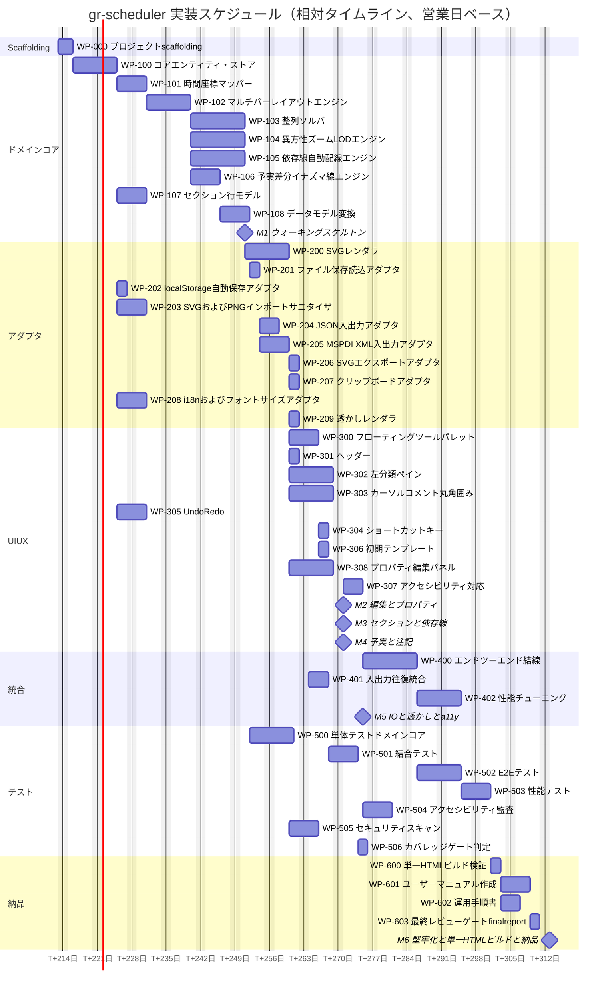

# WBS（作業分解構造） - gr-scheduler

<!-- ============================================================
     COMMON BLOCK | DO NOT MODIFY STRUCTURE OR FIELD NAMES
     ============================================================ -->

## Identification

<!-- FIELD: schema_version | type: string | required: true -->

<doc:schema_version>0.0</doc:schema_version>

<!-- FIELD: file_type | type: enum | required: true -->

<doc:file_type>wbs</doc:file_type>

<!-- FIELD: form_block_cardinality | type: enum | values: single,multiple | required: true -->

<doc:form_block_cardinality>single</doc:form_block_cardinality>

<!-- FIELD: language | type: string (ISO 639-1) | required: true -->

<doc:language>ja</doc:language>

## Document State

<!-- FIELD: document_status | type: enum | values: draft,in-review,approved,archived | required: true -->

<doc:document_status>draft</doc:document_status>

## Workflow

<!-- FIELD: owner | type: string | required: true -->

<doc:owner>progress-monitor</doc:owner>

<!-- FIELD: commissioned_by | type: string | required: true -->

<doc:commissioned_by>orchestrator</doc:commissioned_by>

<!-- FIELD: consumed_by | type: string | required: true -->

<doc:consumed_by>orchestrator</doc:consumed_by>

## Context

<!-- FIELD: project | type: string | required: true -->

<doc:project>gr-scheduler</doc:project>

<!-- FIELD: purpose | type: string | required: true -->

<doc:purpose>
Phase 4（実装）→ Phase 5（テスト）→ Phase 6（納品）を駆動するための作業分解構造（WBS）と
スケジュールを定義する。orchestrator はフェーズ進行判断・ボトルネック識別・並列化計画の
参照元として本書を使用する。implementer / test-engineer への作業パッケージ割当ての土台とする。
</doc:purpose>

<!-- FIELD: summary | type: string | required: true -->

<doc:summary>
docs/spec 配下の12ドメイン要求文書（CANVAS/ITEM/PROP/ALIGN/ZOOM/SECT/DEP/CURS/PLAN/TOOL/IO/NFR）と
CLAUDE.md の Clean Architecture 方針（Entity/UseCase = ドメインコア、Adapter/Framework = SVG描画・
File I/O・localStorage・インポートサニタイザ・i18n）を基に、43件の作業パッケージ（WP-000〜WP-603）を
定義し、依存関係・規模（S/M/L）・マイルストーン（M1〜M6）・Mermaid ガントチャートを提示する。
</doc:summary>

## References

<!-- FIELD: related_docs | type: list | required: false -->

<doc:related_docs>
<doc:input>CLAUDE.md</doc:input>
<doc:input>project-records/traceability/user-order-coverage.md</doc:input>
<doc:input>docs/spec/00-overview.sdoc</doc:input>
<doc:input>docs/spec/25-nfr-a11y.sdoc</doc:input>
<doc:input>project-records/reviews/R1-spec-review.md</doc:input>
<doc:output>project-management/progress/progress.md</doc:output>
</doc:related_docs>

## Provenance

<!-- FIELD: created_by | type: string | required: true -->

<doc:created_by>progress-monitor</doc:created_by>

<!-- FIELD: created_at | type: datetime | required: true -->

<doc:created_at>2026-07-18T00:00:00Z</doc:created_at>

<!-- ============================================================
     FORM BLOCK | wbs: namespace
     ============================================================ -->

## WBS Metrics

<wbs:task_total>43</wbs:task_total>
<wbs:task_completed>0</wbs:task_completed>
<wbs:task_in_progress>0</wbs:task_in_progress>
<wbs:task_blocked>0</wbs:task_blocked>
<wbs:completion_pct>0</wbs:completion_pct>

<!-- ============================================================
     DETAIL BLOCK | free-form, no namespace required
     ============================================================ -->

## 0. 前提・除外事項（Exception）

- 本 WBS 作成時点で `docs/spec/30-architecture.sdoc`（アーキテクチャ確定）・
  `docs/spec/40-data-format.sdoc`（データ形式契約）・`docs/spec/50-test-spec.sdoc`（テスト仕様）は
  **未作成**である。architect エージェントによる正式なコンポーネント設計が完了していないため、
  本書の作業パッケージ境界は `CLAUDE.md`「ドメイン境界（コアロジック）」節および
  `docs/spec/00-overview.sdoc` §3.3（Clean Architecture レイヤ仕訳の方針）を根拠とした**暫定版**である。
- architect が `30-architecture.sdoc` / `40-data-format.sdoc` を確定した時点で、本書の WP 境界・
  要求UID対応・依存関係を再照合し改訂すること（progress-monitor の追跡義務）。本件は orchestrator に
  例外として報告済み（ソースファイル未存在 → 該当設計トレースはドラフト扱いで追跡続行）。
- `src/` `tests/` は現時点で空、Git 未初期化（CLAUDE.md 記載どおり）。`wbs:task_completed = 0` は
  この状態を正しく反映している。
- 規模記号: **S = 概算2人日 / M = 概算4人日 / L = 概算7人日**（単一実装者換算の粗見積り。
  Agent Teams 並列実行（§5）により実時間は短縮され得る）。

## 1. WBS ツリー（作業パッケージ一覧）

```
gr-scheduler 実装（Phase 4-6）
├── WP-000 プロジェクト scaffolding
├── ドメインコア（Entity/UseCase）
│   ├── WP-100 コアドメインエンティティ・ストア
│   ├── WP-101 時間<->座標マッパー
│   ├── WP-102 マルチバー・レイアウトエンジン
│   ├── WP-103 整列（上下左右）ソルバ
│   ├── WP-104 異方性ズーム + LOD エンジン
│   ├── WP-105 依存線自動配線エンジン
│   ├── WP-106 予実差分 + イナズマ線エンジン
│   ├── WP-107 セクション・行モデル
│   └── WP-108 データモデル変換（内部モデル<->JSON<->MSPDI XML）
├── アダプタ（Adapter/Framework）
│   ├── WP-200 SVG レンダラ
│   ├── WP-201 ファイル保存・読込アダプタ（File API）
│   ├── WP-202 localStorage 自動保存アダプタ
│   ├── WP-203 SVG・PNG インポートサニタイザ
│   ├── WP-204 JSON I/O アダプタ
│   ├── WP-205 MSPDI XML I/O アダプタ
│   ├── WP-206 SVG エクスポートアダプタ
│   ├── WP-207 クリップボードアダプタ
│   ├── WP-208 i18n・フォントサイズアダプタ
│   └── WP-209 透かしレンダラ
├── UI/UX
│   ├── WP-300 フローティングツールパレット
│   ├── WP-301 ヘッダー
│   ├── WP-302 左リサイズ可能インデント分類ペイン
│   ├── WP-303 カーソル・コメント・丸角囲み注記
│   ├── WP-304 ショートカットキー
│   ├── WP-305 Undo/Redo
│   ├── WP-306 初期テンプレート
│   ├── WP-307 アクセシビリティ対応（WCAG 2.1 AA）
│   └── WP-308 プロパティ編集パネル（補足追加項目）
├── 統合
│   ├── WP-400 エンドツーエンド結線（ストア・アダプタ・UI）
│   ├── WP-401 入出力往復統合（JSON・XML・SVG・PNG）
│   └── WP-402 性能チューニング
├── テスト（Phase 5）
│   ├── WP-500 単体テスト（ドメインコア）
│   ├── WP-501 結合テスト
│   ├── WP-502 E2E テスト
│   ├── WP-503 性能テスト
│   ├── WP-504 アクセシビリティ監査
│   ├── WP-505 セキュリティスキャン
│   └── WP-506 カバレッジゲート判定
└── 納品（Phase 6）
    ├── WP-600 単一 .html ビルド検証
    ├── WP-601 ユーザーマニュアル作成
    ├── WP-602 運用手順書（MVP では対象外・将来評価）
    └── WP-603 最終レビューゲート・final-report
```

## 2. 作業パッケージ表

凡例: 規模 S=2人日 / M=4人日 / L=7人日。要求UIDは `project-records/traceability/user-order-coverage.md` の
ドメインプレフィックス（CANVAS/ITEM/PROP/ALIGN/ZOOM/SECT/DEP/CURS/PLAN/TOOL/IO/NFR）に対応する。

| ID | 作業パッケージ | 要求UID（代表） | 規模 | 依存（先行） |
|---|---|---|---|---|
| WP-000 | プロジェクト scaffolding（Vite + TS + Vitest + Playwright + ESLint・Prettier + singlefile ビルド設定 + `git init`） | NFR-L1-001 | S | なし |
| WP-100 | コアドメインエンティティ・ストア（Item・Milestone・Task・Property・Ribbon・Section・Dependency・PlanActual の値オブジェクトと不変更新ストア） | ITEM-L1-001, PROP-L1-001, SECT-L1-001, DEP-L1-001, PLAN-L1-001 | L | WP-000 |
| WP-101 | 時間<->座標マッパー（日付・期間とSVG座標の相互変換、ズーム・スクロール追従） | CANVAS-L1-001, CANVAS-L1-005, ZOOM-L1-001, ZOOM-L1-004 | M | WP-100 |
| WP-102 | マルチバー・レイアウトエンジン（1行複数アイテムの重なり回避配置） | CANVAS-L1-002, ITEM-L1-001 | L | WP-101 |
| WP-103 | 整列（上下左右）ソルバ、双方向同期（アイコン移動->プロパティ自動更新） | ALIGN-L1-001, ALIGN-L1-002, ALIGN-L1-003, ALIGN-L2-001, ALIGN-L2-002 | L | WP-102 |
| WP-104 | 異方性ズーム + LOD エンジン（縦横独立ズーム、時間軸粒度自動切替、アイテム自動増減） | ZOOM-L1-002, ZOOM-L1-003, ZOOM-L1-005, ZOOM-L2-001, ZOOM-L3-001 | L | WP-101, WP-102 |
| WP-105 | 依存線自動配線エンジン（9点アンカー、重なり回避、折れ点0-3の経路探索） | DEP-L1-001, DEP-L1-002, DEP-L1-003, DEP-L1-004, DEP-L2-001, DEP-L2-002 | L | WP-102 |
| WP-106 | 予実差分 + イナズマ線エンジン（実績遅延可視化、変更前予定グレー表示） | PLAN-L1-001, PLAN-L1-003, PLAN-L1-004, PLAN-L2-001 | M | WP-101, WP-102 |
| WP-107 | セクション・行モデル（複数行の束ね、順序入替、表示・非表示、小タブ管理） | SECT-L1-001, SECT-L1-002, SECT-L1-003, SECT-L1-004, SECT-L1-005, SECT-L1-006, SECT-L2-001 | M | WP-100 |
| WP-108 | データモデル変換（内部モデル<->JSON、内部モデル<->MSPDI XML の双方向マッピング、純関数） | IO-L1-001, IO-L1-002 | M | WP-106, WP-107 |
| WP-200 | SVG レンダラ（アイテム図形・アイコン・依存線・分類線の描画、色・線幅適用） | ITEM-L1-002, ITEM-L1-006, DEP-L1-001, CANVAS-L1-001 | L | WP-104, WP-105, WP-106, WP-107 |
| WP-201 | ファイル保存・読込アダプタ（File API による .json/.xml ダウンロード・アップロード） | IO-L1-004 | S | WP-108 |
| WP-202 | localStorage 自動保存アダプタ（クラッシュ復旧） | IO-L1-005 | S | WP-100 |
| WP-203 | SVG・PNG インポートサニタイザ（危険要素除去、innerHTML直挿し禁止） | ITEM-L1-008, ITEM-L2-001, IO-L1-006 | M | WP-100 |
| WP-204 | JSON I/O アダプタ（AI向け主データ形式） | IO-L1-001 | S | WP-108, WP-201 |
| WP-205 | MSPDI XML I/O アダプタ（XXE対策・外部エンティティ無効化を含む） | IO-L1-002, IO-L1-006 | M | WP-108, WP-201, WP-203 |
| WP-206 | SVG エクスポートアダプタ（画面のSVG出力） | IO-L1-003 | S | WP-200 |
| WP-207 | クリップボードアダプタ（アイテムのコピペ） | TOOL-L1-003 | S | WP-200 |
| WP-208 | i18n・フォントサイズアダプタ（多言語ラベル、全体フォント大中小） | PROP-L1-003, TOOL-L1-002, NFR-L1-003 | M | WP-100 |
| WP-209 | 透かしレンダラ（ユーザー名+日時、斜め複数タイル、表示切替） | TOOL-L1-007, TOOL-L2-001, TOOL-L2-002, TOOL-L2-003 | S | WP-200 |
| WP-300 | フローティングツールパレット（アイコン主導、未選択時半透明、既定図形・絵文字・インポート起点、予実表示切替） | TOOL-L1-001, ITEM-L1-002, TOOL-L1-006, PLAN-L1-002, NFR-L1-005 | M | WP-200, WP-208 |
| WP-301 | ヘッダー（スケジュール名左上、年月日曜、最小化） | CANVAS-L1-003, CANVAS-L1-004, CANVAS-L1-005 | S | WP-101, WP-200 |
| WP-302 | 左リサイズ可能インデント分類ペイン（分類名固定表示、セクション連動スクロール、小タブ） | SECT-L1-006, CANVAS-L1-006, CANVAS-L1-007, CANVAS-L1-009 | L | WP-107, WP-200 |
| WP-303 | カーソル・コメント・丸角囲み注記（本日線、デュアルカーソル、コメント2種、丸角囲みRズーム非依存） | CURS-L1-001, CURS-L1-002, CURS-L1-005, CURS-L1-006, CURS-L1-007, CURS-L2-001 | L | WP-101, WP-200 |
| WP-304 | ショートカットキー | TOOL-L1-005 | S | WP-300, WP-305 |
| WP-305 | Undo/Redo（コマンド履歴、ストア変更の巻き戻し） | TOOL-L1-004 | M | WP-100 |
| WP-306 | 初期テンプレート（1種） | CANVAS-L1-010 | S | WP-200, WP-300 |
| WP-307 | アクセシビリティ対応（WCAG 2.1 AA、キーボード操作、ARIA、CUDコントラスト検証） | NFR-L1-003, NFR-L1-004, NFR-L1-005, NFR-L1-006 | M | WP-300, WP-301, WP-302, WP-303, WP-304, WP-305, WP-306, WP-308 |
| WP-308 | プロパティ編集パネル（24項目、property名英語固定・値多言語、10色パレットCUD、略称位置ドラッグ）※PROPドメインのUI実体として補足追加 | PROP-L1-002, PROP-L1-004, PROP-L1-005, ITEM-L1-009, ITEM-L1-010 | L | WP-100, WP-200, WP-208 |
| WP-400 | エンドツーエンド結線（ストア・全アダプタ・全UIの配線、双方向同期の統合） | 全ドメイン横断 | L | WP-100〜WP-108, WP-200〜WP-209, WP-300〜WP-308 |
| WP-401 | 入出力往復統合（JSON・XML・SVG・PNGをサニタイザ経由で往復検証） | IO-L1-001, IO-L1-002, IO-L1-003, IO-L1-006 | M | WP-203, WP-204, WP-205, WP-206 |
| WP-402 | 性能チューニング（60fpsズーム・パン、初期表示1.5秒以内、約50行・約1000アイテム基準） | NFR-L1-002 | L | WP-400 |
| WP-500 | 単体テスト（ドメインコア、Vitest、合格率95%以上目標） | 品質目標: 単体テスト合格率95%以上 | L | WP-100〜WP-108 |
| WP-501 | 結合テスト（モジュール境界・データ変換往復、合格率100%目標） | 品質目標: 結合テスト合格率100% | M | WP-401 |
| WP-502 | E2Eテスト（Playwright、UC対応フローPASS） | 品質目標: E2E主要フローPASS | L | WP-400 |
| WP-503 | 性能テスト（60fps・1.5秒NFR達成確認） | NFR-L1-002 | M | WP-402 |
| WP-504 | アクセシビリティ監査（axe自動 + 手動、WCAG 2.1 AA） | 品質目標: アクセシビリティAA | M | WP-307 |
| WP-505 | セキュリティスキャン（CodeQL SAST、npm audit SCA、サニタイザのXXE・XSSファジング、Critical/High=0） | 品質目標: セキュリティ脆弱性Critical0/High0 | M | WP-203, WP-205 |
| WP-506 | カバレッジゲート判定（80%以上、review-agent指摘Critical/High=0との統合ゲート） | 品質目標: コードカバレッジ80%以上 | S | WP-500, WP-501 |
| WP-600 | 単一 .html ビルド検証（完全オフライン環境で全機能動作、外部CDN依存ゼロ確認） | NFR-L1-001 | S | WP-502, WP-503, WP-505, WP-506 |
| WP-601 | ユーザーマニュアル作成（docs/、user-manual-writer） | NFR-L1-003 | M | WP-600 |
| WP-602 | 運用手順書（MVPでは「運用・保守」無効のためスコープ外。共同編集サーバ導入フェーズで再評価するプレースホルダのみ） | STK-L0-018 (Wont) | S | WP-600 |
| WP-603 | 最終レビューゲート・final-report作成（Critical/High=0確認、リリース物一式確認。git tag等はユーザーが手動実施） | 品質目標: レビュー指摘Critical0/High0 | S | WP-601, WP-602 |

## 3. マイルストーン計画（M1〜M6）

| マイルストーン | 内容 | 含む主要WP |
|---|---|---|
| **M1** ウォーキングスケルトン | 1行にマルチバー表示 + ズームが動く最小デモ | WP-000, WP-100, WP-101, WP-102, WP-104, WP-200 |
| **M2** 編集 + プロパティ | ドラッグ編集・整列・Undo/Redo・プロパティパネル・双方向同期が動く | WP-103, WP-108（部分）, WP-201, WP-204, WP-300, WP-305, WP-308, WP-400 |
| **M3** セクション + 依存線 | セクション化・順序入替・表示切替・依存線自動配線・左ペインが動く | WP-105, WP-107, WP-302, WP-400（更新） |
| **M4** 予実 + 注記 | 予実表示切替・イナズマ線・変更前予定グレー表示・カーソル/コメント/丸角囲みが動く | WP-106, WP-303, WP-300（更新） |
| **M5** I/O + 透かし + a11y | JSON・MSPDI XML・SVG入出力、localStorage自動保存、サニタイザ、透かし、WCAG 2.1 AA対応が揃う | WP-108（完成）, WP-202, WP-203, WP-205, WP-206, WP-207, WP-208, WP-209, WP-307, WP-401 |
| **M6** 堅牢化 + 単一HTMLビルド + 納品 | 性能チューニング、全テスト、単一HTMLビルド検証、マニュアル、最終レビューゲート | WP-402, WP-500〜WP-506, WP-600〜WP-603 |

## 4. ガントチャート（Mermaid、相対タイムライン）

日付は実カレンダーではなく、キックオフ起点からの相対営業日を表す暫定アンカー（実運用開始日は
orchestrator がキックオフ時に確定する）。



## 5. 並列化方針（git worktree, Agent Teams）

CLAUDE.md のブランチ戦略に従い、`develop` から `feature/{issue番号}-{説明}` を切って
`git worktree` で並列実装する。WP 依存グラフを踏まえた並列化の勘所は次のとおり。

- **WP-100 完了後が最初の並列化ポイント**: WP-101（時間座標マッパー）と WP-107（セクション・行モデル）は
  WP-100 のみに依存し、互いに独立なので並列着手できる。
- **WP-102 完了後**: WP-103（整列ソルバ）・WP-104（ズームLOD）・WP-105（依存線ルーター）は
  いずれも WP-102 の出力（レイアウト結果）を消費するのみで相互依存がないため、3並列が可能。
  それぞれ専用 worktree・専用ブランチ（例: `feature/103-alignment-solver`,
  `feature/104-zoom-lod`, `feature/105-dependency-router`）で進める。
- **WP-200（SVGレンダラ）着手前にポート（インターフェース）を先に確定する**: WP-100/101/102 の
  段階でレンダラが必要とする出力型（レイアウト結果・依存線経路・LOD情報）を Port として定義しておけば、
  WP-200 はダミー実装（フェイクアダプタ）に対して先行着手でき、ドメインコア側の並列開発とほぼ同時進行できる（DIP）。
- **WP-2xx アダプタ群は WP-108（データモデル変換）確定後に並列化しやすい**: WP-201/202/203/207/208/209 は
  相互依存が薄く、専用 worktree で分担可能。WP-204/205 は WP-201・WP-203 完了を待つため後追いで着手する。
  セキュリティ影響が大きい WP-203（インポートサニタイザ）・WP-205（MSPDI XML、XXE対策）は
  security-reviewer のレビューを並行して挟むこと。
  なお `docker-compose`/`infra/` 相当は本プロジェクトには存在しない（単一HTML・サーバーレス）ため、
  worktree はローカルファイルシステム上の並列チェックアウトのみで完結する。
- **WP-3xx UI/UX 群は WP-200 の Port が確定していれば、ドメインコア・アダプタと同時並行で着手可能**。
  WP-307（アクセシビリティ対応）のみ全 UI コンポーネント完了後の後追い統合作業とする。
- **WP-400（結線）はマージポイント**: 並列開発された各 feature ブランチを `develop` に統合し、
  review-agent の PASS を得てから WP-400 に着手する（`develop -> main` は review-agent PASS 後のみ許可、
  CLAUDE.md ブランチ戦略）。
- テスト（WP-5xx）は test-engineer が各 WP のマージ直後から段階的に単体テストを積み上げる
  （TDD 的に、WP-500 は「WP-100〜108 完了後にまとめて実施」ではなく実装と並行して継続的に追加してよい。
  本 WBS のガント上の位置づけはゲート判定用の最終まとめ工程として表示している）。

## 6. progress-monitor からの申し送り

- 本 WBS は初版（draft）。architect による `30-architecture.sdoc` / `40-data-format.sdoc` 確定後、
  WP境界・要求UID対応・依存関係を再照合し改訂する（orchestrator へ既に例外報告済み）。
- `wbs:task_blocked = 0` だが、上記「前提・除外事項」により WP-200 以降の設計詳細（Port定義等）は
  architect の設計確定待ちの潜在的待機点である。30日以上進捗更新がない場合は循環待機の疑いとして
  orchestrator に即時報告する（本規則 CLAUDE.md 準拠）。
- 次回更新時は `project-management/progress/cost-log.json`・`test-progress.json`・`defect-curve.json` の
  存在を確認し、存在すればコスト・テスト消化・defect カーブの追跡を progress レポートに統合する
  （現時点ではいずれも未作成のため追跡スキップ）。

<!-- ============================================================
     FOOTER | append change_log entry on every write
     ============================================================ -->

## Last Updated

<!-- FIELD: updated_by | type: string | required: true -->

<doc:updated_by>progress-monitor</doc:updated_by>

<!-- FIELD: updated_at | type: datetime | required: true -->

<doc:updated_at>2026-07-18T00:00:00Z</doc:updated_at>

## Change Log

<!-- FIELD: change_log | type: list | append-only | DO NOT MODIFY OR DELETE EXISTING ENTRIES -->

<doc:change_log>
<entry at="2026-07-18T00:00:00Z" by="progress-monitor" action="created" />
</doc:change_log>
